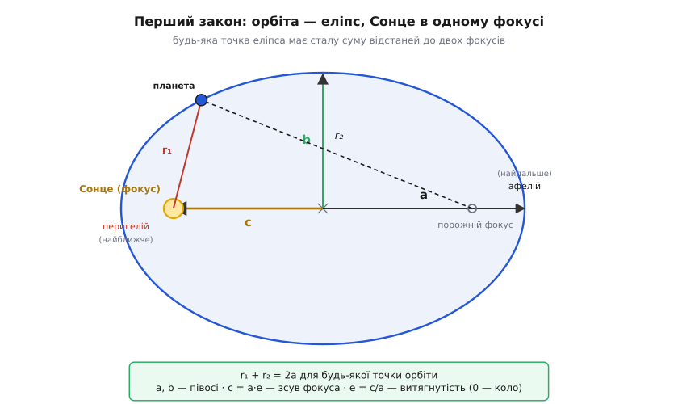
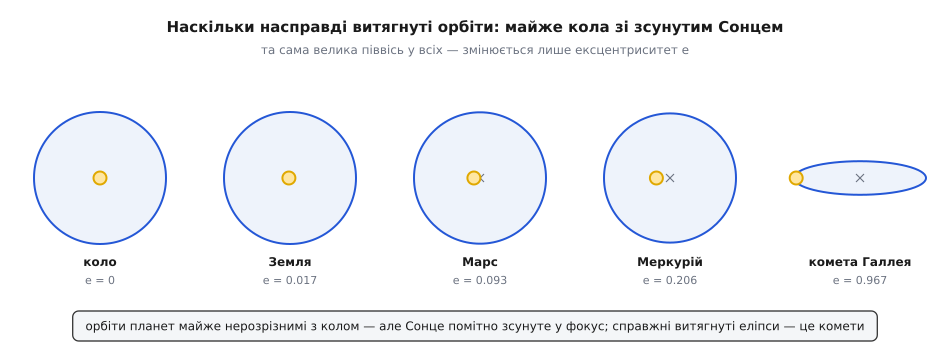
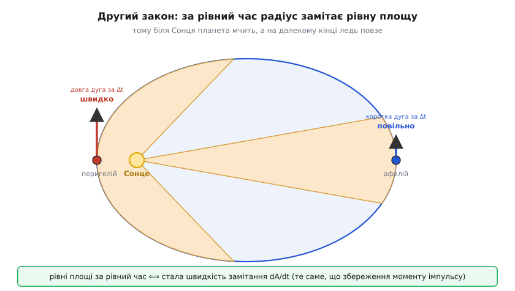
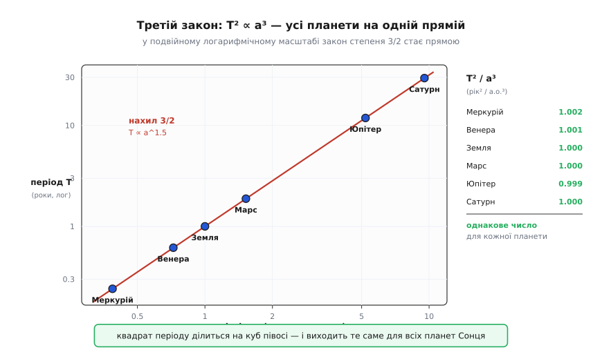

# Закони Кеплера: три прості правила, що зловили планети

<preknowlist>
- [Еліпс](topic:math/ellipse) — витягнуте коло з двома фокусами; сума відстаней від будь-якої його точки до обох фокусів стала.
- [Швидкість](topic:physics/velocity) — як швидко й куди рухається тіло; для орбіти важливо, що вона весь час міняється.
- [Момент імпульсу](topic:physics/angular-momentum) — «кількість обертального руху» `L = m·r·v`; за відсутності закрутного впливу зберігається.
</preknowlist>

Кілька тисячоліть люди дивилися в небо й бачили безлад. Зорі стоять непорушним візерунком, а поміж них блукає жменька яскравих цяток — планети (гр. *planḗtēs* — «блукач»). Вони то женуть уперед, то спиняються, то задкують назад, то знову рушають. Пояснити цей танок означало розгадати влаштування світу, і найкращі уми будували для нього все складніші машини з кіл: планета їде по малому колу, центр якого котиться по великому, а той — ще по одному. Птолемеєва система з десятками таких коліщат-епіциклів давала непогані передбачення, але це був годинник із сотні шестерень, у якому ніхто не розумів, *чому* саме стільки й саме таких.

Йоганн Кеплер (1571–1630) звів увесь цей механізм до **трьох речень**. Не до простішого набору кіл — а до трьох правил, після яких кола стали непотрібні взагалі. Планета біжить еліпсом; біжить нерівномірно, за точним законом площ; і всі планети підкоряються одному числовому зв'язку між розміром орбіти й часом обороту. Три закони — і небесний безлад виявився строгим порядком. Найдивовижніше, що Кеплер вивів їх не з теорії, а **витяг із чисел** — із гори спостережень, найточніших, які тоді існували.

### Звідки взялися ці закони: вперте небо

Точність тут — не дрібниця, а серце історії. Дані Кеплерові дісталися від данця Тихо Браге (1546–1601) — людини, яка півжиття щоночі вимірювала положення планет голим оком крізь великі мідні кутоміри й досягла небаченої доти певності: її похибка була близько двох кутових хвилин (кутова хвилина — одна шістдесята градуса, приблизно товщина монети за сто метрів). Кеплер узявся підігнати під ці виміри орбіту Марса — і кругова модель, хоч як він її крутив, розходилася зі спостереженнями на **вісім кутових хвилин**. Дрібниця, менша за десяту частку градуса. Але Кеплер знав, що Тихо не помиляється на вісім хвилин — щонайбільше на дві. Ці зайві шість хвилин були реальні, і саме через них він відкинув коло — форму, яку від Платона й Арістотеля вважали єдино гідною небес. Уся драма цього перелому — «війна з Марсом», відкинуті овали, роки обрахунків без логарифмів і містична музика сфер, у якій Кеплер шукав третій закон, — зібрана в [окремій історії](topic:physics/keplers-laws/hist-kepler-mars.md).

Варто одразу відділити те, що Кеплер **зробив**, від того, чого він **не знав**. Він знайшов *що* роблять планети — з дивовижною точністю. Але *чому* вони так роблять — яка сила жене їх еліпсом, — лишилося для нього загадкою; це через вісім десятиліть покаже Ньютон. Три закони — чистий опис руху, витягнутий зі спостережень, і саме тому вони такі надійні: вони не спираються на жодну теорію, вони й є те, що видно на небі.

### Перший закон: орбіта — це еліпс

Отже, перше правило. **Кожна планета рухається еліпсом, і Сонце сидить в одному з його фокусів.**

Що таке [еліпс](topic:math/ellipse)? Уявіть, що ви встромили в дошку дві шпильки, накинули на них петлю нитки й натягнули її олівцем. Якщо тепер вести олівцем, тримаючи нитку натягнутою, він викреслить замкнену овальну криву — еліпс (гр. *élleipsis* — «нестача»: цей переріз конуса «не добирає» до повного кола). Дві шпильки — це два **фокуси** (лат. *focus* — «вогнище»; сам термін увів Кеплер). Головна властивість еліпса й ховається в цій нитці: **сума відстаней від будь-якої точки кривої до двох фокусів завжди однакова** й дорівнює довжині натягнутої нитки. Її позначають `2a`, де `a` — велика піввісь, половина найдовшого поперечника еліпса.


*Анатомія орбіти. Сонце — в одному фокусі, другий порожній. Велика піввісь `a` задає розмір, мала `b` — сплюснутість, а зсув фокуса від центра `c = a·e` — наскільки орбіта «з'їхала» набік. Найближча до Сонця точка — перигелій, найдальша — афелій. Для будь-якої точки орбіти r₁ + r₂ = 2a — це й є означення еліпса.*

Наскільки витягнутий еліпс, каже одне число — **ексцентриситет** (лат. *ex-* «поза» + *centrum* «центр») `e = c/a`, де `c` — відстань від центра до фокуса. Коло — це еліпс із `e = 0` (обидва фокуси злилися в центрі). Що ближче `e` до одиниці, то довший і тонший еліпс. І тут ховається несподіванка, яка ламає шкільну картинку «планети літають витягнутими овалами».


*Наскільки насправді витягнуті орбіти. У Землі `e ≈ 0.017`, у Марса `0.093`, навіть у найбільш «овального» Меркурія лише `0.206` — усі ці еліпси майже неможливо відрізнити від кола на око. Революційним був не витягнутий овал (його майже немає), а те, що Сонце сидить **не в центрі**, а зсунуте у фокус. По-справжньому довгі еліпси — це вже комети.*

Планетні орбіти — це майже кола. Земна відходить від ідеального круга настільки мало, що на аркуші паперу ви б не побачили різниці. Тоді за що боровся Кеплер? За те, що **Сонце не в центрі**. Навіть у ледь-ледь сплюснутому еліпсі фокус помітно зсунутий від середини, і цей зсув `c = a·e`, помножений на точність Тихо, і дав ті непримиренні вісім хвилин. Правильна форма орбіти виявилася схожою на коло, але з Сонцем збоку — і саме це «збоку» несе всю фізику.

Дві точки орбіти мають власні імена: найближча до Сонця — **перигелій**, найдальша — **афелій** (гр. *peri* «біля», *apó* «від», *hḗlios* «Сонце»). Їхні відстані від Сонця легко дістати з `a` та `e`.

**Приклад (як далеко Марс від Сонця).** Візьмімо орбіту Марса: велика піввісь `a = 1.524` астрономічної одиниці (а.о. — середня відстань Земля–Сонце), ексцентриситет `e = 0.0934`.

```
перигелій:   r_min = a·(1 − e) = 1.524·(1 − 0.0934) ≈ 1.382 а.о.
афелій:      r_max = a·(1 + e) = 1.524·(1 + 0.0934) ≈ 1.666 а.о.
зсув Сонця:  c = a·e = 1.524·0.0934 ≈ 0.142 а.о.
```

Марс то підходить на 1.38 а.о., то відходить на 1.67 — різниця у відстані понад двадцять відсотків, хоч на вигляд орбіта майже кругла. Саме ця мандрівка планети то ближче, то далі й керує другим законом — тим, як швидко вона летить у кожній точці. Як із `a` та `e` дістати повне рівняння орбіти `r(θ)` — залежність відстані від кута — розписано в [геометрії орбіти](topic:physics/keplers-laws/math-orbital-ellipse.md).

### Другий закон: рівні площі за рівний час

Якщо планета то ближче до Сонця, то далі, то й летить вона по-різному: біля Сонця мчить, на далекому кінці ледь повзе. Наскільки саме по-різному? Кеплер знайшов на це напрочуд елегантну відповідь. Проведімо уявний відрізок від Сонця до планети — радіус-вектор. Поки планета біжить орбітою, цей відрізок замітає площу, як стрілка годинника. **Другий закон: за рівні проміжки часу радіус-вектор замітає рівні площі.**


*Другий закон наочно. За той самий час Δt біля Сонця планета проходить довгу дугу, а вдалині — коротку, зате «худий» далекий сектор виходить такий самий за площею, як «товстий» ближній. Щоб замести однакову площу коротким радіусом, треба покрити великий кут — тому біля Сонця планета розганяється, а віддаляючись, гальмує.*

Вдумаймося, що це означає. Біля Сонця радіус-вектор короткий. Щоб таким коротким радіусом замести за тиждень якусь площу, планета мусить пройти велику дугу — тобто рухатися **швидко**. На далекому кінці радіус довгий, і тієї ж площі вистачає короткої дуги — планета повзе **повільно**. Закон площ — це точний кількісний вираз того, що планета сама розганяється, пірнаючи до Сонця, і сама гальмує, відлітаючи. Ніхто її не підганяє й не стримує спеціально — це виходить автоматично з умови сталої площі.

Чому ж площа замітається рівномірно? Кеплер цього не знав — він просто вичитав правило з чисел. Глибша причина — у збереженні [моменту імпульсу](topic:physics/angular-momentum). Швидкість замітання площі прямо пропорційна до `r²·ω` (радіус у квадраті на кутову швидкість), а це з точністю до маси і є момент імпульсу планети. Оскільки тяжіння тягне планету точно **до Сонця** — вздовж самого радіуса — воно не може ні підкрутити, ні пригальмувати її обертання навколо Сонця: закрутного впливу немає, момент імпульсу стоїть незмінний, і площа тече рівномірно. Але цю причину відкриють згодом; сам закон Кеплер тримав у руках уже 1609 року.

У поворотних точках — перигелії й афелії — швидкість спрямована суто впоперек радіуса (планета в цю мить не наближається й не віддаляється), і сталість `r²·ω` перетворюється на просте правило: `r·v` в цих точках однакове. Звідси швидкості на кінцях орбіти відносяться навпаки до відстаней.

**Приклад (наскільки Земля розганяється взимку).** Земна орбіта має `e = 0.0167`. Відношення швидкостей у перигелії та афелії:

```
v_перигелій     r_афелій      1 + e     1.0167
─────────── = ──────────── = ─────── = ──────── ≈ 1.034
v_афелій       r_перигелій    1 − e     0.9833
```

Земля на найближчому підході до Сонця (початок січня) летить на 3.4% швидше, ніж на найдальшому (початок липня): близько 30.3 проти 29.3 км/с. Через це, до речі, північна зима трохи коротша за північне літо — планета «проскакує» ближній до Сонця відрізок орбіти хутчіше. Для комети з великим `e` ця різниця стає драматичною: комета Галлея біля Сонця мчить у тисячі разів швидше, ніж на далекому краю своєї петлі, де вона ледь повзе роками.

> 🔧 **Навіщо це.** Другий закон — це закон збереження, тому ним рахують, не знаючи всієї орбіти. Досить одного виміру відстані й швидкості в будь-якій точці — і `r·v` (точніше, поперечна складова) дає сталу, що править усією орбітою. Керуючи міжпланетним зондом, інженери не інтегрують щомиті — вони спираються на те, що момент імпульсу тримається, і апарат сам розжене себе до перигелію без жодної краплі пального. Гравітаційний маневр біля планети — «підкрутка» траєкторії задарма — це той самий закон площ, застосований до прольоту повз масивне тіло.

### Третій закон: гармонія періодів

Перші два закони описують **одну** орбіту — її форму й ритм. Третій пов'язує **різні** планети між собою, і саме він схвилював Кеплера найдужче: у ньому він почув ту «музику сфер», яку шукав усе життя. **Третій закон: квадрат періоду обертання пропорційний кубу великої півосі.**

```
T² = k · a³        (k — те саме число для всіх планет однієї зорі)
```

Далека планета не просто робить довше коло — вона ще й летить повільніше, тож її рік розтягується подвійно. Марс удалині від Сонця, і його рік майже вдвічі довший за земний; Юпітер оббігає Сонце за дванадцять років, Сатурн — за тридцять. Кеплерове відкриття в тому, що цей зв'язок не хаотичний, а строгий: візьміть квадрат періоду будь-якої планети, поділіть на куб її півосі — і дістанете **одне й те саме число** для Меркурія, для Землі, для Сатурна.


*Третій закон на всіх планетах відразу. У логарифмічному масштабі степеневий зв'язок `T ∝ a^1.5` стає прямою лінією нахилу 3/2, і всі планети сідають на неї без винятку. А колонка праворуч показує суть іще простіше: `T²/a³` дорівнює одиниці (у роках² на а.о.³) хоч для найшвидшого Меркурія, хоч для неквапного Сатурна — це справді одна константа для всієї Сонячної системи.*

Ця спільність — щось надзвичайне. Вона означає, що орбіти планет не роздали навмання; усі вони підкоряються одному закону, ніби налаштовані одним каменертоном. Якщо виміряти період і розмір орбіти Землі, можна **передбачити** період будь-якої іншої планети, ні разу не глянувши, як вона рухається, — лише знаючи, наскільки далі вона від Сонця.

**Приклад (рік Марса без жодного спостереження Марса).** У зручних одиницях — роки й астрономічні одиниці — для Землі `T = 1`, `a = 1`, тож `T²/a³ = 1`, і те саме число править усіма планетами. Отже, для будь-якої з них просто `T² = a³`. Підставмо велику піввісь Марса `a = 1.524 а.о.`:

```
T = √(a³) = √(1.524³) = √(3.540) ≈ 1.881 року  ≈ 687 діб
```

Марсіанський рік — 687 наших діб. Це рівно те, що показують спостереження, а ми дістали його з однієї піввісі, навіть не дивлячись, як Марс біжить небом. У тому й сила закону: **розмір орбіти диктує час обороту**, і одне однозначно випливає з іншого. Прочитавши цей зв'язок навпаки — від виміряного періоду до розміру, — можна знайти орбіту, а знаючи орбіту супутника й час його обороту, зважити саме центральне тіло: так третій закон «зважує» Сонце, планети й далекі зорі, до яких не дотягтися.

Самі три закони кажуть, якою є орбіта та як швидко планета рухається в кожній точці, але не дають прямої відповіді на буденне питання «а де саме буде планета через рік і три місяці?». Щоб знайти положення в заданий момент, треба обернути закон площ — розв'язати рівняння, яке так і назвали рівнянням Кеплера. Як це роблять на практиці кількома рядками коду — у [обчислювальній вставці](topic:physics/keplers-laws/proj-kepler-equation.md).

> 🔧 **Навіщо це.** Третій закон — це вся практична космонавтика, прочитана у зворотний бік: не «яка орбіта в тіла?», а «яку орбіту взяти, щоб мати потрібний період?». Супутник, що має висіти над однією точкою екватора, мусить обертатися рівно за добу — і закон лишає для цього єдину висоту, близько 36 тисяч кілометрів. Переліт до Марса рахують еліпсом, чию велику піввісь підбирають так, щоб апарат прибув якраз туди, куди за цей час доїде планета. А вимірявши період крихітного супутника довкола далекої зорі, тим самим законом одразу знаходять масу тієї зорі.

### Чому закони справджуються: підпис Ньютона

Кеплер лишив по собі загадку. Три його правила бездоганно описували небо, але висіли в повітрі: *чому* еліпс, а не овал чи спіраль? *Чому* саме рівні площі? *Чому* квадрат періоду й куб півосі, а не якийсь інший степінь? Сам Кеплер вгадував тут якусь силу від Сонця, та звести все докупи не зумів.

Відповідь дав Ісаак Ньютон через вісім десятиліть: усі три закони — наслідки **однієї** сили, [всесвітнього тяжіння](topic:physics/newton-gravitation), що спадає як квадрат відстані. З того, що сила тягне точно до Сонця, випливає закон площ (момент імпульсу зберігається). З того, що вона спадає саме як `1/r²` — не швидше й не повільніше, — випливає, що замкнена орбіта виходить рівно еліпсом, а не якоюсь іншою кривою. І з тієї ж сили строго виводиться `T² ∝ a³`. Три емпіричні правила Кеплера виявилися трьома обличчями одного тяжіння — повне [виведення всіх трьох із `1/r²`](topic:physics/newton-gravitation/math-orbits-kepler.md) робить це видимим крок за кроком.

Ньютон навіть трохи виправив третій закон. Строго кажучи, не планета обертається навколо нерухомого Сонця, а обидва тіла кружляють навколо спільного [центра мас](topic:physics/center-of-mass); тому в точній формулі стоїть сума мас Сонця й планети, і константа `k` для дуже важких планет крихітно відрізняється. Але Сонце в тисячі разів масивніше за будь-яку планету, тож ця поправка мізерна — Кеплерове «одне число для всіх» справджується майже ідеально, і саме тому він зміг вловити його з голих спостережень, нічого не знаючи про маси.

### Що лишається

Три речення Кеплера — еліпс, рівні площі, `T² ∝ a³` — зробили те, чого не змогли сотні епіциклів: вони не описали рух планет, а **стиснули** його до строгого порядку, який можна тримати в голові. Планета біжить еліпсом, сама розганяючись біля Сонця й гальмуючи вдалині, і час її обороту однозначно заданий розміром орбіти — тим самим законом, що й для всіх сусідів. Кеплер знайшов ці правила, довіряючи числам більше, ніж двотисячолітній вірі в досконале коло, і саме та довіра до восьми впертих кутових хвилин Марса перетворила астрономію з каталогу коліщат на точну науку. Ньютон потім пояснив, *чому* закони такі; але *що* саме роблять планети, ми досі знаємо словами Кеплера — і досі за ними водимо кораблі між світами.
