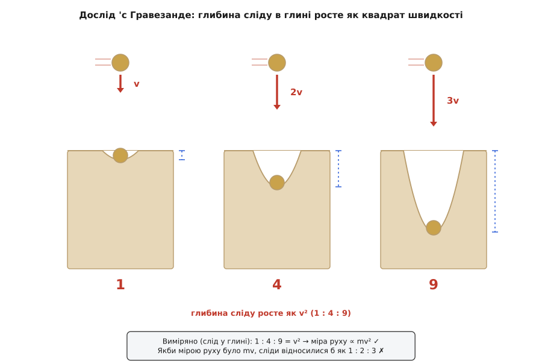
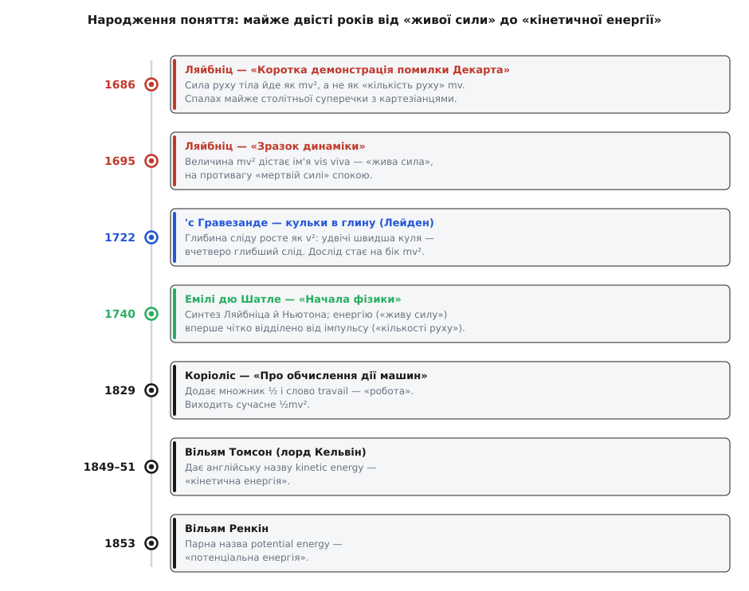

# 📜 Жива сила: майже сто років суперечки, з якої народилася енергія

> Це історія одного слова, що розкололо фізику майже на століття. Одні твердили: міра руху — це маса на швидкість, mv. Інші: ні, маса на швидкість **у квадраті**, mv². Збоку суперечка скидалася на марну гризню про слова. А в ній, непомічене, визрівало найглибше поняття всієї фізики — **енергія**, уперше відділена від **імпульсу**.

Коли тіло рухається, у ньому щось є — це відчуває кожен, хто ловив м'яч чи гальмував авто. Але **що** саме, і **скільки** його? Питання здається дитячим. Проте від Декарта до Кельвіна — понад двісті років — найкращі голови Європи не могли дійти згоди бодай про те, якою **формулою** це «щось» міряти. Історія цієї незгоди — не курйоз, а рідкісна нагода підгледіти, як народжується поняття: не готовим і чистим, а болісно, з плутанини, упертих дослідів і особистих чвар.

---

## Декарт кладе догму: міра руху — це mv

Початок поклав **Рене Декарт** (*René Descartes*, 1596–1650). У «Началах філософії» (*Principia Philosophiae*, 1644) він проголосив: Бог, сотворивши світ, уклав у нього певну **кількість руху** (лат. *quantitas motus*) і відтоді береже її незмінною. А міряється ця кількість просто — маса тіла, помножена на його швидкість, підсумована по всіх тілах світу.

Тут ховається тонкість, важлива для всієї подальшої драми: Декарт брав саме **швидкість як число** (модуль), без напрямку. Його «кількість руху» — це m·|v|, додатна величина, байдужа до того, куди тіло летить. Пізніше **Ісаак Ньютон** (*Isaac Newton*, 1643–1727) виправить цю ваду, зробивши міру руху **напрямленою** — вектором маси на швидкість. Це і є сучасний [імпульс](book:physics/momentum) (кількість руху як вектор: напрямлена величина m·**v**, що зберігається в замкненій системі). Але й у Ньютона мірою лишалося mv — швидкість у першому степені. Отож на весь учений світ панувала догма: рух міряють через **mv**.

Догма була не безпідставна. У багатьох зіткненнях mv справді зберігається, і Декартова інтуїція про «сталу кількість руху в світі» вловила щось глибоко правильне. Проблема була в іншому: mv — не єдина величина, що ховається в русі. Була ще одна, і на неї першим наштовхнувся Ляйбніц.

---

## Ляйбніц б'є на сполох: сила руху йде як квадрат швидкості

**Ґотфрід Вільгельм Ляйбніц** (*Gottfried Wilhelm Leibniz*, 1646–1716) — той самий, що незалежно від Ньютона винайшов числення, — придивився до Декартової догми й побачив у ній помилку. У березні 1686 року він друкує в ляйпцизькому журналі *Acta Eruditorum* коротку, але зухвалу статтю з промовистою назвою: «Коротка демонстрація достопам'ятної помилки Декарта» (*Brevis Demonstratio Erroris memorabilis Cartesii*). Уже із заголовка ясно, що чемності не буде.

Ляйбніців доказ спирався на річ, яку всі вже знали від **Ґалілея** (*Galileo Galilei*): тіло, що впало з висоти h, набирає швидкості v ∝ √h — тобто висота падіння росте як **квадрат** швидкості. Поєднай це з очевидним: підняти вантаж — це вкласти зусилля, а падаючи назад, він те зусилля повертає. Скільки поклав — стільки й дістав. І тут Декартова mv тріщить.

**Ляйбніців мисленнєвий дослід у числах.** Порівняймо два способи витратити однакове зусилля на підняття, а тоді подивімося, з якою швидкістю вантажі падають назад.

```
Ґалілей:  тіло, що впало з висоти h, набирає швидкості  v ∝ √h.
Рівне зусилля підняти = рівний добуток m·h  (робота проти тяжіння ∝ m·h):

   A) підняти масу 1 на висоту 4      зусилля ∝ 1·4 = 4
   B) підняти масу 4 на висоту 1      зусилля ∝ 4·1 = 4     ← те саме зусилля

Швидкість, набрана при падінні назад  (v ∝ √h):
   A) v_A ∝ √4 = 2
   B) v_B ∝ √1 = 1

Міряємо «кількість руху» mv  (за Декартом):
   A) 1·2 = 2        B) 4·1 = 4        →  2 ≠ 4   ✗   зусилля рівні, а mv — ні!

Міряємо «живу силу» mv²  (за Ляйбніцем):
   A) 1·2² = 4       B) 4·1² = 4       →  4 = 4   ✓   рівні зусилля — рівна mv²
```

Ось воно. Якщо міряти рух через mv, то однакові зусилля дають **різну** «кількість руху» — бухгалтерія не сходиться. А варто взяти mv², і все стає на місце: величина, яку підняття запасає, а падіння повертає, — це саме маса на **квадрат** швидкості. Ляйбніц назвав її **живою силою** (лат. *vis viva*) — на противагу «мертвій силі» (*vis mortua*) нерухомого тиску чи натягу. Остаточно термін він викарбував трохи згодом, у трактаті «Зразок динаміки» (*Specimen Dynamicum*, 1695), де чітко розділив силу «живу» (та, що в русі, ∝ mv²) і «мертву» (та, що в спокої).

Зверніть увагу, що Ляйбніц не «спростував» Декарта в тому сенсі, що mv нікуди не зникло. Він знайшов **другу** збережну величину, якої доти ніхто не помічав, — і поспішив оголосити її **єдино правдивою** мірою руху. У цьому поспіху й корінь столітньої суперечки: обидва табори мали по половині правди, а билися так, ніби правда лиш одна.

> 🔧 **Навіщо це.** Ляйбніців аргумент — це, по суті, перше в історії формулювання **закону збереження енергії**, хоч і в зародку. «Скільки вклав, піднімаючи, — стільки повернеш, впавши» — це вже інтуїція про те, що енергія не береться з нічого й не гине. Уся сучасна енергетика, від маятника до гідростанції, стоїть на цій нехитрій бухгалтерії підняв-упало.

---

## Кульки в глину: як дослід став на бік mv²

Суперечку філософів могла розсудити тільки природа. І в 1720-х роках голландський фізик **Віллем 'с Гравезанде** (*Willem 's Gravesande*, 1688–1742), професор у Лейдені, поставив дослід, простіший нікуди: він кидав однакові латунні кульки з різної висоти в брусок м'якої глини й дивився, наскільки глибоко вони вгрузають. Результати він оприлюднив близько 1722 року — і вони виявилися вироком.

Слід у глині виказував швидкість удару без жодної двозначності. Кулька, що влучала вдвічі прудкіше, лишала слід **учетверо** глибший; утричі прудкіша — **вдев'ятеро** глибший. Глибина йшла не як швидкість, а як її **квадрат**. Якби мірою руйнівної здатності кульки була Декартова mv, сліди відносилися б як 1 : 2 : 3. Глина ж уперто виводила 1 : 4 : 9 — рівно v². Природа проголосувала за живу силу.


*Однакові кульки, кинуті зі швидкостями v, 2v, 3v, угрузають у глину на глибину 1, 4, 9 — достоту як v². Якби мірою руху було mv, сліди відносилися б як 1 : 2 : 3. Дослід розсудив суперечку на користь mv².*

Краса цього досліду в тому, що він не потребує жодної теорії, щоб його зрозуміти. Не треба вірити ні Декартові, ні Ляйбніцеві — досить кинути кульку в глину й прикласти лінійку. Саме така **пряма, груба переконливість** і робить його класикою: там, де філософи сперечалися про слова десятиліттями, брусок глини дав відповідь за пообіддя.

---

## Емілі дю Шатле розплутує вузол

Дослід 'с Гравезанде міг би так і лишитися цікавинкою для знавців, якби його не підхопила людина, здатна побачити за кульками в глині щось більше. Такою людиною була **Емілі дю Шатле** (*Émilie du Châtelet*, 1706–1749) — французька математикиня й фізикиня, чий внесок надто довго розчиняли в тіні її славетного супутника Вольтера.

Дю Шатле знала про дослід із перших рук: 'с Гравезанде ділився результатами з нею і з **Вольтером** (*Voltaire*), і вона сама відтворила кидання кульок у глину, щоб пересвідчитися. Але головне вона зробила не руками, а головою. У своїй книзі «Начала фізики» (*Institutions de physique*, 1740) вона взялася за те, на що не наважувалися інші, — **примирити** Ньютона з Ляйбніцем, дві системи, які тодішня наука вважала ворожими. Від Ньютона вона брала строгу механіку сил, від Ляйбніца — живу силу mv²; і показала, що вони не суперечать одна одній, а описують **різні речі**.

Саме в цьому — її справжній, недооцінений внесок. Дю Шатле однією з перших ясно проговорила, що «жива сила» (те, що ми звемо енергією) і «кількість руху» (імпульс) — це **дві окремі збережні величини**, а не два імені однієї. Історики фізики сьогодні визнають за нею формулювання гіпотези про збереження повної енергії як величини, **відмінної від імпульсу**, — тобто одне з перших чітких висловлень самого поняття енергії. Не «підправила формулу», а **розділила два поняття**, які доти злипалися в одне туманне «кількість руху».

> 🔧 **Навіщо це.** Розрізнення, яке провела дю Шатле, — це фундамент усієї механіки зіткнень. В ударі двох тіл **імпульс** зберігається завжди, а **енергія** — лише коли удар пружний. Плутати їх — типова помилка початківця; хто твердо тримає в голові, що це дві незалежні бухгалтерії, той правильно порахує і відскок більярдних куль, і зім'яття авта в аварії.

Дю Шатле не встигла побачити, як її ідеї вкорінюються: вона померла 1749 року, невдовзі після пологів, лишивши по собі ще й французький переклад Ньютонових «Начал» — досі стандартний у Франції. Її книгу перекладали німецькою й італійською, нею зачитувалися, з нею сперечалися; а Ойлер і Лаґранж згодом побудували строгу механіку, спираючись зокрема й на її здобутки.

---

## І Декарт, і Ляйбніц мали рацію

Розв'язка суперечки виявилася несподіваною: **ніхто не помилявся**. Традиційно кінець спору приписують французові **Жанові Лерону д'Аламберові** (*Jean le Rond d'Alembert*, 1717–1783), який у «Трактаті з динаміки» (*Traité de dynamique*, 1743) назвав усю гризню **суперечкою про слова**. Сучасні історики уточнюють, що одна книга навряд чи поставила крапку сама (спір догасав поступово й зусиллями багатьох), — та суть д'Аламберового присуду лишається правильною й донині.

А суть така. mv і mv² — не суперники за титул «істинної міри руху», бо міряють **різні речі**. Придивімося, за чим стоїть кожна:

```
mv   зберігається, коли на тіло діють сила × ЧАС    →  імпульс  (напрям важить)
mv²  зберігається, коли на тіло діє  сила × ШЛЯХ    →  енергія  (напрям байдужий)
```

Штовхни тіло певною силою протягом певного **часу** — воно набере імпульсу рівно F·t; це «кількість руху» Декарта й Ньютона, і вона напрямлена. Штовхни те саме тіло тією ж силою на певному **шляху** — воно набере енергії рівно F·d (це і є [механічна робота](book:physics/work): робота сили дорівнює силі, помноженій на пройдений вздовж неї шлях), і вона вже без напрямку. Час і шлях — дві різні речі; тому й дві різні збережні величини. Декарт зі своєю mv лічив рух **у часі**, Ляйбніц зі своєю mv² — **у просторі**. Обидва мали рацію, просто ставили природі різні питання й дивувалися, чому відповіді не збігаються.

Ось чому столітня суперечка виявилася хибно поставленою від самого початку. Питання «швидкість чи квадрат швидкості?» звучало як «або-або», а насправді відповідь була «і те, і те» — бо в русі захована не одна збережна величина, а **дві**. Розгледіти це — і означало вперше побачити енергію окремо від імпульсу.

---

## ½, «робота» і нарешті ім'я

Лишалося причепурити формулу й дати їй ім'я. І те, і те зробили вже в XIX столітті.

Спершу — множник **½**. Його додав француз **Ґаспар-Ґюстав Коріоліс** (*Gaspard-Gustave de Coriolis*, 1792–1843) у праці «Про обчислення дії машин» (*Du Calcul de l'Effet des Machines*, 1829). Коріоліс дивився на механіку очима інженера: його цікавило, скільки корисної дії дає машина. Він перший ужив слово **travail** — «робота» — для добутку сили на шлях і показав, що зручно поставити перед mv² половинку, бо тоді жива сила точно **дорівнює** роботі, яку тіло здатне виконати. Чому саме ½? Бо якщо чесно скласти всю роботу розгону, півка виринає сама:

```
W = ∫ F·dx = ∫ m·a·dx = ∫ m·(dv/dt)·dx = ∫ m·v·dv = ½·m·v²
```

Половина — не примха й не підгонка, а неминучий слід інтегрування: розганяючи тіло від нуля до v, сила проходить шлях, на якому швидкість наростає, і акуратний підсумок дає рівно ½mv². Відтоді «жива сила» набула сучасного вигляду ½mv² і зрослася з поняттям роботи в одне ціле.

Лишалося ім'я. Слово **vis viva** пахло латиною й старими сварками; нова фізика хотіла свіжого терміна. Його дав британський фізик **Вільям Томсон** (*William Thomson*, 1824–1907), згодом лорд **Кельвін**: близько 1849–1851 років він увів у вжиток англійський вислів **kinetic energy** — «кінетична енергія», від грецького κίνησις (*kínēsis*) — рух. А за пару років, 1853-го, шотландський інженер **Вільям Ренкін** (*William Rankine*, 1820–1872) доточив парну назву для енергії положення — **potential energy**, «потенціальна енергія». Дует, яким фізика послуговується досі, склався саме тоді: кінетична й потенціальна, рух і положення, дві половини механічної енергії.

---

## Чим це відгукнулося

Озирнімося на весь шлях — від Декартової догми до Кельвінового слова.


*Майже двісті років від Ляйбніцевого удару по Декарту до Кельвінового слова «кінетична енергія». Суперечка mv проти mv² виявилася хибно поставленою: обидві величини справжні — просто одна лічить рух у часі (імпульс), а друга в просторі (енергія).*

Що ж, зрештою, показала ця довга гризня? Що «рух» — не одне, а **двоє**. У ньому захована подвійна бухгалтерія: одна книга рахує імпульс (F·t, напрямлена величина, що править зіткненнями), друга — енергію (F·d, ненапрямлена, що править перетвореннями). Століття плутанини було, по суті, повільним прозрінням, що ці дві книги треба вести **окремо**. Доки їх зливали в одне туманне «кількість руху», механіка не могла зрушити; щойно розділили — і відкрилася дорога до збереження енергії, термодинаміки й усієї фізики XIX століття.

- **Живу силу перейменували, але не відкинули.** Ляйбніцева mv², поділена навпіл, — це і є сучасна кінетична енергія ½mv². Змінилися множник і назва, а серце лишилося те саме, що він угадав 1686 року.
- **Декартова mv теж вижила** — під іменем імпульсу, лише виправлена Ньютоном на вектор. Дві величини, за які билися три покоління вчених, спокійно вживаються поряд у кожному підручнику.
- **Дослід переміг авторитет.** Розсудили суперечку не хитромудрі доводи, а кульки в глині — груба, наочна, непереборна очевидність. Природу питали лінійкою, і вона відповіла квадратом.
- **Внесок дю Шатле нарешті названо своїм ім'ям.** Те, що колись приписували «оточенню Вольтера», сьогодні визнають як самостійний крок до поняття енергії — приклад того, як історія науки поволі повертає борги.

Наступного разу, пишучи буденне ½mv², згадайте: за цією скромною формулою стоїть майже сто років суперечки, брусок глини, гостра думка жінки, яку довго не хотіли чути, і повільне, важке народження найважливішого поняття фізики — **енергії**.
