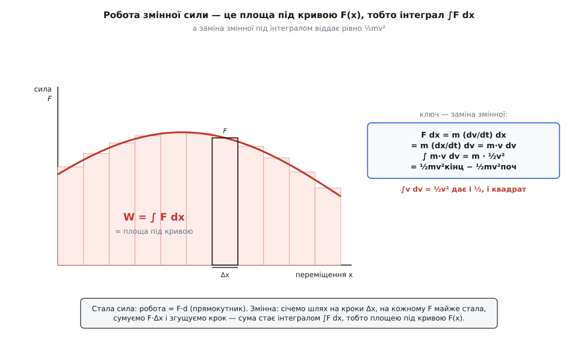
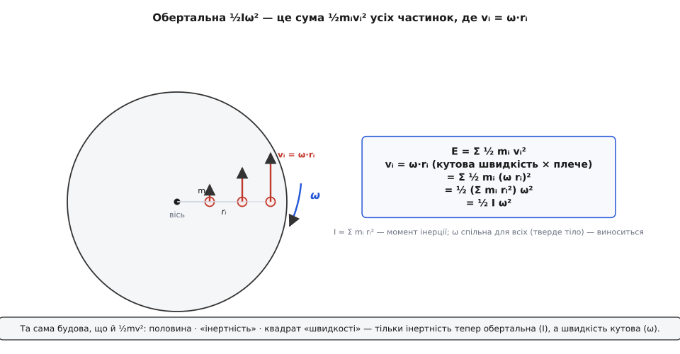

# 🧮 Теорема про кінетичну енергію: звідки ½ і квадрат — усе з одного ∫v dv

Формулу ½mv² можна дістати коротко: штовхай тіло сталою силою, візьми з кінематики v² = 2ad — і прискорення скорочується, лишаючи рівно ½mv². Швидко й правильно, але з прихованою умовою: сила мусить бути **стала**. А в житті сили майже ніколи не сталі. Пружина тисне тим сильніше, чим більше стиснута. Опір повітря росте зі швидкістю. Тяжіння на вигнутій гірці щомиті міняє напрям щодо руху. Тертя гальмівної колодки залежить від притиску. Треба доказ, який витримає **будь-яку** силу вздовж **будь-якого** шляху — і саме він, на відміну від кінематичного трюку, показує головне: ½ і квадрат у формулі не випадкові й не «підкладені руками», а виростають з одного-єдиного інтеграла ∫v dv. Зберемо цей доказ з нуля й подивимося, як народжуються обидва.

## Робота змінної сили — це інтеграл, а не добуток

Робота сталої сили проста: сила на переміщення, W = F·d. Це працює, поки сила не міняється на всьому шляху. А коли міняється?

Тоді робимо те, що завжди рятує, коли величина «пливе» вздовж шляху: січемо шлях на **дуже дрібні** кроки Δx — такі малі, що на кожному сила майже стала. На одному кроці робота — це чесне F·Δx (тут сила майже не встигла змінитися). Сумуємо ці шматочки по всьому шляху й **згущуємо** крок, роблячи Δx усе дрібнішим. У границі сума перетворюється на інтеграл — неперервне підсумовування нескінченно дрібних внесків:

```
W = ∫ F dx        (сума F·Δx у границі дрібного кроку)
```

Геометрично це площа під кривою сили F(x): кожна тонка смужка — це F·Δx, висота на ширину, а всі смужки разом заповнюють площу під графіком. Стала сила дала б прямокутник (F·d — його площа); змінна дає фігуру складнішого обрису, і саме її площу рахує інтеграл. Що таке інтеграл як гранична сума нескінченно дрібних доданків — коротко: неперервний аналог додавання, який складає внески F·dx уздовж усього шляху; докладніше в [Інтегралі](book:math/integral).


*Робота змінної сили — площа під кривою F(x): дрібні прямокутники F·Δx у границі зливаються в інтеграл ∫F dx. А заміна змінної під цим інтегралом віддає рівно ½mv².*

## Ланцюжок, у якому народжуються ½ і квадрат

Тепер найцікавіше. Візьмімо цей інтеграл роботи й підставмо в нього силу за другим законом Ньютона — сила дорівнює масі на прискорення, F = m·a ([другий закон Ньютона](book:physics/newtons-second-law) якраз і зв'язує силу з прискоренням, F = ma). Прискорення — це швидкість зміни швидкості, a = dv/dt. Отже:

```
W = ∫ F dx = ∫ m·a dx = ∫ m (dv/dt) dx
```

Ось вузол, де все й вирішується. У добутку (dv/dt)·dx стоять два нескінченно малі прирости одного й того самого руху — приріст швидкості dv і приріст шляху dx, зшиті часом. Їх можна перегрупувати. Найчистіше це видно через **ланцюгове правило** для прискорення: замість «швидкості зміни швидкості за часом» подивімося на неї як на зміну швидкості вздовж **шляху**, помножену на швидкість руху вздовж того шляху:

```
a = dv/dt = (dv/dx)·(dx/dt) = v·(dv/dx)
```

бо dx/dt — це і є швидкість v. (Ланцюгове правило — техніка похідної складеної величини; коротко: якщо швидкість міняється і з місцем, і з часом, повну зміну за часом дає добуток «зміна з місцем × швидкість проходження місця», [Похідна](book:math/derivative).) Тепер підставмо a = v·(dv/dx) у роботу — і dx у знаменнику скоротиться з dx інтеграла:

```
W = ∫ m·a dx = ∫ m·v·(dv/dx) dx = ∫ m·v dv
```

Дивись, що сталося: інтеграл **по шляху** обернувся на інтеграл **по швидкості**. Сила, час, форма шляху зникли — лишилося чисте ∫m·v dv, де під знаком тільки швидкість. І ось тут, у цьому маленькому ∫v dv, і сидять обидва секрети формули.

Бо ∫v dv = ½v². Це правило степеня для інтеграла: інтегруючи vⁿ, дістаєш vⁿ⁺¹/(n+1); при n = 1 маємо v¹⁺¹/(1+1) = v²/2. Обидва відбитки з'являються **одночасно й самі собою**:

- **½** — це той самий множник 1/(n+1) = 1/2 з правила степеня;
- **квадрат** — це піднятий на одиницю степінь v¹⁺¹ = v².

Ніхто їх не вкладав. Винесемо сталу масу й обчислимо інтеграл від початкової швидкості v₀ до кінцевої v:

```
W = m·∫v dv = m·[½v²]  від v₀ до v  =  ½mv²кінц − ½mv²поч
```

Це і є **теорема про кінетичну енергію**, тепер уже для якої завгодно сили: повна робота дорівнює зміні величини ½mv². Кінематичний трюк із початку — лише окремий випадок, коли сила стала й виходить з-під інтеграла як множник. А глибша правда ось у чому: **щоразу, коли якусь величину будують інтегруванням чогось, пропорційного швидкості, ½ і квадрат неминучі** — це проста арифметика первісної. Із тієї ж причини шлях під сталим прискоренням росте як ½at², а енергія конденсатора виходить ½CU²: усюди за ними стоїть той самий ∫x dx = ½x².

> 🔧 **Навіщо це.** Головна вигода цього виведення — не сама формула, а те, що в ланцюжку **зникли час і форма шляху**. Робота залежить лише від того, яку силу тіло пройшло по відстані, а кінцева ½mv² — лише від кінцевої швидкості. Тому інженер, якому треба знати, з якою швидкістю деталь долетить до упору чи скільки розжене пружина, не інтегрує рівняння руху крок за кроком у часі, а прирівнює роботу до зміни ½mv² й розв'язує одним рядком — енергетичний метод байдужий до того, **як саме** й **скільки часу** тіло рухалося між початком і кінцем.

**Приклад: сила, що слабшає з відстанню.** Брусок масою m = 2 кг штовхають зі спокою силою, яка на старті дорівнює F₀ = 12 Н і рівномірно спадає до нуля на шляху L = 3 м: F(x) = F₀·(1 − x/L). Яку кінетичну енергію він набере й з якою швидкістю зійде з дистанції? Площа під прямою F(x) — це трикутник, тож інтеграл береться усно:

```
W = ∫₀ᴸ F₀·(1 − x/L) dx = F₀·L − F₀·L/2 = ½·F₀·L = ½·12·3 = 18 Дж
v = √(2W/m) = √(2·18/2) = √18 ≈ 4.24 м/с
```

Перевірмо це чисельно — і то двома незалежними дорогами, щоб побачити саму теорему в дії. Один бік рахує роботу як інтеграл ∫F dx (скільки енергії влили). Другий не знає про роботу зовсім: він просто проганяє рівняння Ньютона F = ma крок за кроком і в кінці читає ½mv² (скільки енергії вийшло). Те, що обидва числа збігаються, і **є** теорема:

```py
m, F0, L = 2.0, 12.0, 3.0
F = lambda x: F0 * (1.0 - x / L)          # сила слабшає з відстанню

# бік 1: робота як інтеграл ∫F dx (сума тонких смужок)
N = 200_000
dx = L / N
W = sum(F(i * dx) * dx for i in range(N))          # ≈ 18.0 Дж

# бік 2: незалежно проженемо динаміку F = ma і візьмемо кінцеву швидкість
x, v, dt = 0.0, 0.0, 1e-5
while x < L:
    a = F(x) / m
    v += a * dt                            # напів-неявний крок: спершу швидкість,
    x += v * dt                            # потім позиція вже за новою v (береже енергію)

print(round(W, 2), round(0.5 * m * v * v, 2))      # 18.0  18.0 — сходяться
```

Влита робота дорівнює отриманій кінетичній енергії до останнього знака — а між ними не було жодної згадки про ½mv², лише чесне інтегрування сили по шляху й чесне інтегрування прискорення в часі. Формула ½mv² не постульована, вона **випала** з механіки Ньютона.

## Векторна форма: чому поперечна сила не рахується

Досі шлях був прямий, а сила — уздовж нього. У просторі і те, і те — вектори: переміщення dr дивиться кудись, сила F — кудись інде. Що тоді таке «сила на переміщення»?

Роботу на маленькому кроці дає **скалярний добуток** сили й переміщення:

```
dW = F · dr = |F|·|dr|·cosθ
```

де θ — кут між силою й напрямом руху. Скалярний добуток бере лише ту частину одного вектора, що лежить **уздовж** другого ([Скалярний добуток](book:math/dot-product) двох векторів дорівнює добутку їхніх довжин на косинус кута між ними; він гасне до нуля, коли вектори перпендикулярні). По всьому шляху роботу дає інтеграл цих скалярних добутків — [криволінійний інтеграл](book:math/line-integral) W = ∫F·dr уздовж траєкторії.

Уся суть скалярного добутку тут — **фільтр**. Розкладімо силу на дві складові: поздовжню F∥ (уздовж dr) і поперечну F⊥ (упоперек dr). Тоді:

```
F · dr = F∥·|dr| + F⊥·|dr| = F∥·|dr| + 0
```

бо F⊥ перпендикулярна до dr, а скалярний добуток перпендикулярних векторів — нуль. **Роботу виконує лише поздовжня складова сили.** Поперечна не додає й не віднімає ані джоуля.


*Скалярний добуток F·dr вибирає лише проєкцію сили на напрям руху. Сила поперек переміщення руху не пришвидшує: натяг мотузки, доцентрове тяжіння, вага на горизонтальному кроці — усі виконують нульову роботу.*

Звідси випливає ціла низка на позір загадкових фактів, і всі вони — та сама одна причина:

- **Камінь, розкручений на мотузці** зі сталою швидкістю. Натяг весь час тягне строго до центра, тобто перпендикулярно до руху по колу. Робота натягу — нуль, тому кінетична енергія й швидкість не міняються, хоч сила діє щомиті.
- **Супутник на круговій орбіті.** Тяжіння (воно ж [доцентрова сила](book:physics/centripetal-acceleration), яка тримає тіло на колі й завжди спрямована до центра) перпендикулярне до орбітальної швидкості. Робота нуль — супутник летить зі сталою швидкістю, дарма що Земля тягне його без упину.
- **Вага на горизонтальному кроці.** Ідеш по рівному — тяжіння тягне вниз, крок горизонтальний, кут прямий. Робота ваги нуль; тому рівна хода не коштує роботи проти тяжіння (енергію їсть не вага, а розгойдування тіла й тертя).
- **Нормальна реакція опори** й **магнітна сила Лоренца** qv×B — обидві за побудовою перпендикулярні до руху, тож обидві роботи не виконують ніколи.

Тепер — векторний доказ теореми, який не тільки коротший за скалярний, а й пояснює всю цю перпендикулярну історію **задарма**. Підставмо F = m·(dv/dt) і dr = v dt:

```
W = ∫ F·dr = ∫ m (dv/dt)·(v dt) = ∫ m v·dv
```

І ось перлина. Похідна добутку працює і для скалярного множення векторів, тож розгляньмо, як міняється v·v:

```
d(v·v) = dv·v + v·dv = 2·(v·dv)     ⟹     v·dv = ½·d(v·v)
```

А v·v — це квадрат довжини вектора швидкості, тобто **квадрат модуля швидкості**, v·v = |v|² = v². Підставмо:

```
W = ∫ m·½·d(v²) = ½m·v² − ½m·v₀²
```

Два висновки випадають одразу. **По-перше**, під інтегралом лишилося тільки v·v = квадрат модуля швидкості — векторний доказ сам згорнувся у скалярне ½mv². Кінетичній енергії байдужий **напрям** швидкості, важить лише її **довжина**. **По-друге** — і це найглибше — сила, перпендикулярна до v, дає в цю мить v·dv = 0, тому вона фізично **не здатна** змінити v·v. Перпендикулярна сила лише **повертає** вектор швидкості, не подовжуючи його: стрілка крутиться, а її довжина — отже, і кінетична енергія — лишається тією самою. Ось однорядкова, до кінця чесна причина, чому круговий рух іде зі сталою швидкістю: мотузка чи тяжіння вічно переписують **напрям** швидкості й ніколи — її **модуль**.

> 🔧 **Навіщо це.** «Магнітна сила не змінює швидкості частинки» — не мнемонічне правило, а прямий наслідок того, що сила Лоренца завжди перпендикулярна до v, тож v·dv = 0. На цьому стоїть уся фізика прискорювачів і мас-спектрометрів: магнітне поле **закручує** пучок заряджених частинок на потрібний радіус, але розганяє їх (додає кінетичної енергії) винятково електричне поле — те, що має складову **вздовж** руху. Переплутати ці дві ролі — значить не зрозуміти, чому циклотрон узагалі працює.

## Обертання: та сама машина, згодована сумі Σmᵢrᵢ²

Розкручений маховик нікуди не летить, а напакований енергією так, що страшно підійти. Звідки вона, якщо тіло як ціле стоїть на місці? А звідти, що **кожна його частинка таки рухається** — біжить по своєму колу навколо осі. Складімо кінетичні енергії всіх частинок:

```
E = Σ ½ mᵢ vᵢ²
```

Частинка на відстані rᵢ від осі має швидкість vᵢ = ω·rᵢ, де ω — [кутова швидкість](book:physics/angular-velocity), спільна для всього тіла (швидкість точки дорівнює кутовій швидкості на плече: далі від осі — швидше). Підставмо це в суму:

```
E = Σ ½ mᵢ (ω·rᵢ)² = Σ ½ mᵢ ω²·rᵢ² = ½ ω² · Σ mᵢ rᵢ²
```

Кутова швидкість ω однакова для кожної частинки — тіло тверде, усі його точки за однаковий час повертаються на однаковий кут, — тому ω² чисто виноситься за суму. А те, що лишилося всередині, Σmᵢrᵢ², — властивість самого **розподілу маси** навколо осі, а не руху. Це [момент інерції](book:physics/moment-of-inertia) I — обертальний аналог маси, якому важить не лише скільки маси, а й як далеко вона рознесена від осі:

```
E = ½ I ω²
```


*Обертальна ½Iω² — це підсумована ½mᵢvᵢ² усіх частинок, де vᵢ = ω·rᵢ. Спільна ω виноситься за суму, а Σmᵢrᵢ² згортається в момент інерції I. Будова та сама, що й у ½mv².*

Придивись до кістяка: половина, «інертність», квадрат «швидкості» — точно як у ½mv². Тільки інертність тепер обертальна (I замість m), а швидкість — кутова (ω замість v). Тому тіло, що котиться, несе **обидві** порції одразу: ½mv² за поступальний рух центра плюс ½Iω² за власне обертання — і розігнати колесо важче, ніж просто протягти ту саму масу.

Та сама машина працює й для обертальної теореми про роботу — треба лише переписати той самий ланцюжок кутовими величинами. Обертання розкручує [момент сили](book:physics/torque) τ, а обертальний аналог F = ma — це τ = I·(dω/dt). Проженімо той самий доказ, підставивши кут θ замість шляху й τ замість сили:

```
W_обертальна = ∫ τ dθ = ∫ I (dω/dt) dθ = ∫ I ω dω = ½Iω² − ½Iω₀²
```

Той самий ланцюговий трюк (dω/dt) dθ = ω dω, той самий інтеграл ∫ω dω = ½ω², та сама ½, той самий квадрат. Механізму байдуже, чи змінна — це прямолінійна швидкість, чи кутова: доказ один, лише в різному одязі.

## Що з цього виносимо

Три обличчя однієї математики, і всі — з одного кореня ∫v dv.

Робота змінної сили — це площа під кривою F(x), тобто інтеграл ∫F dx. Підстав силу як m·(dv/dt), переклади її ланцюговим правилом у m·v·(dv/dx), скороти шлях — і робота по відстані обернеться на чисте ∫m·v dv. А цей маленький інтеграл ∫v dv = ½v² штампує на кінетичній енергії **і** ½, **і** квадрат: половина — це множник 1/(n+1) правила степеня, квадрат — піднятий на одиницю степінь. Ніщо не постульоване; ½mv² **випадає** з механіки Ньютона.

У векторах робота — це W = ∫F·dr, і скалярний добуток лишає з сили тільки поздовжню складову. Векторний доказ сам згортається в ½m·(v·v) = ½mv², і те саме v·dv = ½ d(v²) пояснює, чому сила поперек руху повертає вектор швидкості, не подовжуючи його, — а отже, чому натяг мотузки, орбітальне тяжіння й магнітне поле тримають швидкість сталою, скільки б не діяли.

Згодуй тій самій машині суму Σmᵢrᵢ² — і вона віддасть обертальну ½Iω², а той самий ∫ω dω дасть обертальну теорему ∫τ dθ = Δ(½Iω²). Отож ½mv² — не формула, яку треба завчити, а неминучий підпис інтеграла ∫v dv, хоч куди його прикласти.
