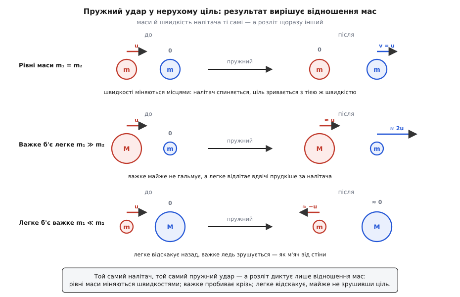

# ⚙️ Крок за кроком: зіткнення двох тіл — що зберігається, а що згоряє

Постав два візки на рейку й штовхни один в один. Про «до» ти знаєш усе: маси й швидкості обох. Що буде «після»? Питання здається дитячим — аж поки не спробуєш відповісти чесно. Тоді виявляється, що самих мас і швидкостей мало: два однаковісінькі за масою й швидкістю візки розлетяться геть по-різному, якщо один обліпити пластиліном, а другий обтягти пружною гумою. Пластилінові злипнуться в одну грудку, гумові пружно відскочать. Отже, у відповідь конче входить щось третє — те, наскільки удар «пружний».

І ось де ховається краса. Одна річ у зіткненні свята й непорушна: [імпульс](book:physics/momentum) зберігається **завжди**, хоч би що ти обтягав на візки. А от кінетична енергія — величина торгована: часом уся вціліє, часом третина згорить на тепло, а часом і майже вся. Розберімо, як за п'ятьма числами на вході — двома масами, двома швидкостями й одним коефіцієнтом «пружності» — порахувати весь розліт, куди дівається втрачена енергія, і чому те, що злипається, губить її найбільше. Рівно цей розрахунок крутить фізичний рушій кожної гри на кожному дотику тіл, його ж робить краш-лабораторія над зім'ятим капотом, і саме ним колись зважили кулю, не спіймавши її.

## Задача: два числа на вході, розліт на виході

Двоє тіл рухаються по одній прямій. Маси m₁ і m₂, швидкості до удару u₁ і u₂ — зі знаком: додатна швидкість дивиться праворуч, від'ємна ліворуч. Треба знайти швидкості після удару, v₁ і v₂, а з ними — імпульс і кінетичну енергію до й після.

Перше рівняння дається задарма й тримається залізно. Поки триває удар, на кожне тіло діє лише сила з боку другого — а ці дві сили за [третім законом Ньютона](book:physics/newtons-third-law) рівні за модулем і протилежні за напрямом. Що одне тіло відбирає в другого імпульсу, те й дістає, тютелька в тютельку; сумарний імпульс двійки нікуди подітися не може:

```
p = m₁·u₁ + m₂·u₂ = m₁·v₁ + m₂·v₂          зберігається завжди
```

Але одне рівняння на дві невідомі v₁, v₂ — це недосказаність. Імпульс каже, скільки руху лишиться **разом**, і мовчить про те, як цей рух поділиться. Обидва візки — липкий і пружний — мають однаковий імпульс до удару, а розлетяться по-різному; отже, самим імпульсом розв'язку не замкнути. Потрібне друге рівняння, і воно мусить нести саме ту «пружність», якої бракує.

## Ідея: один коефіцієнт — від «злиплися» до «відскочили»

Друге рівняння дав дослідним шляхом ще Ньютон у «Началах» (1687) — це так званий **закон відновлення** (його ще звуть Ньютоновим дослідним законом; датування й авторство тут безсумнівні). Ньютон помітив просту річ: із якою відносною швидкістю тіла зближалися перед ударом, із такою (помноженою на сталий множник) вони й розбігаються після. Цей множник і є **коефіцієнт відновлення** e:

```
швидкість розбігання = e · швидкість зближання
v₂ − v₁ = −e·(u₂ − u₁)          e = (розбігання після) / (зближання до)
```

Коефіцієнт e лежить між нулем і одиницею й описує саме «породу» удару:

- **e = 1** — абсолютно пружний удар: тіла розбігаються так само прудко, як зближались. Кінетична енергія ціла (більярдні кулі, сталеві кульки).
- **e = 0** — абсолютно непружний: тіла зовсім не розбігаються, а їдуть далі як одне ціле. Це **злипання** (грудки пластиліну, куля в мішку з піском).
- **0 < e < 1** — реальний удар десь поміж: щось відскочить, щось згорить (тенісний м'яч об корт має e ≈ 0.75, дерев'яна кулька — коло 0.5).

Коефіцієнт e — не всесвітня стала, а властивість пари матеріалів; його міряють дослідом. Найпростіше — впустити м'яч і глянути, на яку частку висоти він відскочив: e = √(h′/h), бо висота відскоку пропорційна квадрату швидкості.

Тепер маємо два рівняння — збереження імпульсу й закон відновлення — і дві невідомі. Розв'язати можна в лоб, підстановкою, але є куди прозоріший шлях, який заразом покаже всю механіку удару наочно. Перейдімо в **систему центра мас**.

Швидкість [центра мас](book:physics/center-of-mass) двійки — це імпульс, поділений на повну масу:

```
V_цм = (m₁·u₁ + m₂·u₂) / (m₁ + m₂)
```

Оскільки імпульс зберігається, а повна маса стала, **V_цм не міняється від удару взагалі** — центр мас пливе собі з тією самою швидкістю до, під час і після. У системі, що рухається разом із ним, повний імпульс дорівнює нулю: обидва тіла завжди мають рівні за модулем і протилежні імпульси, летять назустріч, як на гойдалці-терезах. І весь удар у цій системі — це одна-єдина дія: кожне тіло **розвертається й гальмує в e разів**. Пружний (e = 1) відбиває обидва точно назад із тією ж швидкістю; злипання (e = 0) гасить обидва в нуль — тіла завмирають одне коло одного, тобто разом їдуть зі швидкістю V_цм. Повернувши все з системи центра мас назад на рейку, дістаємо один короткий вираз, що покриває геть усі випадки одразу:

```
v₁ = (1 + e)·V_цм − e·u₁
v₂ = (1 + e)·V_цм − e·u₂
```

Підстав e = 0 — обидві швидкості стають V_цм (тіла злиплися й їдуть як одне). Підстав e = 1 — швидкість кожного тіла «віддзеркалюється» відносно V_цм. А для чисто пружного удару цей вираз розкручується у знайомі шкільні формули:

```
v₁ = ((m₁ − m₂)·u₁ + 2·m₂·u₂) / (m₁ + m₂)
v₂ = ((m₂ − m₁)·u₂ + 2·m₁·u₁) / (m₁ + m₂)
```

У них видно всю фізику пружного удару в нерухому ціль (u₂ = 0), і вона розпадається на три яскраві режими за відношенням мас.

Коли **маси рівні**, чисельник першої дробини занулюється — налітач спиняється намертво, а вся його швидкість перескакує на ціль: тіла просто міняються швидкостями. Це той самий фокус, що й у колисці Ньютона: крайня кулька б'є в ряд, а вилітає протилежна, бо швидкість переходить по черзі від рівної до рівної, ніде не застрягаючи. Коли **важке б'є легке** (m₁ ≫ m₂), важке майже не помічає удару (v₁ ≈ u₁), а легке зривається вперед удвічі прудкіше за налітача (v₂ ≈ 2u₁) — так б'є ключка по легкій шайбі. А коли **легке б'є важке** (m₁ ≪ m₂), легке відскакує майже точно назад (v₁ ≈ −u₁), а важке ледь-ледь зрушується — рівно те, що робить м'яч, ударяючись об стіну: стіна (нескінченна маса) стоїть, м'яч летить назад із тією ж швидкістю.


*Той самий налітач, той самий пружний удар — а розліт диктує лише відношення мас. Рівні маси міняються швидкостями (колиска Ньютона); важке пробиває крізь легке, кидаючи його вперед на ~2u; легке відскакує назад, майже не зрушивши важку ціль (м'яч від стіни).*

## Робочий код: резолвер удару

Задача — числова, невелика й без гарячих циклів: кілька множень і ділень на вхідну п'ятірку. Виразний Python лягає сюди природно — код читається майже як формули вище, і на ньому зручно **побачити**, що імпульс справді не ворухнувся, а енергія просіла. Та є вагома причина показати той самий резолвер і мовою C++: рахунок `collide()` — це буквально те, що фізичний рушій гри чи симуляції робить у **гарячому циклі**, по парі тіл на кожен контакт, тисячі разів за кадр реального часу; там сира швидкодія й ощадливість пам'яті вирішують, і `constexpr`-версія без жодного виділення пам'яті — рідна мова цієї задачі. Обидві мови проходять поріг доречності, тож ядро — у вкладках, ідіоматично в кожній:

:::tabs
```python
def collide(m1, m2, u1, u2, e=1.0):
    """1D-удар із коефіцієнтом відновлення e (0…1). Повертає (v₁, v₂)."""
    vcm = (m1*u1 + m2*u2) / (m1 + m2)        # швидкість центра мас — її фіксує імпульс
    return (1 + e)*vcm - e*u1, (1 + e)*vcm - e*u2

def momentum(m1, m2, w1, w2):
    return m1*w1 + m2*w2

def kinetic(m1, m2, w1, w2):
    return 0.5*m1*w1*w1 + 0.5*m2*w2*w2
```
```cpp
#include <cstdio>

struct After { double v1, v2; };            // швидкості після удару

// Резолвер контакту: рівно це фізичний рушій крутить у гарячому циклі —
// по парі тіл на кожен дотик, тисячі разів за кадр. Ані виділень, ані гілок.
constexpr After collide(double m1, double m2,
                        double u1, double u2, double e) {
    const double vcm = (m1*u1 + m2*u2) / (m1 + m2);   // швидкість центра мас
    return { (1 + e)*vcm - e*u1,                       // v₁
             (1 + e)*vcm - e*u2 };                     // v₂
}

constexpr double kinetic(double m1, double m2, double w1, double w2) {
    return 0.5*m1*w1*w1 + 0.5*m2*w2*w2;
}
```
:::

Уся інша робота — прокрутити п'ятірку через `collide()` й порівняти бухгалтерію до та після. Це вже плюмбінг, і його зручно лишити виразному Python — у C++ це той самий `printf` над результатом `collide()`:

```python
def report(m1, m2, u1, u2, e):
    v1, v2 = collide(m1, m2, u1, u2, e)
    p0, p1 = momentum(m1, m2, u1, u2), momentum(m1, m2, v1, v2)
    k0, k1 = kinetic(m1, m2, u1, u2), kinetic(m1, m2, v1, v2)
    lost = k0 - k1
    print(f"e={e:.2f}:  v₁={v1:+.3f}  v₂={v2:+.3f} м/с   "
          f"імпульс {p0:.3f}→{p1:.3f}   "
          f"КЕ {k0:.3f}→{k1:.3f} Дж  (втрата {lost:.3f} Дж, {100*lost/k0:.1f}%)")
```

> 🔧 **Навіщо це.** Ті самі п'ять чисел і той самий рядок `collide()` — це серце фізики в іграх, робототехніці й краш-симуляціях. Гумовий м'яч, що відскакує від підлоги, ящики, що осідають один на один, робот-маніпулятор, що торкає деталь, — усе це резолвер контакту з тим чи іншим e. Розробник рушія не інтегрує сили удару мікросекунда за мікросекундою (їх ніхто й не знає точно) — він бере готовий закон відновлення й одним рядком видає стан після дотику, зберігаючи імпульс автоматично. Точнісінько так інженер обходить деталі удару в реальному розрахунку.

## Приклад 1: пружний удар — енергія ціла до крихти

**Умова.** Візок m₁ = 2 кг котиться на u₁ = 3 м/с і б'є нерухомий візок m₂ = 1 кг. Удар пружний, e = 1. Знайдімо швидкості після й звірмо обидві бухгалтерії.

```
V_цм = (2·3 + 1·0) / (2 + 1) = 6/3 = 2 м/с

v₁ = (1+1)·2 − 1·3 = 4 − 3 = 1 м/с        (важчий сповільнився з 3 до 1)
v₂ = (1+1)·2 − 1·0 = 4 − 0 = 4 м/с        (легший зірвався до 4)

імпульс до:    2·3 + 1·0            = 6 кг·м/с
імпульс після: 2·1 + 1·4  = 2 + 4   = 6 кг·м/с        ✓ зберігся

КЕ до:    ½·2·3²             = 9 Дж
КЕ після: ½·2·1² + ½·1·4²    = 1 + 8 = 9 Дж             ✓ зберіглась
```

Обидві книги зійшлися: імпульс 6, енергія 9, і жодне число не загубилося. Важчий візок віддав частину руху легшому — той помчав уперед на 4 м/с, — але в сумі і кількість руху, і енергія лишилися ті самі. Це і є пружний удар: рух перерозподілився, нічого не згоріло.

Окремо варто побачити випадок **рівних мас**. Хай m₁ = m₂ = 1 кг, u₁ = 3 м/с, u₂ = −1 м/с (летять назустріч), e = 1. Формули віддають v₁ = u₂ = −1, v₂ = u₁ = 3: тіла просто **обмінялися швидкостями**. Кожне полетіло з тією швидкістю, яку принесло друге. Ось чому в колисці Ньютона одна кулька входить — одна вилітає: за рівних мас пружний удар передає швидкість наскрізь, не лишаючи собі нічого.

## Приклад 2: ті самі візки, але злиплися

**Умова.** Той самий удар — m₁ = 2 кг на u₁ = 3 м/с у нерухоме m₂ = 1 кг, — але тепер візки зчепилися (магніт, липучка, пластилін), e = 0. Що зі збереженнями?

```
v₁ = v₂ = V_цм = 2 м/с          (їдуть далі як одне тіло масою 3 кг)

імпульс після: 3·2 = 6 кг·м/с                          ✓ той самий 6
КЕ після:      ½·3·2² = 6 Дж
КЕ до:         9 Дж   →   втрата 9 − 6 = 3 Дж  (33 %)
```

Ось воно, головне протиставлення в одній картинці. Імпульс **не здригнувся** — усе ті самі 6 кг·м/с, хоч удар був геть інший. А кінетичної енергії третини як не було: 3 джоулі пішли на тепло й на те, щоб зім'яти липучку. Ту енергію не знищено — вона розсіялась у безладний рух молекул зчепки, у крихітну [пластичну деформацію](book:physics/plastic-deformation) й нагрів, — але з упорядкованого руху візків вона зникла назавжди. Злипання — це удар, у якому найбільше руху обертається на тепло. Лишається зрозуміти, **чому саме найбільше** — і чому все одно не вся енергія.

## Чому злипання губить максимум — і чому ніколи не все

Розкладімо кінетичну енергію двійки на дві частини — і весь туман розвіється. Повну КЕ завжди можна записати як суму енергії руху **центра мас** плюс енергії руху тіл **відносно центра мас**:

```
КЕ = ½·(m₁+m₂)·V_цм²   +   ½·μ·(u₁−u₂)²
       └── рух як ціле ──┘     └── відносний рух ──┘

     μ = m₁·m₂ / (m₁+m₂)      «зведена маса» — інертність відносного руху
```

Перша частина, енергія центра мас, тримається на V_цм — а її **намертво фіксує збереження імпульсу**. Хоч який удар, V_цм не міняється, тож і ця енергія недоторкана: спалити її неможливо, бо це означало б спинити центр мас, чого без зовнішньої сили не буває. Друга частина, енергія відносного руху, — єдине, що взагалі можна витратити. А удар діє на неї гранично просто: відносна швидкість множиться на e, тож відносна енергія множиться на **e²**. Звідси вся втрата:

```
ΔКЕ = ½·μ·(u₁−u₂)²·(1 − e²)
```

Тепер усе на долоні. При e = 1 множник (1 − e²) = 0 — не втрачається нічого (пружний удар). Що менше e, то більше згоряє. А при e = 0 множник дорівнює одиниці — **згоряє вся відносна енергія до останку**. Більше спалити фізично нема чого: зафіксована імпульсом енергія центра мас лишається недоторканою хоч би що. Тому абсолютно непружний удар (злипання) — це максимум можливої втрати кінетичної енергії за збереженого імпульсу, і водночас це **не** вся енергія: центр мас як плив, так і пливе, несучи свою незнищенну порцію.

Звірмо з прикладом 2. Зведена маса μ = 2·1/3 = 2/3 кг, відносна швидкість u₁ − u₂ = 3 м/с. Відносна енергія: ½·(2/3)·3² = 3 Дж — рівно ті 3 джоулі, що згоріли при злипанні. А енергія центра мас ½·3·2² = 6 Дж — рівно та, що вціліла. Розклад 9 = 6 + 3 бив точно в ціль.


*Той самий удар при трьох значеннях e. Ліворуч: імпульс скрізь однаковий — збереження не залежить від «пружності». Праворуч: енергія розкладена на зафіксовану імпульсом частку центра мас (зелена, 6 Дж, недоторка) і спалиму відносну (червона). Відносна тане як e²: при e = 1 ціла, при e = 0 згоряє вся на тепло. Зелену основу не спалити нічим — тому злипання губить максимум, але не все.*

Для найчастішого випадку — рух у **нерухому** ціль (u₂ = 0) і повне злипання (e = 0) — частка втраченої енергії стискається в напрочуд просту дробину:

```
ΔКЕ / КЕ_до = m₂ / (m₁ + m₂)
```

І вона одразу пояснює три знайомі крайнощі. Рівні маси при злипанні гублять **половину** енергії. Важке в легке (m₁ ≫ m₂) губить майже нічого — вантажівка, що вбирає в себе камінець, ледь гальмує, і руху в ній лишається майже весь. А легке у важке (m₁ ≪ m₂) губить майже **все**: куля, що грузне в товстій стіні чи в мішку піску, віддає на тепло всю свою енергію до крихти. Саме на цій крайності — і на розділенні двох законів — стоїть один із найгарніших вимірювальних приладів фізики.

## Приклад 3: балістичний маятник — зважити кулю, не спіймавши її

Як виміряти швидкість кулі, коли ти не маєш електроніки, а куля летить швидше за звук? Цю задачу розв'язав англійський математик Бенджамін Робінс 1742 року в «New Principles of Gunnery», винайшовши **балістичний маятник** — перший точний спосіб зміряти швидкість снаряда (авторство й дата тут документовані певно). Ідея геніальна саме тим, що спирається на різницю між нашими двома законами.

Куля масою m влітає в підвішений важкий брусок масою M і грузне в ньому — абсолютно непружний удар, крайній випадок «легке у важке». Далі брусок із кулею гойдається вгору на висоту h, яку легко зміряти. Уся хитрість — не сплутати, **де який закон працює**, бо вони чергуються:

```
Фаза 1 — удар (триває мілісекунди):
   імпульс зберігається (сили тільки внутрішні),
   а КЕ — НІ (майже вся згоряє в бруску):
        m·u = (m + M)·V        →    V = m·u / (m + M)

Фаза 2 — гойдання вгору (триває пів секунди):
   тепер зберігається ЕНЕРГІЯ (тертя знехтуване),
   а імпульс — НІ (тяжіння й підвіс тягнуть іззовні):
        ½·(m+M)·V² = (m+M)·g·h   →    V = √(2·g·h)
```

Зшивши дві фази через спільну швидкість V, дістаємо швидкість кулі через саму лише зміряну висоту:

```python
import math

def bullet_speed(m, M, h, g=9.81):
    """Швидкість кулі за балістичним маятником: маси m (куля), M (брусок), підйом h."""
    V = math.sqrt(2 * g * h)          # фаза 2: енергія гойдання → швидкість зчепки
    return (m + M) / m * V            # фаза 1: імпульс удару → швидкість кулі
```

**Умова.** Куля m = 8 г грузне в бруску M = 4 кг, зчепка підскакує на h = 6 см.

```
V = √(2·9.81·0.06) = √1.177 ≈ 1.085 м/с        швидкість зчепки одразу після удару
u = (0.008 + 4)/0.008 · 1.085 = 501 · 1.085 ≈ 544 м/с    швидкість кулі

частка втраченої КЕ = M/(m+M) = 4/4.008 ≈ 99.8 %
```

Куля летіла коло 544 м/с, а зчепка після удару повзе якихось 1.1 м/с. Майже вся кінетична енергія кулі — 99.8 % — згоріла в бруску на тепло й розчавлене дерево, і для енергії цей удар — суцільна руїна. Але **імпульс** пройшов крізь нього бездоганно, і саме він переніс інформацію про швидкість кулі в неквапливе гойдання, яке вже можна зміряти лінійкою. Ось у чому вся сіль: удар нікчемний для енергії, зате точний для імпульсу; гойдання нікчемне для імпульсу, зате точне для енергії. Ужий кожен закон там, де він святий, — і вловиш кулю, не торкнувшись її.

## Складність і пастки

Обчислення тут копійчане — кілька арифметичних дій, O(1), жодних циклів. Уся тонкість не в лічбі, а в тому, що легко наплутати в самій фізиці.

**Знаки — це половина задачі.** У 1D швидкості **знакові**: обери додатний напрям і тримайся його для всіх чотирьох швидкостей. Тоді одна формула `collide()` однаково правильно бере і лобове зіткнення (швидкості різних знаків), і наздоганяння (одного знаку). Загубиш знак у вхідних даних — дістанеш фізично безглуздий розліт, хоч арифметика й зійдеться.

**Не зберігай енергію крізь удар.** Збереження КЕ — не загальний закон, а частковий випадок e = 1. Прирівняти КЕ до й після — значить нишком припустити ідеальну пружність; на реальному ударі це завищить швидкості. Крізь удар свята лише одна величина — імпульс; енергію бери тільки там, де впевнений у e.

**e живе в [0, 1] — але не завжди.** Значення e = 0 — це мінімум відскоку (злипання), e = 1 — максимум (пружний). Що поза відрізком? e > 1 означає, що енергію в удар **додали** — стиснута пружина розпрямилась, вибухнув заряд, розчепилися магніти («надпружний» розліт, як у ракеті чи при пострілі). Імпульс і тоді зберігається, а КЕ росте. Від'ємне e — беззмістовне (тіла проходили б крізь себе). Тримай цю межу в голові як перевірку здорового глузду.

**Утрата енергії не залежить від спостерігача.** Сама КЕ [різна в різних системах відліку](book:physics/galilean-relativity), а от **згоріла** енергія ΔКЕ = ½·μ·(u₁−u₂)²·(1−e²) — та сама для всіх: у формулу входить лише відносна швидкість u₁−u₂, а вона однакова в будь-якій інерціальній системі. Тепло, що народилося в ударі, реальне й об'єктивне, скільки б спостерігачів на нього не дивилось. Це заразом чудова перевірка розрахунку: якщо твоя «втрата» залежить від того, звідки дивишся, десь закралася помилка.

**Косий удар — це той самий 1D, але вздовж нормалі.** Коли тіла б'ються не в лоб, розклади швидкості на складову **вздовж лінії дотику** (нормаль) і **поперек** неї (дотична). Уся дія — тільки на нормальну складову: до неї застосовуй усе, що вище. Дотична складова у гладкому ударі проходить незмінною (її міняло б лише тертя). Двовимірне зіткнення розпадається на одновимірне по нормалі й вільний проліт по дотичній.

**Зведена маса — це «маса самого удару».** Множник μ = m₁m₂/(m₁+m₂) не випадковий: відносний рух двох тіл поводиться рівно як рух одного тіла масою μ. Тому вся спалима енергія — це ½μv_відн², енергія однієї уявної частинки. Помітивши це, багато задач про удар згортаються до руху єдиного тіла, і рахунок коротшає вдвічі.

## Що винести

Імпульс у зіткненні — закон, що не змигне ніколи: рівні й протилежні сили удару гарантують його збереження хоч би що. Кінетична енергія — величина торгована, і єдиний коефіцієнт відновлення e задає угоду: від e = 0 (злипання, максимум утрати) до e = 1 (пружний відскок, утрати нуль). Найчистіший рушій розрахунку — система центра мас: збереження імпульсу заморожує рух центра мас, а весь удар зводиться до того, що відносний рух множиться на e; лишається повернутися на рейку. Звідси одразу випливає і розліт — `v = (1+e)·V_цм − e·u` для кожного тіла, — і згоріла енергія ½·μ·(u₁−u₂)²·(1−e²): нуль при e = 1, максимум при e = 0, і ніколи не вся, бо енергію центра мас не спалити. А коли потрібне справжнє число — швидкість кулі — зшивай два закони по черзі: імпульс крізь крах удару, енергію крізь гойдання. Дай резолверу п'ять чисел — і він поверне тобі весь розліт одним рядком, а заразом скаже, скільки руху обернулось на тепло.
