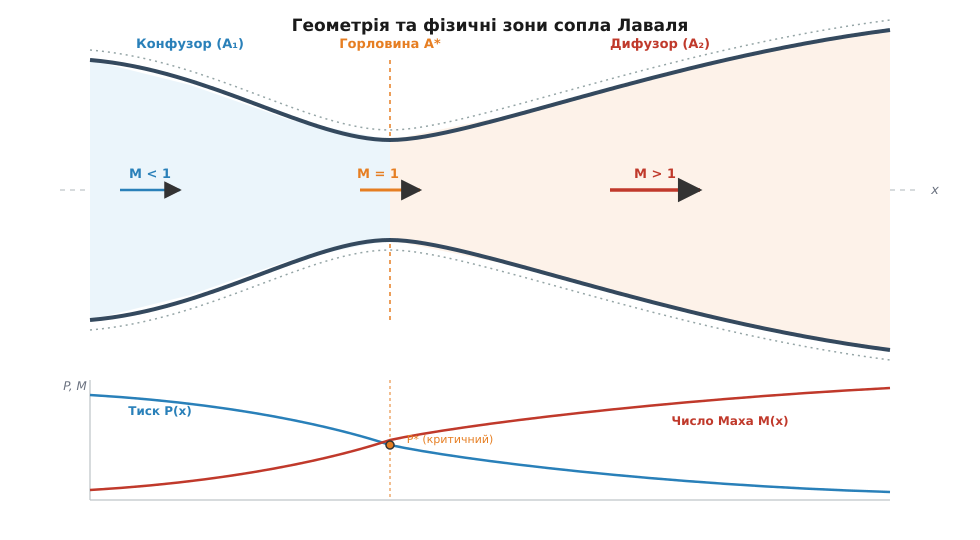
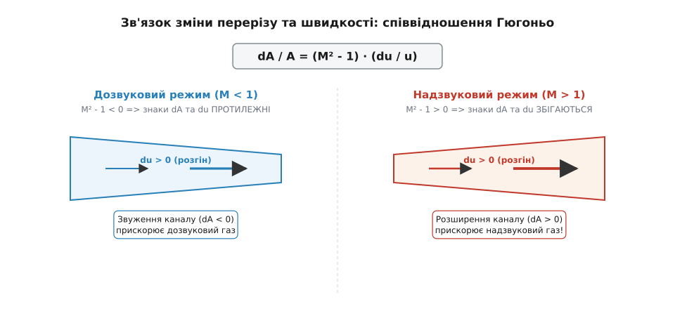
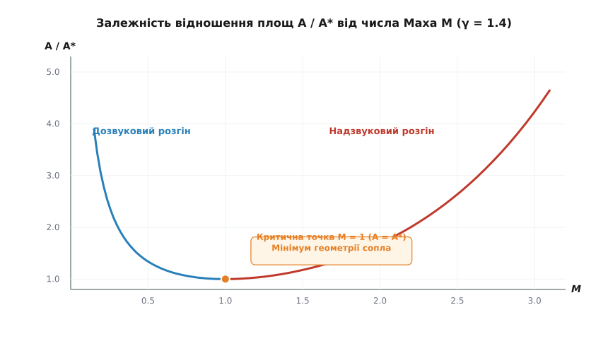
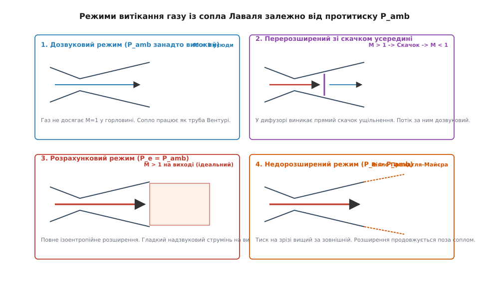
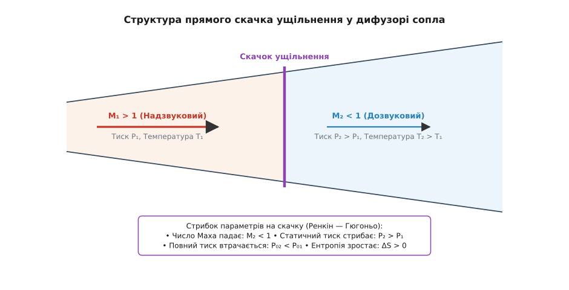

# Сопло Лаваля

<preknowlist>
- [Число Маха](topic:physics/mach-number) — відношення швидкості потоку до місцевої швидкості звуку, критерій стисливості газу.
- [Нерозривність течії](topic:physics/flow-continuity) — закон збереження масової витрати вздовж трубки струменю.
- [Динамічний тиск і число Бернуллі](topic:physics/dynamic-pressure) — зв'язок тиску, густини та швидкості у течії рідин і газів.
</preknowlist>

Коли стислий газ витікає з ресивера високого тиску крізь звичайний звужуваний конічний отвір, його швидкість у найвужчому місці впирається у жорстке фізичне обмеження — місцеву швидкість звуку `M = 1`. Хоч би скільки ми підвищували тиск у резервуарі чи знижували зовнішній протитиск, подальше звуження каналу не здатне розігнати газ швидше за звуковий бар'єр. Причина полягає у термодинаміці стисливого середовища: зі наближенням до швидкості звуку густина газу починає спадати швидше, ніж зменшується площа перерізу. Щоб подолати цей бар'єр і розігнати потік до надзвукових швидкостей, каналу необхідно надати протиінтуїтивної форми: спочатку звузити його до критичного перерізу (горловини), а потім знову розширити. Профільований канал із звужуваною та розширюваною ділянками називається соплом Лаваля.


*Геометричний профіль сопла Лаваля: звужуваний конфузор прискорює дозвуковий газ до M = 1 у горловині A*, а розширюваний дифузор продовжує розгін до надзвукових швидкостей M > 1.*

## Звуковий бар'єр стисливого потоку та геометрія сопла

У класичній нестисливій гідродинаміці, що описує течію крапельних рідин (наприклад, води чи мастила), поведінка потоку в трубі змінного перерізу повністю визначається геометричним рівнянням нерозривності `A · u = const`. Оскільки густина рідини залишається незмінною (`ρ = const`), звуження каналу обов'язково призводить до пропорційного зростання швидкості течії `u`, а розширення — до сповільнення. Відповідно до рівняння Бернуллі, зростання кінетичної енергії відбувається за рахунок зменшення статичного тиску. Цей принцип лежить в основі роботи вимірювальних труб Вентурі, ежекторів та карбюраторів.

Однак при течії високошвидкісних газів (повітря, пари, продуктів згоряння ракетного палива) густина більше не є константою. Газ є високостисливим середовищем, внутрішня енергія якого безпосередньо пов'язана з тиском і температурою. Повний закон збереження маси для стаціонарної течії має вигляд:

```
m_dot = ρ · u · A = const
```

У дозвуковому режимі (`M << 1`) відносні зміни густини `dρ / ρ` є мізерно малими порівняно зі змінами швидкості `du / u`. Газ поводиться майже як нестислива рідина: при звуженні каналу швидкість зростає, а густина змінюється незначно. Проте коли швидкість потоку наближається до місцевої швидкості звуку `a = √(γ · R · T)`, стисливість стає панівним фактором. Падіння тиску уздовж каналу викликає настільки стрімке розширення газу і відповідне падіння густини `ρ`, що для пропущення тієї самої масової витрати `m_dot` потоку потрібно більше об'ємного простору.

Швидкість звуку у суцільному середовищі виступає не просто характеристикою акустичних коливань, а фундаментальною швидкістю поширення малих збурень тиску та густини. У дозвуковому потоці (`u < a`) будь-яка зміна тиску внизу за течією створює звукову хвилю, яка поширюється назустріч потоку зі швидкістю `a - u` і «попереджає» вищележачі шари газу про наявність перешкоди або зміну перерізу. Це дозволяє потоку плавно перерозподіляти лінії струму та перебудовувати тиск ще до входу у вузьку частину каналу.

Якщо ж потік досягає швидкості звуку (`u = a`), швидкість поширення збурень назустріч потоку падає до нуля (`a - u = 0`). Акустична хвиля більше не може просунутися вгору проти течії. Всі зміни тиску, що відбуваються у розширюваній частині каналу чи у зовнішньому середовищі, виявляються повністю ізольованими від вхідної частини сопла.

Якщо продовжувати звужувати канал після досягнення швидкості звуку, потік не зможе вміститися у менший переріз без перебудови всієї структури хвильового поля. Поширювані проти течії акустичні збурення блокуються самим потоком, що рухається зі швидкістю звуку. Єдиним способом забезпечити дальше прискорення газу після досягнення звукового бар'єра є примусове збільшення площі поперечного перерізу каналу.

Геометрично сопло Лаваля складається з трьох послідовних функціональних зон:

1. **Конфузор (звужувана частина `A₁`):** ділянка плавно зменшуваного перерізу, в якій дозвуковий потік (`M < 1`) прискорюється від початкового стану спокою у камері згоряння або ресивері до високих дозвукових швидкостей. Звуження каналу створює сприятливий падавальний градієнт тиску, що стабілізує пориви та запобігає відриву межового шару від стінок. Кут звуження конфузора зазвичай становить від 15° до 45°.
2. **Горловина або критичний переріз (`A*`):** точка геометричного мінімуму площі каналу (`dA = 0`). Саме у цьому перерізі при достатньому перепаді тиску потік досягає місцевої швидкості звуку (`M = 1`). Геометрія горловини визначає максимальну масову витрату газу крізь сопло. Профіль горловини виконують радіально заокругленим для відсутності локальних скачків тиску.
3. **Дифузор (розширювана частина `A₂`):** ділянка плавно зростаючого перерізу, в якій надзвуковий потік (`M > 1`) продовжує прискорюватися до чисел Маха `M > 2...5`, а статичний тиск і температура спадають до дуже низьких значений. Кут розкриття дифузора підбирають так, щоб запобігти відриву надзвукового межового шару (зазвичай 8°–15° для конічних сопел).

Історичний шлях від парових турбін XIX століття до ракетних двигунів детально висвітлено у вставці [Від парових турбін Густафа де Лаваля до ракетних двигунів ХХ століття](topic:physics/laval-nozzle/hist-laval-nozzle.md).

## Газодинамічний механізм: Співвідношення Гюгоньо

Щоб зрозуміти, чому розширення каналу у надзвуковому режимі прискорює газ, а не гальмує його, звернемося до фундаментального рівняння газової динаміки — диференціального співвідношення Гюгоньо.

Розглянемо диференціальну форму рівняння нерозривності для квазіодновимірної течії вздовж осі `x`:

```
d(ρ · u · A) = 0  =>  dρ / ρ + du / u + dA / A = 0
```

Закон збереження імпульсу Ейлера за відсутності в'язкого тертя пов'язує зміну тиску і швидкості уздовж лінії струму:

```
ρ · u · du + dP = 0  =>  u · du + dP / ρ = 0
```

Враховуючи, що для ізоентропійного процесу швидкість звуку пов'язана з тиском і густиною співвідношенням `a² = (dP / dρ)_s`, підставимо `dP = a² · dρ` у рівняння руху Ейлера:

```
u · du + a² · (dρ / ρ) = 0  =>  dρ / ρ = - (u / a)² · (du / u) = - M² · (du / u)
```

Це співвідношення виявляє глибоку фізичну суть стисливого потоку: відносна зміна густини `dρ / ρ` пропорційна відносній зміні швидкості `du / u`, помноженій на квадрат числа Маха `M²`. 

- При малих числах Маха (`M -> 0`) зміна густини практично дорівнює нулю (`dρ / ρ ≈ 0`). Фізика потоку повністю нестислива.
- При звуковій швидкості (`M = 1`) відносна зміна густини за модулем точно дорівнює відносній зміні швидкості (`dρ / ρ = - du / u`). Зміна густини точно компенсує зміну швидкості у масовому потоці `j = ρ · u`.
- При надзвукових швидкостях (`M > 1`) відносна зміна густини перевищує зміну швидкості в `M²` разів. Для `M = 2` падіння густини відбувається у 4 рази швидше за зростання швидкості, а для `M = 3` — у 9 разів!

Оскільки при надзвуковому розгоні густина спадає з колосальною прискореною швидкістю, маса газу просто не зможе пройти крізь вузький канал без неперервного збільшення фізичного об'єму поперечного перерізу.

Підставляючи вираз для `dρ / ρ` назад у рівняння нерозривності, отримуємо диференціальне співвідношення Гюгоньо:

```
- M² · (du / u) + du / u + dA / A = 0
(1 - M²) · (du / u) + dA / A = 0
dA / A = (M² - 1) · (du / u)
```


*Знак дужки (M² - 1) у співвідношенні Гюгоньо визначає протилежну графічну реакцію швидкості на зміну перерізу у дозвуковому та надзвуковому режимах.*

Аналіз співвідношення `dA / A = (M² - 1) · (du / u)` демонструє глибоку фізичну симетрію:

1. **Дозвукова течія (`M < 1`):** множник `(M² - 1) < 0`. Для того щоб збільшити швидкість (`du > 0`), площа каналу повинна зменшуватися (`dA < 0`). Конфузор прискорює дозвуковий газ. Звуження каналу компенсує слабку стисливість.
2. **Надзвукова течія (`M > 1`):** множник `(M² - 1) > 0`. Для того щоб збільшити швидкість (`du > 0`), площа каналу повинна збільшуватися (`dA > 0`). Дифузор прискорює надзвуковий газ! Розширення каналу необхідне для того, щоб вмістити газ, густина якого стрімко падає.
3. **Перехідний стан (`M = 1`):** при `M = 1` ліва частина перетворюється на нуль (`M² - 1 = 0`), що вимагає `dA = 0`. Отже, безперервний плавний перехід через швидкість звуку можливий **виключно у точці екстремуму площі** — критичному перерізі (горловині).

Повне математичне виведення термодинамічних співвідношень та ізоентропійних функцій винесено у вставку [Газодинамічні рівняння ізоентропійного сопла та диференціальний зв'язок Гюгоньо](topic:physics/laval-nozzle/math-isentropic-nozzle.md).

## Термодинаміка розширення та газодинамічні функції

Під час руху газу крізь сопло відбувається незворотне перетворення потенціальної енергії тиску та внутрішньої теплової енергії хаотичного руху молекул у спрямовану кінетичну енергію макроскопічного потоку. 

З закону збереження енергії для адіабатичного потоку випливає сталість температури повного гальмування `T₀` (температури, яку мав би газ, якби його адіабатично загальмували до повної зупинки `u = 0`):

```
h + u² / 2 = h₀  =>  C_p · T + u² / 2 = C_p · T₀
```

Виражаючи питому теплоємність `C_p = γ · R / (γ - 1)` та швидкість звуку `a² = γ · R · T`, отримуємо співвідношення для температури гальмування:

```
T₀ / T = 1 + ((γ - 1) / 2) · M²
```

Якщо знехтувати в'язким тертям об стінки сопла та теплообміном із зовнішнім середовищем, течію можна вважати **ізоентропійним процесом** (`S = const`). Для ідеального газу з постійним показником адіабати `γ` параметри потоку у довільному перерізі пов'язані з параметрами повного гальмування у форкамері (`P₀`, `T₀`, `ρ₀`) через газодинамічні функції числа Маха `M`:

```
P₀ / P = [ 1 + ((γ - 1) / 2) · M² ]^( γ / (γ - 1) )

ρ₀ / ρ = [ 1 + ((γ - 1) / 2) · M² ]^( 1 / (γ - 1) )
```

Зміни параметрів газу залежно від показника адіабати розраховуються для різних типів газів. Для одноатомних газів (аргон, гелій, `γ = 1.67`) розширення відбувається найсильніше, для двоатомних (повітря, азот, `γ = 1.4`) — середня інтенсивність, для багатоатомних продуктів згоряння ракетних палив (`γ = 1.2...1.25`) — падіння температури відбувається повільніше.

У критичному перерізі при `M = 1` статичні параметри досягають критичних значень `P*`, `T*`, `ρ*`. Для повітря та інших двоатомних газів (`γ = 1.4`):

```
T* / T₀ = 2 / (γ + 1) = 2 / 2.4 ≈ 0.8333

P* / P₀ = [ 2 / (γ + 1) ]^( γ / (γ - 1) ) = (1 / 1.2)^3.5 ≈ 0.5283

ρ* / ρ₀ = [ 2 / (γ + 1) ]^( 1 / (γ - 1) ) = (1 / 1.2)^2.5 ≈ 0.6339
```

Це означає, що для досягнення звукової швидкості у горловині сопла тиск у ній має впасти до **52.8%** від повного тиску гальмування `P₀` у форкамері. Для продуктів згоряння ракетних двигунів (`γ ≈ 1.2`) критичне відношення тиску становить `P* / P₀ ≈ 0.5644`.


*Крива відношення площ A / A* має чіткий мінімум у критичній точці M = 1 (A = A*), розгалужуючись на дозвукову та надзвукову вітки.*

З комбінації рівняння нерозривності та ізоентропійних співвідношень випливає важлива алгебраїчна залежність між геометрією сопла `A / A*` та числом Маха `M`:

```
A / A* = (1 / M) · [ (2 / (γ + 1)) · (1 + ((γ - 1) / 2) · M²) ]^( (γ + 1) / (2 · (γ - 1)) )
```

Як видно з графіка, для кожного геометричного відношення площ `A / A* > 1` існує **два математичних розв'язки**: один дозвуковий (`M < 1`) для конфузора і один надзвуковий (`M > 1`) для дифузора. Фізична реалізація того чи іншого розв'язку визначається зовнішнім перепадом тиску `P₀ / P_amb`.

> 🔧 **Навіщо це.**
> Зміна геометричного відношення площ `A_e / A*` на зрізі ракетного двигуна є головним важелем оптимізації питомого імпульсу `I_sp`. Для двигунів першого ступеня (робота в атмосфері при `P_amb ≈ 101 kPa`) відношення площ обирають помірним (`A_e / A* ≈ 15...35`), щоб уникнути відриву потоку. Для вакуумних ступенів, які працюють у космосі (`P_amb ≈ 0`), сопла виготовляють із величезним ступенем розширення (`A_e / A* ≈ 100...200`), що дозволяє витиснути максимум кінетичної енергії з газу і розгонити продукты згоряння до швидкостей понад 4500 м/с.

## Критичне запирання течії та гранична масова витрата

Явище критичного запирання (дроселювання сопла, *choked flow*) — це фундаментальний граничний ефект газової динаміки стисливого середовища.

Уявімо експеримент: маємо ресивер із постійним тиском `P₀` та регульований вентиль на виході сопла Лаваля, який знижує зовнішній протитиск `P_amb`.

1. Коли `P_amb = P₀`, руху немає, витрата `m_dot = 0`.
2. При невеликому зниженні протитиску (`P* < P_amb < P₀`) у соплі виникає дозвукова течія. Швидкість у горловині зростає, але залишається дозвуковою (`M_throat < 1`). Масова витрата `m_dot` зростає зі зниженням `P_amb`.
3. Коли протитиск знижується до критичного значення `P_amb = P*` (або нижче), тиск у горловині досягає `P*`, а швидкість стає дорівнювати швидкості звуку (`M_throat = 1`).

З цього моменту масова витрата через сопло сягає свого **абсолютного фізичного максимуму** `m_dot_max` і більше не збільшується при подальшому зниженні протитиску `P_amb` (навіть при витіканні в абсолютний вакуум `P_amb = 0`).

Фізичне пояснення критичного запирання полягає у тому, що будь-яка зміна тиску у зовнішньому середовищі поширюється вгору за течією у вигляді акустичних хвиль зі швидкістю звуку `a`. Оскільки швидкість самого потоку у горловині дорівнює `a` (`M = 1`), акустичні хвилі не можуть проникнути крізь горловину назад у форкамеру. Потік у горловині «не знає» про те, що протитиск поза соплом упав ще нижче. Горловина стає інформаційним бар'єром для хвильових процесів.

Формула максимальної масової витрати запертого сопла має вигляд:

```
m_dot_max = A* · P₀ · √( γ / (R · T₀) ) · [ 2 / (γ + 1) ]^( (γ + 1) / (2 · (γ - 1)) )
```

Це означає, що масова витрата запертого сопла повністю визначається трьома величинами: площею горловини `A*`, тиском гальмування `P₀` та температурою гальмування `T₀`. Формула критичної витрати є основою розрахунку дозаторів газу, каліброваних жиклерів, забійних клапанів нафтогазових свердловин та витратомірів маси.

## Нерозрахункові режими витікання та скачки ущільнення

У реальних умовах сопло Лаваля з фіксованою геометрією `A_e / A*` змушене працювати при різних значеннях зовнішнього атмосферного тиску `P_amb` (наприклад, під час підйому ракети від рівня моря до верхніх шарів атмосфери). Залежно від співвідношення тиску на зрізі сопла `P_e` та протитиску `P_amb` виникають чотири характерні режими витікання.


*Чотири класичні режими витікання газу з сопла Лаваля залежно від рівня зовнішнього протитиску P_amb.*

### 1. Дозвуковий режим (труба Вентурі)
Якщо перепад тиску недостатній (`P_amb` занадто високий), газ у горловині не досягає швидкості звуку (`M_throat < 1`). У конфузорі потік прискорюється, а у дифузорі — гальмується, відновлюючи тиск. Сопло працює як звичайна труба Вентурі без утворення надзвукової зони.

### 2. Перерозширений режим із прямим скачком ущільнення
Якщо тиск у горловині досяг `P*` (`M = 1`), але зовнішній протитиск `P_amb` є значно вищим за розрахунковий тиск на зрізі `P_e`, у розширюваній частині сопла (дифузорі) виникає нестабільність. Надзвуковий потік, розігнавшись після горловини до `M > 1`, не може плавно вийти в середовище з високим тиском. Усередині дифузора спонтанно виникає тонкий неізоентропійний шар — **прямий скачок ущільнення** (ударна хвиля).


*Схема прямого скачка ущільнення у дифузорі: надзвуковий потік M₁ > 1 миттєво гальмується до дозвукового M₂ < 1 із стрибкоподібним зростанням статичного тиску та втратою повного тиску P₀.*

На прямому скачку ущільнення відбуваються надзвичайно стрімкі незворотні зміни параметрів (рівняння Ренкіна — Гюгоньо):

- Число Маха мгновенно падає з надзвукового `M₁ > 1` до дозвукового `M₂ < 1`.
- Статичний тиск стрибкоподібно зростає від `P₁` до `P₂ > P₁`.
- Відбувається незворотна дисипація кінетичної енергії в тепло, супроводжувана падінням повного тиску `P₀₂ < P₀₁` та зростанням ентропії `ΔS > 0`.
- За скачком потік продовжує рух у розширюваному дифузорі як дозвуковий, сповільнюючись і додатково підвищуючи тиск до атмосферного `P_amb` на виході.

При подальшому зниженні протитиску `P_amb` прямий скачок зміщується за течією ближче до зрізу сопла, а потім виходить за межі сопла, перетворюючись на систему косих скачків ущільнення (диски та ромби Маха).

При сильно вираженому перерозширенні статичний тиск газу біля стінок дифузора спадає значно нижче атмосферного. Коли несприятливий градієнт тиску перевищує критичну межу (критерій Заммерфільда / Шмукера: `P_wall / P_amb < 0.35...0.4`), відбувається відрив межового шару від стінок сопла. Відрив потоку виникає асиметрично і супроводжується руйнівними боковими вібраційними навантаженнями (*side loads*), які можуть розірвати розтруб двигуна під час старту на рівні моря.

### 3. Розрахунковий (ідеальний) режим (`P_e = P_amb`)
Тиск на зрізі сопла `P_e` точно дорівнює протитиску довкілля `P_amb`. Потік усередині сопла є повністю ізоентропійним, а зріз сопла залишає гладкий паралельний надзвуковий струмінь без ударних хвиль та віял розширення. Це забезпечує максимальний ККД перетворення енергії та відсутність бокових сил.

### 4. Недорозширений режим (`P_e > P_amb`)
Зовнішній тиск нижчий за тиск на зрізі сопла (типова ситуація для ракетних двигунів на великій висоті або у вакуумі). Газ виходить зі зрізу сопла з надлишковим тиском і продовжує розширюватися вже у відкритому просторі поза соплом. На кромці зрізу формується центрована хвиля розширення — **віяло розширення Прандтля — Майєра**. Струмінь газу розширюється убік, утворюючи характерну бочкоподібну структуру.

## Конструювання сопел у ракетній техніці та промисловості

У реальному інженерному проектуванні геометрія сопла Лаваля відхиляється від простого гладкого конуса для досягнення максимальних експлуатаційних характеристик.

```
+-------------------------------------------------------------------+
|               ТИПИ ГЕОМЕТРІЇ СОПЕЛ ЛАВАЛЯ                         |
+-------------------------------------------------------------------+
| 1. Конічне сопло (Conical Nozzle)                                 |
|    Проста форма з прямими стінками. Викликає кутові втрати        |
|    дивергенції струменя (втрата 2-5% тяги через кут α).           |
+-------------------------------------------------------------------+
| 2. Дзвоноподібне сопло Рао (Bell / Parabolic Nozzle)             |
|    Профільований контур із високим кутом розкриття біля горловини |
|    та вирівнюванням потоку паралельно осі на зрізі. Мінімізує     |
|    кутові втрати при мінімальній масі та довжині сопла.           |
+-------------------------------------------------------------------+
| 3. Клиноподібне / Аероспайк сопло (Aerospike Nozzle)              |
|    «Вивернуте» сопло, де газ розширюється вздовж центрального     |
|    клину. Забезпечує високу атмосферну компенсацію (автоматичне   |
|    підлаштування під зовнішній тиск P_amb).                       |
+-------------------------------------------------------------------+
```

Конічне сопло є найпростішим у виготовленні, проте прямолінійне розширення стінок викликає втрати тяги через дивергенцію струменя: вектор швидкості газу на периферії спрямований під кутом `α` до осі двигуна. Коефіцієнт втрат дивергенції виражається формулою `λ = (1 + cos(α)) / 2`. Для кута `α = 15°` втрати тяги становлять близько 1.7%.

Для усунення цих втрат у сучасній аерокосмічній техніці застосовують параболічні або дзвоноподібні сопла (Bell nozzles), розраховані за методом характеристик (профілювання Рао). У такому соплі стінка біля горловини має великий кут розкриття для швидкого скидання тиску, а біля зрізу плавну кривину, що вирівнює потік паралельно осі двигуна. Це дозволяє скоротити довжину сопла на 20% при збереженні максимального питомого імпульсу.

Іншим напрямком є створення сопел з автоматичною компенсацією висоти. Класичний приклад — клиноподібне сопло (Aerospike nozzle), в якому потік розширюється уздовж центрального профільованого клина, а зовнішня межа струменя формується безпосередньо атмосферним повітрям. Це забезпечує оптимізацію сили тяги на всіх висотах польоту.

Тепловий режим сопла Лаваля у рідкопаливних ракетних двигунах є критичним фактором. Температура продуктів згоряння у форкамері досягає 3000–3500 К, а питомі теплові потоки у горловині перевищують 50–100 МВт/м². Для захисту металу застосовують комбінацію систем охолодження:
- **Регенеративне охолодження:** один із компонентів палива (пальне або окисник) перед подачею у камеру проганяється крізь фрезеровані або зварні капілярні канали у внутрішній стінці сопла.
- **Плівкове охолодження:** подача пристінкового шару палива через спеціальні пояси завіси, що створює захисну газову плівку зі зниженою температурою.
- **Абляційне охолодження:** використання композитних матеріалів (вуглець-фенольні смоли), які повільно вигорають та ендотермічно поглинають тепло.

Для чисельного аналізу складних геометричних профілів та визначення положення скачків ущільнення розроблено алгоритми 1D та 2D газодинамічного моделювання.

Алгоритмічну реалізацію 1D-симулятора сопла Лаваля мовами C та C++ з чисельним методом Ньютона — Рафсона подано у вставці [Чисельний розрахунок геометрії та газодинамічного профілю сопла Лаваля](topic:physics/laval-nozzle/proj-nozzle-solver.md).

Повну специфікацію програмного інтерфейсу C/C++ бібліотеки розрахунку сопел, структур даних та таблиць ізоентропійних функцій систематизовано у вставці [Інтерфейс бібліотеки газодинамічних розрахунків сопел та термодинамічних функцій](topic:physics/laval-nozzle/api-nozzle-calc.md).

Сопло Лаваля залишається довершеним прикладом того, як класичні закони механіки суцільних середовищ і термодинаміки втілюються у високоефективні технологічні рішення, забезпечуючи роботу надзвукових авіаційних систем, енергетичних парових турбін та космонавтики.
