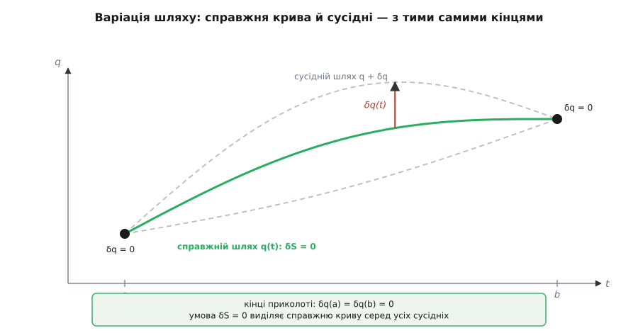
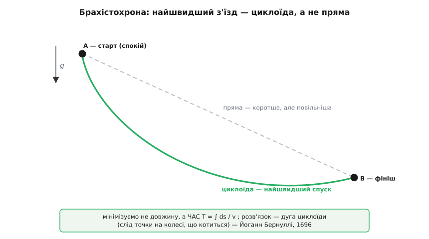

# 🧮 Рівняння Ейлера–Лагранжа: від варіації дії до закону руху

Принцип каже коротко й гордо: серед усіх мислимих шляхів між закріпленими початком і кінцем справжній той, на якому дія стаціонарна — δS = 0. Красиво. Але спробуйте цим скористатися. «Стаціонарна» — це властивість цілого шляху, порівняного з усіма його сусідами; це не рівняння, у яке підставиш початкову швидкість і дістанеш траєкторію. Між величним твердженням і робочим інструментом лежить прірва, і через неї перекинуто рівно один місток — **варіаційне числення** (*calculus of variations*). Його вихід — **рівняння Ейлера–Лагранжа**, звичайне диференціальне рівняння, яке можна віддати комп'ютерові й проінтегрувати. Уся ця вставка — про те, як δS = 0 перетворюється на це рівняння, чесно, від першопричини, за пів сторінки викладок.

## Функціонал: коли аргумент — цілий шлях

Звичайна функція їсть число й повертає число: подав 3 — дістав 9. Дія влаштована інакше. Їй згодовують **цілу функцію** — траєкторію q(t), розписану від старту до фінішу, — а вона повертає одне число. Такий об'єкт — «функція від функції» — називають **функціоналом** (*functional*). Щоб на око відрізняти його від звичайної функції, аргумент беруть у квадратні дужки: S[q]. Дія — рівно це, [інтеграл](topic:math/integral) уздовж усього шляху:

```
S[q] = ∫ L(q, q̇, t) dt      від t = a до t = b
```

Тут q(t) — координата, q̇(t) — швидкість (крапка над буквою — похідна за часом), а L — функція Лагранжа. Даси функціоналові пряму лінію — він видасть одне число. Даси петлясту криву між тими самими кінцями — інше. Ми маємо машину, що зважує шляхи.

І тепер питання «де дія стаціонарна» стає точним аналогом шкільного «де функція має екстремум» — тільки замість однієї змінної в нас нескінченний простір усіх можливих кривих. Уявіть краєвид, де кожна точка — це цілий шлях, а висота над нею — значення дії. [Стаціонарна точка](topic:math/extrema) — це рівне місце цього краєвиду: дно улоговини, вершина пагорба або сідло, де в один бік підіймається, а в інший спадає. Аналогія з горами майже точна, і ламається лише в одному: осей у нашого краєвиду не дві й не три, а нескінченно багато — по одній на кожну мить шляху. Тому «рівне місце» доведеться означити обережно.

## Варіація: як «поворухнути» шлях

Щоб перевірити, чи стоїмо ми на рівному, туриста в горах штовхають на крок у кожен бік і дивляться, чи змінюється висота. Зробімо те саме зі шляхом. Візьмімо якийсь пробний шлях q(t) і додаймо до нього крихітне збурення:

```
q(t)  →  q(t) + δq(t)
```

Функцію δq(t) називають **варіацією** (*variation*) шляху. Це будь-яке маленьке викривлення кривої — з однією залізною умовою. Задача фіксує кінці: усі шляхи-суперники стартують з тієї самої точки й приходять у ту саму. Отже, збурення на кінцях мусить бути нульовим:

```
δq(a) = 0        δq(b) = 0
```

Картина проста, і її варто втримати перед очима: шлях — це струна, прибита цвяхами з обох боків, а δq(t) — будь-яке смикання її середини. Кінці не рухаються ніколи.



*Варіюємо лише середину — кінці приколоті, δq(a) = δq(b) = 0. Умова δS = 0 виділяє справжню криву серед усього рою сусідніх.*

Щоб зі смикання зробити щось лічильне, вкрутімо в нього ручку гучності. Запишімо варіацію так:

```
δq(t) = ε · η(t)
```

де η(t) — довільна гладка функція, що зникає на кінцях (η(a) = η(b) = 0), а ε — маленьке число, спільний масштаб. Форму збурення задає η, а силу — ε. Хитрість ось у чому: тепер дія S[q + ε·η] залежить від **одного-єдиного числа ε**. Ми звели нескінченновимірне «рівне в усі боки» до звичайного числення в ε — по одному напрямку η за раз. Шлях стаціонарний тоді й лише тоді, коли для будь-якого дозволеного η

```
dS/dε = 0    при ε = 0
```

Похідну функціонала за таким параметром і позначають δS — це **перша варіація дії**. Далі — просто її порахувати.

## Перша варіація дії

Підставмо збурений шлях у дію й розгляньмо як функцію ε:

```
S[q + ε·η] = ∫ L(q + ε·η,  q̇ + ε·η̇,  t) dt
```

Один важливий, хоч і тихий крок: швидкість збуреного шляху — це похідна від q + ε·η, тобто q̇ + ε·η̇. Отже, збурення швидкості — це похідна від збурення координати: варіація й похідна за часом спокійно міняються місцями, δ(q̇) = d(δq)/dt. Це не фокус, а пряме означення: поворушили шлях — його нахил у кожній точці поворушився рівно настільки, наскільки змінилася сама крива.

Тепер розкладемо L поблизу непорушеного шляху. При малому ε підінтегральна функція відрізняється від L(q, q̇, t) на першу [похідну](topic:math/derivative) по кожному аргументу, помножену на його приріст (звичайний ряд Тейлора, лишаємо лінійний по ε член):

```
L(q + ε·η, q̇ + ε·η̇) ≈ L(q, q̇) + ε·( ∂L/∂q · η  +  ∂L/∂q̇ · η̇ ) + …
```

Тут ∂L/∂q — часткова похідна: наскільки чутлива L до зсуву координати, коли швидкість тримаємо сталою (і навпаки для ∂L/∂q̇). Продиференціюймо всю дію по ε й покладімо ε = 0 — сталий доданок зникає, лишається лінійний:

```
δS = ∫ ( ∂L/∂q · η  +  ∂L/∂q̇ · η̇ ) dt = 0     для кожного η
```

Ось умова стаціонарності, розписана явно. Вона майже готова, та має одну прикру рису: під інтегралом стоїть і η, і його похідна η̇. А вони не незалежні — η̇ намертво зв'язана з η. Поки в рівнянні дві іпостасі одного збурення, «основну лему» застосувати не можна. Треба лишити тільки η.

## Інтегрування частинами прибирає похідну варіації

Позбутися η̇ — рівно та задача, для якої існує **інтегрування частинами**. Воно перекидає похідну з одного множника на інший ціною межового доданка. Застосуймо його до другого члена:

```
∫ ∂L/∂q̇ · η̇ dt  =  [ ∂L/∂q̇ · η ]  −  ∫ d/dt( ∂L/∂q̇ ) · η dt
                    └── на кінцях a,b ──┘
```

Придивімося до межового доданка [ ∂L/∂q̇ · η ], узятого на кінцях відрізка. На обох кінцях η дорівнює нулю — саме тому, що ми прикололи шлях цвяхами. Отже, весь цей доданок зникає. Ось де спрацював припнутий кінець: без нього лишився б «крайовий» член, і рівняння руху вийшло б інакшим. Підставмо результат назад:

```
δS = ∫ ( ∂L/∂q  −  d/dt( ∂L/∂q̇ ) ) · η dt = 0     для кожного η
```

Тепер η стоїть самотою, помножена на один вираз у дужках. Форма ідеальна для завершального удару.

## Основна лема: від інтеграла до точкового рівняння

Ми маємо ось що: певний вираз — назвімо його g(t) — проінтегрований разом із η(t), дає нуль, і то **для кожної** гладкої η, що зникає на кінцях. Твердження **основної леми варіаційного числення** (*fundamental lemma*): звідси випливає, що сам g(t) дорівнює нулю всюди.

Чому — видно з простого доведення від супротивного. Припустімо, що це не так: у якійсь внутрішній точці t₀ вираз g відмінний від нуля, скажімо додатний. За неперервністю g лишається додатним у цілому маленькому околі навколо t₀. А тепер згадаймо, що η ми вибираємо самі, які завгодно. Виберімо η, яка є гладким горбиком: додатна всередині цього околу й строго нуль за його межами. Тоді добуток g·η додатний на горбику й нульовий деінде, а отже, інтеграл від нього — строго додатний. Але лема каже, що він мусить бути нулем. Суперечність. Так само гине припущення, що g десь від'ємне. Лишається єдина можливість: g тотожно дорівнює нулю в кожній точці.

Уся сила тут — у слові «для кожного η». Одне рівняння з одним конкретним η майже нічого не сказало б. Але вимога справджуватися для **всіх** збурень одразу така жорстка, що притискає вираз у дужках до нуля скрізь. Саме ця лема дозволяє скинути інтеграл і довільну η — і прочитати рівняння в кожній точці окремо.

## Рівняння Ейлера–Лагранжа

Прирівнявши дужку до нуля, дістаємо серцевину всієї механіки:

```
d/dt ( ∂L/∂q̇ )  −  ∂L/∂q  =  0
```

Це і є **рівняння Ейлера–Лагранжа**. Зверніть увагу, що сталося дорогою. На вході було глобальне, майже філософське твердження — «дія на всьому шляху стаціонарна». На виході — локальне диференціальне рівняння, яке справджується в кожну окрему мить t. Варіаційне числення — це точно машина-перекладач із глобальної мови на локальну: беруться цілі шляхи, а віддається рівняння руху для точки. Одну назву воно дістало на честь Леонгарда Ейлера й Жозефа-Луї Лагранжа: молодий Лагранж 1755 року надіслав Ейлерові свій δ-метод у листі, і Ейлер, покинувши власний громіздкий геометричний підхід, дав галузі ту назву, яку вона носить досі.

## Перевірка: як звідси випадає Ньютон

Абстракція нічого не варта, поки не поверне знайоме. Візьмімо найпростіший лагранжіан — вільна частинка в полі з потенціалом U(q):

```
L = ½·m·q̇²  −  U(q)
```

**Умова: підставити цю L у рівняння Ейлера–Лагранжа й подивитися, що вийде.**
```
Порахуймо дві потрібні похідні:
   ∂L/∂q̇ = m·q̇          ← оце вже імпульс, p = m·v
   ∂L/∂q  = −dU/dq       ← а це, зі знаком мінус, сила: F = −dU/dq

Перший доданок рівняння:
   d/dt( ∂L/∂q̇ ) = d/dt( m·q̇ ) = m·q̈

Складаємо рівняння Ейлера–Лагранжа:
   m·q̈ − (−dU/dq) = 0
   m·q̈ = −dU/dq = F
```

Останній рядок — це m·a = F, [другий закон Ньютона](topic:physics/newtons-second-law), відтворений літера в літеру. Отже, локальний опис Ньютона й глобальний принцип дії дають те саме рівняння руху — вони не суперники, а два боки однієї монети.

Але сталося й дещо тонше, на що варто спинитися. Величина ∂L/∂q̇ = m·q̇ виринула сама, її ніхто не постулював. У ньютоновій механіці імпульс — окреме означення, яке треба ввести рукою. Тут він народжується як «чутливість лагранжіана до швидкості» — і саме на нього діє похідна d/dt у рівнянні. Ця дрібниця виявиться наріжною, щойно ми відійдемо від прямокутних координат.

## Узагальнені координати: чому рівняння байдуже до вибору

Перечитайте виведення від функціонала до рівняння — і ви ніде не знайдете припущення, що q вимірюється в метрах уздовж прямої осі. Жодного. Уся викладка — Тейлор, інтегрування частинами, лема — однаково справедлива, хоч би що позначала q: кут повороту маятника, довжину дуги вздовж скрученого дроту, кут у шарнірі робота. Будь-яке число, що однозначно задає конфігурацію системи, годиться. Такі змінні звуть **узагальненими координатами** (*generalized coordinates*).

А раз виведення те саме, то й **рівняння Ейлера–Лагранжа має однакову форму в будь-яких координатах**. Це і є та властивість, заради якої формалізм дії витісняє Ньютона на практиці. Ньютонове F = m·a доводиться переписувати щоразу, коли міняєш опис: у полярних координатах вигулькують доцентрові й коріолісові доданки, які легко проґавити. Дії ж байдуже — вона просто число шляху. Обери координати, що пасують до в'язей, випиши в них одну функцію L = T − U — і механічно прокрути рівняння. Сили реакції в опорах, які так мучать за Ньютоном, зникають самі, бо не виконують роботи й у L не входять.

Коли координат кілька — q₁, q₂, …, q_n — кожну можна варіювати незалежно від решти. Повторивши все виведення для варіації по кожній окремо, дістаємо **по одному рівнянню на координату**:

```
d/dt ( ∂L/∂q̇ᵢ )  −  ∂L/∂qᵢ  =  0        для кожного i = 1, 2, …, n
```

Тут доречно дати два імені. Величину

```
pᵢ = ∂L/∂q̇ᵢ
```

називають **узагальненим (спряженим) імпульсом** до координати qᵢ, а ∂L/∂qᵢ — узагальненою силою. Для прямокутної координати pᵢ виходить звичним m·v; для кута — моментом імпульсу. Імена різні, машина одна.

## Циклічна координата — і збереження задарма

Перепишімо рівняння Ейлера–Лагранжа через щойно введений імпульс — воно набуде промовистого вигляду:

```
dpᵢ/dt = ∂L/∂qᵢ
```

«Швидкість зміни узагальненого імпульсу дорівнює узагальненій силі» — знову Ньютон, тільки узагальнений. А тепер спитаймо: що, як лагранжіан якоїсь координати qₖ **не містить зовсім** — залежить лише від її швидкості q̇ₖ, але не від самої qₖ? Тоді ∂L/∂qₖ = 0, і рівняння миттєво каже:

```
dpₖ/dt = 0     →     pₖ = ∂L/∂q̇ₖ = стала
```

Спряжений імпульс такої координати зберігається. Координату, що випала з L, звуть **циклічною** (або ігнорованою). І дивовижа ось у чому: закон збереження випав не з окремого постулату, а просто з того, що L чогось не помічає. Симетрія лагранжіана — його байдужість до зсуву по qₖ — і є збережена величина.

Побачмо це на живому прикладі — частинка в центральному полі, зручні координати полярні (r — відстань до центру, φ — кут):

**Умова: центральне поле, тож потенціал залежить лише від r; знайти збережену величину.**
```
Кінетична енергія в полярних координатах:  T = ½·m·( ṙ² + r²·φ̇² )
Лагранжіан:                                 L = ½·m·( ṙ² + r²·φ̇² ) − U(r)

Дивимося на кут φ:  у L він входить лише як φ̇, самого φ ніде немає
   →  φ — циклічна координата,  ∂L/∂φ = 0

Отже, її спряжений імпульс сталий:
   p_φ = ∂L/∂φ̇ = m·r²·φ̇ = стала
```

А m·r²·φ̇ — це рівно момент імпульсу. Ми дістали його збереження в один рядок, і зрозуміли, звідки воно: поле не розрізняє напрямків, лагранжіан не залежить від кута — тому момент імпульсу й стоїть на місці. Це окремий, найпростіший випадок глибокого загального закону: за кожною неперервною симетрією дії стоїть свій закон збереження ([теорема Нетер](topic:physics/noether-theorem)).

> 🔧 **Навіщо це.** Полювання на циклічні координати — справжня надсила методу дії. Кожна знайдена циклічна координата дарує одразу дві речі: збережену величину (перший інтеграл руху, який далі можна підставляти як сталу) і на одне рівняння менше, бо система «худне» на один ступінь вільності. Тому вправний вибір координат — не косметика, а стратегія: підбираєш їх так, щоб симетрії системи стали явними, і закони збереження самі випадають з лагранжіана, ще до того, як ти візьмешся щось інтегрувати. Саме так рахують орбіти супутників, рух дзиґи й траєкторії в прискорювачах.

## Брахістохрона: задача, що породила все це

Наостанок — задача, з якої варіаційне числення й народилося, і на якій його апарат видно як на долоні. 1696 року Йоганн Бернуллі опублікував у часописі *Acta Eruditorum* виклик математикам Європи: з'єднати дві точки — верхню A і нижчу, зсунуту вбік B — такою кривою, щоб намистина, пущена з A без початкової швидкості й гнана самою лиш вагою, скотилася до B **за найкоротший час**. Криву він назвав **брахістохроною** (гр. *brákhistos* — найкоротший + *khrónos* — час).

Спокуса відповісти «пряма» — і промах. Пряма найкоротша в метрах, але не в секундах. Крутіший початковий спад дає намистині рано розігнатися, і виграна швидкість окупається на всьому подальшому шляху. Змагаються довжина й швидкість — точнісінько варіаційна задача, тільки мінімізуємо тепер не дію, а час.

**Умова: намистина зсковзує з A (спокій) до B під дією ваги; знайти криву найшвидшого спуску.**
```
Час у дорозі — це підсумок «шматочок шляху поділити на швидкість»:
   T[y] = ∫ ds / v

Довжина елемента дуги:            ds = √(1 + y′²) dx      (y′ = dy/dx)
Швидкість — із збереження енергії (падіння з висоти y зі спокою):
   ½·m·v² = m·g·y   →   v = √(2·g·y)

Складаємо функціонал часу:
   T[y] = ∫ √(1 + y′²) / √(2·g·y)  dx
```

Це функціонал того самого типу, тільки роль «часу» грає тепер x, а невідома функція — форма кривої y(x). Підінтегральна функція F = √( (1 + y′²) / (2·g·y) ) має приємну рису: **явно не містить x**. А коли так, у рівняння Ейлера–Лагранжа є **перший інтеграл** — точно та сама історія, що й «лагранжіан без явного часу зберігає енергію». Переконатися легко прямим диференціюванням:

```
d/dx [ F − y′·∂F/∂y′ ] = y′·( ∂F/∂y − d/dx(∂F/∂y′) ) = 0
                          └──── дужка = 0 за рівнянням Е–Л ────┘

отже      F − y′·∂F/∂y′ = стала
```

Підставмо сюди наше F і згорнімо (доданки з y′ складаються в одиницю):

```
F − y′·∂F/∂y′ = 1 / √( 2·g·y·(1 + y′²) ) = стала

звідки       y·(1 + y′²) = C          (стала)
```

Це коротке рівняння — підпис єдиної кривої. Йому задовольняє **циклоїда** (*cycloid*) — слід точки на ободі колеса, що котиться. У параметричному записі

```
x = R·(θ − sin θ)
y = R·(1 − cos θ)
```

підстановка одразу дає y·(1 + y′²) = 2·R — стала, як і треба. Отже, найшвидший спуск — дуга перевернутої циклоїди: вона майже прямовисно провалюється на старті, щоб ухопити швидкість, а тоді полого виносить намистину до B.



*Мінімізуємо не довжину, а час T = ∫ ds/v. Розв'язок — дуга циклоїди, сліду точки на колесі, що котиться.*

Історія розв'язання — усталений факт, звірений із джерелами. Бернуллі кинув виклик привселюдно, і відповіді надійшли від Ляйбніца, Лопіталя, його брата Якоба Бернуллі, від нього самого — і від Ісаака Ньютона, який (за переказом його небоги) отримав задачу під вечір 29 січня 1697 року, просидів над нею ніч і мав розв'язок до ранку, надіславши його без підпису. Побачивши стислу й потужну відповідь, Йоганн Бернуллі, кажуть, упізнав автора «як лева по кігтю» (лат. *ex ungue leonem*) — тобто зрозумів, що це Ньютон, хоч імені й не стояло. Опубліковано розв'язки в *Acta Eruditorum* за травень 1697 року. З цього змагання Ейлер, а за ним дев'ятнадцятирічний Лагранж і викували загальний апарат, що привів до рівняння, з якого ми почали.

## Місток, а не ще один закон

Варто востаннє глянути на пройдений шлях згори. Рівняння Ейлера–Лагранжа — не новий закон природи, доданий до Ньютонових. Це завіса між двома описами: з одного боку — розлоге твердження «природа робить дію стаціонарною», з іншого — буденне диференціальне рівняння, яке інтегрують і дістають траєкторію. Ланцюжок, що їх з'єднує, ми провели весь: функціонал → перша варіація → інтегрування частинами → основна лема → локальне рівняння, по одному на координату, зі збереженим імпульсом усюди, де координата випадає з лагранжіана. І хоч куди сягав би принцип дії — намистина на дроті, планета на орбіті, поле, квантова амплітуда — усюди він дотягується саме через це одне рівняння.
