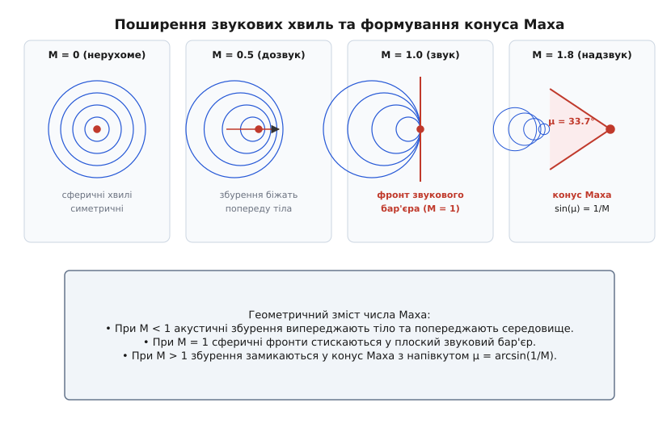
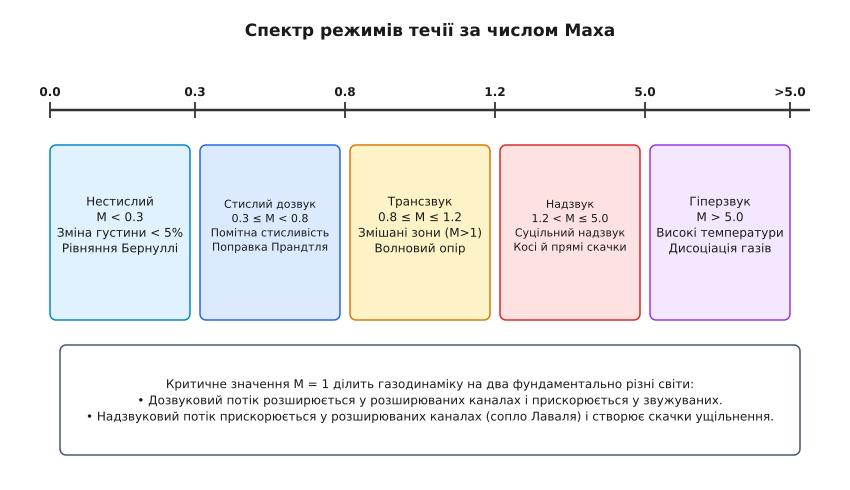
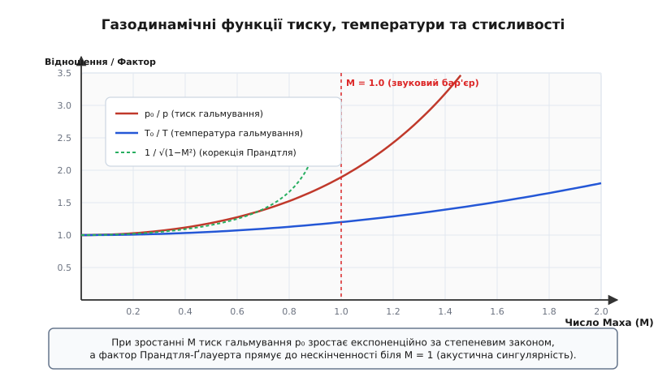

# Число Маха

<preknowlist>
- [Швидкість руху](book:physics/mechanics/velocity) — векторна величина, що описує переміщення об'єкта в просторі за одиницю часу.
- [Тиск](book:physics/mechanics/pressure) — скалярна величина, що характеризує силу нормального тиску газу на одиницю площі.
- [Густина](book:physics/mechanics/density) — маса речовини в одиниці об'єму, яка визначає інерційність та стисливість середовища.
- [Динамічний тиск](book:physics/mechanics/dynamic-pressure) — швидкісний напір потоку, пропорційний до півдобутку густини на квадрат швидкості.
- [Рівняння Нав'є-Стокса](book:physics/mechanics/navier-stokes) — базова система рівнянь руху в'язкого стисливого флюїду.
- [Безнеперервність потоку](book:physics/mechanics/flow-continuity) — закон збереження маси для суцільного середовища у формі рівняння неперервності.
</preknowlist>

Кожен твердий об'єкт, рухаючись у газі чи рідкому середовищі, безперервно відштовхує молекули перед собою, збуджуючи локальні коливання тиску та густини. Ці збурення не залишаються локалізованими на поверхні тіла: вони поширюються у всі боки у вигляді сферичних акустичних хвиль стиску зі швидкістю звуку. Якщо об'єкт рухається повільно, звукові хвилі встигають заздалегідь розійтися далеко вперед і вбоки. Вони діють як гідродинамічний «авангард»: перерозподіляють тиск у середовищі ще до наближення тіла, змушуючи струмені повітря плавно огинати крило або фюзеляж. За таких умов повітря поводиться як майже нестислива рідина — його густина вздовж лінії течії залишається практично незмінною, а рух повністю описується класичними рівняннями нестислої аеродинаміки.

Однак коли швидкість об'єкта наближається до швидкості поширення акустичних хвиль, ситуація фундаментально змінюється. Збурення тиску більше не можуть випередити тіло: сферичні фронти хвиль накладаються один на одного, стискаючись у вузьку фронтальну зону. Повітря втрачає здатність заздалегідь «розступатися», і замість плавного огинання середовище починає різко деформуватися, змінюючи свою густину, температуру та тиск. Співвідношення між інерційними силами потоку та пружними властивостями газу визначається безрозмірним критерієм — **числом Маха** (на честь австрійського фізика та філософа Ернста Маха, нім. *Mach-Zahl*), яке дорівнює відношенню швидкості потоку до місцевої швидкості звуку.

## 1. Фізичний зміст числа Маха та молекулярна механіка стисливості

Число Маха `M` виражається фундаментальним співвідношенням:

```
M = v / a
```

де `v` — швидкість руху тіла відносно газу (або швидкість набігаючого потоку), а `a` — локальна швидкість звуку в цьому ж середовищі. 

Число Маха не є просто зручною одиницею вимірювання швидкості об'єкта. З фізичного погляду це відношення кінетичної енергії спрямованого макроскопічного руху газу до внутрішньої теплової енергії хаотичного руху його молекул. Квадрат числа Маха `M²` пропорційний відношенню інерційного напору (динамічного тиску) до статичного тиску середовища:

```
M² ∝ (ρ · v²) / p
```

Щоб зрозуміти глибоку молекулярну природу стисливості (лат. *compressio* — стиснення), необхідно звернутися до молекулярно-кінетичної теорії. Звукова хвиля в газі — це послідовність мікроскопічних зон стиску та розрядження, яка переношується завдяки хаотичним зіткненням молекул. Середня швидкість, із якою молекули переносять імпульс та інформацію про зміну тиску до сусідніх шарів газу, прямо пропорційна середній тепловій швидкості молекулярного руху.

Коли швидкість руху об'єкта `v` набагато менша за середню швидкість молекул (`M < 0.3`), молекули середовища встигають здійснювати мільярди зіткнень у секунду, хаотично перерозподіляючи імпульс від носової частини тіла в усіх напрямках. Флуктуації тиску, викликані рухом тіла, призводять до мікроскопічних змін густини газу (менше ніж `5%`). За таких умов ефектами стисливості можна повністю знехтувати, вважаючи густину `ρ = const`. У цьому режимі працює закон Бернуллі для нестислої рідини, а опір середовища визначається виключно в'язким тертям у пристінному шарі та вихровим слідом.

Коли ж `M` перевищує межу `0.3`, швидкість макроскопічного переносу тіла стає порівнянною зі швидкістю хаотичного теплового руху молекул. Молекули більше не встигають розійтися вбоки через зіткнення: вони накопичуються перед носовою частиною тіла, утворюючи зону підвищеної густини та тиску. Робота, яка витрачається на стиснення газу перед рухомим тілом, перетворюється на внутрішню енергію: температура газу зростає, тиск підвищується значно швидше, ніж за законом квадрата швидкості, а рівняння руху вимагають одночасного врахування законів збереження маси, імпульсу та енергії.

Для суцільного середовища межу застосовності газодинаміки стисливого потоку визначають також за допомогою числа Кнудсена `Kn = λ / L` (відношення довжини вільного пробігу молекул `λ` до характерного розміру тіла `L`). Поки `Kn < 0.01`, газ описується рівняннями стисливого суцільного середовища (рівняннями Нав'є-Стокса чи Ейлера). Якщо ж на висотах понад `100 км` довжина вільного пробігу стає порівнянною з розмірами апарата (`Kn > 10`), поняття звукової хвилі та числа Маха втрачають звичний гідродинамічний зміст, і рух розглядається в рамках вільномолекулярної аеродинаміки.

> 🔧 **Навіщо це.**
> Екстраполяція аеродромних випробувань без урахування числа Маха призводить до катастрофічних помилок у проектуванні літальних апаратів. Крило, розраховане для дозвукового польоту (`M = 0.5`), при досягненні `M = 0.85` зазнає хвильового сриву потоку: підйомна сила раптово падає в рази, фокус аеродинамічних сил зсувається назад, а літак мимовільно затягує в піке. Знання числа Маха дозволяє точно спрогнозувати момент появи ударних хвиль та правильно підібрати форму профілю.

## 2. Термодинамічна природа швидкості звуку

Швидкість звуку `a` не є універсальною константою. Це динамічний параметр середовища, який визначається його пружністю та густиною. Для дрібних збурень, що поширюються без тепловтрат (ізоентропійний процес), швидкість звуку дорівнює квадратному кореню з часткової похідної тиску за густиною при сталій ентропії:

```
a = √( (∂p / ∂ρ)_s )
```

Історично Ісаак Ньютон у своїх «Математичних началах натуральної філософії» спробував розрахувати швидкість звуку, припустивши, що стиснення газу в акустичній хвилі відбувається ізотермічно (`T = const`). Отримана ним формула `a_N = √(p / ρ)` давала для повітря значення близько `280 м/с`, що на `16%` відрізнялося від експериментальних вимірювань (`331 м/с`). Лише у 1816 році П'єр-Симон Лаплас показав, що акустичні коливання відбуваються настільки швидко, що теплообмін між зонами стиску та розрядження не встигає відбутися. Процес є адіабатичним, а пружність газу зростає в `γ` разів.

Для ідеального газу співвідношення Лапласа має вигляд:

```
a = √(γ · (p / ρ)) = √(γ · R · T)
```

де `γ` — показник адіабати газу (відношення теплоємностей `c_p / c_v`, для сухого повітря `γ ≈ 1.40`), `R` — питома газова стала (`287.058 Дж/(кг·К)` для повітря), а `T` — **абсолютна статична температура** газу в Кельвінах (`K`).

З цієї формули випливає вирішальний висновок: **швидкість звуку в ідеальному газі залежить виключно від його температури та хімічного складу**, і абсолютно не залежить від статичного тиску чи густини. Якщо тиск газу зростає вдвічі при сталій температурі, його густина також зростає вдвічі, і їх відношення `p / ρ` залишається незмінним.

| Висота польоту (ISA) | Температура `t` (°C) | Температура `T` (K) | Швидкість звуку `a` (м/с) | Швидкість звуку `a` (км/год) |
| :--- | :---: | :---: | :---: | :---: |
| 0 м (рівень моря) | `+15.0` | `288.15` | `340.3` | `1225.0` |
| 2000 м | `+2.0` | `275.15` | `332.5` | `1197.1` |
| 5000 м | `-17.5` | `255.65` | `320.5` | `1153.8` |
| 11 000 м (тропопауза) | `-56.5` | `216.65` | `295.1` | `1062.3` |
| 20 000 м (стратосфера) | `-56.5` | `216.65` | `295.1` | `1062.3` |

Оскільки в реальній атмосфері температура з висотою знижується (у тропосфері — на `6.5 °C` на кожен кілометр підйому), швидкість звуку біля землі становить приблизно `1225 км/год`, а на висоті `11 км` падає до `1062 км/год`. Це означає, що літак, який рухається зі сталою істинною швидкістю `1080 км/год`, біля землі буде мати число Маха `M = 0.88` (дозвуковий режим), а у верхніх шарах тропосфери — `M = 1.02` (надзвуковий режим).

Важливо чітко розрізняти різні поняття швидкості в авіації:
- **Істинна повітряна швидкість (True Airspeed, TAS):** Фізична швидкість руху літака відносно навколишніх мас повітря.
- **Приладова повітряна швидкість (Indicated Airspeed, IAS):** Виміряний швидкісний напір `q = ½ ρ v²`, відкалібрований під густину повітря біля землі. З висотою при сталому TAS приладова швидкість падає через розрядження повітря.
- **Число Маха (Mach Number, M):** Відношення TAS до місцевої швидкості звуку. Саме число Маха визначає структуру аеродинамічного обтікання та появу ударних хвиль.

Саме тому пілоти надзвукових апаратів та автоматичні системи керування польотом орієнтуються не лише на приладову швидкість, а на число Маха, яке визначає реальний аеродинамічний стан апарата та запас міцності конструкції.

## 3. Геометрія акустичних хвиль та конус Маха

Щоб зрозуміти, як виникає звуковий бар'єр і надзвукова ударна хвиля, розглянемо геометрію поширення акустичних фронтів від точкового джерела, яке рухається зі швидкістю `v`.


*Схема поширення сферичних акустичних хвиль при нерухомому джерелі (M=0), дозвуковому (M=0.5), звуковому (M=1.0) та надзвуковому (M=1.8) русі.*

Можна виділити чотири характерні геометричні конфігурації:

1. **Нерухоме джерело (`M = 0`):** Сферичні звукові хвилі випромінюються концентрично від центру. Відстань між сусідніми фронтами однакова у всіх напрямках, а середовище перебуває в акустичній рівновазі.
2. **Дозвуковий рух (`M < 1`):** Джерело рухається повільніше за випромінені ним хвилі. Сферичні фронти зсуваються в напрямку руху: перед джерелом вони згущуються (довжина хвилі зменшується, що відповідає ефекту Допплера), а позаду — розряджаються. Проте всі хвилі лежать одна всередині іншої, і жодна з них не перетинається. Збурення завжди біжать попереду джерела.
3. **Звуковий рух (`M = 1`):** Швидкість джерела дорівнює швидкості звуку (`v = a`). Джерело рухається нарівні з власними акустичними фронтами. Усі сферичні хвилі, випромінені в минулі моменти часу, торкаються одна одної в одній площині, що проходить через носок тіла. Виникає єдиний плоский фронт високої амплітуди — **звуковий бар'єр**. Тиск на цьому фронті теоретично прямує до нескінченності (у рамках лінійної акустики).
4. **Надзвуковий рух (`M > 1`):** Джерело рухається швидше за випромінені хвилі та випереджає власні збурення. Сферичні акустичні фронти залишаються позаду джерела. Огинальна поверхня цих сфер утворює конус з вершиною в точці перебування джерела — **конус Маха** (лат. *conus*).

Півкут при вершині конуса Маха `μ` (кут Маха) розраховується з прямокутного трикутника, де катетом є радіус акустичної хвилі `a · t`, а гіпотенузою — шлях тіла `v · t`:

```
sin(μ) = (a · t) / (v · t) = a / v = 1 / M
```

Зі збільшенням числа Маха конус Маха стає все більш гострим:

```
M = 1.0  ⇒  μ = 90.0°   (плоска стіна)
M = 1.2  ⇒  μ = 56.4°
M = 1.5  ⇒  μ = 41.8°
M = 2.0  ⇒  μ = 30.0°
M = 3.0  ⇒  μ = 19.5°
M = 5.0  ⇒  μ = 11.5°   (вузький конус)
```

Простір навколо надзвукового тіла чітко ділиться на дві зони: **зону мовчання** (поза конусом Маха), куди жодне збурення ще не встигло дійти, і **зону чутності** (всередині конуса Маха), яка охоплює всі випромінені хвилі. Спостерігач на землі не чує жодного звуку від наближення надзвукового літака, поки поверхня конуса Маха не перетне точку спостереження. У момент перетину спостерігач чує різкий подвійний гуркіт — звуковий удар (англ. *sonic boom*).

Звуковий удар складається з двох послідовних скачків тиску (так звана N-хвиля тиску): перший скачок виникає на головній ударній хвилі від носової частини літака, а другий — на хвостовій ударній хвилі. В інтервалі між ними тиск плавно спадає нижче атмосферного.

При проходженні вологого повітря через зону розрядження за конусом Маха температура газу адіабатично падає нижче точки роси. Водяна пара миттєво конденсується у дрібні краплі туману, утворюючи наочну білу хмару навколо літака — явище сингулярності Прандтля-Ґлауерта.

Детальний історичний шлях від перших іскрових фотографій куль до розшифровки структури конуса описано у вставці [Від балістичних фотографій до надзвуку](book:physics/mechanics/mach-number/hist-mach-cone.md).

## 4. Гідродинамічна аналогія: хвилі на мілководді та число Фруда

Цікавим фізичним феноменом, який дозволяє візуалізувати надзвукові явища без складних аеродинамічних труб, є **аналогія між стисливим газом та хвилями на поверхні води**.

Коли катер або качка рухається по поверхні води, вона створює поверхневі гравітаційно-капілярні хвилі. Швидкість поширення малих хвиль на мілководді глибиною `h` визначається формулою:

```
c_wave = √(g · h)
```

де `g` — прискорення вільного падіння. Відношення швидкості катера `v` до швидкості поверхневих хвиль `c_wave` визначається безрозмірним числом Фруда для мілководдя `Fr = v / √(g · h)`. 

Ця система є прямою математичною аналогією двовимірного стисливого газу з показником адіабати `γ = 2.0`:
- Глибина води `h` відповідає густині газу `ρ`.
- Квадрат глибини `h²` відповідає тиску газу `p`.
- Число Фруда `Fr` поводиться точнісінько як число Маха `M`.

Якщо катер рухається зі швидкістю `Fr > 1`, за ним виникає V-подібний розхідний хвильовий слід — це повний аналог конуса Маха. Явище **гідравлічного стрибка** (раптове підвищення рівня води при переході від зверхкритичного потоку `Fr > 1` до докритичного `Fr < 1`) є прямим аналогом прямого скачка ущільнення в газодинаміці.

У 1930–1950-х роках, до появи потужних комп'ютерів і надзвукових аеродинамічних труб, вчені активно використовували водяні лотки (гидродинамические лотки) для візуалізації обтікання надзвукових профілів крил: фотографуючи хвилі води навколо макета, вони точно знаходили форму ударних хвиль для надзвукової аеронавтики.

## 5. Спектр режимів течії за числом Маха

У газодинаміці число Маха є головним параметром класифікації режимів течії. Залежно від значення `M` фізичні явища в потоці якісно змінюються.


*Класифікація режимів течії газу від нестислого дозвуку до гіперзвуку.*

### 1. Нестислий дозвуковий потік (`M < 0.3`)
Зміна густини газу не перевищує `5%`. Повітря можна вважати нестисливим флюїдом. Закони збереження спрощуються до рівняння неперервності `div(v) = 0` та рівняння Ейлера чи Нав'є-Стокса для нестислого середовища. Розрахунок тиску виконується за класичною формулою Бернуллі:

```
p + ½ · ρ · v² = const
```

У цьому режимі літають малі безпілотники, поршневі літаки спортивної авіації та гелікоптери.

### 2. Стислий дозвуковий потік (`0.3 ≤ M < 0.8`)
Зміна густини стає відчутною (до `35%`). Збурення поширюються в усі боки, але скачки ущільнення ще не виникають. Для розрахунку аеродинамічних коефіцієнтів тиску `C_p` застосовують поправку Прандтля-Ґлауерта:

```
C_p = C_p0 / √(1 - M²)
```

де `C_p0` — коефіцієнт тиску для нестислої течії. Ця формула показує, що зі зростанням числа Маха підйомна сила крила зростає швидше, ніж квадрат швидкості. У цьому діапазоні виконують крейсерські польоти сучасні турбогвинтові та регіональні реактивні пасажирські літаки (ATR 72, Dash 8).

### 3. Трансзвуковий потік (`0.8 ≤ M ≤ 1.2`)
Найбільш складний та нелінійний режим. Хоча загальна швидкість набігаючого потоку може бути меншою за швидкість звуку (наприклад, `M = 0.85`), при огинанні опуклих поверхонь крила потік місцево прискорюється і досягає надзвукових швидкостей (`M_local > 1.0`).

При подальшому гальмуванні надзвукової зони утворюються локальні **скачки ущільнення** (ударні хвилі). Взаємодія скачка з пристінним ламінарним або турбулентним шаром призводить до хвильового зриву потоку (волновой срыв / shock-induced separation), різкого зростання опору (волнового опору) та втрати стійкості. Більшість сучасних магістральних пасажирських літаків (Boeing 737, Airbus A320, Boeing 787) літають саме у вузькому вікні трансзвуку (`M = 0.78–0.85`), використовуючи спеціальні надкритичні (суперкритичні) профілі крила з сплощеною верхньою поверхнею для затримки виникнення скачків ущільнення.

### 4. Надзвуковий потік (`1.2 < M ≤ 5.0`)
Весь потік навколо тіла є надзвуковим. Дозвукові зони зберігаються лише в безпосередній близькості від тупого носка або в пристінному шарі. Усі збурення локалізовані всередині головної ударної хвилі (косого або від'єднаного скачка) та конуса Маха.

Головним завданням аеродинаміки стає мінімізація хвильового опору за допомогою загострення носових частин, застосування стрілоподібних і трикутних крил, а також використання правила площ Ґуіткомба (Whitcomb area rule). У цьому режимі виконують польоти винищувачі 4-го та 5-го поколінь (F-16, Su-27, F-35), надзвукові розвідники (SR-71) та пасажирські літаки Concorde і Tu-144.

### 5. Гіперзвуковий потік (`M > 5.0`)
При надвисоких числах Маха кут конуса Маха стає настільки малим, що ударна хвиля лягає майже паралельно до поверхні тіла, утворюючи тонкий в'язкий ударний шар. 

Кінетична енергія потоку при гальмуванні перетворюється на колосальну теплову енергію: температура газу за фронтом хвилі досягає тисяч Кельвінів. Молекули кисню та азоту дисоціюють на атоми, виникає іонізація та хімічні реакції у плазмовому шарі. Класична газодинаміка поступається місцем термохімічній газовій динаміці та радіаційній газодинаміці. Прикладами гіперзвукових апаратів є спускальні апарати космічних кораблів (Союз, Dragon, Space Shuttle при вході в атмосферу) та сучасні гіперзвукові ракети (X-51 WaveRider, Зіркон).

## 6. Газодинамічні функції та ізоентропійне гальмування

Коли стислий потік з числом Маха `M` адіабатично гальмується до повної зупинки (`v = 0`), його температура та тиск зростають. Стан повністю загальмованого потоку називається **станом гальмування**, а відповідні параметри — **повною температурою `T₀`** та **повним тиском `p₀`**.


*Залежність повної температури, повного тиску та фактора Прандтля-Ґлауерта від числа Маха.*

З закону збереження енергії (рівняння повної ентальпії) випливає співвідношення для повної температури:

```
T₀ / T = 1 + ((γ - 1) / 2) · M²
```

Використовуючи ізоентропійне співвідношення `p₀ / p = (T₀ / T)^(γ / (γ - 1))`, отримуємо газодинамічну функцію тиску:

```
p₀ / p = ( 1 + ((γ - 1) / 2) · M² )^(γ / (γ - 1))
```

Для повітря (`γ = 1.4`):

```
T₀ / T = 1 + 0.2 · M²
p₀ / p = (1 + 0.2 · M²)^3.5
ρ₀ / ρ = (1 + 0.2 · M²)^2.5
```

Ці формули демонструють потужний термодинамічний ефект стисливості на високих числах Маха:

- При `M = 0.5`: `T₀ / T = 1.05` (+5% до температури), `p₀ / p = 1.186` (+18.6% до тиску).
- При `M = 1.0`: `T₀ / T = 1.20` (+20% до температури), `p₀ / p = 1.893` (+89.3% до тиску).
- При `M = 2.0`: `T₀ / T = 1.80` (+80% до температури), `p₀ / p = 7.824` (+682% до тиску!).
- При `M = 3.0`: `T₀ / T = 2.80` (температура зростає в 2.8 раза), `p₀ / p = 36.73` (тиск гальмування зростає у 36.7 раза!).
- При `M = 5.0`: `T₀ / T = 6.00` (температура зростає в 6 разів), `p₀ / p = 529.1` (тиск гальмування зростає у 529 разів!).

Зростання температури гальмування є головною причиною кінетичного нагріву надзвукових літаків. Для апарата, що летить з `M = 3.0` у стратосфері при статичній температурі `-56.5 °C` (`216.65 K`), температура гальмування в точках зупинки потоку досягає:

```
T₀ = 216.65 · 2.80 = 606.62 K  ⇒  +333.5 °C
```

Реальна температура обшивки літака (температура відновлення `T_w`) трохи нижча за `T₀` через наявність в'язкого пристінного шару і описується коефіцієнтом відновлення `r_rec`:

```
T_w = T · (1 + r_rec · ((γ - 1) / 2) · M²)
```

Для турбулентного пристінного шару `r_rec ≈ ∛Pr ≈ 0.89` (де `Pr` — число Прандтля). Проте навіть з урахуванням цього обшивка SR-71 Blackbird при `M = 3.2` нагрівалася до `300–400 °C`, що вимагало виготовлення конструкції з титанових сплавів та застосування спеціального палива, яке використовувалося як хладагент для охолодження обшивки перед спалюванням у двигуні.

Повне математичне виведення термодинамічних співвідношень, ізоентропійних функцій та скачків Ренкіна-Гюгоньо винесено у вставку [Газодинамічні функції та виведення співвідношень стисливого потоку](book:physics/mechanics/mach-number/math-compressible-flow.md).

## 7. Ударні хвилі, скачки ущільнення та хвильовий опір

На відміну от дозвукового потоку, де зміни тиску поширюються плавно, у надзвуковому потоці перехід між різними термодинамічними станами часто відбувається скачкоподібно — через **ударні хвилі** (скачки ущільнення).

Скачок ущільнення — це надзвичайно тонка зона (товщиною порядку довжини вільного пробігу молекул, `~10⁻⁷ м`), у якій відбуваються надвисокі градієнти тиску, густини, температури та швидкості.

```
Потік до скачка (M₁ > 1)  ──► [ Фронт скачка ] ──►  Потік за скачком (M₂ < 1)
p₁, T₁, ρ₁, v₁                                      p₂ > p₁, T₂ > T₁, ρ₂ > ρ₁, v₂ < v₁
```

При переході через **прямий скачок ущільнення** (перпендикулярний до напрямку потоку):
1. Швидкість потоку стрибком падає від надзвукової `M₁ > 1` до дозвукової `M₂ < 1`.
2. Статичний тиск `p₂`, температура `T₂` та густина `ρ₂` стрибкоподібно зростають.
3. Процес є принципово незворотним: внаслідок сили в'язкості та теплопровідності всередині тонкого фронту ентропія газу зростає (`Δs > 0`).
4. Повний тиск після скачка падає (`p₀₂ < p₀₁`), що означає незворотну втрату механічної енергії потоку.

Співвідношення між числами Маха до та після прямого скачка описується рівнянням Ренкіна-Гюгоньо:

```
M₂² = ((γ - 1) · M₁² + 2) / (2 · γ · M₁² - (γ - 1))
```

Для повітря (`γ = 1.4`):
- При `M₁ = 1.5`: `M₂ = 0.701`, `p₂ / p₁ = 2.458`, `p₀₂ / p₀₁ = 0.9298` (втрата повної енергії `7.0%`).
- При `M₁ = 2.0`: `M₂ = 0.577`, `p₂ / p₁ = 4.500`, `p₀₂ / p₀₁ = 0.7209` (втрата повної енергії `27.9%`).
- При `M₁ = 3.0`: `M₂ = 0.475`, `p₂ / p₁ = 10.333`, `p₀₂ / p₀₁ = 0.3283` (втрата повної енергії `67.2%`!).

Ця втрата механічної енергії на утворення та підтримку ударних хвиль формує **хвильовий опір** (волновое сопротивление / wave drag). Хвильовий опір додається до індуктивного опору та опору тертя, утворюючи так званий «звуковий бар'єр».

Окрім прямих та косих скачків ущільнення, при повороті надзвукового потоку навколо опуклого кута виникає зворотне явище — **хвилі розрядження Прандтля-Майєра** (ізоентропійне віяло розширення). На відміну від скачків ущільнення, веєр Прандтля-Майєра є плавним і ізоентропійним: потік прискорюється (`M₂ > M₁`), а тиск і температура плавно падають без втрат повного тиску.

Для зменшення хвильового опору аеродинаміки використовують косі скачки ущільнення замість прямих. Косий скачок відхиляє потік на кут `θ`, при цьому нормальна складова швидкості падає, але тангенціальна зберігається. Це дозволяє здійснювати поступове, багатоступеневе гальмування надзвукового потоку у вхідних пристроях двигунів (наприклад, у конічних повітрозабірниках винищувачів) з набагато меншими втратами повного тиску `p₀`.

Фундаментальним відкриттям у трансзвуковій аеродинаміці стало **правило площ Ґуіткомба** (Whitcomb Area Rule), сформульоване американським інженером Річардом Ґуіткомбом у 1952 році. Правило стверджує: хвильовий опір літака на трансзвукових швидкостях визначається поздовжнім розподілом площ поперечних перерізів усього літака (включаючи фюзеляж, крила та оперення). Якщо площа перерізу змінюється плавно, хвильовий опір мінімальний. Саме тому в місці приєднання крила фюзеляжі надзвукових літаків роблять звуженими («пляшка кока-коли»), що дозволило зменшити хвильовий опір на `25–60%` та впевнено долати `M = 1`.

## 8. Практичні застосування та обчислювальна механіка

Знання та обчислення числа Маха є центральним завданням у багатьох галузях науки та техніки:

### 1. Авіаційне приладобудування та системи повітряних сигналів (Махметри)
Для вимірювання числа Маха на борту сучасних цивільних і військових літаків використовують комбіновану Пито-статичну систему. Прилад вимірює статичний тиск `p` через бічні отвори та повний тиск гальмування `p₀` у носовому приймачі Пито. 

Зі співвідношення `p₀ / p` бортовий обчислювач повітряних сигналів (Air Data Computer, ADC) автоматично обчислює число Маха. При цьому на дозвукових швидкостях (`M ≤ 1.0`) використовується співвідношення Сен-Венана—Ванцеля, а на надзвукових (`M > 1.0`) — формула Пито-Релея, яка враховує втрати повного тиску на прямому скачку ущільнення перед приймачем. Захист від зледеніння приймача Пито здійснюється електрообігрівом, а обчислювальні алгоритми ADC компенсують аеродинамічну похибку положення датчика на фюзеляжі.

### 2. Сопла Лаваля, дифузори та надзвукові повітрозабірники
Щоб прискорити газ від дозвукових швидкостей у камері згоряння до надзвукових швидкостей на виході з двигуна, використовують спеціальний канал змінного перерізу — сопло Лаваля. 

Закони газодинаміки показують протилежну поведінку потоку залежно від числа Маха:
- При `M < 1` (дозвук): потік прискорюється у **звужуваному** каналі (`dA < 0`).
- При `M = 1`: критичний переріз (горловина сопла), де досягається швидкість звуку та виконується умова запирання (choking).
- При `M > 1` (надзвук): потік прискорюється у **розширюваному** каналі (`dA > 0`).

Співвідношення між площею перерізу сопла `A` та місцевим числом Маха `M` описується геометричною газодинамічною функцією:

```
A / A* = (1 / M) · [ ((2 / (γ + 1)) · (1 + ((γ - 1) / 2) · M²) )^((γ + 1) / (2 · (γ - 1))) ]
```

де `A*` — площа критичного перерізу (де `M = 1`). Для розширення газу до `M = 3.0` площа зрізу сопла повинна перевищувати площу горловини у `4.23` раза! Зворотне завдання постає у повітрозабірниках надзвукових літаків: потік потрібно сповільнити від надзвукового до дозвукового перед входом у компресор ТРД (`M ≈ 0.4–0.5`), що досягається за допомогою керованих конусів чи панелей змінного перерізу.

### 3. Надзвукові аеродинамічні труби та чисельне моделювання (CFD)
Експериментальні випробування надзвукових апаратів у надзвукових аеродинамічних трубах вимагають використання потужних компресорних та балонних установок високого тиску. Робоча частина надзвукової труби розміщується між розширювальним соплом Лаваля та регульованим дозвуковим дифузором. Для запобігання випадковому виникненню скачків ущільнення в робочій зоні застосовують стінки з перфорацією та відсмоктуванням пристінного шару.

У сучасній обчислювальній гідрогазодинаміці (CFD) число Маха визначає вибір математичного солвера для рівнянь Нав'є-Стокса. Для `M < 0.3` використовують неспряжені несжимаємі солвери (наприклад, алгоритми SIMPLE чи PISO), а для `M ≥ 0.3` — щільностно-спряжені стисливі солвери (density-based solvers), здатні уловлювати фронти ударних хвиль та розриви параметрів методом ТВD (Total Variation Diminishing) чи методом Роу.

Алгоритмічну реалізацію модуля розрахунку газодинамічних параметрів та режимів течії подано у вставці [Обчислення параметрів стисливого потоку](book:physics/mechanics/mach-number/proj-mach-calculator.md).

Повну специфікацію API, моделей атмосфери ISA, структур даних та довідкових lookup-таблиць систематизовано у вставці [Інтерфейс газодинамічних розрахунків атмосфери та чисел Маха](book:physics/mechanics/mach-number/api-gasdynamics-sim.md).
