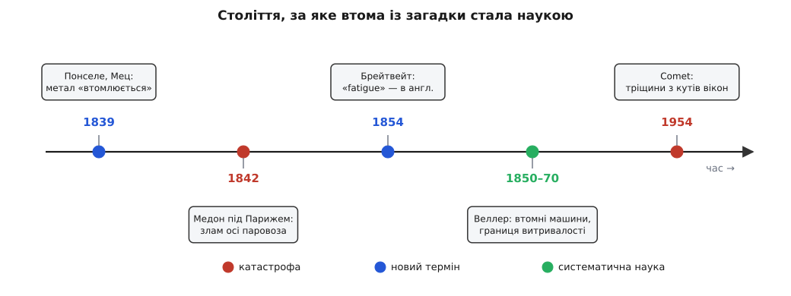

# 📜 Як залізо навчили «втомлюватися»: історія відкриття втоми

Уся рання доба заліза й пари жила з прикрою таємницею, для якої довго не було навіть слова. Вал, вісь, ланцюг чи ресора служили місяцями бездоганно, витримуючи навантаження, під якими не гнулися й не тріщали, — а тоді одного дня, без жодного видимого приводу, ламалися начисто. Не перевантажили, не вдарили, не перегріли: те саме зусилля, яке метал спокійно ніс тисячу разів, тисяча першого його вбивало. Механіки XIX століття називали такі осі «кристалізованими» — мовляв, від тряски добре куте залізо саме собою перетворюється на крихке, зернисте, як цукор. Пояснення було хибне до останнього слова, але воно чесно віддзеркалювало розгубленість: злам виглядав так, наче метал зрадив зсередини.

Історія відкриття втоми — це історія того, як ця розгубленість крок за кроком здобувала спершу назву, потім рахунок жертв, а тоді й число. Розберімо її по-справжньому: хто дав явищу ім'я, яка катастрофа змусила за нього взятися всерйоз, хто вперше проміряв його лінійкою — і чому навіть через сто років, уже з наукою в руках, інженери все одно наступили на ті самі граблі, поховавши разом із ними перший реактивний лайнер.

*Століття, за яке втома зі здогаду перетворилася на інженерну науку. Синім — коли явище діставало слово, червоним — коли воно вбивало й тим підганяло дослідження, зеленим — коли Веллер уперше поставив його на дослідну лаву. Проміжки не в масштабі: між першим виміром і катастрофою Comet минуло майже століття, а урок про гострі кути довелося вчити двічі.*

### Слово, якого бракувало: Понселе в Меці

Дати явищу влучне ім'я — уже піввідкриття, бо ім'я задає, як про нього думати. Слово «втома» в цьому інженерному сенсі завдячують французові **Жанові-Віктору Понселе** (Jean-Victor Poncelet, 1788–1867) — тому самому, кого математики знають як одного з батьків проєктивної геометрії, вигаданої ним, за переказом, у полоні після наполеонового походу на Москву. Але Понселе був і військовим інженером, і з 1825 року — професором механіки у Прикладній школі в Меці (École d'application de Metz), школі артилерії та інженерії. Саме в його лекціях наприкінці 1830-х (усталено — близько 1839 року) метали вперше «втомлюються»: Понселе описав, як деталь, що раз за разом зазнає то натягу, то попуску, зрештою руйнується під зусиллям, набагато меншим за те, що зламало б її одним ривком. Метафора була зухвало точна — метал поводиться, наче жива істота, яку зношує сама праця, — і саме тому прижилася. У друкованому вигляді ця думка вийшла трохи згодом, у його «Вступі до промислової механіки» (Introduction à la mécanique industrielle, 1841), де він прямо каже, що будь-яка пружина під поштовхами туди-сюди врешті лусне за навантаженням, далеко меншим від статичного.

Тут варто бути точним у тому, що саме зробив Понселе, бо історія відкриттів любить роздавати єдиноосібні лаври там, де була колективна праця. Понселе не пояснив механізм втоми — до тріщин, концентрації напружень і кристалографії зсувів було ще далеко. Він зробив інше й не менш важливе: дав явищу ім'я і чітко сформулював його головний парадокс — руйнує не величина сили, а її повторення. Це вже був спосіб думати про проблему як про окрему, самостійну, а не списувати все на «поганий метал».

### Як «втома» ввійшла в англійську інженерію: Брейтвейт і загадковий містер Філд

Французьке слово ще треба було перенести в інженерну мову, якою тоді будували найбільше заліза, — англійську. Це зробив англієць **Фредерік Брейтвейт** (Frederick Braithwaite) статтею 1854 року з промовистою назвою «Про втому та спричинений нею злам металів» (On the Fatigue and Consequent Fracture of Metals), поданою до лондонського Інституту цивільних інженерів (Institution of Civil Engineers). Її й вважають працею, що остаточно закріпила термін *fatigue* в англійському технічному вжитку. Брейтвейт не теоретизував — він зробив річ, яка й дотепер лишається основою інженерної науки: зібрав докупи каталог реальних службових зламів. Тріснуті осі та важелі, поламані колінчасті й гребні вали, помпи водогонів, крани, устаткування броварень — десятки випадків, у яких добрий метал руйнувався не від удару, а від довгої повторюваної роботи. Це показувало, що явище всюдисуще й системне, а не низка прикрих випадковостей.

Цікава й повчальна деталь: сам Брейтвейт слова *fatigue* собі не приписував. У статті він чесно віддає авторство терміна такому собі **містерові Філду** (Mr Field). Хто це був — документально не з'ясовано; за браком певності не варто його ототожнювати з жодним із відомих інженерів на прізвище Філд, хоч спокуса є. Ця дрібничка сама собою — маленький урок історіографії: навіть у момент народження терміна його творець вказує на когось попереднього, і ланцюг «хто перший сказав» тоне в усних розмовах інженерних майстерень, які ніхто не записав. Тож охайне формулювання таке: слово прийшло з французьких лекцій Понселе, а в англійську інженерну літературу його ввів Брейтвейт 1854 року, сам приписавши його Філдові. І, щоб не сплутати: автор цієї статті — Фредерік Брейтвейт, а не однофамілець Джон Брейтвейт, відоміший будівничий ранніх паротягів.

### Медон, 8 травня 1842: коли осі почали вбивати

Слово вже було, каталог зламів теж, — але по-справжньому за втому взялися не через лекцію, а через вогонь і смерть. 8 травня 1842 року під Парижем сталася катастрофа, яку вважають першою великою залізничною трагедією Франції й найсмертоноснішою у світі на той час. Святковий потяг віз до Парижа юрму людей, що поверталися з фонтанних гулянь у Версалі. У виїмці між станціями Медон і Бельв'ю в головного з двох паротягів **зламалася вісь** — і машина зарилася в колію. Вагони, важкі й дерев'яні, налетіли ззаду один на одного і спалахнули від розжарених топок паротягів. Найстрашніше було те, що за тодішнім звичаєм дверцята вагонів на час руху замикали ззовні — щоб пасажири не повискакували. Тепер вони не могли вискочити з вогню.

Скільки саме людей загинуло, точно не знає ніхто: полум'я знищило тіла, і оцінки розходяться від приблизно п'ятдесятьох до кількох сотень; найчастіше називають близько п'ятдесяти п'яти. Серед загиблих — уславлений мореплавець і дослідник Антарктики й Океанії **Жуль Дюмон-Дюрвіль** (Jules Dumont d'Urville) разом із дружиною та сином, які згоріли всі разом. Саме масштаб і публічність трагедії зробили те, чого не зробили роки поодиноких зламів: держава призначила комісію, а та дійшла тверезого висновку — осі треба **випробовувати**, визначати їхній безпечний ресурс і міняти після певного пробігу, не чекаючи зламу. Це вже була зернина інженерної відповіді: не «ремонтувати після біди», а рахувати ресурс наперед. Над самою природою зламу осей у ті ж десятиліття думали Ренкін (Rankine), Ферберн (Fairbairn) та інші — і поступово ставало зрозуміло, що винна не міфічна «кристалізація від тряски», а щось, що зароджується й повзе всередині металу.

> 🔧 **Навіщо це.** Медонський злам — класичний приклад того, як інженерна дисципліна вчиться коштом катастроф, а не наперед. Дві речі, що вбивали разом із віссю, — замкнені зовні дверцята й дерев'яні вагони обабіч розжарених топок — теж пішли в переробку: пасажирів перестали замикати. Відтоді й донині розслідування аварій лишається головним двигуном норм безпеки: майже кожне правило вписане тим, що колись хтось загинув без нього.

### Август Веллер і перша наука про втому

Комісія сказала «випробовувати осі» — але як саме, скільки, за яким законом? Перетворити тривогу на число зумів німецький залізничний інженер **Август Веллер** (August Wöhler, 1819–1914). У 1850–60-х роках, працюючи на прусських (Нижньосілезько-Маркській) залізницях, він зробив те, чого доти не робив ніхто системно: побудував машини, які роками циклічно навантажували справжні вагонні осі, імітуючи обертове згинання під колесом, і терпляче лічив, на якому циклі кожна трісне. Це був перехід від здогадів до дослідної лави — народження втоми як вимірюваної науки.

З гори цих даних Веллер витяг два висновки, на яких і досі стоїть уся справа. Перший: для міцності важливий не так найбільший пік напруження, як **розмах** його коливання — амплітуда циклу. Другий, ще важливіший: у сталі існує таке напруження, нижче за яке вісь витримує, скільки завгодно циклів, і не ламається взагалі, — те, що згодом назвуть **границею витривалості**. Свої машини й зразки Веллер показав широкій публіці на Всесвітній виставці в Парижі 1867 року, а 1870-го підсумував працю у звіті, що спирався на понад три сотні випробувань, — і сформулював те, що інженери назвали «законами Веллера».

Тут потрібна чесна історична поправка, бо саме її звичайно пропускають. Знамениту **криву Веллера** — плавну лінію «амплітуда проти числа циклів» — сам Веллер… не креслив. Свої результати він подавав **таблицями чисел**. У графік їх уперше переклав дещо пізніше його наступник **Людвіг Шпангенберг** (Ludwig Spangenberg) у 1870-х (щоправда, у незвичних лінійних осях), а звична назва «крива Веллера» закріпилася аж у 1930-х. Це не применшує Веллера — навпаки, ставить його заслугу на правильне місце: він дав **дані й закони**, а звичний нам образ кривої — плід дальшої колективної праці, як і майже всяке «відкриття». Пам'ятати про це варто щоразу, коли якесь досягнення приписують одному прізвищу однією лінією на графіку.

### Comet: кути вікон, що коштували 56 життів

Здавалося б, із наукою Веллера в руках катастрофи мали скінчитися. Не скінчилися — і найгучніший урок припав аж на 1954 рік, майже за століття після того, як Понселе вимовив слово «втома». Британський **de Havilland Comet** був першим у світі реактивним пасажирським лайнером — гарним, швидким, гордістю повоєнної Британії. За кілька місяців 1954-го два таких літаки розвалилися просто в повітрі. 10 січня Comet рейсу BOAC 781 розпався над морем біля острова Ельба — загинули всі 35 на борту. 8 квітня, коли машини вже нашвидку «підлатали» й повернули в небо, другий Comet розпався біля Стромболі поблизу Неаполя — ще 21 загиблий. Разом — п'ятдесят шість життів і повний обвал репутації.

Розслідування, яке провів британський авіадослідний центр (RAE) у Фарнборо, стало взірцем інженерної криміналістики. Цілий фюзеляж Comet (борт G-ALYU) занурили у велетенський бак із водою й раз за разом накачували й спускали тиск, імітуючи наддув кабіни в кожному польоті. Після приблизно **трьох тисяч** таких циклів метал луснув — і слідчі точно вказали, звідки. І ось тут криється деталь, яку популярна легенда завжди спрощує. Розхожа версія каже: винні «квадратні пасажирські ілюмінатори». Точніша правда така: тріщина зародилася не в пасажирському вікні, а біля майже прямокутного **отвору радіоантени (радіопеленгатора, ADF) у стелі кабіни** — і не просто в кутку, а на **пробитому** заклепковому отворі. Заклепкові гнізда там проштампували ударом, а не висвердлили, як передбачала первісна специфікація, і грубі, надірвані краї пробитих отворів у поєднанні з гострим кутом вирізу дали ідеальний концентратор напружень. Кожен наддув кабіни надривав метал у тій цятці; втомна тріщина повзла звідти, аж доки фюзеляж не розкрився в польоті.

Урок був той самий, що його інженерія нібито вже засвоїла на осях XIX століття: **гострий внутрішній кут — це смертний вирок під повторюваним навантаженням**. Тому висновок Comet простий і назавжди: округляти. Відтоді вікна всіх наддувних літаків — з плавно заокругленими кутами, а заклепкові отвори в силових швах — свердлять, а не пробивають. Кожен ілюмінатор, крізь який ви дивитеся з висоти, має м'яко заокруглені ріжки саме тому, що колись їх не мав.

---

Складімо цю дугу докупи, бо вона повчальна сама собою. Спершу — **слово**: Понселе в Меці близько 1839-го дав явищу назву й парадокс (руйнує повторення, а не сила), а Брейтвейт 1854-го переніс термін в англійську інженерію, чесно приписавши його ще давнішому Філдові. Потім — **рахунок жертв**: медонський вогонь 1842 року змусив державу вимагати випробувань осей. Потім — **число**: Веллер у 1850–70-х поставив втому на дослідну лаву, дав закони й границю витривалості (а звичну криву накреслили вже після нього). І нарешті — **нагадування**, що знання не рятує само собою: Comet 1954 року загинув від гострих кутів, про які було відомо століття. Головне, що варто винести з цієї історії: втома довго була безіменною й тому нездоланною; здобувши ім'я, катастрофу-двигун і вимір, вона стала керованою — але лишається безжальною до кожного, хто забуде хоч один із її давно оплачених кров'ю уроків.
