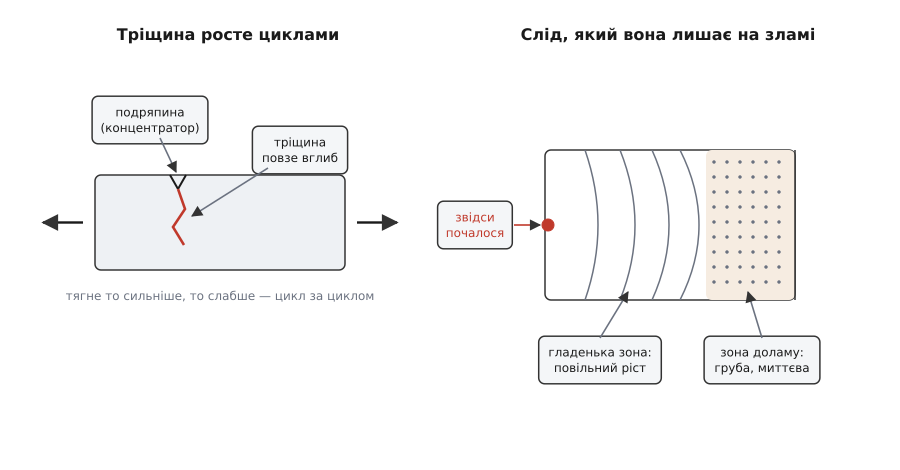
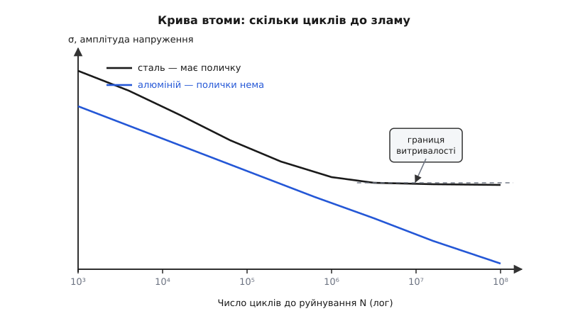
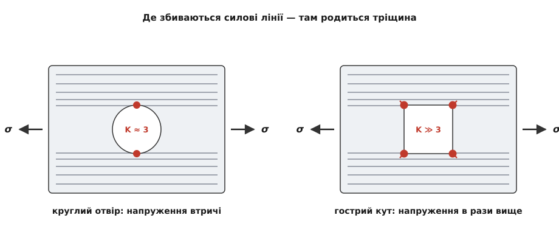

# Втома матеріалу: чому метал ламається від повторів, а не від сили

<preknowlist>
- [Пружна деформація і закон Гука](topic:physics/elastic-deformation) — що таке напруження σ = F/A (сила на одиницю площі перерізу) і деформація; поки навантаження помірне, тіло пружно повертається у форму.
- [Пластична деформація і границя плинності](topic:physics/plastic-deformation) — границя плинності й границя міцності: напруження, за яких матеріал починає незворотно текти й зрештою рветься від одноразового навантаження. Утома ламає **нижче** за ці межі.
</preknowlist>

Візьміть звичайну канцелярську скріпку й обережно розігніть її — дріт пружинить назад, не ламається. Тепер зігніть його туди-сюди раз, другий, п'ятий. На восьмому-десятому згині скріпка несподівано лусне, а місце зламу навіть трохи тепле на дотик. Дивно: жодного разу ви не тягнули з силою, здатною розірвати дріт одним ривком, — і все ж він розірвався. Сила щоразу була та сама й цілком безпечна; убили скріпку самі **повтори**.

Так само гине куди серйозніше залізо. Вагонна вісь, що тисячі разів на день пружно прогинається під колесом; крило літака, яке за політ сотні разів роздувається наддувом кабіни; вал двигуна, лопать гвинта, ресора — усі вони роками носять навантаження, багато менше за те, що зламало б їх одразу, і все ж одного дня тріскають, наче без причини. Це явище й називають **втомою матеріалу** (наукова назва — від латин. *fatigare*, стомлювати: метал, мовляв, «утомлюється» від роботи): руйнування під дією повторюваного навантаження за напружень, помітно нижчих за ту межу, що витримала б сталу, незмінну силу. Розберімо, чому повторення робить те, чого не здатна одна сила, де саме зароджується злам і як інженер від цього боронить конструкцію.

### Чому повтори руйнують те, що витримує силу

Ключ до всієї загадки в тому, що **напруження в деталі ніде не однакове**. Ми звикли думати про міцність усередненими числами: така-то сталь тримає стільки-то мегапаскалів. Але це середнє по перерізу. У реальній деталі завжди є місця, де напруження місцево набагато вище за середнє, — біля дрібної подряпини, різьби, отвору, гострого кута, зернистого дефекту в металі, сліду від різця. У такій цятці, поки решта деталі спокійно пружинить, метал місцево заходить за свою пружну межу й тече — **пластично**, незворотно.

За одне навантаження ця мікроскопічна текучість нічого страшного не робить: зсунулося кілька кристалічних площин на атомні відстані, та й годі. Але навантаження **повертається знову і знову**. Щоразу в тій самій цятці кілька площин зсовуються, а при знятті навантаження зсовуються назад — тільки не точнісінько назад. Кожен цикл лишає крихітну незагоєну сходинку на поверхні: десь метал виліз мікроскопічним гребінцем, десь утворилася западинка. Цикл за циклом ці сходинки заглиблюються, аж доки в одній з них не проросте справжня **тріщина** (початок — Стадія I).

Ось де ховається головний обман втоми. Тріщина — не просто дефект: це **власний, ще гостріший концентратор напружень**. Її вістря стягує на себе силові лінії ще щільніше, ніж початкова подряпина, тож напруження на кінчику тріщини багатократно більше за середнє. Тому щойно тріщина з'явилась, кожен наступний цикл підростає її на крихітну дещицю — метал на вістрі щораз надривається й тріщина посувається вперед (Стадія II, повільне поширення). Вона повзе впоперек деталі роками, з'їдаючи живий переріз, а деталь тим часом працює як ні в чому не бувало. І лише коли непошкодженого металу лишається так мало, що він уже не витримує звичайного робочого навантаження, настає Стадія III — **раптовий долам** за один цикл, миттєвий і без попередження.


*Як живе втомна тріщина. Ліворуч — пластина під циклічним розтягом: тріщина зароджується на поверхневій подряпині й крок за кроком повзе вглиб. Праворуч — сам злам: гладенька зона з дугами-«пляжними смугами» (кожна дуга — межа, до якої тріщина дійшла за черговий етап повільного росту) і зовсім поряд груба, волокниста зона доламу, що луснула миттєво. За цим візерунком слідчий одразу впізнає втому й навіть знаходить точку, де все почалося.*

Ця картина одразу пояснює, чому втома така підступна. Деталь не деформується завчасно, не провисає, не подає жодного видимого знаку — тріщина ховається всередині чи в тонкій поверхневій щілині. Аж раптом злам. Тому в техніці втома — причина більшості несподіваних руйнувань металу, що «служив нормально».

І варто одразу спростувати спокусливу аналогію, закладену в самій назві. Утомлений м'яз відпочине — і відновиться; утомлений метал **не відновлюється ніколи**. Пошкодження від кожного циклу лишається назавжди й тільки додається до попереднього. «Дати деталі відпочити» не поверне їй ресурсу — накопичене вже накопичене. Саме тому втому рахують не в годинах роботи, а в **числі циклів**.

### Скільки циклів витримає деталь: крива Веллера

Якщо руйнує число циклів, то напрошується питання: скільки саме їх треба? Відповідь дає простий дослід. Беруть однакові зразки, кожен циклічно навантажують до певної амплітуди напруження й лічать, на якому циклі він трісне. Що вища амплітуда — то менше циклів витримує зразок. Відклавши амплітуду напруження проти числа циклів до руйнування, дістають **криву втоми**, або **криву Веллера** — на честь німецького інженера Августа Веллера, який у 1850–60-х роках уперше системно проміряв її на вагонних осях (цю історію — від залізничних катастроф до перших машин для втомних випробувань — розказано в [історичній вставці](topic:physics/material-fatigue/hist-fatigue-discovery.md)).


*Крива втоми (S–N). По горизонталі — число циклів до руйнування N у логарифмічному масштабі (кожна поділка — удесятеро більше), по вертикалі — амплітуда напруження. Що менша амплітуда, то довше живе деталь. Крива сталі при ~10⁶–10⁷ циклів **вирівнюється** в горизонтальну поличку — це границя витривалості: нижче за неї сталь тримає практично нескінченно. Крива алюмінію такої полички не має — вона повзе вниз без упину, тож алюміній зрештою руйнується за будь-якого, хай і крихітного, циклічного напруження.*

Крива відразу відкриває дві речі. Перша: горизонтальна вісь — логарифмічна, тобто невелике зниження амплітуди подовжує життя не на відсотки, а в рази й десятки разів. Зменшили робоче напруження на чверть — і ресурс зріс, може, стократно. Це найдешевший важіль конструктора: трохи потовщити деталь, щоб знизити напруження, — і втома відступає надовго.

Друга річ куди дивовижніша й важливіша. У сталей та ще кількох матеріалів крива на певному напруженні перестає падати й лягає горизонтальною поличкою. Це напруження називають **границею витривалості** (*fatigue limit*, або endurance limit): якщо амплітуда циклу нижча за неї, деталь не зруйнується від утоми **скільки завгодно довго** — мільярди циклів їй не зашкодять. Для багатьох сталей ця границя лежить приблизно на половині границі міцності. Ось чому сталевий вал можна спроєктувати «на вічність»: тримай робоче напруження під поличкою — і про втому можна забути.

А тепер підступ: алюміній, мідь і чимало інших кольорових металів **такої полички не мають**. Їхня крива втоми повзе вниз без кінця. Це означає, що алюмінієва деталь під будь-яким циклічним навантаженням, хоч би яким слабким, колись та й трісне — питання лише в кількості циклів. Для неї немає «безпечного назавжди» напруження; є тільки «протримається стільки-то циклів».

> 🔧 **Навіщо це.** Саме тому алюмінієвий планер літака має **вичерпний ресурс**, виміряний у польотних циклах і льотних годинах, після якого його списують, — тоді як сталевий міст чи вал ходить десятиліттями. Кожен зліт-посадка з наддувом кабіни — це один великий цикл «роздули–здули» фюзеляж; алюміній не пробачає їх нескінченно, тож регламент рахує ці цикли й відправляє машину на пенсію, доки втома ще не дійшла до небезпеки. Конструктор дрона стикається з тим самим у мініатюрі: алюмінієві промені рами й моторні кронштейни живуть скінченне число вильотів, надто якщо їх ще й трясе [механічний резонанс](topic:physics/mechanical-resonance) на оборотній частоті гвинтів — резонанс легко накручує ті мільйони циклів, що доїдають метал.

### Де народжується тріщина: концентрація напружень

Тріщина завжди заводиться там, де напруження місцево підскакує, — і в цього винуватця є ім'я: **концентрація напружень**. Уявіть силу, що тече крізь деталь, як потік води крізь русло: силові лінії біжать від одного затиску до іншого. Якщо на дорозі трапляється отвір, виріз чи гострий кут, лінії мусять його обтікати — і, як вода у звуженні, згущуються обабіч перешкоди. Де лінії найгустіші, там напруження найбільше.


*Концентрація напружень на двох вирізах під однаковим розтягом. Ліворуч — круглий отвір: силові лінії плавно розступаються, найгустіше збиваючись обіч отвору, де напруження втричі перевищує середнє (коефіцієнт концентрації K ≈ 3). Праворуч — виріз із гострим кутом: лінії намертво збиваються в кутику, і напруження там підскакує в багато разів вище. Саме в цих червоних точках і зароджується втомна тріщина; що гостріший кут, то вищий пік — і тим швидше починається злам.*

Наскільки сильно підскочить напруження, задає **коефіцієнт концентрації** K — у скільки разів місцеве напруження перевищує середнє. Для витягнутого еліптичного отвору чи виріза є проста й напрочуд промовиста формула:

```
σ_max = σ_сер · (1 + 2·a/b)
```

тут `a` — піврозмір виріза впоперек навантаження, `b` — уздовж. Уся сіль у відношенні `a/b`: чим гостріший, довший, вужчий виріз (велике `a`, мале `b`), тим більший стрибок.

**Приклад (округлий отвір проти гострого виріза).** Порівняймо два однакові за площею вирізи в пластині під однаковим розтягом σ_сер = 100 МПа: круглий отвір (a = b) і витягнутий виріз із відношенням a/b = 8.

```
круглий отвір (a = b):      σ_max = 100 · (1 + 2·1)  = 100 · 3  = 300 МПа
гострий виріз (a/b = 8):     σ_max = 100 · (1 + 2·8)  = 100 · 17 = 1700 МПа
```

Круглий отвір потроює напруження — уже недобре, але терпимо. А гострий виріз тієї самої «дірявості» роздуває його аж усемнадцятеро, до 1700 МПа, — це вже вище за міцність більшості сталей. Різниця не в тому, скільки металу вибрано, а лише у **формі кутика**: гострий ріг стягує на себе напруження, округлий — розпускає його. Звідси золоте правило конструктора: жодних гострих внутрішніх кутів — усі переходи роблять плавними заокругленнями (галтелями).

Цю ціну гострого кута інженерія затямила дорогою кров'ю. Перший реактивний пасажирський лайнер de Havilland Comet у 1954 році двічі розвалився в повітрі, забравши 56 життів, — і винними виявилися майже прямокутні ілюмінатори з тіснуватими кутами. Кожен наддув кабіни концентрував у тих кутах напруження, звідти пішли втомні тріщини, і фюзеляж луснув. Відтоді ілюмінатори всіх наддувних літаків — округлі. Цю та інші показові катастрофи докладніше розібрано в [історичній вставці](topic:physics/material-fatigue/hist-fatigue-discovery.md).

> 🔧 **Навіщо це.** Оскільки тріщина майже завжди починається на поверхні й на концентраторі, боротьба з утомою — це передусім боротьба за **чисту поверхню й плавні форми**. Прибирають гострі кути (галтелі замість ребер), шліфують сліди обробки, знімають задирки біля отворів. А найдієвіше — наганяють у поверхневий шар **стискальні залишкові напруження**: дробоструменеве оброблення (обстріл дрібним дробом), обкатування роликом, азотування. Стиснена поверхня мусить спершу «розтиснутись», перш ніж циклічний розтяг зможе рвати метал, — і границя витривалості деталі підскакує в рази. Тому відповідальні вали й пружини не лишають «як виточено», а обов'язково зміцнюють поверхню.

### Коли навантаження різнопланове: накопичення пошкоджень

Насправді ж навантаження рідко буває рівним і однаковим. За один політ крило встигне пережити тисячі дрібних поштовхів від турбулентності, кілька середніх від маневрів і один-два великих від посадкового удару. Як скласти шкоду від такої мішанини?

Найпростіша й найуживаніша відповідь — **правило Палмґрена–Майнера** (швед Арвід Палмґрен запропонував його 1924 року для підшипників, американець Мілтон Майнер узагальнив на втому 1945-го). Ідея пряма, як лінійка: кожен цикл з'їдає частинку ресурсу, і частинки просто додаються. Якщо за напруженням, від якого деталь витримала б N₁ циклів, вона відпрацювала n₁ циклів, то з'їдено частку n₁/N₁ її життя. Складіть такі частки за всіма рівнями навантаження; коли сума дійде до одиниці — деталь вичерпана:

```
n₁/N₁ + n₂/N₂ + n₃/N₃ + … = 1   →  руйнування
```

**Приклад (скільки польотів витримає кронштейн).** Кронштейн за кожен політ проходить 2000 слабких циклів (за таким напруженням його ресурс N₁ = 10⁶) і 40 сильних (ресурс N₂ = 2·10⁴). Яку частку життя з'їдає один політ і на скільки польотів вистачить деталі?

```
шкода за політ:  D = 2000/10⁶ + 40/(2·10⁴)
                   = 0.0020    + 0.0020
                   = 0.0040

польотів до руйнування:  1 / 0.0040 = 250 польотів
```

Придивіться до чисел: рідкі 40 сильних циклів завдають рівно стільки ж шкоди, скільки цілих 2000 слабких. Причина — та сама логарифмічна крива втоми: підняли амплітуду ледь-ледь, а ресурс за цим напруженням упав у десятки разів, тож кожен «важкий» цикл коштує як десятки «легких». Ось чому в утомі правлять бал не звичні дрібні коливання, а нечасті великі перевантаження, і саме їх вишукують передусім.

Щоб застосувати правило Майнера до заплутаної, ніби випадкової кривої навантаження з датчика, її спершу треба розкласти на окремі замкнені цикли — це роблять хитромудрим алгоритмом **rainflow-підрахунку** («метод дощу»). Як він працює й як на його основі оцінити ресурс із реального запису навантажень — з робочим кодом — розібрано в [алгоритмічній вставці](topic:physics/material-fatigue/proj-rainflow-miner.md). А точні закони, що стоять за кривою втоми (степеневий закон Басквіна), за швидкістю росту тріщини (закон Періса da/dN = C·(ΔK)ᵐ) і за самою формулою концентрації, зібрано в [математичній вставці](topic:physics/material-fatigue/math-fatigue-laws.md).

### Як конструюють проти втоми

Знаючи ворога, інженерія виробила три різні стратегії оборони, і вибір між ними — це вибір ціни помилки.

Перша — **безпечний ресурс** (safe-life): деталь розраховують так, щоб за весь строк служби вона й близько не набрала фатального числа циклів, а тоді безумовно списують — навіть цілісіньку на вигляд. Так живуть вали, ресори, деталі, які нема як оглянути зсередини. Просто, але марнотратно: викидаємо ще міцне.

Друга — **живучість** (fail-safe): конструкцію роблять так, щоб руйнування однієї деталі не було катастрофою. Дублюють силові шляхи, ставлять «зупинники тріщин» — і якщо одна лопне, навантаження підхоплять сусідні, а пілот устигне сісти.

Третя, найсучасніша, — **допуск пошкоджень** (damage-tolerant): визнають, що тріщини **будуть**, і будують розрахунок на тому, як повільно вони ростуть. Знаючи швидкість росту (той самий закон Періса), призначають регулярні огляди так часто, щоб будь-яку тріщину напевно помітили й усунули, поки вона ще мала й безпечна, задовго до критичного розміру. Саме тому літаки методично «просвічують» дефектоскопами за розкладом.

А під усіма трьома стратегіями лежить той самий фундамент: тримати робоче напруження нижче границі витривалості там, де вона є; винищувати концентратори — заокруглювати кути, шліфувати й зміцнювати поверхню; і пам'ятати, що кольорові метали безпечної «вічної» полички не мають, тож їхнім деталям належить рахований ресурс.

---

Отже, **втома матеріалу** — це руйнування від повторюваного навантаження за напружень, нижчих за одноразову міцність. Працює вона так: у концентраторах напружень (подряпинах, отворах, гострих кутах) метал циклічно надривається, там зароджується тріщина, вона крок за кроком повзе крізь переріз — лишаючи на зламі характерні «пляжні смуги» — і зрештою решта металу ламається миттєво. Скільки циклів витримає деталь, показує крива втоми; у сталей вона має границю витривалості (нижче неї — практично вічно), у алюмінію такої границі немає — він завжди зрештою руйнується. Тріщини родяться на концентраторах, тому боротьба з утомою — це плавні форми й зміцнена поверхня; шкоду від різнопланових навантажень складають правилом Майнера; а конструюють проти втоми, поєднуючи безпечний ресурс, живучість і допуск пошкоджень. Головне, що варто винести: метал убиває не сила, а її невтомне повторення — і, на відміну від утомленого м'яза, метал від повторів не відпочиває, а лише накопичує невидиму шкоду до останнього, раптового циклу.
