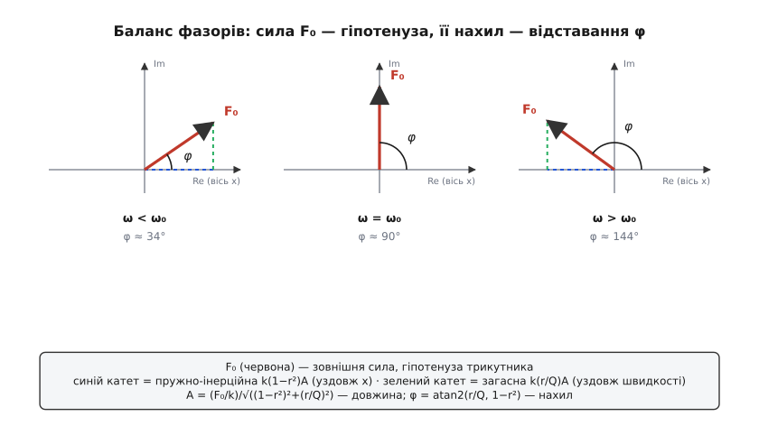
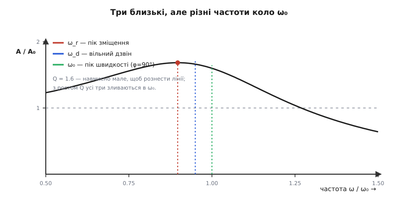
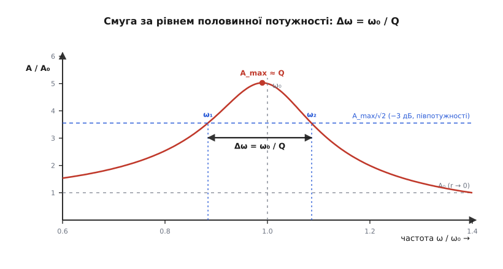

# 🧮 Вимушений загасний осцилятор: звідки беруться A(ω) і φ(ω)

Уся поведінка резонансу — гострий пік, поворот фази, розбіжність кількох «резонансних» частот, число добротності — сидить в одному-єдиному рядку:

```
m·ẍ + c·ẋ + k·x = F₀·cos(ω t)
```

Це рівняння руху маси m на пружині k з демпфером c, яку розгойдує зовнішня сила амплітудою F₀ і частотою ω. Ліворуч — три сили, що діють на масу: інерція m·ẍ (маса опирається зміні швидкості), загасання c·ẋ (втрати, пропорційні швидкості) і пружний поворот k·x (тягне до рівноваги за [законом Гука](topic:physics/elastic-deformation)). Праворуч — двигун. Уся ця вставка — про те, як із цього рівняння **чесною алгеброю** витягти дві функції частоти: амплітуду сталих коливань A(ω) і їхнє відставання по фазі φ(ω), а з них — точне положення піка, різницю між трьома близькими частотами й сенс добротності Q. Жодного нового фізичного припущення не додамо — усе вже сховане в трьох доданках ліворуч.

### Безрозмірна форма: три числа замість чотирьох

Спершу приберемо зайве. Поділимо все рівняння на масу m — і чотири розмірні сталі m, c, k, F₀ згорнуться у зручніші комбінації:

```
ẍ + (c/m)·ẋ + (k/m)·x = (F₀/m)·cos(ω t)
```

Відношення k/m ми впізнаємо одразу: це квадрат [власної частоти](topic:physics/harmonic-oscillator) — того темпу, у якому маса гойдалася б сама, без тертя й без двигуна. А коефіцієнт при швидкості заведено записувати через два безрозмірні числа — **коефіцієнт загасання** ζ (дзета) і рівнозначну йому **добротність** Q:

```
ω₀ = √(k / m)                     власна (недемпфована) частота
ζ  = c / (2·√(k·m)) = c / (2·m·ω₀)   коефіцієнт загасання (безрозмірний)
Q  = 1 / (2·ζ) = √(k·m) / c = m·ω₀ / c   добротність
```

Чому саме такі комбінації, а не просто c? Бо голе c нічого не каже: демпфер c = 1 Н·с/м у наручному годиннику — це майже ідеальний осцилятор, а в дверному доводчику — глухе гальмо. Значення має лише **співвідношення** втрат до інерції й пружності, і саме його ловить безрозмірне ζ. Зручно ще ввести відносну частоту r = ω/ω₀ (у скільки разів двигун швидший за власний темп) і **статичний прогин** A₀ = F₀/k — те відхилення, яке дала б сила F₀, прикладена нерухомо. Тоді рівняння набуває вигляду, у якому вже немає ні кілограмів, ні ньютонів:

```
ẍ + 2·ζ·ω₀·ẋ + ω₀²·x = ω₀²·A₀·cos(ω t)        (бо F₀/m = (F₀/k)·(k/m) = A₀·ω₀²)
```

### Сталий відгук: система забуває, з чого почала

Загальний розв'язок цього рівняння — сума двох рухів. Перший — **власний**, розв'язок однорідного рівняння (без правої частини): вільні загасні коливання, що згасають як e^(−ζω₀t) і живуть на своїй [загасній частоті](topic:physics/damped-oscillator). Через кілька характерних часів вони практично зникають — саме тому їх звуть **перехідним процесом**. Другий рух — **вимушений**, він не згасає, бо його весь час підживлює двигун. Коли перехідний доданок відмер, лишається чистий сталий стан, і фізика тут проста: система **забуває початкові умови** й коливається строго в нав'язаному ритмі ω, лише зсунута по фазі:

```
x(t) = A·cos(ω t − φ)
```

Тут A — амплітуда усталених коливань, а φ — на скільки рух **відстає** від сили (мінус перед φ означає саме відставання: пік зміщення приходить пізніше за пік сили). Уся задача звелася до двох чисел: як A і φ залежать від частоти ω. Знайти їх — і крива резонансу, і поворот фази виводяться самі.

### Комплексна амплітуда: алгебра замість тригонометрії

Підставляти x(t) = A·cos(ωt − φ) напряму й розкривати косинуси суми — шлях правильний, але марудний: похідні плодять і синуси, і косинуси, які доводиться вручну збирати. Є вправніший спосіб, [метод комплексної амплітуди (фазора)](topic:math/phasors): косинус — це дійсна частина оберту e^(iωt), тож замінімо реальну силу її комплексним продовженням F₀·e^(iωt), розв'яжімо лінійне рівняння в комплексних числах, а наприкінці візьмімо дійсну частину. Уся вигода в тому, що диференціювання e^(iωt) — це просто множення на iω, і рівняння з диференціального стає **алгебраїчним**.

Шукаємо відгук у вигляді x = Re(X·e^(iωt)), де X = A·e^(−iφ) — **комплексна амплітуда**: її модуль |X| = A несе розмах, а її від'ємний аргумент −φ несе відставання. Підставимо. Кожна похідна по часу опускає множник iω, тож ẋ → iω·X, ẍ → (iω)²·X = −ω²·X. Спільний множник e^(iωt) скорочується з обох боків, лишаючи:

```
(−m·ω² + i·c·ω + k)·X = F₀
```

Це вже не рівняння руху, а звичайне лінійне рівняння на одне комплексне число X. Ділимо:

```
        F₀                    F₀
X = ────────────────  =  ──────────────────
    k − m·ω² + i·c·ω      (k − m·ω²) + i·c·ω
```

Тепер перепишемо знаменник через наші безрозмірні числа — і вся розмірна каша згорнеться. Перший доданок: k − m·ω² = k·(1 − ω²/ω₀²) = k·(1 − r²), бо m·ω₀² = k. Другий: c·ω = (m·ω₀/Q)·ω = k·(ω/ω₀)/Q = k·(r/Q), бо c = m·ω₀/Q і m·ω₀² = k. Виносимо k:

```
       F₀ / k
X = ──────────────────
    (1 − r²) + i·(r/Q)
```

Знаменник — одне комплексне число. Модуль частки — це частка модулів, аргумент частки — різниця аргументів. Чисельник F₀/k = A₀ дійсний (аргумент 0), тож:

```
A(ω) = |X| =        F₀ / k
                ────────────────────         (амплітудно-частотна характеристика)
                √( (1 − r²)² + (r/Q)² )

φ(ω) = −arg(X) = arg( (1 − r²) + i·(r/Q) ) = atan2( r/Q , 1 − r² )   (фазово-частотна)
```

Ось і все виведення. Дві формули, обидві прямо з рівняння руху, без жодної підгонки. Нормувавши амплітуду на статичний прогин, дістаємо чисте **підсилення** A/A₀ = 1/√((1−r²)² + (r/Q)²) — у скільки разів динамічний відгук більший за статичний.


*Геометричний зміст обох формул. Візьмімо зміщення x за опорну вісь. Тоді дві внутрішні сили складаються в прямокутний трикутник, чия гіпотенуза дорівнює зовнішній силі F₀: горизонтальний катет — пружно-інерційна сила k(1−r²)A (уздовж зміщення), вертикальний — загасна сила k(r/Q)A (на чверть періоду попереду, уздовж швидкості). Теорема Піфагора для цього трикутника дає амплітуду A, а відношення катетів — тангенс кута відставання φ. Ліворуч (ω < ω₀) горизонтальний катет додатний і φ гострий; посередині (ω = ω₀) він зникає — F₀ лягає точно на загасну вісь, φ = 90°; праворуч (ω > ω₀) інерція перемагає пружину, катет міняє знак і φ стає тупим.*

Ця картинка пояснює й амплітуду, і фазу однією геометрією. Знаменник √((1−r²)²+(r/Q)²) — це просто довжина гіпотенузи (поділена на k·A): що вона коротша, то більшу амплітуду A треба, щоб катети дотяглися до фіксованої сили F₀. А кут φ — це нахил тієї гіпотенузи. Звідси й зрозуміло, **чому фаза плавно перетікає від 0° до 180°**, а не стрибає: у формулі стоїть atan2, дволикий арктангенс, що стежить за **чвертю площини**. Поки r < 1, перший аргумент (r/Q) додатний і другий (1−r²) додатний — кут у першій чверті, менший за 90°. На r = 1 другий аргумент занулюється — рівно 90°. За r > 1 він стає **від'ємним**, і atan2 веде кут у другу чверть, до 180°. Звичайний одноликий arctan(r/Q / (1−r²)) тут би збрехав — на переході через ω₀ він дав би стрибок; atan2 знає знак кожного катета окремо й тому проходить крізь 90° неперервно.

### Три частоти, які легко переплутати

Де саме сидить пік амплітуди? Підсилення найбільше там, де знаменник найменший, тож мінімізуймо підкореневий вираз D = (1−r²)² + (r/Q)². Зручно взяти похідну по u = r² (щоб не морочитися з коренями):

```
D(u) = (1 − u)² + u/Q²
dD/du = −2·(1 − u) + 1/Q² = 0     ⇒     u = 1 − 1/(2Q²)
```

Отже, пік зміщення стоїть на частоті

```
ω_r = ω₀·√( 1 − 1/(2Q²) ) = ω₀·√( 1 − 2·ζ² )        (резонансна частота, пік амплітуди)
```

І тут ховається пастка, на якій спотикаються навіть підручники: **резонансна частота ω_r — це не власна частота ω₀** і не загасна частота вільних коливань ω_d. Це три різні числа:

```
ω₀  = √(k/m)                  власна: як гойдалася б маса без будь-якого тертя
ω_d = ω₀·√( 1 − 1/(4Q²) )      загасна: реальна частота вільних загасних коливань (перехідний процес)
ω_r = ω₀·√( 1 − 1/(2Q²) )      резонансна: на ній пік вимушеної амплітуди зміщення
```

Оскільки 1/(2Q²) > 1/(4Q²), маємо строгий порядок **ω_r < ω_d < ω₀**: пік амплітуди сидить трохи **нижче** за власну частоту, а частота вільного дзвону — між ними. Що вище Q (слабше загасання), то тісніше всі три збігаються з ω₀ і то безкарніше їх ототожнюють; при Q = 25, скажімо, вони розходяться менше ніж на 0.1 %. А пік узагалі існує лише поки підкореневий вираз додатний, тобто поки Q > 1/√2 ≈ 0.707 (тобто ζ < 0.707). За сильнішого загасання ніякого горба немає — амплітуда просто монотонно спадає від A₀ зі зростанням частоти.


*Три «резонансні» частоти при помірному Q, коли вони ще помітно розходяться. Пік амплітуди зміщення (жирна точка) стоїть на ω_r — найлівіше. Частота вільних загасних коливань ω_d — трохи правіше. Власна частота ω₀ — ще правіше; саме на ній відставання фази рівно 90° і саме на ній, а не на ω_r, максимальні швидкість і поглинута потужність. З наближенням Q до нескінченності всі три лінії сходяться в одну.*

Чому ж тоді власну частоту ω₀ так наполегливо звуть «резонансною», хоч пік зміщення від неї трохи зсунутий? Бо існує ще один резонанс — **за швидкістю**, і він припадає точно на ω₀ за будь-якого загасання. Амплітуда швидкості дорівнює ω·A, тобто в безрозмірному вигляді пропорційна r/√((1−r²)²+(r/Q)²). Мінімізуючи знаменник, поділений на r², тобто максимізуючи r²/D, легко дістати умову r = 1 **рівно**, без жодної поправки на Q:

```
пік швидкості (і поглинутої потужності):  ω = ω₀   —  точно, за будь-якого Q
```

Це й є «справжній», енергетичний резонанс. На ω₀ відставання фази дорівнює точно 90°, а отже, сила опиняється **точно у фазі зі швидкістю** — і щомиті штовхає масу в бік руху, вливаючи максимум потужності. Пік зміщення (ω_r) і пік швидкості (ω₀) не збігаються саме тому, що зміщення й швидкість зсунуті між собою на чверть періоду.

**Приклад (три частоти для конкретного вузла).** Кронштейн має ω₀ = 400 рад/с і помірне загасання Q = 4. Наскільки розійдуться його три частоти?

```
1/(4Q²) = 1/64  = 0.015625      1/(2Q²) = 1/32 = 0.03125
ω_d = 400·√(1 − 0.015625) = 400·0.99216 ≈ 396.9 рад/с
ω_r = 400·√(1 − 0.03125)  = 400·0.98425 ≈ 393.7 рад/с
```

Пік вимушеної амплітуди (393.7) відстоїть від власної частоти (400) лише на 1.6 % — на око на кривій це майже непомітно, тож у більшості інженерних оцінок усі три сміливо ототожнюють із ω₀. Але у вимірюваннях, де по зсуву піка визначають загасання, ця різниця вже істотна.

### Висота піка й подвійний сенс Q

Наскільки високо злітає підсилення? Підставимо назад найпростіший випадок — саме власну частоту r = 1. Тоді 1 − r² = 0, лишається чистий загасний член:

```
A(ω₀) / A₀ = 1 / √(0 + (1/Q)²) = Q        (підсилення на ω₀ — точно Q)
```

На власній частоті відгук **рівно в Q разів** більший за статичний прогин. Справжній максимум (на ω_r) лише мізерно вищий:

```
A_max / A₀ = Q / √(1 − 1/(4Q²)) ≈ Q·(1 + 1/(8Q²))       (трохи більше за Q)
```

Для Q = 10 це 10.013 замість 10 — різниця в тисячні. Тому інженерне правило «на резонансі підсилення ≈ Q» не наближення від ліні, а майже точна рівність: висоту піка задає одне число Q, і воно ж — коефіцієнт підсилення.

Звідки в Q така влада? Ми означили Q = 1/(2ζ) = √(mk)/c = m·ω₀/c, але за цією алгеброю стоїть енергія. Добротність — це, з точністю до 2π, відношення запасеної в коливанні енергії до тієї, що втрачається за один цикл:

```
Q = 2π · (енергія, запасена в коливанні) / (енергія, втрачена за один період)
```

Мала втрата за цикл (велике Q) означає: щоб урівноважити її, двигунові досить підкачувати потроху, зате коливання встигає накопичити велику енергію — і великий розмах. Той самий Q читається і з вільного згасання: амплітуда вільних коливань спадає як e^(−ω₀t/(2Q)), тобто за n періодів — як e^(−nπ/Q). До частки 1/e вона падає приблизно за Q/π коливань. Тому побутове «Q — це скільки разів система гойднеться, доки затихне» правильне лише за порядком величини: точний коефіцієнт залежить від того, вимірюєте ви спад амплітуди чи енергії.

### Смуга: чому ширина піка — це теж Q

У Q є ще одне, зовсім інше на вигляд обличчя — **ширина резонансної кривої**. Домовимося міряти ширину на рівні **половинної потужності**: там, де амплітуда падає до A_max/√2 від піка (потужність ∝ амплітуда², тож вона на цьому рівні рівно вдвічі менша за пікову — звідси й «−3 дБ», бо 10·lg(½) ≈ −3.01). Знайдімо дві частоти, де це стається. Біля піка зручно писати r = 1 + δ (мале відхилення). Тоді 1 − r² = −2δ − δ² ≈ −2δ, а загасний член (r/Q)² ≈ 1/Q², тож підкореневий вираз

```
D ≈ (2δ)² + (1/Q)² = 4δ² + 1/Q²
```

Пікове значення (δ = 0) дорівнює 1/Q². Половинна потужність — це подвоєний знаменник (амплітуда менша в √2, знаменник більший у √2, його квадрат — удвічі):

```
4δ² + 1/Q² = 2/Q²     ⇒     4δ² = 1/Q²     ⇒     δ = ± 1/(2Q)
```

Дві точки половинної потужності стоять симетрично на r = 1 ± 1/(2Q), тобто на частотах ω = ω₀·(1 ± 1/(2Q)). Відстань між ними — і є ширина смуги:

```
Δω = ω₂ − ω₁ = ω₀ / Q        (ширина за рівнем половинної потужності)
Q = ω₀ / Δω = f₀ / Δf         (те саме, перевернуте)
```

Ось де сходяться два обличчя добротності: те саме число Q, що **множить** амплітуду на резонансі, **ділить** власну частоту, задаючи ширину піка. Високе Q — і високий пік, і вузька смуга, нерозривно. Це не збіг: і те, і те керується тим, як повільно система губить енергію.


*Смуга за рівнем половинної потужності. Горизонтальна лінія проведена на висоті A_max/√2 (тут потужність удвічі менша за пікову, −3 дБ). Вона перетинає криву у двох точках ω₁ і ω₂, симетричних коло ω₀; відстань між ними Δω дорівнює ω₀/Q. Що гостріший пік, то вужча смуга — те саме Q, що задає висоту, задає й ширину.*

**Приклад (смуга датчика).** Кронштейн із власною частотою f₀ = 64 Гц і добротністю Q = 25. Наскільки вузька його резонансна смуга?

```
Δf = f₀ / Q = 64 / 25 = 2.56 Гц
смуга половинної потужності:  63.7 Гц … 66.3 Гц  (64 ± 1.28 Гц)
```

Уся небезпечна зона — лише два з половиною герци завширшки. Це двосічно: аби спокійно жити, робочі частоти машини мають лежати від цього вузького вікна подалі; але й фільтр, що має вирізати резонанс, теж може бути вузьким — досить прибрати ці ~2.6 Гц. Високе Q робить систему прицільно вибірковою — прокляття для кронштейна, дар для радіоприймача, що тим самим вузьким вікном виловлює одну станцію з ефіру.

### Що з цього виходить

З одного рядка m·ẍ + c·ẋ + k·x = F₀·cos(ωt) чиста алгебра видала все: амплітудну характеристику A(ω) = (F₀/k)/√((1−r²)²+(r/Q)²), фазову φ(ω) = atan2(r/Q, 1−r²), точне положення піка ω_r = ω₀√(1−1/(2Q²)) з його відмінністю від власної ω₀ й загасної ω_d, а також обидва обличчя добротності — підсилення ≈ Q на резонансі й ширину смуги Δω = ω₀/Q. Ключем був перехід до комплексної амплітуди, що обернув диференціальне рівняння на ділення одного числа на інше; далі модуль дав амплітуду, аргумент — фазу, а пошук мінімуму знаменника — усі характерні частоти.

І оскільки в цьому виведенні ніде не знадобилося, що m — саме маса, а k — саме пружність, той самий апарат слово в слово переносять на будь-яку систему з інерцією, поверненням і втратами: на [коливальний LC-контур](topic:electronics/lc-resonance), де індуктивність грає роль маси, а опір — роль демпфера, на кварцовий резонатор, на закручену молекулу. Скрізь A(ω), φ(ω) і [добротність Q](topic:physics/q-factor) читаються тими самими формулами — змінюються лише імена літер.
