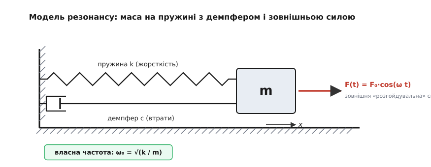
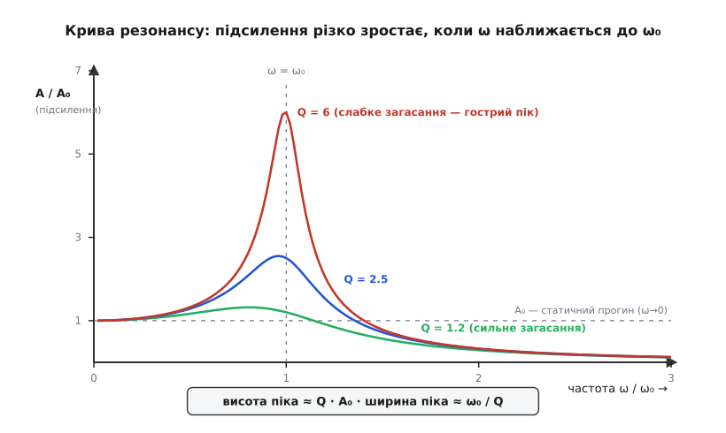
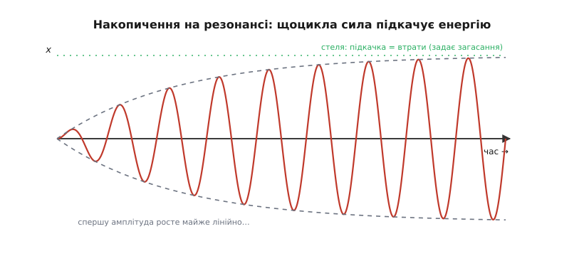
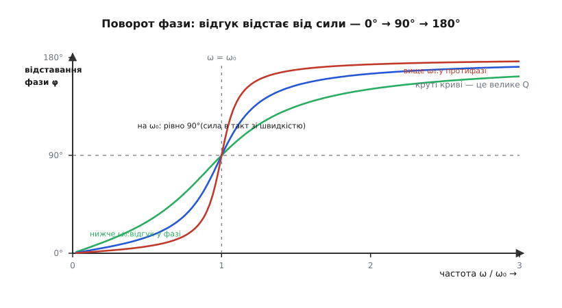

# Механічний резонанс: як поштовх у такт розгойдує велике

<preknowlist>
- [Гармонічний осцилятор](topic:physics/harmonic-oscillator) — маса на пружині й власна частота ω₀ = √(k/m): будь-що з масою та повертальною силою має свій «улюблений» темп коливань.
- [Загасний осцилятор](topic:physics/damped-oscillator) — як тертя й опір поступово гасять вільні коливання; що таке загасання (демпфування).
- [Синусоїда](topic:physics/sine-wave) — форма періодичного руху й періодичної сили; що означають амплітуда й частота.
- [Фаза](topic:physics/phase) — зсув між двома коливаннями в часі, «випередження» і «відставання» на частину періоду.
</preknowlist>

Штовхніть дитину на гойдалці. Ви не тиснете щосили — навпаки, підштовхуєте легенько, майже пальцем. Але робите це **вчасно**: щоразу, коли гойдалка вже пішла вперед, ви додаєте свій маленький поштовх. І диво — за десяток штовхів кволою рукою розгойдуєте важку дитину так, що вона злітає вище голови. А тепер спробуйте штовхати абияк, не в такт: то встигаєте, то запізнюєтесь, то штовхаєте назустріч. Хоч скільки сил укладіть — гойдалка мляво тіпається на місці.

Різниця не в силі поштовху, а в його **вчасності**. Слабка сила, прикладена в правильному ритмі, перемагає велику силу, прикладену будь-як. Це і є **резонанс** (лат. *resonantia* — «відлуння», від *resonare* — «звучати у відповідь»): явище, коли періодична дія збігається з природним ритмом системи й через це розгойдує її незрівнянно сильніше, ніж дія тієї самої величини на будь-якій іншій частоті. Розберімо, чому так стається, від чого залежить сила ефекту, чому він то будує (музика, радіо, годинники), то руйнує (мости, кронштейни, склянки) — і як інженер його приборкує.

### У кожної пружної речі є своя частота

Щоб зрозуміти резонанс, спершу згадаймо ключову рису будь-якого коливального тіла: воно вміє гойдатися **саме собою**, без жодної зовнішньої підказки, і робить це на цілком певній частоті. Смикніть гітарну струну — вона задзвенить своєю нотою. Дзенькніть по келиху — почуєте його тон. Штовхніть автівку за крило — кузов на ресорах гойднеться вгору-вниз кілька разів і завмре. Кожне з цих тіл має **власну частоту** (*natural frequency*) — той темп, у якому воно гойдається, коли його полишити на самоті.

Звідки береться ця частота? З двох речей — **інертності** й **повертальної сили**. Тіло має масу m, тож опирається зміні швидкості; і має пружність — коли його відхилити, щось тягне його назад до спокою (натягнута струна, стиснена ресора, зігнутий кронштейн). Що жорсткіша повертальна сила k і що менша маса m, то жвавіше тіло гойдається:

```
ω₀ = √(k / m)      (кутова частота власних коливань, рад/с)
f₀ = ω₀ / (2π)      (скільки повних гойдань за секунду, Гц)
```

Ця формула — серце всього. Пружніше (більше k) — швидше гойдається; важче (більше m) — повільніше. Ту саму пружну відповідь «сила проти відхилення» описує [закон Гука](topic:physics/elastic-deformation), F = −k·x, і саме сталість k і m робить власну частоту такою визначеною й незмінною.


*Найпростіша модель резонансу: маса m, пружина жорсткістю k (повертає до рівноваги), демпфер c (з'їдає енергію на тертя) і зовнішня періодична сила F(t). Без сили тіло гойдалося б на власній частоті ω₀ = √(k/m); сила ж нав'язує йому свій ритм ω — і від того, чи збігаються ω та ω₀, залежить усе.*

Тепер додамо до цієї самотньої системи те, чого їй досі бракувало, — **зовнішній двигун**. Прикладімо періодичну силу F(t) = F₀·cos(ωt), що штовхає туди-сюди з частотою ω, яку ми вільні обирати. Тіло змушене буде коливатися в нав'язаному ритмі ω — це **вимушені коливання**. Питання лишається одне: **наскільки сильно** воно розгойдається? І відповідь цілком залежить від того, чи близька наша ω до його рідної ω₀.

### Секрет — у збіганні ритмів

Уявімо, що ми повільно змінюємо частоту двигуна ω і щоразу дивимось, на яку амплітуду виходить тіло. Поки ω далеко від ω₀ — розгойдування мляве. Але щойно ми підводимо ω впритул до ω₀, амплітуда стрибком злітає вгору. Це і є резонанс. Чому саме збіг частот такий винятковий?

Уся справа в тому, **куди спрямований поштовх у момент, коли він приходить**. Сила виконує над тілом додатну роботу (докладає енергію), коли штовхає його **в бік руху** — тобто коли сила й швидкість дивляться в один бік. І віднімає енергію, коли штовхає **проти** руху. Тепер порівняймо два випадки.

Коли частота двигуна збігається з власною (ω = ω₀), поштовх щоразу приходить у правильну мить: тіло рушило вперед — сила підштовхує вперед; тіло пішло назад — сила тягне назад. Робота **весь час додатна**, енергія накопичується цикл за циклом, як у гойдалці. А коли ω помітно відрізняється від ω₀, поштовх і рух поступово розходяться: часину сила ще встигає штовхати в такт, а часину вже спізнюється й штовхає назустріч, віднімаючи те, що допіру дала. За багато циклів плюси й мінуси майже гасять одне одного — і тіло ледь ворушиться.

> 🔧 **Навіщо це.** Ось чому вимірювальний прилад чи датчик не можна ставити на кронштейн, чия власна частота лежить у смузі частот роботи машини. Двигун, вентилятор, гвинт дрона завжди трясуть основу на своїх обертових частотах; якщо бодай одна з них наблизиться до ω₀ кронштейна, кволенька вібрація підкачає його до амплітуди в десятки разів більшої — і чутливий елемент (гіроскоп, дзеркало, кварц) захлинеться шумом або трісне по паяному шву. Тому перше, що рахує конструктор вузла, — власні частоти, щоб **розвести** їх подалі від робочих.


*Як амплітуда сталих коливань залежить від частоти двигуна. По горизонталі — ω у частках власної ω₀, по вертикалі — у скільки разів амплітуда більша за статичний прогин A₀ (те відхилення, яке дала б та сама сила, прикладена нерухомо). Пік стоїть коло ω = ω₀; що слабше загасання, то він вищий і гостріший.*

### Що спиняє нескінченне зростання: загасання й добротність

Якщо на резонансі енергія додається щоцикла, чому амплітуда не росте до безмежності? У ідеальному світі без тертя вона й справді росла б без упину — тіло розлетілося б на друзки. Рятує **загасання** (демпфування): будь-яка реальна система на кожному циклі трохи енергії втрачає — на тертя, на нагрів, на опір повітря. І чим більша амплітуда, тим більші втрати. Тому розгойдування зростає лише доти, доки **енергія, яку двигун підкачує за цикл, не зрівняється з енергією, яку система за цикл втрачає**. На цій рівновазі амплітуда завмирає — це і є та скінченна висота піка.


*Що коїться в часі, коли ввімкнути двигун точно на резонансі. Спершу амплітуда росте майже рівномірно — підкачка перемагає втрати. Та що більший розмах, то більші втрати; коли вони зрівнюються з підкачкою, зростання спиняється й коливання йде на сталій «стелі». Висоту тієї стелі задає саме загасання.*

Наскільки високою буде стеля, вимірює одне число — **добротність** (*quality factor*, Q). Її можна відчути двояко, і обидва погляди — про те саме. Перший: Q показує, **скільки коливань система робить, доки вільні коливання згаснуть** (келих з високим Q дзвенить довго, подушка з низьким Q глухне за пів удару). Другий, важливіший для нас: на резонансі амплітуда виходить приблизно в **Q разів більшою** за статичний прогин від тієї самої сили:

```
A(на резонансі) ≈ Q · A₀,      де A₀ = F₀ / k  (статичний прогин)
```

Тобто Q — це прямий коефіцієнт підсилення на резонансі. Система з Q = 100 (добрий камертон, кварц) розгойдується всоте сильніше, ніж її штовхнули б статично; система з Q = 1 (в'язкий, сильно демпфований вузол) майже не має вираженого піка. Ту саму добротність можна прочитати й з форми кривої: що вужчий і гостріший пік, то більше Q. Ширина піка (смуга частот, у якій підсилення відчутне) обернено пов'язана з Q:

```
ширина резонансу  Δω ≈ ω₀ / Q
```

Високе Q дає вузький, гострий, високий пік — система дуже вибіркова до частоти (це чудово для радіоприймача, що виловлює одну станцію). Низьке Q дає широкий пологий горб — система відгукується мляво, зате на широку смугу (це добре там, де резонансу треба уникати). Точні формули — де саме стоїть пік, як виводиться Q із рівняння руху — у [математичній вставці про вимушений осцилятор](topic:physics/mechanical-resonance/math-forced-oscillator.md); тут досить головного: [добротність Q](topic:physics/q-factor) керує і висотою піка, і його гостротою.

**Приклад (власна частота й підсилення).** Легкий датчик масою m = 0.05 кг сидить на пружному кронштейні жорсткістю k = 8000 Н/м; загасання слабке, Q = 25. На якій частоті він резонує і як сильно розгойдається від невеликої вібраційної сили F₀ = 0.5 Н?

```
ω₀ = √(k / m) = √(8000 / 0.05) = √160000 = 400 рад/с
f₀ = ω₀ / (2π) = 400 / 6.283          ≈ 63.7 Гц

статичний прогин:  A₀ = F₀ / k = 0.5 / 8000 = 6.25·10⁻⁵ м = 62 мкм
на резонансі:      A ≈ Q · A₀ = 25 · 62 мкм ≈ 1.6 мм
```

Кволі пів ньютона, прикладені статично, зігнули б кронштейн на непомітні 62 мікрони. Але та сама сила, прикладена **в такт** на 63.7 Гц, розгойдує його на 1.6 міліметра — у 25 разів більше. Якщо десь у машині крутиться щось на ~64 обертах за секунду, датчику непереливки. І ця частота цілком реальна: 64 Гц — це, скажімо, гвинт дрона на 3800 об/хв.

### Відгук відстає від сили: поворот фази

Є ще одна тонкість, без якої картина резонансу неповна, — **зсув фаз** між силою й рухом. Коли ми штовхаємо повільно (ω набагато менша за ω₀), тіло слухняно йде за силою: штовхнули праворуч — воно праворуч, майже без затримки, «у фазі». Коли ж штовхаємо швидко (ω набагато більша за ω₀), тіло не встигає за поривами сили й через свою інертність рухається їм **назустріч** — у протифазі, з відставанням на пів періоду (180°). А рівно посередині, на резонансі, відставання становить точно **чверть періоду (90°)**.


*Наскільки рух відстає від сили, що його гойдає, залежно від частоти. Далеко нижче ω₀ відгук іде за силою майже без затримки (у фазі), далеко вище — рухається їй назустріч (протифаза, 180°). Точно на ω₀ відставання дорівнює 90°; що вище Q, то різкіший перехід між цими режимами.*

Ці 90° — не випадковість, а найглибша причина резонансу. Швидкість тіла завжди випереджає його зміщення на чверть періоду. Тож коли сила відстає від зміщення саме на 90°, вона опиняється **точно у фазі зі швидкістю** — а це і є умова, за якої сила щомиті штовхає в бік руху й весь час докладає енергію. Резонанс — це і є та частота, на якій сила автоматично потрапляє в такт зі швидкістю тіла.

А цей поворот фази має напрочуд корисний наслідок. Вище резонансу тіло рухається в протифазі до сили — тобто, коли основу трясе вгору, маса саме йде вниз. Через це високочастотна трясанина основи майже **не доходить** до маси: підвіс її розв'язує. Саме на цьому стоїть [віброізоляція — передавання вібрації](topic:physics/vibration-transmissibility): щоб уберегти прилад від трясанини, його ставлять на м'який підвіс так, аби всі докучливі частоти лежали **вище** власної частоти підвісу (приблизно від √2·ω₀ і далі), — і там вони гаснуть, замість підсилюватись.

### Резонанс як руйнівник

Тепер ясно, звідки в резонансу лиха слава. Досить кволого, але **ритмічного** збудження на власній частоті — і амплітуда сягає значень, на які конструкцію ніхто не розраховував. Заспіваний на потрібній ноті голос розганяє коливання кришталевого келиха доти, доки скло не трісне. Пральна машина на певних обертах віджиму раптом починає гриміти й «крокувати» кімнатою — барабан утрапив у резонанс корпусу. Автівка на певній швидкості раптом починає неприємно гудіти й труситися — оберти колеса чи двигуна збіглися з власною частотою якогось вузла.

Найпідступніше те, що навіть помірні коливання, якщо їх мільйони, ламають метал **утомою**: кожен цикл — крихітне навантаження, і хоч жоден окремо не страшний, разом вони ростять мікротріщину, аж доки деталь не лусне без видимої причини. Тому [втома матеріалу](topic:physics/material-fatigue) — головний спосіб, у який резонанс убиває конструкції: не одним ударом, а тихим напрацюванням тисяч циклів на небезпечній частоті.

Найвідоміші жертви резонансу — мости. Колона солдатів, що йде **в ногу**, б'є по мосту суворо періодичною силою; якщо її темп збігається з власною частотою прогону, міст розгойдується. У 1831 році так завалився [Броутонський підвісний міст](topic:physics/mechanical-resonance/hist-bridges.md) під ротою британських солдатів, а в 1850-му під батальйоном обвалився міст в Анже у Франції, забравши понад двісті життів. Відтоді армії мають залізне правило: **переходячи міст, збивати ногу**. А ось найгучніший «підручниковий» приклад — обвал мосту через протоку Такома в 1940 році — насправді **не** чистий резонанс, попри те, що так пишуть у багатьох книжках: там вітер спричинив самозбудні коливання (аеропружний **флатер**), де конструкція сама черпає енергію з рівного вітрового потоку через [додатний зворотний зв'язок](topic:physics/positive-negative-feedback), а не збіг із якоюсь зовнішньою частотою. Історію цих мостів, відкриття резонансу Галілеєм і чому Такому-Нарровз довго плутали з резонансом розібрано в [історичній вставці](topic:physics/mechanical-resonance/hist-bridges.md).

### Як приборкати резонанс

Якщо резонанс визначається трьома величинами — ω, ω₀ і Q, — то й приборкати його можна трьома важелями, і кожен інженер тримає їх напохваті.

Перший — **відстроїти частоти**. Змінити власну ω₀ конструкції так, щоб вона відійшла подалі від робочих частот машини: додати жорсткості (ребро, товща стінка — більше k, вища ω₀) або, навпаки, маси. Головне — прибрати збіг.

Другий — **додати загасання**, тобто збити Q. Гумова прокладка, в'язкий гаситель, шар демпфувального матеріалу з'їдають енергію коливань і зрізають гострий пік до пологого горба: система ще відгукується на резонансі, та вже не смертельно. Саме так рятують [гіроскоп і акселерометр дрона від вібрації рами](topic:electronics/imu-vibration-isolation) — мікросхему датчика ставлять на м'які демпфери, а те, що прослизне крізь них, добивають цифровим режекторним фільтром у прошивці.

Третій, найхитріший, — навісити **окремий настроєний гаситель**: невелику додаткову масу на своїй пружині, налаштовану так, щоб вона гойдалась у протифазі до головної конструкції й «висмоктувала» з неї енергію коливань. Цей [настроєний гаситель коливань](topic:physics/tuned-mass-damper) — те саме, що велетенська куля-маятник у хмарочосі Тайбей 101 чи демпфери, якими стишили сумнозвісне гойдання лондонського мосту Міленіум. Лондонський міст, до речі, розгойдали не солдати, а звичайні пішоходи: щойно настил ледь хитнувся вбік, юрба несвідомо підлаштувала крок під це хитання, і сотні людей почали штовхати в такт — **синхронне бічне збудження**, різновид резонансу, де двигуном стала сама юрба.

Побачити всі три важелі в дії найлегше, попрацювавши з рівнянням руху чисельно — задати масу, жорсткість і загасання, прогнати частоту двигуна через резонанс і подивитись, як росте й опадає амплітуда. Такий чисельний експеримент із розгортанням резонансної кривої й підбором фільтра розібрано в [алгоритмічній вставці](topic:physics/mechanical-resonance/proj-resonance-sweep.md).

### Одне рівняння на весь світ

Наостанок варто відступити на крок і побачити, наскільки резонанс універсальний. Уся розказана механіка стискається в одне рівняння вимушеного загасного осцилятора:

```
m·ẍ + c·ẋ + k·x = F₀·cos(ω t)
```

Тут перший доданок — інерція маси, другий — загасання, третій — повертальна пружність, а справа — двигун. Але ж точнісінько таке саме рівняння описує **електричний коливальний контур** з котушки й конденсатора: там роль маси грає індуктивність, роль пружини — обернена ємність, роль тертя — опір, а роль сили — напруга генератора. Тому [LC-контур резонує](topic:electronics/lc-resonance) на своїй частоті так само, як маса на пружині, — і саме цим резонансом радіоприймач виловлює з ефіру одну-єдину станцію, відкидаючи решту. Той самий математичний кістяк стоїть за кварцовим резонатором у годиннику, за розгойдуванням молекул, що поглинають світло певної барви, за відлунням ядер у томографі МРТ. Скрізь, де є інерція й повертальна сила, живе власна частота — а отже, і резонанс на ній.

---

Отже, **механічний резонанс** — це різкий сплеск амплітуди, коли частота періодичної сили ω збігається з власною частотою системи ω₀ = √(k/m). Причина — у вчасності: на резонансі сила щомиті штовхає тіло в бік його руху (виявляється точно у фазі зі швидкістю, з відставанням 90° від зміщення), тож енергія накопичується цикл за циклом. Зростання спиняє **загасання**: амплітуда завмирає, коли підкачка зрівнюється з втратами, а висоту піка задає **добротність** Q — на резонансі коливання виходять приблизно в Q разів більшими за статичний прогин, і що вище Q, то вужчий і гостріший пік. Це явище і будує (радіо, годинники, музика), і руйнує (мости під ногою в такт, кронштейни, келихи через утому металу), тож інженер тримає його в шорах трьома важелями — відстроюванням частоти, збільшенням загасання й настроєним гасителем. А оскільки те саме рівняння керує й електричними контурами, і молекулами, резонанс лишається одним із найуніверсальніших явищ у природі.

---
