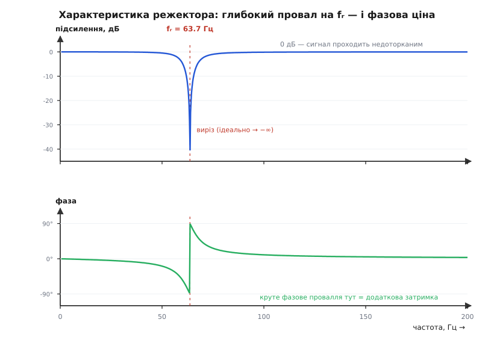
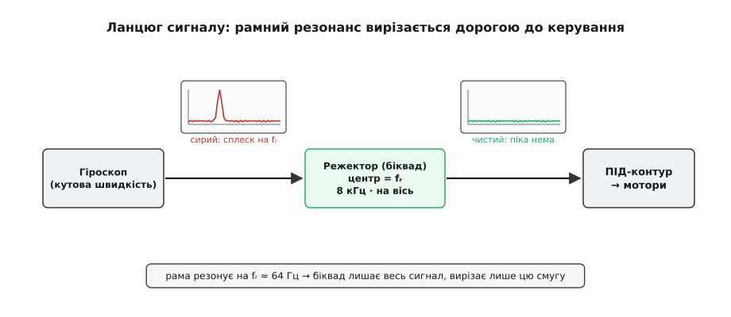

# ⚙️ Прогін крізь резонанс і режектор для гіроскопа дрона

У резонансу є формула сталої амплітуди — і вона правдива. Але формула відповідає лише на одне питання: **на яку висоту** вийде розгойдування, коли все вже усталилося. Вона мовчить про те, **як** система туди прийшла: скільки циклів наростала амплітуда, як виглядав перехідний процес, що станеться, якщо частоту двигуна повільно вести крізь пік. А головне — вона нічого не каже про зворотну задачу, з якою інженер стикається щодня: пік **уже є**, він псує сигнал, і його треба **прибрати**.

Тож зробімо дві речі поспіль. Спершу — проінтегруємо рівняння руху чисельно, крок за кроком у часі, і на власні очі відтворимо і резонансну криву, і наростання амплітуди. Потім візьмемо той самий виміряний пік і збудуємо цифровий режекторний фільтр, який вирізає саме цю частоту з сигналу гіроскопа польотного контролера — бо рама дрона резонує, гіроскоп це «чує», і без фільтра резонанс просочується в керування моторами.

Візьмемо конкретну систему — ту саму, що й у прикладі теми: легкий датчик масою m = 0.05 кг на пружному кронштейні жорсткістю k = 8000 Н/м, зі слабким загасанням (добротність Q = 25). Її власна частота ω₀ = √(k/m) = 400 рад/с, тобто f₀ ≈ 63.7 Гц. І це не абстракція: 63.7 Гц — приблизно частота гвинта квадрокоптера на ~3800 об/хв. Якщо кронштейн гіроскопа резонує на цій частоті, кволенька вібрація рами розгойдає його в десятки разів.

### Крок за кроком у часі: RK4

Рівняння вимушеного загасного осцилятора — друга похідна:

```
m·ẍ + c·ẋ + k·x = F₀·cos(ω t)
```

Комп'ютер не вміє інтегрувати другу похідну напряму — він робить маленькі кроки в часі й на кожному питає лише «яка зараз швидкість зміни?». Тому спершу зведемо одне рівняння другого порядку до **двох** рівнянь першого. Введемо стан із двох чисел: зміщення x і швидкість v = ẋ. Тоді:

```
ẋ = v
v̇ = ( F₀·cos(ω t) − c·v − k·x ) / m
```

Тепер система замкнена: знаючи (x, v) і час t, ми одразу знаємо, куди обидва числа рухаються наступної миті. Лишається питання — **як** зробити крок Δt, не накопичивши помилки.

Найпростіший спосіб, метод Ейлера, бере нахил на **початку** кроку й лінійно екстраполює на весь Δt. Для осцилятора це погано: траєкторія в площині (x, v) — це коло (енергія стала), а екстраполяція по дотичній щоразу трохи зіскакує з кола **назовні**. Крок за кроком амплітуда фальшиво **росте** — Ейлер підкачує в систему енергію, якої там немає. Зменшуй крок скільки завгодно — дрейф лишається, просто повільніший.

**Метод Рунге — Кутти четвертого порядку** (RK4) бере нахил не один раз, а **чотири**: на початку кроку, двічі посередині й наприкінці, — і складає їх зваженим середнім (кінці з вагою 1, середини з вагою 2, усе поділити на 6). Таке комбінування точно гасить доданки помилки аж до четвертого порядку: **удвічі менший крок — приблизно у 16 разів менша похибка**. Для нашого кола в (x, v) це означає, що RK4 тримається орбіти дуже щільно, майже без паразитного дрейфу енергії. Метод склали два німецькі математики — Карл Рунге (стаття 1895 року, де він виписав такі схеми для задачі зі спектроскопії) і Мартин Вільгельм Кутта (1901-й, який класифікував схеми четвертого порядку й дав ту саму, що нею користуються досі). Загальніше про сімейство схем — у темі [чисельне інтегрування](topic:math/numerical-integration).

Ось увесь інтегратор — природно мовою чисельних експериментів, Python із numpy:

```py
import numpy as np

# Система з прикладу теми: датчик на пружному кронштейні
m  = 0.05                     # маса, кг
k  = 8000.0                   # жорсткість, Н/м
Q  = 25.0                     # добротність (слабке загасання)
w0 = np.sqrt(k / m)           # власна частота = 400 рад/с
c  = m * w0 / Q               # загасання з Q = m·ω₀/c  →  c = 0.8 Н·с/м
F0 = 0.5                      # амплітуда вимушувальної сили, Н

def deriv(y, t, w):
    """Права частина системи: похідні стану [x, v]."""
    x, v = y
    a = (F0 * np.cos(w * t) - c * v - k * x) / m
    return np.array([v, a])

def rk4_step(y, t, dt, w):
    """Один крок RK4: чотири проби нахилу, зважене середнє."""
    k1 = deriv(y,             t,          w)
    k2 = deriv(y + dt/2 * k1, t + dt/2,   w)
    k3 = deriv(y + dt/2 * k2, t + dt/2,   w)
    k4 = deriv(y + dt   * k3, t + dt,     w)
    return y + dt/6 * (k1 + 2*k2 + 2*k3 + k4)
```

Це повний, робочий кістяк — жодного псевдокоду. Далі його лише крутять по-різному: то на одній частоті, то на багатьох.

> 🔧 **Навіщо це.** Той самий інтегратор — не навчальна іграшка. На ньому стоять симулятори польоту (SITL в ArduPilot/PX4), де модель дрона з її резонансами рами «літає» в комп'ютері ще до першого реального зльоту; на ньому ж рахують відгук підвісу камери, поведінку амортизаторів, стійкість регулятора. Уміти вручну проінтегрувати рівняння руху означає бачити систему **до** того, як залізо потрапить у повітря.

### Прогін частоти крізь резонанс

Щоб відтворити резонансну криву, зробимо буквально те, що робить випробувач на вібростенді: тримаємо частоту двигуна сталою, чекаємо, поки перехідний процес згасне, міряємо усталений розмах — і так на багатьох частотах поспіль.

```py
def steady_amplitude(w, n_settle=60, n_measure=20, steps=200):
    """Амплітуда сталих коливань на частоті w (рад/с)."""
    T  = 2*np.pi / w
    dt = T / steps                       # steps кроків на період — з запасом для RK4
    y  = np.array([0.0, 0.0])
    t  = 0.0
    for _ in range(n_settle * steps):    # дати перехідному процесу згаснути
        y = rk4_step(y, t, dt, w); t += dt
    xmax, xmin = -1e30, 1e30             # виміряти розмах на усталеній ділянці
    for _ in range(n_measure * steps):
        y = rk4_step(y, t, dt, w); t += dt
        xmax, xmin = max(xmax, y[0]), min(xmin, y[0])
    return (xmax - xmin) / 2

ratios = np.arange(0.30, 1.70 + 1e-9, 0.01)      # ω / ω₀ від 0.3 до 1.7
A  = np.array([steady_amplitude(r * w0) for r in ratios])
A0 = F0 / k                                       # статичний прогин = 62.5 мкм

i_peak = np.argmax(A)
print(f"пік на ω/ω₀ = {ratios[i_peak]:.2f}   f = {ratios[i_peak]*w0/(2*np.pi):.1f} Гц")
print(f"підсилення на піку A/A₀ = {A[i_peak]/A0:.1f}   (очікувано ≈ Q = {Q:.0f})")
print(f"амплітуда на піку = {A[i_peak]*1e3:.2f} мм")
```

Що друкує цей прогін:

```
пік на ω/ω₀ = 1.00   f = 63.7 Гц
підсилення на піку A/A₀ = 25.0   (очікувано ≈ Q = 25)
амплітуда на піку = 1.56 мм
```

Пік сів точно на ω₀, а підсилення вийшло рівно Q — чисельний експеримент відтворив те, що теорія обіцяла аналітично: на резонансі коливання приблизно в Q разів більші за статичний прогин A₀ = F₀/k = 62.5 мкм, тобто 1.56 мм. Той самий «горб», який у темі намальовано формулою, тут виріс сам, крок за кроком, із голого рівняння руху.

Одна тонкість, що з неї починається справжнє вимірювання: **сітка частот скінченна**. Тут крок сітки 0.01·ω₀ і вузол рівно на 1.00 попав у пік. Якби сітка була грубіша й проскочила повз ω₀, виміряний пік вийшов би **нижчим** за справжні 25 — не тому, що фізика інша, а тому, що ми не стали точно на вершину. Ліки ті самі, що в реальному спектральному аналізі: згустити сітку **навколо** знайденого піка й переміряти. Хто раз наступив на це в симуляції, той не здивується, чому на залізі груба [ШПФ](topic:algorithms/fft) занижує висоту вузького резонансу.

### Наростання на власній частоті

Формула сталої амплітуди — це вже фініш. А цікаве коїться на старті: увімкнули двигун точно на ω₀ з нерухомого стану — і дивимось, як розгойдування росте. Той самий інтегратор, лише тепер зберігаємо весь слід у часі:

```py
def run_transient(w, n_periods=80, steps=200):
    T  = 2*np.pi / w
    dt = T / steps
    y  = np.array([0.0, 0.0])
    ts = np.empty(n_periods*steps); xs = np.empty(n_periods*steps)
    for i in range(n_periods*steps):
        ts[i], xs[i] = i*dt, y[0]
        y = rk4_step(y, i*dt, dt, w)
    return ts, xs

ts, xs = run_transient(w0)                # рівно на резонансі
tau = 2 * Q / w0                          # стала наростання, с
print(f"стала наростання τ = 2Q/ω₀ = {tau*1e3:.0f} мс  ≈ {tau/(2*np.pi/w0):.1f} періодів")
```

```
стала наростання τ = 2Q/ω₀ = 125 мс  ≈ 8.0 періодів
```

Амплітуда наростає не миттєво й не вічно, а за законом обвідної A(t) = A₀·Q·(1 − e^(−t/τ)) зі сталою часу

```
τ = 2Q / ω₀      (стала наростання ≈ спадання вільних коливань)
```

Це та сама τ, з якою **згасали** б вільні коливання, якби двигун вимкнути, — наростання й спадання симетричні. У періодах вона дорівнює τ/T = Q/π: для Q = 25 це майже вісім періодів до 63% висоти, а до практично повної амплітуди (95%, три τ) — близько 24 періодів, тобто десь **пів секунди**. Звідси прямий висновок для практики: система з високим Q не тільки розгойдується сильно, а й **повільно** — і так само повільно заспокоюється. Різкий маневр дрона, що на мить збудив рамний резонанс, аукатиметься в сигналі гіроскопа ще довго після самого поштовху.

### Від піка до фільтра: цифровий режектор

Тепер практичний бік. На реальному дроні ми не інтегруємо рівняння рами — ми **вимірюємо**: беремо запис гіроскопа (blackbox), рахуємо його [спектр через ШПФ](topic:algorithms/fft) і бачимо гострий пік на частоті рамного резонансу fᵣ. У нашому прикладі fᵣ ≈ 63.7 Гц. Механічно його вже приборкали як могли — датчик посадили на м'які амортизатори ([розв'язка IMU](topic:electronics/imu-vibration-isolation) відсікає високі частоти), — але вузький гострий пік однаково просочується. Останній рубіж — **цифровий режекторний фільтр** у прошивці: він лишає весь сигнал недоторканим, а вирізає з нього одну-єдину вузьку смугу навколо fᵣ.

Режектор ([notch-фільтр](topic:electronics/notch-filter) — від англ. *notch*, «виріз») робить у частотній характеристиці глибокий провал на fᵣ і одиничне пропускання скрізь-інде. Найощадніша його цифрова форма — **біквад**, ланка другого порядку ([БІХ-фільтр](topic:algorithms/iir-filter)): вихід залежить від двох попередніх входів і двох попередніх виходів. Уся ланка — це п'ять коефіцієнтів. Класичний рецепт їх обчислення — «кухонна книга» біквадів Роберта Брістоу-Джонсона, де для режектора:

```
ω₀ = 2π · f₀ / fₛ            (нормована центральна частота, fₛ — частота дискретизації)
α  = sin(ω₀) / (2·Q_ф)       (Q_ф — гострота РЕЖЕКЦІЇ, ширина ≈ f₀ / Q_ф)

        b₀ = 1            a₀ = 1 + α
        b₁ = −2·cos(ω₀)   a₁ = −2·cos(ω₀)
        b₂ = 1            a₂ = 1 − α

усі п'ять ділимо на a₀ (зводимо a₀ до 1)
```

Тут причаїлась плутанина, від якої варто застерегтися одразу: **Q у фільтрі — це не та Q, що в рами.** Механічна добротність Q = 25 казала, який гострий сам резонанс. Добротність фільтра Q_ф — це наш **вибір**: наскільки вузький провал ми виріжемо. Логіка проста: центр фільтра f₀ ставимо точно на виміряний пік fᵣ, а Q_ф добираємо так, щоб провал накрив ширину піка й трохи розкиду навколо. Візьмемо помірне Q_ф = 6 — це смуга ≈ 63.7/6 ≈ 10.6 Гц.

Порахуємо коефіцієнти — знову природною для розрахунку мовою, Python:

```py
def notch_coeffs(f0, fs, Q):
    """Коефіцієнти цифрового режекторного біквада (RBJ cookbook), нормовані a0=1.
    f0 — центр (Гц); fs — частота дискретизації (Гц); Q — гострота (ширина ≈ f0/Q)."""
    w0    = 2*np.pi * f0 / fs
    alpha = np.sin(w0) / (2*Q)
    cw    = np.cos(w0)
    a0 = 1 + alpha
    b = np.array([1.0,      -2*cw, 1.0])      / a0   # b0, b1, b2
    a = np.array([1 + alpha, -2*cw, 1 - alpha]) / a0 # ділимо ВЕСЬ рядок на a0 → a0 стає 1
    return b, a

b, a = notch_coeffs(f0=63.7, fs=8000.0, Q=6.0)    # гіро дрона: 8 кГц
print("b =", b.round(5))     # [ 0.99585 -1.98921  0.99585]
print("a =", a.round(5))     # [ 1.      -1.98921  0.9917 ]
```

Коефіцієнти a₁ = −1.9892 і a₂ = 0.9917 ставлять полюси майже на одиничне коло (радіус √a₂ ≈ 0.9958) — саме тому провал такий вузький і глибокий. Перевірити фільтр на записаному сліді гіроскопа можна одним рядком: `scipy.signal.lfilter(b, a, gyro)`. Ось як виглядає його частотна характеристика:


*Угорі — підсилення (у децибелах): усюди 0 дБ (сигнал проходить недоторканим), і лише вузьким клином коло 63.7 Гц провалюється в глибокий мінус — саме там вирізається рамний резонанс. Унизу — фаза: біля fᵣ вона робить круте провалля. Ця крутість і є ціна фільтра — додаткова затримка сигналу поблизу частоти режекції.*

### Режектор на польотному контролері

Обчислили коефіцієнти — тепер їх треба **застосувати** до кожного відліку гіроскопа, і тут домен різко міняється. Це прошивка польотного контролера: гарячий шлях, що виконується 8000 разів на секунду на кожну з трьох осей (roll, pitch, yaw), у жорсткому бюджеті циклу. Тут природна мова — C або C++, як у реальних стеках (Betaflight — C, PX4 та ArduPilot — C++). Форму беремо **Direct Form II транспоновану**: вона тримає лише два числа стану й найкраще поводиться в арифметиці з рухомою комою — важливо, коли полюси близько до одиничного кола.

Різницеве рівняння транспонованої DF2, коли a₀ вже зведено до 1:

```
y   = b₀·x + s₁
s₁  = b₁·x − a₁·y + s₂
s₂  = b₂·x − a₂·y
```

:::tabs
```c
#include <math.h>

typedef struct {
    float b0, b1, b2, a1, a2;   /* коефіцієнти, a0 зведено до 1 */
    float s1, s2;               /* стан: Direct Form II транспонована */
} Biquad;

/* Порахувати коефіцієнти режектора ОДИН раз при старті (RBJ notch). */
void notch_init(Biquad *bq, float f0, float fs, float Q)
{
    const float PI = 3.14159265f;                 /* не покладаймося на M_PI */
    float w0    = 2.0f * PI * f0 / fs;
    float cw    = cosf(w0);
    float alpha = sinf(w0) / (2.0f * Q);
    float a0    = 1.0f + alpha;
    bq->b0 =  1.0f          / a0;
    bq->b1 = -2.0f * cw     / a0;
    bq->b2 =  1.0f          / a0;
    bq->a1 = -2.0f * cw     / a0;
    bq->a2 = (1.0f - alpha) / a0;
    bq->s1 = bq->s2 = 0.0f;
}

/* Гарячий шлях: один семпл гіроскопа → відфільтрований. 8000 викликів/с на вісь. */
static inline float notch_apply(Biquad *bq, float x)
{
    float y = bq->b0 * x + bq->s1;
    bq->s1  = bq->b1 * x - bq->a1 * y + bq->s2;
    bq->s2  = bq->b2 * x - bq->a2 * y;
    return y;
}

/* --- використання --- */
Biquad notch_roll;                                /* по одному на кожну вісь */
/* при ініціалізації: */
notch_init(&notch_roll, 63.7f, 8000.0f, 6.0f);
/* у перерві готовності гіроскопа, 8000 разів на секунду: */
float gyro_clean = notch_apply(&notch_roll, gyro_raw);
```
```cpp
#include <cmath>

struct Biquad {
    float b0, b1, b2, a1, a2;
    float s1 = 0.f, s2 = 0.f;               // стан: Direct Form II транспонована

    // Режектор RBJ: центр f0, частота дискретизації fs, гострота Q
    static Biquad notch(float f0, float fs, float Q) {
        constexpr float PI = 3.14159265f;
        const float w0    = 2.f * PI * f0 / fs;
        const float cw    = std::cos(w0);
        const float alpha = std::sin(w0) / (2.f * Q);
        const float a0    = 1.f + alpha;
        return { 1.f/a0, -2.f*cw/a0, 1.f/a0, -2.f*cw/a0, (1.f-alpha)/a0 };
    }

    // Гарячий шлях: один семпл гіро → відфільтрований
    float process(float x) {
        const float y = b0 * x + s1;
        s1 = b1 * x - a1 * y + s2;
        s2 = b2 * x - a2 * y;
        return y;
    }
};

// --- використання ---
Biquad notchRoll = Biquad::notch(63.7f, 8000.f, 6.f);   // по одному на вісь
// ...8000 разів на секунду:
float gyroClean = notchRoll.process(gyroRaw);
```
:::

Дві версії роблять те саме; C++ лише згортає ініціалізацію у фабричний метод і схову стан у структуру з методом. На польотних контролерах з апаратним FPU (STM32 F4/F7/H7) обчислення в `float` майже безкоштовні — п'ять множень і чотири додавання на семпл. Де FPU немає, ту саму ланку роблять у **фіксованій комі** (Q-формат), пильнуючи переповнення й квантування коефіцієнтів. Ось де цей фільтр сидить у ланцюзі сигналу:


*Сирий сигнал гіроскопа несе гострий сплеск на частоті рамного резонансу fᵣ. Режекторний біквад, що працює 8000 разів на секунду на кожну вісь, вирізає рівно цю смугу — і в ПІД-контур, що керує моторами, іде вже чистий сигнал. Без цього кроку резонансний сплеск підсилився б регулятором і повернувся в мотори як гудіння й нагрів.*

### Складність і пастки

**Фільтр не безплатний — він додає затримку.** Це головна ціна, і видно її на нижній панелі характеристики: круте фазове провалля коло fᵣ означає велику **групову затримку** саме там. Затримка сигналу гіроскопа з'їдає запас фази [ПІД-контуру](topic:algorithms/discrete-pid) — того самого запасу, що тримає керування стійким. Що глибший і вужчий провал (більше Q_ф), то більша затримка. Звідси залізне правило дронобудівника: notch-фільтрів ставлять **якомога менше й не глибше, ніж треба**. Кожен зайвий виріз — це і втрачений шматок корисного сигналу, і ще трохи затримки, що наближає контур до автоколивань.

**Пік не стоїть на місці.** Ми поставили режектор на 63.7 Гц — але на дроні частота рамного резонансу **пливе**: оберти моторів міняються з газом, просідання батареї зсуває їх ще. Фіксований notch промахнеться. Реальні прошивки розв'язують це двома розумнішими шляхами. Перший — **динамічний notch**: контролер безперервно рахує [ШПФ](topic:algorithms/fft) сигналу гіроскопа, знаходить біжучий пік і сам совгає центр фільтра за ним. Другий, точніший, — **RPM-фільтр** (у Betaflight): кожен регулятор мотора по двоспрямованому DShot шле контролеру точні оберти свого мотора, з них рахується основна частота (оберти/60) та її гармоніки, і на кожну ставиться вузький notch, що трекає її в реальному часі — типово 3 гармоніки × 4 мотори × 3 осі. Коли моторний шум знято RPM-фільтром, динамічному notch лишається саме те, з чого ми почали, — **рамний резонанс**, і одного вузла зазвичай досить.

**Аліасинг: примара нижче за справжню частоту.** Гіроскоп — це дискретна вибірка, тож усе вище за половину частоти дискретизації (Найквіста, fₛ/2 = 4 кГц) **загортається** назад у чутну смугу під фальшивою частотою ([Найквіст і аліасинг](topic:communications/nyquist-aliasing)). Якщо рама дзвенить на 5 кГц, у сигналі вона з'явиться як привид на 3 кГц — і notch, поставлений на цей привид, ганятиметься за тінню. Тому перед оцифруванням має стояти апаратне обмеження смуги (вбудований у гіроскоп аналоговий/цифровий ФНЧ), а не лише режектор у прошивці.

**Числова стійкість.** Вузький глибокий notch — це полюси майже на одиничному колі (тут радіус ≈ 0.9958). У 32-бітному `float` така близькість вимагає обережності: саме тому ми взяли Direct Form II **транспоновану**, найспокійнішу форму для рухомої коми. У фіксованій комі додається квантування коефіцієнтів — округлення a₁, a₂ до сітки чисел трохи **зсуває** реальний центр і глибину провалу, тож перевіряти треба вже квантовані значення, а не ідеальні.

**Пастки самого прогону.** У симуляції легко отримати неправильну криву. Замалий крок за часом — і RK4 повільний; **завеликий** — і з'являється числове загасання (або й розбіжність), крива «пливе»; 200 кроків на період тут — надійний запас, менше 20 вже небезпечно. Друга пастка тонша: біля резонансу перехідний процес згасає **повільно** (τ ≈ Q/π періодів), тож якщо не витримати достатньо періодів до вимірювання, зміряєш не сталу амплітуду, а недорослий перехід — і пік вийде заниженим. Для Q = 25 шістдесят періодів усталення — безпечно; для дуже високих Q їх треба ще більше. Це рівно та сама причина, чому реальний резонанс із високим Q так довго й розгойдується, і так довго відлунює.

Дві половини цієї роботи — про одне. У симуляції ми **знайшли** пік, проінтегрувавши рівняння руху; на залізі його **знаходять** із ШПФ живого сигналу. Далі байдуже, звідки взялося число fᵣ, — воно годує фільтр, і той самий біквад, що на екрані малює гарний провал, у прошивці рятує політ від резонансу власної рами.
