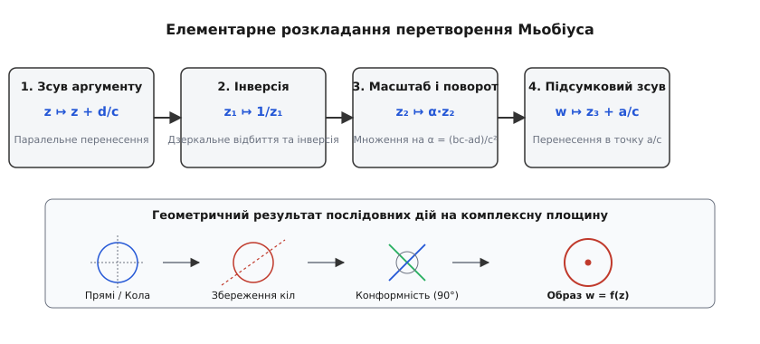
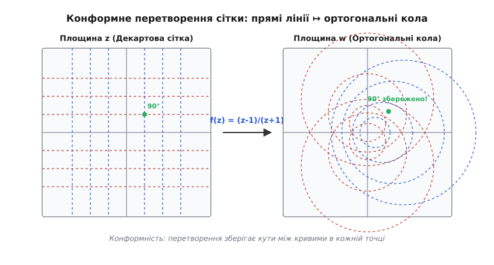
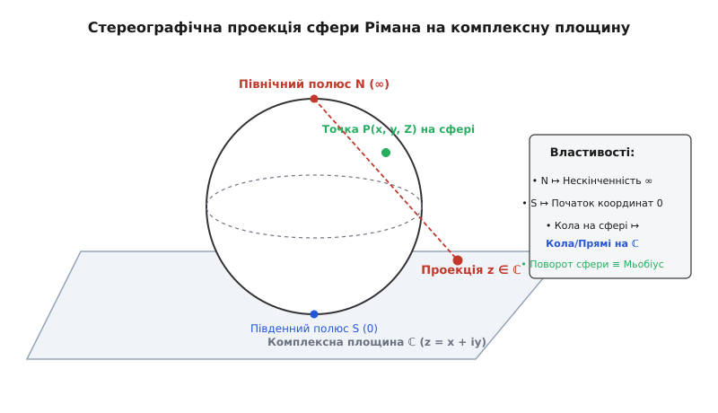
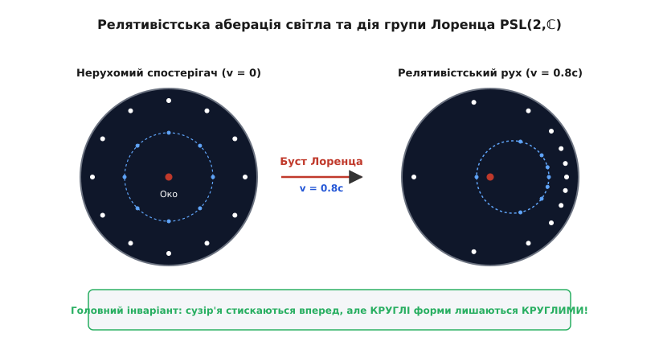

# Дробово-лінійні перетворення Мьобіуса

<preknowlist>
- [Комплексні числа](book:math/complex-numbers) — алгебра комплексних чисел, модуль, аргумент та спряження.
- [Стереографічна проекція](book:math/stereographic-projection) — взаємно однозначне відображення між плошиною ℂ та сферою Рімана S².
- [Матриці та група SL(2,C)](book:math/matrix-groups) — матричне множення, визначники та ізоморфізм проєктивних груп.
- [Перетворення Лоренца](book:physics/mechanics/lorentz-transformations) — релятивістські бусти та просторово-часові повороти.
- [Конформні відображення](book:math/conformal-mappings) — збереження кутів між кривими та плоскі потенціальні поля.
</preknowlist>

Уявімо космічний апарат, який мчить у міжзоряному просторі зі швидкістю, що становить 80% від швидкості світла. Якщо спостерігач на борту погляне у вікно ілюмінатора на віддалені сузір'я, він виявить дивовижне оптичне явище. Зірки, які для нерухомого спостерігача були рівномірно розподілені по всьому небесному колу, починають виразно зміщуватися в напрямку руху корабля. Це явище, відоме у релятивістській кінематиці як аберація світла, призводить до того, що зоряне небо скупчується попереду спостерігача у яскраво сяючу прожекторну пляму (headlight effect).

Проте найбільш вражаючим є інший геометричний факт. Якщо астронавт спрямує телескоп на окреме кругле сузір'я або круглу планетарну туманність, їхня геометрична форма не деформується в овали, еліпси чи складні яйцеподібні лінії. Сузір'я залишається строго круглим — змінюється лише його кутовий розмір та положення на небесному заслоні. Точним математичним апаратом, який описує цю оптичну трансформацію небесної сфери під дією релятивістських бустів і просторових поворотів, є дробово-лінійні перетворення Мьобіуса.

Дробово-лінійне перетворення Мьобіуса є конформним бієктивним відображенням розширеної комплексної площини `ℂ̂ = ℂ ∪ {∞}` на себе. У класичній та сучасній фізиці воно виступає єдиним інструментом, що поєднує релятивістську кінематику простору-часу Мінковського, двокомпонентний спінорний формалізм Пенроуза, розрахунки потенціальних гідродінамічних полів і конформну геометрію неевклідових просторів Лобачевського.

## 1. Від проекції до геометрії: алгебраїчний розклад та стереографічна модель

У комплексному аналізі та геометрії перетворення Мьобіуса виражається дробово-раціональним співвідношенням від комплексної змінної `z`:

```
w = f(z) = (a·z + b) / (c·z + d)
```

де `a, b, c, d` — комплексні коефіцієнти, що задовольняють умову невиродженості `a·d - b·c ≠ 0`.

Комплексна величина `Δ = a·d - b·c` називається визначником перетворення. Значення визначника відіграє вирішальну роль у визначенні вимірності образу. Якщо визначник перетворюється на нуль (`a·d - b·c = 0`), то чисельник виразу стає строго пропорційним знаменнику: `a/c = b/d`. У цьому випадку дробова функція втрачає залежність від `z` і вироджується у константу `w = a/c`. При цьому вся комплексна площина колапсує в єдину нерухому точку `a/c`.

Тому вимога `a·d - b·c ≠ 0` є фундаментальною умовою невиродженості: вона забезпечує наявність оберненого перетворення `f⁻¹(w)` і гарантує взаємну однозначність (бієкцію) між прообразом та образом на всій розширеній комплексній площині `ℂ̂`.

Геометричним доменом перетворення є розширена комплексна площина `ℂ̂ = ℂ ∪ {∞}`, яка будується шляхом одноточкової компактифікації Александрова. Додавання нескінченно віддаленої точки `∞` дозволяє усунути алгебраїчні особливості ділення на нуль:
- Точка `z = -d/c` (в якій знаменник `c·z + d` дорівнює нулю) переходить у точка `w = ∞`.
- Точка `z = ∞` відображається у скінченне значення `w = a/c` (гранична межа при `|z| → ∞`).

### Елементарна анатомія та геометрична декомпозиція

Для того щоб зрозуміти внутрішній механізм того, як дробово-лінійний вираз маніпулює геометричними фігурами, його розкладають на послідовність найпростіших геометричних операцій. У випадку `c ≠ 0` алгебраїчне виділення цілої частини дробу дає тотожне перетворення:

```
w = (a·z + b) / (c·z + d)
  = a/c + (b - a·d/c) / (c·z + d)                [виділення цілої частини діленням на c]
  = a/c - (a·d - b·c) / (c² · (z + d/c))         [зведення до спільного знаменника та винесення c²]
```

Ця тотожність показує, що будь-яке складне перетворення Мьобіуса з `c ≠ 0` є послідовним виконанням чотирьох елементарних геометричних кроків:

1. **Перше паралельне перенесення (зсув):** `z₁ = z + d/c`. Початок координат комплексної площини зсувається у точку `-d/c`. Ця операція є стандартним евклідовим перенесенням, яке зберігає відстані між точками, орієнтацію кутів та геометричну форму фігур.
2. **Комплексна інверсія:** `z₂ = 1 / z₁`. Точка `z₁ = r·e^(i·θ)` переходить у точку `z₂ = (1/r)·e^(-i·θ)`. Модуль точки інвертується відносно одиничного кола `r ↦ 1/r`, а аргумент змінює знак `θ ↦ -θ`. Це відображення є комбінацією геодезичної інверсії відносно одиничного кола та дзеркального відбиття відносно дійсної осі. Внутрішня область одиничного диска міняється місцями із зовнішньою неосяжною площиною, точка `0` прямує в `∞`, а `∞` переходить у `0`.
3. **Комплексний розтяг та поворот:** `z₃ = α · z₂`, де `α = -(a·d - b·c)/c²`. Записуючи комплексне число `α` в ейлеровій формі `|α|·e^(i·Arg α)`, бачимо, що модуль `|α|` відповідає за рівномірне гомотетичне розтягнення чи стиснення плоскості відносно початку координат, а аргумент `Arg(α)` відповідає за поворот всієї площини навколо початку координат на відповідний кут.
4. **Друге паралельне перенесення (фінальний зсув):** `w = z₃ + a/c`. Фінальний зсув плоскості на вектор `a/c`, який поміщає обчислений образ у підсумкове положення.


*Елементарні кроки розкладу дробово-лінійного відображення: паралельне перенесення, комплексна інверсія, розтяг з поворотом та підсумковий зсув.*

Якщо коефіцієнт `c = 0`, то за умови невиродженості `a ≠ 0` і `d ≠ 0` перетворення спрощується до прямого афінного відображення: `w = (a/d)·z + (b/d)`. Воно містить лише зсув, поворот та масштабування, не має нелінійного кроку інверсії і залишає точка `∞` нерухомою (`f(∞) = ∞`).

Історичний розвиток геометрії Мьобіуса — від барицентричних координат Августа Мьобіуса до Ерлангенської програми Фелікса Кляйна — розкрито у [історичній вставці](book:physics/mechanics/mobius-transformations/hist-mobius.md).

## 2. Фундаментальні інваріанти: узагальнені кола, кола Аполлонія та подвійне відношення

Двом головним геометричним властивостям перетворення Мьобіуса завдячують своєю популярністю у фізиці: **збереженню узагальнених кіл** та **конформності**.

Узагальненим колом на комплексній площині називається геометричне місце точок, яке описується квадратичним рівнянням у комплексних координатах `z` та `z̄`:

```
A·z·z̄ + B̄·z + B·z̄ + C = 0
```

де `A` та `C` — дійсні числа (`A, C ∈ ℝ`), а `B` — комплексне число (`B ∈ ℂ`).

У залежності від значення коефіцієнта `A` перед квадратним членом `z·z̄ = |z|²`:
- Якщо `A ≠ 0`, ділення на `A` та виділення повного квадрата модуля дає `|z + B/A|² = (|B|² - A·C)/A²`. Це рівняння визначає звичайне евклідове коло з центром у точці `-B/A` та радіусом `R = √(|B|² - A·C) / |A|`.
- Якщо `A = 0`, рівняння спрощується до лінійного виразу `B̄·z + B·z̄ + C = 0`, що є загальним рівнянням прямої лінії (кола нескінченного радіуса, яке проходить через `∞`).

При послідовному виконанні чотирьох елементарних кроків структура цього рівняння залишається незмінною. Паралельне перенесення та поворот лише зміщують центр і змінюють коефіцієнти `B` та `C`. Найбільш критичний крок — інверсія `z ↦ 1/z` — підставляє `z = 1/w` і перетворює рівняння на `C·w·w̄ + B·w + B̄·w̄ + A = 0`. Бачимо, що коефіцієнти `A` та `C` просто міняються місцями:

- Коло, що не проходило через початок координат (`A ≠ 0, C ≠ 0`), переходить у нове звичайне коло (`C ≠ 0`).
- Коло, що проходило через початок координат (`A ≠ 0, C = 0`), переходить у пряму лінію (`C' = A = 0`).
- Пряма, що не проходила через `0` (`A = 0, C ≠ 0`), перетворюється на коло через `0`.
- Пряма через `0` (`A = 0, C = 0`) залишається прямою через `0`.

Таким чином, перетворення Мьобіуса переводять будь-яке узагальнене коло (коло або пряму) строго в інше узагальнене коло.

### Кола Аполлонія та ортогональні сітки

Геометричним втіленням збереження кіл є кола Аполлонія. Розглянемо геометричне місце точок `z`, відношення відстаней від яких до двох зафіксованих точок `z₁` та `z₂` є сталою величиною `k > 0`:

```
|z - z₁| / |z - z₂| = k
```

При `k ≠ 1` це рівняння задає коло Аполлонія, а при `k = 1` — перпендикулярну медіатрису відрізка `[z₁, z₂]`. Перетворення Мьобіуса `w = (z - z₁)/(z - z₂)` конформно переводить це сімейство кіл у концентричні кола `|w| = k` з центром у початку координат.


*Конформне перетворення ортогональної Декартової сітки в сімейство взаємно ортогональних кіл Аполлонія.*

### Подвійне відношення точок

Другим числовим інваріантом є **подвійне (ангармонійне) відношення** чотирьох точок `z₁, z₂, z₃, z₄`:

```
(z₁, z₂; z₃, z₄) = ((z₁ - z₃) · (z₂ - z₄)) / ((z₁ - z₄) · (z₂ - z₃))
```

Для будь-якого відображення Мьобіуса `w = f(z)` значення подвійного відношення образів точно дорівнює подвійному відношенню прообразів:

```
(f(z₁), f(z₂); f(z₃), f(z₄)) = (z₁, z₂; z₃, z₄)
```

З цієї властивості випливає важливий практичний наслідок: **існує єдине перетворення Мьобіуса**, яке переводить три довільні задані точки `(z₁, z₂, z₃)` у три інші задані точки `(w₁, w₂, w₃)`. Щоб знайти це відображення для будь-якого `z`, достатньо прирівняти подвійні відношення `(w, w₁; w₂, w₃) = (z, z₁; z₂, z₃)` і виразити `w`.

Повні алгебраїчні виведення збереження кіл та інваріантності подвійного відношення наведено у [математичній вставці](book:physics/mechanics/mobius-transformations/math-mobius.md).

## 3. Проектні матриці та група PSL(2,C)

Складання двох послідовних перетворень Мьобіуса `w = f(z)` та `u = g(w)` знову дає перетворення Мьобіуса. З алгебраїчної точки зору ця композиція повністю еквівалентна множенню квадратних матриць розміру `2×2`.

Кожному перетворенню Мьобіуса зіставляється комплексна матриця:

```
M = [ a  b ]
    [ c  d ]
```

Якщо застосувати спочатку перетворення з матрицею `M₂`, а потім з матрицею `M₁`, підсумкова матриця композиції `M = M₁ · M₂` обчислюється за звичайним правилом матричного множення:

```
[ a₁  b₁ ] · [ a₂  b₂ ] = [ a₁a₂ + b₁c₂   a₁b₂ + b₁d₂ ]
[ c₁  d₁ ]   [ c₂  d₂ ]   [ c₁a₂ + d₁c₂   c₁b₂ + d₁d₂ ]
```

Визначник добутку матриць дорівнює добутку їхніх визначників: `det(M₁ · M₂) = det(M₁) · det(M₂)`.

Оскільки множення коефіцієнтів `(a, b, c, d)` на довільне ненульове комплексне число `λ ≠ 0` не змінює самого дробу `(λa·z + λb)/(λc·z + λd) = (a·z + b)/(c·z + d)`, матриці `M` та `λ·M` задають абсолютно одне й те саме геометричне перетворення.

Щоб усунути цю неоднозначність масштабу, матрицю зазвичай нормують умовою `det(M) = a·d - b·c = 1`. Після такої нормалізації матриця належить до спеціальної лінійної групи `SL(2, ℂ)`. Проте навіть після цього залишається свобода знака: матриці `M` та `-M` дають однакові результати. 

Тому повною алгебраїчною групою симетрій розширеної комплексної площини є **фактор-група (проективна група)**:

```
PSL(2, ℂ) = SL(2, ℂ) / {±I}
```

де `I` — одинична матриця `2×2`.

### Класифікація перетворень за слідом матриці

Геометричний характер руху плоскості під дією відображення Мьобіуса з нормованою матрицею (`det = 1`) повністю визначається комплексною величиною її сліду `Tr(M) = a + d`.

Дискримінант рівняння нерухомих точок `c·z² + (d - a)·z - b = 0` дорівнює `D = Tr(M)² - 4`. Залежно від квадранта значення `Tr(M)²` усі перетворення поділяють на чотири класи:

1. **Параболічні (`Tr(M)² = 4`):** Рівняння має один кратний корінь (одна нерухома точка). За своєю геометрією це чистий зсув (паралельний перенос).
2. **Еліптичні (`Tr(M)² ∈ [0, 4)`):** Слід є дійсним числовим значенням, меншим за 2. Існують дві нерухомі точки. Перетворення є чистою сферичною ротацією (поворотом) навколо осі, що проходить через ці точки.
3. **Гіперболічні (`Tr(M)² > 4`):** Слід є дійсним значенням, більшим за 2. Існують дві нерухомі точки. Точки плоскості рухаються вздовж кіл, що з'єднують ці дві точки (потоки стиснення/розтягу).
4. **Локсодромні (`Tr(M)² ∉ [0, ∞)`):** Слід має ненульову уявну частину. Загальний випадок: точки спірально закручуються навколо однієї нерухомої точки й прямують до іншої.

## 4. Зв'язок зі сферою Рімана та стереографічна проекція

Розширена комплексна площина `ℂ̂` геометрично еквівалентна двовимірній сфері `S²`, зануреній у тривимірний евклідовий простір `ℝ³`. Цей зв'язок реалізується за допомогою стереографічної проекції.

Уявімо сферу одиничного радіуса `x² + y² + Z² = 1`, яка торкається комплексної площини своїм Південним полюсом `S(0, 0, -1)`. Північний полюс сфери `N(0, 0, 1)` слугує центром проектування. Для будь-якої точки `P(x, y, Z)` на сфері промінь, проведений з Північного полюса `N` через точку `P`, перетинає екваторіальну площину `Z = 0` у єдиній точці `z = X + i·Y`.


*Стереографічна проекція з Північного полюса сфери Рімана на комплексну площину, що пов'язує тривимірні повороти сфери з перетвореннями Мьобіуса.*

Алгебраїчні формули зв'язку між координатами точки на сфері `(x, y, Z)` та комплексною координатою `z = X + i·Y` мають вигляд:

```
z = (x + i·y) / (1 - Z)

x = (z + z̄) / (|z|² + 1)
y = (z - z̄) / (i·(|z|² + 1))
Z = (|z|² - 1) / (|z|² + 1)
```

Завдяки стереографічній проекції:
- Південний полюс `S(0, 0, -1)` проектується в початок координат `z = 0`.
- Екватор сфери проектується в одиничне коло `|z| = 1`.
- Північний полюс `N(0, 0, 1)` проектується в нескінченно віддалену точку `z = ∞`.
- Довільне коло на поверхні сфери (як велике, так і мале) проектується в узагальнене коло на комплексній площині.

Головний геометричний висновок полягає в тому, що **будь-який неперервний поворот тривимірної сфери Рімана навколо її центра індукує на комплексній площині відповідне еліптичне перетворення Мьобіуса**. Якщо повернути сферу на кут `θ` навколо осі, визначеної одиничним вектором `n = (n_x, n_y, n_z)`, то відповідна матриця з `SU(2) ⊂ SL(2, ℂ)` задає дробово-лінійне відображення.

> 🔧 **Навіщо це.**
> Перетворення Мьобіуса утворюють геометричний фундамент спеціальної теорії відносності, дозволяючи обчислювати оптичну аберацію світла та перетворення релятивістських хвильових фронтів за допомогою простих матриць `2×2`. У гідродінаміці та аеродинаміці вони застосовуються для конформного спрямлення складних границь обтікання (профілів крила Жуковського) у канонічні циліндричні чи плоскі області.

## 5. Релятивістська кінематика та аберація світла

Найважливішим застосуванням перетворень Мьобіуса у фізиці є опис релятивістського руху в спеціальній теорії відносності (СТВ).

Розглянемо спостерігача, який дивиться на віддалені зірки. Напрямок на кожну зірку задається одиничним вектором `n = (sin θ cos φ, sin θ sin φ, cos θ)` на небесній сфері. За допомогою стереографічної проекції цей напрямок зображується комплексною координатою:

```
w = tan(θ/2) · e^(i·φ)
```

Якщо спостерігач починає рухатися зі швидкістю `v` уздовж осі `Z` (відносна швидкість `β = v/c`), напрямки на зірки змінюються через ефект релятивістської аберації світла. Згідно з класичними рівняннями Лоренца, новий кут `θ'` задовольняє співвідношення:

```
cos(θ') = (cos(θ) + β) / (1 + β · cos(θ))
```

Застосовуючи тригонометричну тотожність для половинного кута `tan(θ'/2) = √((1 - cos θ') / (1 + cos θ'))`, виводимо зміну комплексної координати `w'`:

```
w' = √((1 - β) / (1 + β)) · w
```

Це перетворення є чисто гіперболічним перетворенням Мьобіуса з діагональною матрицею:

```
M_boost = [ e^(-ψ/2)      0     ]
          [    0       e^(ψ/2)  ]
```

де `ψ` — швидкість (rapidity), пов'язана з відносною швидкістю співвідношенням `tanh(ψ) = β = v/c`.

Якщо спостерігач не лише розганяється, але й повертає свою систему координат, загальне релятивістське перетворення напрямків світла описується довільною матрицею `M ∈ SL(2, ℂ)`.


*Релятивістська аберація світла при русі зі швидкістю v = 0.8c: стиснення сузір'їв у напрямку руху зі збереженням їхньої круглої форми.*

Звідси випливає знаменита теорема Пенроуза: **при релятивістському русі зі швидкістю, як завгодно близькою до швидкості світла, будь-яке кругле сузір'я або круглий диск небесного тіла виглядає для спостерігача ТОЧНО КРУГЛИМ**. Його кутовий розмір та центр зміщуються по небу згідно з дробово-лінійним відображенням, але контур не деформується в еліпс. Це прямо випливає з інваріантнісної властивості Мьобіуса зберігати кола.

Алгоритми обчислення та чисельної візуалізації цих перетворень наведемо в [кодовому розборі](book:physics/mechanics/mobius-transformations/proj-mobius.md), а повний програмний інтерфейс бібліотеки описано в [довіднику API](book:physics/mechanics/mobius-transformations/api-mobius.md).

## 6. Гідродінаміка, потенціальні поля та гіперболічна геометрія

У двовимірній гідродінаміці несжимаємої ідеальної рідини поле швидкостей течії описується комплексним потенціалом:

```
W(z) = φ(x, y) + i · ψ(x, y)
```

де `φ` — потенціал швидкості, а `ψ` — функція течії. Лінії `ψ = const` є траєкторіями руху частинок рідини (лініями струму).

Оскільки будь-яка аналітична функція від перетворення Мьобіуса `W(f(z))` знову є аналітичною функцією, відображення Мьобіуса дозволяє спрямляти складні границі течії. Наприклад, дробово-лінійне відображення:

```
w = (z - 1) / (z + 1)
```

переводить праву півплощину `Re(z) > 0` в середину одиничного диска `|w| < 1`. Це дозволяє легко розраховувати обтікання кругових циліндрів та профілів, знаючи простий розв'язок для плоского потоку.

### Гіперболічна геометрія Пуанкаре

Якщо обмежити коефіцієнти перетворення Мьобіуса дійсними числами (`a, b, c, d ∈ ℝ`) з умовою `a·d - b·c = 1`, отримаємо групу `SL(2, ℝ)`.

Дія цієї групи зберігає верхню півплощину `Im(z) > 0` та є повною групою ізометрій (неевклідових переміщень) у модельній півплощині Пуанкаре для геометрії Лобачевського. Геодезичними лініями (найкоротшими шляхами) у цій геометрії є півкола та прямі, ортогональні до дійсної осі `Im(z) = 0`. Дробово-лінійні перетворення Мьобіуса переводять ці гіперболічні прямі одна в одну, зберігаючи неевклідову відстань між точками.

Таким чином, перетворення Мьобіуса виступають універсальною мовою, яка об'єднує розрахунки релятивістської аберації в астрофізиці, конформні сітки в гідродінаміці та ізометрії в гіперболічних просторах.
