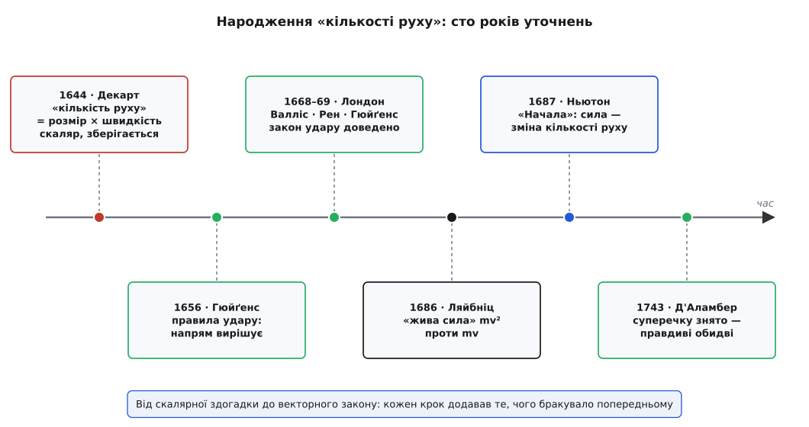
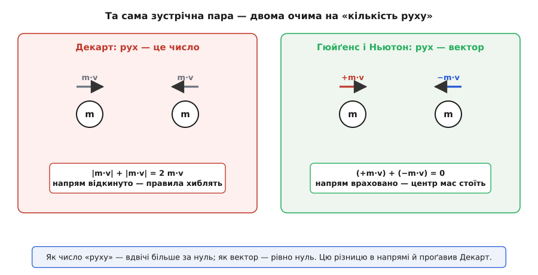

# 📜 Як народжувалася «кількість руху»: від здогадки Декарта до закону Ньютона

Сьогодні `p = m·v` вміщається в один рядок, і школяр вивчає його за урок. А тим часом за цим рядком стоїть майже сторіччя суперечок, у яких найкращі голови Європи плуталися в трьох різних питаннях воднораз: **що** саме зберігається в русі, чи має воно **напрям**, і чи є така величина взагалі **одна**. Розплутати цей вузол виявилося напрочуд важко — бо «запас руху» не можна ні побачити, ні зважити; про нього можна лише здогадуватися з того, що лишається сталим, коли тіла стикаються, відскакують і злипаються.

Саме удар і був тим горнилом, де кувалося поняття. До XVII століття панувала аристотелівська картина, де рух потребує безнастанної причини, а середньовічний «імпетус» був радше туманним внутрішнім поштовхом, ніж числом. Питання «скільки руху переходить від тіла до тіла у зіткненні?» нікого не мучило, бо не було й самої мірки. Її ще належало винайти.


*Сто років, за які скалярна здогадка Декарта дозріла до точного векторного закону Ньютона — і за які з'ясувалося, що збережуваних величин насправді дві.*

## Декартова «кількість руху»: правильне чуття, хибний облік

Перший, хто наважився сказати, що в русі є **збережувана** величина, був Рене Декарт (René Descartes). У «Началах філософії» (*Principia philosophiae*, 1644) він міркував так: Бог надав світові певної «кількості руху» (лат. *quantitas motus*) на початку, а оскільки Бог незмінний, то й повна кількість руху у Всесвіті лишається сталою назавжди. Хоч обґрунтування було богословське, висновок був сміливий і новий: у природі існує величина, що не виникає й не щезає, а лише перетікає між тілами. Це надійно задокументовано — і це, по суті, перший закон збереження в механіці.

Біда була в тому, **що** саме Декарт брав за цю величину. Його кількість руху — це добуток «розміру» тіла (*grandeur*, тобто його обсягу, а не маси в пізнішому розумінні — власне поняття маси Декарт іще не виокремив) на **швидкість, узяту за модулем, без напряму**. Скаляр. Просто число.

І тут криється фатальна вада. Візьміть два однакові тіла, що мчать назустріч із рівними швидкостями. За Декартом кожне несе одну й ту саму «кількість руху», і разом вони мають її вдвічі — додатне число, яке нікуди не дінеться. Але ж очевидно, що ця пара разом **нікуди не рухається**: скільки руху праворуч, стільки й ліворуч, вони гасяться. Рахуючи модулі, Декарт бачив «2mv» там, де насправді нуль.


*Та сама зустрічна пара однакових тіл. Як просте число «руху» тут удвічі більше за нуль; як напрямлений вектор — рівно нуль. Уся різниця — у напрямі, якого Декартова мірка не бачила.*

Наслідок був нищівний: **сім правил удару**, які Декарт вивів у другій частині «Начал», майже всі виявилися хибними. Правильним був лише перший — той самий симетричний випадок двох рівних тіл, що відскакують дзеркально. Решта суперечила навіть простому досліду з кульками. Декарт мав правильне чуття — що в русі щось зберігається, — але рахував не те. А чуття, як не прикро, — це лише дев'яносто відсотків справи; останні десять, той самий напрям, і є те місце, де живе фізика.

## Гюйґенс: напрям вирішує все

Виправлення прийшло від Крістіана Гюйґенса (Christiaan Huygens), голландця, який просто не повірив Декартовим правилам. Ще у 1652–1656 роках він вивів правильні закони удару й зібрав їх у рукописі «Про рух тіл від удару» (*De Motu Corporum ex Percussione*) — щоправда, довго тримав його при собі, і повністю цей твір надрукували аж посмертно, 1703 року.

Головний хід Гюйґенса був геніально простий і водночас глибокий: він застосував **принцип відносності руху**. Уявіть зіткнення, за яким спостерігають двоє — один стоїть на березі, другий пливе повз на човні, що йде рівно й прямо. Гюйґенс поставив саме це питання: чи однаково відбувається удар і відскок на човні, що рухається рівномірно, і на човні, що стоїть? Закони мусять бути ті самі — бо жоден дослід усередині не відрізнить рівномірний хід від спокою. Це і є [ґалілеєва інваріантність](topic:physics/galilean-relativity), пущена в діло.

> 🔧 **Навіщо це.** Прийом Гюйґенса — це не історична цікавинка, а робочий метод донині. Складне несиметричне зіткнення можна перевести в систему відліку, де воно стає простим і симетричним, розв'язати там, а тоді повернутися назад, додавши швидкість системи. Цим щодня користуються, переходячи в систему центра мас, де повний імпульс дорівнює нулю й задача розпадається сама.

Ось як це працює на числах. Нехай куля A налітає на нерухому кулю B тієї самої маси, удар пружний:

```
Лабораторна система:  A йде +6 м/с, B стоїть 0 м/с.

Пересядьмо в систему, що сама рухається +3 м/с у той самий бік:
  A:  6 − 3 = +3 м/с
  B:  0 − 3 = −3 м/с
Тут пара симетрична — рівні швидкості назустріч. Це той єдиний
випадок, де Декарт мав рацію: тіла просто міняють знак швидкості.
  A:  −3 м/с
  B:  +3 м/с
Вертаємось у лабораторію (додаємо назад +3 м/с):
  A:  −3 + 3 = 0 м/с
  B:  +3 + 3 = +6 м/с
```

Куля A стала, куля B помчала — вони **обмінялися швидкостями**. Гюйґенс дістав цей результат самою лише відносністю, ще до того, як хтось записав `F = dp/dt`. І звідси випливав головний висновок: збережувана величина мусить нести **знак**. Не модуль швидкості, а швидкість із напрямом. Гюйґенс показав, що зберігається сума `m·v` уздовж напрямку, а разом із нею — окремо — і сума `m·v²` для пружних тіл (двійник, до якого ми ще повернемось). Він же завважив, що центр ваги системи зберігає свою швидкість, хай як тіла товчуться всередині.

## Задача про удар у Лондонському королівському товаристві

Наприкінці 1668 року секретар Лондонського королівського товариства Генрі Ольденбург (Henry Oldenburg) кинув ученому загалу виклик: дати правильні закони руху при зіткненні. Відгукнулися троє — і разом вони закрили питання.

- **Джон Валліс** (John Wallis), математик, подав відповідь у листопаді 1668 року. Він розібрав **непружний** випадок — тіла тверді чи м'які, що не відскакують, — і рахував через «momentum», добуток ваги на швидкість. Саме від цієї латинської назви й пішло сучасне слово.
- **Крістофер Рен** (Christopher Wren) — той самий, що збудував собор святого Павла, а до архітектури був astronomer і математик, — виклав свою теорію Товариству 17 грудня 1668 року, підкріпивши її дослідами. Він узяв **пружний** випадок.
- **Крістіан Гюйґенс** подав свої правила для пружного удару; їх надрукували в «Філософських трудах» (*Philosophical Transactions*) 12 квітня 1669 року, а перед тим — у паризькому «Journal des Sçavans».

Звіти Валліса й Рена вийшли разом, спільною статтею «Стислий виклад загальних законів руху», у сорок третьому числі «Філософських трудів». Число це датоване 11 січня 1668/9 року — подвійна дата не помилка: тодішня Англія жила за юліанським календарем, де рік починався 25 березня, тож те, що для нас січень 1669-го, англієць тих часів позначав як «1668/9».

Прикметно, що всі три відповіді збіглися й усі трималися на тому, що ми тепер звемо збереженням імпульсу вздовж напрямку. Рен і Гюйґенс обмежилися ідеально пружними тілами, Валліс охопив і непружні — так удвох вони покрили обидва крайні випадки удару. Не обійшлося й без тертя за першість: Гюйґенс іще 1661 року особисто переказав свої правила Ренові та лордові Браункеру в Лондоні, тож, побачивши згодом Ренові тотожні висновки, нагадав про свій пріоритет. Це теж задокументовано.

## Суперечка про «живу силу»: mv проти mv²

Здавалося б, з імпульсом розібралися — та щойно він устоявся, спалахнула ще запекліша битва, тепер уже про те, що взагалі вважати **справжньою мірою руху**.

Почав її Ґотфрід Вільгельм Ляйбніц (Gottfried Wilhelm Leibniz). 1686 року в лейпцизьких «Acta Eruditorum» він друкує статтю з промовистою назвою «Коротке доведення прикметної похибки Декарта» (*Brevis Demonstratio Erroris memorabilis Cartesii*). Похибка, на думку Ляйбніца, була саме в тому, що картезіанці приймали за міру «сили руху» добуток `m·v`. Ні, доводив Ляйбніц: правильна міра росте як **`m·v²`** — величину, яку він згодом, 1695 року, назве *vis viva*, «жива сила».

Його аргумент спирався на Ґалілеєві падні тіла. Дивіться, яку «дію» здатне справити рухоме тіло: як високо воно може себе підняти, як глибоко вдавити в глину. Тіло, розігнане вдвічі, підіймається вчетверо вище й лишає вчетверо глибшу вм'ятину — тобто «сила» його руху йде як квадрат швидкості, а не як сама швидкість. По суті, Ляйбніц намацав те, що ми звемо [кінетичною енергією](topic:physics/kinetic-energy).

Картезіанці стояли на своєму: зберігається `m·v`. Суперечка розтяглася більш як на півстоліття й розколола вчену Європу. Емпіричну зброю Ляйбніцевому табору дав голландець Віллем с Гравесанде ('s Gravesande), що кидав латунні кулі в м'яку глину: подвоїш швидкість — учетверо глибша ямка, `v²` як на долоні. А math-строгий синтез Ляйбніцевого доводу з цими дослідами зробила Емілі дю Шатле (Émilie du Châtelet) — французька маркіза, перекладачка Ньютонових «Начал», — у своїх «Засадах фізики» (*Institutions de physique*, 1740). Її внесок довго применшували, і назвати її тут точно — проста справедливість.

Розв'язка визріла до середини XVIII століття, і виявилася вона обеззбройливо простою: **обидві сторони мали рацію — про різні величини**. Імпульс `m·v` — вектор — зберігається в **будь-якому** зіткненні. «Жива сила» `m·v²` — скаляр, по суті подвоєна кінетична енергія — зберігається лише в пружному й міряє здатність тіла виконати роботу. Це не суперники, а відповіді на два різні питання. Жан Лерон Д'Аламбер (Jean le Rond d'Alembert) у «Трактаті про динаміку» (*Traité de dynamique*, 1743) показав, що чимала частина суперечки — узагалі про слова.

> 🔧 **Навіщо це.** Уся ця столітня війна розчиняється тієї миті, коли бачиш: збережуваних облікових книг **дві**, а не одна — [імпульс](topic:physics/newtons-second-law) і [енергія](topic:physics/energy-conservation), кожна зі своєю сферою. Природа веде два реєстри воднораз; XVII століття ж сперечалося, який із двох єдино правдивий. Плутати їх — те саме, що плутати вагу гаманця з кількістю купюр.

## Ньютон зводить усе докупи

Останню, найчіткішу форму поняттю дав Ісаак Ньютон (Isaac Newton) у «Математичних началах натуральної філософії» (*Philosophiæ Naturalis Principia Mathematica*, 1687). У розділі означень друге за ліком (Означення II) звучить так: кількість руху є міра його, що постає зі швидкості й кількості матерії, взятих разом. Тобто добуток маси на швидкість — але тепер уже з чистим поняттям **маси** (Ньютонова «кількість матерії» з Означення I) і з ясним розумінням, що величина ця **напрямлена**. Текст означення звірено за самими «Началами».

І що найважливіше — цей добуток Ньютон поклав у самісіньку основу динаміки. Його другий закон (Lex II) сформульовано не через прискорення, а саме через **зміну кількості руху**:

```
Означення II:   p = (кількість матерії) × (швидкість) = m·v

Другий закон (Lex II):
   зміна руху ∝ прикладеній рушійній силі, у напрямі її дії
   сучасним записом:   F = Δp/Δt
```

У первісному, найзагальнішому вигляді [другий закон](topic:physics/newtons-second-law) каже не «`F = m·a`», а тонше: сила дорівнює швидкості зміни імпульсу. `m·v` перестає бути філософським гаслом і стає точною, напрямленою, оперту на масу величиною, вплетеною в другий і третій закони, — а збереження імпульсу випливає вже з третього закону як наслідок. У поясненні до законів Ньютон чесно згадав своїх попередників — Валліса, Рена, Гюйґенса, — на чиї досліди над ударом він спирався.

## Що виніс із цього те століття

Складіть усе докупи — і проступить один довгий, звивистий ланцюг. Декарт (1644) мав відвагу заявити, що щось зберігається, але порахував скаляр «розмір × швидкість» і на цьому спіткнувся. Гюйґенс полагодив напрям, витягши його з відносності руху. Трійця з Королівського товариства теоретично й дослідом закрила обидва випадки удару — пружний і непружний. Ляйбніц змусив визнати, що збережувана величина не одна, а є ще й друга — `m·v²`, майбутня енергія. Ньютон дав усьому точну форму й масу. А до 1743 року курява осіла: реєстрів два — імпульс і енергія, — кожен сталий у своїй царині.

Отож той один рядок, `p = m·v`, який дістається сучасному учневі задарма, коштував Європі сторіччя, щоб відділити напрям від модуля, а імпульс — від енергії. Легкість, із якою ми тепер його пишемо, — це згорнута, забута ціна тієї плутанини.
