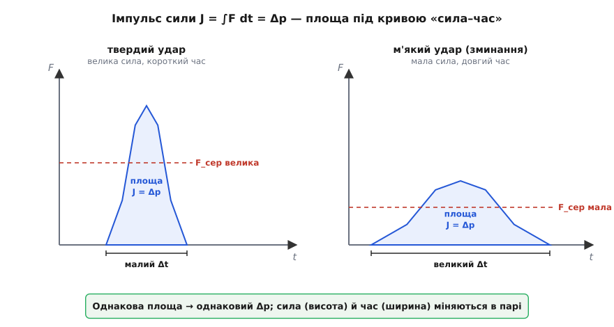
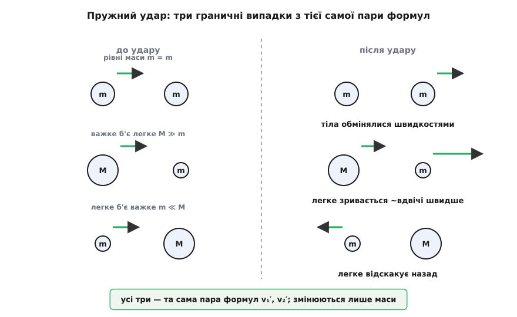
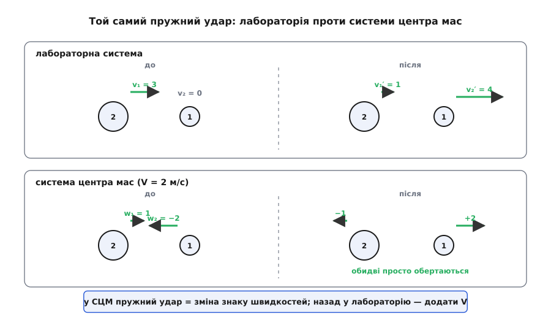

# 🧮 Апарат збереження імпульсу: від імпульсу сили до розв'язку удару

Закон збереження імпульсу вражає тим, що дозволяє відповісти «що буде після удару?», нічого не знаючи про самий удар — які там діяли сили, скільки тривали, як тіла пружинили. Але щоб цим правом користуватися впевнено, потрібен точний апарат: як перевести миттєве F = dp/dt у бухгалтерію, що переживає будь-яке зіткнення; як із двох законів збереження витягти швидкості тіл після пружного удару; як одним числом охопити всю шкалу від ідеального відскоку до злипання; і, нарешті, який прийом робить усі ці задачі майже усними. Зберімо цей апарат від першопричини — від однієї-єдиної рівності Ньютона.

### Імпульс сили: інтеграл, що дорівнює приросту руху

Найзагальніша форма [другого закону Ньютона](topic:physics/newtons-second-law) говорить не «F = m·a», а тонше: сила дорівнює швидкості зміни імпульсу, F = dp/dt. Це твердження **миттєве** — про кожну мить окремо. Та удар — це коротка буря сили, у якій ми не годні простежити F у кожну тисячну секунди: струни ракетки, зминання бампера, стиск двох куль. На щастя, стежити й не треба. Проінтегруймо рівність по всьому проміжку, поки триває дія:

```
F = dp/dt                          (загальна форма другого закону)
F·dt = dp                          (помножили на dt)
∫[t₁→t₂] F dt = ∫ dp = p₂ − p₁ = Δp
```

Ліворуч постав [інтеграл](topic:math/integral) сили за часом — накопичена дія сили за весь удар. Він має власну назву — **імпульс сили**, позначмо його J:

```
J = ∫[t₁→t₂] F dt = Δp
```

Це **теорема про імпульс сили** в інтегральній формі, і в ній уся сила прийому. Вона каже: щоб знайти приріст руху, не потрібно знати профіль сили — досить її інтеграла за часом, тобто площі під кривою «сила–час». Хай сила стрибала як завгодно — важить лише накопичена площа, і вона дорівнює різниці імпульсів, яку видно з «до» й «після».

Звідси природно виринає поняття **середньої сили**. Розтягнімо ту саму площу в рівновисокий прямокутник за той самий час Δt — його висота й буде середня сила:

```
F_сер = J / Δt = Δp / Δt          отже   J = F_сер · Δt
```

Одну й ту саму зміну імпульсу можна набрати великою силою за коротку мить або малою силою за довгий час — аби добуток F_сер·Δt (площа) збігався. Ось чому та сама подія буває нищівною або м'якою залежно від того, за який час вона відбулась.


*Приріст імпульсу дорівнює площі під кривою сили за часом, а не її висоті. Однакова площа (той самий Δp) може бути високою й вузькою — короткий твердий удар з величезною силою — або низькою й широкою: те саме гасіння руху, розтягнуте в часі малою силою.*

> 🔧 **Навіщо це.** Це той міст, що переводить недосяжне в досяжне. Точний хід сили в зіткненні виміряти майже неможливо, зате приріст імпульсу Δp читається з простих «до» і «після». Уся інженерія пасивної безпеки живе на цій рівності: зминальна зона авто, подушка, шолом, страхувальна мотузка не зменшують Δp — тіло однаково мусить погасити весь свій імпульс, — вони **розтягують Δt**, а з ним ділять пікову силу.

**Задача.** Авто масою 1200 кг їде зі швидкістю 15 м/с і вдаряється в перепону, спиняючись. Зміна імпульсу задана самою зупинкою: Δp = 1200·15 = 18000 кг·м/с — і вона однакова, хоч як гальмувати. Порівняймо жорсткий і зминальний удар.

```
Жорсткий каркас, зупинка за Δt = 0.02 с:
F_сер = Δp / Δt = 18000 / 0.02 = 900000 Н = 900 кН

Зминальна зона розтягує зупинку до Δt = 0.15 с:
F_сер = 18000 / 0.15 = 120000 Н = 120 кН
```

Той самий імпульс — а сила на пасажира менша в сім із половиною разів, рівно у стільки, у скільки довший час. Зминальна зона не рятує від зупинки; вона краде час, а час ділить силу.

### Збереження в системі: імпульси гасяться парами

Тепер два тіла, що діють одне на одне, — і жодних зовнішніх сил уздовж їхньої лінії. Під час контакту перше тисне на друге із силою F₂₁, а друге на перше — із F₁₂. За [третім законом Ньютона](topic:physics/newtons-third-law) у **кожну мить** ці сили рівні за величиною й протилежні: F₁₂ = −F₂₁. І діють вони рівно **однаковий час** — поки триває той самий контакт. Проінтегруймо кожну по цьому спільному проміжку, згадавши щойно доведену теорему J = Δp:

```
імпульс сили на друге тіло:   J₂₁ = ∫ F₂₁ dt = Δp₂
імпульс сили на перше тіло:   J₁₂ = ∫ F₁₂ dt = Δp₁
```

Оскільки підінтегральні сили протилежні в кожну мить, протилежні й самі інтеграли: J₁₂ = −J₂₁. А отже, Δp₁ = −Δp₂, тобто:

```
Δp₁ + Δp₂ = 0        →        p₁ + p₂ = const
```

Скільки імпульсу одне тіло втратило, стільки ж друге здобуло — бо той самий парний імпульс сили один віддав, а інший прийняв. Це і є **збереження імпульсу**, виведене через імпульси сили: погляд, доповняльний до підсумовування самих сил у [теоремі про центр мас](topic:physics/center-of-mass/math-com-theorem.md).

Для N тіл нічого не міняється по суті. Кожна внутрішня сила приходить парою зі своїм близнюком-протидією, тож і кожен внутрішній імпульс Jᵢⱼ має протилежний Jⱼᵢ = −Jᵢⱼ; уся внутрішня метушня гаситься попарно, і зрушити повний імпульс здатні лише зовнішні сили:

```
dP/dt = F_зовн           F_зовн = 0  ⇒  P = const
```

Це тримається залізно, хоч би яким шаленим і заплутаним було внутрішнє життя системи, і — окремо — у кожній інерціальній системі відліку. Саме тому наступні задачі про удар ми можемо розв'язувати, знаючи лише повний імпульс до події: він нікуди не подінеться.

### Пружний удар у прямій: дві умови на два невідомих

Тепер винагорода. Лобове зіткнення на прямій: тіла масами m₁ і m₂ зі знаковими швидкостями v₁ і v₂ переходять у v₁′ і v₂′. Двоє невідомих — потрібні дві рівності.

Перша є завжди — збереження імпульсу:

```
m₁·v₁ + m₂·v₂ = m₁·v₁′ + m₂·v₂′
```

Друга — визначення пружного удару: у ньому сповна зберігається й [кінетична енергія](topic:physics/kinetic-energy), бо ніщо не йде на тепло чи зім'яття:

```
½·m₁·v₁² + ½·m₂·v₂² = ½·m₁·v₁′² + ½·m₂·v₂′²
```

Розв'яжімо цю пару красиво, не в лоб. Згрупуймо в кожному законі доданки з однаковими масами:

```
(A)  m₁·(v₁ − v₁′) = m₂·(v₂′ − v₂)
(B)  m₁·(v₁² − v₁′²) = m₂·(v₂′² − v₂²)
```

У (B) кожна дужка — різниця квадратів; розкладім її, v₁² − v₁′² = (v₁ − v₁′)(v₁ + v₁′):

```
m₁·(v₁ − v₁′)(v₁ + v₁′) = m₂·(v₂′ − v₂)(v₂′ + v₂)
```

А тепер поділімо цю рівність на (A) — для справжнього удару v₁ ≠ v₁′, тож ділити можна. Множники m₁(v₁−v₁′) і m₂(v₂′−v₂) скорочуються, лишаючи диво чистоти:

```
v₁ + v₁′ = v₂ + v₂′
        ↓
v₁ − v₂ = −(v₁′ − v₂′)
```

Ось воно, серце пружного удару: **швидкість зближення дорівнює швидкості розльоту**. Хоч які маси, тіла розлітаються рівно так само швидко, як зближалися, — лише навпаки. Ця рівність — та сама енергетична умова, але вже **лінійна**, а з лінійним працювати легко. Складімо її із законом імпульсу й розв'яжімо систему двох лінійних рівнянь:

```
v₁′ = [ (m₁ − m₂)·v₁ + 2·m₂·v₂ ] / (m₁ + m₂)
v₂′ = [ (m₂ − m₁)·v₂ + 2·m₁·v₁ ] / (m₁ + m₂)
```

Формули незугарні на вигляд, та вся інтуїція оживає, щойно підставити крайні випадки:

**Рівні маси, m₁ = m₂.** Тоді v₁′ = v₂, v₂′ = v₁ — тіла просто **обмінюються швидкостями**. Куля, що влучає в рівну нерухому, спиняється на місці, а вдарена зривається з її швидкістю; так клацає Ньютонова колиска.

**Мішень спочиває, v₂ = 0.** Тоді v₁′ = (m₁−m₂)/(m₁+m₂)·v₁, а v₂′ = 2·m₁/(m₁+m₂)·v₁. Два крайні підвипадки варті окремого погляду:

- **Важке б'є легке** (m₁ ≫ m₂): v₁′ ≈ v₁ (важке майже не гальмує), v₂′ ≈ 2·v₁ — легке зривається вдвічі швидше за нападника. Хоч як розганяй важкий молот, легка ціль не полетить швидше за подвоєну його швидкість — це стеля.
- **Легке б'є важке** (m₁ ≪ m₂): v₁′ ≈ −v₁ (легке відскакує назад майже з тією ж швидкістю), v₂′ ≈ 0 (важке ледь ворухнеться). Це м'яч, що відбивається від стіни: стіна — «нескінченна маса», і м'яч обертає свою швидкість, майже нічого не гублячи.


*Три граничні пружні удари, усі виводяться з тих самих двох формул. Рівні маси міняються швидкостями; важке тіло майже не помічає легкого й жбурляє його вдвічі швидше; легке відскакує від важкого назад, а те стоїть.*

**Задача.** Візок 2 кг котиться зі швидкістю 3 м/с і пружно б'є нерухомий візок 1 кг. Швидкості після?

```
v₁′ = [ (2 − 1)·3 + 2·1·0 ] / (2 + 1) = 3 / 3 = 1 м/с
v₂′ = [ (1 − 2)·0 + 2·2·3 ] / (2 + 1) = 12 / 3 = 4 м/с

перевірка імпульсу:  2·3 = 6      →   2·1 + 1·4 = 6      ✓
перевірка енергії:   ½·2·3² = 9   →   ½·2·1² + ½·1·4² = 1 + 8 = 9   ✓
відносна швидкість:  до 3 − 0 = 3   після 1 − 4 = −3   (обернулась)   ✓
```

Нападник сповільнився до 1 м/с, мішень помчала на 4 м/с; і імпульс, і енергія збіглися до останньої одиниці, а відносна швидкість акуратно обернулась. Апарат працює.

### Абсолютно непружний удар і коефіцієнт відновлення

Протилежний край шкали — коли тіла після удару рухаються **разом**, злипшись: пластилін до пластиліну, вагон у зчепку, куля в мішку з піском. Тут енергія вже не збережеться, тож із двох рівнянь лишається одне — імпульсне, — і його самого досить, бо невідома тепер одна спільна швидкість u:

```
(m₁ + m₂)·u = m₁·v₁ + m₂·v₂
u = (m₁·v₁ + m₂·v₂) / (m₁ + m₂)
```

Придивімося: це рівно швидкість [центра мас](topic:physics/center-of-mass) системи. Злипшись, тіла їдуть саме так, як усередньому рухалася вся система від початку, — бо повний імпульс не змінився, а нести його тепер нікому, крім спільної маси.

А скільки кінетичної енергії пропало? Пряме віднімання E_до − E_після після скорочень дає напрочуд ощадливий вислів через **зведену масу** μ = m₁·m₂/(m₁+m₂):

```
ΔE = ½·μ·(v₁ − v₂)²,        μ = m₁·m₂/(m₁ + m₂)
```

Втрата залежить **лише від відносної швидкості** тіл, а не від того, як швидко вони летять разом. Це не випадковість: пропала рівно та кінетична енергія, що сидить у відносному русі, — та сама, яку побачив би спостерігач у системі центра мас. Гуртовий рух M·v_цм відібрати неможливо: на це потрібна зовнішня сила, а її нема. І, звісно, енергія нікуди не зникла — [закон збереження енергії](topic:physics/energy-conservation) неторканий, — вона лише перетекла з упорядкованого руху в тепло й зім'яття.

**Задача.** Той самий візок 2 кг зі швидкістю 3 м/с, але тепер він **зчіпляється** з нерухомим 1 кг.

```
u = (2·3 + 1·0) / (2 + 1) = 6 / 3 = 2 м/с

μ = 2·1 / (2 + 1) = 2/3 кг
ΔE = ½·(2/3)·(3 − 0)² = ½·(2/3)·9 = 3 Дж
```

Третина початкових 9 Дж — три джоулі — пішла в тепло зчепки; спільна швидкість 2 м/с. Та сама пара тіл, а доля енергії протилежна пружному випадку.

Між двома крайнощами лежить усе реальне життя, і охоплює його одне число — **коефіцієнт відновлення** e. Ісаак Ньютон іще в «Началах» (1687) помітив із дослідів над ударом куль, що швидкість розльоту пропорційна швидкості зближення, з коефіцієнтом, що залежить від матеріалу тіл. Це суто дослідний, феноменологічний закон — і саме тим він цінний: він **обходить** недосяжні подробиці сили в мить удару, замінюючи їх одним виміряним числом. *(Статус: усталено; e — властивість пари матеріалів, від 0 до 1, а не фундаментальна стала.)*

```
e = (швидкість розльоту) / (швидкість зближення) = −(v₁′ − v₂′) / (v₁ − v₂)
```

Це рівно наша умова оберненої відносної швидкості, тепер із «важелем» e:

```
v₁′ − v₂′ = −e·(v₁ − v₂)
```

Пружний удар — це e = 1 (відносна швидкість обертається сповна), абсолютно непружний — e = 0 (тіла не розходяться, v₁′ = v₂′). Розв'язавши цю умову з імпульсним законом, дістаємо **єдину формулу на всі удари**:

```
v₁′ = [ (m₁ − e·m₂)·v₁ + (1 + e)·m₂·v₂ ] / (m₁ + m₂)
v₂′ = [ (1 + e)·m₁·v₁ + (m₂ − e·m₁)·v₂ ] / (m₁ + m₂)
```

Підставте e = 1 — і повернуться пружні формули; підставте e = 0 — обидві швидкості стануть спільною u. А втрата енергії узагальнюється так само стисло:

```
ΔE = ½·μ·(1 − e²)·(v₁ − v₂)²
```

При e = 1 множник (1 − e²) обертається в нуль — не гине нічого; при e = 0 гине вся відносна енергія. Квадрат e — це частка відносної кінетичної енергії, що переживає удар. Одна змінна плавно веде нас від ідеального відскоку до повного злипання.

### Система центра мас: удари стають тривіальними

Досі ми розв'язували системи рівнянь. Є прийом, після якого це стає майже усним. Перейдімо в систему відліку, що рухається разом із центром мас зі швидкістю

```
V = (m₁·v₁ + m₂·v₂) / (m₁ + m₂)
```

За [Ґалілеєвим правилом](topic:physics/galilean-relativity) віднімемо цю швидкість спостерігача від обох тіл:

```
w₁ = v₁ − V,        w₂ = v₂ − V
m₁·w₁ + m₂·w₂ = 0        (за самою побудовою центра мас)
```

У цій системі повний імпульс тотожно нульовий, а отже, два імпульси **завжди рівні за величиною й протилежні** — [чому саме нуль, доведено окремо](topic:physics/center-of-mass/math-com-theorem.md). І тут коїться маленьке диво. У прямому ударі в системі центра мас кожна швидкість просто множиться на −e:

```
w₁′ = −e·w₁,        w₂′ = −e·w₂
```

Чому так просто? Нульовий повний імпульс зберігається автоматично для будь-якої протилежної пари — про нього дбати не треба. Лишається сама умова відновлення, а вона в цій системі каже, що кожна швидкість — це прямо частка відносної, тож обидві просто обертаються й слабнуть у e разів. Пружний удар (e = 1) — обидві швидкості **міняють знак**; абсолютно непружний (e = 0) — обидві стають нулем, тобто тіла завмирають одне відносно одного й їдуть разом зі швидкістю V. Жодних рівнянь.

Лишилося вернутися в лабораторію — додати V назад:

```
v₁′ = V − e·(v₁ − V),        v₂′ = V − e·(v₂ − V)
```

Розкрийте дужки — і звідси випадуть рівно ті самі загальні формули з (1 + e), що ми добували системою рівнянь. Увесь апарат згорнувся у три кроки: перейти в систему центра мас, помножити швидкості на −e, повернутися.

**Задача.** Знову 2 кг зі швидкістю 3 м/с у нерухомий 1 кг, пружно (e = 1) — але тепер через центр мас.

```
V = (2·3 + 1·0) / 3 = 2 м/с
w₁ = 3 − 2 = 1,     w₂ = 0 − 2 = −2      (перевірка: 2·1 + 1·(−2) = 0 ✓)
фліп (e = 1):  w₁′ = −1,   w₂′ = +2
назад:  v₁′ = −1 + 2 = 1,   v₂′ = +2 + 2 = 4
```

Ті самі 1 м/с і 4 м/с — але замість квадратного рівняння лише віднімання, зміна знаку й додавання. Складна задача стала тривіальною, щойно ми глянули на неї з правильної системи відліку.


*Одне зіткнення, дві системи відліку. У лабораторній швидкості несиметричні й до, і після. У системі центра мас тіла підходять із рівними протилежними імпульсами, а пружний удар лише обертає обидві швидкості — розв'язок стає усним. Повернення в лабораторію (додати V) відновлює звичні числа.*

> 🔧 **Навіщо це.** Систему центра мас беруть щоразу, коли важить сама взаємодія, а не гуртовий рух: розсіяння частинок, розпад ядра, зустріч більярдних куль. Там повний імпульс зафіксовано в нулі, тож імпульси тіл завжди просто протилежні, а вся арифметика удару зводиться до множення на −e. У фізиці високих енергій уся корисна енергія зіткнення — це енергія саме в системі центра мас; тому прискорювачі й зводять зустрічні пучки, щоб центр мас стояв, а не мчав, і жоден джоуль не змарнувався на безплідний спільний розгін.

### Один закон, усе решта — алгебра

Погляньмо, з чого все виросло. Одна рівність Ньютона, F = dp/dt, проінтегрована за часом, дала теорему про імпульс сили J = Δp — і разом із нею право не знати сили в ударі, а знати лише її підсумок. Та сама теорема, застосована до пари тіл через дію-протидію, дала збереження повного імпульсу. На ньому самому тримається непружний удар; для пружного знадобилась одна додаткова умова — збереження енергії, — яка чарівно згорнулась в обернення відносної швидкості; а коефіцієнт відновлення e натягнув єдину нитку через усю шкалу від відскоку до злипання. І, нарешті, система центра мас показала, що вся ця машинерія — то лише незручний погляд на просту річ: у правильній системі відліку тіла підходять рівними протилежними імпульсами й відходять, помножені на −e. Знайдіть повний імпульс до події — і решта вже чиста алгебра.
