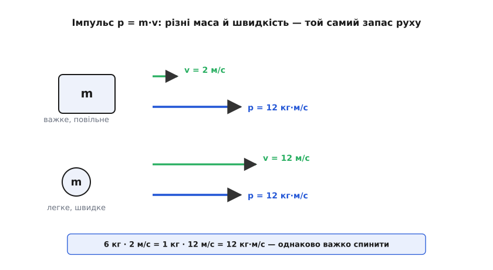
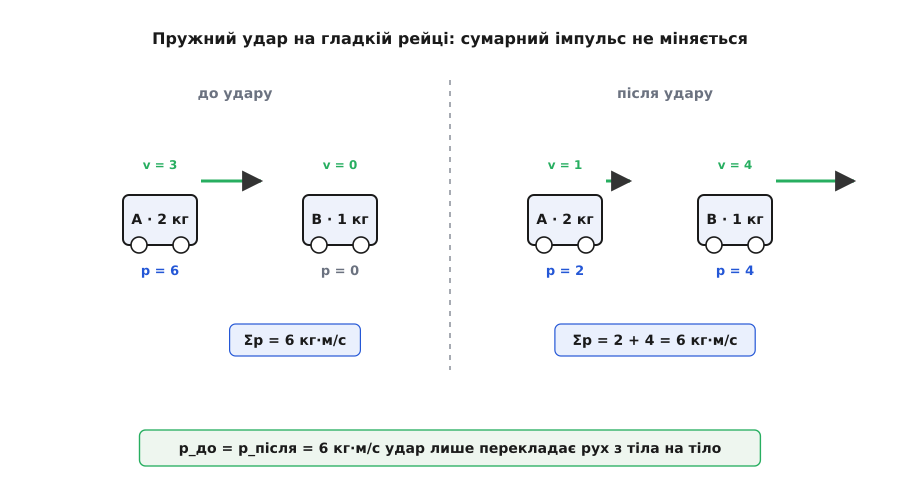
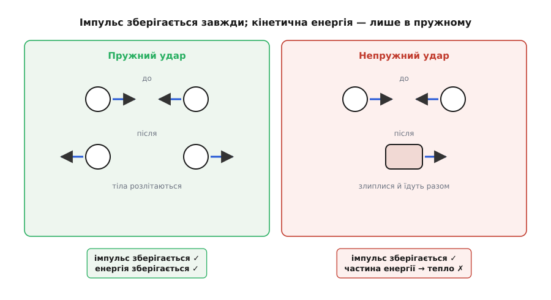
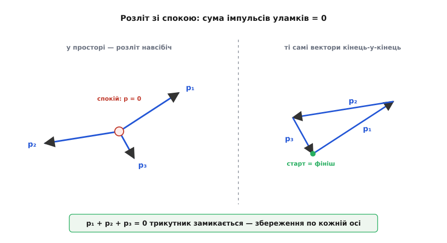

# Імпульс: запас руху, який нікуди не зникає

<preknowlist>
- [Маса](topic:physics/mass) — міра інертності тіла, наскільки важко змінити його рух; одиниця — кілограм.
- [Швидкість](topic:physics/velocity) — швидкість зміни положення; вектор: величина плюс напрям.
- [Сила](topic:physics/force) — векторна дія, що змінює рух тіла; вимірюється в ньютонах.
- [Другий закон Ньютона](topic:physics/newtons-second-law) — сила дорівнює швидкості зміни імпульсу; за сталої маси F = m·a.
- [Третій закон Ньютона](topic:physics/newtons-third-law) — дія дорівнює протидії: сили, якими два тіла діють одне на одне, рівні за величиною й протилежні за напрямом.
- [Додавання векторів](topic:math/vector-addition) — як складати напрямлені величини за правилом трикутника.
</preknowlist>

Уявіть, що на вас щось котиться і треба спинити його голими руками. Одне діло — зустріти легкий м'яч, що ледь повзе, і зовсім інше — той самий м'яч, пущений щосили, або навантажений візок на тихому ходу. Відчуття підказує: у русі є щось, чого тим більше, чим важче тіло й чим швидше воно йде, — і саме це «щось» вам доведеться погасити, приймаючи удар. Легкий кажан на великій швидкості й важка вантажівка на малій можуть бути однаково важкі для зупинки. Отже, самої лише швидкості замало, щоб оцінити «скільки руху» несе тіло: у гру входить і маса.

Природно скласти обидва чинники в одну величину — добуток маси на швидкість. Її звуть **імпульсом** (лат. *impulsus* — «поштовх, удар»), а історично, ще від Ньютона, — **кількістю руху**:

```
p = m · v
```

Це і є та міра «запасу руху», яку вимагало чуття. Вантажівка масою 3000 кг на швидкості 2 м/с несе p = 6000 кг·м/с; куля масою 0.01 кг, що летить зі швидкістю 600 м/с, — p = 6 кг·м/с. Числа різні, але обидва тіла по-своєму «наладовані» рухом, і кожне доведеться зупиняти окремим зусиллям. Одиниця імпульсу так і читається з формули — кілограм на метр за секунду, **кг·м/с**; власної назви вона не має.

### Імпульс — вектор, а не просто число

Швидкість має напрям, а маса його не міняє (це звичайне додатне число), тож імпульс дивиться **туди ж, куди й рух**. Це не дрібниця, а суть справи. Два однакові м'ячі, що летять назустріч із рівними швидкостями, мають рівні за величиною, але **протилежні** імпульси: один +p, другий −p. Разом їхній сумарний імпульс — нуль, хоча руху хоч відбавляй. Саме тому імпульс не можна складати як звичайні числа — його складають [як вектори](topic:math/vector-addition), за напрямом. Проґавите знак чи напрям — і весь дальший облік розсиплеться.

> 🔧 **Навіщо це.** У задачах про удар, віддачу чи розліт уламків уся бухгалтерія тримається на напрямах. Постріл угору й постріл убік дають однаковий за величиною імпульс кулі, але зовсім різну віддачу зброї — бо вектори різні. Тому перше, що робить інженер чи балістик, — вибирає осі й розкладає кожен імпульс на складові вздовж них; далі рахунок іде окремо по кожній осі.


*Імпульс p = m·v збирає масу й швидкість в одну векторну величину. Вантажівка на малій швидкості й куля на великій можуть мати рівні за модулем імпульси — обидва однаково нелегко погасити. Стрілка p завжди дивиться туди, куди рухається тіло.*

### Чому саме m·v: імпульс — це те, що міняє сила

Добуток m·v не випав із неба — його виділяє сама механіка. [Другий закон Ньютона](topic:physics/newtons-second-law) у своєму первісному, найзагальнішому вигляді каже не «F = m·a», а тонше: сила дорівнює **швидкості зміни імпульсу**.

```
F = Δp / Δt      (точно — F = dp/dt)
```

Тобто сила — це не те, що «тримає» рух, а те, що **переливає** імпульс у тіло чи з нього. Немає сили — імпульс не міняється. Є сила — імпульс наростає або спадає рівно з тією швидкістю, яку задає сила. Ось чому природно стежити саме за m·v, а не за якоюсь іншою комбінацією: це та величина, на яку сила діє напряму.

Перегорнімо рівність. Помножимо обидві частини на проміжок часу — і дістанемо, скільки імпульсу додала сила за цей час:

```
Δp = F · Δt
```

Добуток сили на час її дії має власну назву — **імпульс сили** (не плутати з імпульсом тіла p = m·v!). Він і є те, що змінює імпульс тіла: скільки імпульсу сили влили, на стільки й зріс запас руху. Звідси проста, але глибока думка: щоб надати тілу того самого приросту руху, можна діяти великою силою коротко або малою силою довго — результат Δp однаковий, аби добуток F·Δt збігався.

**Задача.** Тенісист б'є по м'ячу масою 57 г. М'яч зривається з ракетки зі швидкості майже нуль до 50 м/с, а струни торкаються його лише 5 мс. Яка середня сила удару?

```
Δp = m · Δv = 0.057 · 50 = 2.85 кг·м/с

Середня сила за час контакту:
F = Δp / Δt = 2.85 / 0.005 = 570 Н
```

П'ятсот сімдесят ньютонів — це наче на м'яч на мить сперлася вага в 58 кг, і все за п'ять тисячних секунди. Тому такий удар і жбурляє легкий м'яч через увесь корт. А та сама зміна імпульсу, розтягнута в часі, дала б силу в багато разів меншу — на цьому стоять і зминальна зона авто, і вміння приймати м'яч, «відводячи» руку.

### Найголовніше: імпульс зберігається

Досі йшлося про одне тіло. Найкрасивіше починається, коли тіл двоє й вони діють одне на одне — стикаються, відштовхуються, чіпляються. Тут імпульс показує свою справжню силу.

Візьмімо два тіла, на які **ззовні** нічого не діє (або зовнішні сили зрівноважені) — скажімо, два візки на гладенькій рейці. Нехай вони стикаються. Під час удару перший тисне на другий із якоюсь силою; але за [третім законом Ньютона](topic:physics/newtons-third-law) другий тисне на перший рівно з такою самою силою в протилежний бік. Дві сили однакові й протилежні, діють однаковий час, тож імпульс сили, який перший передає другому, точно дорівнює тому, що другий передає першому, — лише зі знаком мінус. Скільки імпульсу один візок втратив, стільки ж другий здобув.

А отже, **сумарний імпульс пари як був, так і лишився**:

```
p₁ + p₂ = const      (доки діють лише внутрішні сили)
```

Це **закон збереження імпульсу**. У системі, ізольованій від зовнішніх сил, повний імпульс не міняється ніколи — хоч би що коїлося всередині. Внутрішні сили тільки перекладають імпульс з тіла на тіло, як гроші з кишені в кишеню; загальна сума в системі стала. Розкидайте зусилля хоч на тисячу тіл, що товчуться, тягнуть і штовхають одне одного, — усі внутрішні сили гасяться попарно, і векторна сума всіх m·v тримається незмінною.

> 🔧 **Навіщо це.** Це один із найпотужніших робочих інструментів фізики. Він дозволяє відповісти «що буде після?», нічого не знаючи про подробиці самого удару — які там були сили, як довго, як тіла пружинили. Байдуже: скільки імпульсу було до події, стільки й буде після. Балістик рахує віддачу гармати, інженер — розліт уламків, астроном — гравітаційний маневр зонда біля планети, — і всі спираються на цю саму рівність, оминаючи неприступні деталі.


*Ізольована система: хоч як тіла обміняються рухом під час удару, векторна сума їхніх імпульсів до події дорівнює сумі після. Внутрішні сили лише перекладають імпульс з одного тіла на інше.*

Чому цей закон узагалі виконується так залізно — глибше за третій закон Ньютона. Насправді збереження імпульсу випливає з того, що **простір усюди однаковий**: закони фізики не міняються, куди тіло не перенеси. Ця відповідність між симетрією й збереженням — не випадковий збіг, а глибокий закон природи, [теорема Нетер](topic:physics/noether-theorem): кожній неперервній симетрії відповідає своя збережувана величина, і однорідність простору дає саме збереження імпульсу.

### Віддача: імпульс із нічого не береться

Найпряміший наслідок закону — **віддача**. Якщо система спочивала, її повний імпульс нульовий; і якщо всередині щось відштовхнуло щось інше, сумарний імпульс мусить лишитися нулем. Отже, коли одна частина полетіла вперед, друга **зобов'язана** полетіти назад, щоб два імпульси погасилися.

**Задача.** Людина масою 70 кг стоїть нерухомо на гладенькому льоду й кидає камінь масою 3 кг горизонтально зі швидкістю 6 м/с. З якою швидкістю поїде назад сама людина?

```
До кидка все спочиває:   p = 0

Після — сума імпульсів так само нуль:
m_люд · V + m_кам · v = 0
70 · V + 3 · 6 = 0
V = −18 / 70 ≈ −0.26 м/с
```

Мінус означає: людина рушить у бік, протилежний польоту каменя, зі швидкістю близько 26 см/с. Ніхто її не штовхав ззовні — вона від'їхала лише тому, що жбурнула масу в інший бік. Так само стрибає назад рушниця, розкручується садовий розприскувач, і так само, тільки безперервно викидаючи гарячий газ, летить [ракета](topic:physics/newtons-second-law/math-force-momentum.md) — там маса відкидається не одним каменем, а щомиті цівкою продуктів згоряння.

### Удар пружний і непружний: імпульс проти енергії

Закон збереження імпульсу справджується в **будь-якому** ударі — байдуже, чи тіла відскочили одне від одного, чи злиплися, чи розкололися. А от [кінетична енергія](topic:physics/kinetic-energy) — енергія руху, ½mv² — зберігається далеко не завжди. За цим і розрізняють два крайні випадки.

**Пружний удар** — коли кінетична енергія теж зберігається сповна: тіла відскакують, наче ідеальні м'ячі, нічого не гублячи на тепло чи звук. Так поводяться сталеві кульки, більярдні кулі, атоми газу.

**Абсолютно непружний удар** — коли тіла після зіткнення рухаються разом, злипшись в одне: пластилін до пластиліну, куля в мішку з піском, зчеплення вагонів. Тут імпульс зберігається так само точно, а частина кінетичної енергії неминуче йде на деформацію, нагрів, звук.

**Задача.** Візок масою 2 кг котиться зі швидкістю 3 м/с і налітає на нерухомий візок масою 1 кг; вони зчіплюються й їдуть разом. Яка їхня спільна швидкість? Скільки кінетичної енергії пропало?

```
Імпульс зберігається:
m₁·v₁ = (m₁ + m₂)·u
2 · 3 = (2 + 1) · u
u = 6 / 3 = 2 м/с

Кінетична енергія до й після:
E_до  = ½ · 2 · 3²        = 9 Дж
E_після = ½ · 3 · 2²      = 6 Дж
Пропало: 9 − 6            = 3 Дж
```

Імпульс до й після — рівно 6 кг·м/с, як і має бути. А от третина кінетичної енергії зникла — пішла на зім'яття зчепки й тепло. Це не порушення [збереження енергії](topic:physics/energy-conservation): енергія нікуди не поділася, вона лише перетекла з упорядкованого руху в хаотичний тепловий. Ось чому імпульс — надійніший провідник у задачах про удар: він тримається завжди, тоді як за кінетичною енергією ще треба стежити, куди вона витекла. Повний розбір обох видів удару, з формулами розльоту після пружного зіткнення, — в [окремому виведенні](topic:physics/momentum/math-conservation-derivation.md).


*В обох ударах сумарний імпульс однаковий до й після. Різниця в кінетичній енергії: у пружному вона зберігається (тіла розлітаються), у непружному частина йде в тепло (тіла рухаються разом).*

### Розліт у площині: вектори складаються нулем

Оскільки імпульс — вектор, його збереження діє **окремо по кожному напрямку**. Це стає особливо наочним, коли тіло розпадається на кілька частин, що летять урізнобіч. Нехай снаряд, який спочивав, розривається в повітрі на три уламки. Повний імпульс до вибуху — нуль; отже, і після нього векторна сума імпульсів усіх уламків мусить дати нуль. Домалюйте три стрілки-імпульси кінець-у-кінець — і вони замкнуться в трикутник, повернувшись у початок. Жоден уламок не може полетіти «сам собою»: куди рвонув один, туди його врівноважать інші.


*Розліт із стану спокою: сумарний імпульс лишається нульовим, тож вектори-імпульси уламків замикаються в трикутник. Збереження діє покомпонентно — окремо вздовж кожної осі.*

Той самий закон стоїть за тим, чому розколота граната розкидає осколки навсібіч, а її спільний [центр мас](topic:physics/center-of-mass) летить далі так, ніби нічого не сталося. Для системи тіл повний імпульс дорівнює масі всієї системи, помноженій на швидкість її центра мас:

```
p_повний = M · v_цм
```

Раз повний імпульс ізольованої системи сталий, то й швидкість центра мас стала: **центр мас рухається рівно й прямо, хоч би як шматувалися внутрішні частини**. Вибух міняє все всередині, але не зрушує центр мас із його рівномірного ходу — бо зрушити його могла б лише зовнішня сила, а її нема.

### Імпульс залежить від системи відліку

Тут криється тонкість, яку легко проґавити. Скільки саме імпульсу має тіло, залежить від того, **звідки дивитися**. Для пасажира у вагоні його валіза на полиці має нульовий імпульс; для людини на пероні та сама валіза мчить разом із поїздом і несе чималий p. Обидва мають рацію — просто вони в різних [системах відліку](topic:physics/inertial-frame), і швидкість, а з нею й імпульс, у кожній своя.

Здавалося б, це підриває весь облік. Насправді — ні, і саме тут закон збереження показує свою міць. За [принципом відносності Ґалілея](topic:physics/galilean-relativity) перехід між рівномірно рухомими системами лише додає всім тілам ту саму сталу швидкість. Повний імпульс від цього зміщується на сталу величину M·v_відн, але **зберігається він у кожній інерціальній системі окремо**: якщо сума імпульсів до події дорівнює сумі після в одній системі, те саме правдиве й у будь-якій іншій. Тому можна вільно перейти в систему, де рахунок найпростіший, — наприклад, у систему центра мас, де повний імпульс завжди нуль, — розв'язати задачу там і вернутися назад.

### Де проста картина ширшає

p = m·v служить бездоганно для всього повсякденного — від більярду до зіткнення планет. Та коли швидкості наближаються до світлової, ця формула вже неточна: тіло опирається розгону дедалі дужче, і правильним імпульсом стає p = γ·m·v, де множник γ росте без меж біля швидкості світла. Прикметно, що сам закон F = dp/dt і збереження імпульсу лишаються чинні — міняється тільки вираз для p. Саме релятивістський імпульс, а не m·v, зберігається у зіткненнях частинок на прискорювачах.

Ще глибша річ: імпульс несуть не лише тіла, а й **поля**. Промінь світла тисне на дзеркало, бо приносить із собою імпульс і віддає його, відбиваючись. У взаємодії заряджених частинок сума їхніх механічних імпульсів може на мить не зберігатися — але щойно долічити імпульс, захований у самому електромагнітному полі, баланс знову сходиться точно. Це не латка на законі, а знак того, наскільки він фундаментальний: збереження імпульсу тримається завжди, треба лише не забути врахувати всіх учасників — і речовину, і поле.

Є в імпульсу й обертовий двійник — [момент імпульсу](topic:physics/angular-momentum), що відповідає за збереження обертання так само, як імпульс — за збереження поступального руху; він випливає вже не з однорідності, а з ізотропності простору (усі напрями рівноправні). А те, як уявлення про «кількість руху» народжувалося у XVII столітті — від скалярної й почасти хибної величини Декарта до векторного виправлення Гюйґенса й дослідів над ударом у Лондонському королівському товаристві, — [окрема історія](topic:physics/momentum/hist-momentum.md).

Хоч звідки візьміть цей закон — з третього закону Ньютона, з однорідності простору чи з дослідів над кульками, — висновок один: рух не виникає й не щезає сам собою, він лише переходить від тіла до тіла. Порахуйте весь імпульс системи на початку — і ви знаєте його суму назавжди, хай усередині коїться яке завгодно стовпотворіння. Щоб побачити цей закон у дії на живому коді — [маленький симулятор зіткнень](topic:physics/momentum/proj-collision-sim.md), що стежить, як повний імпульс тримається незмінним удар за ударом.
