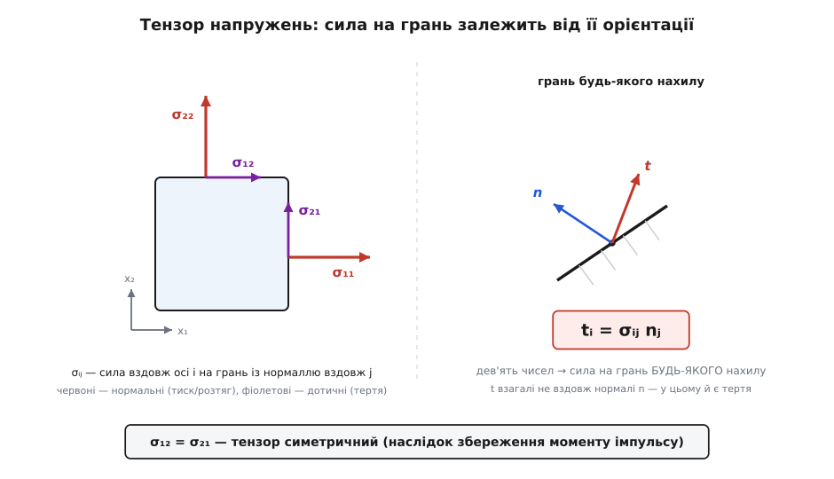
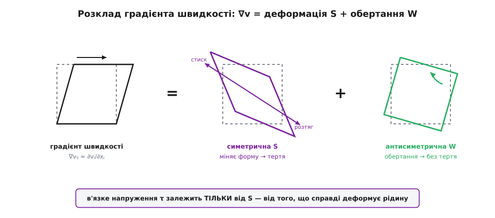

# 🧮 Тензор напружень: звідки насправді береться в'язкий член μ∇²v

В'язку силу можна ввести двома способами. Можна сказати «тертя підганяє частинку до швидкості сусідів, а відхилення від середнього по околу міряє оператор Лапласа — тому сила пропорційна ∇²v». Це чесна фізична картина, але в ній μ∇²v виникає майже як щасливий здогад. А можна вивести той самий член строго: побудувати правильний об'єкт, яким описують силу всередині суцільного середовища, — **тензор напружень** σ, — записати точний закон руху, а тоді накласти рівно два припущення про рідину й подивитися, що лишиться. Виявиться, що μ∇²v — не здогад, а неминучий алгебраїчний наслідок цих двох припущень, а разом із ним само собою випливе й те, чому тиск входить як −∇p і чому одного коефіцієнта μ досить. Це і зробимо тут — покроково, індекс за індексом.

## Сила на поверхню — не число і не вектор, а лінійне правило

Тиск — скаляр: одне число в точці, і тисне воно завжди по нормалі до площадки. Але рухома в'язка рідина вміє більше. Уяви внутрішній переріз у потоці — уявну площадку, що ділить рідину на дві частини. Рідина по один бік діє на рідину по інший не лише штовхаючи перпендикулярно (як тиск), а й **тягнучи вздовж** площадки: саме це тангенційне волочіння і є в'язке тертя. Отже, сила на одиницю площі — **вектор напруження** t (лат. *tractus* — тягнутий) — узагалі не збігається з нормаллю.

Гірше того: цей вектор залежить від того, **як площадку повернути**. Через ту саму точку можна провести переріз горизонтально, вертикально, навскіс — і сила на одиницю площі щоразу буде інша, бо по-різному орієнтована площадка «зрізає» потік. Тож нам потрібен об'єкт, який на вхід бере орієнтацію площадки (її одиничну нормаль **n**), а на вихід дає вектор напруження **t**. Скаляр цього не вміє, вектор — теж. Уміє це матриця: правило, що лінійно перетворює один вектор на інший. Такий об'єкт і звуть **тензором напружень** (лат. *tendere* — натягувати) — тензором другого рангу.

Домовмося про запис, без якого далі не рушити. Пронумеруймо осі 1, 2, 3 замість x, y, z, а складові позначаймо індексом: v₁, v₂, v₃ — складові швидкості, x₁, x₂, x₃ — координати. І приймімо **угоду про сумування**: якщо в одночлені індекс повторено двічі, за ним мовчки додаємо від 1 до 3. Скажімо, aₖbₖ означає a₁b₁ + a₂b₂ + a₃b₃ — це просто скалярний добуток, стисло записаний. Угода економить океан значків підсумовування.

Тепер саме означення. Позначмо **σᵢⱼ** — *i*-ту складову сили на одиницю площі, що діє на площадку, чия нормаль дивиться вздовж осі *j*. Перший індекс — куди сила напрямлена; другий — яку грань вона тисне. Дев'ять чисел (i, j = 1, 2, 3). Діагональні σ₁₁, σ₂₂, σ₃₃ — нормальні напруження (сила вздовж нормалі: розтяг або стиск); позадіагональні на кшталт σ₂₁ — дотичні, зсувні (сила вздовж грані). Твердження Коші (фр. Augustin-Louis Cauchy — Оґюстен-Луї Коші, який у 1820-х роках і ввів це поняття) полягає в тому, що вектор напруження на площадку з будь-якою нормаллю **n** дається одним лінійним правилом:

```
tᵢ = σᵢⱼ nⱼ          (сума за j: tᵢ = σᵢ₁n₁ + σᵢ₂n₂ + σᵢ₃n₃)
```

Знаєш дев'ять чисел σᵢⱼ у точці — знаєш силу на площадку геть будь-якого нахилу. Але звідки певність, що зв'язок саме **лінійний**, а не якийсь хитріший?

**Чому t мусить бути лінійним за n (тетраедр Коші).** Виріжмо крихітний тетраедр: три його грані лежать у координатних площинах (нормалі −e₁, −e₂, −e₃), а четверта, скісна, має нормаль n і площу A. Проєкції скісної грані на координатні площини дають площі бічних граней: Aⱼ = A·nⱼ. Запишімо для тетраедра закон Ньютона. Поверхневі сили пропорційні площам граней, тобто ростуть як квадрат розміру, ~L²; а маса (отже, інерція mass·прискорення) і об'ємні сили ростуть як об'єм, ~L³. Стягуймо тетраедр у точку, L → 0. Поділивши все на A ~ L², бачимо: інерційний та об'ємний внески несуть множник L і зникають, а поверхневі лишаються скінченні. Значить, у границі поверхневі сили мусять зрівноважитися самі між собою:

```
t(n)·A = t(e₁)·A₁ + t(e₂)·A₂ + t(e₃)·A₃
       = t(e₁)·A n₁ + t(e₂)·A n₂ + t(e₃)·A n₃
```

Поділивши на A, дістаємо t(n) = t(eⱼ)nⱼ. А t(eⱼ) — це напруження на грань з нормаллю вздовж осі *j*, тобто стовпчик σᵢⱼ. Виходить рівно tᵢ = σᵢⱼnⱼ. Лінійність не постульовано — вона **випливає** з того, що площа й об'єм по-різному масштабуються при стягуванні. Ось чому напруження в суцільному середовищі неминуче описується тензором.


*σᵢⱼ — це i-та складова сили на одиницю площі на грані, чия нормаль дивиться вздовж осі j. Перший індекс — напрям сили, другий — орієнтація грані. Дев'ять чисел (у 2D — чотири) повністю визначають силу на площадку будь-якого нахилу: tᵢ = σᵢⱼnⱼ. Дотичні складові (σ₂₁ тут) — це і є те тертя, якого в самому тиску немає.*

**Тензор симетричний: σᵢⱼ = σⱼᵢ.** Це теж не припущення, а наслідок — цього разу закону збереження моменту імпульсу. Візьми той самий кубик зі стороною L. Пара позадіагональних напружень, скажімо σ₂₁ і σ₁₂, створює на кубик крутний момент. Момент сили ~ напруження × площа грані × плече ~ L² · L = L³. А момент інерції кубика ~ ρ · L⁵. Кутове прискорення = момент / момент інерції ~ L³ / L⁵ = L⁻², і при L → 0 воно вибухнуло б у нескінченність, — хіба що крутний момент точно занулиться. А занулюється він лише коли σ₂₁ = σ₁₂. Отже, тензор напружень симетричний, і незалежних складових не дев'ять, а шість.

## Закон руху Коші: точний, для будь-якого середовища

Тепер порахуймо чисту поверхневу силу на маленьку грудку — так само, як у материнській статті рахували силу тиску на кубик, тільки чесніше, з повним тензором. Візьмімо кубик зі стороною d і подивімося на *i*-ту складову сили від пари граней, перпендикулярних до осі *j*. На «дальшій» грані напруження σᵢⱼ, на «ближчій» — трохи інше, σᵢⱼ + (∂σᵢⱼ/∂xⱼ)·d. Їхня різниця, помножена на площу грані d², дає результівну силу, а поділивши на об'єм d³, дістаємо силу на одиницю об'єму: ∂σᵢⱼ/∂xⱼ. Просумувавши по всіх трьох парах граней (індекс *j* повторено — сумуємо):

```
(чиста поверхнева сила на одиницю об'єму)ᵢ = ∂σᵢⱼ/∂xⱼ = (∇·σ)ᵢ
```

Це [дивергенція](topic:math/divergence) тензора σ — той самий оператор «скільки витікає з точки», тільки застосований по другому індексу тензора. Додаймо об'ємну силу ρgᵢ й прирівняймо до маси на прискорення (ρ помножити на [матеріальну похідну](topic:math/derivative) Dvᵢ/Dt — прискорення саме тієї краплі, що біжить):

```
ρ Dvᵢ/Dt = ∂σᵢⱼ/∂xⱼ + ρgᵢ        або у векторному вигляді:
ρ Dv/Dt = ∇·σ + ρg
```

Це **рівняння руху Коші**. Придивися: у ньому ще немає жодного слова про рідину. Воно однаково правдиве для сталевого рейки, гумового м'яча, меду й повітря — для будь-якого суцільного середовища взагалі, бо ми лише чесно застосували закон Ньютона до грудки речовини. Уся різниця між сталлю й водою захована в одному місці — у тому, **чим є σ**, як напруження пов'язане з рухом і деформацією. Цей зв'язок звуть **визначальним співвідношенням** (англ. *constitutive relation*), і саме він — а не закон Коші — робить рідину рідиною. Знайти σ для рідини — усе, що лишилося.

## Відколоти тиск: σ = −pI + τ

Почнімо з рідини в спокої. Що таке рідина за означенням? Це середовище, яке **не тримає статичного зсуву**: найменше дотичне напруження змушує її текти без упину. Отже, у спокої всі позадіагональні σᵢⱼ дорівнюють нулю, лишаються самі нормальні — і, за ізотропністю (рідина в спокої не має вирізненого напрямку), усі три однакові. Такий стан описує одне число — [тиск](topic:physics/pressure) p. Домовимося про знак: тиск стискає, а стиск — це напруження, напрямлене всередину, проти зовнішньої нормалі, тож у наших позначеннях воно від'ємне. Тензор напружень у спокої:

```
σᵢⱼ = −p δᵢⱼ        де δᵢⱼ — символ Кронекера: 1, якщо i=j, інакше 0
```

δᵢⱼ — це просто одинична матриця I (одиниці на діагоналі, нулі поза нею); −p δᵢⱼ означає «−p на кожній діагоналі, нуль на зсувах» — однаковий тиск на всі боки, жодного тертя. Тепер пустимо рідину в рух. З'являється друга частина напруження — та, що виникає **тільки під час деформації**, дотична й зсувна: це й є **в'язке напруження** τ (девіаторна, тобто «відхильна» частина). Розкладімо повний тензор на ці дві частини:

```
σ = −p I + τ           σᵢⱼ = −p δᵢⱼ + τᵢⱼ
```

Формально це означення τ (усе, що лишилося понад ізотропний тиск), а тиск беруть як середнє нормальне напруження зі знаком мінус, p = −⅓ σₖₖ, — так, щоб τ не мав власного ізотропного залишку. Підставмо розклад у закон Коші й порахуймо дивергенцію ізотропної частини — тут уперше запрацює символ Кронекера:

```
(∇·(−pI))ᵢ = ∂(−p δᵢⱼ)/∂xⱼ = −∂p/∂xᵢ        (δᵢⱼ лишає в сумі тільки j = i)
```

Тобто ізотропна частина дає рівно **−∇p** — той самий градієнт тиску, що в материнській статті ми діставали з кубика «перепад тиску штовхає рідину». Тепер він строго випав із тензора. Закон руху розпався на дві частини:

```
ρ Dv/Dt = −∇p + ∇·τ + ρg
```

Тиск і тяжіння вже на місці. Уся нез'ясованість стиснулася в один член — **∇·τ**. Знайдемо τ — і рівняння замкнеться.

## Тре тільки деформація: тензор швидкості деформації

Від чого може залежати в'язке напруження τ? Тертя — це опір відносному ковзанню сусідніх шарів, тож τ породжує **рух**. Але не будь-який. Якщо рідина рухається як одне ціле — уся разом пливе в один бік (перенесення) або крутиться, мов тверде тіло, — сусіди не ковзають один повз одного, відстані між частинками не міняються, і тертю нема на чому виникнути. Значить, τ залежить не від самої швидкості, а від того, як швидкість **різниться між сусідніми точками**, — від просторових похідних швидкості, зібраних у [градієнт](topic:math/gradient) швидкості:

```
Lᵢⱼ = ∂vᵢ/∂xⱼ         (9 чисел: як i-та складова швидкості міняється вздовж осі j)
```

Але й у цьому градієнті сидить іще й тверде обертання, яке теж не деформує. Відокремимо його. Будь-яку матрицю можна єдиним способом розкласти на симетричну й антисиметричну частини — піврозділити навпіл суму й різницю з переставленими індексами:

```
Lᵢⱼ = Sᵢⱼ + Wᵢⱼ

Sᵢⱼ = ½(∂vᵢ/∂xⱼ + ∂vⱼ/∂xᵢ)     — симетрична: Sᵢⱼ = Sⱼᵢ
Wᵢⱼ = ½(∂vᵢ/∂xⱼ − ∂vⱼ/∂xᵢ)     — антисиметрична: Wᵢⱼ = −Wⱼᵢ
```

Ці дві частини мають прозорий фізичний зміст. Відносна швидкість сусіда, що сидить на маленькому зміщенні dr, дорівнює L·dr = S·dr + W·dr. Антисиметрична частина W·dr — це рівно ½ ω × dr, де ω = ∇×v — завихреність: **тверде обертання** грудки як цілого, без зміни форми. А симетрична S·dr — це **чиста деформація**: діагональні Sᵢᵢ = ∂vᵢ/∂xᵢ — швидкості розтягу вздовж осей, позадіагональні — швидкості зсуву. Тому S і звуть **тензором швидкості деформації** (англ. *rate-of-strain tensor*). Оскільки тверде обертання W тертя не дає, лишається єдиний можливий аргумент:

```
τ = τ(S)          в'язке напруження залежить ТІЛЬКИ від швидкості деформації S
```

А що S симетричний, він має три взаємно перпендикулярні [головні осі](topic:math/eigenvalues) — напрямки, уздовж яких деформація чисто розтягувальна, без зсуву; уздовж них рідину в даний момент просто витягує або стискає.


*Градієнт швидкості ∇v завжди розкладається на дві частини. Симетрична S розтягує грудку вздовж одних осей і стискає вздовж інших — міняє форму, і саме це «тре». Антисиметрична W обертає грудку як тверде тіло — відстані між частинками не міняються, деформації немає, тертя немає. Тому в'язке напруження залежить лише від S.*

## Ньютонівська рідина: напруження ЛІНІЙНЕ за швидкістю деформації

Ми знаємо, що τ = τ(S). Але яка саме функція? Тут — головне модельне припущення, і воно напрочуд просте: візьмімо **найпростіший можливий зв'язок — лінійний**. Хай напруження прямо пропорційне швидкості деформації. Додаймо ще одну природну вимогу — **ізотропність**: у рідини немає вбудованого вирізненого напрямку (на відміну від кристала чи дерева з волокнами), тож зв'язок τ↔S мусить виглядати однаково в будь-якій повернутій системі координат.

Ці дві вимоги майже повністю визначають форму. Найзагальніший лінійний ізотропний зв'язок між двома симетричними тензорами містить рівно **два** незалежні коефіцієнти — і не більше (бо ізотропний тензор четвертого рангу, що пов'язує S із τ, будується лише з добутків символів Кронекера, а їх для симетричного S виходить дві незалежні комбінації: слід та решта). Ось вона:

```
τᵢⱼ = 2μ Sᵢⱼ + λ Sₖₖ δᵢⱼ

розписавши Sᵢⱼ і помітивши, що слід Sₖₖ = ∂vₖ/∂xₖ = ∇·v:

τ = μ(∇v + (∇v)ᵀ) + λ(∇·v) I
```

Тут (∇v)ᵀ — транспонований градієнт (переставлені індекси), а μ + λ — два матеріальні числа. μ — коефіцієнт [в'язкості](topic:physics/viscosity) (динамічна, або зсувна, в'язкість): він множить власне зсувну деформацію. λ — другий коефіцієнт в'язкості: він множить слід ∇·v, тобто швидкість зміни об'єму, і працює лише тоді, коли рідина розширюється чи стискається.

**Оце лінійне за S співвідношення й ЄСТЬ означення ньютонівської рідини.** Назва не випадкова. Візьмімо найпростішу течію — простий зсув: рідина тече вздовж осі 1, а її швидкість наростає вгору по осі 2, v = (u(x₂), 0, 0). Тоді з усього градієнта ненульове одне: ∂v₁/∂x₂ = u′. Швидкість деформації S має лише позадіагональні S₁₂ = S₂₁ = ½u′, а слід нульовий. Підставляємо:

```
τ₁₂ = 2μ S₁₂ = μ u′ = μ · du/dx₂
```

Дотичне напруження дорівнює в'язкості на градієнт швидкості — це рівно той закон в'язкого тертя, який Ньютон сформулював ще 1687 року в «Началах». Наша тензорна конструкція в найпростішому випадку сама собою зводиться до історичного означення Ньютона — тому рідину з лінійним τ(S) і звуть ньютонівською.

**Приклад (напруження в простому зсуві).** Вода тече вздовж пластини; швидкість наростає від стінки з градієнтом du/dx₂ = 100 с⁻¹. В'язкість води μ = 1.0×10⁻³ Па·с. Яке дотичне напруження?

```
τ₁₂ = μ · du/dx₂ = 1.0×10⁻³ · 100 = 0.1 Па
```

Одна десята паскаля — крихітна сила на квадратний метр, і все ж саме вона гальмує потік біля стінки й будує примежовий шар. А от [пружне тіло (закон Гука)](topic:physics/elastic-deformation) поводиться інакше по суті: там напруження пропорційне самій деформації (наскільки розтягнуто), а не швидкості деформації (наскільки швидко розтягують). Тверде тіло пам'ятає форму й опирається зміщенню; рідина форми не пам'ятає й опирається лише **темпові** зміщення. У цьому — уся різниця між пружністю та в'язкістю, і вона схована в одному слові: «швидкість» деформації. Коли ж μ сама залежить від S (кров густішає в застої, фарба рідшає під пензлем, крохмаль твердне від удару) — зв'язок уже не лінійний, і рідина **не**ньютонівська; для неї μ∇²v доводиться заміняти складнішим виразом.

## Згортка: чому ∇·τ = μ∇²v

Лишився останній крок — порахувати ∇·τ, тобто дивергенцію в'язкого напруження, і побачити, у що вона згортається. Візьмімо μ і λ сталими (однорідна рідина) і виносьмо їх з-під похідної. Рахуємо *i*-ту складову, ∂τᵢⱼ/∂xⱼ, член за членом:

```
∂τᵢⱼ/∂xⱼ = μ ∂/∂xⱼ(∂vᵢ/∂xⱼ + ∂vⱼ/∂xᵢ) + λ ∂/∂xⱼ[(∂vₖ/∂xₖ) δᵢⱼ]
```

Розберімо три доданки окремо.

Перший: μ ∂/∂xⱼ(∂vᵢ/∂xⱼ) = μ ∂²vᵢ/∂xⱼ∂xⱼ. Індекс *j* повторено — сумуємо за ним; сума других похідних за всіма трьома осями — це і є [оператор Лапласа ∇²](topic:math/laplacian), застосований до vᵢ:

```
μ ∂²vᵢ/∂xⱼ∂xⱼ = μ ∇²vᵢ          ← ось він, шуканий член
```

Другий: μ ∂/∂xⱼ(∂vⱼ/∂xᵢ). Тут ключовий хід — переставити порядок диференціювання (мішані похідні комутують: байдуже, спершу по xⱼ чи по xᵢ):

```
μ ∂/∂xⱼ(∂vⱼ/∂xᵢ) = μ ∂/∂xᵢ(∂vⱼ/∂xⱼ) = μ ∂/∂xᵢ(∇·v)
```

Третій, λ-член: δᵢⱼ у сумі за *j* лишає тільки j = i, тож

```
λ ∂/∂xⱼ[(∇·v) δᵢⱼ] = λ ∂/∂xᵢ(∇·v)
```

Складаємо всі три:

```
(∇·τ)ᵢ = μ ∇²vᵢ + (μ + λ) ∂/∂xᵢ(∇·v)
```

І ось нагорода за всю строгість. Для **нестисливої** рідини діє [нерозривність](topic:physics/flow-continuity) ∇·v = 0 — і другий доданок зникає цілком, разом із загадковим λ. Другий коефіцієнт в'язкості просто не встигає ні на що вплинути: у нестисливій течії немає зміни об'єму, яку він множить. Лишається чисте:

```
∇·τ = μ ∇²v
```

Той самий μ∇²v, який материнська стаття вводила фізично як «дифузію імпульсу», тепер випав із тензора напружень — без жодного здогаду, самою алгеброю: він народжується з першого доданку розкладу, тимчасом як λ-член і зайвий градієнт дивергенції гинуть від нестисливості.

> 🔧 **Навіщо це.** Зверни увагу, що коефіцієнт λ (і пов'язана з ним об'ємна в'язкість ζ = λ + ⅔μ) зник із рівняння повністю. Ось чому для води й повітря в звичайних задачах вистачає **одного** числа μ, а другу в'язкість можна взагалі не знати. Вона повертається лише там, де ∇·v ≠ 0, тобто де рідина відчутно стискається: у поглинанні звуку (кожне згущення-розрідження у хвилі трохи гріється саме через ζ) і в товщині ударної хвилі. Класичне припущення Стокса ζ = 0, тобто λ = −⅔μ, роками правило за замовчуванням; для реальних газів і рідин воно лише наближене, — але для нестисливої течії ця суперечка не має ваги: там λ не входить у відповідь у будь-якому разі.

## Усе рівняння, зібране з тензора

Тепер збираємо. Дивергенція повного тензора напружень розпалася на дві прозорі частини:

```
∇·σ = ∇·(−pI) + ∇·τ = −∇p + μ∇²v
```

Підставмо це в закон руху Коші ρ Dv/Dt = ∇·σ + ρg й розпишімо матеріальну похідну Dv/Dt = ∂v/∂t + (v·∇)v:

```
ρ (∂v/∂t + (v·∇)v) = −∇p + μ∇²v + ρg
```

Це рівняння Нав'є–Стокса — те саме, що материнська стаття зібрала з фізичних міркувань про три сили. Тільки тепер кожен його член **зароблено**, а не постульовано. Ліва частина — закон Ньютона Коші для суцільного середовища, точний для будь-якої речовини. Права — дивергенція тензора напружень, у якому −∇p виявився ізотропною частиною (тиск, що рідина тримає й у спокої), а μ∇²v — згорткою девіаторної частини за двох чесно названих припущень: **ньютонівського** (τ лінійне за швидкістю деформації S) і **нестисливого** (∇·v = 0). Тепер видно, де саме в алгебрі живе кожне з них: ньютонівське припущення обирає лінійну форму τ = 2μS + λ(∇·v)I, нестисливість убиває весь λ-член і замикає девіатор на самому лапласіані. Прибери будь-яке з двох — і в'язкий член перестане бути коротким μ∇²v, розгорнувшись у повніший вираз через S та ∇·v. Саме тому μ∇²v — не окрема фізична гіпотеза про «дифузію імпульсу», а найкоротша тінь, яку тензор напружень кидає на нестисливу ньютонівську рідину.
