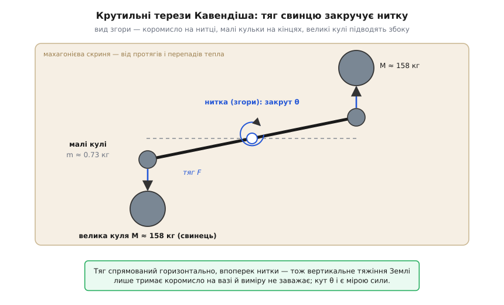
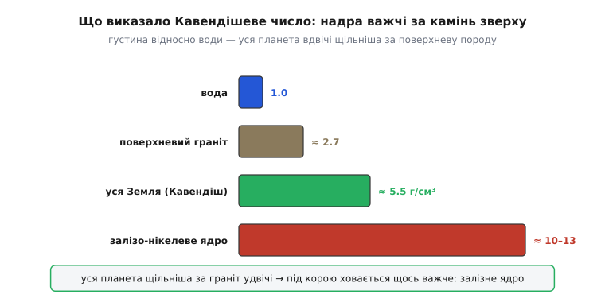

# 📜 Як зважили Землю: нитка, дві свинцеві кулі й таємниця земних надр

Землю не поставиш на терези. Камінь, мішок, корабель — усе, що вдається підняти в полі тяжіння й порівняти з гирями, — зважити можна. Але саму планету? Немає більшої маси, до якої її притулити; немає шальок, на які покласти. І все ж наприкінці XVIII століття одна людина назвала число — скільки важить Земля — і схибила заледве на відсоток. Зробила вона це, спіймавши нитку, тоншу за волосину, за яку крадькома смикали дві свинцеві кулі.

Найтонше тут — що Генрі Кавендіш (*Henry Cavendish*, 1731–1810) шукав навіть не масу, а **густину**: у скільки разів речовина Землі щільніша за воду. Питання здавалося вужчим, а було глибшим — воно про те, що ховається під ногами. Поверхневий камінь важить разів у два з половиною–три за таку саму воду. Якщо вся планета така сама наскрізь — одне число; якщо ж надра ховають щось важче за граніт під чоботом — зовсім інше. Виміряти густину Землі означало вперше зазирнути в її нутро, не копнувши й лопати.

## Ньютонів здогад і гора в Шотландії

Сам Ньютон число вгадав — і напрочуд влучно. У «Началах» він міркував так: поверхневі породи важать удвічі за воду, а що глибше в шахти, то важчі — утричі, вчетверо, ато й уп'ятеро. Отже, «кількість усієї матерії Землі, мабуть, у п'ять чи шість разів більша, ніж якби вся вона була з води». Здогад майже без вимірів — і майже точний (сучасне значення ≈ 5.5). Та здогад залишався здогадом: жодного досліду за ним не стояло.

Першу справжню спробу зробили не в лабораторії, а на схилі гори. 1774 року королівський астроном Невіл Маскелайн (*Nevil Maskelyne*) поїхав до гори Шехалліон (*Schiehallion*) у шотландському Пертширі — самотньої, крутої, зручно симетричної брили заввишки понад кілометр. Задум був такий: гора теж має масу, а отже, теж притягує. Якщо повісити виска (тягарець на нитці) з одного боку гори, її бічне тяжіння ледь-ледь відхилить нитку від справжнього прямовису. Порівнявши напрям виска зі справжньою вертикаллю (її давали зорі), можна виміряти, наскільки гора перетягує. Маскелайн упіймав відхил близько 11.6 кутової секунди; математик Чарлз Гаттон (*Charles Hutton*), перелопативши обміри гори, вивів 1778 року густину Землі ≈ 4.5 за воду.

Це вже було **число з досліду** — і в потрібному околі. Але метод був незугарний: цілу гору годі точно зважити, її форма й внутрішній камінь відомі лише приблизно, а виправлення на рельєф ковтали половину точності. Мрія була інша — упіймати тяжіння не між виском і горою, а між двома **відомими** тілами, які сам зробив, зважив і поставив, куди хотів. От тільки тяжіння між лабораторними тілами таке безнадійно кволе, що ловити його — однаково що зважувати запах.

## Задум Джона Мічелла

Прилад, здатний на це, придумав не Кавендіш. Його спорудив Джон Мічелл (*John Michell*, 1724–1793) — англійський священник і природознавець, з тих всебічних умів, яким тісно в одній науці. Мічелл першим здогадався, що землетрус розходиться **хвилями**, і поміряв швидкість тієї, що зруйнувала Лісабон, — за це його звуть батьком сейсмології. Він же за десять років до Кавендішевого досліду уявив «темні зорі» — тіла такі масивні, що з них не вирветься навіть світло: перший в історії ескіз того, що згодом назвуть чорною дірою.

Саме Мічелл зметикував, як зважити невидиме. Треба перевести кволеньке тяжіння в **обертання** й міряти закрут тонкої нитки — бо нитка на кручення піддатлива до неймовірності. Він побудував такі крутильні терези (майже тоді ж і незалежно подібний прилад для електричних зарядів зробив у Франції Шарль Кулон — інструмент, що двічі, в різних руках, відкрив по великому закону). Але скористатися своїм витвором Мічелл не встиг: він помер 1793 року, не звівши досліду. Прилад перейшов до Френсіса Волластона (*Francis John Hyde Wollaston*), а від нього — до Кавендіша, який 1797-го взявся довести справу до кінця. Тож те, що звуть «дослідом Кавендіша», по правді — дослід **Мічелла й Кавендіша**: задум і прилад одного, дані й аналіз другого.

## За що крутиться нитка

Улаштування терезів просте на око й підступне по суті. На тонкій нитці горизонтально висить дерев'яне коромисло — рейка футів на шість (≈ 1.8 м). На кінцях коромисла — дві однакові свинцеві кульки, кожна діаметром два дюйми й вагою близько 0.73 кг. Уся ця конструкція врівноважена так, що найменша бічна сила поверне коромисло, закрутивши нитку, — а нитка опиратиметься, як пружина.

Тепер підносимо до кожної кульки по великій свинцевій кулі — дванадцять дюймів у поперек, **158 кг** брухту. Ставимо їх з розумом: одну біля лівої кульки з одного боку, другу біля правої з протилежного, — щоб обидва притягання підштовхували коромисло в **один бік обертання**. І коромисло справді трохи повертається. Не від якоїсь механіки, важелів чи струму — а тому, що свинець тягне свинець. Уперше тяжіння між рукотворними тілами не вирахували, а **побачили**.


*Вид згори. Тяжіння великих куль тягне малі кульки вбік і повертає коромисло; нитка закручується, доки її пружність не зрівноважить тяг, — кут закруту θ і є мірою сили. Головна хитрість: тяг спрямований **горизонтально**, упоперек нитки, а величезне вертикальне тяжіння самої Землі лише тримає коромисло на вазі й у горизонтальну площину не втручається. Там суперничати нема з чим — тому й видно порошинку сили.*

І ось у цьому — уся геніальність задуму. Тяжіння Землі мільярди разів дужче за тяг свинцевих куль; здавалося б, воно розчавить будь-який тонкий вимір. Але Мічеллів прилад вимірює **горизонтальний** закрут, а тяжіння Землі спрямоване **вниз** — упоперек до нього. Вертикальна сила лише підвішує коромисло; у горизонтальній площині, де крутиться нитка, вона нічого не важить. Кавендіш винахідливо сховав вимір там, куди велетенське земне тяжіння не дотягується, — і в цій тиші стало чути шепіт свинцю.

## Полювання на порошинку сили

Наскільки тихий той шепіт — варто відчути в числах. Сила, з якою 158-кілограмова куля тягне 0.73-кілограмову кульку за чверть метра, — близько 1.5·10⁻⁷ Н. Це приблизно двадцятимільйонна частка ваги самої кульки: коромисло треба зважити з точністю, у десятки мільйонів разів тоншою за вагу того, що на ньому висить. Відхил кінця коромисла — якісь чотири міліметри.

За таку крихту змагається все на світі. Найлегший протяг гойдне коромисло дужче, ніж свинець. Тепліша стіна з одного боку — і повітря в кімнаті сунеться конвекцією, штовхаючи кульки сильніше за тяжіння. Навіть тепло від тіла самого дослідника все зіпсує. Тому Кавендіш замкнув прилад у махагонієвій скрині майже два метри завширшки, а скриню — у глухій повітці на своєму маєтку, і **не заходив** усередину під час вимірів. Дивився знадвору: крізь два отвори в стінах повітки він наводив на кінці коромисла зорові труби з ноніусними шкалами й зчитував положення з точністю кращою за чверть міліметра. Людина за стіною, дослід — сам на сам із фізикою.

Була ще одна тонкість, і в ній — окрема краса методу. Виміряти силу можна було б «у лоб»: коромисло відхилилося на стільки-то, нитка при такій-то жорсткості дає такий-то момент — ось і сила. Але для цього треба знати жорсткість нитки, а її наперед не виміряєш. Кавендіш зробив розумніше: він злегка штовхав коромисло й давав йому **колихатися**, як маятникові, туди-сюди, і **лічив час** одного розмаху. Період тих колихань (спершу близько чверті години, а з жорсткішою ниткою — хвилин сім із половиною) сам видає жорсткість нитки — бо як швидко гойдається торсійний маятник, залежить рівно від пружності нитки й від того, як розкидана маса по коромислу, а це Кавендіш знав достеменно. Мірявши час, а не лише кут, він обійшов найненадійнішу ланку — і саме тому дослід став такий точний.

## Чому «густина», а не G

Тепер найглибше. Кавендіш ніде не писав гравітаційної сталої `G` — і не тому, що не долічив, а тому, що вона йому була **не потрібна**. Він порівнював два тяжіння, і в тому порівнянні `G` сама зникає.

Погляньмо. Вага малої кульки — це тяжіння до неї **цілої Землі**. Бічний тяг — тяжіння до неї великої свинцевої кулі. Обидві сили — за тим самим законом Ньютона, з тією самою сталою `G` і тією самою масою кульки. Поділивши одне на одне, ми `G` і масу кульки **скорочуємо**:

```
Вимірне:  бічний тяг великої кулі   F   (з кута закруту нитки)
          вага малої кульки         W = m·g   (звичайні терези)
Відоме:   маса великої кулі  M = 158 кг
          радіус Землі       R = 6.37·10⁶ м
          відстань між центрами куль  d = 0.225 м

Вага — це тяжіння ЦІЛОЇ Землі до кульки:   W = G · M_З · m / R²
Бічний тяг — тяжіння великої кулі:          F = G · M   · m / d²

Ділимо — G і маса кульки m скорочуються:
   W / F  =  (M_З · d²) / (M · R²)

Звідси маса Землі — БЕЗ жодного G:
   M_З = M · (R/d)² · (W/F)  ≈  6·10²⁴ кг

Густина:   ρ = M_З / (⁴⁄₃ · π · R³)  ≈  5.5 г/см³   (утричі за воду)
```

Ось чому Кавендіш говорив про густину, а не про силу тяжіння між масами. Він не міряв, яке тяжіння «саме по собі», — він міряв, у скільки разів тяг маленької свинцевої кулі слабший за тяг усієї Землі. А з цієї чистої **пропорції** відразу випадає, скільки в Землі речовини супроти її розмірів, — тобто густина. Ніякої сталої тут ловити не треба; вона гаситься сама.

Число, яке він назвав, — 5.448 густини води (у самій статті стоїть 5.48: через сто з чимось років, 1821-го, Френсіс Бейлі (*Francis Baily*) знайшов у Кавендішевих викладках дрібну арифметичну похибку). Сучасне значення — близько 5.51. Схибив Кавендіш менш ніж на відсоток.

І тут — та сама винагорода, заради якої усе затівалося. Земля наскрізь у три з половиною рази щільніша за воду, а поверхневий камінь — лише разів у два з половиною–три. Отже, надра **важчі за все, що ми бачимо зверху**: під корою мусить ховатися щось куди щільніше за граніт. Сьогодні ми знаємо, що то залізо-нікелеве ядро густиною за десяток; але перший твердий доказ, що серце планети зроблене з чогось важкого, дала не бурова, а закручена нитка в замкненій повітці.


*Що виказало Кавендішеве число. Уся Земля вдвічі щільніша за камінь під ногами — отже, десь усередині ховається щось значно важче. Так «зважування планети» несподівано перетворилося на перший погляд у її надра: під легкою корою — важке залізне ядро.*

## Стала G прийшла пізніше

Коли ж у формулі тяжіння з'явилася сама буква `G`? Значно згодом. Записувати закон Ньютона через окрему гравітаційну сталу стало звично лише в другій половині XIX століття — одна з перших згадок символу `G` датується 1873 роком, за сімдесят п'ять літ після Кавендіша. Тоді ж хтось уперше й переклав його дані на мову сталої: підставив виміряний тяг `F`, відомі маси й відстань у `F = G·M·m/d²` і виразив `G`. Вийшло близько 6.74·10⁻¹¹ — знову лише на відсоток від нинішнього. Тож звичні заголовки «Кавендіш виміряв G» — це погляд назад: сам він міряв густину Землі, а `G` дістали з його чисел ті, кому вона стала потрібна.

Наскільки добре він це зробив, видно з одного факту: **цілих сто років ніхто не зумів точніше**. Кавендішеву точність перевершили аж 1895 року, коли Чарлз Бойс (*Charles Vernon Boys*) переробив дослід із кварцовою ниткою й мініатюрними масами. А сам Мічеллів прилад — коромисло на нитці — і донині лишається основним знаряддям, яким міряють `G`: майже всі сучасні виміри гравітаційної сталої — нащадки тих самих крутильних терезів.

Та сама делікатна нитка мала й друге життя — в електриці: нею ловили силу між зарядами (про це — [історія Кулона й крутильних терезів](book:physics/coulomb-law/hist-coulomb.md), де той самий інструмент відкрив закон оберненого квадрата для електрики). Один прилад, дві невидимі сили, той самий фокус: перевести нестерпно кволий тяг у закрут тонкої нитки й прочитати його з кута.

Лишається сама картина. Щоб зважити планету, не треба нічого космічного — досить двох свинцевих куль, коромисла й нитки, тоншої за волосину, замкнених у темній повітці подалі від протягів. Той самий закон, що ронить яблуко й тримає Місяць, діє й між кулями на столі — тільки нестерпно тихо. Кавендіш почув цей шепіт, зміряв його кут — і в тому куті прочитав вагу цілого світу під ногами.
