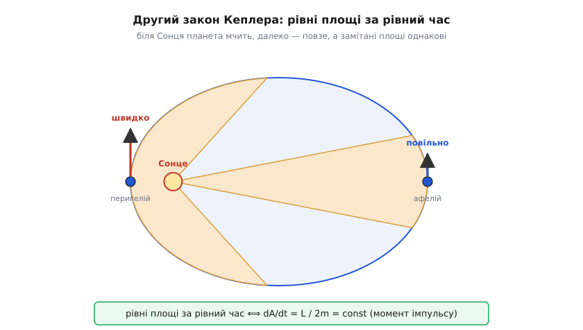
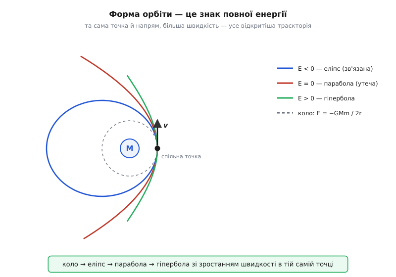

# 🧮 Орбіти з F = GMm/r²: швидкість, енергія, закони Кеплера і швидкість утечі

Уся небесна механіка тримається на одному рядку — `F = GMm/r²` — та на другому законі Ньютона `F = m·a`. Більше в неї нічого не входить: ні окремих правил для колових орбіт, ні окремих для еліптичних, ні таблиць «як швидко летить супутник». Коли Кеплер за десятиліття копіткої роботи над спостереженнями Тихо Браге виловив три емпіричні правила руху планет, він знав *що* відбувається, але не знав *чому*. Ньютон показав, що всі три — і ще колова швидкість, енергія орбіти й швидкість, потрібна, щоб відірватися від планети назавжди, — випадають із однієї-єдиної сили, оберненої до квадрата відстані. Пройдімо цей шлях чесно, від першопричини, вирощуючи кожну формулу з `GMm/r²`, а не витягаючи готову з таблиці.

Наскрізна нитка проста. Тяжіння задає силу; сила через `F = m·a` задає прискорення; прискорення на колі — це `v²/r`, і звідси падає колова швидкість. Та сама сила напрямлена завжди до центра — а центральність означає збереження моменту імпульсу, і це рівно другий закон Кеплера. Енергія `½mv² − GMm/r` зв'язує швидкість із розміром орбіти й одразу видає і третій закон, і швидкість утечі. Отже: одна сила — і весь зореліт механіки.

## Колова орбіта: одна умова рівноваги

Найпростіша орбіта — коло. Тіло на колі весь час завертає до центра, а отже має [центрострімке прискорення](book:physics/centripetal-acceleration) `a = v²/r`, спрямоване всередину. Звідки береться це прискорення? Тягнути всередину нема чому, крім тяжіння. Тож умова колової орбіти — це просто рівність: тяжіння постачає рівно ту центрострімку силу, якої вимагає рух по колу. Запишімо `F = m·a`, де ліворуч сила тяжіння, а праворуч маса на центрострімке прискорення:

```
 G·M·m         v²
───────  =  m·───
   r²           r
```

Праворуч і ліворуч стоїть маса супутника `m`, і вона скорочується без сліду. Зостається чистий зв'язок швидкості з радіусом:

```
v² = G·M / r        ⟹        v = √(G·M / r)
```

Те, що `m` зникла, — не дрібниця, а глибокий факт. **Швидкість колової орбіти не залежить від того, що ви запускаєте.** На заданій висоті цеглина, супутник зв'язку й ціла орбітальна станція мусять летіти абсолютно однаково швидко — інакше просто не втримаються на цьому колі. Тяжіння підганяє потрібну силу під кожну масу точно в тій самій пропорції, у якій ця маса опирається розгону, і масштаб тіла випадає з рівняння. Це та сама незалежність від маси, що змушує всі тіла падати з однаковим `g`, тільки побачена на орбіті.

Другий висновок: на кожній висоті колова швидкість **єдина**. Полетите повільніше — тяжіння переважить потребу в центрострімкій силі й затягне вас на нижчу, тіснішу траєкторію; полетите швидше — навпаки, вас винесе ширше. Одне коло — одна швидкість, і чим далі коло, тим ця швидкість **менша** (`v` спадає як `1/√r`): низькі супутники женуть, далекі пливуть.

Період обертання — це довжина кола, поділена на швидкість:

```
     2π·r         2π·r              ┌──────
T = ─────── = ────────────── = 2π·√ r³ / (G·M)
       v        √(G·M / r)          └──────
```

**Приклад (перша космічна швидкість).** Найнижча можлива колова орбіта Землі проходить майже над самою поверхнею, тож `r` беремо рівним радіусу Землі. Для Землі добуток `G·M` (його звуть гравітаційним параметром і знають точніше, ніж `G` і `M` окремо) дорівнює `3.986·10¹⁴ м³/с²`, а радіус `R = 6.371·10⁶ м`.

```
v = √(G·M / R) = √(3.986·10¹⁴ / 6.371·10⁶)
  = √(6.257·10⁷)  ≈  7.91·10³ м/с  ≈  7.9 км/с

T = 2π·√(R³ / G·M) = 2π·√((6.371·10⁶)³ / 3.986·10¹⁴)  ≈  5.06·10³ с  ≈  84 хв
```

Майже вісім кілометрів **за секунду** — ось ціна того, щоб «промахнутися» повз Землю й не впасти. Це число називають **першою космічною швидкістю**: менше — і ти не втримаєшся на орбіті, а лише полетиш по балістичній дузі й упадеш. І повний оберт довкола планети — усього за годину двадцять.

## Енергія орбіти: чому вона від'ємна

Швидкість — не вся правда про орбіту. Глибше її описує **енергія**, бо саме енергія скаже, зв'язане тіло чи вільне, і скільки коштує підняти супутник вище. Повна механічна енергія — це кінетична плюс потенційна:

```
E = ½·m·v²  −  G·M·m / r
```

Кінетична `½mv²` очевидна. А от знак потенційної варто зрозуміти, а не завчити. Домовляються, що на нескінченності, де тяжіння вже не дістає, потенційна енергія дорівнює нулю. Щоб піднести тіло від радіуса `r` аж на нескінченність, тяжінню доводиться долати — тобто ми виконуємо додатну роботу, вливаємо енергію. Значить, унизу, на скінченному `r`, енергії **менше**, ніж нуль угорі, — вона там **від'ємна**: `U(r) = −GMm/r`. Що ближче до планети, то глибша яма, то від'ємніша потенційна. Мінус — це не примха запису, а пряме твердження «тіло сидить у ямі, і щоб його звідти дістати, треба доплатити».

Підставмо в енергію колову умову `v² = GM/r`. Кінетична енергія колового супутника виходить рівно вдвічі меншою за глибину ями:

```
кінетична:   ½·m·v² = ½·G·M·m / r
потенційна:  −G·M·m / r

E = ½·G·M·m/r  −  G·M·m/r  =  −G·M·m / (2·r)
```

Повна енергія колової орбіти — `E = −GMm/(2r)`, і вона **від'ємна**. Це найважливіший підпис зв'язаного руху: від'ємна повна енергія означає, що тіло в пастці. «Лінія свободи» — це нуль: щоб вирватися на нескінченність, треба дотягти енергію хоча б до нуля, тобто **долити** `GMm/(2r)`. Поки `E < 0`, тіло приречене кружляти й ніколи не піде геть.

Звідси й знаменитий парадокс орбітальної механіки. Підняти супутник на вищу орбіту (більше `r`) — означає **збільшити** його енергію (зробити її менш від'ємною). Але вища колова швидкість при цьому **менша** (`v = √(GM/r)` спадає з `r`)! Як же так: додав енергію — а летиш повільніше? Річ у тім, що додана енергія вся й навіть з надлишком іде в потенційну — тіло піднялося в мілкішу частину ями, — а кінетичної там лишається менше. Щоб перейти на вищу, «лінивішу» орбіту, апарат мусить розігнатися, витративши паливо, — і опиниться там, летячи тихіше, ніж летів унизу. Космос карає інтуїцію: щоб сповільнитися по орбіті, спершу прискорся.

## Другий закон Кеплера: рівні площі — це збереження моменту імпульсу

Тепер найкрасивіше. Кеплер помітив дивну річ: відрізок від Сонця до планети замітає **рівні площі за рівний час**. Біля Сонця планета мчить і за тиждень замітає короткий товстий сектор; на далекому кінці орбіти вона повзе й за той самий тиждень замітає довгий тонкий — але площі цих двох секторів однакові. Правило точне, та Кеплер гадки не мав, звідки воно. Ньютон показав: це просто [збереження моменту імпульсу](book:physics/angular-momentum), і випливає воно з однієї-єдиної риси тяжіння — його **центральності**.

Ланцюг міркування короткий. Тяжіння завжди напрямлене вздовж прямої від планети до Сонця — це **центральна** сила. Момент сили відносно Сонця — це `τ = r × F`; але коли `F` лежить точно вздовж `r`, їхній векторний добуток — нуль. Немає плеча — немає моменту. А без зовнішнього моменту момент імпульсу `L` не міняється зовсім:

```
τ = r × F = 0   (бо F ∥ r, тяжіння тягне точно до центра)
⟹   L = const
```

Лишилося побачити, що замітана площа — це і є момент імпульсу в іншому вбранні. За малий час `dt` радіус-вектор повертається на крихітний кут `dθ` і замітає тонкий трикутник з основою `r·dθ` і висотою `r`. Його площа:

```
dA = ½ · r · (r·dθ) = ½ · r² · dθ

швидкість замітання:   dA/dt = ½ · r² · (dθ/dt) = ½ · r² · ω
```

А момент імпульсу планети якраз `L = m·r²·ω` (маса на радіус на поперечну кутову швидкість). Дві формули — про одне й те саме `r²·ω`, тож:

```
dA/dt = L / (2·m) = const
```

Ось воно. **Рівні площі за рівний час — це буквально сталість моменту імпульсу, поділеного на `2m`.** Кеплер намацав наслідок, не бачачи причини; причина — що тяжіння тягне точно до Сонця, а отже не може закрутити чи пригальмувати планету навколо Сонця.


*Другий закон Кеплера як збереження моменту імпульсу. За рівні проміжки часу радіус-вектор замітає рівні площі: біля Сонця (перигелій) планета мчить і сектор виходить коротким і товстим, на далекому кінці (афелій) вона повзе і сектор — довгий і тонкий. Оскільки `dA/dt = L/2m` стале, там, де `r` мале, поперечна швидкість велика, і навпаки — планета сама розганяється, пірнаючи до Сонця, і гальмує, віддаляючись.*

Тут ховається тонкість, варта уваги: для цього висновку **не знадобився квадрат відстані**. Рівні площі дала б будь-яка центральна сила — хоч `1/r²`, хоч `1/r³`, хоч пружинка. Другий закон Кеплера слабший і загальніший за перший і третій: він каже лише «сила тягне до центра», нічого не знаючи про те, як саме вона спадає з відстанню. Саме тому з трьох законів він найуніверсальніший.

Практичний наслідок — у поворотних точках, де швидкість суто поперечна (планета не наближається й не віддаляється миттєво), сталість `r²·ω` перетворюється на просте правило добутку:

```
r_п · v_п = r_а · v_а
```

швидкість у перигелії (найближчій точці) відноситься до швидкості в афелії (найдальшій) так само, як відстані навпаки. Підлетіла вдвічі ближче — мчить удвічі швидше.

Історично рівні площі Кеплер оприлюднив у «Новій астрономії» (*Astronomia Nova*, 1609) разом із першим законом про еліпси; щоправда, чисту «площинну» форму він відшліфував трохи згодом, у «Стислому викладі коперниканської астрономії» (*Epitome*, 1621), спершу користуючись менш точним «законом відстаней». *(Статус: усталений факт історії науки.)*

## Еліпс і рівняння vis-viva

Що орбіта — саме **еліпс** із Сонцем в одному з фокусів (перший закон Кеплера), Ньютон теж вивів із `1/r²`, але це вже важча геометрія: обернено-квадратна сила жене тіло по конічному перерізу, і зв'язані орбіти виходять еліпсами. Повний цей доказ довгий; та найкорисніше про еліпс можна дістати, не малюючи його, — з тієї самої енергії. Виявляється, повна енергія еліптичної орбіти залежить **лише від великої півосі** `a` (половини найдовшого діаметра), і більше ні від чого:

```
E = −G·M·m / (2·a)
```

Колове коло — окремий випадок `a = r`, і формула збігається з тим, що ми вже знайшли. А тепер прирівняймо цей вираз до `E = ½mv² − GMm/r` і виразимо швидкість у довільній точці орбіти:

```
½·m·v²  −  G·M·m/r  =  −G·M·m/(2·a)

v² = G·M·( 2/r  −  1/a )
```

Це **рівняння vis-viva** (лат. *vis viva* — «жива сила», старовинна назва енергії руху з доньютонівських суперечок про міру рухомості; орбітальну форму виписав ще Ньютон). Одна коротка формула дає швидкість у **будь-якій** точці **будь-якої** орбіти, знаючи тільки поточну відстань `r` і розмір орбіти `a`. Перевірмо її на межах — і побачимо, що обидва вже знайдені випадки в ній сидять:

```
коло  (r = a):     v² = G·M·(2/a − 1/a) = G·M/a        →  v = √(G·M/r)   ✓
утеча (a → ∞):     v² = G·M·(2/r − 0)   = 2·G·M/r       →  про це нижче
```

Особливо приємно, що vis-viva й другий закон Кеплера — про одне й те саме, побачене з різних боків. З `v² = GM(2/r − 1/a)` для перигелію `r_п = a(1−e)` і афелію `r_а = a(1+e)` (де `e` — витягнутість еліпса) виходить рівно те саме відношення швидкостей `v_п/v_а = (1+e)/(1−e) = r_а/r_п`, яке дало збереження моменту імпульсу. Енергія й момент імпульсу — дві незалежні сталі руху, і вони узгоджуються: та сама орбіта, порахована двома різними збереженнями, дає ту саму відповідь.

## Третій закон Кеплера: T² ∝ a³, виведений явно

Третє правило Кеплера — квадрат періоду пропорційний кубу розміру орбіти. Для колової орбіти воно випадає прямо з уже здобутого періоду: піднесімо `T = 2π√(r³/GM)` до квадрата:

```
T² = 4π² · r³ / (G·M)        ⟹        T² ∝ r³
```

Коефіцієнт `4π²/GM` **однаковий для всіх** супутників тієї самої планети — тому крихітний уламок і величезна станція на тій самій висоті обертаються рівно за однаковий час.

Для еліпса замість `r` стоїть велика піввісь `a`, і найелегантніше це вивести через щойно знайдену швидкість замітання площі. Період — це вся площа еліпса, поділена на сталу швидкість її замітання. Площа еліпса — `π·a·b` (де `b` — мала піввісь), а замітається вона зі швидкістю `dA/dt = L/2m`:

```
T = (площа еліпса) / (dA/dt) = π·a·b / (L / 2m) = 2π·m·a·b / L
```

Тепер два факти про еліпс під тяжінням `1/r²`: мала піввісь `b = a·√(1−e²)`, а момент імпульсу зв'язаний із розміром орбіти як `L/m = √(G·M·a·(1−e²))`. Підставмо й дивімося, як усе скорочується:

```
        2π·a·b        2π·a·(a·√(1−e²))          2π·a²·√(1−e²)
T = ───────────── = ──────────────────── = ──────────────────────
       L/m           √(G·M·a·(1−e²))          √(G·M)·√a·√(1−e²)

  = 2π·a² / (√(G·M)·√a) = 2π·a^{3/2} / √(G·M)

⟹   T² = 4π² · a³ / (G·M)
```

Витягнутість `e` скоротилася **дощенту**. Це разюче: період залежить лише від великої півосі, а від того, наскільки орбіта сплюснута, — ані трохи. Кругла орбіта й довгий тонкий еліпс з тією самою `a` мають **однаковий період**. Комета на витягнутій петлі й планета на майже колі, якщо їхні великі півосі рівні, повертаються синхронно.

**Приклад (геостаціонарна висота).** Знайдімо єдину висоту, де супутник обертається рівно за добу й тому «завмирає» над однією точкою екватора. Період беремо рівним зоряній добі `T = 86164 с` (справжній оберт Землі, трохи коротший за 24 год) і розкручуємо третій закон навпаки:

```
        ┌──────────────      ┌─────────────────────────────
r = ³√ G·M·T² / (4π²) = ³√ (3.986·10¹⁴)·(86164)² / (4π²)
        └──────────────      └─────────────────────────────
  = ³√(7.496·10²²)  ≈  4.216·10⁷ м  ≈  42 164 км  (від центра Землі)

висота над поверхнею:  42 164 − 6 378  ≈  35 786 км
```

Ось чому всі супутники зв'язку й телебачення висять на одному кільці за ≈ 35 800 км над екватором: третій закон лишає для добового періоду **єдину** можливу відстань. Вище — оберт задовгий, нижче — закороткий.

> 🔧 **Навіщо це.** Вся практична космонавтика — це третій закон, прочитаний у зворотний бік: не «яка орбіта в тіла?», а «яку орбіту треба, щоб дістати потрібний період?». Геостаціонарне кільце для зв'язку, орбіти GPS із періодом рівно пів доби, переліт до Марса гоманівським еліпсом, чия велика піввісь підібрана так, щоб апарат прибув якраз тоді, коли туди доїде планета, — усе це `T² = 4π²a³/GM`, розв'язане відносно `a`. А зваживши період супутника довкола будь-якої планети чи зорі, той самий закон одразу видає її масу `M` — так «важать» далекі світила, до яких не дотягтися терезами.

## Друга космічна: швидкість утечі

Останнє питання — з якою швидкістю треба стартувати, щоб піти від планети **назавжди**, не впавши назад. Мова енергії відповідає миттєво. Відірватися — означає дотягтися до нескінченності; там потенційна енергія нуль, а швидкість у найощадливішому випадку теж нуль. Отже, повна енергія втечі має бути хоча б нульовою — рівно на «лінії свободи». Порогова умова `E = 0`:

```
½·m·v²  −  G·M·m / r  =  0        ⟹        v² = 2·G·M / r

           ┌────────
v_утечі = √ 2·G·M / r
           └────────
```

Порівняймо зі швидкістю колової орбіти на тій самій відстані. Під коренем у втечі стоїть рівно вдвічі більше, тож:

```
v_утечі = √2 · v_колова  ≈  1.414 · v_колова
```

**З будь-якої колової орбіти досить додати всього 41% швидкості — і ти вільний.** Не вдвічі, не вдесятеро: якщо вже кружляєш, до втечі рукою подати.

**Приклад (друга космічна швидкість).** Від поверхні Землі колова швидкість — знайдені щойно 7.9 км/с, тож швидкість утечі:

```
v_утечі = √(2·G·M / R) = √2 · 7.91  ≈  11.2 км/с
```

Це **друга космічна швидкість** — 11.2 км/с, з якими зонди йдуть до інших планет і за межі Сонячної системи. Зверніть увагу на дві риси цієї формули. По-перше, у ній немає маси тіла, що тікає, — енергія скалярна, `m` скоротилася, і пір'їнка, і корабель мусять розігнатися однаково. По-друге, немає й напряму: байдуже, стріляти вгору, вбік чи навскіс (аби не в планету) — важлива тільки величина швидкості, бо енергія не знає напряму.

А що буде, якщо перебрати? Тип орбіти цілком визначає знак повної енергії, і швидкість утечі — це якраз межа між зв'язаним і вільним:

```
E < 0   →  еліпс   (зв'язана орбіта, тіло повертається)
E = 0   →  парабола (рівно втеча: доходить до нескінченності, там завмираючи)
E > 0   →  гіпербола (втеча з запасом: на нескінченності ще й летить)
```


*Форма орбіти — це знак повної енергії. Від'ємна `E` замикає тіло в еліпс (колове коло — окремий, найглибший випадок, `E = −GMm/2r`). Рівно на порозі `E = 0` еліпс розтягується в параболу — це і є швидкість утечі `√(2GM/r)`: тіло ледь-ледь доходить до нескінченності. Ще більша швидкість (`E > 0`) розкриває траєкторію в гіперболу — тіло тікає й на нескінченності зберігає рух.*

## Що з цього тримати в голові

Один рядок `F = GMm/r²`, покладений у `F = m·a`, розгорнувся у всю орбітальну механіку:

```
колова швидкість:   v = √(G·M/r)                (m скорочується)
енергія орбіти:     E = −G·M·m/(2·a)            (E < 0 ⟹ зв'язана)
vis-viva:           v² = G·M·(2/r − 1/a)        (швидкість будь-де)
другий закон:       dA/dt = L/2m = const        (рівні площі)
третій закон:       T² = 4π²·a³/(G·M)           (e скоротилася)
швидкість утечі:    v = √(2·G·M/r) = √2·v_кол   (поріг E = 0)
```

Дві думки варто винести понад формули. Перша: другий закон Кеплера — про **симетрію**, а не про силу. Рівні площі дає сама центральність тяжіння (збереження моменту імпульсу), і квадрат відстані тут ні до чого; тому цей закон найзагальніший. Перший і третій, навпаки, чутливі саме до `1/r²` — інша сила зіпсувала б і форму еліпса, і `T² ∝ a³`. Друга: усе, що здавалося окремими небесними правилами — швидкість супутника, енергія, три закони Кеплера, поріг утечі, — це одна обернено-квадратна сила, побачена під різними кутами. Кеплер виміряв три несумісні на вигляд закономірності; Ньютон показав, що це три обличчя однієї сили. Саме тоді астрономія перестала бути каталогом правил і стала однією математикою — тією самою, що керує і каменем у руці, і кометою на краю Сонячної системи.
