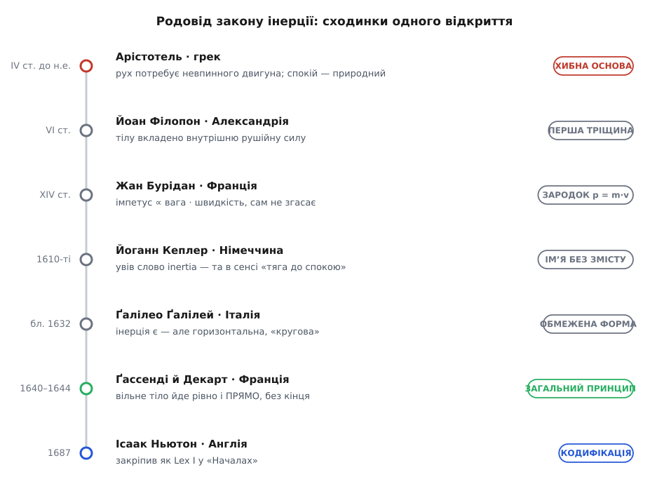
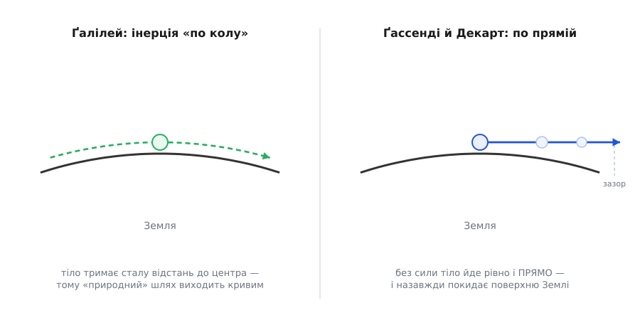

# 📜 Родовід закону інерції: відкриття, у якого немає одного автора

> Закон інерції ми звемо «першим законом Ньютона». Але Ньютон записав його **останнім**, а не першим. Дорога до тієї короткої фрази тривала понад тисячу років і пройшла через руки грека з Александрії, перса, француза-схоласта, німецького астронома, італійця й знову двох французів — і аж потім лягла на сторінку англійця. Це історія про те, як «очевидна» істина виявилася **колективним** відкриттям, і чому варто розрізняти, хто ідею **подумав**, хто **обмежено сформулював**, хто дав **загальний принцип**, а хто його лише **закріпив**.

Чому на таку просту думку — «без сили рух не міняється» — людству знадобилося понад двадцять століть? Бо щоденний досвід кричить протилежне. Усе, що ми штовхаємо, спиняється, щойно ми відпустимо; віз стає, кінь мусить тягнути без упину. Тертя ховає правду так добре, що аж до появи гладеньких поверхонь і думкою виведених ідеальних дослідів справжня вдача руху лишалася невидимою. Тож кожна сходинка до закону інерції давалася боєм — і будував ці сходинки не один геній, а довгий ланцюг людей у різних краях і століттях.


*Одне відкриття — і жодного одноосібного автора. Червона сходинка — хибна основа, з якої всі мусили вибиратися; сірі — часткові прориви; зелена — перший загальний прямолінійний принцип; синя — його кодифікація. Понад тисяча років і шість країн між першою тріщиною й останнім записом.*

## Арістотель: дві тисячі років правдоподібної помилки

Почати треба з того, кого всі наступні спростовували. **Арістотель** (*Aristotélēs*, 384–322 до н.е.), грек зі Стагіри, збудував фізику, у якій рух вимагає **невпинного двигуна**. У кожної речі є природне місце: камінь прагне донизу, вогонь — угору; дійшовши свого місця, тіло **заспокоюється**, і спокій — це його природний стан. Будь-який інший рух Арістотель звав «насильницьким» і вважав, що триває він, лише поки його щось жене. Кинутий камінь летить далі руки, бо — за Арістотелем — його підштовхує повітря, що змикається позаду (це припущення греки звали *антиперистасис*).

Помилка? Так — і то в самому корені. Але не дурість. Приберіть із досвіду ідеальні поверхні, і Арістотелева картина описує світ **майже бездоганно**: усе справді спиняється саме собою. Щоб побачити, що зупинку **спричиняє** тертя, а не «вичерпання руху», треба було спершу уявити рух **без** тертя — а на це пішли століття. Те, що ця доктрина панувала так довго, — не так сором людства, як міра того, наскільки добре тертя маскує істину. *(Що саме викладав Арістотель — усталено за його «Фізикою»; хибність висновку теж не спірна.)*

## Йоан Філопон: перша тріщина у стіні

Першу серйозну тріщину дав **Йоан Філопон** (гр. *Iōánnēs Philóponos* — «Йоан Працьовитий», бл. 490–570), християнський філософ і граматик з **Александрії**, тодішнього осередку грецької вченості. У VI столітті він розібрав Арістотелеве «повітря штовхає стрілу» й показав його безглуздість: якби рух тримало повітря позаду, то досить було б **махнути** біля хвоста стріли, щоб її розігнати, — а так не буває. І ще: у порожнечі, де повітря нема зовсім, за Арістотелем рух був би неможливий — але Філопон стверджував протилежне, що тіло полетіло б і в пустці.

Замість повітря Філопон запропонував **внутрішню рушійну силу** (гр. *enérgeia* — «дієвість»), яку кидач **укладає в саме тіло**; вона й несе стрілу далі руки, поступово вичерпуючись. Це ще не інерція: сила «згасає» сама, тобто рух усе одно приречений спинитися без підживлення. Але вирішальний крок зроблено — причину руху **перенесено з довкілля всередину тіла**. Ідеї Філопона надовго лишилися на маргінесі християнського й арабського світу, та не згинули — їх підхопили й розвинули далі. *(Усталено: збережені коментарі Філопона до Арістотеля не лишають сумнівів у його авторстві цієї критики.)*

## Імпетус Бурідана: рух, що не хоче згасати

Найбільший доньютонівський стрибок стався у XIV столітті в Парижі. **Жан Бурідан** (*Jean Buridan*, бл. 1300, Бетюн — бл. 1360), французький філософ і логік, дав Філопоновій «вкладеній силі» ім'я — **імпетус** (*impetus* — «натиск, порив») — і, головне, **число**. Імпетус тіла, за Буріданом, тим більший, чим більша **кількість матерії** в тілі й чим більша його **швидкість**:

```
імпетус ∝ (кількість матерії) · швидкість
```

Придивіться до цієї пропорції — і ви впізнаєте [кількість руху](book:physics/momentum), яку через триста років запишуть як **p = m·v**. Бурідан, звісно, не мав ні поняття маси в сучасному сенсі, ні векторів; але зв'язок «більше речовини й більша швидкість — важче спинити» він схопив точно.

І тут — переломне твердження. Бурідан відкинув думку, ніби імпетус **згасає сам собою**. Ні: імпетус **вічний**, і зменшують його лише зовнішні перешкоди — опір повітря й тяжіння, що тягне тіло донизу. У пустці, де ні того, ні того нема, рух тривав би **без кінця**. Цим Бурідан навіть пояснив вічний біг планет: Бог одного разу надав небесним сферам імпетусу, а далі ніщо їх не гальмує, тож вони кружляють самі. У цьому міркуванні вже майже цілком лежить перший закон — «рух триває, поки його не спинить зовнішня причина». Бракує тільки одного: усвідомити, що рух — це не **річ усередині тіла**, а просто **його стан**.

Варто назвати й того, на кого Бурідан спирався. Ідею стійкого, несамозгасного «нахилу» до руху (араб. *майл*) розвинув ще на межі X–XI століть **Ібн Сіна** (*Ibn Sīnā*, лат. Авіценна, бл. 980–1037), перський учений із околиць Бухари. Європейська фізика тут — спадкоємиця, а не єдина породителька: думка йшла від греків через перський і арабський світ назад до латинської Європи. *(Усталено: і кількісний вид імпетусу в Бурідана, і його борг Ібн Сіні задокументовані в текстах.)*

> 🔧 **Навіщо це.** Буріданів імпетус — не просто цікавинка з історії: це той самий **добуток «скільки речовини» на «як швидко»**, який сьогодні працює в кожному розрахунку зіткнень, віддачі й реактивної тяги. Але зверніть увагу на тонку підміну, яку зробила пізніша фізика. Для Бурідана рух — це **щось, що тіло в собі несе** (як вантаж). Сучасний погляд перевертає це: рух не «сидить усередині», його не треба «мати» — тіло просто **перебуває в русі**, доки хтось не втрутиться. Та сама формула p = m·v лишилася; змінилося те, **чим ми її вважаємо** — не запасом «сили руху», а мірою стану. Розрізняти ці два прочитання — значить розуміти, у чому Бурідан ще не був Ньютоном.

## Кеплер дає слово — але не той зміст

Далі стається мовний парадокс. Саме слово **inertia**, яким ми нині звемо здатність тіла **берегти** рух, увів у фізику **Йоганн Кеплер** (*Johannes Kepler*, 1571–1630), німецький астроном, — і вклав у нього сенс мало не **протилежний** нинішньому. Кеплерова *inertia* (від лат. *iners* — «млявий, лінивий») означала **опір руху**, вроджену **схильність тіла до спокою**: прибери силу, що штовхає планету, — і вона, за Кеплером, **стане**. Для нього рух треба було весь час підтримувати (цю роль грала якась сила від Сонця), а «інерція» була саме тим, що цьому руху пручається.

Іронія в тім, що слово ми взяли в Кеплера, а зміст у нього — **арістотелівський**: спокій усе ще природніший за рух. Мине небагато часу, і те саме слово наповнять зворотним змістом — не «тяга до спокою», а «тяга зберігати будь-який рух, зокрема й спокій як окремий випадок». Назва пережила свою первісну ідею. *(Усталено: авторство терміна за Кеплером і його первісне значення «опору рухові» добре задокументовані.)*

## Ґалілей: інерція, що ходить по колу

Ближче за всіх доньютонівців до істини підійшов **Ґалілео Ґалілей** (*Galileo Galilei*, 1564, Піза — 1642, поблизу Флоренції), італієць. Думкою про кульку на дедалі пологіших схилах він показав те, чого не бачив Арістотель: на ідеально гладкій горизонтальній поверхні тіло не має причини спинятися й котитиметься **без кінця**. Це вже справжня інерція — рух, що триває сам.

І все ж Ґалілеєва інерція мала прихований ґандж. Його «горизонтальне» означало **не пряму лінію, а поверхню на сталій висоті над центром Землі** — тобто велике **коло** довкола планети. У Ґалілея вільне тіло котилося б **уздовж кривизни Землі**, лишаючись на однаковій відстані від її центра, а не відлітало б по прямій у простір. Мало того — він, здається, поширював цю «горизонтальну» інерцію й на кинуті тіла. Тож стійкість руху Ґалілей ухопив, а **прямолінійність — ні**: його інерція була **обмежена, земна й кругова**.


*Ось де ховалася різниця. У Ґалілея вільне тіло тримає сталу відстань до центра Землі — і тому «природний» шлях виходить кривим, по колу. Наступний крок був у тім, щоб побачити: без сили тіло йде **рівно і прямо** — а отже, віддаляється від поверхні планети назавжди.*

Ця межа не применшує Ґалілея — вона показує, **як важко** було відділити «рух триває» від «рух іде по прямій». Дві тисячі років думка не могла зрушити з місця; коли ж зрушила, то не одним стрибком, а майже намацуючи. *(Прочитання Ґалілеєвої інерції як переважно «колової» — панівне в істориків науки; окремі його уривки тлумачать по-різному, тож тут доречніше «усталено з нюансами», ніж категоричне «завжди й скрізь коло».)*

## Декарт і Ґассенді: нарешті — пряма лінія

Останній, вирішальний штрих — прямолінійність — додали **два французи**, майже одночасно й незалежно один від одного, у 1640-х.

**П'єр Ґассенді** (*Pierre Gassendi*, 1592–1655) зробив те, що Ґалілей лише описав, але, за власним зізнанням, **сам не робив**. У жовтні 1640 року він вийшов на веслувальнику з Марселя й на очах у губернатора Провансу скидав кулю з верхівки щогли **на ходу**: куля щоразу падала точно до підніжжя щогли — байдуже, стояло судно чи мчало. Це був чистий доказ, що тіло **зберігає горизонтальний рух корабля** незалежно від того, що бачить спостерігач ([принцип відносності Ґалілея](book:physics/galilean-relativity) саме про це). А в трактаті «Про рух, переданий рухомим тілом» (*De motu impresso a motore translato*, 1641) Ґассенді дав, схоже, **перше друковане формулювання** закону інерції: тіло, пущене в порожнечі, вічно рухатиметься **по прямій зі сталою швидкістю**.

Другий — **Рене Декарт** (*René Descartes*, 1596–1650). Він сформулював принцип ще раніше, у трактаті «Світ» (*Le Monde*, написаний бл. 1633), але **притримав** його друк, злякавшись звістки про засуд Ґалілея. Відкрито закон вийшов у його «Началах філософії» (*Principia Philosophiae*, 1644): кожна річ **зберігає свій стан**, а всякий рух **сам собою прямолінійний**. Саме Декарт чітко **виправив коло Ґалілея на пряму**. (На цю думку його наштовхнув ще замолоду голландець **Ісаак Бекман** (*Isaac Beeckman*, 1588–1637), що першим заговорив про збереження прямолінійного руху, — ще одне ім'я в ланцюгу, ще одна країна.)

Ось тут, у Ґассенді й Декарта, **загальний принцип** нарешті стоїть у повний зріст: тіло без зовнішньої сили **або спочиває, або рівномірно рухається по прямій**. Не по колу, не «на землі», не «поки не вичерпається імпетус» — а завжди, скрізь і прямо. *(Усталено: і пріоритет друку Ґассенді 1641 року, і прямолінійне формулювання Декарта 1644-го зафіксовані в самих текстах.)*

## Ньютон: Lex I — печатка, а не відкриття

Аж тепер на сцену виходить **Ісаак Ньютон** (*Isaac Newton*, 1642–1727), англієць. У «Математичних началах натуральної філософії» (*Principia*, 1687) він ставить закон інерції **першим** — *Lex I*:

```
Кожне тіло зостається у стані спокою або рівномірного
прямолінійного руху, аж доки прикладені сили не змусять
його змінити цей стан.
```

Придивіться — це майже дослівно Декартове формулювання. Ньютон майже напевно **вперше зустрів принцип саме в Декартових «Началах»**, і особливої дяки картезіанцям не висловлював (стосунки були радше суперницькі). Тож у вузькому сенсі «першовідкривач» тут — не Ньютон.

Але не варто й недооцінювати те, що він зробив. Заслуга Ньютона — не в **вигадуванні речення**, а в трьох інших речах. По-перше, він дав закону **остаточну, точну форму**. По-друге — і головне — він поставив його **першою аксіомою цілісної дедуктивної системи**, з якої далі виводиться вся механіка: другий закон, третій, тяжіння, рух планет. По-третє, саме перший закон у Ньютона мовчки окреслює **арену**, на якій усе це справджується, — ті особливі системи відліку ([інерціальні](book:physics/inertial-frame)), де вільне тіло справді йде рівно й прямо. Кодифікація — це не переписування чужого; це перетворення розрізнених здогадів на **фундамент теорії**. Просто це — інша заслуга, ніж відкриття. *(Усталено: і борг Ньютона перед Декартом, і роль Lex I як аксіоми системи — предмет згоди істориків науки.)*

## Що кому належить

Складімо сходинки в один ряд — і стане видно, наскільки нечесно звати це «законом однієї людини»:

- **сама ідея, що рух може тривати без двигуна** — тріщину пробив Філопон (VI ст.), а по-справжньому розвинув Бурідан (XIV ст.) своїм несамозгасним імпетусом;
- **кількісний зародок** (рух ∝ вага · швидкість, майбутнє p = m·v) — Бурідан, зі спадком від Ібн Сіни;
- **саме слово inertia** — Кеплер (1610-ті), щоправда в протилежному, «спокійному» сенсі;
- **інерція як реальний, але обмежений (кругово-земний) факт** — Ґалілей (бл. 1632);
- **загальний прямолінійний принцип** — Ґассенді (друк 1641) і Декарт (1644), із поштовхом від Бекмана;
- **кодифікація як Lex I цілісної теорії** — Ньютон (1687).

Жодної сходинки не збудував самотужки жоден з них. І — що варто сказати прямо — це відкриття **не належить одній нації**. У ланцюгу грек із Александрії, перс із-під Бухари, голландець, троє французів, німець, італієць і англієць; понад **тисяча років** від Філопонової тріщини до Ньютонового запису. Звичка стискати все це в «закон Ньютона» — зручна, але вона **ховає сходи**, якими ідея піднімалася, і людей, що клали кожну сходинку.

І, може, головний висновок цієї історії — про самі відкриття. Те, що сьогодні здається нам **очевидним** — «звісно, без сили рух не міняється», — стало очевидним **лише тому**, що впродовж десятка століть багато людей у різних краях по крихті робили його очевидним. Простота законів природи — не подарунок, який хтось знайшов готовим. Це підсумок довгої, колективної, часто болісної праці — і саме тому за короткою фразою *Lex I* варто чути не одне ім'я, а цілий хор.
