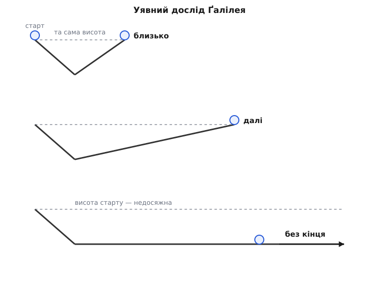
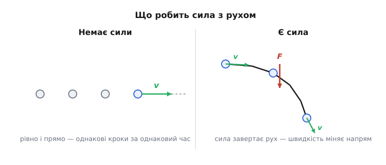
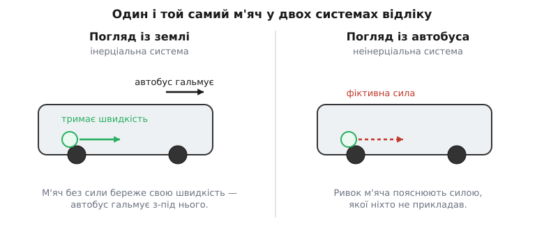

# Перший закон Ньютона: рух триває сам, поки його не змінять

<preknowlist>
- [Швидкість](book:physics/velocity) — як швидко й куди рухається тіло; величина векторна, має і розмір, і напрям.
- [Сила](book:physics/force) — векторна дія одного тіла на інше, штовхання чи тяжіння, здатна змінити рух; міряється в ньютонах.
</preknowlist>

Штовхніть санчата по снігу й відпустіть — вони проїдуть кілька метрів і стануть. Досвід ніби кричить: щоб щось рухалося, його треба **весь час** штовхати; прибрали руку — рух гасне сам собою. Дві тисячі років це вважали за очевидну істину. Арістотель поклав її в основу своєї фізики: у кожного тіла є природне місце, куди воно прагне (камінь — донизу, дим — угору), а всякий інший рух — «насильницький» і триває, лише поки його жене якийсь двигун. Немає двигуна — немає руху.

Висновок здається залізним. І все ж він хибний — і то не десь у дрібниці, а в самому корені.

Придивімося, **чому** санчата стають. Не тому, що в них «вичерпався рух», а тому, що об сніг тре сила — [тертя](book:physics/friction), спрямоване проти руху. Зробіть поверхню слизькішою — санчата поїдуть далі. По втоптаній лижні — ще далі. По чистому льоду ковзан біжить так довго, що в Арістотеля вже важко повірити. А тепер уявіть лід без жодного тертя: тіло, якому ніщо не опирається, не спиниться **ніколи**. Зупинку не дає природа — її **спричиняє** зовнішня сила. Приберіть цю силу — і рух триватиме вічно.

Оце й є переворот. Рух не потребує причини, щоб **тривати**. Причина потрібна, лише щоб його **змінити**. Ту впертість, з якою тіло тримається свого руху, назвали **інерцією** (лат. *inertia* — «млявість, бездіяльність», від *iners* — «нездатний, лінивий»). Ім'я трохи несправедливе: за ним стоїть не лінь, а неабияка стійкість.

## Уявний дослід Ґалілея

Як дійти до цієї думки, коли ідеального льоду ніде взяти? Ґалілео Ґалілей зробив це в голові — і його міркування досі найкраще пояснює суть.

Візьмімо гладенький жолоб і пустімо кульку з гірки. Вона скотиться вниз, а тоді викотиться на другу гірку — і підніметься майже на ту саму висоту, з якої почала. Майже — бо трохи руху з'їдає тертя; що гладший жолоб, то ближча друга висота до першої. Уявімо жолоб зовсім без тертя: кулька щоразу підніматиметься **рівно** на висоту старту, скільки б разів не перекочувалася туди-сюди.

Тепер головний хід. Почнімо **зменшувати нахил** другої гірки. Мета кульки незмінна — дістатися тієї самої висоти. Та на пологішому схилі, щоб піднятися на ту саму висоту, треба проїхати **довший** шлях. Що положіший другий схил, то далі котиться кулька, доганяючи свою висоту.

А тепер приберімо нахил зовсім — хай друга «гірка» стане рівною площиною. Висоти, якої кулька шукає, на ній немає ніде. То скільки ж вона котитиметься? Відповідь одна: **без кінця**. Ніщо не змушує її спинитись, і вона котиться рівно та прямо, аж доки не втрутиться щось іззовні.


*Що пологіший другий схил, то далі котиться кулька, доганяючи ту саму висоту. На рівній площині висоти немає ніде — і кульку вже ніщо не спиняє.*

Оце й є інерція, виведена чистою думкою. Не треба ідеального льоду — досить простежити, куди веде послідовне міркування.

## Що саме стверджує закон

Ісаак Ньютон зібрав цю здогадку у стислий закон і поставив його першим у своїх «Началах» (лат. *Principia*, 1687):

> Кожне тіло перебуває у стані спокою або рівномірного прямолінійного руху, аж доки прикладені до нього сили не змусять його змінити цей стан.

Розберімо цю фразу по слову, бо в кожному — думка.

**«Спокою або рівномірного прямолінійного руху».** На перший погляд це два різні стани. Насправді — один. Спокій — це рух зі швидкістю нуль. Закон ставить їх поряд саме тому, що для природи між ними немає різниці: і те, і те означає **незмінну швидкість**. Тіло, яке стоїть, і тіло, яке рівно пливе, роблять одне й те саме — тримають свою швидкість сталою. Тому закон переказується одним подихом: **без зовнішньої сили швидкість тіла не міняється**.

**«Прямолінійного».** Це слово легко проминути, а воно несе половину змісту. Швидкість — [величина векторна](book:physics/velocity): у неї є не лише розмір, а й напрям. «Не міняється» стосується **обох**. Тіло без сили не тільки не пришвидшується й не гальмує — воно ще й **не завертає**. Природний шлях вільного тіла — пряма лінія зі сталою швидкістю. Тож коли планета кружляє орбітою, коли авто входить у поворот, коли камінь на мотузці ходить по колу — усюди діє сила, бо напрям руху міняється, а самотужки він змінитися не може.

**«Прикладені сили».** Ідеться про **зовнішню рівнодійну** — суму всіх сил, прикладених іззовні. Коли сил кілька, але вони гасять одна одну, рівнодійна нульова, і для тіла це те саме, що жодної сили: воно береже свій рух. Книжка на столі не рушить не тому, що на неї нічого не діє, а тому, що вага вниз і опора столу вгору **зрівноважені**.


*Без зовнішньої сили тіло йде рівно і прямо, однаковими кроками за однаковий час (ліворуч). Досить прикласти силу — і рух міняється: швидкість завертає вбік (праворуч). Пряма стала швидкість — це і є стан «сили немає».*

> 🔧 **Навіщо це.** Правило дає інженерові простий, але потужний тест. Бачите тіло, що рухається рівно й прямо, — літак у горизонтальному крейсерському польоті, вантаж на конвеєрі сталої швидкості, — і одразу знаєте: усі сили на ньому зрівноважені до нуля. Тяга дорівнює опору, підіймальна сила — вазі. І навпаки: помітили, що траєкторія викривилася чи швидкість змінилась, — шукайте незрівноважену силу, вона неодмінно є. Не треба нічого рахувати, щоб зробити перший висновок про сили: досить подивитися на характер руху.

## Чому це окремий закон, а не випадок другого

Тут виникає природний сумнів. [Другий закон Ньютона](book:physics/newtons-second-law) каже: сила дорівнює масі на прискорення, F = m·a. Підставте нуль сили — дістанете нуль прискорення, тобто сталу швидкість. Це ж і є перший закон! Навіщо тоді Ньютон виніс його окремо — хіба це не проста згадка про випадок F = 0?

Різниця тонша й глибша, ніж здається. Перший закон робить те, чого другий зробити не може: він **стверджує, що взагалі існує система відліку, у якій усе це правда**.

Ось у чому річ. Уся механіка описує рух відносно якоїсь [системи відліку](book:physics/inertial-frame) — стін кімнати, поверхні Землі, вагона. Але не в кожній системі тіло без сили рухається рівно. Сядьте в автобус, поставте на підлогу м'яч. Автобус різко гальмує — і м'яч котиться вперед **сам**, хоч ніхто його не штовхнув. У системі відліку автобуса тіло прискорилося без жодної сили. Другий закон, F = m·a, тут явно бреше: прискорення є, а сили немає.

То де ж правда? Перший закон і дає відповідь. Він вирізняє з-поміж усіх систем ті особливі, у яких вільне тіло справді рухається рівно та прямо, — **інерціальні**. І тільки в них має силу другий закон. Виходить, перший закон не окремий випадок другого, а його **фундамент**: він окреслює арену, на якій F = m·a взагалі щось означає. Без нього «сила» була б порожнім словом — бо в будь-якій трясучій, розкрученій системі відліку до якого завгодно прискорення можна дописати «силу», якої ніхто не прикладав.

## Де закон «ламається» — і чому насправді ні

Повернімося до м'яча в автобусі. Він покотився вперед — невже інерція зрадила? Навпаки: це вона в чистому вигляді. Поки автобус їхав, м'яч їхав разом із ним. Коли автобус загальмував, м'яч **не мав причини** гальмувати — і за першим законом продовжив рух уперед зі своєю швидкістю. Це не м'яч рвонув уперед, це підлога вислизнула назад з-під нього.


*Одна сцена з двох поглядів. Із землі (ліворуч) усе просто: гальма спиняють автобус, а м'яч без жодної сили береже свою швидкість — і тому зсувається вперед. Із автобуса (праворуч) той самий м'яч наче штовхнула сила, якої ніхто не прикладав, — фіктивна сила інерції.*

З двох поглядів на одну сцену перший закон справджується лише з одного — з боку нерухомого спостерігача на землі. Для нього все чисто: автобус сповільнюється (на нього діють гальма), а м'яч береже свою швидкість (на нього нічого не діє). А от у системі самого автобуса, який прискорюється, доводиться домальовувати «силу», що ніби кинула м'яч уперед. Такі сили звуть **фіктивними**, або силами інерції: їх ніхто не прикладає, вони лише латка, якою рятують рівняння в неінерціальній системі. Та сама природа й у [відцентрової сили](book:physics/centrifugal-force), що притискає вас до дверцят на повороті: ніхто вас назовні не тягне — то ваше тіло силкується їхати прямо, а машина завертає під вами.

Отже, закон не порушується — просто він каже правду лише в інерціальних системах. А неінерціальна система якраз і викриває себе тим, що в ній перший закон перестає справджуватися: тіла зрушують без видимих причин. Це не вада закону, а його спосіб показати, що ви обрали «криву» точку відліку.

## Чому рівномірного руху не відчути

З першого закону випливає річ, яку легко перевірити, та важко відчути. Якщо спокій і рівномірний рух — той самий стан, то й **розрізнити** їх зсередини не можна.

Летите в літаку на десяти кілометрах, рівно й без бовтанки. Наливаєте воду — вона ллється прямісінько в склянку, як удома на кухні. Підкиньте монету — вона впаде вам у долоню, а не полетить у хвіст, дарма що літак женеться крізь повітря під дев'ятсот кілометрів на годину. Усередині немає жодного досліду, який виказав би цю швидкість: усе відбувається так, ніби ви стоїте. Відчути вдається лише **зміни** — коли літак хитне, пришвидшиться чи піде на розворот. Ця непомітність рівномірного руху — не випадковий збіг, а прямий наслідок першого закону, і саме вона лежить в основі окремого [принципу відносності Ґалілея](book:physics/galilean-relativity).

## Інерція та маса

Тіла тримаються свого руху **по-різному**. Штовхнути з місця порожній візок легко, навантажений цеглою — важко; і спинити важкий куди важче, ніж легкий. Стійкість до зміни руху в усіх однакова за суттю, але різна за мірою. Цю міру інертності звуть **[масою](book:physics/mass)**: що більша маса, то дужче тіло опирається будь-якій зміні своєї швидкості. Перший закон каже, що без сили рух не міняється **зовсім**; наскільки важко його змінити, коли сила таки є, — питання маси, і на нього відповідає вже другий закон.

**Задача.** Космічний апарат «Вояджер-1» давно вимкнув двигуни й летить у порожнечі далекого космосу зі швидкістю близько 17 км/с. Тяги немає, тертя немає, найближчі тіла — за мільярди кілометрів. Скільки він пролетить за добу?

```
v = 17 км/с,  t = 1 доба = 86400 с

Шлях за добу:
s = v · t = 17 · 86400 ≈ 1.47·10⁶ км

За рік (≈ 3.15·10⁷ с):
s = 17 · 3.15·10⁷ ≈ 5.4·10⁸ км
```

Півтора мільйона кілометрів щодоби — і жодного ньютона тяги, щоб їх пройти. Апарат не «витрачає рух» на політ; він просто **не має причини** спинятись. Двигуни зробили своє одного разу, розігнавши його, і замовкли назавжди — далі все несе інерція. (Крихта тяжіння Сонця ще ледь-ледь пригальмовує й скривлює політ, тож рух не аж такий ідеально рівний; але на масштабі доби це майже непомітно.)

> 🔧 **Навіщо це.** Той самий закон рятує життя в автомобілі. У зіткненні машина спиняється за соту частку секунди, а тіло пасажира за першим законом **летить далі** з тією ж швидкістю, з якою щойно їхало. Пасковий ремінь і подушка — це те зовнішнє, що прикладає до тіла силу й гасить його рух разом із машиною; без них тіло зустрілося б із кермом чи склом, бо саме собою спинятися не вміє. Інерцію не можна «вимкнути» — з нею можна лише впоратися, вчасно давши тілу правильну силу.

Закінчимо тим, з чого почали. Санчата стають на снігу не тому, що рух — гість, який мусить піти. Вони стають, бо сніг їх спиняє. Приберіть усі зовнішні сили — і рух виявить свою справжню вдачу: він не гасне, не тане, не потребує підживлення. Він просто триває, рівно й прямо, поки Всесвіт не втрутиться й не змінить його. Уся динаміка далі — це вже розповідь про те, як саме він втручається.

Повний родовід цієї ідеї — від Арістотеля через середньовічну теорію імпетусу до Ґалілея, Декарта й Ньютона — [коротка історія закону інерції](book:physics/newtons-first-law/hist-law-of-inertia.md).
