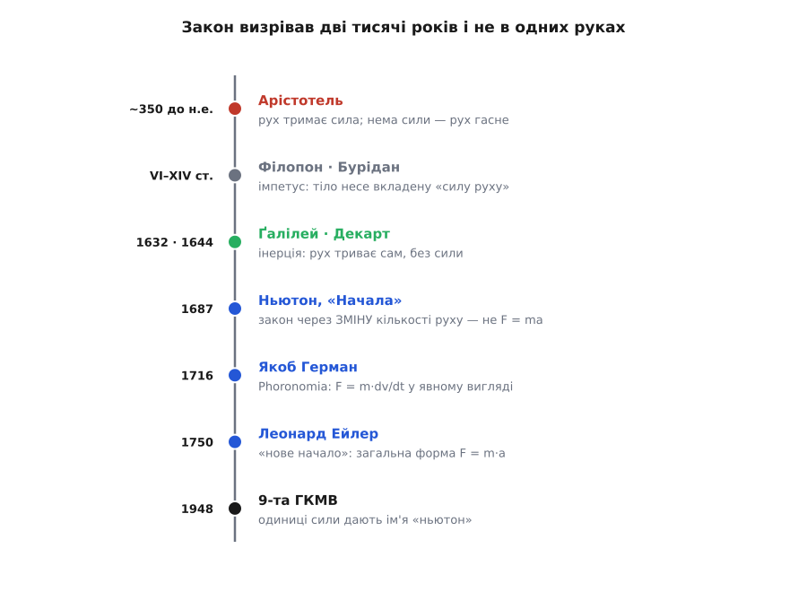
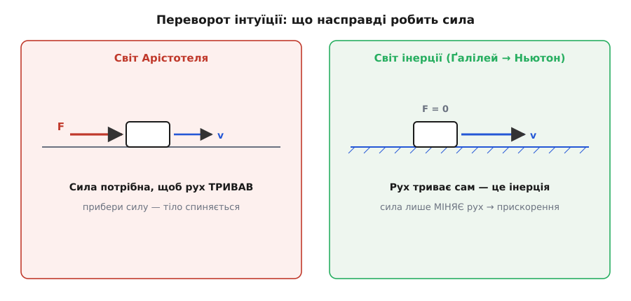

# 📜 Як народжувалося F = ma: дві тисячі років на одне рівняння

Рівняння F = m·a виглядає так, ніби хтось одного ранку його побачив і записав. Насправді за трьома літерами — дорога завдовжки у дві тисячі років, кільканадцять умів у різних краях і одна вперта хиба, яку довелося ламати. Найдивніше ось що: сам Ньютон ніколи не писав F = m·a. У його «Началах» цієї рівності немає — ні в першому виданні, ні в другому, ні в третьому. Компактну форму, яку сьогодні знає кожен школяр, викристалізували вже по його смерті. Варто пройти цю дорогу крок за кроком — бо кожен поворот на ній повчальний.


*Ідея не спалахнула в одній голові: спершу хибна інтуїція, тоді повільні тріщини в ній, далі злам — і аж потім компактна форма та ім'я одиниці. Дати позначено за станом джерел; там, де атрибуція спірна, це сказано в тексті.*

## Пастка Арістотеля: щоб рух тривав, тягни без упину

Почнімо з того, у що вірило людство майже до Ньютона. Арістотель (гр. Aristotélēs, 384–322 до н.е.) поділяв рух на два роди. Природний — коли камінь падає, а полум'я тягнеться вгору: кожна річ шукає своє «природне місце». І насильницький (гр. bíaios) — коли віз їде, стріла летить, човен пливе; такий рух іде проти природи речі й тому потребує рушія, і то рушія **в дотику**. Забери руку від воза — і він стане. Швидкість, за Арістотелем, тим більша, чим дужча сила й чим рідше середовище. Немає сили — немає й руху.

Тут одразу видно тріщину, і Арістотель її бачив. Стріла злітає з тятиви — і летить далі, хоч тятива вже не торкається. Що ж її штовхає? Відповідь Арістотеля звуть *антиперистазою* (гр. antiperístasis — «взаємозаступлення»): повітря, розсунуте стрілою спереду, оббігає її й підпихає ззаду, не даючи утворитися порожнечі. Пояснення кульгаве, і сам Арістотель у «Фізиці» вагався, пропонуючи натомість, що рушій передає рухову силу шарам повітря, а ті — далі. Те, що цю латку доводилося вигадувати, вже було знаком: із теорією щось негаразд. *(Це усталене прочитання Арістотелевої «Фізики».)*

І все ж хиба протрималася майже дві тисячі років. Чому так уперто? Бо щоденний досвід підтверджує її на кожному кроці. Світ довкола повний тертя, тільки тертя невидиме — і тому «перестав штовхати → стало» здається залізним законом природи, а не наслідком прихованої сили опору. Щоб побачити правду, треба було подумки прибрати тертя, а на це спромоглися дуже нескоро.

## Перші тріщини: імпетус

Першим по-справжньому заперечив Арістотеля Іоан Філопон (гр. Iōánnēs Philóponos, бл. 490–570) — грекомовний християнський філософ і граматик з Александрії, тодішньої візантійської. У коментарях до «Фізики» він відкинув антиперистазу: не повітря жене тіло, а сам рушій **вкладає** в тіло безтілесну «рухову силу», і та несе його далі; повітря ж рухові тільки заважає. Це був сміливий розрив: причина руху переселилася з середовища всередину самого тіла. *(Документовано в його збережених коментарях.)*

Думку підхопили й розвинули на середньовічному Сході й Заході. Перський учений Ібн Сіна (араб. Ibn Sīnā, латиною Авіценна, 980–1037) уточнив, що вкладена сила сама не згасала б, якби не опір. А в XIV столітті паризький магістр Жан Бурідан (фр. Jean Buridan, бл. 1301–1360) дав їй ім'я — *імпетус* (лат. impetus — «натиск, порив») — і, головне, зробив кількісним. Імпетус, казав Бурідан, тим більший, чим більше в тілі матерії й чим швидше воно йде. Зупиніться на цьому: **кількість матерії, помножена на швидкість** — це вже майже наша кількість руху p = m·v, за три з половиною століття до Ньютона.

І ще одне прозріння Бурідана варте золота. Імпетус, доводив він, **сам собою не тане** — його з'їдають лише опір повітря та тяжіння. Приберіть їх — і тіло йшло б вічно. Бурідан навіть прикладав це до небес: Бог надав сферам імпетусу при творенні, а в небесах немає тертя, тож вони й крутяться без упину. Це вже інерція в зародку — думка, що рух не потребує підживлення, аби тривати. Бракувало останнього кроку: сказати це чисто, без домішки старої мови. *(Усталена історія середньовічної натурфілософії; Бурідан спирався на Філопона й Авіценну.)*

## Злам: інерція Ґалілея й пряма лінія Декарта

Чистий крок зробив Ґалілео Ґалілей (італ. Galileo Galilei, 1564–1642). Його знаряддям став уявний дослід із похилими площинами. Кулька скочується однією похилою і викочується на другу — майже до тієї самої висоти, з якої почала, хоч би як круто чи полого стояла друга площина. А тепер зробіть другу площину дедалі положистішою. Щоб дотягтися до колишньої висоти, кульці доводиться котитися дедалі далі. Зробіть її зовсім рівною, горизонтальною — і кулька **ніколи** не дійде до тієї висоти, тобто ніколи не спиниться: котитиметься рівно й прямо без кінця. Висновок перевертає Арістотеля догори дриґом: рухові **не потрібна** сила, щоб тривати. Сила — причина не руху, а його **зміни**.


*Ліворуч — двотисячолітня хиба: сила нібито тримає рух, і без неї тіло гасне. Праворуч — прозріння Ґалілея й Ньютона: на гладкому льоду рух триває сам, а сила його лише міняє. Оце й є переворот, на якому стоїть увесь закон.*

Тут потрібна чесна засторога, бо історію часто спрощують. Інерція Ґалілея ще не була цілком нашою. «Горизонтальним» він уважав рух, що всюди однаково віддалений від центра Землі, — тобто рух по поверхні кулі. Тому його вічне ковзання насправді загиналося навколо земної кулі; історики науки звуть це *круговою інерцією*. До прямолінійної інерції в чистому вигляді Ґалілей не дійшов. *(Це усталений висновок ґалілеєзнавства.)* Саме з цих дослідів із падінням і коченням народилося й точне поняття [вільного падіння](book:physics/free-fall) — рівномірно прискореного руху під самою лише вагою, який Ґалілей виміряв першим.

Пряму лінію дописав Рене Декарт (фр. René Descartes, 1596–1650). У «Началах філософії» (лат. Principia Philosophiae, 1644) він сформулював чітко: полишене на себе тіло рухається **по прямій** зі сталою швидкістю. Це, по суті, вже те, що Ньютон згодом поставить першим законом. Тож заслуга тут спільна, і справедливо назвати обох: Ґалілей зламав стару інтуїцію, Декарт випростав лінію. *(Усталено.)*

## Ньютон у «Началах» (1687): закон через зміну кількості руху

Аж тепер виходить на сцену Ісаак Ньютон (англ. Isaac Newton, 1643–1727). Його «Математичні начала натуральної філософії» (лат. Philosophiae Naturalis Principia Mathematica) вийшли 5 липня 1687 року латиною — мовою тодішньої науки. І писав Ньютон не так, як пишемо ми.

Спершу він означує поняття. Друга дефініція «Начал» вводить **кількість руху** (лат. quantitas motus): це швидкість, помножена на кількість матерії, узяті разом. Тобто рівно те, що ми звемо кількістю руху, p = m·v. Матерія й швидкість — Ньютон каже прямо — входять сумісно: подвоїш масу за тієї ж швидкості — подвоїться рух; подвоїш швидкість — так само.

І аж тоді — Другий закон, Lex II, у первотворі:

```
Mutationem motus proportionalem esse vi motrici impressae,
et fieri secundum lineam rectam qua vis illa imprimitur.
```

У класичному перекладі Ендрю Мотта (1729): «зміна руху пропорційна прикладеній рушійній силі й відбувається вздовж тієї прямої, по якій ту силу прикладено». Вчитаймося. Ньютон говорить про зміну **руху** — тобто зміну m·v, зміну кількості руху Δp, — а **не** про прискорення. Серцем закону він поставив не a, а p:

```
сила  ∝  зміна кількості руху  =  Δ(m·v) = Δp
```

Це і є та глибша форма, яку сучасно пишуть F = dp/dt: сила дорівнює швидкості зміни кількості руху. Прискорення в ній не згадане зовсім — воно випливе згодом, як окремий випадок для сталої маси.

> 🔧 **Навіщо це.** Те, що первісний закон — про Δp, а не про m·a, не історична дрібниця. Саме форма через кількість руху працює там, де m·a пасує: ракета, що худне, викидаючи гази; вагон, до якого на ходу сиплеться пісок; удар, де важить не сила, а її добуток на час (F·Δt = Δp). Інженер, що рахує віддачу, зчеплення вагонів чи гасіння удару подушкою, користується саме Ньютоновою, а не шкільною формою — тобто повертається до 1687 року.

Тут доречно назвати тонкість, яку добре знають історики. Багато хто читає Lex II як закон про **ударну** силу — раптовий поштовх, що дає стрибок Δp, — а не про силу, яка діє неперервно з певною швидкістю dp/dt. Ньютон писав геометричною мовою свого часу, без значка похідної; неперервний бік він розгортає радше в поясненнях і наслідках до закону. За таким прочитанням Ньютонова «сила» в Lex II ближча до того, що ми звемо **імпульсом сили** (F·Δt). *(Це справжня, досі жива суперечка серед ньютознавців — зокрема так наголошував історик І. Бернард Коен.)* Та хоч би як її трактувати, одне певне: рівності F = m·a в «Началах» немає.

## Як викристалізувалася форма F = ma (XVIII століття)

Отже, компактну форму дописали інші, вже після Ньютона. Дорога від «зміни кількості руху» до трьох літер зайняла ще понад пів століття, і головних майстрів двоє.

Перший — Якоб Герман (нім. Jakob Hermann, 1678–1733), швейцарець із Базеля, учень Якоба Бернуллі. У праці «Форономія» (лат. Phoronomia, 1716) він записав зв'язок уже аналітично. За атрибуцією ньютознавця І. Бернарда Коена, саме Герман прямо подає рівність F = m·(dv/dt) — на сторінці 59 своєї книги. Це вже наша форма для матеріальної точки, тільки записана мовою похідних. *(Атрибуція за Коеном; аналітична пропорційність у тексті присутня.)*

Другий і головний — Леонард Ейлер (нім. Leonhard Euler, 1707–1783). Він зробив два кроки. Спершу у двотомній «Механіці» (лат. Mechanica, 1736) переклав усю Ньютонову геометрію на мову аналізу: рух став системою диференціальних рівнянь, а не побудовою з циркулем. А тоді, у праці «Відкриття нового начала механіки» (фр. Découverte d'un nouveau principe de mécanique), поданій академії 3 вересня 1750 року й надрукованій 1752-го, він виписав загальну форму — по кожній осі координат окремо:

```
m·(d²x/dt²) = X
m·(d²y/dt²) = Y
m·(d²z/dt²) = Z
```

Тобто F = m·a покомпонентно, чинне для будь-якого тіла чи його елемента. Ейлер сам назвав це «новим началом». Ось де народилася та універсальна компактна форма, яку ми викладаємо. *(Усталено: перша поява загальної форми пов'язана саме з цією працею.)*

Тепер — важлива річ про самого Ейлера, яку часто змазують. Ейлер був **швейцарець**: народжений у Базелі, з базельської родини, вишколений у Базельському університеті в Йоганна Бернуллі. Життя його поділили дві **імперські** академії — і то двох **різних** імперій. Петербурзька академія (Російська імперія) — 1727–1741 і вдруге 1766–1783; поміж ними Берлінська академія (Пруссія) — 1741–1766. «Нове начало» 1750 року належить до його **берлінського**, прусського періоду; аналітична «Механіка» 1736 року — до першого **петербурзького**. Отже: людина — швейцарець, а установи — імперські академії Росії та Пруссії. Ні праця, ні автор не «російські»: назвати Ейлера росіянином — це сплутати місце служби швейцарського вченого з тим, ким він був. *(Усталена біографія.)*

Лишається питання: чому від «Начал» 1687-го до Ейлерового «начала» 1750-го минуло понад шістдесят років? Бо мусив дозріти самий інструмент. Ньютонів закон жив у геометрії й у мові поштовхів; щоб обернути його на диференціальне рівняння по кожній осі, спільне для будь-якого тіла, потрібні були виплекане числення й вигострена ідея вектора. Тому F = m·a — не осяяння одного генія, а **осад**: Ньютонів закон кількості руху, Германова аналітична пропорційність, Ейлерова загальна диференціальна форма, злиті докупи.

## Ім'я «ньютон» для одиниці сили (1948)

Останній штрих ліг аж у XX столітті. Ісаак Ньютон помер 1727 року; одиниця сили, що носить його ім'я, з'явилася на 221 рік пізніше. 9-та Генеральна конференція з мір і ваг (фр. Conférence générale des poids et mesures, ГКМВ) 1948 року своєю **Резолюцією 7** дала одиниці сили системи МКС ім'я «ньютон»: це сила, що надає масі 1 кг прискорення 1 м/с².

```
1 Н = 1 кг · м/с²
```

*(Усталено: Міжнародне бюро мір і ваг, 9-та ГКМВ, 1948, Резолюція 7.)* У цьому є тиха іронія. Одиницю визначили саме через масу на прискорення — через ту форму F = m·a, якої Ньютон ніколи не писав. Ім'я людини, що заклала закон, навічно скріпили з рівнянням, яке доводили до ладу інші.

## Що з усього цього видно

Народження закону не було спалахом. Спершу — хибна інтуїція, що протрималася дві тисячі років: сила нібито тримає рух (Арістотель). Тоді — повільні тріщини: рух живе вкладеним у тіло імпетусом, який сам не гасне (Філопон, Авіценна, Бурідан). Далі — злам: рух триває без сили, це інерція, а сила лише міняє його (Ґалілей і Декарт). Потім — сам закон, поставлений через зміну кількості руху (Ньютон, 1687). Ще пізніше — компактна універсальна форма F = m·a (Герман, Ейлер). І врешті — ім'я одиниці, прибите комітетом за два століття по тому (1948).

Три літери на дошці — це не чиясь одноосібна знахідка, а спокійний осад довгої суперечки, що точилася через багато країв і багато умів. Знати цю дорогу корисно не задля дат: вона показує, як фізика насправді доростає до простих на вигляд істин — крізь хиби, латки й повільне вигострювання мови, аж поки складне не вляжеться в коротке й ясне.
