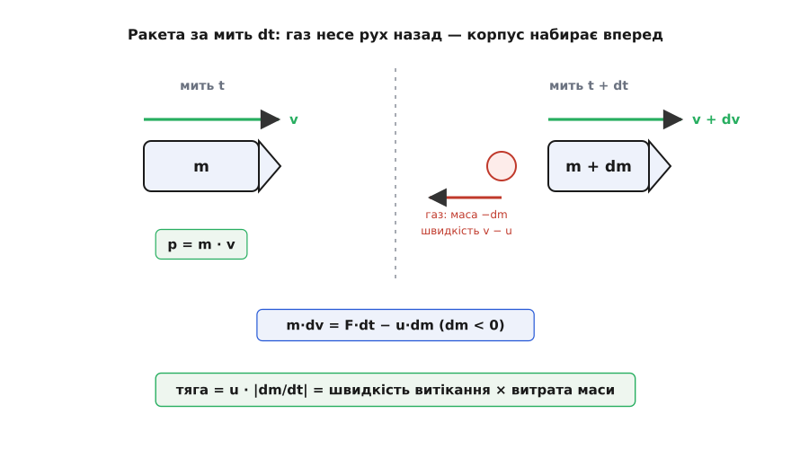
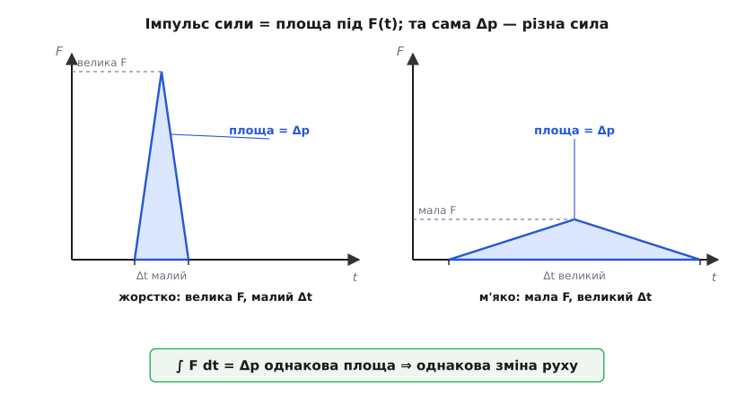

# 🧮 Кількість руху, змінна маса й імпульс сили: повний апарат F = dp/dt

F = m·a — це закон, побачений з найзручнішого боку, там, де маса тіла стала й нікуди не тікає. Та сам Ньютон записав його інакше, глибше, — і саме та глибша форма вміє те, чого m·a не вміє. Вона правильно веде тіло, яке **втрачає або набирає масу** — ракету, що худне на очах, краплю, що росте в хмарі, стрічку конвеєра, на яку сиплеться пісок. І вона ж пояснює, чому ту саму зміну руху можна вчинити м'яким довгим натиском або коротким жорстким ударом. Обидва вміння течуть з однієї величини, яку Ньютон поставив у самісіньке серце закону, — **кількості руху**. Розберімо апарат по цеглині: означення, звідки береться інтуїція, як розгортається формальний хід і де кожна форма закону справді працює.

### Означення: кількість руху p = m·v

Кількість руху (Ньютонова *quantitas motus* — «кількість руху») — це запас руху, що його несе тіло, добуток його маси на швидкість:

```
p = m · v
```

Величина ця **векторна**: p дивиться туди ж, куди й швидкість v, а маса m — просто додатне число, що розтягує вектор, не повертаючи його ([як розкладають вектор на складові](topic:math/vector-components)). Одиниця — кілограм на метр за секунду:

```
[p] = кг · м/с
```

Чому природа зважує рух саме цим добутком, а не самою швидкістю чи самою масою? Бо тільки m·v поводиться як **бухгалтерія, що сходиться**. Важка вантажівка, що ледь повзе, і легкий м'яч, що свище в повітрі, можуть мати однакове p — і однаково нелегко спинити кожне: те, чого бракує масі м'яча, надолужує його швидкість. А коли тіла штовхають одне одного, їхні окремі p міняються, зате **сума** лишається тією самою — повна кількість руху зберігається. Саме ця здатність додаватися й зберігатися робить m·v фундаментальною мірою руху, а не випадковим добутком двох величин.

### Сила — це швидкість зміни кількості руху

Ньютон у «Математичних началах натуральної філософії» (1687) сформулював другий закон не через прискорення, а саме через кількість руху. Його Lex II звучить: *«Mutationem motus proportionalem esse vi motrici impressae»* — «Зміна руху пропорційна прикладеній рушійній силі й відбувається вздовж прямої, якою ця сила діє». «Рух» тут — це quantitas motus, кількість руху p. Отже, первинне твердження закону таке: сила задає **швидкість зміни** кількості руху. Мовою [похідної](topic:math/derivative) — миттєвого темпу зміни:

```
F = dp/dt
```

*(Статус: усталено — латинський текст Lex II за прижиттєвими виданнями «Начал». Тонкість: дослівне формулювання Ньютона читається радше як скінченна, «імпульсна» рівність — зміну руху дає накопичена дія сили, — на що звертав увагу ще Максвелл; неперервну похідну F = dp/dt у закон вклав аналітичний запис пізнішої доби. До імпульсної форми ми ще прийдемо.)*

### Правило добутку: як F = dp/dt згортається у F = m·a

p = m·v — це добуток двох речей, і кожна може змінюватися з часом: тіло і розганяється (міняється v), і худне чи гладшає (міняється m). Похідну добутку двох змінних величин рахують за [правилом добутку](topic:math/derivative): беремо швидкість зміни першого множника, притримавши другий сталим, тоді навпаки — і додаємо:

```
dp/dt = d(m·v)/dt = m·(dv/dt) + v·(dm/dt)
```

Два доданки — два джерела зміни руху. Перший, m·(dv/dt), — тіло тієї самої маси розганяється. Другий, v·(dm/dt), — маса прибуває чи спливає. Коли маса стала, dm/dt = 0, і другий доданок гине дощенту. Лишається саме те, що зветься прискоренням, a = dv/dt:

```
F = m·(dv/dt) = m·a        (маса стала)
```

Ось звідки береться звична форма: F = m·a — це **тінь** загального закону за сталої маси. Не інший закон, а той самий, з якого викреслили член зі зміною маси. Тому вона й панує в механіці: у переважній більшості задач тіло масу не міняє, і другий доданок просто нема кому оживити.

### Коли маса тече: пастка члена v·(dm/dt)

Тепер відкрутімо кран — хай маса тече. Здавалося б, роби просто: лиши обидва доданки й назви v·(dm/dt) «додатковою силою від зміни маси». Спокуса велика — і хибна. Покажу, чому, одним ударом.

Уявімо ракету, прикручену до випробувального стенда: вона нікуди не летить, v = 0, зате шалено палить пальне, dm/dt ≠ 0. Двигун реве, стенд двигтить, тензодавачі показують велетенську тягу — це вимірюють щодня на кожному моторному заводі. А наївна формула каже: тяга = v·(dm/dt) = 0·(dm/dt) = **нуль**. Нісенітниця. Ще гірше: варто пересісти в поїзд, що проїжджає повз стенд, — і v ракети вже не нуль, отже «тяга» стала іншою. Але справжня сила не може залежати від того, з якого вагона на неї дивляться. Член v·(dm/dt) прив'язаний до **абсолютної** швидкості v, а вона в кожній системі відліку своя, — тому фізичною силою він бути не може.

Де ж прокол? У тім, що рівність F = dp/dt із p = m·v — це закон про **сталий гурт частинок**. Коли маса покидає тіло, «m·v» стає кількістю руху зграї, що тане, і похідна цього добутку вже не дорівнює зовнішній силі: ми забули про рух, який **скакає геть разом із викинутим газом**. Щоб не забути, треба стежити не за самим корпусом, а за замкненою системою — корпусом **разом** із тим, що він викидає.

### Правильне рівняння: стежимо за замкненою системою

Візьмімо ракету масою m, що летить зі швидкістю v, і замкнену систему «ракета + та порція газу, яку вона от-от викине». За коротку мить dt ракета викидає газ і від того худне: її маса стає m + dm, де **dm < 0** (маса меншає), а швидкість зростає до v + dv. Викинута порція має масу −dm (додатну) і покидає ракету зі швидкістю u відносно неї, назад, — тож у нерухомій системі відліку летить зі швидкістю приблизно v − u.

Складімо кількість руху до й після. До викиду вся система рухалась як одне ціле: p(t) = m·v. Після — це корпус плюс газ:

```
Корпус:  (m + dm)·(v + dv) ≈ m·v + m·dv + v·dm      (dm·dv — нехтовно малий добуток двох малих)
Газ:     (−dm)·(v − u)      = −v·dm + u·dm
```

Складімо обидва рядки. Члени +v·dm (від корпусу) і −v·dm (від газу) скорочуються — і разом із ними зникає та сама пастка з абсолютною швидкістю:

```
p(t+dt) = m·v + m·dv + v·dm − v·dm + u·dm = m·v + m·dv + u·dm
```

Отже, зміна кількості руху всієї замкненої системи за мить dt:

```
dp = p(t+dt) − p(t) = m·dv + u·dm
```

Зовнішня сила (тяжіння, опір повітря) міняє кількість руху замкненої системи за законом dp = F_зовн·dt — це той самий баланс, що рухає [центр мас](topic:physics/center-of-mass) будь-якої купи тіл. Прирівняймо й поділімо на dt:

```
m·(dv/dt) = F_зовн − u·(dm/dt)
```

Це **рівняння Мещерського** — закон руху тіла зі змінною масою. Оскільки dm/dt < 0 (ракета худне), доданок −u·(dm/dt) додатний: він штовхає ракету **вперед**. Це і є **реактивна сила** (від лат. *re-actio* — відповідна дія), тяга:

```
тяга = −u·(dm/dt) = u · |dm/dt| = швидкість витікання × витрата маси
```

Дивіться, що стало на місце пастки. Тягу задає u — швидкість газу **відносно ракети**, — а не абсолютна v. Тому вона однакова і на стенді, і в польоті, і з будь-якого вагона: відносна швидкість викиду від системи відліку не залежить. Наївний член v·(dm/dt) хибив саме тим, що ставив туди абсолютну швидкість; чесний баланс кількості руху сам підставив правильну — відносну.


*За мить dt ракета викидає порцію газу масою −dm назад зі швидкістю v − u, а корпус масою m + dm набирає v + dv. Баланс кількості руху замкненої системи дає тягу u·|dm/dt| — і в ній стоїть відносна швидкість витікання u, а не абсолютна швидкість ракети.*

Загальне рівняння руху точки змінної маси вивів Іван Мещерський у магістерській дисертації «Динаміка точки змінної маси» (Петербург, 1897); він же ввів саме поняття реактивної сили й перелічив, де маса тече насправді, — ракета, що палить пальне, айсберг, що намерзає й тане, Сонце, що збирає пил і світить, аеростат, що скидає баласт. *(Статус: усталено.)*

**Задача.** Двигун викидає гази зі швидкістю u = 2500 м/с відносно ракети й спалює 200 кг пального щосекунди. Яка тяга?

```
u = 2500 м/с,   |dm/dt| = 200 кг/с

тяга = u · |dm/dt| = 2500 · 200 = 500 000 Н = 500 кН

Розмірність сходиться:  (м/с)·(кг/с) = кг·м/с² = Н  ✓
```

Півмеганьютона — і жодного нового закону: сама лише відносна швидкість викиду, помножена на те, як хутко маса покидає борт. Хочете більшу тягу — женіть газ швидше або сипте його рясніше.

### Інтеграл рівняння руху: формула Ціолковського

Що буде, коли скласти цей закон уздовж усього польоту? Приберімо на мить зовнішні сили (глибокий космос) і пустімо ракету по прямій. Тоді m·dv = −u·dm, звідки

```
dv = −u · (dm / m)
```

Кожна крапля викинутого пального додає крихту швидкості, обернено пропорційну наявній масі. Складімо всі крихти [інтегралом](topic:math/integral) від повної маси m₀ (спокій) до сухої m_f:

```
Δv = −u · ∫[m₀→m_f] dm/m = u · ln(m₀ / m_f)
```

Функцію, чия похідна є 1/m, дає єдина крива — [натуральний логарифм](topic:math/logarithms); тому складання dm/m неминуче народжує ln. Це **формула Ціолковського**:

```
Δv = u · ln(m₀ / m_f)
```

Костянтин Ціолковський опублікував її 1903 року в праці «Дослідження світових просторів реактивними приладами». Близьке рівняння для руху ракети ще 1813-го вивів британський математик Вільям Мур у Королівській військовій академії у Вулічі — щоправда, не пов'язавши приросту швидкості зі швидкістю витікання газу; згодом до тієї самої формули незалежно дійшли Роберт Ґоддард і Герман Оберт. *(Статус: усталено; форма й ім'я — за Ціолковським, ранній частковий вивід — Мур, 1813; кілька незалежних відкриттів.)*

І одразу — жорсткий урок, захований у логарифмі:

**Задача.** Швидкість витікання u = 2500 м/с (типовий хімічний двигун). Скільки Δv дасть ракета, у якої пального в дев'ять разів більше за суху масу (m₀/m_f = 10)? А скільки треба, щоб вийти на низьку орбіту (≈ 9400 м/с)?

```
Δv = u · ln(m₀/m_f) = 2500 · ln 10 = 2500 · 2.303 ≈ 5760 м/с

Для орбіти треба Δv ≈ 9400 м/с. Яке відношення мас це вимагає?
m₀/m_f = e^(Δv/u) = e^(9400/2500) = e^3.76 ≈ 43
```

Дев'ять частин пального на одну частину «сухої» ракети дають лише 5.8 км/с — а до орбіти бракує ще майже стільки ж. Щоб дотягти самотужки, довелося б везти сорок три тонни пального на кожну тонну корпусу з корисним вантажем — неможливо: баки такої тонкостінності просто розчавить власна вага. Ось чому ракети роблять **багатоступеневими**: відкидаючи порожні баки, ракета раз у раз зменшує m_f і бере логарифм наново. Логарифм у формулі — не примха запису, а сама причина, чому космос такий дорогий.

### Теорема про імпульс сили: ∫F dt = Δp

Повернімося до F = dp/dt — але тепер не диференціюймо, а **інтегруймо**, тільки не по масі, а по часу. Перепишім закон як dp = F·dt і складімо всі крихітні зміни руху за проміжок від t₁ до t₂:

```
∫[t₁→t₂] F dt = p₂ − p₁ = Δp
```

Ліворуч стоїть величина, яку звуть **імпульсом сили** (лат. *impulsus* — поштовх): накопичена дія сили за час. Праворуч — уся зміна кількості руху. Отже,

```
J = ∫ F dt = Δp
```

Геометрично інтеграл — це **площа під графіком F(t)**. Тому імпульс сили є площа під кривою сили за часом, і саме ця площа дорівнює зміні руху. Для сталої сили площа — простий прямокутник:

```
J = F · Δt = Δp        (стала сила)
```

Одиниця імпульсу — ньютон-секунда, і вона тотожна одиниці кількості руху, що вже саме собою підказує їхню рівність:

```
[J] = Н·с = (кг·м/с²)·с = кг·м/с = [p]  ✓
```

Ось де відкривається практична сила цієї теореми. Щоб надати тілу задану Δp, потрібна цілком певна **площа** під F(t) — а от якої форми ту площу набрати, вирішуєте ви. Можна вигнати її вгору тонким високим шпилем: величезна сила за коротку мить (жорсткий удар). А можна розстелити низьким широким горбом: маленька сила за довгий час (м'який натиск). Площа — та сама, зміна руху — та сама, зате пікова сила різниться в рази.


*Імпульс сили — площа під графіком F(t), і вона дорівнює зміні кількості руху Δp. Той самий Δp можна набрати високим вузьким піком (велика сила, короткий час) або низьким широким горбом (мала сила, довгий час): площі рівні, а пікові сили — ні.*

Саме на цьому стоять подушка безпеки, зминальна зона авто, канат скелелаза, приземлення на зігнуті ноги: усі вони **розтягують час** гальмування, тримаючи потрібну площу, — і тим збивають пікову силу, що ламає кістки й метал. Прикметно, що ця, інтегральна форма — Δp дорівнює накопиченій дії сили — і є найближча до дослівного Ньютонового Lex II: «зміна руху пропорційна прикладеній силі».

**Задача.** Битою вдаряють по м'ячу масою 0.15 кг: він летів на биту зі швидкістю 40 м/с, а відлітає назад із 40 м/с. Дотик триває Δt = 0.7 мс, а сила за цей час наростає від нуля до піка й спадає — трикутний імпульс. Знайдімо зміну руху, пікову й середню силу.

```
Кількість руху міняє і величину, і напрям. Вважаймо напрям відльоту додатним:
   p_до    = 0.15·(−40) = −6 кг·м/с
   p_після = 0.15·(+40) = +6 кг·м/с
   Δp = p_після − p_до = 6 − (−6) = 12 кг·м/с

Це і є площа під F(t) — площа трикутника з основою Δt і висотою F_пік:
   J = ½ · F_пік · Δt = Δp
   F_пік = 2·Δp / Δt = 2·12 / 0.0007 ≈ 34 000 Н ≈ 34 кН

Середня сила — та сама площа, розмазана рівно по часу:
   ⟨F⟩ = Δp / Δt = 12 / 0.0007 ≈ 17 000 Н ≈ 17 кН
```

Дванадцять кілограм-метрів на секунду зміни руху за сім десятих мілісекунди обертаються пікою в тридцять чотири кілоньютони — і рівно вдвічі меншою середньою, бо в трикутника вершина вдвічі вища за середній рівень. М'яч не важчає й не легшає, тож тут працює звичайна F = m·a у своїй інтегральній одежі; а сама теорема про імпульс байдужа до того, стала маса чи ні, — вона лиш складає dp за часом.

> 🔧 **Навіщо це.** Три форми — три інженерні ремесла. З F = m·a рахують привід, що має дати задане прискорення. З тяги = u·|dm/dt| добирають двигун і витрату, щоб підняти ракету, і вирішують, скільки ступенів потрібно, аби побороти логарифм Ціолковського. А з ∫F dt = Δp проєктують усе, що гасить удар: подушку, зминальну зону, шолом, пакування для крихкого — скрізь мета одна, розтягнути час, щоб та сама неминуча Δp коштувала меншої сили. Один апарат живить і космодром, і краш-тест.

### Одна величина, багато форм

Уся ця розмаїтість виходить з однієї величини, прочитаної щоразу по-новому. У центрі — кількість руху p = m·v. Продиференціюйте її — дістанете справжній Ньютонів закон F = dp/dt. Притримайте масу сталою — він згорнеться у F = m·a. Відпустіть масу текти, чесно склавши баланс замкненої системи, — вийде рівняння Мещерського й реактивна тяга ракети. Складіть це рівняння вздовж усього польоту — народиться логарифм Ціолковського. А проінтегруйте вихідне F = dp/dt по часу — матимете теорему про імпульс сили, площу під F(t). Не п'ять різних законів, а одна кількість руху, повернута п'ятьма гранями до світла.
