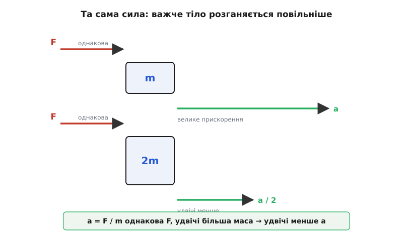
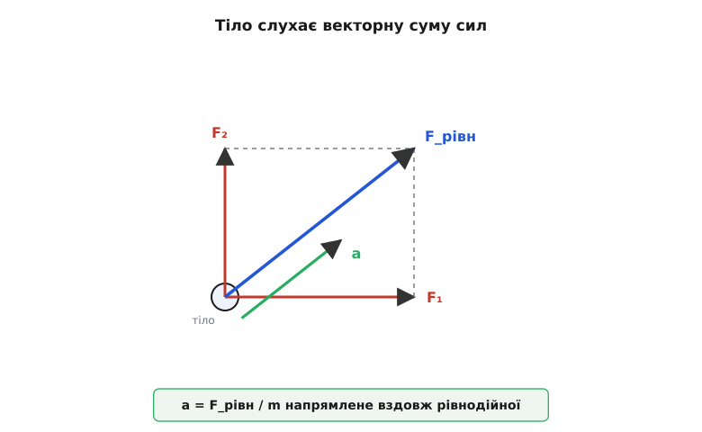
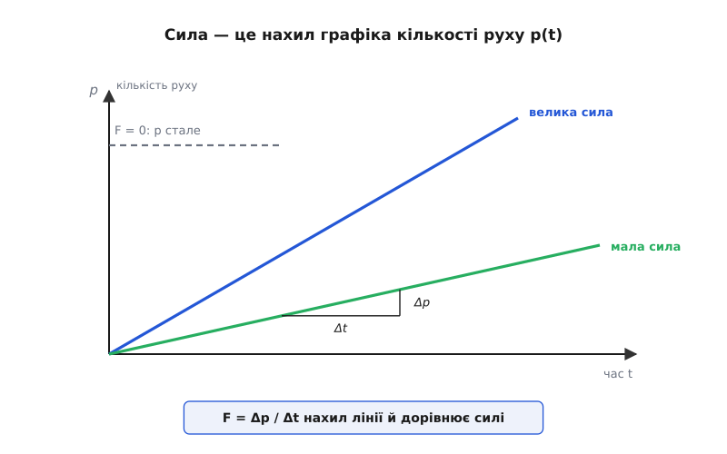

# Другий закон Ньютона: сила дає не швидкість, а прискорення

<preknowlist>
- [Сила](book:physics/force) — векторна дія, штовхання чи тяжіння; має величину й напрям, вимірюється в ньютонах.
- [Маса](book:physics/mass) — міра інертності тіла: наскільки важко змінити його рух. Одиниця — кілограм.
- [Прискорення](book:physics/acceleration) — швидкість зміни швидкості: наскільки швидко й у який бік міняється рух.
- [Швидкість](book:physics/velocity) — швидкість зміни положення; векторна величина (розмір плюс напрям).
</preknowlist>

Штовхніть книжку по столу й відпустіть — вона проїде п'ядь і спиниться. Звідси напрошується висновок, який людство робило тисячі років: щоб тіло рухалося, його треба **весь час** штовхати; сила підтримує рух, а без сили рух гасне. Так учив Арістотель, і щоденний досвід ніби потверджує це на кожному кроці — віз без коня стає, човен без весел завмирає.

Висновок здається залізним — і все ж хибний. Книжка спиняється не тому, що «скінчилася сила руху», а тому, що по ній тре тертя — невидима сила, спрямована проти руху. Приберіть тертя — і картина міняється на очах. Шайба по гладенькому льоду ковзає далеко; що рівніший лід, то далі. Уявіть лід ідеально слизьким — і шайба не спиниться **ніколи**, летітиме рівно й прямо, аж поки щось не втрутиться іззовні. Отже, рух не потребує сили, щоб тривати. Тіло само тримає свій рух — цю впертість матерії звуть **інерцією** (лат. *iners* — «бездіяльний, млявий»).

Тоді навіщо взагалі сила? Ось справжня відповідь, і вона перевертає стару інтуїцію догори дриґом: сила **не тримає** рух — вона його **змінює**. Немає сили — швидкість стала, за величиною й напрямом. Є сила — швидкість міняється: тіло розганяється, гальмує або завертає. А міру того, як швидко міняється швидкість, і звуть прискоренням. Тому питання «що робить сила?» має точну відповідь: **сила дає прискорення**.

### Скільки прискорення дає сила

Лишилося з'ясувати головне — **скільки**. Штовхніть порожній візок, а тоді той самий візок, навантажений цеглою, з однаковим зусиллям: порожній зривається з місця жваво, важкий — ледь-ледь. Тепер штовхайте той самий візок то легенько, то щосили: що дужче штовхаєте, то швидше він набирає ходу. Два прості спостереження — а в них увесь закон.

Перше: за тієї самої маси прискорення тим більше, чим більша сила. Удвічі сильніше штовхнув — удвічі швидше розганяється. Прискорення **пропорційне силі**. Друге: за тієї самої сили прискорення тим менше, чим більша маса. Удвічі важчий візок розганяється вдвічі повільніше. Прискорення **обернено пропорційне масі**. [Маса](book:physics/mass) тут і виступає мірою інертності: саме вона каже, наскільки тіло опирається зміні свого руху.

Складімо обидва спостереження в одне:

```
a = F / m
```

Прискорення дорівнює силі, поділеній на масу. Це і є другий закон Ньютона. Частіше його пишуть, помноживши на масу навхрест, — у вигляді, що прямо показує: аби надати тілу масою m прискорення a, потрібна сила

```
F = m · a
```

Ця коротка рівність — серце всієї механіки. Знаєте силу — знаєте прискорення, а з нього розгортається весь дальший рух: як тіло набиратиме швидкість, де опиниться за секунду, за годину, за роки. Уся динаміка — це, по суті, читання цього рівняння в обидва боки: від сил до руху й назад.

Сила й прискорення — **вектори**, і рівність зв'язує їх не лише за величиною, а й за напрямом: прискорення завжди дивиться **туди ж, куди й сила**. Штовхнули вбік — тіло й повертає вбік. Маса ж — звичайне додатне число: вона міняє довжину вектора, але не його напрям.

Одиниця сили випливає просто з формули. Сила, що надає масі 1 кг прискорення 1 м/с², — це один **ньютон** (Н), названий на честь Ісаака Ньютона:

```
1 Н = 1 кг · м/с²
```

Приблизно з такою силою давить на долоню яблуко: маса близько 100 г у полі тяжіння Землі важить десь 1 Н.


*Однакова сила F, прикладена до різних мас: легше тіло дістає вдвічі більше прискорення, ніж удвічі важче. Прискорення обернено пропорційне масі: a = F/m.*

**Задача.** Автомобіль масою 1200 кг розганяється; двигун через колеса дає результівну силу 3600 Н уперед. Яке прискорення? За скільки він набере 100 км/год зі спокою?

```
m = 1200 кг,  F = 3600 Н

Прискорення:
a = F / m = 3600 / 1200 = 3 м/с²

100 км/год = 27.8 м/с.  Час набрати цю швидкість зі спокою:
t = v / a = 27.8 / 3 ≈ 9.3 с
```

Три метри за секунду щосекунди — за кожну секунду швидкість росте на 3 м/с. Дев'ять із гаком секунд до «сотні», і жодної нової фізики: сама лише F = m·a.

> 🔧 **Навіщо це.** Щоб машина розганялася жвавіше, є рівно два шляхи, і закон показує обидва: додати силу (потужніший двигун, чіпкіші шини) або зменшити масу (легший кузов). Той самий розрахунок стоїть за кожним ліфтом, краном, ракетою: спершу визнач потрібне прискорення, помнож на масу — дістанеш силу, яку має видати привід. А ділячи наявну силу на масу, наперед знаєш, чи потягне двигун вантаж і як хутко.

### Тіло слухає суму сил

На реальне тіло діє не одна сила, а кілька нараз: вага тягне вниз, опора підпирає вгору, рука штовхає вбік, тертя опирається. Котру з них ставити у F = m·a? Жодну окремо — **усі разом**. Тіло відгукується на векторну суму прикладених сил, їхню рівнодійну ([як складають вектори](book:math/vector-addition) — за правилом трикутника, з урахуванням напрямів):

```
F_рівн = F₁ + F₂ + F₃ + …   (векторна сума)
a = F_рівн / m
```

Звідси випливає тонка, але важлива річ: якщо сили гасять одна одну, рівнодійна нульова — і прискорення нульове, хоч сил доклали чимало. Книжка лежить на столі: вага тягне її вниз, стіл відповідає рівною силою реакції вгору, вони гасяться, і книжка не рушить. Приберіть стіл — лишиться сама вага, і книжка падає з прискоренням земного тяжіння.

Оцей випадок нульової рівнодійної ховає в собі й **[перший закон Ньютона](book:physics/newtons-first-law)**: коли сумарна сила нульова, тіло рухається рівно й прямо або спокійно стоїть. Часто перший закон так і подають — як окремий випадок F = 0. Насправді він робить трохи більше: стверджує, що взагалі існують [системи відліку](book:physics/inertial-frame), у яких це справджується, — інерціальні. Другий закон має силу саме в них.


*Тіло реагує на векторну суму всіх прикладених сил. Прискорення дивиться туди ж, куди рівнодійна F_рівн, і дорівнює їй, поділеній на масу. Зрівноважені сили дають нульову рівнодійну — і нульове прискорення.*

### Глибша форма: сила міняє кількість руху

F = m·a — форма зручна, та не найзагальніша. Сам Ньютон записав закон інакше й глибше. У кожного тіла є **[кількість руху](book:physics/momentum)** (її ще звуть імпульсом, лат. *impulsus* — «поштовх, удар») — добуток маси на швидкість:

```
p = m · v
```

Це запас руху, що його несе тіло: важка вантажівка на малій швидкості й легкий м'яч на великій можуть мати однакове p, і однаково нелегко спинити кожне. Ньютон сформулював так: сила дорівнює **швидкості зміни кількості руху** — наскільки хутко міняється p. Мовою [похідної](book:math/derivative):

```
F = Δp / Δt      (точно — F = dp/dt)
```

Коли маса стала, ця форма згортається у звичну F = m·a: зміна p — це маса на зміну швидкості, а зміна швидкості за час і є прискорення:

```
Δp = m · Δv   →   F = m · Δv/Δt = m · a
```

Тоді навіщо складніша форма, якщо вона дає те саме? Бо маса не завжди стала. Ракета викидає гази й **худне** щосекунди; для неї F = m·a вже незручна — треба зважати, що міняється й маса. А форма F = dp/dt правдива завжди, хоч би тіло набирало масу, хоч втрачало. Як із загальної форми виходить F = m·a і що саме додає змінна маса — [окреме виведення](book:physics/newtons-second-law/math-force-momentum.md). А чому Ньютон узагалі писав закон через кількість руху й коли з'явилася звична нам компактна форма — [коротка історія закону](book:physics/newtons-second-law/hist-second-law.md).


*Сила — це нахил графіка кількості руху за часом. Більша сила — крутіший підйом p. Немає сили — p стале, лінія горизонтальна: кількість руху зберігається.*

Із цієї форми випливає рятівна на практиці річ. Щоб спинити тіло, треба погасити всю його кількість руху — забрати весь p. Але **за який час** це зробити, вирішуєте ви, а сила виходить тим меншою, чим довше гальмуєте.

**Задача.** Ловимо м'яч: маса 0.15 кг, швидкість 20 м/с, отже кількість руху p = 3 кг·м/с. Спинити його треба цілком. Жорсткими руками — за 0.02 с; поступливими, відводячи руки назад, — за 0.2 с.

```
p = m · v = 0.15 · 20 = 3 кг·м/с

Жорстко  (Δt = 0.02 с):  F = p / Δt = 3 / 0.02 = 150 Н
Поступливо (Δt = 0.2 с):  F = p / Δt = 3 / 0.2  = 15 Н
```

Та сама кількість руху, той самий м'яч — а сила вдесятеро менша, лише тому що зупинку розтягнули вдесятеро. На цьому стоять подушка безпеки, зминальна зона авто, приземлення на зігнуті ноги: усі вони **розтягують час** удару, щоб збити силу.

### Від однієї точки до цілого тіла

Досі йшлося про одне тіло, наче точку. А що з системою багатьох тіл — купою піску, ланцюгом, роєм уламків, — де кожна частинка тягне сусідні й сама зазнає їхнього тяжіння? Диво в тім, що закон лишається таким самим, якщо стежити за особливою точкою — **[центром мас](book:physics/center-of-mass)**. Усі **внутрішні** сили гасяться попарно: за [третім законом Ньютона](book:physics/newtons-third-law) кожна дія має рівну протидію, тож коли частинка тягне сусідку, та відповідає рівною силою в протилежний бік, і в парі вони дають нуль. Лишаються самі **зовнішні** сили — і саме вони рухають центр мас:

```
F_зовн = M · a_цм
```

де M — повна маса системи, a_цм — прискорення її центра мас. Тому граната, розлетівшись у повітрі, розкидає осколки навсібіч — а їхній спільний центр мас летить тією самою параболою, що й ціла граната: усередині все розірвали внутрішні сили, але на рух центра мас вони не впливають, лишилася сама тяжкість. Тіло будь-якої складності рухається як одна точка з усією його масою, до якої прикладено суму зовнішніх сил. Оце й дозволяє рахувати політ каменя, не переймаючись тим, що він з мільярдів атомів.

### Де проста картинка ламається

F = m·a надійна майже завжди, та не скрізь — і межі варто знати.

**Тільки в інерціальних системах.** Уявіть, що ви їдете в автобусі, і він різко гальмує: вас кидає вперед, хоч ніхто не штовхав. У системі відліку автобуса тіло прискорилося ніби без сили — F = m·a наче порушено. Насправді порушено не закон, а умову: він чинний лише в системах, що самі не прискорюються. У прискореній системі, щоб урятувати рівняння, домальовують «сили інерції» — фіктивні доважки, яких насправді ніхто не прикладає, а вони лише покривають прискорення самої системи.

**На дуже великих швидкостях.** Коли швидкість наближається до швидкості світла, тіло опирається розгону дедалі дужче, ніби «важчає», і жодна скінченна сила не доводить його до світлової межі. Там F = m·a переходить у точнішу, релятивістську форму. Але для всіх повсякденних швидкостей — машин, літаків, планет — розбіжність незмірно мала, і звичний закон лишається точним.

Ці межі не спростовують закон, а окреслюють його володіння — і воно велетенське: від польоту каменя до орбіти супутника, від коливань моста до ходу поршня. Дай сили — і другий закон видасть прискорення; знай прискорення в кожну мить — і, склавши маленькі кроки, дізнаєшся весь майбутній рух. Саме так інженер передбачає траєкторію: розписує сили, ділить на масу, крок за кроком інтегрує — і бачить, де тіло буде згодом. Як це роблять числом на комп'ютері — [покрокова симуляція руху](book:physics/newtons-second-law/proj-numerical-integration.md).
