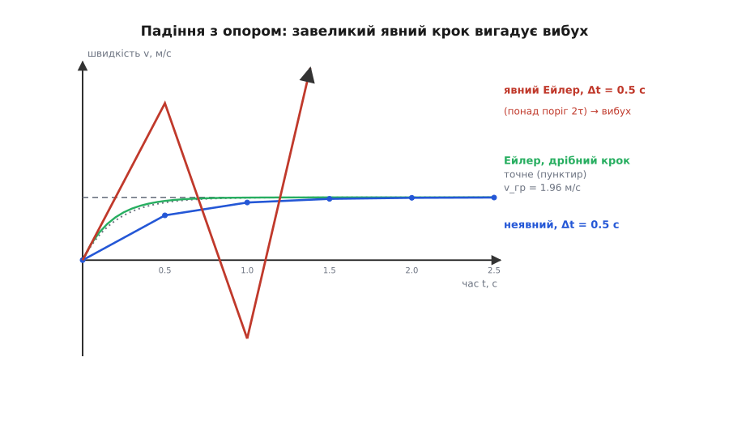
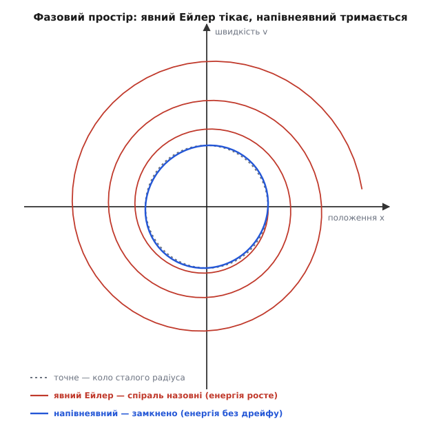
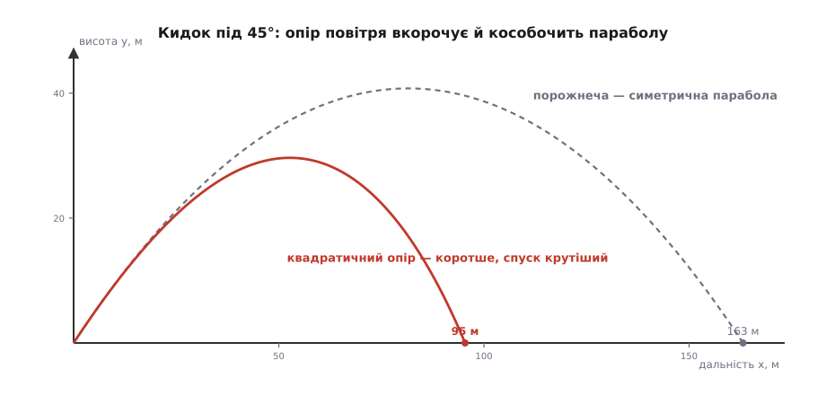

# ⚙️ Крок за кроком: рух числом, інтегруючи F = m·a

Кинули камінь — і рука ніби вже знає, де він упаде. У порожнечі так і є: тяжіння стале, і шкільна формула видає параболу без зусиль. Та досить впустити в задачу повітря — і акуратна формула гине. Опір залежить від швидкості, швидкість — від прискорення, прискорення — знову від опору; коло замкнулося, і елементарної відповіді «де впаде» вже немає. Саме тут F = m·a з готового рецепта перетворюється на **диференціальне рівняння**, а комп'ютер починає заробляти свій хліб: він не бере рівняння формулою, а марширує крізь час дрібними кроками й із тисячі кроків складає всю траєкторію. Так рахують політ снаряда, орбіту зонда, дугу м'яча у грі; так летить кожен кадр фізичного рушія й кожен такт польотного контролера.

Уся хитрість у тім, що для одного кроку формула на весь політ і не потрібна. Другий закон дарує нам єдину річ, зате безкоштовно й будь-якої миті: **прискорення просто зараз**, `a = F/m`, за поточним станом тіла. А з прискорення в руках можна ступити маленький крок уперед — і опинитись у наступній миті, де закон знову дасть свіже прискорення. Розберімо, як саме це роблять, де воно зраджує, і чому один переставлений рядок коду рятує розрахунок від катастрофи.

## Задача: сила відома, а траєкторія — ні

Тіло масою m летить під двома силами: тяжінням, що тягне вниз сталою `m·g`, і опором повітря, спрямованим завжди проти руху. Опір буває двох різних порід, і від того, яка з них, залежить усе подальше.

При малих, повільних тілах — порошинка, крапля мли, кулька в сиропі — опір **лінійний**, пропорційний самій швидкості: `F_оп = −k·v`. При швидких — м'яч, куля, крапля дощу — опір **квадратичний**, пропорційний квадрату швидкості: `F_оп = −c·|v|·v`. Що вмикається, вирішує [число Рейнольдса](topic:physics/reynolds-number) — безрозмірне відношення інерційних сил до в'язких: мале Re (густа рідина, крихітне тіло) дає лінійний режим, велике Re (повітря, звичайні тіла) — квадратичний. Тобто навіть сам **закон опору** не універсальний, а залежить від умов.

Почнімо з лінійного — не бо він частіший (він рідший), а бо в нього є точний розв'язок, з яким ми звірятимемо числа. Другий закон для нього:

```
m · dv/dt = m·g − k·v        →        dv/dt = g − (k/m)·v
```

Позначмо `β = k/m` (одиниця — 1/с). Дістаємо дві прості рівності, що замикають рух:

```
dr/dt = v            положення тягнеться за швидкістю
dv/dt = g − β·v      швидкість тягнеться за прискоренням
```

Друга з них ховає красиву річ. Коли швидкість мала, опір `β·v` слабкий, і тіло майже вільно падає з `g`. Але що дужче воно розганяється, то дужче опір гризе прискорення — аж поки той не з'їсть тяжіння геть: `g − β·v = 0`. Тоді прискорення нуль, розгін спиняється, і тіло падає **сталою** швидкістю — **граничною**:

```
v_гр = g / β = m·g / k
```

Далі за неї опір уже не пускає. Це і є та швидкість, з якою парашутист висить під куполом, а крапля дощу дістає землі, не пробивши даху. Наближення до `v_гр` — плавне, за законом спадної експоненти (чому величина, чия швидкість зміни пропорційна відстані до рівноваги, підходить до неї саме експоненційно, розібрано в [експоненційному рівнянні](topic:math/exponential-ode)):

```
v(t) = v_гр · (1 − e^(−β·t))
```

Ось наш еталон. Для лінійного опору формула на весь рух існує — рідкісний подарунок. Але метод, що ми будуємо, **не сміє** на неї спиратися: справжня мета — рахувати рух там, де жодної формули немає (а це майже завжди). Формула тут потрібна лише як лінійка, якою ми потім поміряємо, чи не бреше наш марширувальник.

## Ідея: закон — це рецепт одного кроку

Похідна — це нахил (докладно — [похідна як швидкість зміни](topic:math/derivative)): `dv/dt` каже, скільки швидкості набігає за одиницю часу. За дуже короткий проміжок `Δt` швидкість майже не встигає змінитись, тож можна нахабно припустити, що прискорення на цьому шматочку стале, і ступити один прямий крок уздовж нього. Те саме — для положення вздовж швидкості:

```
v(t + Δt) ≈ v(t) + Δt · a          a = F(r, v)/m — прискорення тут і тепер
r(t + Δt) ≈ r(t) + Δt · v
```

Оце й усе — другий закон, обернений на цикл. Дав правило `a = F(r,v)/m`, обчислив прискорення в поточній точці, ступив маленький крок швидкості й положення, опинився в новій точці, там перерахував прискорення, ступив знову. Тисяча таких кроків — і перед тобою вся траєкторія. Це **явний метод Ейлера** — найпростіший спосіб числом розв'язати рівняння руху, який Леонард Ейлер описав ще в «Institutionum calculi integralis» (1768): він прямо вжив Ляйбніцове бачення кривої як многокутника з відрізків нескінченно малих дотичних. Метод грубий — прискорення-бо міняється й усередині кроку, а ми вдали, ніби ні, — зате прозорий, як скло, і на ньому видно всю суть.

Якою мовою це писати? Задача — числове інтегрування звичайних диференціальних рівнянь, і кандидатів двоє, кожен сильний зі свого боку. **Python з numpy**: цикл кроку читається майже як математичний запис, вектор стану дається задарма, а нам важить *побачити* траєкторію й швидко порівняти методи — виразність тут головна. **C++**: інтегратор руху — це класичний гарячий цикл, у якому крутяться фізичні рушії ігор, симуляції реального часу й польотні контролери; там мільйони кроків на секунду, і сира швидкодія та ощадливість пам'яті вирішують. Обидва проходять поріг доречності, тож головний крокувальник — у вкладках, ідіоматично в кожній мові:

:::tabs
```python
import numpy as np

def euler(r, v, accel, dt):
    """Один крок явного Ейлера. accel(r, v) → прискорення від стану."""
    a = accel(r, v)
    return r + v * dt, v + a * dt          # ОБИДВА оновлення — зі СТАРИХ значень

def semi_implicit(r, v, accel, dt):
    """Напівнеявний Ейлер: усього один переставлений рядок проти явного."""
    a = accel(r, v)
    v_new = v + a * dt                      # спершу оновлюємо швидкість…
    return r + v_new * dt, v_new            # …а положення веземо вже НОВОЮ швидкістю
```
```cpp
struct Vec2 {
    double x{}, y{};
    Vec2 operator+(Vec2 b) const { return {x + b.x, y + b.y}; }
    Vec2 operator*(double s) const { return {x * s, y * s}; }
};
using Accel = Vec2 (*)(Vec2 r, Vec2 v);    // прискорення від стану

// Один крок явного Ейлера: обидва оновлення зі СТАРИХ значень.
void euler(Vec2& r, Vec2& v, Accel accel, double dt) {
    Vec2 a = accel(r, v);
    r = r + v * dt;
    v = v + a * dt;
}

// Напівнеявний Ейлер: усього один переставлений рядок.
void semi_implicit(Vec2& r, Vec2& v, Accel accel, double dt) {
    Vec2 a = accel(r, v);
    v = v + a * dt;                         // спершу швидкість…
    r = r + v * dt;                         // …положення вже НОВОЮ швидкістю
}
```
:::

Стан — двовимірний вектор (по x і по y незалежно), тож той самий крок годиться і для вертикального падіння, і для косого кидка. Уся інша робота — придумати праву частину, прискорення від стану, і прокрутити цикл. Плюмбінг зручно лишити виразному Python (у C++ це той самий `for`, що клепле `euler(r, v, ...)`):

```python
g = np.array([0.0, -9.8])                     # тяжіння вниз

def linear_drag(m, k):                        # опір ∝ швидкості (мале, повільне тіло)
    return lambda r, v: g - (k / m) * v

def quadratic_drag(m, c):                     # опір ∝ швидкості² (реальне повітря)
    return lambda r, v: g - (c / m) * np.linalg.norm(v) * v

def simulate(accel, r0, v0, dt, steps, step=euler):
    r, v = np.array(r0, float), np.array(v0, float)
    R = np.empty((steps + 1, 2)); R[0] = r
    V = np.empty_like(R);         V[0] = v
    for i in range(steps):                    # ← гарячий цикл: тут живе вся вартість
        r, v = step(r, v, accel, dt)
        R[i + 1], V[i + 1] = r, v
    return np.arange(steps + 1) * dt, R, V
```

## Пастка перша: завеликий крок вигадує вибух

Прогонимо вертикальне падіння лінійно-гальмованої кульки й подивимось, як явний Ейлер тримається еталона.

**Умова.** Легка кулька, `m = 10 г`, лінійний опір `k = 0.05 кг/с`. Тоді `β = k/m = 5 1/с`, характерний час `τ = 1/β = 0.2 с`, гранична швидкість `v_гр = g/β = 1.96 м/с`. Пускаємо зі спокою й дивимось на швидкість (донизу додатна):

```
крок dt        швидкість за кроками (м/с)                          вирок
0.05 (τ/4)  0 → 0.49 → 0.86 → 1.13 → 1.34 → … → 1.96      плавно до v_гр
0.30 (1.5τ) 0 → 2.94 → 1.47 → 2.21 → 1.84 → 2.02 → 1.93   коливається, ще СХОДИТЬСЯ
0.50 (2.5τ) 0 → 4.90 → −2.45 → 8.58 → −7.96 → 16.8 → …    ВИБУХАЄ у безмежжя
```

Дрібний крок акуратно піднімає швидкість до `v_гр` (за перші кроки трохи вище за точне — то похибка першого порядку). Але щойно крок росте, картина псується, а при `dt = 0.5 с` розрахунок сходить з розуму: швидкість стрибає то в плюс, то в мінус — тіло то нібито шугає вгору (від'ємні значення), то мчить униз далеко за граничну, і розмах щокроку більшає: на п'ятому кроці вже 17 м/с — увосьмеро понад граничні 1.96. Це не фізика — справжня кулька лагідно осідає на 1.96 м/с і висить. Це **чистий артефакт методу**.

Звідки він. Для швидкості один крок Ейлера дає `v_нов = v + Δt·(g − β·v) = (1 − β·Δt)·v + Δt·g`. Відхилення від граничної, `e = v − v_гр`, множиться щокроку на `(1 − β·Δt)`. Поки цей множник за модулем менший за одиницю, відхилення тане — розрахунок стійкий. Але щойно `Δt` переступає поріг

```
Δt < 2/β = 2·τ            умова стійкості явного кроку
```

множник за модулем більший за одиницю, і кожен крок **роздуває** відхилення замість гасити — та ще й перекидає його знак. Це та сама умова стійкості явного кроку, `Δt < 2/|k|`, і той самий механізм роздування, що й у [числовій симуляції зворотного зв'язку](topic:physics/positive-negative-feedback/proj-feedback-sim.md), де крок інтегрування сам поводиться як петля зі своїм знаком стійкості. Тут `τ = 1/β = m/k` — це час, за який опір «наздоганяє» швидкість; коли крок довший за два такі часи, метод перестрибує реакцію системи й розганяє сам себе. Загальніше про те, чому дискретна схема живе на межі стійкості й що її переступає, — [числова стійкість](topic:math/numeric-stability).


*Та сама кулька, чотири розрахунки. Пунктир — точне `v_гр·(1 − e^(−βt))`, вихід на граничну швидкість 1.96 м/с. Зелена — Ейлер малим кроком, тримається кривої. Синя — неявний крок навіть завеликим `Δt = 0.5 с`: гладко сходиться до `v_гр`, не перескакуючи. Червона — явний Ейлер тим самим `Δt = 0.5 с` понад поріг `2τ = 0.4 с`: швидкість зигзагом стрибає з плюса в мінус, амплітуда росте — розрахунок вибухнув.*

## Ліки на вибух: заплатити опору наперед

Хвороба сидить у тім, що явний крок бере опір `−β·v` за **старою** швидкістю — тією, що на початку кроку, — а вона за крок могла добряче змінитися. Ліки прості: узяти опір за **новою**, ще не відомою швидкістю, і чесно розв'язати рівняння на неї. Це неявний (зворотний) Ейлер, застосований до гальмівного члена:

```
v_нов = v + Δt·(g − β·v_нов)
```

`v_нов` тут по обидва боки, але рівняння лінійне, і воно розв'язується руками в один рядок:

```python
def implicit_drag_step(v, g, beta, dt):
    """Стійкий крок для лінійного опору: опір беремо за НОВОЮ швидкістю."""
    return (v + dt * g) / (1.0 + beta * dt)      # v_нов·(1 + β·Δt) = v + Δt·g
```

Тепер множник на відхиленні — `1/(1 + β·Δt)`, і він **за будь-якого** `Δt > 0` лежить між нулем і одиницею. Хоч який грубий крок — розрахунок не може вибухнути, а тільки плавно сходиться до граничної швидкості. Прогін це підтверджує: тим самим `Δt = 0.5 с`, що рознесло явний Ейлер, неявний іде

```
0 → 1.40 → 1.80 → 1.91 → 1.95 → 1.96      монотонно до v_гр, без жодного стрибка
```

Це **безумовна стійкість** — головна цінність неявних методів на «жорстких» задачах, де є дуже швидкий час (тут крихітне `τ = 0.2 с`), який інакше диктував би мікроскопічний крок. Ціна — розв'язувати рівняння на кожному кроці; для лінійного опору воно береться формулою, для складнішого — ітерацією. Зате крок можна брати такий, який диктує **точність**, а не примара стійкості.

> 🔧 **Навіщо це.** Жорсткість — не рідкісна екзотика, а щоденний біль симуляцій: пружна підвіска з твердою пружиною й повільним кузовом, хімія з швидкими й повільними реакціями, електрична схема з малою ємністю поряд із великою. Скрізь є час, у сотні разів коротший за той, що вас цікавить, і явний метод мусив би дрібнити крок під нього — марнуючи мільйони кроків на «нецікаву» швидку динаміку. Неявний крок цю тиранію знімає: платиш опору наперед — і крокуєш великими кроками крізь жорстку систему, не боячись вибуху.

## Пастка друга: тиха втеча енергії

Вибух — хвороба помітна, вона кричить. Є друга, підступніша: розрахунок не вибухає, лишається гладким і правдоподібним — а сам поволі вигадує чи з'їдає **енергію**, і за довгий прогін тіло опиняється не там, де мало б. Найкраще її видно там, де тертя немає зовсім і енергія **мусить** зберігатись, — на [гармонічному осциляторі](topic:physics/harmonic-oscillator): тягарці на пружині без утрат, що вічно коливається зі сталою амплітудою.

**Умова.** Пружинний осцилятор без тертя, власна частота `ω = 1 1/с`, старт `x₀ = 1 м`, `v₀ = 0`. Прискорення `a = −ω²·x`. Повна енергія (на одиницю маси) `E = ½(v² + ω²·x²)` має вічно стояти на `0.5`.

Проженімо його явним Ейлером кроком `dt = 0.1 с` — і поміряймо енергію:

```
метод                    E через 1 період      через 5 періодів
явний Ейлер           0.5 → 0.94  (×1.87)      ×23   — «гріється», амплітуда росте
напівнеявний (Ейлер–Кромер)  коливається в [0.48, 0.53]  — і так вічно, без дрейфу
```

Явний Ейлер щоперіод роздуває енергію на 87 %, за п'ять періодів — у 23 рази: амплітуда розкручується, тягарець вилітає геть, хоч у рівнянні немає жодного джерела енергії. У фазовому просторі (положення проти швидкості) точний рух — це коло сталого радіуса; явний Ейлер натомість малює **спіраль, що розкручується назовні**, бо його матриця кроку щокроку множить радіус на `√(1 + ω²Δt²) > 1`.

І ось де окупається той один переставлений рядок. Напівнеявний крок оновлює **спершу швидкість, а положення вже новою швидкістю** — і цього мікроскопічного зсуву досить, щоб матриця кроку стала зберігати площу у фазовому просторі (її визначник точно 1). Спіраль замикається на обмежений овал: енергія тихенько гуляє в вузькій смужці навколо правдивого значення, але **не дрейфує** — ні за п'ять періодів, ні за п'ять мільйонів. Такі методи звуть **симплектичними**; на цю стабільність указав Алан Кромер (Am. J. Phys., 1981), показавши, що проста перестановка в Ейлеровому кроці дає для Кеплерової задачі замкнені орбіти, які можна крутити скільки завгодно, — звідси й назва «Ейлер–Кромер».


*Той самий осцилятор без тертя, той самий крок `dt = 0.1 с`, у площині «положення–швидкість». Сіре коло — точний рух сталого радіуса. Червона спіраль — явний Ейлер: щовиток радіус більший, енергія росте з нічого. Синій овал — напівнеявний Ейлер: тримається коло кола, замкнений, енергія лише гуляє у вузькій смужці. Один переставлений рядок — і замість повільної катастрофи маємо стабільну на віки орбіту.*

Тут — важлива тонкість, у якій легко заплутатись, тож скажімо прямо. Ці **дві пастки — різні хвороби, і лікуються різним**. Перестановка в напівнеявному Ейлері рятує від дрейфу енергії на консервативних системах — але **не** рятує від вибуху на жорсткому опорі: там оновлення швидкості лишається таким самим, як у явного (`v_нов = v + Δt·(g − β·v)`, за старою `v`), тож поріг вибуху `Δt < 2/β` нікуди не дівається. І навпаки — неявний крок гасить жорсткий вибух, але сам по собі гризе енергію (він завжди трохи «остуджує» коливач). Жорстке гальмо → неявний крок; консервативна система на довгий прогін → симплектичний. Плутати ліки — значить лікувати не ту хворобу.

## Верле: другий порядок, як у справжніх рушіях

Явний і напівнеявний Ейлери — першого порядку: похибка одного кроку падає як `Δt²`, а накопичена за весь прогін — лише як `Δt` (здрібнив крок удесятеро — похибка вдесятеро менша, і не більше). Це видно з розкладу [Тейлора](topic:math/taylor-series): прямий крок обриває ряд одразу після лінійного члена, а весь квадратичний доважок `½·a·Δt²` летить у похибку. Візьмімо цей доважок у розрахунок — і дістанемо метод **другого порядку**, чи не найпопулярніший у фізиці, — **швидкісний Верле**:

```python
def velocity_verlet(r, v, accel, dt):
    """Другий порядок для сил, що залежать ЛИШЕ від положення (тяжіння, пружина)."""
    a = accel(r)
    r_new = r + v * dt + 0.5 * a * dt * dt       # положення з квадратичним доважком
    a_new = accel(r_new)                          # прискорення в новій точці
    v_new = v + 0.5 * (a + a_new) * dt            # швидкість — середнім двох прискорень
    return r_new, v_new
```

Верле симетричний у часі (проженіть його назад — точно повернетесь у старт) і симплектичний, тож поводиться з енергією так само чемно, як напівнеявний Ейлер, але вже другого порядку — куди точніший за той самий крок. Тому саме на ньому стоять орбітальна механіка й молекулярна динаміка: рахувати [тяжіння між тілами](topic:physics/newton-gravitation) на мільйони кроків, не втративши орбіту, — це його рідна стихія. Метод, до речі, — класика колективного, багаторазово перевідкритого винаходу, а не однієї голови: його вжив ще Жан-Батіст Деламбр 1791 року, потім перевідкрив Карл Штермер (1907, звідси й назва «метод Штермера»), Каувелл із Кромеліном рахували ним орбіту комети Галлея (1909), і аж 1967-го Лу Верле застосував його до молекулярної динаміки, давши методові теперішнє ім'я.

Одна чесна засторога, за яку хапаються всі новачки. Чистий Верле припускає, що прискорення залежить **лише від положення**, `a = a(r)`. А опір повітря залежить від **швидкості** — і тоді `a_new` треба знати `v_new`, якого ще нема: крок стає неявним. Тому для задач з опором беруть або напівнеявний Ейлер (він з такою силою впорається), або передбач-виправ (спрогнозувати `v_new`, порахувати з нею прискорення, уточнити), або — для лінійного опору — той самий закритий неявний крок, що ми вивели вище. А коли треба висока точність узагалі, а не збереження енергії, беруть **RK4** — метод Рунге–Кутти, що зазирає всередину кроку в чотирьох точках і має похибку аж `Δt⁴` ([його код і порядок — там-таки, у симуляції зворотного зв'язку](topic:physics/positive-negative-feedback/proj-feedback-sim.md)). RK4 неперевершений на точність, та не симплектичний — на дуже довгих консервативних прогонах він поволі втрачає енергію, і там симплектичний Верле, хоч і нижчого порядку, зрештою виграє. Немає найкращого методу; є найкращий **під задачу**.

## Реальний опір: квадратичний, зчеплений, без формули

Тепер — задача, заради якої все й затівалось. Справжній опір повітря на побутових швидкостях квадратичний: `F_оп = −c·|v|·v`, де `c = ½·ρ·C_d·A` (густина повітря, коефіцієнт опору, лобова площа). Множник `|v| = √(vₓ² + v_y²)` **зчіплює** осі: горизонтальний рух тепер підгальмовує вертикальний і навпаки, бо в опір входить повна швидкість. Ніякого розкладу на дві незалежні прямі, ніякого елементарного розв'язку — квадратичний кидок **не береться** формулою. Зате марширувальник ковтає його не змигнувши: та сама `simulate`, лише інша права частина `quadratic_drag`.

**Умова.** М'яч (`m = 0.145 кг`, переріз `A ≈ 0.0043 м²`, `C_d ≈ 0.35`, звідки `c ≈ 9.0·10⁻⁴ кг/м`) кинуто під 45° зі швидкістю 40 м/с. У [порожнечі](topic:physics/free-fall) дальність дала б шкільна формула:

```
без опору:  дальність = v²·sin(2θ)/g = 40²/9.8 = 163 м,  підйом 40.8 м,  політ симетричний
з опором:   марширувальник дає       дальність ≈ 95 м,   підйом 29.7 м,  спуск помітно крутіший
```

Опір з'їв більш ніж третину дальності й скособочив параболу: зліт пологий, спуск стрімкий, бо на спуску м'яч уже не розганяється вільно, а впирається в опір коло своєї граничної швидкості. Ці числа не виведеш пером — їх видає лише крок за кроком.


*Кидок під 45°, 40 м/с. Пунктир — політ у порожнечі: симетрична парабола, дальність 163 м, підйом 40.8 м. Суцільна — з квадратичним опором повітря: дальність коло 95 м, підйом 29.7 м, і крива явно несиметрична — зліт пологіший за спуск. Формули для суцільної кривої не існує; її дає тільки числове інтегрування F = m·a.*

## Складність і пастки

Усі методи тут коштують `O(кроків)` — один прохід, кілька накопичувачів, жодної зайвої пам'яті. Уся тонкість не в швидкості, а в тім, що легко проґавити чи переплутати.

**Поріг вибуху й тест здрібненням.** У явних методів завжди є межа стійкості `Δt < 2/(найшвидша швидкість системи)`; переступиш — гладкий розрахунок обернеться зигзагом з нізвідки. Звідси золоте правило розрізнення: **побачив розгін — здрібни крок удвічі й проженися знову**. Лишився вибух на місці — він фізичний (у системі справді нестійкість). Зник — це була числова ілюзія, і треба менший `Δt` або неявний метод.

**Симплектичність проти дрейфу.** На довгих консервативних прогонах (орбіти, коливання без тертя) бери симплектичний Верле чи напівнеявний Ейлер — вони тримають енергію в обмеженій смужці вічно. Високоточний RK4 тут оманливий: короткий прогін чудовий, а на мільйонах кроків він тихо зсуває орбіту, бо енергію не береже.

**Верле любить сили від положення.** Чистий Верле — для `a = a(r)`. Сила від швидкості (опір, магнітне поле, тертя) робить його крок неявним; тоді або передбач-виправ, або напівнеявний Ейлер, або закритий неявний розв'язок гальмівного члена.

**Крок мусить розв'язувати найшвидший час.** Бери щонайменше 20–30 кроків на найкоротший характерний час системи — на `τ` опору, на період коливань, на час зіткнення. Побачив кутасту, «драбинчасту» криву — крок завеликий, і навіть стійкий розрахунок бреше в деталях.

**Похибка округлення на довгих прогонах.** Мільйони додавань `r += v·dt` накопичують дрібні похибки [чисел із рухомою комою](topic:programming/floating-point); на критично довгих прогонах бери подвійну точність, а суми веди компенсовано (за Кагеном), щоб дрібні доважки не тонули в порозі великого накопичувача.

**Ловлення подій між кроками.** М'яч перетинає землю **всередині** кроку, а не рівно на його межі — тож дальність, зчитана з останнього кроку, промахується аж на цілий крок. Правильно — помітити зміну знаку `y` й **інтерполювати** точку перетину лінійно між двома станами (саме так і рахована дальність вище). Те саме — для зіткнень, порогів, спрацювань.

**Адаптивний крок.** Коли динаміка то шалена, то млява (комета біля Сонця й на далекій дузі), сталий крок або марнує лік на тихих ділянках, або не встигає на буйних. Дорослі інтегратори (Рунге–Кутта–Фельберг, Дорман–Прінс) міряють похибку кроку на льоту й самі стискають `Δt` там, де круто, і розтягують, де гладко.

## Що винести

Другий закон дає прискорення — миттєве, у кожній точці, безкоштовно. Числове інтегрування перетворює цю миттєву відповідь на цілу траєкторію, склавши тисячі крихітних кроків там, де формули на весь рух немає (а її майже ніколи немає). Явний Ейлер — насінина ідеї: `швидкість += прискорення·Δt`, `положення += швидкість·Δt`. Але насінина крихка на два різні лади, і кожен має свої ліки. Жорстка сила (швидкий опір) при завеликому кроці роздуває розрахунок у вибух — лікує **неявний** крок, безумовно стійкий. Консервативна система на довгому прогоні тихо дрейфує енергією — лікує **симплектичний** крок (напівнеявний Ейлер чи Верле), і рятує його той самий один переставлений рядок. Треба гола точність — бери **RK4**. Немає універсального переможця: обери метод під характер задачі, тримай крок помітно меншим за найшвидший час системи, і завжди звіряй два кроки — справжній ефект від здрібнення не зникає, а числовий привид зникає. Оце й є вся динаміка, віддана машині: дай сили — вона дасть прискорення; знай прискорення в кожну мить — і, крокуючи, дізнаєшся весь майбутній рух.
