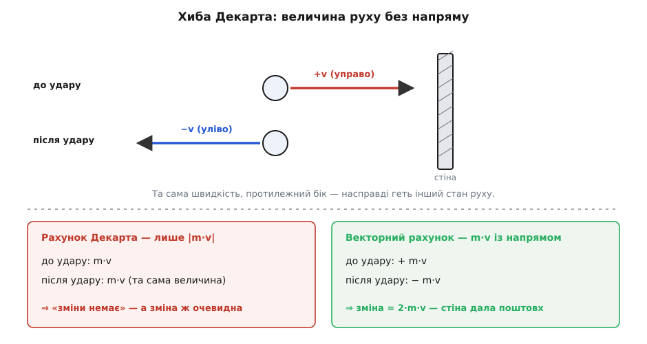
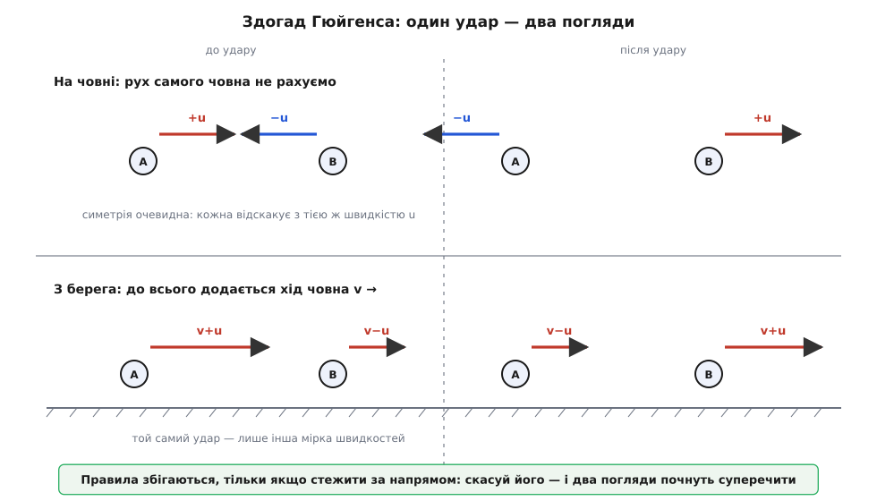
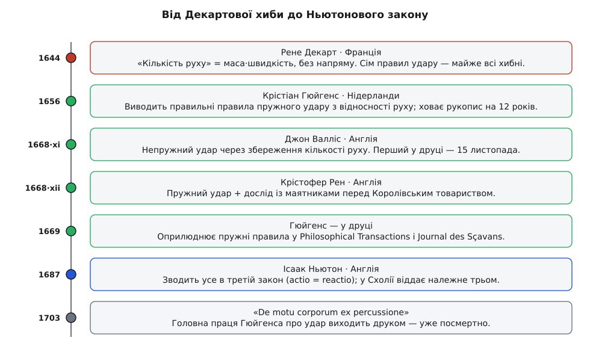

# 📜 Як народився закон рівної протидії: суперечка про зіткнення тіл

Сьогодні «на кожну дію є рівна протидія» звучить майже самоочевидно. Тим дивніше, що ціле покоління найгостріших умів Європи не могло до пуття сказати, що станеться, коли дві кулі стукнуться лобами. Понад двадцять років найкраща теорія руху давала на це відверто хибні відповіді. І виправило її не одне осяяння генія, а **публічне змагання**, до якого Лондонське королівське товариство закликало математиків. Ньютон не витяг «дію-протидію» з порожнечі — він успадкував її від суперечки про більярдні кулі й чесно про це сказав. А вся заковика, через яку найкращі спотикалися, ховалася в одному-єдиному слові: **напрям**.

## Декартова спокуса: світ зі сталим запасом руху

Почалося з красивої й глибокої думки. Рене Декарт (René Descartes, 1596–1650) у «Началах філософії» (Principia Philosophiae, 1644) припустив, що Бог, розкрутивши світ, тримає його загальну **кількість руху** (лат. *quantitas motus*) незмінною: матерія лише передає рух від тіла до тіла, а сума його по всьому світу стоїть стала навіки. Це був перший ясний **закон збереження** в механіці — прямий предок того, що ми звемо збереженням [кількості руху](book:physics/momentum). За саму ідею — що у стрічці зіткнень і поштовхів щось лишається недоторканим — Декартові належить чимала шана.

Та далі криється пастка. Кількість руху Декарт міряв як масу, помножену на **швидкість** — на голе додатне число, величину без знаку. Наскільки швидко тіло рухається — рахував; **куди** воно рухається — викидав. І з цієї мірки він вивів сім правил того, що діється, коли два тіла зустрічаються. Мірка була скалярна — правила вийшли хибні.

## Куди зникає напрям: чому гола величина брехала

Візьмімо найпростіший випадок, на якому Декартова лічба тріщить одразу. Куля летить просто на стіну й відскакує назад із тією ж швидкістю. За Декартовим рахунком до удару було `m·v`, після удару — `m·v`; число не ворухнулося, отже, «нічого не змінилося». Але змінилося **все**: куля, що летіла праворуч, тепер летить ліворуч, а стіна дала їй цілком реальний поштовх — рівно подвоєну кількість руху.


*Куля вдаряється в стіну й відскакує з тією ж швидкістю. Скалярний рахунок Декарта (лише величина `m·v`) не бачить різниці «до» і «після» — і оголошує, що поштовху не було. Векторний рахунок стежить за знаком: `+m·v` перед ударом, `−m·v` після, зміна `2·m·v` — стіна таки штовхнула.*

Ось де корінь провалу. Голе число не вміє відрізнити `+v` від `−v`, а в лобовому зіткненні саме цей знак — уся суть справи: два рухи з протилежними знаками можуть відніматися, ба навіть цілком гаситися. Тому більшість із семи Декартових правил були просто неправильні, а деякі суперечили тому, що бачить кожне око. За одним із них, скажімо, мале тіло, налетівши на велике нерухоме, мусило відскочити, а велике — не зрушити ніколи, за будь-якої швидкості нальоту; це лише крайня межа, а не загальний закон. Декарт вивів світобудову з чистого розуму — і на дрібниці, на викинутому напрямі, розум його підвів.

> 🔧 **Навіщо це.** Хиба Декарта жива й досі — як типова помилка початківця. Хто пише фізику для гри чи симуляції й тримає кількість руху як просту величину, без знаку по кожній осі, дістає рівно Декартів світ: стіна «нічого не робить», більярд застигає, відскоки брешуть. Кількість руху — **вектор**; тільки-но заведеш на кожну вісь окремий знак, зіткнення враз оживають. Три з половиною століття тому на цьому спіткнувся найкращий філософ Європи.

## Гюйгенс бачить першим: відносність повертає напрям

Першим побачив вихід нідерландець Крістіан Гюйгенс (Christiaan Huygens, 1629–1695). Уже близько 1656 року він дійшов, що Декартові правила удару хибні, і знайшов правильні. Його зброєю став **принцип відносності руху** (той самий, що згодом стане [відносністю Ґалілея](book:physics/galilean-relativity)): зіткнення, побачене з човна, який рівно й тихо пливе повз, мусить коритися тим самим законам, що й побачене з берега — природа не може дбати, хто «насправді» рухається, ти чи вода.

Гюйгенс почав із випадку, де ніхто не сперечається: дві однакові кулі, що мчать назустріч із рівними швидкостями, відскакують теж із рівними швидкостями, дзеркально. А тепер пропливімо повз цю сцену на човні — і, оскільки з човна до кожної швидкості просто додається хід самого човна, той самісінький симетричний удар обертається на загальний, несиметричний. Перенести відому відповідь із простого випадку в складний вдається **лише** тоді, коли крізь зміну погляду ти проніс знак швидкості. Викинь напрям, як Декарт, — і два описи одного удару почнуть суперечити один одному.


*Угорі — симетричний удар на борту: дві однакові кулі підлітають зі швидкостями `+u` і `−u` й розлітаються з `−u` і `+u`. Унизу той самий удар із берега: до всіх швидкостей додано хід човна `v`, тож числа інші — та це одна й та сама подія. Опис сходиться лише за умови, що напрям (знак) збережено крізь зміну погляду.*

Із цього простого мисленнєвого досліду Гюйгенс вичавив усе: у пружному ударі **відносна** швидкість тіл перевертається; векторна сума `m·v` зберігається; а на додачу зберігається й друга величина — сума `m·v²`, яку тоді звали **живою силою** (лат. *vis viva*), а нині впізнаємо як подвоєну [кінетичну енергію](book:physics/kinetic-energy). Він записав це у трактаті «De motu corporum ex percussione» («Про рух тіл від удару») близько 1656 року — і поклав рукопис у шухляду на дванадцять років. Лише 1661-го, гостюючи в Лондоні, він переповів свої правила наживо Крістоферові Рену й Вільямові Броункеру.

Чому мовчав? Гюйгенс публікував скупо, шліфував без кінця, вагався — і ця обережність коштувала йому чистої першості в друці. Історія науки повниться такими шухлядами: відкриття, про яке ніхто не знає, майже не існує, доки хтось інший не дійде того самого й не встигне сказати вголос.

## Змагання 1668 року: троє відповідей, що збіглися

1668 року Королівське товариство, спрагле твердої механіки, винесло задачу про зіткнення тіл на розсуд математикам. І сталося рідкісне: надійшли три незалежні відповіді, і всі три збіглися — бо всі стояли на тому самому векторному рахунку кількості руху.

- **Джон Валліс** (John Wallis, 1616–1703), англійський математик і один із засновників Товариства, подав свій розв'язок 15 листопада 1668 року. Він узяв **непружне** зіткнення — коли тіла після удару злипаються й рухаються разом; жива сила при цьому частково гине, а от кількість руху зберігається до останку. Валліс перший потрапив у друк.
- **Крістофер Рен** (Christopher Wren, 1632–1723) подав своє 17 грудня 1668 року. Він розібрав **пружний** удар — ті самі правила, що й Гюйгенс. А що це був Рен, він ще й поставив **дослід**: продемонстрував зіткнення куль-маятників перед самим Товариством. Так, той самий Рен, який згодом зведе собор Святого Павла в Лондоні, — архітектор, астроном і фундатор Товариства заразом.
- **Крістіан Гюйгенс** надіслав свій розв'язок на початку 1669 року. Пружний удар; надруковано в «Philosophical Transactions» і паризькому «Journal des Sçavans».

Невдовзі француз Едм Маріотт (Edme Mariotte, бл. 1620–1684) присвятив дослідові з маятниками цілий окремий трактат.


*Ланцюг подій: Декартова скалярна кількість руху (1644) → правильні пружні правила Гюйгенса, схована в шухляду (1656) → змагання Королівського товариства, де Валліс узяв непружний удар, а Рен — пружний із дослідом (1668) → друк Гюйгенса (1669) → Ньютонів третій закон, що звів усе докупи (1687).*

Варто чітко розкласти, хто де стоїть, бо тут легко змішати першість. Ідею Гюйгенс мав **найраніше** — ще 1656 року, та ще й поділився нею з Реном у Лондоні 1661-го; тож незалежність трьох розв'язків 1668 року — це радше великодушне Ньютонове слово, ніж повна правда, бо Рен уже чув Гюйгенсові міркування. А от у **друці** першим був Валліс. Одне діло — дійти думки, інше — покласти її на папір для світу; ці дві першості тут належать різним людям, і плутати їх не варто.

## Ньютонів синтез: від більярдних куль до закону всіх сил

І аж тепер на кін виходить Ньютон — зі своїми «Началами» (Philosophiæ Naturalis Principia Mathematica, 1687). Тут головне зрозуміти, чого він **не** робив: він не відкривав правил зіткнення. І сам це каже — відкрито, у **Схолії** (грец. *skhólion* — пояснювальна примітка), яку долучив одразу за трьома законами руху. Його власними словами, переказаними українською:

> «Тими самими [законами] разом із третім законом сер Крістофер Рен, доктор Валліс і пан Гюйгенс — найбільші геометри нашого часу — кожен окремо визначили правила зіткнення й відскоку твердих тіл і майже водночас сповістили про них Королівське товариство, цілком узгоджуючись між собою. Доктор Валліс був дещо раніший із оприлюдненням, за ним Рен, а насамкінець Гюйгенс. Рен підтвердив істину перед Королівським товариством дослідом із маятниками, який пан Маріотт невдовзі визнав за гідне пояснити в цілому окремому трактаті».

Отже, правила удару Ньютон чесно поклав до ніг попередників. Його власний стрибок був інший і глибший. Він побачив, що те саме зведення рахунків, яке сходиться в кожному зіткненні, — це один-єдиний всесвітній факт: **будь-яка сила приходить парою**, рівною і протилежною, чи то тіла торкаються, чи тягнуть одне одного крізь порожнечу, як тяжіння. Правило про більярдні кулі він підняв до **аксіоми про всяку взаємодію** взагалі й поставив поруч з інерцією та `F = m·a`. Ось його латина з «Начал»:

```
Actioni contrariam semper & æqualem esse reactionem:
sive corporum duorum actiones in se mutuo semper esse
aequales & in partes contrarias dirigi.
```

«На кожну дію є завжди рівна їй протидія; тобто взаємні дії двох тіл одне на одне завжди рівні й спрямовані в протилежні боки».

І тут відкривається те, що змагальники 1668 року тримали в руках, але не вимовили як загальний закон: збереження кількості руху й третій закон — **два боки однієї монети**. Рівні й протилежні сили, діючи однаковий час, дають рівні й протилежні поштовхи; тож скільки кількості руху одне тіло набуває, стільки ж друге втрачає, а сума не зрушить з місця. Троє геометрів довели один бік монети — що рахунок переживає всяке зіткнення. Ньютон викарбував саму монету й відбив на ній другий бік.

## Що кому належить

Розкладімо наостанок чесно, бо історія любить злипатися в один зручний портрет самотнього генія. Статус усього нижче — **усталений**: він задокументований самим Ньютоном у Схолії й друком у «Philosophical Transactions», а не постав із пізньої легенди чи національного міфу.

- **Ідея, що рух — величина з напрямом (вектор), а не голе число:** спільно — першим Гюйгенс (1656, у шухляді), далі Валліс, Рен і Гюйгенс у 1668–69 роках.
- **Поділ на випадки:** непружний удар — Валліс; пружний — Рен і Гюйгенс.
- **Дослід:** маятники Рена перед Товариством; трактат Маріотта.
- **Загальний закон — рівна протидія для всіх сил, як одна аксіома, і його близнюк, збереження кількості руху:** Ньютон (1687).

І про походження — просто й точно, без приписувань одній короні: Декарт і Маріотт — французи, Гюйгенс — нідерландець, Валліс, Рен і Ньютон — англійці. Жодна нація не «винайшла» цього закону сама; це була європейська естафета, а найчеснішим її літописом лишається сама Ньютонова Схолія.

Ось у чому сіль. Охайний, майже дитячий на вигляд закон — «дія дорівнює протидії» — ховав у собі тонку думку: що рух несе напрям. Саме її найкращі уми ловили ціле покоління. А найбільший із них, Ньютон, лишився в пам'яті ще й тому, що, ставши на чужі плечі, назвав, на чиї саме.
