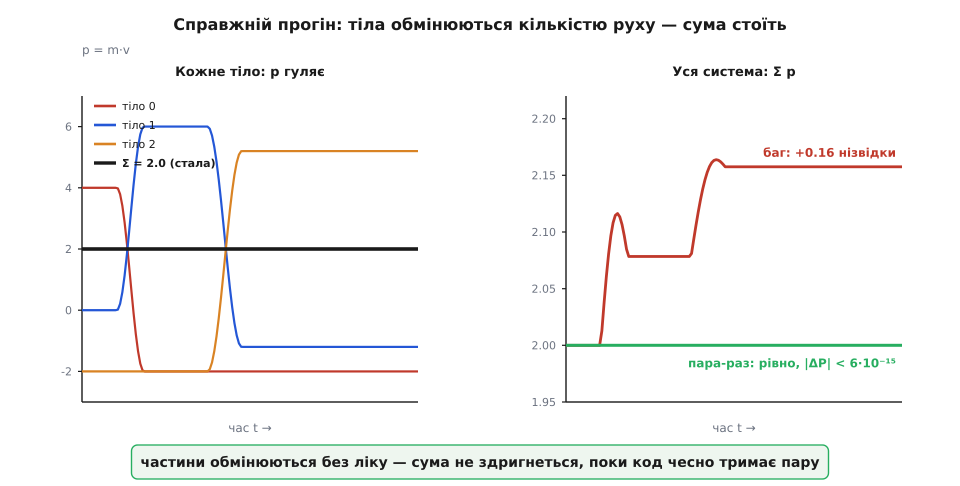
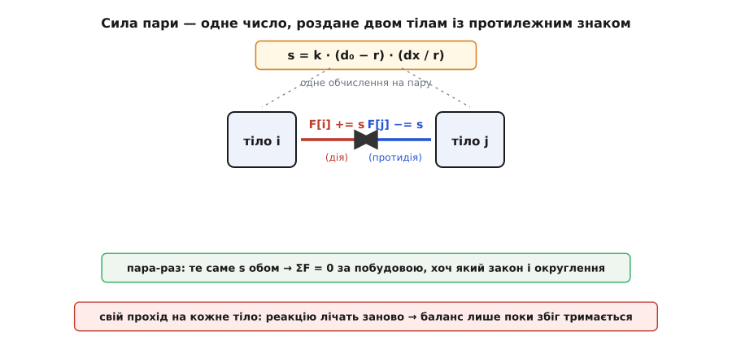

# ⚙️ Симуляція зіткнень: кількість руху, яку не можна загубити

Дамо кільком тілам штовхати одне одного — і більше нічого. Жодної сили ззовні: тільки відпих, коли двоє надто зблизяться, як пружинка між буферами вагонів. Пустимо їх назустріч, дамо позіштовхуватися й розлетітися, а самі весь час стежитимемо за однією-єдиною величиною — сумарною [кількістю руху](topic:physics/momentum) системи, тобто сумою `m·v` по всіх тілах. Питання просте на слух і підступне на ділі: чи встоїть ця сума, поки всередині коїться штовханина?

Фізика відповідає впевнено: встоїть, і то ідеально, бо всі сили тут внутрішні й ходять парами дія-протидія, а пара нічого не додає до спільного рахунку. Але фізика — це одне, а числова машина, що додає округлені дроби мільйон разів, — трохи інше. І ось де починається справжня задача цього проєкту: не просто «порахувати рух», а **написати цикл так, щоб закон збереження став властивістю самого коду**, а не щасливим збігом, який доводиться щоразу перевіряти. Виявиться, що між правильним і майже-правильним кодом — один знак і одне рішення, де саме порахувати силу пари.

## Модель: тіла, що відпихаються дотиком

Візьмемо найпростіше, що вже показує всю суть, — рух уздовж прямої (1D). Кожне тіло має масу `m`, координату `x` і швидкість `v`. Взаємодія одна: коли центри двох тіл зближуються ближче за `d₀` (сума їхніх радіусів — вони «торкнулися»), між ними прокидається пружний відпих, тим сильніший, чим глибше вони вдавилися одне в одного:

```
перекриття  = d₀ − r        (r — відстань між центрами)
сила на тіло = k · перекриття,  напрямлена вздовж лінії центрів, урозтіч
```

Поза дотиком (`r ≥ d₀`) сила нульова — тіла летять вільно. Ця сила консервативна й строго симетрична: скільки штовхає одне, стільки ж і назустріч. Саме такий контактний відпих ховається за «пружним зіткненням» більярдних куль; ми просто робимо його м'яким, щоб інтегратор устигав його розгледіти. Перехід до 2D нічого не змінює по суті: `x` стає вектором `(x, y)`, `r` — довжиною різниці, а сила напрямлена вздовж одиничного вектора між центрами. Уся логіка збереження — та сама.

## Серце програми: цикл по парах

Ось місце, де вирішується все. Нам треба зібрати повну силу на кожне тіло. Спокуса — думати «по тілах»: візьму тіло, обійду всіх його сусідів, складу сили. Але правильно думати **по парах**. У пари два кінці; порахуймо силу пари **один раз** і покладімо її обом тілам — одному з плюсом, другому з мінусом. Тоді рівність дія-протидія навіть не перевіряється: вона вбудована в те, що ми двічі використали те саме число.

Внутрішній цикл біжить `j` від `i+1` — кожну пару зачіпаємо рівно раз (верхня половина матриці пар). Це не тільки вдвічі менше роботи; це і є той механізм, що робить третій закон безкоштовним інваріантом:

:::tabs
```python
def pair_forces(x, k, d0):
    """Силу кожної ПАРИ лічимо раз; +s тілу i, −s тілу j."""
    n = len(x)
    F = [0.0] * n
    for i in range(n):
        for j in range(i + 1, n):          # кожна пара рівно раз: i < j
            dx = x[i] - x[j]
            r = abs(dx)
            if 0.0 < r < d0:               # тіла торкаються?
                s = (k * (d0 - r)) * (dx / r)   # сила НА i, уздовж лінії центрів
                F[i] += s                  # дія
                F[j] -= s                  # протидія: те саме s, протилежний знак
    return F
```
```c
/* Силу кожної пари лічимо раз; +s тілу i, −s тілу j. */
void pair_forces(int n, const double *x, double *F, double k, double d0) {
    for (int i = 0; i < n; i++) F[i] = 0.0;
    for (int i = 0; i < n; i++)
        for (int j = i + 1; j < n; j++) {        /* кожна пара раз: i < j */
            double dx = x[i] - x[j];
            double r  = fabs(dx);
            if (r > 0.0 && r < d0) {             /* торкаються? */
                double s = k * (d0 - r) * (dx / r);  /* сила на i */
                F[i] += s;                        /* дія */
                F[j] -= s;                        /* протидія — те саме s */
            }
        }
}
```
```rust
// f — окремий буфер сил. Компілятор Rust НЕ дасть узяти &mut на два
// елементи масиву водночас — і цим підштовхує до правильного: силу
// пари порахувати РАЗ у скаляр, а вже тоді рознести обом тілам.
fn pair_forces(x: &[f64], f: &mut [f64], k: f64, d0: f64) {
    f.fill(0.0);
    let n = x.len();
    for i in 0..n {
        for j in (i + 1)..n {                 // кожна пара раз: i < j
            let dx = x[i] - x[j];
            let r = dx.abs();
            if r > 0.0 && r < d0 {            // торкаються?
                let s = k * (d0 - r) * (dx / r); // сила на i
                f[i] += s;                    // дія
                f[j] -= s;                    // протидія: те саме s
            }
        }
    }
}
```
:::

Три мови кажуть те саме, але кожна додає свій відтінок. C оголює гарячий цикл до металу: два масиви `double`, жодних об'єктів, компілятор розкладе `F[i] += s; F[j] -= s;` на кілька інструкцій — так і пишуть справжні N-тільні розрахунки, де тіл мільйони. Rust розповідає окрему повчальну історію. Спробуйте в ньому написати «в лоб» — узяти `&mut x[i]` і `&mut x[j]` водночас, щоб штовхнути обидва тіла з одного місця, — і компілятор відмовить: два одночасні мутабельні позики в один зріз заборонені. Ця, здавалося б, прикрість насправді підказка: не мутуй два тіла з однієї сили. Порахуй силу пари в окремий скаляр `s`, склади її в буфер `f` — і аж потім рознось. Правило безпеки мови веде рукою рівно туди, куди веде й фізика.

Обчислювальна мова тут — доречно системна: це щільний числовий цикл по парах, гаряча точка, де важать такти й кеш ([чому саме така складність — нижче](topic:algorithms/asymptotic-complexity) стисло: вкладені цикли по всіх парах дають O(N²) роботи). Python лишаємо як найпрозоріший виклад алгоритму; для справжніх N тіл беруть C чи Rust.

## Повна програма і крок інтегрування

Лишилося рухати тіла. Візьмемо силу, перетворимо на прискорення через [другий закон Ньютона](topic:physics/newtons-second-law) — `a = F/m` — оновимо швидкості, потім координати. Це напівнеявний (симплектичний) Ойлер: тіла рушають уже **новою** швидкістю, що дає стійку, майже консервативну за енергією траєкторію. Але — тримайте цю думку — для збереження кількості руху вибір інтегратора не важить зовсім: аби сили були рівні й протилежні, будь-яка схема `v += F/m·dt` збереже суму `m·v` точно, бо `Σ mᵢ·Δvᵢ = Σ Fᵢ·dt = 0`.

```python
m  = [1.0, 3.0, 2.0]              # маси, кг
x  = [0.0, 2.0, 5.0]             # координати, м
v  = [4.0, 0.0, -1.0]            # швидкості, м/с
k, d0, dt = 200.0, 1.0, 0.002    # жорсткість Н/м, діаметр дотику м, крок с

def total_momentum():
    return sum(m[i] * v[i] for i in range(len(m)))

P0 = total_momentum()
worst = 0.0
for _ in range(1200):
    F = pair_forces(x, k, d0)
    for i in range(len(m)):
        v[i] += F[i] / m[i] * dt     # a = F/m — другий закон
    for i in range(len(m)):
        x[i] += v[i] * dt            # рушаємо тіла вже новою швидкістю
    worst = max(worst, abs(total_momentum() - P0))

print(P0, total_momentum(), worst)
```

Три тіла: легке (1 кг) летить праворуч зі швидкістю 4, важче (3 кг) стоїть на дорозі, третє (2 кг) суне ліворуч назустріч. Стартова кількість руху — `1·4 + 3·0 + 2·(−1) = 2` кг·м/с. Пускаємо 1200 кроків (2.4 с модельного часу), за які встигають кілька зіткнень. Ось що друкує програма:

```
P на старті:      2.000000000000000
P у кінці:        1.999999999999997
найбільший відхил: 5.55e-15
швидкості в кінці: [-2.000243, -0.399999, 2.60012]
```

Сумарна кількість руху не зрушила з `2` до п'ятнадцятого знака: найбільше відхилення за весь прогін — `5.55·10⁻¹⁵`, тобто десяток останніх бітів `double`, чиста похибка округлення без жодного напрямку — не дрейф, а тремтіння на рівні машинного нуля. А тіла тим часом обмінялися рухом дощенту: перше з `+4` відскочило на `−2`, друге з нуля розігналося аж до `+6` і осіло на `−1.2`, третє з `−2` полетіло на `+5.2`. (Побіжна перевірка, що симуляція справді фізична, а не випадкова: кінетична енергія `½Σmv²` тримається коло `9` Дж від початку до кінця — контактна пружина консервативна, тож удари виходять пружні.)


*Той самий прогін. Ліворуч: кількість руху кожного тіла (`pᵢ = mᵢ·vᵢ`) шалено міняється під час зіткнень, а їхня сума (товста чорна) стоїть рівно на 2.0 — частини торгуються, ціле не ворухнеться. Праворуч: сумарна кількість руху. Правильний код (зелена) тримає 2.0 до 10⁻¹⁵; варіант із типовим багом (червона) вигадує з нічого +0.16 — і саме під час зіткнень, коли сили ненульові.*

Ліва панель — і є весь зміст закону на одній картинці: усередині системи кількість руху переливається туди-сюди без ліку, а зверху сума лежить рівнесенько, мов лінійка. [Центр мас](topic:physics/center-of-mass) системи через це рухається так, наче зіткнень немає взагалі: рівномірно й прямо, бо `Σ mᵢvᵢ = M·v_цм`, а ця сума стала.

## Пастка: як загубити кількість руху й не помітити

Тепер найповчальніше. Напишімо цикл «по тілах» — так, як підказує перша інтуїція. Для кожного тіла окремо обійдемо всіх інших, зберемо його силу й одразу штовхнемо:

```python
def each_body_own_pass(x, m, v, k, d0, dt):
    """Пастка: для кожного тіла лічимо його силу окремим проходом."""
    n = len(x)
    for i in range(n):
        F = 0.0
        for j in range(n):
            if j == i: continue
            dx = x[i] - x[j]
            r = abs(dx)
            if 0.0 < r < d0:
                F += (k * (d0 - r)) * (dx / r)   # реакцію лічимо ЗАНОВО
        v[i] += F / m[i] * dt
        x[i] += v[i] * dt        # тіло i вже зрушило — наступні бачать НОВЕ x[i]
```

Отут чигає найпідступніша частина всієї теми, і чесно про неї сказати важливіше, ніж злякати. Якби ми не рушали тіло всередині проходу, а спершу порахували всі сили з одного знімка координат, ця «наївна» версія **теж збереже кількість руху** — до тих самих `5.55·10⁻¹⁵`. Чому? Бо сила на `i` від `j` — це `(x[i]−x[j])/r · k·перекриття`, а сила на `j` від `i` — `(x[j]−x[i])/r · k·перекриття`. У [числах із рухомою комою](topic:programming/floating-point) різниця `a−b` і `b−a` — точні протилежні (округлення до найближчого симетричне коло нуля), а множення на те саме додатне число знак зберігає. Отже, дві незалежно порахованих сили пари виходять бітом-у-біт протилежні, і сума все одно нуль. Наївний код **здається** правильним — і саме тому небезпечний.

Небезпечний, бо тримається на збігу, який легко зламати, а зламавши — не помітити. Досить однієї з дрібниць, які трапляються в реальному коді щодня:

- **Рух тіла всередині проходу** (як у коді вище: `x[i] += …` перед тим, як наступні тіла лічитимуть свою взаємодію з `i`). Тепер, коли тіло `i` дивилося на сусіда, той був на старому місці, а коли сусід згодом дивиться на `i` — той уже на новому: два обчислення тієї самої пари вже не протилежні. Пара розбалансовується, і кількість руху тече. Запускаємо — і замість рівного `2.0` бачимо, як `P` повзе `2.0 → 2.076 → 2.158` і застигає на `2.157560`: майже **8% кількості руху взялося з порожнечі**. Причому росте воно тільки поки тіла в дотику — щойно вони розлетілися й сили згасли, фальшива сума замерзає. Це видно на червоній кривій праворуч.
- **Обрізання сили на тіло** (`if F > Fmax: F = Fmax` — так рятуються від вибуху при глибокому перекритті). Обріжеться сила на одному тілі пари, а на другому ні — і рівність розлетілася. У нашому прогоні такий запобіжник наробив відхилу `0.28`.
- **Несиметрична формула чи поріг** — будь-яка асиметрія в тому, як «тіло A відчуває B» проти «B відчуває A».

Спільна мораль одна: у проході «по тілах» збереження кількості руху — це **щоразова випадковість**, яку доводиться берегти й перевіряти. Варто десь просочитися асиметрії — і закон тихо ламається, а програма далі бадьоро рахує неправду.

## Чому «пара-раз» незламна

Поверніться до правильного циклу й придивіться, чому він імунний до всього переліченого. Ми ніде не рахуємо «реакцію» окремо. Ми рахуємо число `s` **один раз** і робимо буквально два записи: `F[i] += s` і `F[j] -= s`. Це те саме `s` — той самий біт-у-біт `double`, лише з переверненим знаком. Хай машина округлить `s` як завгодно грубо — обидва тіла успадкують **однакове** округлене число, тож пара лишиться зрівноваженою до останнього біта, хоч би який був закон сили, поріг чи обрізання. Джерела, яке могло б підкинути системі зайвий рух, у коді просто немає.


*Ідіома «пара-раз». Силу пари `s` рахуємо один раз і кладемо обом тілам із протилежним знаком — те саме число, тож `ΣF = 0` за побудовою, незалежно від закону сили й округлення. Прохід «по тілах», де реакцію лічать заново, зрівноважений лише поки тримається числовий збіг.*

Ті `5.55·10⁻¹⁵`, що ми таки бачили, беруться не з дисбалансу пари, а з двох єдиних місць, де округлення справді щось губить: ділення спільної сили на різні маси (`F[i]/m[i]`) і повторне множення `m·v` при самому вимірюванні суми. Ця решта — обмежений шум, що не накопичує зсуву, тому й не дрейфує за 1200 кроків ані на йоту. Порівняйте з багом, де відхил ріс монотонно: там була систематична теча, тут — лише останній біт, що тремтить коло нуля.

> 🔧 **Навіщо це.** Той самий прийом — «порахувати парну взаємодію раз і рознести з протилежним знаком» — тримає на собі всю обчислювальну фізику, від молекулярної динаміки до симуляцій галактик. У великих N-тільних кодах збереження кількості руху свідомо роблять **машинно-точним інваріантом**, а не покладаються на точність інтегрування: інтегратор нехай гуляє в енергії й траєкторії, а сума `m·v` мусить стояти як укопана, бо це найпростіша й найсуворіша перевірка, що в силах ніде не загубився партнер. Побачив дрейф кількості руху — знай: десь пара розбалансована, шукай асиметрію.

## Складність і пастки

**O(N²) — і чому половина матриці не лінь, а користь.** Обхід усіх пар коштує `~N²/2` обчислень сили; для великих `N` це і є вузьке місце (справжні коди рятуються деревами Барнса-Гата чи сітками сусідів, зводячи роботу до `N·log N`). Але зверніть увагу: наш цикл `j = i+1 … n` не просто економить половину — саме він **дає** третій закон даром, бо кожну пару ми бачимо рівно раз і одразу роздаємо обом. Повний цикл `j = 0 … n` (кожну пару двічі) не тільки вдвічі повільніший, а й спокуса порахувати реакцію заново — просто викиньте його.

**Паралельність.** Щойно ви розкидаєте пари по потоках, `F[j] -= s` стає гонитвою: два потоки пишуть в один акумулятор. Наївний `+=` загубить внески — і разом із ними кількість руху. Ліки: атомарне додавання, або власний масив сил на кожен потік із подальшим підсумовуванням, або розбиття на плитки так, щоб кожну пару чіпав лише один потік. Хоч би як — принцип «одне `s`, два протилежні записи» треба вберегти й у паралельному коді.

**Збереження кількості руху ≠ збереження енергії ≠ точність.** Це три різні речі, і їх легко сплутати. Наша сума `m·v` точна **структурно** — від форми циклу. А от [енергія](topic:physics/energy-conservation) зберігається лише приблизно й залежить від інтегратора: симплектичний Ойлер чи Верле тримають її добре, звичайний Ойлер поволі роздуває. Траєкторія ж узагалі тим точніша, чим менший `dt`. Тож рівна лінія кількості руху — **не** доказ, що симуляція фізично точна; це лише доказ, що ви ніде не зламали третій закон. Це необхідна перевірка, не достатня.

**Сингулярні сили й softening.** Наша контактна пружина скінченна, тож проблем немає. Але для тяжіння чи кулонівської сили `~1/r²` при `r → 0` сила вибухає, крок перескакує, і симуляція «вистрілює» тіла в нескінченність. Тоді в знаменник додають маленьке `ε` (softening): `r² → r² + ε²`. Важливо — робити це **симетрично для пари**, інакше знову розбалансуєте дію й протидію.

**Списки сусідів мусять берегти обидва кінці.** Коли переходять на сітки чи дерева, легко занести пару `(i, j)` до списку `i`, але забути дзеркальний внесок у `j`. Реакція випаде — і кількість руху потече. Правило те саме: побачив пару — обслужи обидва її кінці одним числом.

Отож уся демонстрація зводиться до одного речення, яке варто тримати в голові щоразу, як пишете взаємодію двох тіл: **не рахуйте силу двічі — рахуйте пару раз**. Тоді третій закон Ньютона перестає бути формулою, яку треба пам'ятати, і стає формою вашого циклу, яку неможливо порушити ненароком. Всесвіт веде свій рахунок бездоганно; хай і ваша програма веде так само.
