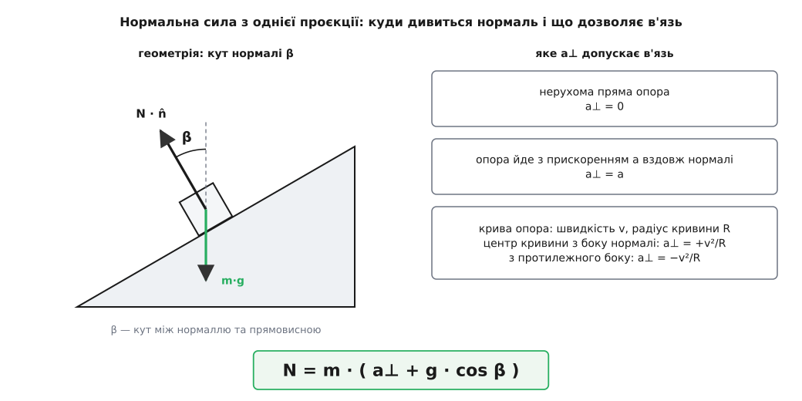
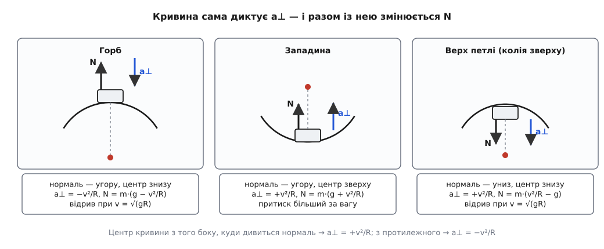

# 🧮 Нормальна сила в різних в'язях: розрахунок

Нормальну силу ніде не беруть готовою — її щоразу видобувають з однієї-єдиної скалярної рівності: проєкції другого закону Ньютона на нормаль до поверхні. Нижче ця рівність виведена в загальному вигляді, а тоді з неї, майже без нових зусиль, випадають усі класичні випадки: схил, ліфт, розігнаний клин, віраж, горб, западина, мертва петля й купол, з якого зісковзує тіло.

## Одна проєкція, одна невідома

Нехай **n̂** — одиничний вектор нормалі до поверхні, напрямлений від опори до тіла. Опора вміє тільки штовхати, тож її дія на тіло — це N·n̂ з невід'ємним N. [Другий закон Ньютона](book:physics/newtons-second-law) для тіла:

```
m·a = N·n̂ + m·g + F
```

де F — усе інше, що на тіло діє. Тепер помножимо обидві частини скалярно на n̂. Це не фокус, а вибір саме тієї осі, на якій сидить невідома: [тертя](book:physics/friction) напрямлене вздовж поверхні, тож його проєкція на нормаль дорівнює нулю, і так само зникає будь-яка тяга чи гальмування вздовж дотику. Лишається одна рівність з однією невідомою:

```
m·(a · n̂) = N + m·(g · n̂)
```

Позначмо β — кут між нормаллю n̂ і прямовисною вгору. Вектор g дивиться прямовисно вниз, тому g·n̂ = −g·cos β. А a·n̂ — це a⊥, складова прискорення **тіла** вздовж нормалі. Звідси

```
N = m · ( a⊥ + g · cos β )
```

Уся подальша робота зводиться до двох чисел: β — куди дивиться нормаль, і a⊥ — яке прискорення впоперек поверхні дозволяє в'язь. Решта — арифметика. І зверніть увагу: β не зобов'язаний бути гострим. Коли колія над тілом, як на вершині петлі, нормаль дивиться вниз, β = 180°, cos β = −1 — тяжіння вже не притискає тіло до опори, а відтягує від неї.

### Звідки береться a⊥

Прискорення впоперек поверхні не вільне: його диктує сама умова «тіло лишається на опорі». Здобувають його так — рівняння в'язі диференціюють двічі за часом, бо в другий закон входять саме прискорення.

Плоска нерухома підлога, вісь y угору: в'язь y(t) = 0, отже ẏ = 0, отже ÿ = 0, тобто a⊥ = 0. Опора рухається — підлога ліфта, y(t) = s(t): a⊥ = s̈ = a. Найцікавіше — тіло на колі радіуса R:

```
x² + y² = R²                      в'язь: тіло на колі

d/dt:     x·ẋ + y·ẏ = 0           швидкість перпендикулярна до радіуса
d/dt:     ẋ² + ẏ² + x·ẍ + y·ÿ = 0
          x·ẍ + y·ÿ = −(ẋ² + ẏ²) = −v²

ліва частина — це R·(a · r̂), де r̂ = (x, y)/R — одиничний радіус назовні:

          a · r̂ = −v²/R           від'ємне, тобто до центра
```

Прискорення обов'язково має складову v²/R, напрямлену до центра, — [центрострімке прискорення](book:physics/centripetal-acceleration) тут не постулюється, а падає з двократного диференціювання самої в'язі. Знак у формулі для N звідси очевидний: якщо центр кривини з того боку, куди дивиться нормаль, то a⊥ = +v²/R; якщо з протилежного — a⊥ = −v²/R.


*Два числа — і нормальна сила відома: кут нормалі від прямовисної й те прискорення впоперек, яке допускає в'язь.*

Лишається умова, яку легко проґавити: **N ≥ 0**. Опора штовхає, але не тримає — приклеїтися до неї немає чим. Це не окраса, а частина задачі: коли формула дає нуль, в'язь на межі, а від'ємне значення означає, що припущення «тіло на поверхні» вже неправдиве і рівняння треба переписувати. На цій нерівності стоять усі умови відриву, що трапляться далі.

## Прямі в'язі: коли кривини немає

Коли поверхня пряма й нерухома, a⊥ = 0, і від формули лишається сама геометрія:

```
рівна підлога:    β = 0,     a⊥ = 0     →   N = m·g
схил під кутом θ: β = θ,     a⊥ = 0     →   N = m·g·cos θ
```

На схилі важливо, що a⊥ = 0 навіть тоді, коли тіло розганяється вниз: в'язь забороняє рух **упоперек** поверхні, а вздовж неї тіло вільне, і жодного внеску в нормальну проєкцію той рух не дає.

Ліфт — той самий випадок з рухомою опорою: нормаль дивиться вгору (β = 0), а a⊥ дорівнює прискоренню кабіни:

```
розгін угору на a:   a⊥ = +a   →   N = m·(g + a)
розгін униз на a:    a⊥ = −a   →   N = m·(g − a)
вільне падіння:      a⊥ = −g   →   N = 0
```

**Розігнаний клин.** Тепер щось, чого простим розкладанням ваги не візьмеш. Клин із гладенькою похилою гранню під кутом θ розганяють горизонтально з прискоренням A. За якого A брусок поїде разом із клином, не сповзаючи? Невідомих тут дві — N і A, — тож самої нормальної проєкції замало, додаємо горизонтальну:

```
горизонталь:   N · sin θ = m · A
прямовисна:    N · cos θ = m · g
```

Поділивши перше рівняння на друге, дістаємо tan θ = A/g, а звідси обидві відповіді:

```
A = g · tan θ            N = m·g / cos θ
```

Загальна формула дає те саме, тільки коротше: β = θ, прискорення тіла горизонтальне, тож його проєкція на нормаль a⊥ = A·sin θ, і N = m·(g·cos θ + A·sin θ); підставивши A = g·tan θ, маємо m·g·(cos²θ + sin²θ)/cos θ = m·g/cos θ.

**Клин під 20°, брусок 2 кг** (g = 9.8 м/с²).

```
θ = 20°,   tan θ = 0.3640,   cos θ = 0.9397

потрібне прискорення:   A = g · tan θ = 9.8 · 0.3640    = 3.57 м/с²
нормальна сила:         N = m·g / cos θ = 19.6 / 0.9397 = 20.9 Н
для порівняння, вага:   m·g = 2 · 9.8                   = 19.6 Н
```

Опора тисне на 6.4 % дужче за вагу — бо та сама нормаль тепер робить дві роботи заразом: тримає тіло проти тяжіння й розганяє його вбік.

**Віраж.** Похилий поворот дороги описують ті самі два рівняння — змінилося лише те, що горизонтальне прискорення вже не довільне, а центрострімке, v²/R:

```
tan θ = v² / (g·R)              N = m·g / cos θ
```

Це і є розрахунковий кут віражу: за такої швидкості поворот тримається взагалі без тертя, самою нормальною силою.

**Віраж радіуса 60 м із нахилом 15°.**

```
tan 15° = 0.2679,   cos 15° = 0.9659

розрахункова швидкість:  v = √(g·R·tan θ) = √(9.8 · 60 · 0.2679)
                           = √157.5 = 12.6 м/с = 45 км/год
нормальна сила:          N = m·g / cos 15° = 1.035 · m·g
```

## Криві в'язі: горб і западина

Дорога рідко буває пряма в прямовисній площині. Хай ділянка має радіус кривини R, а машина йде по ній зі швидкістю v. Нормаль в обох випадках дивиться вгору (β = 0), а різниця тільки в тому, з якого боку центр кривини.

На **горбі** центр знизу, з протилежного до нормалі боку, тому a⊥ = −v²/R:

```
N = m · (g − v²/R)
```

Нормальна сила спадає з квадратом швидкості й обертається на нуль, коли v²/R доростає до g:

```
v_відрив = √(g·R)
```

Швидше — і машина злітає з горба, бо тяжіння вже не встигає загинати її траєкторію донизу так круто, як вигнута дорога.

У **западині** центр кривини зверху, з того ж боку, куди дивиться нормаль, тож a⊥ = +v²/R і знак міняється на протилежний:

```
N = m · (g + v²/R)
```

**Горб і западина радіуса 40 м.**

```
відрив на горбі:  v = √(g·R) = √(9.8 · 40) = √392 = 19.8 м/с = 71 км/год

на 50 км/год (13.9 м/с):   v²/R = 193.2 / 40 = 4.83 м/с²
      горб:      N = m · (9.8 − 4.83) = 4.97·m  ≈ 0.51 · m·g
      западина:  N = m · (9.8 + 4.83) = 14.6·m  ≈ 1.49 · m·g
```

Одна й та сама машина на однаковій швидкості тисне на дорогу в западині майже втричі дужче, ніж на горбі, — і це чиста геометрія, ніякої різниці ні в покритті, ні в гумі.

> 🔧 **Навіщо це.** Сила тертя не перевищує μ·N, тож на вершині горба, де N упала вдвічі, удвічі падає й найбільша можлива сила гальмування — а гальмівний шлях відповідно подовжується. Дорога під колесами та сама, зчеплення «зникло» суто через кривину. Із того самого рахунку — і зворотне: у западині притиск у півтора раза більший за вагу, і саме туди припадають найбільші навантаження на підвіску та на міст.


*Знак a⊥ вирішує все: він визначається лише тим, з якого боку від тіла лежить центр кривини траєкторії.*

## Мертва петля

Усередині вертикальної петлі колія оточує тіло, і нормаль скрізь дивиться до центра — з того ж боку, тож a⊥ = +v²/R. Відлічуймо кут θ від вершини петлі: тоді нормаль відхилена від прямовисної на β = 180° − θ, тобто cos β = −cos θ, і

```
N(θ) = m · (v²/R − g·cos θ)
```

Але швидкість тут не стала: тіло то підіймається, то опускається. Якщо колія гладенька, її дає [закон збереження енергії](book:physics/energy-conservation) — від вершини до точки θ тіло опускається на R·(1 − cos θ):

```
v² = v_в² + 2·g·R·(1 − cos θ)
```

Підставивши це в попереднє, дістаємо нормальну силу в кожній точці петлі через одну-єдину величину — швидкість на вершині:

```
N(θ) = m · ( v_в²/R + 2g − 3g·cos θ )
```

Ця функція зростає монотонно: θ росте від 0 до 180°, cos θ спадає, від'ємний доданок слабшає. Отже, найменша нормальна сила — на самій вершині, і вся умова «тіло не відірветься **ніде** на петлі» стискається в одну точку:

```
N(0) ≥ 0   ⟺   v_в² ≥ g·R   ⟺   v_в ≥ √(g·R)
```

Той самий поріг √(g·R), що й на горбі, — і не випадково: в обох випадках нуль настає тоді, коли самої лише сили тяжіння точно вистачає на потрібне центрострімке прискорення.

Швидкість унизу випливає з тієї ж енергії: від вершини до низу тіло опускається на 2R, тому v_н² = v_в² + 4·g·R ≥ 5·g·R. А внизу центр кривини вже зверху, зате й нормаль дивиться вгору, тож знову a⊥ = +v²/R і β = 0:

```
N_н = m · (g + v_н²/R) ≥ m · (g + 5g) = 6·m·g
```

І остання гарна дрібниця: якщо вести петлю на найменшій можливій швидкості, v_в² = g·R, уся картина стискається в один рядок

```
N(θ) = 3·m·g · (1 − cos θ)
```

— нуль на вершині, 3mg збоку, 6mg унизу.

**Петля радіуса 5 м, велосипедист із велосипедом — разом 70 кг.**

```
найменша швидкість на вершині:  v_в = √(g·R)   = √(9.8 · 5) = 7.0 м/с  = 25 км/год
швидкість унизу:                v_н = √(5·g·R) = √245       = 15.7 м/с = 56 км/год
притиск унизу:                  N_н = 6·m·g = 6 · 70 · 9.8  = 4116 Н
                                      (стільки важать 420 кг)
```

Шість g — це вже те навантаження, за якого тривала дія відбирає людині зір і свідомість, і саме тому справжні петлі атракціонів не роблять круглими. Атракціон Revolution у парку Six Flags Magic Mountain, відкритий 1976 року, став першим сучасним із вертикальною петлею; його конструктор Вернер Штенгель (виробник — Anton Schwarzkopf) зробив петлю не круглою, а клотоїдною — краплеподібною, зі змінним радіусом кривини. Угорі R малий, тому потрібної v²/R вистачає й на малій швидкості; унизу R великий, тому та сама формула N = m·(g + v²/R) дає значно менше за 6mg.

## Купол: та сама алгебра з іншим знаком

Тепер поверніть в'язь навиворіт — покладіть тіло **зверху** опуклої поверхні. Куля лежить на маківці гладенької півсфери радіуса R і зісковзує зі стану спокою. Нормаль дивиться назовні, від центра, тобто центр кривини з протилежного до неї боку: a⊥ = −v²/R. Кут α відлічуємо від маківки, і тут β = α:

```
N(α) = m · (g·cos α − v²/R)
```

Енергія знову дає швидкість, тільки старт нульовий: v² = 2·g·R·(1 − cos α). Підстановка робить із цього напрочуд просту річ:

```
N(α) = m·g·cos α − 2·m·g·(1 − cos α) = m·g · (3·cos α − 2)
```

Нормальна сила падає від mg на маківці до нуля, коли 3·cos α = 2. Ані маса, ані радіус у цю умову не входять: кут відриву однаковий і для кульки на кавуні, і для лижника на сніговому горбі.

**Купол радіуса 3 м.**

```
кут відриву:        cos α = 2/3   →   α = 48.2°     (не залежить ні від m, ні від R)
падіння до нього:   h = R·(1 − cos α) = R/3         = 1.0 м
швидкість там:      v = √(2·g·R/3) = √(2 · 9.8 · 3 / 3) = √19.6 = 4.43 м/с
```

Далі куля летить уже сама по собі, [балістичною траєкторією](book:physics/projectile-motion), і купола більше не торкається.


*Увігнута в'язь додає до тяжіння, опукла віднімає від нього — звідси і 3mg·(1 − cos θ) зсередини петлі, і mg·(3cos α − 2) на куполі.*

## Коли формула дає від'ємне

Усі критичні умови вище — одна й та сама умова, записана в різних декораціях. Прирівняймо загальну формулу до нуля:

```
N = 0    ⟺    a⊥ = −g · cos β
```

Читається це так: в'язь відпускає тіло тієї миті, коли самого тяжіння **точно** вистачає на те прискорення впоперек поверхні, якого вимагає геометрія руху. Поки тяжіння завелике проти потреби, надлишок компенсує опора, і N > 0. Коли зрівнялося — опора зайва. А далі опорі довелося б **тягнути**, чого вона не вміє: клей між колесом і дорогою не передбачений.

Тому насправді в'язь описується не рівнянням, а трійкою умов. Позначмо d — зазор між тілом і опорою:

```
d ≥ 0            тіло не проникає в опору
N ≥ 0            опора лише штовхає
d · N = 0        або дотик і сила, або зазор і нуль сили
```

Третій рядок — не окремий закон, а склейка двох перших: сила є лише там, де є дотик, а де є зазор, там сила нульова. Така пара нерівностей із добутком-нулем називається **умовою доповняльності**, і саме через неї контакт — задача не з рівняннями, а з розгалуженням: спершу припускаємо гілку «d = 0, N ≥ 0», рахуємо N — і якщо вийшло від'ємне, розв'язок не підправляють, а викидають разом із припущенням та переходять на гілку «N = 0, d > 0», де тіло вже вільне.

Ось чому обчислена нормальна сила дає більше, ніж число: разом із відповіддю вона повертає межу власної правдивості — швидкість, за якої машина злетить із горба, кут, під яким куля покине купол, і найменший розгін, з яким узагалі можна вести петлю.
