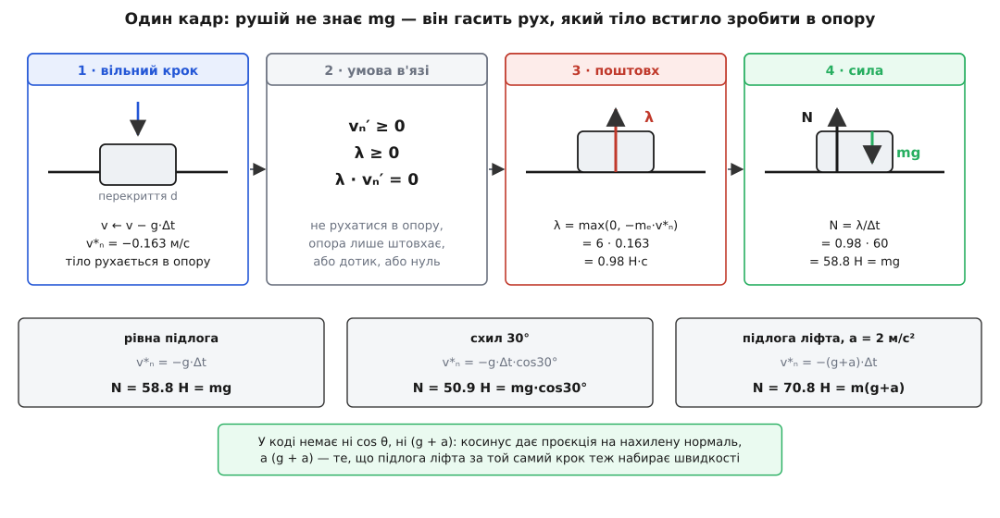
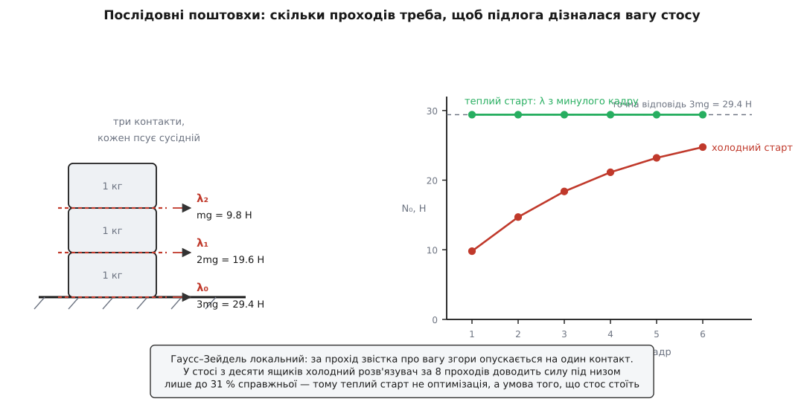

# ⚙️ Як рушій рахує силу контакту: нормальна сила зі скінченного кроку часу

У симуляції немає ні атомів, ні пружних зв'язків: підлога — це рівняння прямої в пам'яті, персонаж — жменя чисел. Проте шістдесят разів на секунду хтось мусить видати те саме число, що його видає справжній стіл: таку силу, щоб тіло не пройшло крізь опору, і саме `mg`, коли воно просто стоїть. Ця вставка — про машинку, яка це число робить: чому найчесніша на вигляд модель «поверхня як цупка пружина» на кроці 1/60 с непридатна, яку задачу розв'язують натомість і як виглядає робочий код, що видає 58.8 Н під шестикілограмовим ящиком.

## Кадр, у якому ще ніщо не тримає

Рушій живе фіксованим кроком. Раз на `Δt = 1/60 с ≈ 16.7 мс` він збирає сили, оновлює швидкості, зсуває тіла — і все. У цьому циклі немає нічого, що заважало б тілу опинитися там, де його бути не може:

```
v ← v + (F/m)·Δt          швидкість від сил
x ← x + v·Δt              нове положення — уже, можливо, всередині підлоги
```

Перекриття тут не халепа кепсько написаного рушія, а неминучий наслідок дискретності. За один кадр тіло пролітає `v·Δt`, і це багато:

```
v =   5 м/с (людина біжить):   5 · 1/60   = 8.3 см за кадр
v =  30 м/с (машина):         30 · 1/60   = 50 см за кадр
v = 300 м/с (куля):          300 · 1/60   = 5 м за кадр
```

Отже, розв'язувач береться до роботи тоді, коли тіло вже зайшло за межу дозволеного. І питання перед ним не «яка формула для N» — формули він знати не може: йому не сказано, чи це схил, чи підлога ліфта, чи низ стосу з десяти ящиків. Йому дано лише геометричну умову «не проникати» — і саме з неї, щокадру, наново, він мусить дістати число.

## Спокуса вдавати пружину

Найпряміший код виписується просто з фізики опори. Поверхня прогинається — то нехай і буде пружиною: наскільки тіло влізло, настільки й відпихаємо. Це називають **методом штрафу** (penalty method) — за проникання «штрафують» силою:

```
N = k·d + c·ḋ            d — глибина перекриття, k — цупкість, c — демпфер
```

Десять рядків, жодного розв'язувача. І тут усе ламається.

Цупкість `k` не вільна: її задає те, наскільки глибоко ти дозволяєш тілу тонути. Для рівноваги `k·δ = mg`, тобто `k = mg/δ`. А `k` разом із масою задає власну частоту тієї пружини — і, що прикметно, маса скорочується ([закон Гука](book:physics/hookes-law): відсіч пружного тіла пропорційна до стиснення, а частота коливань такої системи — `ω = √(k/m)`):

```
ω = √(k/m) = √(g/δ)

δ = 1 мм:    ω =   99 рад/с
δ = 0.1 мм:  ω =  313 рад/с
δ = 0.01 мм: ω =  990 рад/с
```

Напівнеявне інтегрування — те, яким і крокують рушії, — тримає коливальну систему стійкою лише поки `ω·Δt < 2`; далі за один крок пружина встигає перескочити рівновагу з надлишком, і амплітуда росте від кадру до кадру. Для `δ = 1 мм` це `Δt < 20 мс` — кадр на 16.7 мс уже майже на межі, і це для **одного** тіла.

Тепер постав на цю підлогу справжню сцену. Цупкість доводиться брати за найважчим тілом: щоб вантажівка на 1000 кг просіла лише на міліметр, треба `k = 9.8·10⁶ Н/м`. І на тій самій підлозі:

```
ω·Δt при k = 9.8·10⁶ Н/м, Δt = 1/60 с

  вантажівка 1000 кг:   ω =     99 рад/с    ω·Δt =    1.65    (ледве-ледве)
  ящик          1 кг:   ω =   3131 рад/с    ω·Δt =   52.2     (розліт)
  камінець      1 г:    ω =  98995 рад/с    ω·Δt = 1649.9     (катастрофа)
```

Цупкість задає найважче тіло, а стійкість — найлегше, а між ними в будь-якій людній сцені різниця в тисячі разів. Але добиває навіть не це, а сама дискретність. Хай тіло підлітає до підлоги зі швидкістю 1 м/с. Перш ніж пружину взагалі опитають, тіло за один кадр влізе на 1.7 см:

```
занурення за кадр:      d = v·Δt = 1.0 · 1/60      = 0.0167 м
відсіч пружини:         N = k·d  = 9.8·10⁶ · 0.0167 = 1.63·10⁵ Н

а це за той самий кадр додає швидкості вгору Δv = (N/m)·Δt:
  вантажівці 1000 кг:   2.7 м/с          (прилетіла на 1 — відскочила на 2.7)
  ящику 1 кг:           2.7·10³ м/с
  камінцю 1 г:          2.7·10⁶ м/с      (зник зі сцени назавжди)
```

Метод штрафу програє не через недбальство. Він чесно **моделює** цупкість — а щоб промацати десять мільйонів ньютонів на метр, її треба опитувати з частотою в десятки кілогерців. У рушія є шістдесят герців. Вихід — той самий, на який указує сама природа реакції в'язі: не моделювати матеріал, а **накласти умову** й дозволити силі набути того значення, якого умова вимагає.

## Питати не про силу, а про поштовх

За один крок сила й поштовх — те саме, з точністю до множника: `λ = N·Δt`. Різниця в тому, що поштовх можна знайти, не знаючи жодної цупкості.

Хай `n̂` — одинична нормаль контакту, напрямлена з опори до тіла. Спершу рушій робить **вільний крок**: додає до швидкостей усе, що діє, не зважаючи ні на які в'язі, і дістає `v*` — швидкість, яку тіло *мало б*, якби опори не було. Її нормальна складова `v*ₙ = v*·n̂` від'ємна: тіло рухається в опору. Тепер шукаємо поштовх `λ` уздовж `n̂`, який це виправить:

```
vₙ′ = v*ₙ + λ/mₑ ≥ 0        після поштовху не рухатися в опору
λ ≥ 0                        опора вміє тільки штовхати
λ · vₙ′ = 0                  або дотик і поштовх, або відхід і нуль
```

Це та сама трійця «не проникати — не тягти — одне з двох», тільки перенесена з відстаней на швидкості: на кроці `Δt` дешевше стежити, щоб тіло не *рухалося* в опору, ніж щоб не *перебувало* в ній. Умови однобічного контакту в такому вигляді виписав італійський механік **Антоніо Сіньйоріні**: коротка нотатка 1933 року, де він назвав їх «неоднозначними крайовими умовами», і повний виклад із курсу 1959 року; існування та єдиність розв'язку довів його учень **Ґаетано Фікера** 1963–64 років, і саме він дав задачі ім'я вчителя. Ця хронологія — усталений факт історії механіки суцільних середовищ, а не пізніше приписування.

Розв'язок для одного контакту видно з першого погляду:

```
λ = max(0, −mₑ · v*ₙ)
```

І ось заради чого все затівалося. Ящик просто лежить, діє сама лише вага. Тоді за вільний крок він набирає `v*ₙ = −g·Δt`, звідки `λ = m·g·Δt`, а поділивши на крок:

```
ящик 6 кг, Δt = 1/60 с, g = 9.8 м/с²

вільний крок:   v*ₙ = −g·Δt = −9.8/60          = −0.1633 м/с
поштовх:        λ  = m·|v*ₙ| = 6 · 0.1633      =  0.98 Н·с
сила:           N  = λ/Δt = 0.98 · 60          =  58.8 Н  =  m·g
```

Ніде в коді немає числа `mg`. Розв'язувач міряє, наскільки тіло за крок спробувало влізти в опору, і гасить рівно цей рух — а вага потрапляє у відповідь через `v*ₙ`, через ту швидкість, яку вона встигла надати за `Δt`. Цифрова підлога «знає», скільки штовхати, з тієї самої причини, що й дерев'яний стіл: вона відповідає не на вагу, а на спробу руху.

Найкраще це видно, коли міняється обстава, а код лишається той самий:

```
                            v*ₙ                  λ = −m·v*ₙ       N = λ/Δt

рівна підлога          −g·Δt        = −0.1633      0.9800 Н·с      58.8 Н  = mg
схил 30°               −g·Δt·cos30° = −0.1415      0.8487 Н·с      50.9 Н  = mg·cos30°
підлога ліфта, a = 2   −(g+a)·Δt    = −0.1967      1.1800 Н·с      70.8 Н  = m(g+a)
```

Косинус не вписаний у код — він з'явився з проєкції вільної швидкості на нахилену нормаль. `(g + a)` теж ніхто не програмував: підлога ліфта за той самий крок набирає власної швидкості вгору, тож зближення виходить більшим. Одна формула на три класичні задачі — бо всі три задають ту саму умову, просто в різних декораціях.


*Рушій ніде не зберігає mg. Він міряє рух, який тіло встигло зробити в опору за крок, і гасить його невід'ємним поштовхом; поділений на крок, той поштовх і є нормальна сила.*

### Чому mₑ, а не m

Для тіла, що може ще й обертатися, у знаменнику стоїть не маса, а **ефективна маса контакту**. Поштовх у ріг ящика частково не піднімає його, а крутить, тож точка дотику від того самого поштовху зрушується дужче — контакт «відчуває» легше тіло:

```
1/mₑ = 1/m₁ + 1/m₂ + (r₁ × n̂)²/I₁ + (r₂ × n̂)²/I₂
```

де `rᵢ` — вектор від центра мас до точки дотику, а `I` — [момент інерції](book:physics/moment-of-inertia): міра того, як важко тіло розкрутити, — що далі маса від осі, то він більший. Для ящика 0.4 × 0.4 м масою 4 кг (`I = 0.107 кг·м²`):

```
дотик під центром мас (плече 0):        mₑ = 4.00 кг
дотик зі зсувом 0.10 м:                 mₑ = 2.91 кг
дотик під рогом, зсув 0.20 м:           mₑ = 1.60 кг
```

Нерухома опора входить сюди без жодної особливої гілки: у неї `1/m = 0` та `1/I = 0`, тож обидва її доданки тихо зникають. У загальному записі `1/mₑ = J·M⁻¹·Jᵀ`, де `J` — рядок якобіана в'язі, а `M⁻¹` — обернена матриця мас; для контакту цей рядок і є «нормаль плюс плече», і нічого більше.

## Кілька контактів — уже не формула, а система

Ящик на підлозі спирається щонайменше двома точками, стос із десяти ящиків має два десятки контактів, купа уламків — сотні. І вони зв'язані: поштовх, яким ти щойно виправив один контакт, змінює швидкість тіла, яке ділять два контакти, — і псує сусідній. Зібравши всі контакти разом, дістаємо

```
w = A·λ + b        A = J·M⁻¹·Jᵀ,   b = J·v*
λ ≥ 0,  w ≥ 0,  λᵀ·w = 0
```

Якби тут стояла рівність, це була б звичайна лінійна система. Нерівність міняє жанр: наперед невідомо навіть, **які** контакти справді несуть навантаження, — частина розійдеться й дістане `λ = 0`, і множину активних контактів треба знайти заразом із силами. Такий клас задач зветься [задачею лінійної доповняльності](book:math/linear-complementarity): знайти невід'ємний вектор, у якого добуток із власною лінійною функцією нульовий покомпонентно. Прямі методи для неї є — у комп'ютерну графіку їх завів **Девід Барафф** статтею «Fast contact force computation for nonpenetrating rigid bodies» (SIGGRAPH '94, с. 23–34), — і вони дають точну відповідь, але коштують близько `O(n³)` і робляться крихкими, щойно до нормальних сил домішується тертя. На 500 контактів у 16-мілісекундному кадрі це не вміщається.

## Послідовні поштовхи: Гаусс–Зейдель із проєкцією

Замість того щоб розв'язувати зв'язану систему, рушій ходить по контактах по черзі. Кожен контакт він розв'язує **точно** — але проти тих швидкостей, які є на цю мить, — і одразу застосовує поштовх, щоб наступний контакт бачив уже виправлену картину. Потім прохід повторюється. Це [метод Гаусса–Зейделя](book:math/gauss-seidel): ітеративний розв'язувач, що йде рівняннями по одному й негайно вживає свіжі значення замість старих; `max(0, ·)` після кожного кроку — проєкція на область `λ ≥ 0`, звідки й назва «проєкційний». В іграх той самий прийом відомий як **послідовні поштовхи**: його виклав **Ерін Катто** в доповіді «Iterative Dynamics with Temporal Coherence» (GDC 2005) і втілив у Box2D.

**Ключова дрібниця, без якої нічого не працює: затискають накопичений імпульс, а не приріст.**

```
Δλ      = mₑ · (bias − vₙ)      скільки бракує саме цьому контактові
λ_нове  = max(0, λ + Δλ)        затиск НАКОПИЧЕНОГО за кадр
подати  (λ_нове − λ)            на швидкості йде тільки різниця
λ       = λ_нове
```

На пізніших проходах сусідній контакт міг перештовхнути — і тоді цьому контактові треба поправка **вниз**, від'ємний приріст. Якби кожен приріст затискали нулем окремо, забрати надлишок було б нічим: сума тільки росла б, і стос у спокої повільно роздувався б угору й дрижав. Коли ж затиск накладено на накопичену суму, від'ємні прирости дозволені, поки підсумок лишається невід'ємним, — а фізичний сенс «опора не тягне» має саме підсумок, бо саме він, поділений на `Δt`, є силою.

**Теплий старт.** Стос за кадр майже не змінився, отже, минулокадрові `λ` — це вже майже точна відповідь. Тож перед першим проходом їх подають як поштовхи, а лічильники починають не з нуля, а з них. Умова тут одна: контакти треба **впізнавати** між кадрами — не створювати заново, а зіставляти за ключем геометричної ознаки (яка вершина в яке ребро впирається). Катто назвав це кешуванням реакцій в'язей, і саме воно перетворює стос, що осідає, на стос, що стоїть.

Ось як це виглядає на числах. Три ящики по 1 кг один на одному, контакти знизу вгору; точні відповіді — `3mg`, `2mg`, `mg`:

```
стос 3 × 1 кг, Δt = 1/60 с, холодний старт (λ = 0), прохід знизу вгору

  прохід      N₀ (низ)     N₁         N₂ (верх)
     1          9.800     4.900       2.450
     2         14.700     8.575       4.287
     3         18.375    11.331       5.666
     4         21.131    13.398       6.699
     5         23.198    14.949       7.474
     6         24.749    16.112       8.056
  точно        29.400    19.600       9.800

теплий старт (λ з попереднього кадру):
     1         29.400    19.600       9.800      ← уже точно, далі не змінюється
```

За шість проходів холодний розв'язувач дійшов лише до 84 % справжньої сили під низом. Причина видна з механіки самого методу: Гаусс–Зейдель локальний, за один прохід звістка про вагу згори опускається рівно на один контакт. Тому з висотою стосу все гіршає стрімко — у стосі з десяти ящиків холодний розв'язувач бере 31 % за 8 проходів, половину за 20 і 90 % аж за 85. Теплий старт із цього погляду — не оптимізація, а сама умова того, що стоси в рушії взагалі стоять: він щокадру приносить готову відповідь, а проходи лишень підправляють її під зміни.


*Один прохід переносить звістку про вагу вниз рівно на один контакт, тож холодний стос осідає; збережені з минулого кадру поштовхи дають правильну відповідь одразу.*

Коли й цього замало — стоси високі, маси різняться на порядки, — сучасні рушії міняють не розв'язувач, а розклад кроку: розбивають кадр на кілька підкроків, розв'язуючи контакти в кожному (так працює Box2D 3.0, що вийшов у серпні 2024 з розв'язувачем Soft Step на підкроках і м'яких в'язях), або впорядковують контакти знизу вгору й проганяють хвилю навантаження за один прохід — прийом ударного поширення з праці Ерана Ґендельмана (Eran Guendelman), Роберта Бридсона (Robert Bridson) і Рональда Федківа (Ronald Fedkiw) «Nonconvex rigid bodies with stacking» (SIGGRAPH 2003).

## Робочий код

Це гарячий цикл: жменя множень на контакт, кілька тисяч викликів за кадр, жодного виділення пам'яті, суцільний прохід масивом. Тут вирішує сира пропускна здатність і розкладка даних у пам'яті, тож обидві мови нижче — системні. **C++** — рідна мова галузі (Box2D, Bullet, PhysX) з POD-структурами й перевантаженими операторами вектора. **Rust** дає ту саму швидкодію, а його позичковий перевіряч цікаво міняє форму коду: два `&mut` в один масив узяти не можна, тож пару тіл дістають явним розщепленням зрізу — рушій Rapier написаний саме так. Скриптова мова тут не проходить за самою суттю задачі: увесь сенс цього коду — не виділяти пам'яті й щільно йти масивом, а це якраз те, чого від неї не добитися.

Контакти на вхід дає окремий шар пошуку зіткнень: пара тіл, одинична нормаль, точки дотику й глибина перекриття. Розв'язувачеві лишається арифметика.

:::tabs
```cpp
#include <algorithm>
#include <vector>
#include <cstdint>

struct Vec2 { float x, y; };
static inline Vec2  operator+(Vec2 a, Vec2 b)  { return {a.x + b.x, a.y + b.y}; }
static inline Vec2  operator-(Vec2 a, Vec2 b)  { return {a.x - b.x, a.y - b.y}; }
static inline Vec2  operator*(Vec2 v, float s) { return {v.x * s, v.y * s}; }
static inline float dot(Vec2 a, Vec2 b)   { return a.x * b.x + a.y * b.y; }
static inline float cross(Vec2 a, Vec2 b) { return a.x * b.y - a.y * b.x; }  // у 2D — скаляр

struct Body {
    Vec2  pos{}, vel{};
    float ang = 0.0f, angVel = 0.0f;
    float invMass = 0.0f;          // 0 → нерухома опора (нескінченна маса)
    float invI    = 0.0f;          // 0 → її ж неможливо розкрутити
};

struct Contact {
    int      a, b;                 // індекси тіл; нормаль дивиться від b до a
    Vec2     n;                    // одинична нормаль контакту
    Vec2     ra, rb;               // від центрів мас до точки дотику
    float    depth;                // глибина перекриття, > 0 = вже влізли
    float    normalMass;           // 1/(J·M⁻¹·Jᵀ) — рахуємо раз на кадр
    float    bias;                 // швидкісний доважок проти утоплення
    float    lambda;               // НАКОПИЧЕНИЙ поштовх; переживає кадр
    uint64_t id;                   // ключ, щоб упізнати цей контакт наступного кадру
};

constexpr float kSlop = 0.005f;    // 5 мм перекриття лишаємо в спокої
constexpr float kBeta = 0.2f;      // яку частку надлишку виправляти за кадр

// швидкість точки дотику: поступальна плюс обертова, ω × r у 2D
static inline Vec2 pointVel(const Body& b, Vec2 r) {
    return { b.vel.x - b.angVel * r.y, b.vel.y + b.angVel * r.x };
}

static inline void applyImpulse(Body& A, Body& B, const Contact& c, float dl) {
    const Vec2 P = c.n * dl;
    A.vel     = A.vel + P * A.invMass;
    A.angVel += A.invI * cross(c.ra, P);
    B.vel     = B.vel - P * B.invMass;
    B.angVel -= B.invI * cross(c.rb, P);
}

// Раз на кадр: ефективна маса, доважок і теплий старт збереженим поштовхом.
void prestep(std::vector<Body>& bodies, std::vector<Contact>& contacts, float dt) {
    for (Contact& c : contacts) {
        Body& A = bodies[c.a];
        Body& B = bodies[c.b];

        const float rnA = cross(c.ra, c.n);
        const float rnB = cross(c.rb, c.n);
        const float k   = A.invMass + B.invMass
                        + A.invI * rnA * rnA + B.invI * rnB * rnB;   // J·M⁻¹·Jᵀ
        c.normalMass = (k > 0.0f) ? 1.0f / k : 0.0f;

        c.bias = (kBeta / dt) * std::max(0.0f, c.depth - kSlop);

        applyImpulse(A, B, c, c.lambda);        // теплий старт
    }
}

// Один прохід по всіх контактах; кличеться 4–10 разів за кадр.
void solveVelocities(std::vector<Body>& bodies, std::vector<Contact>& contacts) {
    for (Contact& c : contacts) {
        Body& A = bodies[c.a];
        Body& B = bodies[c.b];

        const Vec2  dv = pointVel(A, c.ra) - pointVel(B, c.rb);
        const float vn = dot(dv, c.n);                    // < 0 → зближаються

        float dl = c.normalMass * (c.bias - vn);

        const float old = c.lambda;                       // затиск НАКОПИЧЕНОГО:
        c.lambda = std::max(0.0f, old + dl);              // від'ємний приріст дозволено,
        dl = c.lambda - old;                              // поки сума невід'ємна

        applyImpulse(A, B, c, dl);
    }
}

void step(std::vector<Body>& bodies, std::vector<Contact>& contacts,
          float dt, int passes) {
    const Vec2 g = {0.0f, -9.8f};
    for (Body& b : bodies)
        if (b.invMass > 0.0f) b.vel = b.vel + g * dt;     // вільний крок

    prestep(bodies, contacts, dt);
    for (int i = 0; i < passes; ++i)
        solveVelocities(bodies, contacts);

    for (Body& b : bodies) {                              // тепер рухати тіла
        b.pos  = b.pos + b.vel * dt;
        b.ang += b.angVel * dt;
    }
}

// Нормальна сила в ньютонах — для звіту, звуку, зламу, датчика на нозі
inline float contactForce(const Contact& c, float dt) { return c.lambda / dt; }
```
```rust
#[derive(Clone, Copy, Default)]
struct Vec2 { x: f32, y: f32 }

impl Vec2 {
    fn dot(self, o: Vec2) -> f32   { self.x * o.x + self.y * o.y }
    fn cross(self, o: Vec2) -> f32 { self.x * o.y - self.y * o.x }   // у 2D — скаляр
}
impl std::ops::Add for Vec2 {
    type Output = Vec2;
    fn add(self, o: Vec2) -> Vec2 { Vec2 { x: self.x + o.x, y: self.y + o.y } }
}
impl std::ops::Sub for Vec2 {
    type Output = Vec2;
    fn sub(self, o: Vec2) -> Vec2 { Vec2 { x: self.x - o.x, y: self.y - o.y } }
}
impl std::ops::Mul<f32> for Vec2 {
    type Output = Vec2;
    fn mul(self, s: f32) -> Vec2 { Vec2 { x: self.x * s, y: self.y * s } }
}

#[derive(Clone, Copy, Default)]
struct Body {
    pos: Vec2, vel: Vec2,
    ang: f32, ang_vel: f32,
    inv_mass: f32,          // 0.0 → нерухома опора
    inv_i: f32,             // 0.0 → її ж неможливо розкрутити
}

impl Body {
    fn point_vel(&self, r: Vec2) -> Vec2 {          // v + ω × r
        Vec2 { x: self.vel.x - self.ang_vel * r.y,
               y: self.vel.y + self.ang_vel * r.x }
    }
}

struct Contact {
    a: usize, b: usize,     // нормаль дивиться від b до a
    n: Vec2,
    ra: Vec2, rb: Vec2,     // від центрів мас до точки дотику
    depth: f32,
    normal_mass: f32,       // 1/(J·M⁻¹·Jᵀ)
    bias: f32,
    lambda: f32,            // НАКОПИЧЕНИЙ поштовх; переживає кадр
    id: u64,                // ключ упізнання між кадрами
}

const SLOP: f32 = 0.005;    // 5 мм перекриття лишаємо в спокої
const BETA: f32 = 0.2;      // яку частку надлишку виправляти за кадр

// Двох `&mut` в один зріз позичковий перевіряч не дасть — беремо пару явно.
fn pair_mut(v: &mut [Body], i: usize, j: usize) -> (&mut Body, &mut Body) {
    assert!(i != j);
    let (left, right) = v.split_at_mut(i.max(j));
    if i < j { (&mut left[i], &mut right[0]) } else { (&mut right[0], &mut left[j]) }
}

fn apply_impulse(a: &mut Body, b: &mut Body, c: &Contact, dl: f32) {
    let p = c.n * dl;
    a.vel = a.vel + p * a.inv_mass;
    a.ang_vel += a.inv_i * c.ra.cross(p);
    b.vel = b.vel - p * b.inv_mass;
    b.ang_vel -= b.inv_i * c.rb.cross(p);
}

/// Раз на кадр: ефективна маса, доважок і теплий старт.
fn prestep(bodies: &mut [Body], contacts: &mut [Contact], dt: f32) {
    for c in contacts.iter_mut() {
        let (a, b) = pair_mut(bodies, c.a, c.b);

        let rn_a = c.ra.cross(c.n);
        let rn_b = c.rb.cross(c.n);
        let k = a.inv_mass + b.inv_mass
              + a.inv_i * rn_a * rn_a + b.inv_i * rn_b * rn_b;      // J·M⁻¹·Jᵀ
        c.normal_mass = if k > 0.0 { 1.0 / k } else { 0.0 };

        c.bias = (BETA / dt) * (c.depth - SLOP).max(0.0);

        let warm = c.lambda;
        apply_impulse(a, b, c, warm);        // теплий старт
    }
}

/// Один прохід по всіх контактах; кличеться 4–10 разів за кадр.
fn solve_velocities(bodies: &mut [Body], contacts: &mut [Contact]) {
    for c in contacts.iter_mut() {
        let (a, b) = pair_mut(bodies, c.a, c.b);

        let dv = a.point_vel(c.ra) - b.point_vel(c.rb);
        let vn = dv.dot(c.n);                             // < 0 → зближаються

        let mut dl = c.normal_mass * (c.bias - vn);

        let old = c.lambda;                               // затиск НАКОПИЧЕНОГО:
        c.lambda = (old + dl).max(0.0);                   // від'ємний приріст дозволено,
        dl = c.lambda - old;                              // поки сума невід'ємна

        apply_impulse(a, b, c, dl);
    }
}

fn step(bodies: &mut [Body], contacts: &mut [Contact], dt: f32, passes: u32) {
    let g = Vec2 { x: 0.0, y: -9.8 };
    for b in bodies.iter_mut() {
        if b.inv_mass > 0.0 { b.vel = b.vel + g * dt; }   // вільний крок
    }

    prestep(bodies, contacts, dt);
    for _ in 0..passes {
        solve_velocities(bodies, contacts);
    }

    for b in bodies.iter_mut() {                          // тепер рухати тіла
        b.pos = b.pos + b.vel * dt;
        b.ang += b.ang_vel * dt;
    }
}

/// Нормальна сила в ньютонах — для звіту, звуку, зламу, датчика на нозі
fn contact_force(c: &Contact, dt: f32) -> f32 { c.lambda / dt }
```
:::

Доважок `bias` тут — те, що лікує вже накопичене утоплення: до цільової швидкості додають невелику швидкість розсування, пропорційну до надлишку глибини понад `slop`. Із `β = 0.2` надлишок понад `slop` спадає на п'яту частину за кадр, тож усе перекриття тане геометрично (2 см → 1.7 → 1.46 → 1.27 …) — не ривком, який підкинув би тіло, а плавно. Числа `0.005 м` і `0.2` тут не з повітря: це усталені значення Box2D (`b2_linearSlop`, `b2_baumgarte`), перевірені мільйонами сцен.

> 🔧 **Навіщо це.** `λ/Δt` — не службова величина розв'язувача, а те саме, що видає тензодатчик під ногою. Рушії його й віддають назовні: у Box2D нормальний імпульс контакту дорівнює нормальній силі, помноженій на крок, тож поділивши на `Δt`, дістаєш ньютони. На цьому числі стоїть половина ігрової логіки: чи ламається дошка під вагою, як голосно звучить удар, чи витримає міст, коли по ньому їде вантажівка, куди й наскільки прогинається нога персонажа. Помилишся в `λ` — і все, що нижче за течією, теж піде хибно.

## Пастки

**Сила — середня за крок, а не миттєва.** `λ/Δt` — це поштовх, розмазаний по всьому `Δt`. Для контакту, що спокійно тримає, це чесна сила. Для удару — ні: справжній контакт триває мікросекунди, і поділивши поштовх на 16.7 мс, дістанеш величину, у сотні разів меншу за пікову. Тому пороги «зламатися від удару» ставлять на імпульс, а не на силу.

**Розподіл сил між контактами неоднозначний.** Це не хиба методу, а фізика. Стрижень на трьох опорах — задача статично невизначена: самих рівнянь рівноваги замало, і будь-який розподіл із правильною сумою й правильним моментом їх задовольняє. Розв'язувач видасть **якийсь** із них — той, який випливе з порядку обходу:

```
стрижень 12 кг на трьох опорах (−0.5 м, 0, +0.5 м), вага 117.6 Н

порядок зліва направо:   N = [ 19.98   77.63   19.98 ]   сума 117.60
порядок справа наліво:   N = [ 19.98   77.63   19.98 ]   сума 117.60
середню опору першою:    N = [  0.00  117.60    0.00 ]   сума 117.60
```

Два симетричні обходи тут збігаються, а варто взяти середню опору першою — і вона забирає всю вагу, бо гасить і поступальну, і обертову швидкість стрижня разом, не лишивши крайнім опорам чого виправляти. Сума завжди точна, розподіл — ні. Справжній стіл вирішує цю неоднозначність власною деформацією: ніжка, що трохи довша, просідає дужче й бере більше. Модель твердого тіла деформацію викинула — а разом із нею й те, що добирало відповідь. Практичний висновок: не будуй логіку на силі **одного** контакту в надлишковому наборі; питай суму або пильнуй порядок.

**Тіло прослизає повз опору.** Куля летить 5 м за кадр — жодного перекриття не виникає, контакт не народжується, `λ` не рахується, і куля проходить крізь стіну. Лікують окремо від розв'язувача: неперервним пошуком зіткнень (CCD) або «спекулятивними» контактами, що заводяться заздалегідь, за прогнозом.

**Тертя їде верхи на `λ`.** Дотичний поштовх обмежений `μ·λ` ([тертя](book:physics/friction): дотична складова контактної сили не перевищує частки нормальної), причому в тій самій ітерації — тобто межа рухається, поки розв'язувач збігається. Тому тертя розв'язують у тому ж проході, після нормальної складової, і беруть поточне накопичене `λ`.

**Пружний відскок — окрема ціль.** Тут скрізь припускалося `vₙ′ ≥ 0`: тіло просто не рухається в опору. Для удару ціль інша, `vₙ′ ≥ −e·vₙ`, і це вже задача [зіткнення](book:physics/collisions), де коефіцієнт відновлення каже, з якою часткою швидкості тіла розлітаються. Той самий розв'язувач тримає обидва режими, треба лише міняти цільову швидкість — і вимикати пружність нижче порогу швидкості, інакше кожен спокійний контакт вічно теленькатиме.

**Результат залежить від порядку й від чисел із рухомою комою.** Порядок обходу контактів визначає розподіл, а різні порядки підсумовування дають різні останні біти — [числа з рухомою комою](book:programming/floating-point) не мають властивості асоціативності, тож сума залежить від того, як її згрупувати. Для однієї машини це дрібниця, для мережевої гри з покроковою синхронізацією — ні: два клієнти розійдуться. Лікують фіксацією порядку контактів і однаковими прапорцями оптимізації.

**Приспані тіла нічого не рахують.** Коли тіло довго майже не рухається, рушій його «присипляє» й перестає обробляти. Збережений `λ` при цьому лишається останнім порахованим — і код, що читає силу контакту, отримає застаріле число, доки тіло не розбудять.

## Складність

Один контакт за один прохід — це десятка два множень і додавань, одне порівняння на затиск, жодного виділення пам'яті й жодної справжньої гілки: `O(1)` з дуже маленькою сталою. Кадр коштує `O(K·C)`, де `C` — число контактів, `K` — число проходів (типово 4–10), плюс `O(C)` пам'яті на кеш поштовхів, який переживає кадр. Збіжність лінійна, і швидкість її псують дві речі — висота стосу (звістка йде на один контакт за прохід) і відношення мас (важке тіло на легкому робить систему кепсько зумовленою). Прямий розв'язувач задачі доповняльності дав би точну відповідь за `O(n³)`, але саме тому в реальному часі його й не тримають. А головна ціна кадру взагалі не тут: розв'язувач — найдешевша частина рушія, дорожчі за нього пошук пар і побудова самих контактів.

Уся ця машинерія тримається на одному зсуві погляду. Метод штрафу питав «яка сила в цьому матеріалі» — і потонув у цупкості, якої не можна промацати шістдесятьма герцями. Розв'язувач в'язей питає інше: «який найменший невід'ємний поштовх зробить рух допустимим» — і на це питання відповідь є завжди, бо вона не про матеріал, а про геометрію та крок часу. Число, яке з цього виходить, `λ/Δt`, збігається з реакцією опори не випадково: в обох випадках сила не задана наперед, а є рівно тим, чого вимагає умова «крізь опору не пройти».
