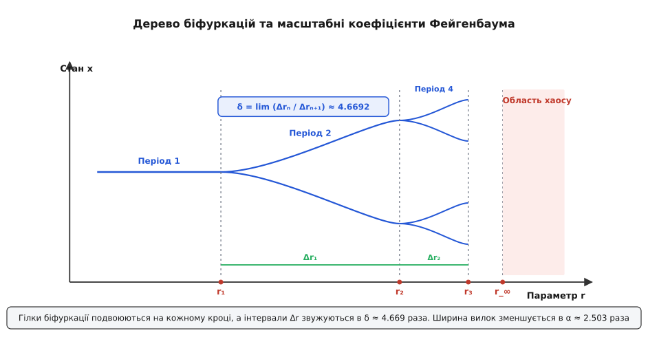
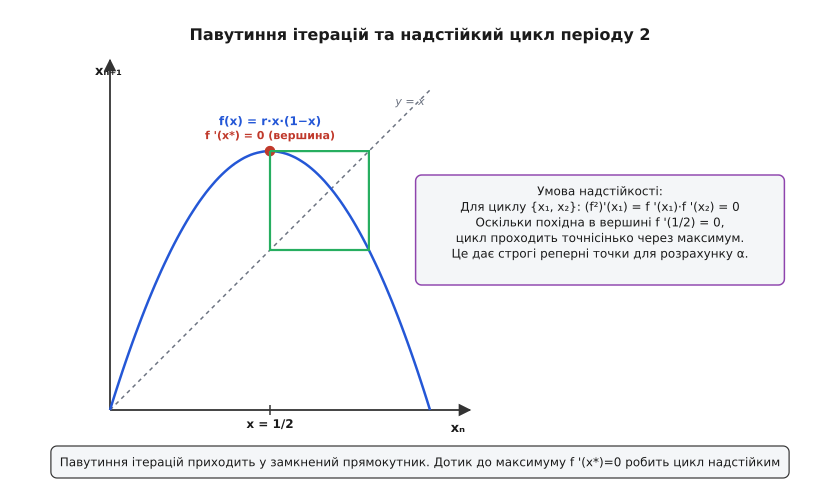
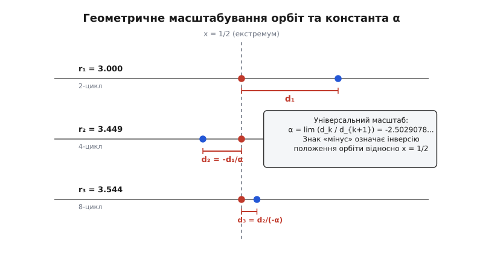
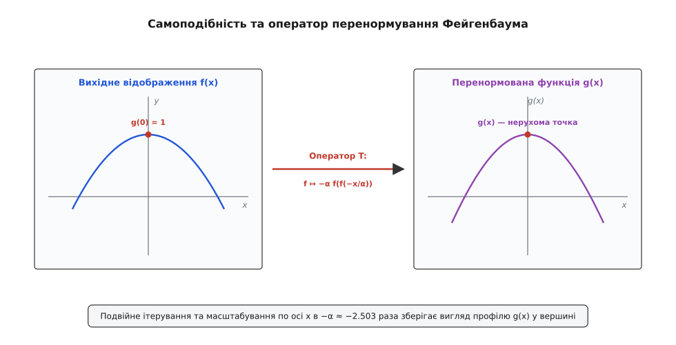
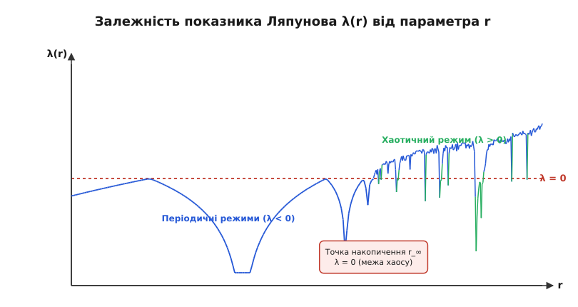

# Каскад подвоєння періоду й стала Фейгенбаума

<preknowlist>
- [Фазовий простір і атрактори](topic:physics/phase-space) — поняття фазової траєкторії, стаціонарних точок та граничних циклів.
- [Нелінійні коливання](topic:physics/nonlinear-oscillations) — вимушені коливання нелінійних систем та автоколивання.
- [Поняття біфуркації](topic:math/bifurcation-theory) — зміна якісної структури фазового портрета при зміні параметра.
- [Логістичне відображення](topic:math/logistic-map) — одновимірне відображення x_{n+1} = r x_n (1 - x_n).
- [Детермінований хаос](topic:physics/deterministic-chaos) — неперіодичний обмежений рух, чутливий до початкових умов.
- [Теорема про центральний многовид](topic:physics/center-manifold-theorem) — чому в момент утрати стійкості вся динаміка згортається на один провідний напрямок.
- [Осцилятор Даффінга](topic:physics/duffing-oscillator) — вимушені коливання в двоямному потенціалі.
</preknowlist>

Коли нелінійну систему (механічний маятник із періодичною зовнішньою силою, конвекційний шар рідини чи електронний контур) піддають поступовому посиленню зовнішнього впливу, її стійкий рух зазнає вражаючої метаморфози. Замість того щоб продовжувати коливатися на одній базовій частоті, система раптово втрачає стійкість і подвоює свій період: тепер точна форма руху повторюється лише через два повних цикли. При подальшому найменшому зростанні параметра це подвоєння повторюється знову й знову з прискореним темпом: період 2 поступається місцем періоду 4, далі 8, 16, 32, аж поки рух не перетворюється на детермінований хаос.

Найдивнішим виявилося те, що геометрія цього накопичення біфуркацій підкоряється універсальним числович законам. Відстані між послідовними точками подвоєння зменшуються в геометричній прогресії з універсальним покажчиком `δ ≈ 4.6692016`, а ширина розщеплення вилок скорочується з коефіцієнтом `α ≈ 2.5029078`. Ці значення не залежать ані від конкретної фізичної природи сил, ані від детального математичного вигляду рівнянь руху — аби тільки нелінійне відображення володіло гладким парним максимумом.

## 1. Загадка впорядкованого хаосу та параметричний резонанс

У класичній механіці й теорії коливань тривалий час панувало переконання, що складні, безладні коливання виникають лише тоді, коли система має величезне число ступенів вільного руху (як у разі молекулярного руху газу чи турбулентного потоку рідини). Проте дослідження другої половини XX століття показали, що навіть найпростіша механічна система з одним-єдиним ступенем вільного руху й нелінійним потенціалом здатна демонструвати складну поведінку, яку неможливо відрізнити від випадкового шуму.

Уявімо маятник із нелінійною відновлювальною силою, який розгойдується періодичною зовнішньою силою з періодом `T`. За малого значення амплітуди збудження маятник швидко здійснює вимушені коливання з тим самим періодом `T`. Якщо повільно підвищувати амплітуду збудження, система проходить через серію якісних перебудов фазового портрета — біфуркацій.

Спочатку період коливань подвоюється до `2T`. На осцилограмі або фазовій площині замкнена траєкторія (граничний цикл) згортається у подвійне кільце: щоб повернутися в початкову точку з тією самою швидкістю, маятнику тепер потрібно здійснити два повні коливальні рухи — один із трохи більшою амплітудою, другий із трохи меншою. При подальшому збільшенні силового параметра подвійне кільце розщеплюється на чотирикратне з періодом `4T`, потім на вісімкратне `8T`, і так далі.

Цей процес називається **каскадом подвоєння періоду** (або каскадом субгармонійних біфуркацій). Інтервали між послідовними значеннями параметра, при яких відбуваються подвоєння, стрімко звужуються. Нескінченна кількість подвоєнь `2¹ → 2² → 2³ → ... → 2ⁿ` накопичується у скінченній точці параметра `r_∞`. За цією точкою межі починається область детермінованого хаосу, де траєкторія ніколи більше не повторюється, хоча весь час залишається обмеженою у фазовому просторі.

### Зведення тривимірного потоку до одновимірного відображення

Як безперервна система диференціальних рівнянь у тривимірному фазовому просторі розв'язків зводиться до одного дискретного рівняння? Відповідь полягає в геометрії стиснення фазового об'єму для дисипативних систем.

У дисипативній механічній чи гідродинамічній системі фазовий об'єм неперервно стискається під дією тертя або в'язкості. Якщо розглянути тривимірну траєкторію в околі атрактора й перетяти її двовимірною площиною Пуанкаре, послідовні точки перетину `(x_n, y_n)` утворюють дискретне відображення. Сильне дисипативне стиснення вздовж одного з напрямків призводить до того, що двовимірна поверхня повернення вироджується у тонку лінію, і координата наступного перетину `x[n+1]` стає майже чистою функцією попередньої координати `x[n]`:

```
x[n+1] = f(x[n], r)
```

За теоремою про центральний багатовид (Center Manifold Theorem), уся складна нелінійна динаміка поблизу точки втрати стійкості спрощується й згортається на один провідний нестійкий напрямок. Це й пояснює, чому одновимірне дискретне відображення здатне з математичною точністю описувати коливання реальних тривимірних диференціальних систем.

## 2. Анатомія подвоєння: від нестійкості до вилки

Щоб зрозуміти механіку виникнення біфуркації подвоєння періоду, зручно перейти від безперервного руху в часі до дискретного відображення Пуанкаре.

Замість того щоб стежити за всією траєкторією коливань, ми фіксуємо стан системи через рівні проміжки часу, що дорівнюють періоду зовнішньої сили `T`. Послідовні значення координати `x[0], x[1], x[2], ...` пов'язані між собою нелінійним відображенням повернення:

```
x[n+1] = f(x[n], r)
```

де `r` — параметр керування (наприклад, амплітуда сили або температура).

Нехай `x*` — стійка нерухома точка відображення `f(x*, r) = x*`, яка відповідає регулярному руху з періодом `T`. Стійкість цієї точки визначається лінійним множником розходження (мультиплікатором) `λ`:

```
λ = f'(x*, r)
```

Поки модуль мультиплікатора менший за одиницю `|λ| < 1`, будь-яке мале відхилення `Δx[n]` від нерухомої точки згасає за законом `Δx[n+1] ≈ λ · Δx[n]`.


*Дерево біфуркацій: з ростом параметра керування r стійкі орбіти послідовно роздвоюються, а відстані між точками біфуркацій зменшуються в геометричній прогресії з покажчиком δ.*

Коли параметр `r` зростає, мультиплікатор `λ` змінюється. Якщо `λ` падає й проходить через від'ємне значення `-1`, стається біфуркація подвоєння (у математиці її називають біфуркацією вилки / pitchfork bifurcation або фліп-біфуркацією):

1. При `λ = -1` відхилення починають змінювати знак на кожному кроці: `Δx[n+1] ≈ -1 · Δx[n]`, тобто сусідні точки стрибають по обидва боки від `x*`.
2. Нерухома точка `x*` втрачає стійкість (стає нестійким вузлом чи сідлом).
3. З неї народжується стійкий цикл періоду 2 — дві нові точки `{x⁽¹⁾, x⁽²⁾}`, які переходять одна в одну під дією `f`:

```
x⁽²⁾ = f(x⁽¹⁾, r)
x⁽¹⁾ = f(x⁽²⁾, r)
```

Математично це означає, що дві нові точки є нерухомими точками **подвійного відображення** `f²(x) = f(f(x))`:

```
f²(x⁽¹⁾, r) = x⁽¹⁾
f²(x⁽²⁾, r) = x⁽²⁾
```

Мультиплікатор нового циклу періоду 2 обчислюється як добуток похідних у двох точках орбіти за правилом ланцюжка:

```
λ₂ = (f²)'(x⁽¹⁾) = f'(x⁽¹⁾) · f'(x⁽²⁾)
```

Одразу після моменту народження циклу значення `λ₂` дорівнює `+1`. При подальшому підвищенні параметра `r` мультиплікатор `λ₂` знову зменшується, проходить через нуль (де цикл стає надстійким) і прямує до `-1`. Як тільки `λ₂` досягає значення `-1`, цикл періоду 2 втрачає стійкість, і з нього виходить стійкий цикл періоду 4.

Цей механізм повторюється каскадом на кожному ступені `2ⁿ`: стійкість втрачається щоразу, коли мультиплікатор відповідного подвоєного відображення проходить через межу `-1`.

### Той самий механізм у числах: парабола

Абстрактне `f(x, r)` показує логіку, але не дає жодного числа — з нього не видно навіть, чи мультиплікатор узагалі доходить до `-1` і при якому значенні параметра. Найпростіша функція з гладким квадратичним максимумом, звичайна парабола, відповідає на це кількома рядками алгебри:

```
x[n+1] = r · x[n] · (1 - x[n])
```

Вершина цієї параболи стоїть у `x = 1/2`, де функція сягає `r/4`; щоб траєкторія не вискочила за межі відрізка `[0, 1]`, параметр не може перевищувати `4`. Нерухомі точки — корені рівняння `x* = r · x* · (1 - x*)`:

```
x* · (1 - r + r · x*) = 0     [винесли x*]
x*₀ = 0                       [тривіальний корінь: рух згасає в нуль]
x*₁ = 1 - 1/r                 [лежить усередині (0, 1) при r > 1]
```

Похідна параболи лінійна, тож мультиплікатор нетривіальної точки рахується одразу:

```
f'(x, r)   = r · (1 - 2 · x)
f'(x*₁, r) = r · (1 - 2 · (1 - 1/r))    [підставили x*₁ = 1 - 1/r]
           = r · (2/r - 1)
           = 2 - r
```

Мультиплікатор не просто змінюється з параметром — він спадає **лінійно**: `λ = 2 - r`, і жодної залежності від самої точки в цьому виразі вже не лишилось. Умова стійкості `|2 - r| < 1` дає смугу `1 < r < 3`, усередині якої будь-який старт із інтервалу `(0, 1)` притягується до `x*₁ = 1 - 1/r`. На верхньому краї смуги `λ = 2 - 3 = -1` — тобто перше подвоєння періоду стається не «десь коло трійки», а точно при `r₁ = 3`.

Далі алгебра дорожчає: точки 2-циклу вже є коренями многочлена четвертого степеня, точки 4-циклу — шістнадцятого, і на цьому пошук точних формул вичерпується. Проте один режим лишається дешевим на будь-якому ступені каскаду — **надстійкий**. Коли одна з точок циклу лягає точно у вершину параболи, похідна `f'(1/2) = 0` обертає на нуль увесь добуток похідних уздовж орбіти, хоч би скільки в ній було точок:

```
λ = f'(x⁽¹⁾) · f'(x⁽²⁾) · ... · f'(1/2) = 0
```

Збіжність до такої орбіти вже не геометрична, а квадратична: відхилення на кожному оберті не множиться на сталу, а підноситься до квадрата. Для 2-циклу умова «вершина належить циклу» записується як `f(f(1/2)) = 1/2` і розв'язується точно:

```
f(1/2)        = r/4
f(f(1/2))     = r · (r/4) · (1 - r/4) = 1/2   [вершина повертається сама в себе через два кроки]
r³ - 4·r² + 8 = 0                             [звели до цілих коефіцієнтів]
(r - 2) · (r² - 2·r - 4) = 0                  [корінь r = 2 дає нерухому точку, не 2-цикл]
r = 1 + √5 ≈ 3.2360680                        [надстійкий 2-цикл]
```

Це значення лежить усередині смуги життя 2-циклу: народжується цикл при `r₁ = 3`, найшвидше збігається при `r ≈ 3.236`, а гине при `r₂ ≈ 3.4494897`, де `λ₂` доходить до `-1` і кожна з двох гілок розщеплюється навпіл. Саме надстійкі значення параметра надалі слугують за мітки каскаду: їх знаходять чисельно швидко й точно, і саме на них міряють просторовий масштаб вилок.

## 3. Універсальність Фейгенбаума та дві сталі

До кінця 1970-х років вважалося, що параметричні значення точок біфуркацій повністю визначаються конкретними деталями системи — рівнянням маятника, силою тертя чи форматом нелінійності. Проте 1975 року американський фізик Мітчелл Фейгенбаум виявив, що каскад подвоєння підкоряється строгим універсальним співвідношенням.

Подробиці того, як Фейгенбаум зробив це відкриття на найпростішому програмованому калькуляторі HP-65 і як його результати спочатку відхиляли провідні журнали, описано у [історичній вставці про відкриття Фейгенбаума](topic:physics/period-doubling-cascade/hist-feigenbaum-discovery.md).

Розглянемо послідовність параметрів `r₁, r₂, r₃, ..., r_n`, при яких відбуваються біфуркації подвоєння періоду від `2ⁿ⁻¹` до `2ⁿ`. Для параболи перші шість її членів такі:

```
r₁ = 3.000000000    народження 2-циклу
r₂ = 3.449489743    народження 4-циклу
r₃ = 3.544090359    народження 8-циклу
r₄ = 3.564407266    народження 16-циклу
r₅ = 3.568759420    народження 32-циклу
r₆ = 3.569691610    народження 64-циклу
```

Важливі тут не самі значення, а те, як швидко стискаються проміжки між ними. 2-цикл живе на смузі завширшки `0.44949`, 4-цикл — уже `0.09460`, 8-цикл — `0.02032`, 16-цикл — `0.00435`, 32-цикл — `0.00093`. Поділивши кожну смугу на наступну, дістаємо ряд

```
4.7514 → 4.6563 → 4.6683 → 4.6688 → ...
```

Числа не розбігаються й не гуляють — вони збігаються, і то швидко.


*Павутиння ітерацій для одновимірного відображення: при досягненні екстремуму f'(x*)=0 орбіта стає надстійкою, визначаючи геометрію масштабного коефіцієнта α.*

### 3.1 Перша стала Фейгенбаума: параметричне масштабування δ

Послідовність інтервалів між сусідніми біфуркаціями `Δr_n = r_n - r_n-1` спадає за законом геометричної прогресії. Відношення довжин двох сусідніх інтервалів при `n → ∞` прямує до універсальної константи:

```
δ = lim (r_n - r_n-1) / (r_n+1 - r_n)   при n → ∞
```

Точне числове значення першої сталої Фейгенбаума:

```
δ = 4.6692016091029909...
```

Фізичний зміст `δ` полягає в тому, що кожен наступний крок подвоєння періоду вимагає приблизно в `4.669` раза меншого приросту параметра керування, ніж попередній. Через це нескінченна кількість подвоєнь вичерпується на скінченній довжині параметричного інтервалу:

```
r_∞ ≈ r_n + (r_n+1 - r_n) / (1 - 1/δ)
```

Для логістичної параболи гранична точка накопичення хаосу дорівнює:

```
r_∞ = 3.569945672...
```

Сила цієї екстраполяції в тому, як мало їй треба на вході. Візьмімо два найперші подвоєння параболи, `r₁ = 3.000` і `r₂ = 3.449`, і далі каскад не міряймо взагалі:

```
r_∞ ≈ 3.000000 + 0.449490 / (1 - 1/4.6692016)
    ≈ 3.000000 + 0.449490 · 1.272541      [δ / (δ - 1)]
    ≈ 3.5720
```

Справжнє значення — `3.5699`; похибка вже на першому кроці менша за `0.06%`. Експериментатор, який спіймав лише два подвоєння, вже знає, де його установка зірветься в хаос, — решту каскаду шукати не треба.

Те саме твердження в іншій формі описує залишок шляху до межі: відстань від `r_k` до точки накопичення спадає геометрично

```
r_∞ - r_k ≈ C · δ⁻ᵏ
```

де `C` — єдина стала, що залежить від конкретного відображення. Уся індивідуальність системи вміщається в цей один множник; **швидкість** спадання від системи не залежить зовсім.

### 3.2 Друга стала Фейгенбаума: просторове масштабування α

Окрім параметричного стиснення `δ`, існує просторовий масштаб геометричного розщеплення вилок на фазовій площині.

Розглянемо надстійкі значення параметра `R_n`, за яких точка екстремуму `x = 0` (або `x = 1/2`) входить до складу циклу періоду `2ⁿ`. Позначимо через `d_n` відстань між точкою екстремуму та найближчою до неї точкою того самого циклу при параметрі `R_n`.


*Відстані від вершини x = 1/2 до найближчої точки надстійкого циклу на трьох послідовних ступенях каскаду: кожна наступна коротша приблизно в 2.5 раза й лежить по інший бік вершини.*

Відношення двох послідовних відстаней `d_n` та `d_n+1` при `n → ∞` прямує до другої універсальної сталої Фейгенбаума:

```
α = lim (d_n / d_n+1)   при n → ∞
```

Точне числове значення другої сталої Фейгенбаума:

```
α = 2.5029078750958928...
```

Знак `α` є від'ємним, якщо враховувати напрям дзеркального перевертання вилки на кожному кроці: `α ≈ -2.5029`. Це означає, що при кожному подвоєнні періоду масштаб елементарних комірок фазового атрактора звужується в `2.503` раза.

Універсальність двох констант `δ` та `α` виявляється в тому, що вони є абсолютно однаковими для будь-яких нелінійних відображень `f(x)`, якщо функція в околі максимуму має гладку квадратичну вершину вида `f(x) = 1 - c · x² + ...`.

## 4. Ідея ренормалізаційної групи

Чому системи зовсім різного походження — від конвекційних комірок у рідкому гелії до нелінійних електронних контурів із варакторами — демонструють абсолютно однакові числові значення `δ ≈ 4.6692` та `α ≈ 2.5029`?

Відповідь дає метод **ренормалізаційної групи** (перенормування), який переносить ідеї фазових переходів другого роду у фізиці конденсованого стану на нелінійну динаміку.


*Фіксована точка оператора перенормування: подвійне ітерування відображення з наступним масштабуванням у −α разів відновлює вихідний вигляд функції в околі максимуму.*

Уявимо, що ми беремо відображення `f(x)` із квадратичним максимумом у нулі `f(0) = 1` і застосовуємо його двічі: `f²(x) = f(f(x))`.

Якщо подивитися на графік функції `f²(x)` у невеликому околі нуля, він виглядає як перевернута й стиснута копія початкового профілю `f(x)`. Щоб відновити початковий масштаб по осі абсцис та ординат, розтягнемо координати в `-α` разів.

Введемо функціональний **оператор перенормування Фейгенбаума-Цвітановича** `T`, який переводить одну функцію в іншу:

```
T f(x) = -α · f( f( -x / α ) )
```

Границя нескінченного застосування оператора перенормування `Tⁿ f(x)` при `n → ∞` прямує до **універсальної нерухомої функції** `g(x)`, яка задовольняє функціональне рівняння:

```
g(x) = -α · g( g( -x / α ) )
```

з нормувальними умовами `g(0) = 1` та `g'(0) = 0`. Масштаб `α` при цьому не є вільним параметром, який добирають ззовні: підстановка `x = 1` у рівняння прив'язує його до самої функції — `g(1) = -1/α`. Тобто друга стала Фейгенбаума є не окремим виміряним числом, а властивістю тієї єдиної функції, що вціліла під перенормуванням.

Строге математичне виведення рівняння Фейгенбаума-Цвітановича, його розклад у степеневий ряд та аналіз спектра лінеаризованого оператора зібрано у [окремій математичній вставці](topic:physics/period-doubling-cascade/math-feigenbaum-renormalization.md).

Ключовий математичний результат полягає в тому, що лінеаризований оператор `L` біля нерухомої точки `g(x)` має **рівно одне нестійке власне значення** `λ₁ > 1`. І це власне значення дорівнює точнісінько першій сталій Фейгенбаума:

```
λ₁ = δ ≈ 4.6692016
```

Усі інші власні значення лінеаризованого оператора лежать усередині одиничного кола `|λ_k| < 1`, і таких стійких напрямків нескінченно багато. Геометрично це означає, що `g` — **сідлова точка корозмірності 1**: у нескінченновимірному просторі функцій вона має нескінченновимірний стійкий многовид `W^s(g)` і рівно один нестійкий напрямок.

Саме звідси й береться універсальність. Стійкий многовид `W^s(g)` розділяє простір функцій, як поверхня розділяє простір; кожне однопараметричне сімейство `f_r(x)` — це крива в цьому просторі, яку параметр `r` протягує крізь нього. У точці перетину крива має саме те відображення, яке під дією `T` іде просто в `g`, — і це критичне значення `r_∞` цього конкретного сімейства. Сусідні ж значення параметра лежать трохи збоку від поверхні й під дією `T` відходять від неї вздовж єдиного нестійкого напрямку зі швидкістю `δ`.

Тому багаторазове застосування `T` стирає з функції все індивідуальне — парабола вона, синус чи експонента, — лишаючи саму лише відстань до `W^s(g)`. Множина всіх сімейств, що перетинають цю поверхню, і зветься **класом універсальності**: для фізика це різні прилади й різні керівні величини, для оператора перенормування — одна й та сама геометрія.

## 5. Фізичні втілення та лабораторні експерименти

Каскад подвоєння періоду зі сталею Фейгенбаума `δ ≈ 4.6692` — це не просто абстрактна математична модель. Він виявлений у величезній кількості реальних фізичних та інженерних систем, де вимірювальні прилади демонструють появу гармонік половинної частоти у спектрах потужності.

### 5.1 Теплова конвекція Ралея-Бенара в рідкому гелії
У класичному експерименті Альбера Лібшабера тонкий шар рідкого гелію-4 утримувався при температурі близько 4 Кельвінів і піддавався вертикальному нагріву. Керуючим параметром слугувало число Ралея `Ra`, пропорційне різниці температур між нижньою й верхньою гранями. 
- При малом `Ra` у рідині виникав стаціонарний конвекційний валик.
- При зростанні `Ra` валик починав коливатися з періодом `T`.
- З подальшим нагріванням послідовно з'являлися коливання з періодами `2T`, `4T`, `8T`.
- Виміряний спектр потужності температурних датчиків показував піки на субгармонійних частотах `f₀/2, f₀/4, f₀/8`, а амплітуда нових піків зменшувалася на універсальний коефіцієнт `20 · log₁₀(α) ≈ 8.2 dB`.
- Експериментальне значення сталої склало `δ_експ = 4.4 ± 0.6`.

### 5.2 Нелінійні електронні контури (діодні резонатори)
У радіофізиці каскад подвоєння найпростіше спостерігається в послідовному RLC-контурі, де ролі нелінійного елемента виконує зворотньо зміщений напівпровідниковий діод або варикап. Ємність діода залежить від напруги за нелінійним законом `C(V)`.
Коли контур збуджується гармонічним синусоїдальним генератором `V(t) = V₀ · sin(ω · t)`, амплітуда генератора `V₀` виступає параметром керування `r`. При досягненні критичних напруг осцилограма струму показує послідовне розщеплення синусоїди з появою періодів `2T, 4T, 8T, 16T`. Завдяки низькому рівню шумів в електроніці вдалося виміряти сталу `δ` з похибкою менше 1%.

### 5.3 Нелінійний маятник із вимушеними коливаннями (осцилятор Даффінга)
Механічний маятник, що рухається у двоямному потенціалі `V(x) = -a·x² + b·x⁴` під дією періодичної зовнішньої сили `F₀ · cos(ω · t)`, підкоряється рівнянню Даффінга:

```
x'' + γ · x' - a · x + b · x³ = F₀ · cos(ω · t)
```

При поступовому збільшенні амплітуди `F₀` траєкторія у фазовому просторі `(x, x')` послідовно роздвоюється, переходячи від періоду `T = 2π / ω` до `2T`, `4T`, `8T`, виходячи на атрактор хаотичного перекидання між двома потенціальними ямами.

### 5.4 Нелінійна оптика та хімічні реакції
У лазерній фізиці каскад подвоєння періоду спостерігається в напівпровідникових лазерах із зовнішньою оптичною резонаторною дугою або з модульованим струмом накачування. В інтенсивності випромінювання виникають виразні субгармонійні піки.
У хімії коливальна реакція Бєлоусова-Жаботинського у протоку у протоку (CSTR) при зміні швидкості прокачки реактивів також виказує каскад подвоєння періоду концентрацій іонів церію та малонової кислоти.

Програму розрахунку біфуркаційного дерева, автоматичного знаходження надстійких точок методом Ньютона-Рафсона та чисельного витягування констант `δ` й `α` трьома мовами програмування (Python, C++, C) подано у [чисельному проєкті](topic:physics/period-doubling-cascade/proj-bifurcation-diagram.md).

Для розробників, які бажають інтегрувати модуль розрахунку біфуркацій у власні фізичні моделі, підготовлено [довідник публічного інтерфейсу API](topic:physics/period-doubling-cascade/api-feigenbaum-solver.md).

## 6. Еволюція показника Ляпунова та спектральні прикмети

Як математично відрізнити каскад періодичних подвоєнь від справжнього хаосу? Найбільш строгим критерієм слугує **старший показник Ляпунова** `λ_L`, який вимірює середню експоненційну швидкість розходження двох спочатку як завгодно близьких фазових траєкторій:

```
λ_L = lim (1 / N) · ∑ ln |f'(x[k], r)|   при N → ∞
```

Фізичний зміст показника Ляпунова:
- **`λ_L < 0`:** Траєкторія стискається до стійкого періодичного атрактора (фіксованої точки чи циклу). Малі відхилення експоненційно згасають.
- **`λ_L = 0`:** Система перебуває в точці біфуркації (на межі втрати стійкості).
- **`λ_L > 0`:** Виникає детермінований хаос. Близькі траєкторії експоненційно розходяться `Δx(t) ~ Δx₀ · e^(λ_L · t)`, що робить довгостроковий прогноз стану системи принципово неможливим (ефект метелика).

Упродовж усього каскаду подвоєння періоду при `r < r_∞` показник Ляпунова залишається суворо від'ємним `λ_L < 0`. Щоразу, коли параметр проходить через надстійкі точки `R_n`, де `f'(0.5) = 0`, показник Ляпунова прямує до від'ємної нескінченності `λ_L → -∞`.

У самій точці накопичення біфуркацій `r = r_∞ ≈ 3.56995` показник Ляпунова вперше дорівнює нулю `λ_L = 0`. За цією точкою `r > r_∞` показник `λ_L` стає додатним, виказуючи народження хаотичного атрактора.


*Показник Ляпунова вздовж усього каскаду: від'ємний у періодичних режимах із гострими провалами до −∞ у надстійких точках, уперше нульовий у точці накопичення й додатний у хаосі.*

### Спектральні субгармонічні піки
При експериментальному аналізі часових сигналів (наприклад, коливань струму чи температури) за допомогою швидкого перетворення Фур'є (FFT) каскад подвоєння простежується по появі характерних гребінців у спектрі потужності `S(f)`:
- При періоді `T` у спектрі присутній єдиний пік на основній частоті `f₀ = 1 / T` та її вищих гармоніках `2f₀, 3f₀, ...`.
- Після першого подвоєння періоду `2T` виникає новий субгармонійний пік на частоті `f₀ / 2` та її непарних кратностях `3f₀ / 2, 5f₀ / 2`.
- Після другого подвоєння `4T` народжуються додаткові піки на частотах `f₀ / 4, 3f₀ / 4, 5f₀ / 4, 7f₀ / 4`.

Відповідно до теорії Фейгенбаума, середня середня висота (амплітуда) кожного наступного набору субгармонійних піків спадає на відношення `20 · log₁₀(α) ≈ 8.2 dB`, що дає експериментаторам прямий спектральний метод вимірювання сталої `α`.

## 7. Фрактальна геометрія атрактора Фейгенбаума

У самій точці накопичення біфуркацій `r = r_∞ ≈ 3.5699456` фазовий атрактор перетворюється на незліченну дискретну множину точок, яка має топологічну структуру Канторової множини.

Цей об'єкт називається **аттрактором Фейгенбаума**. Він володіє строгою самоподібністю коло вершини відображення: якщо збільшити ділянку атрактора біля `x = 1/2` у `-α ≈ -2.5029` раза, отримаємо точну копію всієї його структури.

Фрактальна розмірність (хаусдорфова розмірність) `D₀` атрактора Фейгенбаума є універсальною числовою сталою:

```
D₀ = 0.5380451435...
```

Простої замкненої формули для цього числа немає, і причина повчальна. Класичну канторову пилюку будують одним-єдиним коефіцієнтом стиснення `q`, і тоді розмірність рахується в рядок: `D = ln 2 / ln(1/q)`. Атрактор Фейгенбаума стискається не одним коефіцієнтом: сусідні пари точок стягуються з двома різними відношеннями — приблизно `1/α` та `1/α²`, — і ці масштаби чергуються на всій глибині вкладення. Двомасштабна оцінка з рівняння `α⁻ᴰ + α⁻²ᴰ = 1` дає вже `D ≈ 0.524` — близько, але не точно, бо насправді відношень не два, а цілий їх спектр. Точне значення `0.5380451` беруть чисельно, і воно однакове для всіх систем із квадратичним максимумом.

Оскільки фрактальна розмірність `D₀ ≈ 0.538` лежить між `0` (скінченний набір точок) та `1` (суцільна лінія), атрактор Фейгенбаума являє собою геометричну пилинку "фазової піни", яка займає нульову міру Лебега на відрізку, але містить незліченну кількість траєкторій.

## 8. Поза грою: структура хаосу, вікна періодичності та руйнування фракталів

Що відбувається з нелінійною системою за точкою накопичення біфуркацій `r > r_∞`?

Перехід через межу `r_∞ ≈ 3.56995` не означає, що система перетворюється на суцільний однорідний шум. Навпаки, хаотична область володіє надзвичайно багатою внутрішньою структурою:

```
r_1  ->  r_2  ->  r_3  -> ... -> r_∞  ->  Хаотичні смуги  ->  Вікна періодичності (Т=3)
 (2¹)     (2²)     (2³)          (2^∞)      (Злиття смуг)        (Теорема Лі-Йорка)
```

1. **Зворотний каскад злиття хаотичних смуг (band-merging cascade):**
   Одразу за `r_∞` хаотичний атрактор складається з нескінченної кількості ізольованих смуг. При подальшому збільшенні параметра `r` ці смуги попарно зливаються: `2ⁿ` смуг зливаються в `2ⁿ⁻¹`, далі у 4, 2 і зрештою в 1 суцільну хаотичну смугу. Зворотний каскад злиття смуг підкоряється тій самій сталій Фейгенбаума `δ ≈ 4.6692`.

   Кінець цього злиття видно точно. При `r = 4` остання смуга розтягується на весь відрізок `[0, 1]`, і траєкторія рано чи пізно заходить у будь-який його окіл. Розподіл, за яким вона роздає свої відвідини, теж відомий точно — це щільність Улама — фон Неймана:

```
ρ(x) = 1 / (π · √( x · (1 - x) ) )
```

   Два піки на кінцях відрізка мають геометричну причину: вершина параболи пласка, тому цілий широкий окіл точки `x = 1/2` стискається в тонкий шар біля `x = 1` — там щільність і громадиться; а з околу одиниці наступний крок відкидає точку в окіл нуля, і другий пік є тим самим першим, лише перекинутим. Хаос виявляється не безструктурним шумом: конкретне наступне значення непередбачуване, а середнє по мільйону кроків рахується наперед.

2. **Вікна періодичності (periodic windows):**
   Всередині суцільної хаотичної області при певних значеннях параметра `r` раптово виникають вузькі параметричні «острівці порядку» — вікна періодичного руху. Найширшим і найпомітнішим є **вікно періоду 3**, яке відкривається при `r ≈ 3.8284`.

   Народжується воно не фліп-біфуркацією, а **дотичною** (сідло-вузловою). Графік третьої ітерації `f⁽³⁾(x)` має вісім горбів; із ростом параметра три з них піднімаються до діагоналі `y = x` і при `r ≈ 3.8284` торкаються її. У момент дотику з нічого виникають одразу шість нерухомих точок відображення `f⁽³⁾` — три стійкі й три нестійкі, тобто стійкий 3-цикл разом із його сідловим двійником. Трохи нижче за поріг, коли горб іще не дійшов до діагоналі, траєкторія надовго застрягає у вузькій щілині між кривою та прямою, повільно протискаючись крізь неї, — звідси й характерні довгі майже періодичні ділянки, розірвані хаотичними сплесками.

3. **Порядок Шарковського та теорема Лі-Йорка:**
   Поява періоду 3 має фундаментальне математичне значення. Згідно з теоремою Лі-Йорка (1975) «Period Three Implies Chaos» («Період три тягне за собою хаос») та загальнішою теоремою Олександра Шарковського (1964), якщо неперервне відображення відрізка має циклічну орбіту періоду 3, воно обов'язково має циклічні орбіти **всіх інших натуральних періодів** `1, 2, 3, 4, 5, ...`, а також незліченну множину хаотичних траєкторій.

Порядок Шарковського класифікує всі натуральні числа в наступний суворий ланцюжок спадання стійкості:
```
3 ≻ 5 ≻ 7 ≻ 9 ≻ ... ≻ 2·3 ≻ 2·5 ≻ 2·7 ≻ ... ≻ 2²·3 ≻ 2²·5 ≻ ... ≻ 2³ ≻ 2² ≻ 2¹ ≻ 1
```
Якщо в системі існує цикл періоду `k`, у ній гарантовано існують цикли всіх періодів, що стоять праворуч від `k` у порядку Шарковського. Степені двійки `2ⁿ` стоять на самому правому краї цього ланцюжка. Це означає, що каскад подвоєння періоду `1 → 2 → 4 → 8 → ...` є найпершим і найфундаментальнішим шляхом народження складних періодичних орбіт при русі зліва направо.

Всередині кожного періодичного вікна (наприклад, всередині вікна періоду 3) при підвищенні параметра `r` знову починається власний каскад подвоєння періоду: `3 → 6 → 12 → 24 → ...`, який завершується власним локальним критичним значенням з тими самими сталими Фейгенбаума `δ` та `α`. Нелінійний фазовий простір виявляється фрактальним — самоподібним на всіх масштабах розширення.

## 9. Три класичні сценарії переходу до детермінованого хаосу

У теорії динамічних систем каскад подвоєння періоду є лише одним із трьох універсальних сценаріїв виникнення детермінованого хаосу. Порівняння цих трьох шляхів пояснює їхній тісний зв'язок із практичними фізичними вимірюваннями:

1. **Сценарій Фейгенбаума (подвоєння періоду):** 
   Відбувається через послідовність фліп-біфуркацій у системах із квадратичним екстремумом. Характеризується універсальними константами `δ ≈ 4.6692` та `α ≈ 2.5029`, а також появою субгармонік половинної частоти `f₀ / 2ⁿ` у спектрі потужності. Спостерігається у нелінійних резонаторах, дисипативних осциляторах та конвекційних осередках при низькому числі Прандтля.

2. **Сценарій Помо-Манневіля (переміжність / intermittency):** 
   Хаос виникає через запізнення фазової точки поблизу "вузького горла" стаціонарного стану при дотичній біфуркації (saddle-node bifurcation). Реальний часовий сигнал складається з тривалих ламінарних ділянок регулярного періодичного руху, які раптово перериваються короткими хаотичними сплесками. Середня тривалість ламінарних фаз спадає за степеневим законом `τ ~ (r - r_c)^(-1/2)`.

3. **Сценарій Рюеля-Такенса-Ньюхауса (квазіперіодичний рух):** 
   Рух втрачає стійкість через послідовність біфуркацій Андронова-Хопфа, утворюючи дво- та тривимірні тори у фазовому просторі (`T² → T³`). З появою третьої несозмірної частоти двовимірний тор руйнується з утворенням дивного атрактора (типу атрактора Лоренца чи Ресслера).

## 10. Порівняльна характеристика фізичних систем

Для кращого розуміння універсальності нижче наведено систематичне порівняння параметрів каскаду подвоєння в різних фізичних середовищах:

| Фізична система | Фізичний параметр керування `r` | Динамічна змінна `x(t)` | Виміряне значення `δ_експ` | Метод експериментального спостереження |
| :--- | :--- | :--- | :--- | :--- |
| **Рідкий гелій-4 (Лібшабер)** | Градієнт температур (Число Ралея `Ra`) | Температура рідкого гелію у точці | `4.4 ± 0.6` | Полупровідниковий терморезистор |
| **Діодний RLC-контур (Свінні)** | Амплітуда напруги генератора `V₀` | Струм у резонаторі `I(t)` | `4.65 ± 0.1` | Цифровий осцилограф та спектроаналізатор |
| **Осцилятор Даффінга** | Амплітуда зовнішньої сили `F₀` | Зсув маятника `x(t)` | `4.669 ± 0.005` | Чисельне інтегрування рівнянь руху |
| **Напівпровідниковий лазер** | Струм накачування p-n переходу | Інтенсивність оптичного випромінювання | `4.6 ± 0.3` | Швидкодіючий фотодіод |
| **Реакція Бєлоусова-Жаботинського** | Швидкість прокачування реактивів | Концентрація іонів церію `Ce⁴⁺` | `4.5 ± 0.4` | Потенціометричний електрод |

## 11. Вплив флуктуацій і зовнішнього шуму

У будь-якому реальному фізичному експерименті система піддається впливу теплового шумів або мікрофлуктуацій середовища. Математично це моделюється додаванням випадкового члену `ξ[n]` із дисперсією `σ²` до дискретного відображення:

```
x[n+1] = f(x[n], r) + σ · ξ[n]
```

Зовнішній шум діє як низькочастотний фільтр, який размиває тонку фрактальну структуру вилок подвоєння. Згідно з теорією Клічінга-Хаббарда (Huberman-Rudnick-Klinger scaling law), наявність флуктуацій інтенсивності `σ` обрізає нескінченний каскад біфуркацій на скінченній кількості ступенів `n_max`:

```
n_max ≈ (1 / ln δ) · ln(1 / σ)
```

При цьому вищі субгармонічні піки у спектрі потужності занурюються у підніжжя шумового підкладки. Для спостереження `n = 5` ступенів подвоєння (період `32T`) відносний рівень шуму у фізичній системі не повинен перевищувати `10⁻⁴` від амплітуди коливань.

### Механізм шумового розмивання та гранична масштабність
Фізичний механізм розмивання полягає у тому, що флуктуації `σ` розмивають відстань між сусідніми гілками `d_n`. Коли `d_n` стає сумірною з амплітудою шуму `σ`, сусідні гілки зливаються, і подальше подвоєння періоду стає нерозрізненним на тлі випадкових коливань. Масштабний закон Губермана-Рудніка показує, що збурення амплітуди шуму `σ` зміщує критичну точку `r_∞` на величину `Δr_∞ ~ σ^γ`, де експонента `γ` дорівнює:

```
γ = ln(δ) / ln(α) ≈ 0.9442...
```

Цей результат дозволяє фізикам обчислювати межеву стійкість експериментальних установок і передбачати макроскопічні рівні шуму в акустичних та оптичних системах.

## 12. Фізичні межі вимірюваності та квантові ефекти

У наномеханічних резонаторах та мікрооптичних осередках при низьких температурах квантові нульові флуктуації починають переважати над тепловими шумами.

У квантовому режимі оператори координат і імпульсів не комутують `[x, p] = i · ℏ`, і каскад подвоєння періоду обривається квантовим декогеренційним замиванням на ступіні `n_quant`, яка визначається безрозмірною сталою Планка `g_q = ℏ / S₀`, де `S₀` — характерна дія класичної орбіти:

```
n_quant ≈ (1 / ln δ) · ln(1 / g_q)
```

Це встановлює фундаментальну квантову межу спостережуваності хаосу: на наноскопічному рівні чисто детерміноване подвоєння періоду розмивається в квантово-механічний підпороговий тунельний процес.

## 13. Двовимірні відображення та відображення Ено

При переході від одновимірних відображень `x[n+1] = f(x[n])` до двовимірних відображень, які зберігають або стискають площу фазового простору, універсальність Фейгенбаума зберігається повністю.

Класичним прикладом слугує відображення Ено (Hénon map), яке описує перетин Пуанкаре для двовимірного дисипативного осцилятора:

```
x[n+1] = 1 - a · x[n]² + y[n]
y[n+1] = b · x[n]
```

де `b` — параметр дисипації (якобіан відображення `det J = -b`).

При `b = 0` відображення Ено вироджується у канонічне одновимірне квадратичне відображення. При `0 < b < 1` (дисипативна система) каскад подвоєння періоду по параметру `a` відбувається з тими самими сталими Фейгенбаума `δ ≈ 4.6692` та `α ≈ 2.5029`. Стиснення фазової площини під дією дисипації `b` приводить двовимірний атрактор до товщини нуль за стійким напрямком, відновлюючи у межі універсальну одновимірну самоподібність.

Натомість у консервативних Гамільтонових системах, які зберігають фазовий об'єм (`det J = 1`, наприклад, відображення Чирикова-Стандарту), подвоєння періоду описується іншим класом універсальності. Для консервативних систем масштабні сталі дорівнюють `δ_cons ≈ 8.7210972` та `α_cons ≈ -4.0180767`. 

Ця фундаментальна різниця демонструє, що наявність або відсутність фазового стиснення (дисипативності) ділить усі нелінійні динамічні системи Всесвіту на два чіткі класи універсальності.

## 14. Висновки й узагальнення

Таким чином, каскад подвоєння періоду являє собою один із найглибших і найвпливовіших концептів сучасної нелінійної фізики. Відкриття Мітчелла Фейгенбаума показало науковому світу, що перехід від порядку до хаосу підкоряється жорстким числович законам масштабно-інваріантної самоподібності.

> 🔧 **Навіщо це.** Знання умов та сталих каскаду подвоєння періоду має величезне практичне значення в інженерії та фізиці. У силовій електроенергетиці та імпульсних перетворювачах напруги каскад подвоєння виступає як ранній індикатор втрати стійкості мережі: поява субобертових гармонік `f/2` та `f/4` у спектрі струму сигналізує про близькість хаотичного зриву й аварійного вимкнення. В аерокосмічній техніці виявлення каскаду подвоєння в коливаннях крила літака дозволяє запобігти руйнівній флаттерній нестійкості задовго до того, як амплітуда коливань досягне катастрофічних меж. Ціна питання невелика: двох перших зафіксованих подвоєнь досить, щоб екстраполяцією за `δ` вказати межу хаосу з похибкою в соті частки відсотка, — а це визначає безпечні режими гідротурбіни чи енергомережі без доведення установки до зриву. Читають цю саму залежність і навпаки: там, де хаос потрібен навмисне — у генераторах шумоподібних сигналів для скритного зв'язку, — вона показує, наскільки треба перевищити поріг, щоб система напевно опинилася за `r_∞`, а не в котромусь із вікон періодичності.

Каскад подвоєння періоду й стала Фейгенбаума показують, що навіть у світі нелінійного безладдя існує суворий, універсальний порядок. Перехід від впорядкованого коливального руху до детермінованого хаосу підкоряється масштабній інваріантності, перетворюючи роздвоєння траєкторій на одну з найкрасивіших фундаментальних концепцій сучасної фізики.
