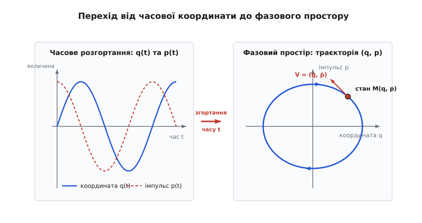
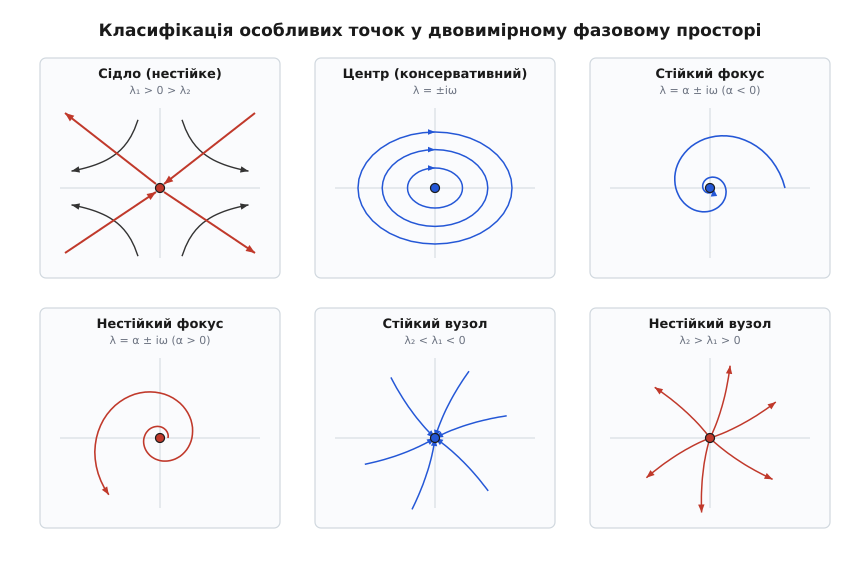
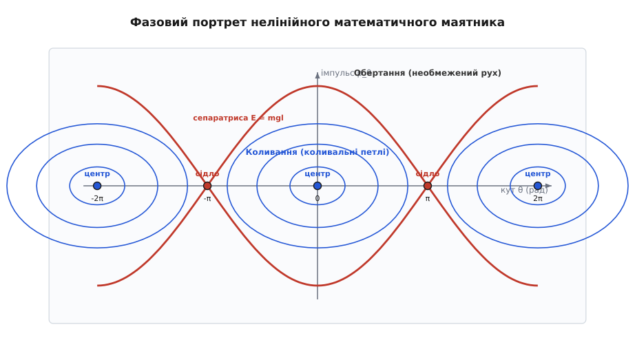
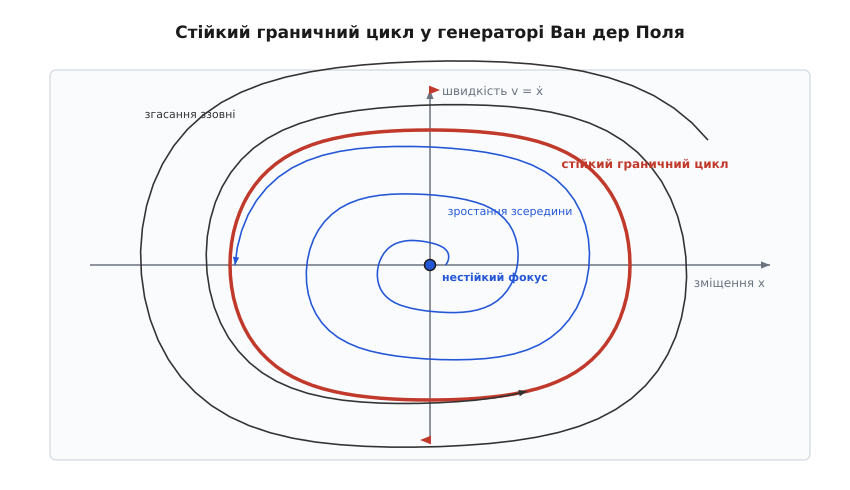

# Фазовий портрет: картографія динамічних станів

<preknowlist>
- [Диференціальні рівняння](book:math/differential-equations) — рівняння, що пов'язують функцію та її похідні; описують закони руху.
- [Швидкість](book:physics/velocity) — миттєвий темп зміни координати за часом.
- [Закон збереження енергії](book:physics/energy-conservation) — повна механічна енергія замкненої системи лишається сталою.
- [Векторне поле](book:math/vector-field) — призначення кожній точці простору вектора напряму й величини.
- [Матриця Якобі](book:math/jacobian-matrix) — таблиця частинних похідних векторної функції для лінеаризації в околі точки рівноваги.
- [Власні значення та власні вектори](book:math/eigenvalues) — спектральні характеристики матриці, що визначають тип і стійкість особливих точок.
- [Ряди Тейлора](book:math/taylor-series) — розклад аналітичної функції в степеневий ряд для лінеаризації диференціальних рівнянь.
- [Дивергенція](book:math/divergence) — скалярна міра джерел чи стоків векторного поля, що визначає швидкість зміни фазового об'єму.
- [Еліптичні інтеграли](book:math/elliptic-integral) — неелементарні інтеграли, через які виражається точний період нелінійних коливань.
</preknowlist>

Уяви маятник настінного годинника, який коливається з боку в бік. Якщо зробити один спалах фотокамери й зафіксувати маятник точно в найнижчій точці його траєкторії, координата відхилення дорівнює нулю. Але цей єдиний кадр не дає відповіді на найпростіші запитання: куди маятник рухається далі? Чи летить він уперед на максимальній швидкості, чи повертається назад, чи це взагалі затухаючий рух, де маятник ось-ось зупиниться? Знати одну лише координату `x` — це бачити пів карти. Щоб повністю відновити минуле та передбачити майбутнє фізичної системи, координати замало: необхідно знати ще й миттєву швидкість `v` (або імпульс `p`).

Сукупність усіх незалежних величин, що повністю визначають миттєвий стан системи, називається її **фазовим станом**. А абстрактний математичний простір, координатами якого є ці величини, називається **фазовим простором**. Для найпростішої системи з одним ступенем вільності (наприклад, вантажу на пружині чи маятника) фазовий простір є двовимірною площиною, де по осі абсцис відкладено координату `q`, а по осі ординат — імпульс `p`. Сукупність усіх можливих траєкторій руху у цьому просторі утворює **фазовий портрет** — геометричну карту, яка миттєво показує абсолютно всі режими руху системи без необхідності розв'язувати складні диференціальні рівняння для кожного окремого випадку.

---

### Від часового графіка до простору станів: чому однієї координати замало

Класичний спосіб опису руху — це часові розгортки: графіки координати `q(t)` та імпульсу `p(t)` як функцій часу `t`. Такий підхід добре знайомий з шкільної фізики, але він має фундаментальну ваду: час `t` розтягує рух уздовж нескінченної осі. Якщо система здійснює складні або хаотичні коливання, графік `q(t)` перетворюється на незрозумілий ліс синусоїд, де важко розгледіти закономірність.

Фазовий портрет робить вирішальний крок — він повністю **вилучає час `t` з розгляду**, згортаючи його в параметричну координату. Замість малювати два окремих графіки `q(t)` та `p(t)`, ми будуємо одну криву на площині `(q, p)`, де кожен момент часу `t` відповідає єдиній точці `M(q(t), p(t))`.


*При лінійних гармонічних коливаннях зсунуті за фазою синусоїди координати q(t) та імпульсу p(t) при вилученні часу t згортаються в ідеально гладку закриту еліптичну траєкторію у фазовому просторі.*

Як видно з фігури, рух стану описується системою двох диференціальних рівнянь першого порядку:

```
dq/dt = f(q, p)
dp/dt = g(q, p)
```

У кожній точці фазової площини `(q, p)` пара функцій `(f(q, p), g(q, p))` задає вектор **фазової швидкості** `V = (dq/dt, dp/dt)`. Увесь фазовий простір виявляється заповненим **векторним полем**. Замість шукати складні інтегральні формули, фізичне завдання зводиться до аналізу топології цього поля: фазові траєкторії — це просто інтегральні лінії, які в кожній своїй точці торкаються векторів фазової швидкості.

Для системи з `N` ступенями вільності (наприклад, `N` зв'язаних матеріальних точок) миттєвий стан описується `N` узагальненими координатами `q₁, q₂, ..., q_N` та `N` узагальненими імпульсами `p₁, p₂, ..., p_N`. Відповідний фазовий простір є `2N`-вимірним. У теоретичній механіці Гамільтона зв'язок між функцією Лагранжа `L(q, q̇)` та функцією Гамільтона `H(q, p)` здійснюється через перетворення Лежандра `p_i = ∂L/∂q̇_i`. Таким чином, фазовий простір є математично природним вмістилищем для всього апарату канонічних рівнянь.

За принципами геометричної динаміки, створеної наприкінці XIX століття, історія розвитку поняття простору станів розгорталася від астрономічного тупика задачі трьох тіл до робіт Анрі Пуанкаре, Людвіґа Больцмана та Олександра Ляпунова. Детальніше про те, як виникала концепція фазової рідини та як вона перевернула фізику, можна прочитати в [історичному екскурсі з виникнення фазового простору](book:physics/phase-portrait/hist-phase-portrait.md).

---

### Геометричні закони фазового руху: єдиність та збереження об'єму

Фазові траєкторії підпорядковуються суворим математичним та фізичним законам, які випливають із базових принципів механіки.

#### 1. Заборона на перетин траєкторій (Теорема про єдиність розв'язку)

Найважливіше правило фазового портрета звучить так: **дві різні фазові траєкторії ніколи не перетинаються у звичайних точках фазового простору**.

Це правило є безпосереднім наслідком теореми Коші-Ліпшица про єдиність розв'язку диференціального рівняння. Якби дві траєкторії перетнулися в якійсь точці `M₁(q₁, p₁)`, це означало б, що в цій точці вектор фазової швидкості `V` має одразу два різних напрями. Але функція векторного поля є однозначною. Якби перетин був можливим, то система, виходячи з одного й того самого фізичного стану, могла б піти двома різними шляхами у майбутнє, що повністю зруйнувало б принцип класичного детермінізму.

Єдиними точками, де траєкторії можуть «збиратися» або «зливатися» (у межі при `t → ∞`), є **особливі точки** (точки рівноваги), де фазова швидкість дорівнює нулю `V = (0, 0)`.

#### 2. Збереження фазового об'єму в консервативних системах (Теорема Ліувілля)

Уявимо, що ми виділили у фазовому просторі цілу область початкових станів площею `A(0)` — так звану «фазову краплю». З часом кожна точка цієї краплі рухається вздовж власної фазової траєкторії, і крапля деформується, змінюючи свою форму.

Закони гамільтонової механіки стверджують: для будь-якої замкненої системи без тертя (консервативної системи) **площа фазової краплі лишається суворо сталою в часі**:

```
A(t) = A(0) = const
```

Математично це випливає з того, що для рівнянь Гамільтона `dq/dt = ∂H/∂p` та `dp/dt = -∂H/∂q` дівергенція фазового векторного поля є тотожним нулем:

```
div(V) = ∂(dq/dt)/∂q + ∂(dp/dt)/∂p
       = ∂( ∂H/∂p )/∂q + ∂( -∂H/∂q )/∂p
       = ∂²H / (∂q ∂p) - ∂²H / (∂p ∂q)      [за теоремою про рівність мішаних похідних]
       = 0
```

Цей результат називається **теоремою Ліувілля**. Потік консервативної системи поводиться як **нестискувана рідина**: фазова крапля може витягуватися у довгі вузькі «змії», закручуватися у складні спіралі, але її сумарна площа ніколи не змінюється.

#### 3. Стиснення фазового об'єму в дисипативних системах

Якщо в системі є тертя, опір середовища чи інші втрати енергії, енергія системи `E(q, p)` постійно зменшується. У цьому випадку дівергенція фазового поля стає від'ємною:

```
div(V) < 0
```

Від'ємна дівергенція означає, що фазова рідина постійно стискається. Площа фазової краплі `A(t)` згасає за експоненційним законом `A(t) = A(0) · exp(-γ·t)`. Усі фазові траєкторії невідворотно втягуються в області меншого розміру — так звані **атрактори** (від англійського *attract* — притягувати).

Строгі розрахунки дівергенцій для різних типів дисипації виведено у [строгому математичному виведенні теореми Ліувілля та Якобіана](book:physics/phase-portrait/math-phase-portrait.md).

---

### Особливі точки: картографія рівноваги та стійкості

Ключовими елементами, які визначають весь каркас фазового портрета, є **особливі точки** (або точки рівноваги) — це точки `(q₀, p₀)`, у яких швидкість зміни стану дорівнює нулю:

```
f(q₀, p₀) = 0
g(q₀, p₀) = 0
```

У самій особливій точці система може перебувати нескінченно довго. Але найважливіше запитання: що станеться, якщо зсунути систему з цієї точки на крихітну відстань? Для відповіді на це запитання здійснюють **лінеаризацію** (розклад у [ряд Тейлора](book:math/taylor-series)) векторного поля в околі особливої точки за допомогою [матриці Якобі](book:math/jacobian-matrix) `J`:

```
J = [ (∂f/∂q)|₀   (∂f/∂p)|₀ ]
    [ (∂g/∂q)|₀   (∂g/∂p)|₀ ]
```

Поведінка траєкторій повністю визначається двома числами — **слідом матриці** `Tr(J) = J₁₁ + J₂₂` (який дорівнює [дивергенції](book:math/divergence) поля) та її **детермінантом** `Det(J) = J₁₁·J₂₂ - J₁₂·J₂₁`. [Власні значення](book:math/eigenvalues) `λ₁` та `λ₂` знаходять із квадратного характеристичного рівняння:

```
λ² - Tr(J)·λ + Det(J) = 0
```

Залежно від значень `Tr(J)` та `Det(J)` виникає шість класичних типів особливих точок.


*Класифікація особливих точок за топологією траєкторій: сідло (Det < 0), центр (Tr = 0), стійкий та нестійкий фокуси (комплексні корені), стійкий та нестійкий вузли (дійсні корені однакового знака).*

Розглянемо детально фізичну та геометричну суть кожного з 6 типів.

#### 1. Сідло (Saddle) — `Det(J) < 0`
Власні значення є дійсними числами протилежних знаків: `λ₁ > 0 > λ₂`. Уздовж одного напрямку (стійка сепаратриса) траєкторії експоненційно наближаються до точки, а вздовж іншого (нестійка сепаратриса) — експоненційно віддаляються.
- *Фізичний аналог:* Кулька на вершині крутого горба чи маятник у верхній (вертикально піднятій) точці рівноваги. На графіку потенціальної енергії `U(q)` сідлу відповідає локальний максимум `d²U/dq² < 0`. Точка є абсолютно **нестійкою**.

#### 2. Центр (Center) — `Det(J) > 0, Tr(J) = 0`
Власні значення є суто уявними: `λ = ± i·ω`. Траєкторії є замкненими концентричними еліпсами або колами.
- *Фізичний аналог:* Ідеальний гармонічний осцилятор (маятник без тертя). На потенціальному рельєфі `U(q)` центру відповідає точний локальний мінімум `d²U/dq² > 0`. Амплітуда коливань визначається початковим запасом енергії й зберігається вічно. Точка є **стійкою за Ляпуновим** (але не асимптотично).

#### 3. Стійкий фокус (Stable Focus) — `Det(J) > 0, Tr(J) < 0`, `Δ < 0`
Власні значення є комплексно-спряженими з від'ємною дійсною частиною: `λ = α ± i·ω`, де `α < 0`. Траєкторії мають вигляд спіралей, що закручуються всередину до особливої точки.
- *Фізичний аналог:* Маятник або звичайний пружинний осцилятор з малим в'язким тертям. Коливання поступово згасають, а амплітуда прямує до нуля.

#### 4. Нестійкий фокус (Unstable Focus) — `Det(J) > 0, Tr(J) > 0`, `Δ < 0`
Власні значення мають додатну дійсну частину: `α > 0`. Траєкторії спірально розкручуються назовні від особливої точки.
- *Фізичний аналог:* Системи з від'ємним тертям або підкачкою енергії при малих амплітудах (наприклад, розгін коливань у неусталеному підсилювачі).

#### 5. Стійкий вузол (Stable Node) — `Det(J) > 0, Tr(J) < 0`, `Δ ≥ 0`
Власні значення є дійсними від'ємними числами: `λ₂ < λ₁ < 0`. Траєкторії входять у точку рівноваги аперіодично, без жодного переколивання (без осциляцій).
- *Фізичний аналог:* Маятник у дуже густому маслі (сильне надкритичне затухання). Вантаж повільно повертається до положення спокою без проскоку через нуль.

#### 6. Нестійкий вузол (Unstable Node) — `Det(J) > 0, Tr(J) > 0`, `Δ ≥ 0`
Власні значення є дійсними додатними числами: `λ₂ > λ₁ > 0`. Траєкторії експоненційно випромінюються з точки в усіх напрямках без коливань.

---

### Потенціальний рельєф та двоямні системи

Топологія особливих точок у фазовому просторі безпосередньо пов'язана з формою графіку потенціальної енергії `U(q)`.

Розглянемо нелінійний осцилятор Даффінґа (Duffing oscillator) з двоямним потенціалом:

```
U(q) = -½ · α · q² + ¼ · β · q⁴        (де α > 0, β > 0)
```

Сила, що діє на частинку, є від'ємним градієнтом потенціалу: `F(q) = -dU/dq = α·q - β·q³`.

Рівняння руху у фазовому просторі має вигляд:

```
dq/dt = p
dp/dt = α·q - β·q³ - γ·p
```

Знайдемо особливі точки системи при відсутності тертя (`γ = 0`). Для цього прирівняємо праві частини до нуля:

```
p₀ = 0
α·q₀ - β·q₀³ = 0  ⇒  q₀ · (α - β·q₀²) = 0
```

Система має три точки рівноваги:
1. **Початок координат `(0, 0)`:** Тут `d²U/dq² = -α < 0` (максимум потенціалної енергії). Якобіан у цій точці має від'ємний детермінант `Det(J) = -α < 0`. Це **сідло**.
2. **Точка `(-√(α/β), 0)` та точка `(+(α/β), 0)`:** У цих точках `d²U/dq² = 2α > 0` (локальні мінімуми потенціальних ям). Якобіан має додатний детермінант `Det(J) = 2α > 0` та слід `Tr(J) = 0`. Це два **центри**.

Фазовий портрет осцилятора Даффінґа містить дві ізольовані родини коливальних овалів навколо двох центрів. Ці овали огорнуті спільною вісімкоподібною сепаратрисою, що виходить із сідла у початку координат. При малому енергетичному рівні `E < 0` частинка здійснює коливання всередині однієї з двох потенціальних ям. При енергії `E > 0` частинка перелітає через центральний бар'єр і охоплює обидві ями єдиними великими фазовими кривими.

---

### Глобальна топологія фазового портрета та сепаратриси

Окремі особливі точки дають лише локальну картину. Щоб зібрати з них повний **фазовий портрет**, необхідно знайти лінійні бар'єри, які розбігаються від сідлових точок — **сепаратриси**.

Сепаратриса (від латинського *separatrix* — «та, що розділяє») — це особлива фазова траєкторія, яка ділить фазовий простір на якісно різні області руху.

Розглянемо це на класичному прикладі **нелінійного математичного маятника**, рівняння руху якого має вигляд:

```
m · L · d²θ/dt² + m · g · sin(θ) = 0
```

Якщо ввести імпульс `p_θ = m · L² · dθ/dt`, то повна механічна енергія маятника записується як:

```
E(θ, p_θ) = (p_θ² / (2 · m · L²)) + m · g · L · (1 - cos(θ))
```


*Фазовий портрет нелінійного маятника розділено вісімкоподібною сепаратрисою на дві якісно різні області: внутрішні закриті овалуваті траєкторії відповідають коливанням (лібрації), а зовнішні нескінченні хвилясті лінії — суцільному обертанню.*

Аналіз топології фазового портрета маятника відкриває три фундаментальні області:

1. **Область коливань (Лібрація):** Усередині овальних петель навколо центрів `θ = 0, ±2π, ±4π` енергія маятника менша за потенціальну енергію у верхній точці `E < 2·m·g·L`. Маятник не може подолати верхню мертву точку й здійснює періодичні коливання з боку в бік. На фазовому портреті цьому відповідають **закриті замкнені криві**. Зауважимо, що для великих амплітуд коливання нелінійного маятника перестають бути ізохронними: період коливань `T(θ₀)` зростає разом з амплітудою `θ₀` і описується повним [еліптичним інтегралом](book:math/elliptic-integral) першого роду `K(sin(θ₀/2))`.

2. **Область обертання (Ротація):** Поза овалами енергія маятника більша за поріг `E > 2·m·g·L`. Маятника вистачає енергії, щоб беззупинно пролітати верхню точку. Він крутиться в один бік (за годинниковою стрілкою або проти неї). Кут `θ` безмежно зростає, а імпульс `p_θ` пульсує, але ніколи не звертається в нуль. На фазовому портреті цьому відповідають **нескінченні хвилясті лінії**.

3. **Сепаратриса:** Хвиляста лінія вісімки (крива червоного кольору), яка проходить точно через нестійкі сідлові точки `θ = ±π, ±3π`. Енергія на сепаратрисі точно дорівнює `E = 2·m·g·L`. Це критична межа: якщо надати маятнику енергію трохи меншу за `E`, він коливатиметься; якщо трохи більшу — почне обертатися. Сам рух по сепаратрисі відповідає тому, що маятник нескінченно довго наближається до верхньої нестійкої точки рівноваги й досягає її лише при `t → ∞`.

Рівняння сепаратриси маятника виводять безпосередньо із закону збереження енергії при `E = 2·m·g·L`:

```
p_θ = ± 2 · m · L · √(g · L) · cos(θ / 2)
```

---

### Канонічні перетворення та змінні дія-кут

У просунутій гамільтоновій механіці топологію замкнених фазових траєкторій консервативних систем спрощують за допомогою канонічних перетворень фазових координат `(q, p) → (θ, I)`.

Новими фазовими координатами стають **змінна дії `I`** та **узагальнений фазовий кут `θ`**:

1. **Змінна дії `I`** обчислюється як замкнений контурний інтеграл уздовж фазової траєкторії, поділений на `2π`:
   ```
   I = (1 / 2π) · ∮ p dq
   ```
   Геометричний зміст змінної дії є надзвичайно просторим: `I` дорівнює площі фазового простору, обмеженій замкненою траєкторією коливань, поділеній на `2π`.
2. **Кутова змінна `θ`** змінюється неперервно від `0` до `2π` за один повний період коливань системи.

У змінних дія-кут гамільтоніан консервативної системи залежить виключно від змінної дії `H = H(I)`. Рівняння руху фазового стану набувають гранично простого вигляду:

```
dI/dt = -∂H/∂θ = 0   ⇒   I = const
dθ/dt =  ∂H/∂I = ω(I) = const
```

На фазовому портреті у координатах `(θ, I)` усі деформовані нелінійні овальні траєкторії перетворюються на **ідеально прямі горизонтальні лінії** `I = const`, вздовж яких фазовий кут `θ` рівномірно зростає зі сталою кутовою частотою `ω(I)`. Це перетворення становить основу сучасного математичного аналізу нелінійних резонансів та теорії КАМ (Колмогорова-Арнольда-Мозера).

---

### Зв'язані осцилятори та багатовимірні фазові проекції

Коли фізична система має не один, а два чи більше ступенів вільності (наприклад, два зв'язаних маятники або подвійний пружинний осцилятор), розмірність фазового простору зростає до `4` (чотири coordinates: `q₁, p₁, q₂, p₂`).

Безпосередньо накреслити чотиривимірний фазовий портрет на двовимірному аркуші паперу неможливо. Тому в інженерії та теоретичній фізиці застосовують два основних геометричних прийоми:

1. **Нормальні моди та розщеплення фазових площин:** Для лінійних зв'язаних систем здійснюють перехід до нормальних координат `Q₁ = q₁ + q₂` та `Q₂ = q₁ - q₂`. У нових координатах чотиривимірний фазовий простір точно розпадається на дві незалежні двовимірні фазові площини `(Q₁, P₁)` та `(Q₂, P₂)`. У кожній із цих площин фазовий портрет являє собою звичайні концентричні еліпси.
2. **Перерізи Пуанкаре (Poincaré Sections):** Для дослідження нелінійних зв'язаних або вимушених систем (наприклад, маятника під зовнішньою періодичною силою з частотою `Ω`) Пуанкаре запропонував відсікати неперервні траєкторії стробоскопічними спалахами з періодом `T = 2π/Ω`. Замість неперервної заплутаної кривої у 3D або 4D просторі ми отримуємо послідовність дискретних точок на 2D площині перерізу. Якщо точки перерізу лягають на гладку криву — рух є квазіперіодичним; якщо точки заповнюють складну фрактальну структуру — у системі існує динамічний хаос.

---

### Квантова границя та осередки Плана

У класичній фізиці точки у фазовому просторі вважаються нескінченно малими й неограничено подільними. Проте при переході до мікросвіту квантова механіка накладає фундаментальне обмеження на структуру фазового простору.

Згідно з принципом невизначеності Гейзенберґа, координата `q` та імпульс `p` частинки не можуть бути виміряні одночасно з довільною точністю:

```
Δq · Δp ≥ ℏ / 2
```

Це означає, що у квантовому фазовому просторі точкові траєкторії втрачають сенс. Мінімальний елементарний осередок фазової площі, що може бути зайнятий одним квантовим станом, дорівнює **сталій Плана**:

```
ΔA_min = Δq · Δp = h = 2π · ℏ
```

Тому квантовий фазовий портрет стає квазікласичним розмиттям, де суцільні траєкторії перетворюються на смуги фазової ймовірності (функція Віґнера). У межі `I >> ℏ` квантовий опис точно переходить у класичний фазовий портрет за принципом відповідності Бора.

---

### Автоколивання та граничні цикли: життя поза гамільтоновістю

Усі консервативні системи мають однакову властивість: родина їхніх фазових траєкторій є **суцільним сімейством**. Якщо змінити початкові умови маятника бодай на мікрофон, він перейде на сусідню фазову орбіту. Амплітуда коливань залежить виключно від початкового поштовху.

Проте реальний світ сповнений систем іншого типу — **автоколивальних**. Годинниковий механізм, серцевий м'яз, струна скрипки під смичком, електронний генератор радіостанції — усі вони здійснюють незагасаючі періодичні коливання з **власною амплітудою та частотою**, які взагалі не залежать від початкового поштовху.

Геометричним образом автоколивань у фазовому просторі є **граничний цикл** (англ. *limit cycle*).

Граничний цикл — це **ізольована замкнена фазова траєкторія** у нелінійній дисипативній системі, до якої спірально наближаються всі сусідні траєкторії (як ізсередини, так і ззовні).

Класичним прикладом системи з граничним циклом є **генератор Ван дер Поля**, диференціальне рівняння якого має вигляд:

```
d²x/dt² - μ · (1 - x²) · dx/dt + x = 0
```

тут `μ > 0` — параметр нелінійності. 

Робота цього механізму описується розумним балансом енергії:
- При малих амплітудах (`|x| < 1`) член `(1 - x²) > 0`, і коефіцієнт при першій похідній `-μ·(1 - x²)` є **від'ємним**. Від'ємне тертя працює як підкачка енергії: амплітуда коливань експоненційно зростає, а особлива точка в центрі є **нестійким фокусом**.
- При великих амплітудах (`|x| > 1`) член `(1 - x²) < 0`, і тертя стає **додатним**. Сильні коливання швидко згасають через велику дисипацію.


*Стійкий граничний цикл є притягуючим каркасом: траєкторія зсередини розкручується від нестійкого фокуса, а траєкторія ззовні стискається всередину, збігаючись на єдиній замкненій фазовій кривій.*

На відміну від консервативних центрів, граничний цикл є **грубим та стійким**: якщо штовхнути систему й збити її з граничного циклу, вона через деякий час самостійно повернеться на той самий режим коливань.

---

### Фазові біфуркації та перехід до динамічного хаосу

Що відбувається з фазовим портретом, якщо керівний параметр фізичної системи (наприклад, коефіцієнт згасання, амплітуда зовнішньої сили чи температура) змінюється неперервно?

У більшості випадків фазовий портрет змінюється деформаційно й зберігає свою якісну структуру. Проте при досягненні певних критичних значень параметрів відбувається **біфуркація** (від латинського *bifurcus* — «роздвоєний») — якісна перебудова топології фазового портрета.

1. **Біфуркація Андронова-Хопфа:** Виникає, коли при зміні параметра `μ` слід матриці Якобі `Tr(J)` переходить через нуль. При цьому стійкий фокус втрачає стійкість і перетворюється на нестійкий фокус, а навколо нього народжується новий стійкий граничний цикл. На фазовому портреті це відповідає м'якому виникненню автоколивань.
2. **Сідло-вузлова біфуркація:** При зміні параметра зливаються й взаємно знищуються дві особливі точки — сідло та вузол. Область фазового простору, яку контролювало сідло, раптово відкривається для вільного прольоту траєкторій.

#### Фазовий простір трьох вимірів та детермінований хаос

У двовимірному фазовому просторі за теоремою Пуанкаре-Бендіксона можливі лише три типи поведінки: точка рівноваги, граничний цикл або нескінченний вихід на безкінечність. Складні хаотичні траєкторії у 2D замикатися чи перетинатися не можуть.

Проте якщо система має **три або більше ступенів вільності** (або є двовимірною, але знаходиться під дією зовнішньої періодичної сили), розмірність фазового простору дорівнює `3` чи більше. У тривимірному фазовому просторі траєкторії отримують додатковий вимір для обходу одна одної без перетину. Це відкриває можливість існування **дивних атракторів** (наприклад, атрактора Лоренца). Фазова крапля в такому просторі нескінченно розтягується й складається («шаровий пиріг»), що дає народження динамічному хаосу — непередбачуваному руху з експоненційною чутливістю до початкових умов.

---

### Фазова реконструкція за часовими затримками (Теорема Такена)

У реальному експерименті (наприклад, при спостереженні за турбулентним потоком рідини, серцевим ритмом людини чи коливаннями мосту) експериментатор найчастіше не має можливості виміряти всі `2N` фазових координат одночасно. У наявності є лише один скалярний часовий сигнал `x(t)` (наприклад, напруга з датчика або показник акселерометра).

Чи можна відновити повний фазовий портрет багатовимірної системи, маючи лише один виміряний часовий ряд `x(t)`?

У 1981 році нідерландський математик Флоріс Такенс (Floris Takens) наввів позитивну відповідь, довівши фундаментальну **теорему про фазову реконструкцію**.

Такенс запропонував будувати штучний фазовий вектор `Y(t)` за допомогою вимірів скалярного сигналу зі зсувом у часі на величину затримки `τ`:

```
Y(t) = ( x(t),  x(t - τ),  x(t - 2τ),  ...,  x(t - (d-1)·τ) )
```

тут `d` — так звана **розмірність вкладення** (*embedding dimension*).

Теорема Такена доводить: якщо розмірність вкладення обрано достатньо великою `d ≥ 2·M + 1` (де `M` — справжня розмірність атрактора системи), то реконструйований у просторі `Y(t)` фазовий портрет є **гладким диффеоморфізмом** справжнього фазового портрета! Це означає, що топологічні властивості (кількість особливих точок, їхня стійкість, граничні цикли та фрактальна розмірність атрактора) у реконструйованому просторі повністю збігаються зі справжніми.

Вибір часової затримки `τ` здійснюють за першим нулем автокореляційної функції сигналу або за першим мінімумом взаємної інформації. Метод реконструкції Такена став основою сучасної нелінійної динамічної діагностики у біології, економіці та техніці.

---

### Розрахунковий приклад: аналіз стійкості осцилятора

Розглянемо практичний розрахунок особливої точки для нелінійної системи з згасанням та нелінійною пружністю:

```
dq/dt = p
dp/dt = -0.4 · p - 2.0 · q - 1.0 · q³
```

#### Крок 1. Пошук точок рівноваги
Шукаємо точки, де `dq/dt = 0` та `dp/dt = 0`:

```
p₀ = 0
-0.4 · (0) - 2.0 · q₀ - 1.0 · q₀³ = 0  ⇒  q₀ · (2.0 + q₀²) = 0
```

Єдиним дійсним розв'язком є `q₀ = 0, p₀ = 0`. Отже, система має єдину особливу точку в початку координат `(0, 0)`.

#### Крок 2. Обчислити Якобіан у точці (0, 0)
Обчислимо частинні похідні для функції `f(q, p) = p` та `g(q, p) = -0.4·p - 2.0·q - 1.0·q³`:

```
∂f/∂q = 0,    ∂f/∂p = 1
∂g/∂q = -2.0 - 3.0·q²,    ∂g/∂p = -0.4
```

У точці `(0, 0)` підставляємо `q = 0`:

```
J = [  0.0    1.0 ]
    [ -2.0   -0.4 ]
```

#### Крок 3. Інваріанти та власні значення

```
Tr(J) = 0.0 + (-0.4) = -0.4
Det(J) = (0.0) · (-0.4) - (1.0) · (-2.0) = 2.0
```

Обчислимо дискримінант характеристичного рівняння:

```
Δ = (Tr J)² - 4 · Det(J)
  = (-0.4)² - 4 · (2.0)                         [підстановка значень Tr = -0.4 та Det = 2.0]
  = 0.16 - 8.0                                  [піднесення до квадрата та множення]
  = -7.84 < 0                                   [обчислення різниці: дискримінант від'ємний]
```

Дискримінант від'ємний, отже власні значення є комплексно-спряженими:

```
λ₁,₂ = ( Tr(J) ± i · √|Δ| ) / 2
     = ( -0.4 ± i · √7.84 ) / 2                 [підстановка значення Tr = -0.4 та |Δ| = 7.84]
     = ( -0.4 ± i · 2.8 ) / 2                   [добування квадратного кореня з 7.84]
     = -0.2 ± i · 1.4                           [ділення кожного доданка на 2]
```

#### Висновок розрахунку
Дійсна частина власних значень є від'ємною `Re(λ) = -0.2 < 0`, а уявна частина дорівнює `Im(λ) = 1.4`. Отже, особлива точка `(0, 0)` є **стійким фокусом**. Траєкторії системи закручуються у спіралі всередину з частотою `ω = 1.4` рад/с та показником згасання `α = -0.2` с⁻¹.

---

> 🔧 **Навіщо це.**
> У сучасній інженерії фазовий портрет — це головний інструмент діагностики та проектування.
> 
> 1. **Аерокосмічне управління та робототехніка:** При розробці автопілотів літаків та контролерів балістичних ракет інженери будують фазові портрети «кут тангажу — кутова швидкість». Сепаратриса показує межу критичних кутів атаки, за якими літак виходить з керування й зривається в штопор.
> 2. **Енергосистеми та електромережі:** Стійкість силове обладнання та генераторів національної енергомережі оцінюють за фазовими портретами «кут зсуву фази — відхилення частоти». Це дозволяє розрахувати допустимий час короткого замикання до того, як генератори вийдуть із синхронізму.
> 3. **Врачувальна діагностика та нейродинаміка:** Кардіографи побудовані на фазовій реконструкції серцевого ритму у просторі `(ECG(t), ECG(t - τ))`. Перехід від нормального стійкого граничного циклу до хаотичного заплутаного атрактора є чітким маркером фібриляції шлуночків серця.

Програмну реалізацію чисельного інтегрування фазових полів методом Рунґе-Кутти наведено у [чисельному розрахунку фазового портрета мовами C та C++](book:physics/phase-portrait/proj-phase-portrait.md).

Специфікацію типів даних, функцій аналізу матриці Якобі та опишувачів точок рівноваги зібрано у [довіднику публічного інтерфейсу обчислення фазових полів](book:physics/phase-portrait/api-phase-portrait.md).
