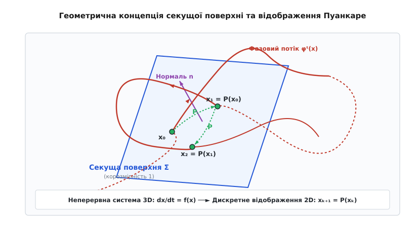
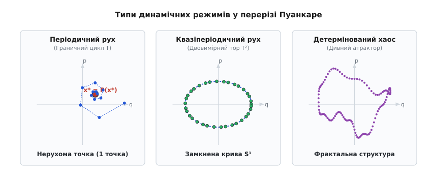
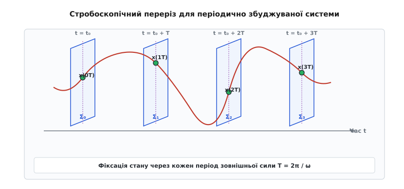
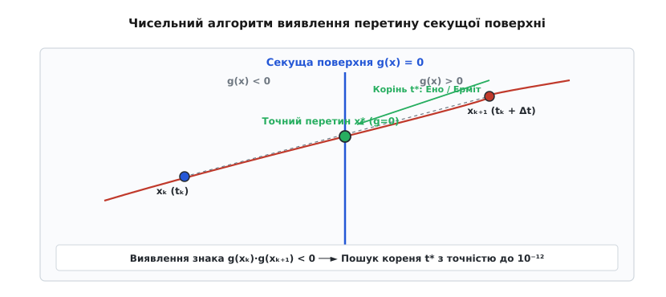

# Відображення Пуанкаре: дискретизація фазового потоку, геометрія перерізів та хаотична динаміка

<preknowlist>
- [Фазовий портрет](topic:physics/phase-portrait) — геометрична карта динамічних станів системи у просторі координат та імпульсів.
- [Детермінований хаос](topic:physics/deterministic-chaos) — неперіодична поведінка нелінійних динамічних систем, чутлива до початкових умов.
- [Осцилятор Дуффінга](topic:physics/duffing-oscillator) — базова модель нелінійних коливань із кубічною нелінійністю та резонансним гістерезисом.
- [Відображення Ено](topic:physics/henon-map) — двовимірне дискретне відображення, що моделює складання та стиснення фазового простору.
- [Каскад подвоєння періоду](topic:physics/period-doubling-cascade) — універсальний механізм переходу від періодичного руху до хаосу через подвоєння періоду.
- [Теорема про центральний многовид](topic:physics/center-manifold-theorem) — редукція розмірності динамічної системи в околі біфуркаційних точок.
</preknowlist>

Коли інженери-динаміки або астрофізики намагаються дослідити довготривалу еволюцію тривимірної нелінійної системи — будь то бістабільний осцилятор із зовнішнім збудженням, процес взаємодії трьох гравітуючих тіл чи конвекційний потік Лоренца — безперервна фазова траєкторія швидко перетворюється на щільний, переплутаний клубок ліній. Безперервний розв'язок диференціальних рівнянь генерує безкінечний масив даних, у якому класичні геометричні методи втрачають прозорість: прямо з тривимірного фазового портрета майже неможливо розрізнити, чи є траєкторія строго періодичною з гігантським періодом, чи вона здійснює квазіперіодичні мотання по поверхні тора, чи перед нами нерегулярний детермінований хаос. Безперервне інтегрування приховує внутрішню топологічну структуру системи за нескінченним часовим розгортанням. У 1890 році французький математик Анрі Пуанкаре вирішив цю фундаментальну проблему, запропонувавши метод трансверсальних перерізів: замість безперервного спостереження за всією траєкторією ми фіксуємо лише дискретні точки, у яких вона перетинає спеціально обрану гіперповерхню в заданому напрямку. Цей підхід зменшує розмірність досліджуваного простору на одиницю і замінює неперервну систему диференціальних рівнянь `d(x)/dt = f(x)` на дискретний оператор першого повернення `x[k+1] = P(x[k])`, перетворюючи складну динаміку потоку на геометричне відображення.

---

### Геометрична концепція та математичне означення секущої поверхні

У багатьох динамічних задачах безперервний фазовий потік розгортається у багатовимірному просторі станів. Нехай динамічна система описується автономним вектором диференціальних рівнянь у `N`-вимірному гладкому многовиді:

```
d(x)/dt = f(x),   де x ∈ Rⁿ
```

Неперервна сукупність розв'язків створює фазовий потік `φᵗ(x)`, який переміщує кожну початкову точку `x₀` уздовж її фазової траєкторії протягом часу `t`.

Щоб побудувати відображення Пуанкаре, у фазовому просторі вибирається гладка секуща поверхня `Σ` (поверхня Пуанкаре), яка має корозмірність одиниця (тобто розмірність `N - 1`). Головною математичною вимогою до поверхні `Σ` є умова трансверсальності: у кожній точці перетину вектор фазової швидкості `f(x)` не повинен бути дотичним до поверхні `Σ`. Якщо позначити через `n(x)` вектор нормалі до поверхні `Σ` у точці `x`, умова трансверсальності записується через скалярний добуток:

```
n(x) · f(x) ≠ 0   для всіх x ∈ Σ
```

Геометрично це означає, що фазова траєкторія пробиває поверхню `Σ` наскрізь під деяким кутом, а не ковзає уздовж неї й не торкається її дотично. Для однозначності відображення напрямок перетину завжди фіксується: розглядаються лише ті перетини, де вектор швидкості має додатну проєкцію на нормаль `n(x) · f(x) > 0`.


*Фазова траєкторія у тривимірному просторі послідовно пробиває трансверсальну секущу поверхню Σ у точках x₀, x₁, x₂..., визначаючи дискретний оператор відображення P.*

Розглянемо точку `xₖ`, яка належить секущій поверхні `Σ`. Якщо стартувати з цієї точки й рухатися вздовж фазової траєкторії за допомогою потоку `φᵗ(xₖ)`, то через деякий скінченний проміжок часу `τ(xₖ) > 0` траєкторія знову повернеться на поверхню `Σ` у тому ж напрямку перетину. Точка нового перетину позначається через `xₖ₊₁`:

```
xₖ₊₁ = φᵗ(xₖ)   при t = τ(xₖ)
```

Величина `τ(xₖ)` називається часом першого повернення (або часом повернення Пуанкаре). Вона не є константою, а залежить від початкового положення точки `xₖ` на секущій поверхні.

Функціональна залежність, яка зіставляє точці `xₖ ∈ Σ` точку її наступного повернення `xₖ₊₁ ∈ Σ`, називається відображенням Пуанкаре (або оператором першого повернення):

```
P: Σ → Σ,   P(xₖ) = φᵀ⁽ˣᵏ⁾(xₖ)
```

Завдяки теоремі про неявну функцію та неперервній залежності розв'язків диференціальних рівнянь від початкових умов, якщо поверхня `Σ` строго трансверсальна до потоку, функція часу повернення `τ(x)` є гладкою, а саме відображення Пуанкаре `P` є гладким дифреоморфізмом на відповідній області секущої поверхні. Детальний математичний аналіз умов існування та дифреоморфності наведено у [математичній теорії відображення Пуанкаре](topic:physics/poincare-map/math-poincare-map.md).

---

### Класифікація динамічних режимів у перерізі Пуанкаре

Головна цінність відображення Пуанкаре полягає у тому, що воно здійснює точну топологічну редукцію: складні неперервні геометричні об'єкти у `N`-вимірному фазовому просторі відображаються у простіші дискретні геометричні структури виміру `N - 1` на поверхні `Σ`. Порівняння фазових траєкторій у безперервному просторі та їхніх слідів на перерізі Пуанкаре дозволяє однозначно класифікувати тип динамічної поведінки системи.


*Геометричний вигляд перерізу Пуанкаре для трьох основних класів нелінійної динаміки: одна нерухома точка відповідає періодичному руху, замкнена інваріантна крива — квазіперіодичному руху, а фрактальна структура точок — детермінованому хаосу.*

#### 1. Періодичний рух та нерухомі точки відображення

Замкнена фазова траєкторія (граничний цикл періоду `T`) у безперервному фазовому просторі описує періодичні коливання системи. Кожного разу, коли система здійснює повний оберт тривалістю `T`, траєкторія повертається в одну й ту ж саму точку на секущій поверхні `Σ`.

У перерізі Пуанкаре періодичний рух періоду `T` відображається у єдину нерухому точку `x*`:

```
P(x*) = x*
```

Якщо періодичний рух є складнішим і траєкторія здійснює `N` обертів перед тим, как замкнутися (субгармонічний режим періоду `N·T`), у перерізі Пуанкаре виникає циклічна послідовність із `N` дискретних точок `{x₁*, x₂*, ..., xₙ*}`. Відображення `P` послідовно переставляє ці точки по колу: `P(x₁*) = x₂*`, `P(x₂*) = x₃*`, ..., `P(xₙ*) = x₁*`. Кожна з цих точок є нерухомою точкою `N`-го степеня відображення: `Pⁿ(xᵢ*) = xᵢ*`.

Стійкість нерухомої точки `x*` визначається власними значеннями матриці Якобі `DP(x*)`, які у динаміці називаються множниками Флоке `μᵢ`. Якщо всі множники Флоке за модулем менші за одиницю (`|μᵢ| < 1`), будь-які малі відхилення від нерухомої точки згасають при кожному наступному ітеруванні `P`, що відповідає стійкому граничному циклу. Якщо хоча б один множник за модулем перевищує одиницю (`|μᵢ| > 1`), періодичний рух втрачає стійкість.

#### 2. Квазіперіодичний рух та інваріантні тори

Якщо динамічна система здійснює рух із двома або більше несомірними (ірраціонально співвіднесеними) частотами `ω₁` та `ω₂` (де `ω₁ / ω₂ ∉ Q`), траєкторія у безперервному фазовому просторі намотується на двовимірний тор `T²`. Траєкторія ніколи строго не замикається, але нескінченно щільно вкриває поверхню тора.

При перетині секущої поверхні `Σ` двовимірний тор `T²` розрізається по одномірній кільцевій лінії. У перерізі Пуанкаре квазіперіодичний рух утворює гладку замкнену інваріантну криву `S¹`. Послідовні точки перетинів `x₀, x₁, x₂...` крокують уздовж цієї кривої з постійним кутовим зсувом (поворот на кут `α = 2π · ω₁ / ω₂`), поступово й нескінченно щільно заповнюючи весь контур лінії. Наявність чіткої замкненої кривої у перерізі Пуанкаре є беззаперечним доказом наявності квазіперіодичного режиму та відсутності хаосу.

#### 3. Детермінований хаос та дивні атрактори

Коли динамічна система здійснює неперіодичні хаотичні коливання, фазова траєкторія стає чутливою до початкових умов і здійснює нескінченний нерегулярний дрейф у межах обмеженої області фазового простору. 

У перерізі Пуанкаре хаотичний рух виявляє складну внутрішню геометрію: замість окремих точок чи гладких ліній точки перетинів утворюють фрактальну множину з канторовою мікроструктурою. Послідовні точки `xₖ` хаотично стрибають по поверхні, проте не заповнюють її суцільно, а групуються вздовж тонких стиснутих шарів та складок. Ця фрактальна картина у перерізі Пуанкаре є «відбитком пальця» дивного атрактора. Вона демонструє одночасну дію двох протилежних механізмів хаотичної динаміки: локального розтягування фазових траєкторій (експоненційне розходження сусідніх точок) та глобального складання фазового простору (яке утримує систему у скінченній області).

---

### Автономні та періодично збуджувані системи: стробоскопічні перерізи

Спосіб побудови та вибору секущої поверхні `Σ` суттєво залежить від того, чи є досліджувана система автономною, чи вона перебуває під дією зовнішнього періодичного збудження.

#### 1. Секущі поверхні в автономних системах

Для автономних систем видати фізичний напрям секущої поверхні можна за допомогою рівняння геометрії у фазовому просторі:

```
Σ = { x ∈ Rⁿ ∣ g(x) = 0 }
```

Наприклад, у тривимірній системі з координатами `(x, y, z)` як секущу поверхню часто вибирають плоско паралельний зріз `x = 0` при умові `dx/dt > 0`. У цьому випадку секуща поверхня є звичайною двовимірною площиною `(y, z)`. Час між послідовними перетинами `τ(xₖ)` є змінною величиною, оскільки тривалість оберту траєкторії коливається залежно від поточного стану системи.

#### 2. Стробоскопічний переріз для періодично збуджуваних систем

Розглянемо неавтономну дисипативну систему, що перебуває під дією зовнішньої періодичної сили з періодом `T = 2π / ω`. Класичним прикладом є осцилятор Дуффінга або примусовий маятник під дією гармонічного моменту:

```
d²x/dt² + γ·(dx/dt) + g(x) = f₀·cos(ω·t)
```

Шляхом введення додаткової фазової координати часу `θ = ω·t (mod 2π)` ця система зводиться до автономної у тривимірному циліндричному фазовому просторі `(x, v, θ)`, де `v = dx/dt`, а координата `θ` зациклена на інтервалі `[0, 2π)`.


*Стробоскопічна фіксація стану системи з періодом зовнішньої сили T дозволяє зрізати часову вісь і перетворити 3D циліндричний фазовий простір на 2D площину.*

Для таких систем найзручнішим варіантом перерізу Пуанкаре є так званий стробоскопічний переріз. Оскільки період зовнішнього збудження `T` заздалегідь відомий, ми вибираємо секущу поверхню як площину фіксованої фази зовнішнього сигналу:

```
Σₜ₀ = { (x, v, t) ∣ t = t₀ + k·T,  k ∈ Z }
```

Фізично це відповідає спостереженню за системою у спалахах стробоскопа, який спалахує строго синхронно з частотою зовнішньої сили `ω`. Ми реєструємо стан системи `(x(t), v(t))` лише у дискретні моменти часу `t₀, t₀ + T, t₀ + 2T, t₀ + 3T...`.

Головна перевага стробоскопічного перерізу полягає у тому, що час між сусідніми перетинами є строго постійним і дорівнює періоду збудження `τ = T`. Це суттєво спрощує як чисельний розрахунок відображення, так і його теоретичний аналіз. Якщо відгук системи є гармонічним з частотою збудження `ω`, у стробоскопічному перерізі виникає одна нерухома точка. Якщо виникає субгармонічний режим з періодом `N·T` (наприклад, у результаті розщеплення в каскаді подвоєння періоду), у стробоскопічному перерізі спостерігається `N` дискретних точок.

---

### Топологічна структура: стійкі та нестійкі многовиди й підкова Смейла

Аналіз геометрії відображення Пуанкаре спирається на дослідження гіперболічних нерухомих точок `x*` та пов'язаних із ними інваріантних многовидів. Якщо нерухома точка `x*` має сідловий тип (частина множників Флоке `|μᵢ| < 1`, а частина `|μⱼ| > 1`), через неї проходять два фундаментальних геометричних об'єкти на секущій поверхні `Σ`:

- **Стійкий многовид `Wˢ(x*)`:** сукупність усіх точок `x ∈ Σ`, які при багаторазовому прямому ітеруванні відображення `Pⁿ(x)` припрямовують до нерухомої точки `x*` при `n → +∞`.
- **Нестійкий многовид `Wᵘ(x*)`:** сукупність усіх точок `x ∈ Σ`, які при зворотному ітеруванні `P⁻ⁿ(x)` припрямовують до `x*` при `n → +∞` (тобто вилітають з `x*` у прямому часі).

У лінійних системах ці многовиди є звичайними площинами чи прямими лініями. Проте у нелінійних динамічних системах гладкі криві `Wˢ(x*)` та `Wᵘ(x*)` можуть вигинатися, утворюючи складні складки.

#### Гомоклінічні перетини та гомоклінічне сплетіння

Якщо стійкий та нестійкий многовиди однієї й тієї самої сідлової точки `x*` перетинаються на секущій поверхні у деякій точці `x_h ≠ x*`, ця точка називається гомоклінічною точкою перетину.

Оскільки точка `x_h` належить стійкому многовиду `Wˢ`, усі її майбутні образи `Pⁿ(x_h)` також мусять належати `Wˢ`. Одночасно, оскільки `x_h` належить нестійкому многовиду `Wᵘ`, усі її образи належать `Wᵘ`. Отже, наявність хоча б одного гомоклінічного перетину невідворотно вимагає існування нескінченної послідовності інших точок перетину:

```
Pⁿ(x_h) ∈ Wˢ ∩ Wᵘ   для всіх n ∈ Z
```

Ці нескінченні перетини змушують криві `Wˢ` та `Wᵘ` здійснювати все більш амплітудні осциляції та звиватися навколо одна одної, утворюючи нескінченно складну геометрію, яку Анрі Пуанкаре назвав «гомоклінічним сплетінням» (Homoclinic Tangle).

#### Механізм підкови Смейла (Smale Horseshoe)

Американський математик Стівен Смейл довів фундаментальну теорему: наявність трансверсального гомоклінічного перетину у перерізі Пуанкаре невідворотно спричиняє існування інваріантної множини, на якій відображення Пуанкаре діє аналогічно до так званої «підкови Смейла».

Геометричний механізм підкови Смейла складається з трьох послідовних дій над квадратною областю секущої поверхні:
1. **Розтягування:** прямокутна область стискається по горизонталі (уздовж напрямку стійкого многовиду) та експоненційно розтягується по вертикалі (уздовж нестійкого многовиду).
2. **Складання:** отримана довга смуга згинається у формі підкови.
3. **Накладання:** зігнута підкова накладається назад на вихідну квадратну область, перетинаючи її по двох вузьких вертикальних смугах.

Повторення цього процесу `n` разів утворює у перерізі Пуанкаре фрактальну структуру, топологічно еквівалентну добутку двох канторових множин. Це математично доводить, що відображення Пуанкаре в околі гомоклінічних точок містить нескінченну кількість нестійких періодичних орбіт будь-якого періоду та володіє властивістю сильної чутливості до початкових умов (детермінованим хаосом).

---

### Біфуркації нерухомих точок у перерізі Пуанкаре

Зміна керуючих параметрів нелінійної системи (наприклад, амплітуди зовнішньої сили `f₀` або коефіцієнта тертя `γ`) викликає деформацію відображення Пуанкаре `P_λ(x)`. Коли один або кілька множників Флоке `μᵢ` нерухомої точки при зміні параметра `λ` перетинають одиничне коло на комплексній площині (`|μᵢ| = 1`), відбувається втрата стійкості періодичного руху — біфуркація.

Розрізняють три основні кодомен-1 типи біфуркацій у перерізах Пуанкаре:

#### 1. Біфуркація подвоєння періоду (Flip / Period-Doubling Bifurcation)

Ця біфуркація відбувається, коли один із дійсних множників Флоке виходить з одиничного кола через значення мінус одиниця:

```
μ = -1
```

Фізично це означає, що мале відхилення від нерухомої точки при кожному наступному кроці відображення зміщується на протилежний бік, розхитуючись із зростаючою амплітудою. 

У результаті біфуркації вихідна нерухома точка `x*` втрачає стійкість і перетворюється на сідлову. Натомість навколо неї виникає стійкий цикл із двох точок `{x₁*, x₂*}`, для яких `P(x₁*) = x₂*` та `P(x₂*) = x₁*`. У неперервному фазовому просторі це відповідає того, що граничний цикл періоду `T` розщеплюється на новий стійкий цикл подвійного періоду `2T`. Послідовний ланцюг таких біфуркацій створює каскад подвоєння періоду Фейґенбаума, який є головним шляхом розвитку хаосу у багатьох вібраційних та електронних системах.

#### 2. Біфуркація касання / Сідло-вузол (Tangent / Saddle-Node Bifurcation)

Ця біфуркація відбувається, коли один із дійсних множників Флоке виходить з одиничного кола через значення плюс одиниця:

```
μ = +1
```

При зміні керуючого параметра на секущій поверхні зливаються й взаємно знищуються два розв'язки — стійка нерухома точка (вузол чи фокус) та нестійка нерухома точка (сідло). 

У неперервному просторі це відповідає зникненню граничного циклу. При зворотному русі параметра ця біфуркація пояснює виникнення стрибкоподібного гистерезисного резонансу у нелінійному осциляторі Дуффінга: при досягненні граничної частоти нерухома точка верхньої гілки зливається із сідлом і зникає, змушуючи систему здійсніти катастрофічний стрибок на нижню гілку коливань.

#### 3. Біфуркація Неймарка-Сакера (Neimark-Sacker / Hopf for Maps)

Ця біфуркація є аналогом біфуркації Андронова-Хопфа для дискретних відображень. Вона відбувається, коли пара комплексно-спряжених множників Флоке одночасно перетинають одиничне коло:

```
μ₁,₂ = exp(± i·θ),   де 0 < θ < π
```

При проходженні критичного значення параметра стійка нерухома точка `x*` втрачає стійкість, а навколо неї народжується замкнена стійка інваріантна крива `S¹`. 

У неперервному фазовому просторі це відповідає втраті стійкості періодичного руху періоду `T` та народженню двовимірного тора `T²`, що описує появу другої незалежної частоти коливань у системі (перехід до квазіперіодичного руху).

---

### Консервативні та дисипативні системи: збереження площі проти стиснення об'єму

Динаміка відображення Пуанкаре `P: Σ → Σ` фундаментально відображає наявність або відсутність дисипації енергії у вихідній неперервній системі.

#### 1. Гамільтонові консервативні системи та збереження площі

Згідно з теоремою Ліувілля, для консервативних гамільтонових систем із збереженням механічної енергії дивергенція фазового поля дорівнює нулю `∇ · f(x) = 0`, що означає збереження фазового об'єму.

При переході до відображення Пуанкаре ця властивість трансформується у збереження орієнтованої площі (або збереження симплектичної форми): визначник матриці Якобі відображення Пуанкаре у кожній точці строго дорівнює одиниці:

```
det(DP(x)) = 1
```

У гамільтонових системах у перерізі Пуанкаре не існує атракторів (притягальних точок чи циклів), оскільки фазовий елемент площі не може стискатися у точку. Фазовий простір консервативної системи має характерну структуру «шаруватого пирога» (згідно з теоремою КАМ — Колмогорова-Арнольда-Мозера):
- Навколо стійких нерухомих точок розташовані замкнені концентричні криві (інваріантні тори).
- Нестійкі сідлові точки породжують сепаратриси, розщеплення яких створює гомоклінічні структури та вузькі зони стохастичного хаотичного шару.
- При збільшенні збудження інваріантні тори руйнуються, і хаотична мореподібна область поглинає все більшу частину перерізу Пуанкаре.

#### 2. Дисипативні системи та стиснення фазового об'єму

У дисипативних системах наявність тертя, в'язкості або електричного опору призводить до постійного розсіювання енергії. Дивергенція векторного поля є від'ємною `∇ · f(x) < 0`, що викликає неперервне стиснення фазового об'єму потоку.

У перерізі Пуанкаре дисипація проявляється у тому, що визначник матриці Якобі відображення за модулем строго менший за одиницю:

```
0 < |det(DP(x))| < 1
```

Середня швидкість стиснення площі за один оборот визначається інтегралом від дивергенції поля вздовж траєкторії:

```
det(DP(x)) = exp( ∫₀ᵀ (∇ · f(φᵗ(x))) dt )
```

Унаслідок цього постійного стиснення будь-які початкові області фазового об'єму на секущій поверхні стискаються за площею до нуля, геометрично втягуючись у компактні підмножини — атрактори. Якщо дисипація висока, фрактальний дивний атрактор у перерізі Пуанкаре стискається у настільки тонку лінію, що його динаміку можна з високою точністю наблизити одномірним дискретним відображенням `x[k+1] = f(x[k])`. Саме цей факт дозволив Едварду Лоренцу звести складну 3D конвекційну динаміку атмосферного потоку до аналізу 1D пікоподібного відображення повернення. Глибокий історичний аналіз відкриття цих топологічних властивостей наведено у [історичному екскурсі виникнення секущої поверхні](topic:physics/poincare-map/hist-poincare-map.md).

---

### Реконструкція фазового простору за запізненням та затримкові секущі поверхні

У багатьох реальних фізичних та інженерних експериментах дослідник позбавлений можливості одночасно вимірювати всі `N` фазових координат системи. Зазвичай вимірюється лише один часовий скалярний сигнал `s(t)` — наприклад, напруга на п'єзодатчику акселерометра, оптична інтенсивність лазера або тиск у газовому потоці.

#### Теорема Такенса та затримкові вектори

Для відновлення повноцінного відображення Пуанкаре з одного експериментального сигналу `s(t)` застосовується теорема нідерландського математика Флоріса Такенса (Floris Takens, 1981).

Зі скалярного сигналу `s(t)` конструюється `d`-вимірний затримковий вектор фазового стану:

```
Y(t) = ( s(t), s(t + τ_d), s(t + 2·τ_d), ..., s(t + (d-1)·τ_d) )
```

де `τ_d` — часова затримка (обрана, наприклад, за першим мінімумом взаємної інформації), а `d` — розмірність вкладення (довідково `d ≥ 2·D_f + 1`, де `D_f` — фрактальна розмірність атрактора).

Теорема Такенса стверджує, що якщо розмірність вкладення `d` достатньо велика, відновлений псевдофазовий простір `Y(t)` є дифреоморфним (топологічно еквівалентним) справжньому фазовому простору вихідної системи.

#### Побудова затримкового перерізу Пуанкаре

На відновленому траєкторному масиві `Y(t)` вибирається затримкова секуща поверхня `Σ_d`. Наприклад, секуща умова задається як перетин відносно середнього значення сигналу `s(t) = s_avg` при додатній швидкості `ds/dt > 0`.

Точки перетину `Y_k` затримкового перерізу Пуанкаре повністю зберігають усі топологічні та динамічні інваріанти вихідної системи:
- Кількість та стійкість нерухомих точок.
- Множники Флоке `μᵢ`.
- Спектр показників Ляпунова.
- Фрактальну розмірність атрактора.

Це робить відображення Пуанкаре незамінним інструментом прикладного аналізу експериментальних часових рядів, коли аналітичні диференціальні рівняння системи заздалегідь невідомі.

---

### Практичні алгоритми обчислення перерізу Пуанкаре

Побудова перерізу Пуанкаре шляхом чисельного інтегрування диференціальних рівнянь вимагає особливої обчислювальної точності. Звичайне чисельне інтегрування за допомогою методів Рунґе-Кутти здійснюється з фіксованим або адаптивним кроком по часу `Δt`. У загальному випадку точка чергового кроку інтегрування `xₖ₊₁` майже ніколи не потрапляє строго на секущу поверхню `g(x) = 0`, а перелітає за неї.


*Фіксація перетину секущої поверхні: при виявленні зміни знака функції g(x) застосовується чисельний алгоритм пошуку кореня для точного локалізації точки перетину.*

#### 1. Проблема дискретного перельоту (Overshoot)

Розглянемо два послідовних кроки чисельного інтегрування: точка `xₖ = x(tₖ)` знаходиться перед секущою поверхнею (`g(xₖ) < 0`), а наступна точка `xₖ₊₁ = x(tₖ + Δt)` опиняється вже за поверхнею (`g(xₖ₊₁) > 0`). 

Умова виявлення перетину поверхні записується як зміна знака скалярної функції `g(x)`:

```
g(xₖ) · g(xₖ₊₁) < 0   та   n · f(xₖ) > 0
```

Якщо просто зберегти точковий стан `xₖ₊₁` як точку перерізу, похибка розрахунку буде мати порядок величини кроку інтегрування `O(Δt)`. Це призведе до викривлення фрактальної структури атрактора та хибних висновків про стійкість точок. Потрібно знайти точний момент часу `t* ∈ (tₖ, tₖ + Δt)`, у який траєкторія пробиває поверхню `g(x(t*)) = 0` з високою точністю (наприклад, `10⁻¹²`).

#### 2. Метод Ено (Метод зміни незалежної змінної)

Одним із найелегантніших і найшвидших методів знаходження точної точки перетину є метод, запропонований французьким астрономом Мішелем Ено (Michel Hénon) у 1982 році.

Коли виявлено переліт поверхні між точками `tₖ` та `tₖ₊₁`, ми робимо тимчасову заміну змінних у системі диференціальних рівнянь. Замість часу `t` як незалежної змінної ми приймаємо значення секущої функції `g(x)` за нову незалежну змінну. Для цього вихідне диференціальне рівняння `dx/dt = f(x)` переписується у вигляді:

```
dx/dg = f(x) / (∇g(x) · f(x))
dt/dg = 1 / (∇g(x) · f(x))
```

Здійснюючи всього один крок інтегрування нового рівняння від поточного значення `g(xₖ) < 0` до цільового значення `g = 0`, система точно приходить на секущу поверхню `Σ` без використання будь-яких ітераційних циклів підбору кореня.

#### 3. Інтерполяція Ерміта та метод Ньютона-Рафсона

Альтернативним підходом є побудова локального кубічного інтерполяційного полінома Ерміта на проміжку `[tₖ, tₖ + Δt]`. Оскільки на обох кінцях відрізка відомі значення векторів станів `xₖ, xₖ₊₁` та вектори фазових швидкостей `f(xₖ), f(xₖ₊₁)`, ми будуємо кубічну функцію `x̂(t)`, яка точно збігається зі значеннями та похідними системи на межах кроку.

Далі точне значення часу перетину `t*` шукається як корінь одновимірного скалярного рівняння:

```
g(x̂(t*)) = 0
```

Це рівняння розв'язується за кілька ітерацій методом Ньютона-Рафсона або методом ділення навпіл до досягнення заданої машинної точності. Повний код алгоритмів з прикладами на мовах C та C++ наведено у [практичній реалізації алгоритмів перетину](topic:physics/poincare-map/proj-poincare-map.md), а специфікацію програмних класів — у [інтерфейсі бібліотеки відображення Пуанкаре](topic:physics/poincare-map/api-poincare-map.md).

---

### Інженерні та фізичні застосування перерізу Пуанкаре

Метод відображення Пуанкаре є базовим аналітичним та обчислювальним інструментом у багатьох галузях сучасної фізики та інженерного аналізу.

```
+-----------------------------------------------------------------------------------+
|                        СФЕРИ ЗАСТОСУВАННЯ ПЕРЕРІЗУ ПУАНКАРЕ                       |
+------------------------+----------------------------------------------------------+
| Галузь застосування    | Фізична роль та інженерна задача                         |
+------------------------+----------------------------------------------------------+
| Нелінійна механіка     | Діагностика субгармонічних резонансів, гістерезису та    |
| та вібротехніка        | хаотичних автоколивань у резонаторах і турбінах.         |
+------------------------+----------------------------------------------------------+
| Небесна механіка та    | Дослідження вікової стійкості орбіт планет, астероїдів,  |
| астродинаміка          | розрахунок резонансів Кірквуда та орбіт супутників.      |
+------------------------+----------------------------------------------------------+
| Фізика плазми та       | Візуалізація магнітних поверхонь у токамаках, виявлення  |
| керований термоядер    | магнітних островів та зон хаотичного розщеплення поля.    |
+------------------------+----------------------------------------------------------+
| Фізика прискорювачів   | Аналіз бетатронних коливань пучка частинок, стійкості    |
| частинок               | нелінійного фокусування у накопичувальних кільцях.       |
+------------------------+----------------------------------------------------------+
```

#### 1. Нелінійна вібротехніка та мікромеханіка (МЕМС)

При проектуванні високочастотних мікромеханічних резонаторів, лопаток авіаційних турбін або валів важких турбогенераторів виникають інтенсивні нелінійні коливання. Побудова стробоскопічного перерізу Пуанкаре дозволяє інженерам:
- Миттєво виявити початок втрати стійкості періодичного руху за появою розщеплення нерухомої точки у вихрову структуру.
- Відрізнити фоновий вимірювальний шум від справжнього детермінованого хаосу (шум створює рівномірно розмиту хмару точок, тоді як хаос утворює строго впорядковані фрактальні лінії).
- Розрахувати межі безпечних робочих режимів віброгасників та осцилятора Дуффінга.

#### 2. Небесна механіка та астродинаміка

У дослідженні Сонячної системи відображення Пуанкаре використовується для аналізу довготривалої стійкості руху астероїдів та супутників планет у обмеженій задачі трьох тіл. Шляхом побудови перерізів Пуанкаре для тисяч витків орбіт астрономи виявляють резонанси між орбітальними періодами (наприклад, люки Кірквуда в поясі астероїдів, викликані гравітаційним впливом Юпітера) та визначають межі зон стійкого утримання космічних апаратів поблизу точок Лагранжа.

#### 3. Термоядерний синтез та магнітні пастки плазми

У фізиці тороїдальних магнітних пасток (токамаків та стелараторів) силові лінії магнітного поля утворюють тривимірну динамічну систему. Замість часової координати уздовж лінії розглядається тороїдальний кут `φ`.

Переріз Пуанкаре магнітних ліній силового поля на поперечному зрізі плазмового шнура дозволяє бачити структуру замкнених магнітних поверхонь, необхідних для утримання гарячої плазми. Виникнення хаотичних зон у перерізі Пуанкаре означає руйнування магнітних поверхонь та вихід плазми на стінку термоядерного реактора.

---

> 🔧 **Навіщо це.**
> Для інженера чи фізика відображення Пуанкаре є потужним фільтром стиснення даних: воно прибирає зайвий часовий шум неперервного інтегрування та зводить дослідження складної диференціальної системи до аналізу компактної геометричної картинки на 2D площині. Воно перетворює задачу діагностики хаосу, оцінки стійкості коливань чи розрахунку біфуркацій на просту процедуру аналізу розташування дискретних точок та їхніх чисельних власних значень.
