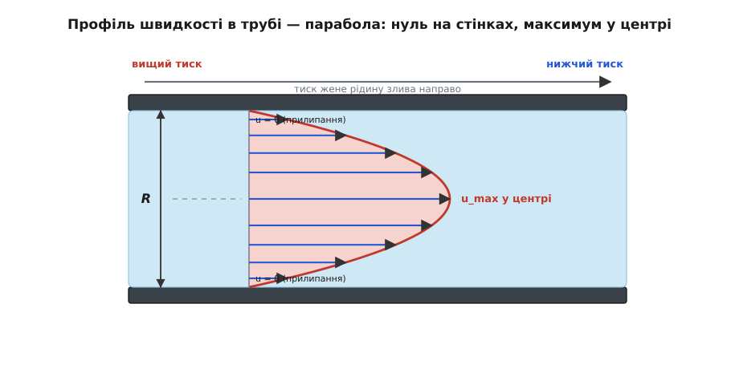
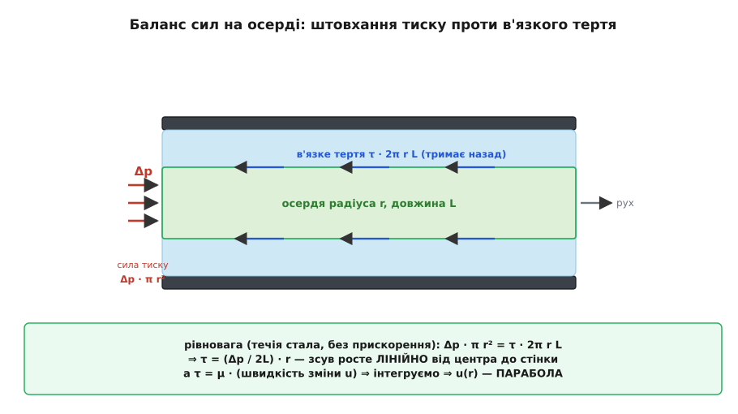
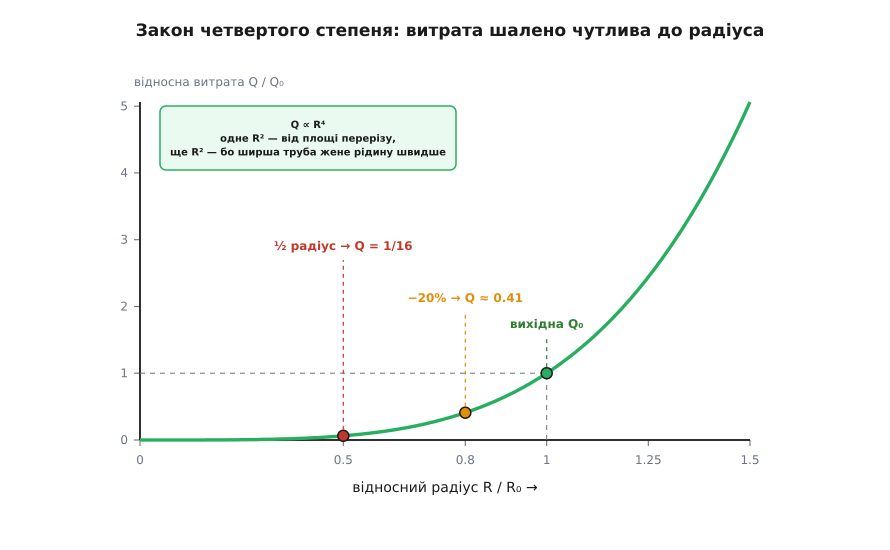
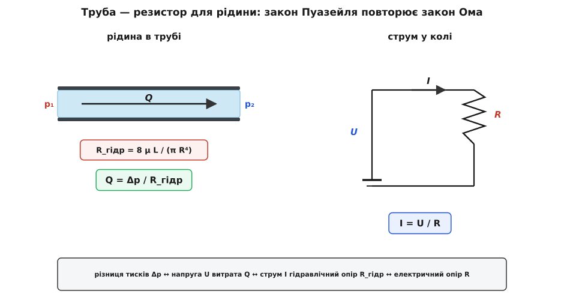

# Течія Пуазейля

<preknowlist>
- [В'язкість](book:physics/viscosity) — внутрішнє тертя рідини: шари, що ковзають один повз одного з різною швидкістю, чіпляються й гальмують сусіда; міра цього чіпляння — коефіцієнт μ.
- [Тиск](book:physics/pressure) — сила на одиницю площі; різниця тисків між кінцями труби і є тим, що жене крізь неї рідину.
</preknowlist>

Візьми дві однакові трубки, тільки одна вдвічі вужча за іншу, і продави крізь кожну воду тим самим натиском. Скільки протече за секунду? Здоровий глузд рахує площу: вужча трубка має вчетверо менший переріз (площа йде як квадрат радіуса), отже нестиме вчетверо менше. А вона несе не вчетверо, а **вшістнадцятеро** менше. Учотирикратне падіння очікуване — але звідки взялися ще одні чотири рази?

Ця загадка — вхід у течію Пуазейля: закон, що каже, скільки в'язкої рідини протече крізь трубу під заданим натиском. Назвали течію на честь [французького лікаря Жана Пуазейля, який у 1840-х вимірював її, шукаючи, за яким правилом кров тече судинами](book:physics/poiseuille-flow/hist-hagen-poiseuille.md). Відповідь ховає два різні ефекти, накладені один на одного, — і саме тому потік залежить від радіуса аж у **четвертому** степені, однією з найкрутіших залежностей у всій буденній фізиці.

## Рідина прилипає до стінок

Почнімо з факту, що суперечить чуттю. Коли рідина тече трубою, шар, який торкається стінки, **стоїть на місці**. Не ковзає, не прослизає — його швидкість рівно нуль. Це **умова прилипання** (по-англійськи *no-slip*): молекули, що впритул до твердої поверхні, зчеплені з нею й рухаються разом зі стінкою, а стінка нерухома. Хоч як гладенько відполіруй трубу, хоч чим її вкрий — біля самої стінки потік завжди завмирає. Це не теоретичне припущення, а один із найнадійніших експериментальних фактів гідродинаміки.

А посередині труби ніщо рідину не тримає — там вона біжить найшвидше. Отже, від нерухомої стінки до прудкого осердя швидкість мусить якось наростати. І наростає вона не стрибком, а плавно: кожен тонкий шар рідини ковзає повз сусідній, трохи повільніший ізсередини й трохи швидший іззовні, а [в'язкість — внутрішнє тертя між шарами](book:physics/viscosity) — не дає їм розійтися різко. Швидший шар тягне повільніший уперед, повільніший гальмує швидшого назад. У підсумку швидкість плавно спадає від центра до стінок, вимальовуючи **параболу**.


*Профіль швидкості в трубі — парабола: на стінках нуль, у центрі максимум. Рідина рухається не суцільним стовпчиком, а вкладеними шарами-циліндрами, кожен трохи прудкіший за той, що ззовні.*

> 🔧 **Навіщо це.** Прилипання означає, що рідина коло стінки завжди застоюється. Тому труба поволі заростає осадом саме зсередини по стінці, теплообмінник кіркою вкривається з боку рідини, а вкрити трубу «слизьким» покриттям, щоб вода бігла швидше, майже не допомагає: гальмує не поверхня, а той факт, що пристінний шар нерухомий у принципі. Уся інженерія «пограничного шару» — течії в тонкій зоні коло стінки — виростає з цього одного факту.

## Чому саме парабола

Звідки береться саме параболічна форма, а не якась інша? Простежмо сили, бо парабола випливає з них напряму.

Вирізьмо подумки всередині труби тонкий **циліндр-осердя** радіуса *r*, співвісний із трубою, завдовжки *L*. Спереду на його торець тисне вищий тиск, ззаду — нижчий; різниця тисків Δ*p* штовхає осердя вперед із силою «тиск × площа торця»:

```
сила тиску = Δp · π r²
```

Що ж утримує осердя, не даючи йому нескінченно розганятися? Тільки тертя об рідину зовні — [в'язке зсувне зусилля](book:physics/viscosity) на його бічній поверхні. Течія стала, осердя не прискорюється, отже за другим законом Ньютона сили в рівновазі: штовхання тиску точно врівноважене гальмуванням з боків. Бічна поверхня осердя дорівнює 2π*r*·*L*, а діє на неї дотичне напруження τ, тож:

```
Δp · π r²  =  τ · 2π r L
```

Скоротімо на π*r* — і випливе напрочуд простий висновок: дотичне напруження росте **лінійно** від центра до стінки.

```
τ = (Δp / 2L) · r
```

У самому центрі (*r* = 0) зсуву немає, коло стінки (*r* = *R*) він найбільший. А тепер згадаймо, що таке в'язке напруження: воно дорівнює в'язкості, помноженій на те, **як швидко швидкість міняється поперек потоку**, τ = μ·(швидкість зміни *v* уздовж *r*). Прирівняймо два вирази для τ і «розкрутімо» назад — від того, як круто швидкість спадає, до самої швидкості. Позаяк круть спадання лінійна по *r*, сама швидкість виходить квадратична:

```
v(r) = (Δp / 4μL) · (R² − r²)
```

Ось і парабола. На стінці (*r* = *R*) вона дає нуль — прилипання; у центрі (*r* = 0) — найбільше значення:

```
v_max = Δp · R² / (4μL)
```

[Повне виведення — з рівнянь руху в'язкої рідини, крок за кроком до профілю й витрати, з поправками на неколовий переріз](book:physics/poiseuille-flow/math-poiseuille-derivation.md) винесено окремо; тут важлива сама логіка: рівновага тиску й тертя дає лінійний зсув, а лінійний зсув інтегрується в параболу швидкості.


*Баланс сил на осерді: штовхання тиску (за площею торця, ∝ r²) урівноважене тертям (за бічною поверхнею, ∝ r). Тому зсув росте з r лінійно — і, проінтегрований, дає параболу.*

## Витрата й закон четвертого степеня

Профіль ми знаємо — тепер підрахуймо, скільки рідини тече всього. Кожне тонке кільце на радіусі *r* має площу 2π*r*·d*r* і несе свою швидкість *v*(*r*); склавши внесок усіх кілець від центра до стінки, дістаємо **об'ємну витрату** *Q* — скільки кубометрів проходить крізь переріз за секунду. Інтеграл параболи по круглому перерізу дає знаменитий результат:

```
Q = π R⁴ Δp / (8 μ L)        (закон Пуазейля)
```

Витрата прямо пропорційна натиску Δ*p* і обернено — в'язкості μ та довжині *L* (довша труба гальмує дужче, густіша рідина тече важче — усе очікувано). Але серце формули — **R⁴**. Ось де розкривається загадка з початку. Радіус входить у четвертому степені з двох незалежних причин, накладених одна на одну:

- **Перший степінь площі (R²):** ширша труба має більший переріз, тож уміщає більше рідини — це звичайне «більша площа несе більше».
- **Другий степінь від профілю (ще R²):** у ширшій трубі стінки далі від осердя, тому середня рідина менше відчуває їхнє гальмування й сама рухається швидше. Із формули *v_max* видно: швидкість у центрі росте як *R*².

Помнож «більше рідини» на «швидше рідина» — і два *R*² зливаються в *R*⁴. Саме тому вдвічі вужча труба несе не в 4, а в 16 разів менше: ½⁴ = 1/16.


*Закон четвертого степеня: витрата шалено чутлива до радіуса. Крива задирається так круто, що навіть невелике звуження труби різко душить потік.*

Із витрати легко дістати й **середню** швидкість — просто поділивши на площу перерізу: v̄ = *Q*/(π*R*²) = Δ*p*·*R*²/(8μ*L*). Порівняй із *v_max* — середня рівно **вдвічі менша** за швидкість у центрі. Це загальна риса параболічного профілю: половина максимуму.

**Приклад: вода крізь тонку трубку.** Трубка радіуса *R* = 0.5 мм = 5·10⁻⁴ м, завдовжки *L* = 10 см = 0.1 м; натиск Δ*p* = 1000 Па (≈ стовпчик води 10 см); в'язкість води μ = 1.0·10⁻³ Па·с. Яка витрата?

```
R⁴ = (5·10⁻⁴)⁴ = 6.25·10⁻¹⁴ м⁴
чисельник = π · 6.25·10⁻¹⁴ · 1000 = 1.96·10⁻¹⁰
знаменник = 8 · 1.0·10⁻³ · 0.1 = 8·10⁻⁴
Q = 1.96·10⁻¹⁰ / 8·10⁻⁴ = 2.45·10⁻⁷ м³/с
  ≈ 0.25 мл/с   (близько 15 мл/хв)
```

Чверть мілілітра за секунду — вихід крапельниці. А тепер зверни увагу, як мало треба, щоб його вбити.

> 🔧 **Навіщо це.** Четвертий степінь — це чому калібр голки чи катетера вирішує все. Голка вдвічі товща проганяє в 16 разів більше за той самий натиск; тому медсестра для швидкого вливання бере товсту голку, а не піднімає мішок вище. Це ж чому вузька судина в тілі — така біда: коли артерію звужує наліт, серце мусить піднімати тиск різко, бо потік провалюється в четвертому степені. І чому забита труба в домі мучить: тонкий шар накипу по стінці зменшує радіус трохи, а натиск на крані падає непропорційно сильно.

**Приклад: що робить звуження.** Хай радіус труби зменшився усього на 20% — до 0.8 від початкового, натиск той самий. У скільки разів упаде потік?

```
Q_нове / Q_старе = (0.8)⁴ = 0.41
```

П'ята частина радіуса — і від потоку лишається сорок відсотків, тобто він упав більш ніж наполовину. А звузь радіус удвічі — лишиться 1/16, якихось шість відсотків. Ось чому закон Пуазейля такий немилосердний: труба чи судина реагує на найменше звуження навдивовижу різко.

## Труба як резистор: гідравлічний опір

Перепишімо закон Пуазейля так, щоб проступила його глибша природа. Згрупуймо все, крім натиску, в одну величину:

```
Q = Δp / R_гідр ,   де   R_гідр = 8 μ L / (π R⁴)
```

Витрата = натиск, поділений на **гідравлічний опір** *R_гідр* труби. Формула майже дослівно повторює [закон Ома для електричного кола: струм = напруга / опір](book:electronics/ohms-law). І це не поверхнева схожість, а справжня аналогія, у якій кожна величина має двійника:

```
різниця тисків Δp   ↔   напруга U        (що жене потік)
витрата Q           ↔   струм I          (що тече)
гідравлічний опір   ↔   електричний опір  (що заважає)
```


*Труба — це резистор для рідини. Натиск грає роль напруги, витрата — струму, а закон Пуазейля має точно ту саму форму, що й закон Ома.*

Аналогія працює й далі. Дві труби одна за одною — опори **додаються**, як послідовні резистори (тому довгий трубопровід тече мляво). Дві труби пліч-о-пліч — опори складаються, як паралельні резистори, тож сумарний потік більший за кожен окремо. На цьому стоять і водопровід, і мікрофлюїдика, і навіть груба модель кровообігу. [Як порахувати витрату в мережі труб через опори — послідовні, паралельні, з розгалуженнями — робочим кодом за аналогією Ома](book:physics/poiseuille-flow/proj-hydraulic-network.md) розібрано окремо.

Де аналогія ламається — теж корисно знати. Гідравлічний опір *R_гідр* «чесний» (сталий) лише поки тримається закон Пуазейля: течія плавна, шарувата. Розжени потік до вихорів — і опір підскочить, залежність від натиску викривиться, проста лінійна пропорція перестане діяти. Електричний резистор такого капризу не має.

## Де закон працює, а де ламається

Закон Пуазейля — ідеалізація, і його краса тримається на кількох умовах. Порушиш котрусь — і формула збреше. Перелічмо їх чесно, бо саме на межах ловляться помилки.

- **Течія має бути шаруватою (ламінарною).** Слово **ламінарна** — від латинського *lamina* (пластинка, шар): рідина ковзає вкладеними шарами, не перемішуючись. Розжени її надто — і шари зірвуться у вихори, настане турбулентність, а витрата провалиться далеко нижче за пуазейлеве значення. Межу стереже [число Рейнольдса — безрозмірна міра, що зважує інерцію потоку проти в'язкості](book:physics/reynolds-number); для труб перехід настає приблизно при Re ≈ 2300. У прикладі з водою вище число Рейнольдса виходить близько 310 — глибоко в ламінарній зоні, тож формула там законна.
- **Течія має бути «усталеною» вздовж труби.** Коло входу в трубу профіль ще не парабола — він доформовується на так званій вхідній ділянці. Закон Пуазейля описує вже сформований профіль; для коротких трубок і початку довгих потрібні поправки.
- **Рідина має бути ньютонівською.** Закон припускає, що в'язкість μ стала. Для води, олії, повітря це так. А от **кров** — ні: вона повна клітин, її в'язкість залежить від швидкості зсуву й від ширини судини. Тому іронія історії: Пуазейль шукав закон крові, а знайшов закон **простих** рідин; для самої крові його формула — лише перше наближення.
- **Рідина має бути практично нестисливою, а труба — жорсткою.** Для рідин у металевих трубах — гаразд. Для газів під низьким тиском рідина починає прослизати по стінці (прилипання слабшає), а живі судини піддатливі й розширюються під тиском — і те, і те відводить від чистого Пуазейля.

Варто поставити цей закон поруч із його дзеркальним братом. [Рівняння Бернуллі описує течію **без** тертя, де тиск обмінюється зі швидкістю вздовж струминки](book:physics/dynamic-pressure); там в'язкості немає зовсім. Пуазейль — навпаки, увесь про в'язкість: тут натиск витрачається не на розгін, а на подолання тертя, і саме тому вздовж труби тиск неухильно спадає. Дві картини доповнюють одна одну: Бернуллі керує там, де рідина летить вільно й тертя знехтуване, Пуазейль — там, де вона протискається крізь вузьке й тертя головне.

## Що з усього цього винести

Течія Пуазейля — це відповідь на просте питання: скільки в'язкої рідини протече крізь трубу під заданим натиском. Уся будова закону виростає з одного факту — рідина прилипає до стінок, тож між нерухомим краєм і прудким центром шари ковзають і труться, вимальовуючи параболічний профіль швидкості. Рівновага тиску, що штовхає, і в'язкого тертя, що тримає, дає лінійний зсув, а той інтегрується в параболу; склавши всі шари, дістаємо витрату *Q* = π*R*⁴Δ*p*/(8μ*L*). Головне тут — четвертий степінь радіуса, у якому зливаються два ефекти: ширша труба і вміщає більше рідини, і жене її швидше. Тому потік навдивовижу чутливий до радіуса, а сама труба поводиться як резистор для рідини, слухняно повторюючи закон Ома, — доки течія лишається шаруватою.
