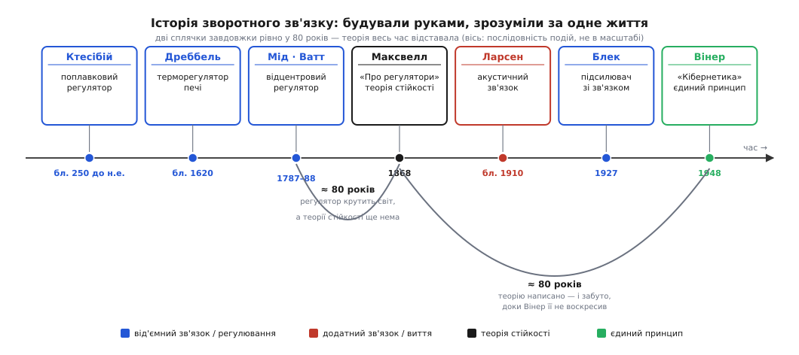

# 📜 Хто навчив машини виправляти самих себе

Найдивовижніше в історії зворотного зв'язку — те, що люди майстрували його руками за багато століть до того, як бодай хтось зрозумів, що саме тримає в руках. Регулятор уже крутив парову машину й молов борошно на ціле місто, а поняття «зворотний зв'язок» іще не існувало; ніхто не вмів ані порахувати наперед, коли пристрій устоїть, ані пояснити, чому інколи він, замість триматися заданого, зривається в незбагненне тремтіння. Ідея сама себе випереджала: спершу — розкидані по століттях робочі пристрої, кожен вигаданий окремо й ні з чим не зведений, і аж потім, дуже нескоро, — думка, що всі вони про одне.

Ця історія — не низка винаходів, а повільне прозріння. Її варто пройти по людях і датах саме тому, що вона показує рідкісну річ: як інженерія тисячоліттями бігла попереду теорії, доки та її наздогнала.


*Зворотний зв'язок будували руками тисячоліттями, а зрозуміли — за одне людське життя. Дві сплячки завдовжки рівно у 80 років роблять цю відсталість теорії наочною: від Ватта (1788) до першої математики стійкості Максвелла (1868) машина вже крутила світ, а порахувати її ще не вміли; а тоді Максвеллову працю на ті самі 80 років забули, доки її не воскресив Вінер (1948). Синім позначено від'ємний зв'язок і регулювання, червоним — додатний, що зривається у виття, темним — теорію, зеленим — думку, що звела все в один принцип.*

## Найдавніші пристрої, що берегли самі себе

Перший відомий рукотворний зворотний зв'язок побудував **Ктесібій** (гр. *Κτησίβιος*) — грецький механік, що працював в Александрії елліністичного Єгипту десь у III ст. до н.е. У його водяному годиннику точність ходу впиралася в одну умову: вода мала витікати рівномірно, а для цього — стояти на сталому рівні в живильному сосуді. Ктесібій поставив у сосуд поплавок з конічним клапаном, і той сам стеріг рівень: щойно вода трохи спадала, поплавок опускався, клапан прочинявся ширше, притік зростав і піднімав рівень назад; щойно рівень підіймався — поплавок спливав і клапан прикривався. Рівень тримав сам себе. Це від'ємний зворотний зв'язок у найчистішому вигляді — за якихось дві тисячі двісті років до того, як явище дістало ім'я. *(Статус: усталено; сам механізм відомий за пізнішими авторами й реконструйований, але авторство й принцип сумніву не викликають.)*

А тоді — довга мовчанка на багато століть, аж до другого пам'ятного пристрою. Близько 1620 року нідерландець **Корнеліс Дреббель** (нід. *Cornelis Drebbel*) зробив для печі перший терморегулятор. У піч він завів посудину з рідиною, що розширювалася від тепла; розширюючись, вона штовхала важіль, а той прикривав заслінку тяги — вогонь притихав, температура переставала рости. Охолоне — рідина стисне, заслінка відкриється, вогонь розгориться знову. Кумедно, що рухала Дреббелем алхімія: він вірив, що коли витримати метал за точно сталої температури дуже довго, той обернеться на золото, — і саме заради цього сталого тепла збудував пристрій, що самотужки його береже. Золота не вийшло, а от термостат — цілком робочий — вийшов.

Спільне в цих двох винаходах не лише те, що обидва працюють. Спільне — що жоден їхній творець не бачив у своєму пристрої **загального принципу**. Поплавок і термостат лишалися кожен сам по собі, хитромудрою штукою для однієї задачі, а не двома прикладами однієї ідеї. Ідеї ще не було.

## Відцентровий регулятор: перший масовий зворотний зв'язок

Пристрій, з якого зазвичай і починають цю історію, — **відцентровий регулятор** парової машини, 1788 рік, ім'я **Джеймса Ватта** (шотл. *James Watt*). І тут одразу треба розвіяти зручний міф, бо Ватт його не винаходив і сам ніколи цього не стверджував.

Відцентрові регулятори — важільці з тягарцями, що розлітаються від обертання, — задовго до Ватта крутилися на **вітряках**. Мірошникам треба було тримати сталий зазор між жорнами: розкрутиться вітер — камінь підскакує, борошно грубшає, тож потрібен пристрій, що сам підважує верхній камінь за швидкістю обертання (ремесло звало це «підважуванням», *lift-tenter*). Ба більше, за рік до Ватта, **1787-го**, англійський механік і мірошник **Томас Мід** (англ. *Thomas Mead*) запатентував відцентровий маятник саме як **регулятор швидкості** вітряка — не просто зазору, а самого ходу. А партнерові Ватта, **Метью Болтону** (англ. *Matthew Boulton*), відцентрові регулятори трапилися на очі на борошномельні (парові машини Болтона й Ватта якраз крутили лондонський млин Albion Mills), — і саме Болтон підказав Ваттові перенести знайому млинову штуку на парову машину.

Ватт переніс. Його регулятор — конічний маятник із двома кулями на важелях: розкрутиться вал — кулі розлітаються відцентровою силою, важіль тягне заслінку пари, машина сповільнюється; сповільниться — кулі опадають, заслінка прочиняється, машина прискорюється. Швидкість тримає сама себе біля заданої.

Чому ж тоді ця історія — про Ватта, а не про Міда чи безіменних мірошників? Через **масштаб**, і через одну промовисту дрібницю: регулятор Ватт **не патентував**. Тому пристрій розійшовся вільно — на десятки, згодом сотні тисяч парових машин по всьому світу. Уперше в історії від'ємний зворотний зв'язок став **масовим**: не дивовижа в одному годиннику чи одній печі, а буденний вузол, що фактично регулював швидкість цілої промислової революції. І от парадокс: механізм, на якому крутилося дев'ятнадцяте століття, працював геть **без теорії**. Інженери будували регулятори дедалі більші — і раз по раз наражалися на прикру загадку: замість спокійно завмерти на заданій швидкості, машина починала «нишпорити» (*hunting*) — швидкість гойдалася вгору-вниз, регулятор розхитувався й не знав упину, точнісінько як [загасання, що обертається на розгойдування](topic:physics/damped-oscillator). Чому одні регулятори тримали лад, а інші дзвеніли, і як спроєктувати, щоб не дзвеніли, — не міг сказати ніхто.

## Максвелл: перша математика стійкості

Загадку нишпорення розв'язав **Джеймс Клерк Максвелл** (шотл. *James Clerk Maxwell*, народжений 1831 року в Единбурзі) — той самий, що звів воєдино електрику й магнетизм. 1868 року він друкує у *Proceedings of the Royal Society* коротку працю з незугарно скромною назвою — **«Про регулятори»** (*On Governors*). Максвелл не сідав засновувати науку; нишпорення було справжньою інженерною докукою (зокрема — у годинникових приводах телескопів, що збивали спостереження), і він узявся її порахувати.

Зробив він ось що. Поблизу заданої швидкості відхилення мале, тож рівняння руху можна **лінеаризувати** — замінити на просте, лінійне щодо похибки. А доля лінійного рівняння цілком читається з **коренів** його характеристичного рівняння: якщо всі корені мають від'ємну дійсну частину, будь-яке збурення згасає й система стійка; якщо є додатна — збурення розганяється; а комплексні корені означають, що до згасання чи розгону додається **коливання**. Ось звідки бралося нишпорення: комплексні корені з майже нульовою дійсною частиною — і регулятор гойдається, не вгамовуючись. Це була **перша повноцінна математична теорія стійкості** системи керування.

І тут-таки Максвелл провів різницю, що дожила незмінною до кожного сучасного регулятора. Він розділив **«помірники»** (*moderators*) — де виправна дія пропорційна самій похибці швидкості (Ваттів маятник саме такий) — і справжні **«регулятори»** (*governors*), що додають іще дію, пропорційну **накопиченій** похибці, її інтегралу в часі. Різниця не косметична:

```
помірник (пропорційна дія):   виправлення ∝ похибка
регулятор (+ інтегральна дія): виправлення ∝ похибка + Σ(похибка за час)
```

Сама пропорційна дія лишає невеличкий **сталий недобір**: щоб важіль тиснув, потрібна ненульова похибка, тож система тримається трохи збоку від заданого. Інтегральна дія накопичує навіть крихітну сталу похибку, аж доки не зжене її до нуля. Це — прямі предки літер **P** та **I** у сьогоднішньому PID-регуляторі, названі й розрізнені ще 1868 року.

А далі — найдивніше в усій оповіді. Праця Максвелла **пірнула в забуття**. Її вважали важкою для розуміння, на неї майже не посилалися, і вона пролежала непрочитаною близько **вісімдесяти років**.

## Вінер воскрешає забуте — і дає ідеї ім'я

Витяг Максвелла з небуття американський математик **Норберт Вінер** (англ. *Norbert Wiener*). 1948 року виходить його книжка з назвою, що вперше зводить усе докупи: **«Кібернетика, або Керування і зв'язок у тварині та машині»** (*Cybernetics: Or Control and Communication in the Animal and the Machine*). Саме слово Вінер викував із грецького *kybernetes* (гр. *κυβερνήτης* — стерновий, керманич корабля), і закільцював при цьому чудову етимологічну петлю: він завважив, що й англійське *governor* («регулятор») походить — через латинське спотворення *gubernator* — від того самого грецького керманича. Тобто Ваттові кулі на важелях і Вінерова нова наука тримаються одного кореня: людини біля стерна, що весь час підправляє курс проти хвилі.

Вінер потягнувся до забутої праці Максвелла 1868 року й **назвав її першою значущою роботою про зворотний зв'язок**. Від 1868-го до 1948-го — знову рівно вісімдесят років, тепер уже сну самої теорії, а тоді пробудження. Але головний Вінерів стрибок був не історичний, а концептуальний: він побачив, що **та сама петля** керує машиною і живим тілом однаково. Ваттів регулятор, що тримає швидкість вала, і людське тіло, що пітніє, обороняючи свої 37 °C, — це не аналогія й не збіг, а **один і той самий принцип**. Ідея, якої бракувало дві тисячі років, нарешті проступила: зворотний зв'язок — не про парові машини і не про тварин, а про **петлю** як таку, хоч би де вона замкнулася.

## Блек: зворотний зв'язок як свідомий інженерний засіб

Поки теоретики доганяли минуле, інженер зробив зі зворотного зв'язку **свідомий засіб проєктування** — і заплатив за це дев'ятьма роками боротьби. Ідеться про **Гарольда Стівена Блека** (англ. *Harold Stephen Black*), інженера Bell Labs.

Задача була цілком приземлена: телефонія через увесь континент. Щоб голос дійшов від океану до океану, його треба раз по раз підсилювати — сотнями лампових повторювачів уздовж лінії. Біда в тім, що кожен підсилювач додає дрібку **викривлення**, і на сотому повторювачі голос перетворюється на кашу. Очевидні ліки (кращі лампи, точніше налаштування) не рятували: викривлення накопичувалося швидше, ніж його вдавалося тлумити.

Блекова думка була майже єретична: **пожертвувати підсиленням заради чистоти**. Заведи частину виходу назад на вхід у **протифазі** (від'ємно) — і підсилювач раз у раз сам віднімає власне викривлення; сирого підсилення лишиться в рази менше, зате те, що лишиться, буде чисте й стійке. У числах ідея, яку Блек накидав того ранку, зводиться до однієї формули замкненого підсилення:

```
підсилення з петлею:  A / (1 + A·β)
коли A·β ≫ 1:         ≈ 1 / β
```

Уся хитрість — у другому рядку. Якщо власне підсилення лампи A велике (а воно велике, тільки гуляє від нагріву й старіння), то результат перестає від нього залежати зовсім і визначається **лише** пасивним колом зворотного зв'язку β — котушками й опорами, які не дрейфують. Підсилювач стає байдужим до примх власних ламп. Ось що коштувало віддати більшу частину підсилення.

Народження цієї ідеї обросло знаменитою сценою — за власним спогадом Блека. Ранок **2 серпня 1927 року**, пором Lackawanna везе його через Гудзон на роботу; осяяння находить просто в дорозі, а писати нема на чому — і він хапає свій примірник *The New York Times*, одна сторінка якого випадково виявилася чистою, та накреслює на ній схему й рівняння. *(Статус: правдоподібно, але з домішкою леґенди. Це розповідь самого винахідника; історик техніки Девід Мінделл у праці «Opening Black's Box» (2000) застерігає, що яскравий спалах на поромі спрощує насправді поступову, колективну роботу Bell Labs. Серцевина події справжня, обгортка — трохи прикрашена самим Блеком.)*

Наскільки думка була всупереч усталеному, показує доля патенту. Заявку Блек подав **1928 року**, а патент США **№ 2 102 671** («Wave translation system») видали аж **21 грудня 1937-го** — понад **дев'ять років** тяганини. Причина проста: свідомо викидати підсилення здавалося абсурдом, що суперечить здоровому глузду. Патентне відомство радилося зі скептичними експертами, які запевняли, що коло працювати не буде; Блек згадував, що заявку зустріли з тією самою недовірою, яку бережуть для вічних двигунів. *(Статус: дати й тяганина — усталено; порівняння з вічним двигуном — Блекове власне формулювання.)*

І скептики не були просто впертими — від'ємний зв'язок і справді буває підступний. Накрути підсилення петлі надто високо чи дай накопичитися запізненню фази — і на певній частоті виправлення почне приходити **в такт** із відхиленням, а не проти нього; підсилювач «заспіває», зірвавшись у самозбудні коливання. Саме тому боротьба за патент була ще й боротьбою за теорію: коли петля стійка, а коли вона співає, суворо порахував колега Блека по Bell Labs **Гаррі Найквіст** (англ. *Harry Nyquist*) 1932 року, а Блекова стаття «Stabilized Feed-Back Amplifiers» 1934-го звела проєктування на тверду основу. Наскільки далеко можна ще накрутити підсилення чи затримку, перш ніж петля задзвенить, відтоді міряють [запасом стійкості](topic:electronics/stability-margins). Так Блеків підсилювач виявився Максвелловим питанням стійкості, переродженим в електроніці: те саме «устоїть чи піде врознос», що нишпорило у Ваттових регуляторах.

## Ларсен: коли петля співає

І тут природно замикається остання дійова особа — той, хто першим описав **співочу** петлю. **Сьорен Абсалон Ларсен** (дан. *Søren Absalon Larsen*, 1871–1957), данський фізик, десь близько 1910 року перший у світі пояснив **акустичний зворотний зв'язок**: мікрофон чує гучномовець, який підсилює той-таки мікрофон, — вихід годує вхід, на певній частоті збіг фаз дає підсилення в такт, і петля сама себе розганяє до пронизливого вереску. **Ефект Ларсена.** *(Статус: усталено.)*

Ефект Ларсена — точне дзеркало Блекового підсилювача: **та сама петля**, але з протилежним знаком. Блек дев'ять років переконував світ, що приборкав розгін, перевернувши знак на мінус; Ларсенове виття — це той самий контур, полишений на плюс. Кожен вереск мікрофона в шкільній залі носить ім'я фізика й наживо доводить головне, до чого дві тисячі років ішла ця історія: доля петлі вирішується її **знаком**.

## Один принцип, дібраний по крихтах

Відступімо на крок і подивімося на всю дорогу разом. Спершу — **робочі пристрої** без жодної теорії: поплавок Ктесібія, термостат Дреббеля, Ваттів регулятор, що вже крутив цілу промисловість. Тоді — **перша математика однієї задачі**: Максвелл рахує стійкість регулятора, розрізняє пропорційну й інтегральну дію — і на вісімдесят років лягає під сукно. Далі — **загальний принцип**: Вінер воскрешає Максвелла, кує «кібернетику» й бачить одну петлю в машині та живому тілі. Паралельно — **свідомий засіб**: Блек обертає від'ємний зв'язок на інструмент, ціною дев'ятирічної боротьби з недовірою, а Найквіст дає йому строгу теорію стійкості. І нарешті — **темний двійник**: Ларсенів вереск нагадує, що варто перевернути знак, і той самий рятівний контур стає згубним.

Мораль усієї цієї повільної історії — в одному: люди вміли **змушувати зворотний зв'язок працювати** руками й на дотик дві тисячі років, а от **побачити**, що клапан-поплавок, термостат, паровий регулятор, температурна оборона тіла, телефонний підсилювач і співочий мікрофон — це все **одна ідея**, спромоглися аж до середини двадцятого століття. І та єдина річ, що їх ріднить, — та, яку найдовше не могли розгледіти, — найскромніша: **знак петлі** й те, чи встигає відповідь вчасно.
