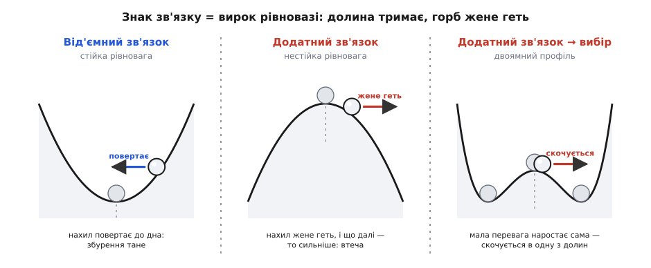
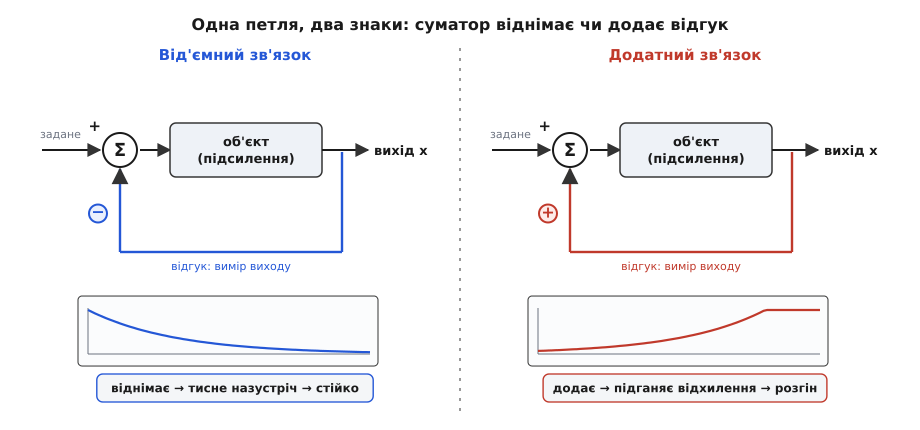
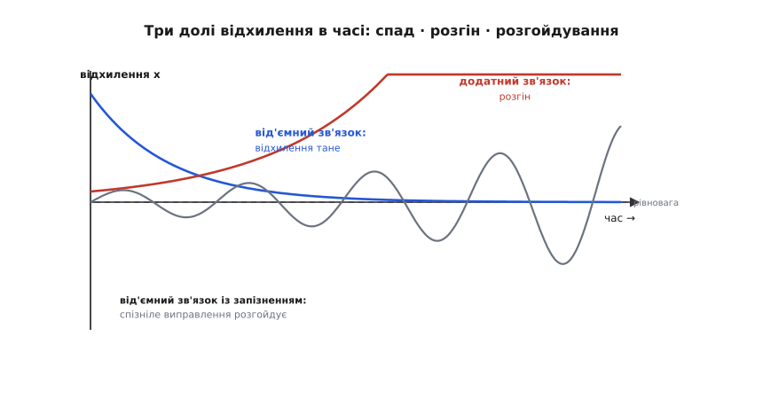

# Додатний і від'ємний зворотний зв'язок: коли система відповідає сама собі

<preknowlist>
- [Другий закон Ньютона](book:physics/newtons-second-law) — сила задає прискорення (F = m·a); саме через нього відхилення тіла породжує рух-відповідь.
- [Похідна](book:math/derivative) — миттєва швидкість зміни величини; тут ідеться про те, як швидкість наростання відхилення залежить від самого відхилення.
- [Пружна деформація і закон Гука](book:physics/elastic-deformation) — повертальна сила пружини F = −k·x, найпростіший приклад дії, що тягне тіло назад до рівноваги.
</preknowlist>

Присуньте мікрофон надто близько до колонки, у яку він же й співає, — і зала вибухне пронизливим виттям, що само собою наростає з нізвідки, аж доки хтось не відсмикне руку. А тепер відпустіть кульку на дні миски: хоч як її штовхніть, вона покотиться назад, погойдається туди-сюди й завмре внизу. Нестримне наростання й тихе повернення до спокою здаються протилежностями, та насправді це дві половини одного явища. Обидві системи **відповідають на власне відхилення**: те, що діється на виході, повертається назад і впливає на причину. Уся різниця — у **знаку** цієї відповіді.

Це і є **зворотний зв'язок** (англ. *feedback*, від *feed back* — «подавати назад»): коли результат роботи системи заводиться назад на її вхід і сам починає керувати тим, що коїться далі. Зв'язок буває двох знаків, і від знаку залежить геть усе. **Від'ємний** зворотний зв'язок (лат. *negativus* — «заперечний») діє **проти** відхилення: щойно щось відхиляється, зв'язок штовхає назад, до рівноваги. **Додатний** (*positivus* — «стверджувальний») діє **за** відхиленням: щойно щось зрушило, зв'язок підганяє його рухатися ще далі в той самий бік. Один гасить, другий розганяє — з тих самих деталей, з тієї самої фізики.

### Долина і горб: два вироки одному поштовху

Найчистіше цю різницю видно на кульці й рельєфі. Кулька на дні долини й кулька на маківці горба перебувають у рівновазі однаково: поки їх не чіпати, вони стоять. Але варто злегка штовхнути — і долі розходяться.


*Той самий поштовх, три різні вироки. У долині нахил повертає кульку до дна — рівновага стійка (від'ємний зв'язок). На горбі нахил жене кульку геть, і що далі вона відкотилась, то крутіший схил і сильніший поштовх — рівновага нестійка (додатний зв'язок). Двоямний профіль показує, як додатний зв'язок посередині перетворюється на вибір: найменша перевага в один бік наростає сама, і система скочується в одну з двох стійких долин.*

У долині будь-яке відхилення виводить кульку на схил, а схил тягне її **вниз, назад до дна**. Сила відповіді напрямлена проти зміщення — це від'ємний зв'язок у чистому вигляді, точнісінько як повертальна сила [пружини](book:physics/elastic-deformation), F = −k·x. Тому дно долини — **стійка рівновага**: система сама себе виправляє, і збурення тане.

На маківці горба все навпаки. Щойно кулька зрушила, схил підхоплює її й тягне **далі від вершини**. І що більше вона відкотилась, то крутіший під нею схил — то сильніша сила, що жене її геть. Відповідь напрямлена **за** зміщенням і сама себе підживлює. Це додатний зв'язок, а вершина горба — **нестійка рівновага**: теоретично там можна балансувати, та найменше збурення розростається у втечу.

Ось де ховається головна асиметрія. Від'ємний зв'язок робить точку рівноваги пасткою, куди система сама скочується звідусіль. Додатний робить її вододілом, від якого система тікає при найменшому дотику. Саме тому в природі ми **бачимо** стійкі рівноваги (кульки лежать на дні, а не на вершинах) — нестійкі не доживають до спостереження, їх змітає перше-ліпше збурення.

### Чому наростання й спад — саме експоненційні

Придивимось до горба зблизька, і виявиться дивовижна річ: поблизу рівноваги сила відповіді майже завжди **пропорційна відхиленню**. Мале зміщення — малий нахил і кволий поштовх; удвічі більше зміщення — удвічі крутіший нахил і вдвічі сильніший поштовх. А сила, за [другим законом Ньютона](book:physics/newtons-second-law), задає, як швидко змінюється рух. Виходить проста, але могутня умова: **швидкість зміни відхилення пропорційна самому відхиленню**.

```
dx/dt = k · x
```

Це рівняння — серце всієї теми, і знак сталої k у ньому — це і є знак зворотного зв'язку. Розв'язок відомий: величина, чия швидкість зростання пропорційна їй самій, змінюється **експоненційно** ([експоненційне ОДУ](book:math/exponential-ode)):

```
x(t) = x₀ · e^(k·t)
```

Тепер знак k вирішує все. Якщо **k < 0** (від'ємний зв'язок), показник від'ємний — відхилення експоненційно **тане** до нуля з характерним часом τ = 1/|k|. Система забуває збурення й повертається в рівновагу. Якщо **k > 0** (додатний зв'язок), показник додатний — відхилення експоненційно **розганяється**, і що воно більше, то швидше росте далі.

Чому саме експонента, а не, скажімо, рівномірне сповзання? Бо поштовх у кожну мить пропорційний тому, як далеко система вже відійшла. Відійшла вдвічі далі — її штовхає вдвічі сильніше — вона тікає ще стрімкіше — штовхає ще дужче. Наростання саме себе прискорює, і це неминуче дає вибух експоненти, а не рівну лінію. Дзеркально працює й спад: що ближче до рівноваги, то кволіше повертальна сила, тож останні крихти відхилення система стирає дедалі повільніше — знову експонента, але спадна.

Тут ідеться про одну змінну, та справжні системи мають їх кілька заразом — приміром, і положення, і швидкість, — і тоді знак зв'язку ховається вже не в одному числі k, а в **парі власних чисел** системи; їхні знаки й вирішують, чи збурення тане, чи розганяється, а комплексні власні числа додають до цього ще й коливання. Як лінеаризувати довільну систему поблизу рівноваги, дістати ці числа й прочитати з них долю, розібрано в [математичній вставці про лінійну стійкість](book:physics/positive-negative-feedback/math-linear-stability.md).

> 🔧 **Навіщо це.** Час τ = 1/|k| — головне число, яке інженер витягує з будь-якого зв'язку. Для від'ємного це **час заспокоєння**: за нього регулятор гасить збурення, і чим він менший, тим прудкіший відгук. Для додатного це **час утечі**: за нього мала похибка виростає в аварію. Балансир дрона чи ракети живе саме в цьому змаганні часів — його від'ємний зв'язок мусить встигати виправляти швидше, ніж власна нестійкість апарата встигає розганяти похибку.

### Приклад: чому впаде мітла і встоїть маятник

Обидва знаки живуть в одному тілі — звичайному маятнику, і різняться лише тим, з якого боку від осі висить вантаж.

**Умова.** Стрижень завдовжки L = 1 м на осі. У двох станах: вантаж **звисає** вниз (маятник) і вантаж **балансує** зверху (перевернутий маятник, як мітла на долоні). Обидва трохи відхилені від вертикалі на θ₀ = 1°. Що станеться з кожним?

Мала кутова відповідь обох описується тим самим рівнянням, і вся різниця — у знаку:

```
звисає:     θ̈ = −(g/L)·θ     повертальна дія → від'ємний зв'язок
балансує:   θ̈ = +(g/L)·θ     перекидальна дія → додатний зв'язок

швидкісний масштаб:  √(g/L) = √(9.8 / 1) = 3.13  1/с
```

У звисаючого маятника знак мінус: тяжіння завжди тягне вантаж назад до низу. Це від'ємний зв'язок, і він дає не втечу, а **коливання** — стрижень гойдається туди-сюди з періодом

```
T = 2π / √(g/L) = 6.283 / 3.13 ≈ 2.0 с
```

і відхилення в 1° так і лишається 1° — система стійка. У перевернутого — знак плюс: тяжіння тягне вантаж не назад, а далі від вершини. Це додатний зв'язок, і замість коливань виходить розгін:

```
θ(t) ≈ θ₀ · e^(√(g/L)·t)  = 1° · e^(3.13·t)
подвоєння кута кожні:  ln2 / 3.13 ≈ 0.22 с
час від 1° до ≈ 60° (падіння):  ln(60) / 3.13 ≈ 1.3 с
```

**Висновок.** Той самий стрижень, та сама сила тяжіння, той самий кволий поштовх у 1° — а долі протилежні винятково через знак зв'язку. Звисаючий вантаж вертає сам себе й вічно гойдається; перевернутий трохи більше ніж за секунду перекидається, подвоюючи нахил щоп'ятої частки секунди. Ось чому мітлу на долоні неможливо втримати нерухомою рукою: вона стоїть на нестійкій рівновазі, і будь-яку крихітну похибку її додатний зв'язок нещадно розганяє. Утримати її можна лише **активно** — весь час підсовуючи долоню під центр, тобто накидаючи згори свій, рукотворний від'ємний зв'язок, що встигає гасити похибку швидше за ті 0.22 секунди подвоєння.

### Петля, знак і підступність затримки

Досі зв'язок замикався сам собою через рельєф чи геометрію. Але його можна й побудувати навмисно — саме так працює будь-який регулятор. Виміряй вихід, порівняй із бажаним, а різницю заведи назад на керування. Уся система стає **петлею**: вхід → об'єкт → вихід → назад на вхід.


*Той самий контур керування дає протилежну поведінку залежно від знаку, з яким відгук заводиться назад у суматор. Зліва відгук віднімається (−): петля тисне назустріч відхиленню, гасить його, вихід заспокоюється. Справа відгук додається (+): петля підганяє відхилення, і вихід розганяється. Різниця — в одному знаку на вузлі порівняння.*

Класичний приклад такої петлі — **відцентровий регулятор** парової машини: коли вал розкручується, тягарці на ньому розлітаються відцентровою силою, важіль прикриває заслінку пари, машина сповільнюється — і навпаки. Швидкість сама себе тримає біля заданої. Це рукотворний від'ємний зв'язок, і саме з його [історії народилася вся теорія керування](book:physics/positive-negative-feedback/hist-feedback-control.md).

Аж тут ховається найтонше й найважливіше в усій темі. Від'ємний зв'язок гасить збурення — **якщо встигає вчасно**. Але жодна відповідь не буває миттєвою: датчик міряє із затримкою, важіль повертається не одразу, вал має інерцію. І якщо виправлення **спізнюється**, воно приходить тоді, коли система вже проскочила рівновагу й хитнулась у протилежний бік. Тепер це «виправлення» штовхає туди, куди й так уже понесло, — тобто діє як **додатний** зв'язок. Затримка на пів такту обертає мінус на плюс.

Кожен відчував це під душем зі старим змішувачем. Води замало гарячої — крутиш на гаряче, але труба відповідає із затримкою; поки чекаєш, уже налив окропу — сіпаєш на холод — знову перечекав — крижана. Ти хитаєшся між окропом і кригою, хоча щиро намагаєшся вгамувати температуру. Це від'ємний зв'язок, зіпсований затримкою: замість заспокоєння — розгойдування. Те саме перетворює [загасання на розгойдування](book:physics/damped-oscillator) в реальних регуляторах, і те саме виє в мікрофоні — **ефект Ларсена**, названий на честь данського фізика Сьорена Абсалона Ларсена (1871–1957): звук колонки з запізненням вертається в мікрофон, підсилюється, знову йде в колонку, і на тій частоті, де кругова затримка дає підсилення в такт, петля розганяє сама себе до вереску.


*Як відхилення поводиться в часі за трьох режимів. Від'ємний зв'язок (синя) гасить збурення — воно експоненційно тане до рівноваги. Додатний (червона) розганяє його — експоненційна втеча. А від'ємний зв'язок із запізненням (сіра) обертається на розгойдування, що само себе підживлює: спізніле виправлення штовхає в такт, а не проти.*

> 🔧 **Навіщо це.** Затримка ставить межу на силу зворотного зв'язку. Хочеться зробити регулятор «жвавішим» — накрутити підсилення петлі, щоб різкіше виправляв; але щойно на частоті, де затримка дає поворот на пів такту, підсилення досягає одиниці, петля зривається в незгасне розгойдування. Тому інженер не женеться за максимальним підсиленням, а лишає **запас**: наскільки можна ще додати підсилення чи затримки, доки система не задзвенить, вимірюють [запасом підсилення й запасом фази](book:electronics/stability-margins). Це той самий баланс, тільки виміряний числом.

Той самий механізм — рух, що сам породжує силу собі в такт, — стоїть за **самозбудними коливаннями**: крилом літака чи прогоном моста, які розгойдує рівний вітер. Тут немає зовнішнього ритму, як у [резонансі від сторонньої сили](book:physics/mechanical-resonance); натомість власний рух конструкції так відхиляє потік, що той тисне точно в бік руху, підкачуючи енергію з рівного вітру, — **флатер**. Це додатний зв'язок, схований у взаємодії тіла з потоком, і саме він, а не чистий резонанс, поклав сумнозвісний Такомський міст 1940 року.

Побачити, як з тих самих рівнянь виростають усі три режими — і як досить додати в петлю затримку, щоб заспокоєння обернулося на розгойдування, — найлегше, прогнавши просту петлю чисельно. Такий обчислювальний експеримент, де знак, підсилення й затримку крутять, мов ручки, а на очах міняється доля системи, розібрано в [алгоритмічній вставці](book:physics/positive-negative-feedback/proj-feedback-sim.md).

### Зворотний зв'язок — не добро і не зло

Спокуслива думка — що від'ємний зв'язок «хороший» (тримає лад), а додатний «поганий» (усе руйнує). Насправді обидва однаково потрібні, і природа з інженером користуються обома свідомо.

Від'ємний зв'язок — це вміння **триматися заданого попри збурення**. На ньому стоїть регулятор швидкості, автопілот, що тримає висоту, кермувальний контур дрона, **гомеостаз** живого тіла (гр. *homoios* — «подібний» + *stasis* — «стан»): коли підіймається температура, тіло пітніє й розширює судини, гасячи перегрів; коли падає цукор у крові, вивільняється гормон, що його підіймає. Скрізь той самий принцип долини — відхилення саме себе виправляє.

Додатний зв'язок цінний іншим — він робить **рішення різким і незворотним**. Там, де треба не плавне регулювання, а чіткий стрибок з одного стану в інший, додатний зв'язок незамінний. Клацання вимикача світла — це перекидна пружина «через центр»: щойно важіль минає середину, пружина сама доганяє його до кінця, тож контакт не завмирає в напівувімкненому мерехтінні, а стрибає чисто. Двоямний рельєф із фігури — саме про це: посередині додатний зв'язок розганяє найменшу перевагу, і система рішуче скочується в одну з двох стійких долин, не зависаючи між ними. На цій **двостійкості** тримається клямка, тригер, комірка пам'яті, клацання застібки. А ще додатний зв'язок — єдиний спосіб **запустити** будь-який автоколивальний генератор: годинниковий маятник, кварц, струну під смичком — усі вони спершу самі себе розганяють через додатний зв'язок, аж доки нелінійність не впне зростання, і тоді коливання виходить на сталу межу.

### Один принцип на багато світів

Варто відступити на крок — і виявиться, що знак зворотного зв'язку керує явищами, які на позір не мають нічого спільного. Скрізь, де величина впливає на швидкість власної зміни, працює те саме `dx/dt = k·x`, і той самий знак вирішує долю.

Гарячий транзистор пропускає більший струм, більший струм гріє його ще дужче — **тепловий розгін**, додатний зв'язок, що спалює кристал. Танення полярної криги оголює темну воду, темна вода вбирає більше сонця, теплішає, тане ще швидше — та сама петля в масштабі планети, кліматична точка неповернення. Снігова грудка котиться, налипає, важчає, котиться швидше. Вибухова лавина нейтронів у ядерному паливі. І дзеркально — усе, що тримається саме: густина хижаків гасить сама себе через брак здобичі, ціна врівноважує попит і пропозицію, а нейрони мозку тримають збудження в шорах гальмуванням. Один бік розганяє, другий гамує, а найтонше — те, що затримка може обернути другий на перший.

Тож **зворотний зв'язок** — це петля, у якій вихід системи вертається впливати на її вхід, а **знак** цієї петлі вирішує все. Від'ємний зв'язок діє проти відхилення: він робить рівновагу стійкою долиною, гасить збурення й тримає систему на заданому — на ньому стоять усі регулятори й гомеостаз. Додатний діє за відхиленням: він робить рівновагу нестійким горбом, розганяє найменше збурення в експоненційну втечу — і цим то руйнує (розгін, флатер, виття), то служить, коли треба різке рішення, двостійкість чи запуск генератора. Поблизу рівноваги обидва зводяться до `dx/dt = k·x` з характерним часом τ = 1/|k|, а знак k і є знаком зв'язку. І найпідступніше: досить **затримки** в петлі, щоб рятівний мінус обернувся на згубний плюс, а заспокоєння — на розгойдування. Саме тому знак і своєчасність зворотного зв'язку — перше, що перевіряє кожен, хто будує бодай щось, здатне саме собою рухатися.

---
