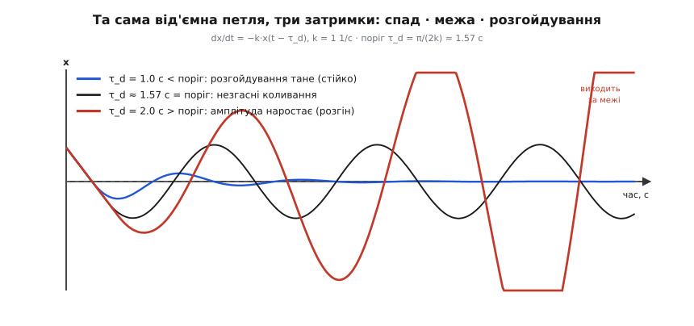
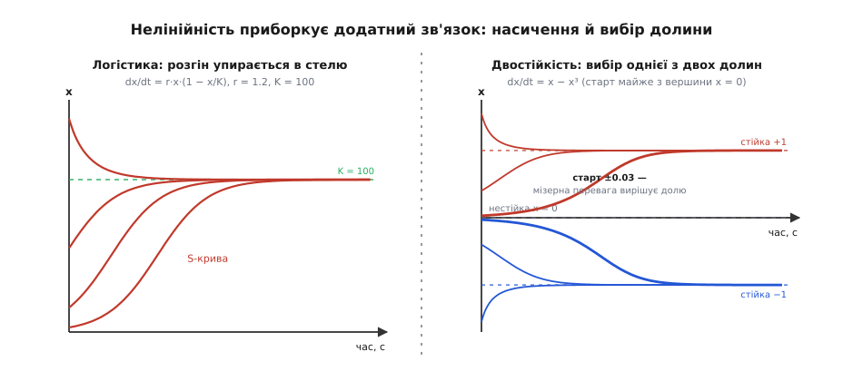
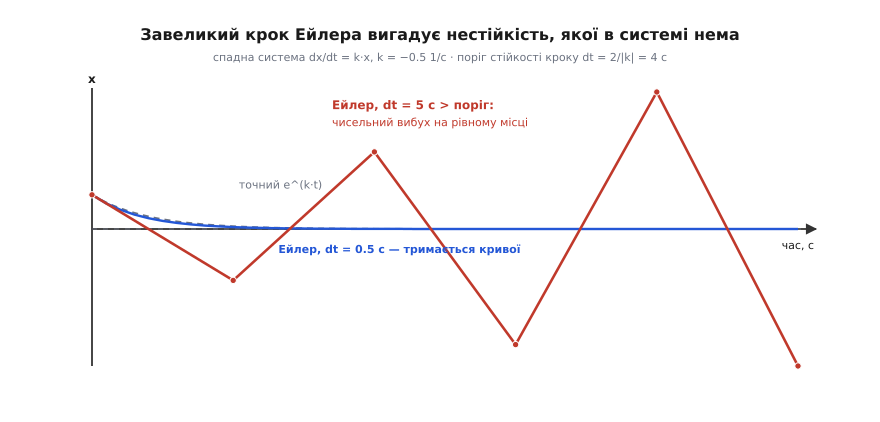

# ⚙️ Петля на екрані: проганяємо зворотний зв'язок чисельно

Формула — це вирок, а не розповідь. Рівняння `dx/dt = k·x` і його розв'язок `x = x₀·e^(k·t)` чесно кажуть, чим усе скінчиться: при `k < 0` відхилення тане, при `k > 0` — розганяється. Але вирок мовчить про сам процес: не видно, як петля щомиті наздоганяє себе, як спад сповільнюється біля рівноваги, як розгін вибухає з нічого. А головне — щойно в петлю додати дві речі, які й роблять зворотний зв'язок цікавим, **затримку** і **нелінійність**, — акуратна формула закінчується. Затримана петля вже не має розв'язку в елементарних функціях, а нелінійна дає S-криві й двостійкість, яких експонента не знає.

Тому зробімо чесний хід: віддамо машині голе правило — «ось як швидкість зміни залежить від стану» — і хай вона сама крокує в часі, крихітними кроками, а ми дивитимемось, як із того самого одного рядка виростають усі три режими. Крутитимемо чотири ручки — **знак**, **підсилення**, **затримку** й **насичення** — і на очах мінятимемо долю системи.

## Ідея: похідна — це нахил, а крок — маленька довіра до нахилу

Уся чисельна інтеграція тримається на одній думці. Похідна `dx/dt` — це просто нахил: скільки `x` набігає за одиницю часу. За дуже короткий проміжок `dt` величина майже не встигає змінитись, тож можна нахабно припустити, що нахил на цьому шматочку сталий, і зробити один прямий крок уздовж нього:

```
x(t + dt) ≈ x(t) + dt · (dx/dt)
```

Це і є **метод Ейлера** (за Леонардом Ейлером, який описав його ще у XVIII столітті). Дав правило `dx/dt = f(x, t)` — обчислив нахил у поточній точці, ступив маленький крок, опинився в новій точці, там перерахував нахил, ступив знову. Тисяча таких кроків — і перед тобою вся траєкторія. Метод грубий (нахил-бо міняється й усередині кроку, а ми вдали, ніби ні), зате прозорий, як скло, і його вистачає, щоб побачити суть.

Мову беремо **Python з numpy**: приклад тут про те, щоб *побачити* динаміку й швидко покрутити ручки, а не вичавити такти процесора. П'ятирядковий цикл кроку читається як математичний запис, а numpy дає векторний стан майже задарма — виразність тут важить більше за сиру швидкодію.

Напишемо один універсальний інтегратор і потім згодовуватимемо йому різні праві частини `f`. Крім грубого Ейлера покладемо туди **RK4** — класичний метод Рунге–Кутти, що зазирає всередину кроку в чотирьох точках і усереднює нахили, різко піднімаючи точність:

```python
import numpy as np

def integrate(f, x0, dt, T, method="rk4"):
    """Проінтегрувати dx/dt = f(x, t) від 0 до T кроком dt.
    x0 — число АБО numpy-вектор стану. Повертає (t, історія-x)."""
    n = int(round(T / dt))
    t = np.linspace(0.0, n * dt, n + 1)
    x = np.empty((n + 1,) + np.shape(x0))
    x[0] = x0
    for i in range(n):
        xi, ti = x[i], t[i]
        if method == "euler":                       # один крок уздовж нахилу
            x[i + 1] = xi + dt * f(xi, ti)
        else:                                       # RK4: чотири проби нахилу
            k1 = f(xi,              ti)
            k2 = f(xi + 0.5*dt*k1,  ti + 0.5*dt)
            k3 = f(xi + 0.5*dt*k2,  ti + 0.5*dt)
            k4 = f(xi + dt*k3,      ti + dt)
            x[i + 1] = xi + dt/6.0 * (k1 + 2*k2 + 2*k3 + k4)
    return t, x
```

Одна функція — і числа, і вектори (завдяки `np.shape(x0)`: для скаляра форма порожня, для стану `[θ, ω]` — двоелементна). Далі вся робота — придумати праву частину `f`.

## Режим 1: чистий інтегратор і характерний час

Найпростіша права частина — саме серце теми. Швидкість зміни пропорційна самому стану:

```python
def linear(k):
    return lambda x, t: k * x

t, xd = integrate(linear(-0.5), 1.0, dt=0.05, T=8.0)   # k<0: спад
t, xg = integrate(linear(+0.5), 1.0, dt=0.05, T=8.0)   # k>0: розгін
```

Знак `k` — перша ручка, і вона вирішує все. Прогін це показує числом. Аналітичний орієнтир, з яким звіряємось, — та сама експонента; чому величина, чия швидкість росту пропорційна їй самій, змінюється саме експоненційно й що таке характерний час, розібрано в [експоненційному ОДУ](topic:math/exponential-ode).

**Умова.** `k = ±0.5 1/с`, старт `x₀ = 1`, крок `dt = 0.05` с.

```
k = −0.5:  x(2.0 с) = 0.363   точне e⁻¹ = 0.368   СПАД,   τ = 1/|k| = 2 с
k = +0.5:  подвоєння за ln2/k = 1.386 с           РОЗГІН, τ = 1/|k| = 2 с
```

**Висновок.** Одне число `k` тримає в собі всю поведінку. Його знак задає долю — спад чи розгін, — а його величина задає **єдиний характерний час** `τ = 1/|k|`. Для від'ємного `k` це час, за який збурення тане в `e ≈ 2.72` раза; для додатного — час, за який воно в стільки ж разів росте (а подвоюється за `ln2/k`). Уся система живе за цим годинником: більше `|k|` — прудкіший відгук.

Ця ж пара прогонів оголює й слабину грубого кроку. Ейлер при `dt = 0.05` за 8 секунд накопичує помітну похибку, бо на кожному кроці підмінює криву дотичною. RK4 з тим самим кроком лягає на точний розв'язок майже ідеально:

**Похибка методу.** `dx/dt = −0.5·x`, до `t = 8 с`, точне значення `e⁻⁴ = 0.0183`.

```
крок dt   метод    відносна похибка
0.2       Ейлер    19.3 %          перший порядок: похибка ∝ dt
0.2       RK4      3.6·10⁻⁶        четвертий порядок: похибка ∝ dt⁴
0.05      Ейлер     5.0 %          крок ÷4  →  похибка ÷≈4
0.05      RK4      1.3·10⁻⁸        крок ÷4  →  похибка ÷≈256
```

Різниця не косметична: зменшив крок учетверо — Ейлерова похибка впала теж учетверо (перший порядок), а RK4 — аж у 256 разів (четвертий порядок). Тому для чесної динаміки далі скрізь беремо RK4, лишаючи Ейлер там, де важлива саме його наочна простота.

## Режим 2: затримка обертає мінус на плюс

А тепер найтонше в поведінці петель зі зворотним зв'язком — і те, чого чиста формула `dx/dt = k·x` показати не може. Реальна петля виправляє відхилення **не миттєво**: датчик міряє з запізненням, виконавчий механізм повертається не одразу. Модель цього — від'ємний зв'язок, що діє на **застаріле** значення виходу:

```
dx/dt = −k · x(t − τ_d)
```

тобто «штовхаю назад пропорційно тому, яким `x` був `τ_d` секунд тому». Це вже рівняння з пам'яттю, і елементарного розв'язку в нього немає — зате чисельно воно береться легко, якщо тримати недавнє минуле в буфері:

```python
def integrate_delay(k, tau_d, x0, dt, T):
    """dx/dt = −k·x(t − τ_d). Історію тримаємо у списку-буфері."""
    n = int(round(T / dt))
    d = int(round(tau_d / dt))          # затримка, поміряна в кроках
    x = np.empty(n + 1); x[0] = x0
    hist = [x0] * (d + 1)               # минуле до старту вважаємо сталим x0
    for i in range(n):
        x_past = hist[-d - 1]           # x, виміряний τ_d = d·dt тому
        x[i + 1] = x[i] + dt * (-k * x_past)
        hist.append(x[i + 1])
    return np.linspace(0.0, n * dt, n + 1), x
```

Знак у петлі — **мінус**, зв'язок наче від'ємний. Крутнімо другу ручку, `τ_d`, і подивімось, чи справді він гасить.


*Та сама петля зі знаком мінус, лише затримка різна. Синя (`τ_d` менша за поріг) — розгойдування є, але тане: зв'язок ще встигає гасити. Чорна (`τ_d` рівно на порозі `π/2k`) — незгасні коливання сталої висоти. Червона (`τ_d` більша за поріг) — амплітуда наростає сама, петля зі знаком мінус поводиться як зі знаком плюс.*

**Поріг зриву.** `k = 1 1/с`, старт `x₀ = 1`.

```
τ_d = 1.0 с    (τ_d·k = 1.00  < π/2):  коливання ТАНУТЬ  — петля ще стійка
τ_d ≈ 1.57 с   (τ_d·k = π/2 = 1.571):  НЕЗГАСНІ          — рівно на межі
τ_d = 2.0 с    (τ_d·k = 2.00  > π/2):  амплітуда РОСТЕ   — зрив у розгойдування
період на межі:  2π/k ≈ 6.28 с
```

**Висновок.** Поки затримка мала, спізніле виправлення ще влучає більш-менш у ціль — коливання є, але тануть. Та є точний поріг, `τ_d = π/(2k)`: на ньому виправлення спізнюється рівно на чверть періоду й приходить тоді, коли система вже проскочила рівновагу. Тепер «гальмо» тисне в бік руху, а не проти — і кожен оберт петля додає енергії замість забирати. Мінус у рівнянні лишився мінусом, а поведінка стала як у плюса. Це рівно те, що діється під душем зі старим змішувачем: крутиш на гаряче, труба відповідає із запізненням, поки чекаєш — уже окріп, сіпаєш на холод — знову перечекав — крига, і ти розгойдуєшся між ними, хоч щиро тиснеш «проти» відхилення.

Формально затримана петля перетворилась на осцилятор, у якого **загасання стало від'ємним**: замість гасити коливання, воно їх підкачує. Що таке власна частота, загасання й добротність звичайного коливача — [загасний осцилятор](topic:physics/damped-oscillator).

> 🔧 **Навіщо це.** Ось чому інженер не женеться за максимальним підсиленням петлі. Хочеться зробити регулятор «жвавішим» — накрутити `k`, щоб різкіше виправляв. Але поріг зриву `τ_d = π/(2k)` каже: більший `k` **наближає** межу. За фіксованої затримки `τ_d` є критичне підсилення `k = π/(2τ_d)`, вище якого будь-яка петля задзвенить. Тому регулятор проєктують із **запасом** до цього порога, а не впритул до нього — саме цей запас чисельний прогін дає помацати, посуваючи ручки до зриву.

## Режим 3: нелінійність приборкує додатний зв'язок

Додатний зв'язок у чистому вигляді, `dx/dt = k·x` при `k > 0`, вибухає в нескінченність — але в природі так не буває: щось завжди впинає зростання. Третя ручка — **насичення**, і вона додає до петлі нелінійний множник. Два класичні приклади показують дві її різні служби.

Перший — **логістичне** зростання: розгін, що впирається в стелю. Швидкість росту велика, поки `x` малий, і сходить нанівець, коли `x` дотягується до несучої місткості `K`:

```python
def logistic(r, K):
    return lambda x, t: r * x * (1 - x / K)

t, x = integrate(logistic(1.2, 100.0), x0=1.0, dt=0.02, T=12)   # S-крива до K=100
```

Другий — **двоямний** профіль, у якому додатний зв'язок не розганяє в безмежжя, а **вибирає**. Найпростіше рівняння з двома стійкими станами й нестійким горбом між ними:

```python
def double_well(x, t):      # dx/dt = x − x³ : долини ±1, вершина 0
    return x - x**3

for x0 in (+0.03, -0.03):   # мізерна перевага знаку вирішує долю
    t, x = integrate(double_well, x0, dt=0.01, T=8.0)
```

Біля нуля тут `dx/dt ≈ x` — чистий додатний зв'язок, що жене геть від вершини. Але кубічний член `−x³` наростає швидше й перехоплює втечу, садовлячи систему в одну з двох долин `±1`.


*Зліва — логістика: хоч звідки старт, розгін гальмує біля несучої місткості `K = 100`, виходячи на пласку стелю (S-крива); зверху крива підходить до `K` згори. Справа — двостійкість: старт майже з вершини `x = 0`, і мізерна перевага знаку (`±0.03`, товсті криві) вирішує все — система рішуче скочується або в долину `+1`, або в `−1`, не зависаючи посередині.*

**Насичення й вибір.** Числа з прогонів:

```
логістика:   старт з 1, 16, 55 чи навіть 140  →  усі виходять на K = 100
двостійкість: старт +0.03  →  +1.000     старт −0.03  →  −1.000
              старт +1.55  →  +1.000     старт −1.55  →  −1.000
```

**Висновок.** Нелінійність — та сама рука, що обертає руйнівний розгін на корисне. У логістиці вона перетворює вибух на охайну S-криву з насиченням: так росте популяція в обмеженому середовищі, так виходить на межу автоколивальний генератор, коли додатний зв'язок розгойдав його, а нелінійність упнула амплітуду. У двоямному профілі вона робить із додатного зв'язку **рішення**: старт `+0.03` і `−0.03` — практично та сама точка, майже на вершині, — розходяться в протилежні долини. Мізерна перевага наростає сама й затягує систему в один зі станів. На цій двостійкості тримається клямка, тригер, комірка пам'яті: додатний зв'язок посередині не дає зависнути між «0» і «1».

## Вінець: рукотворний зв'язок, що втримує невтримне

Найкрасивіше — коли від'ємний зв'язок будують навмисно, щоб **стабілізувати те, що само собою нестійке**. Перевернутий маятник (вантаж зверху, як мітла на долоні) — чистий додатний зв'язок: щойно він хитнувся, тяжіння тягне його далі від вертикалі, і за секунду з чимось він падає. Накиньмо згори свій регулятор, що штовхає стрижень назад пропорційно і нахилу, і швидкості нахилу.

Стан тепер двовимірний — кут і кутова швидкість, `s = [θ, ω]`, — і той самий `integrate` бере його без змін:

```python
g, L = 9.8, 1.0                              # нестійкість росте як √(g/L) = 3.13 1/с

def inverted_pendulum(Kp, Kd):
    w2 = g / L
    def f(s, t):
        theta, omega = s
        u = -(Kp*theta + Kd*omega)           # рукотворний від'ємний зв'язок: PD
        return np.array([omega, w2*np.sin(theta) + u])
    return f

s0 = np.array([0.2, 0.0])                    # нахил 0.2 рад ≈ 11°, у спокої
t, s = integrate(inverted_pendulum(Kp=20, Kd=6), s0, dt=0.005, T=10.0)
theta = s[:, 0]                              # → гасне до нуля: балансує
```

Керування `u = −(Kp·θ + Kd·ω)` тисне проти нахилу (складова `Kp`) і проти самого руху (складова `Kd`, вона ж гасіння). Такий регулятор, що відповідає пропорційно похибці та її швидкості, — це класичний П/ПД-регулятор; як його підбирають і чому сама пропорційна складова лишає невеличку статичну похибку — [П-регулятор](root:embedded/proportional-control).

**Балансир.** Нестійкість апарата `√(g/L) = 3.13 1/с`; поріг стабілізації — `Kp` мусить перебороти «перекидальну жорсткість» `g/L = 9.8`.

```
Kp = 20, Kd = 6   (Kp > g/L,  Kd > 0):  θ гасне до 0        — БАЛАНСУЄ
Kp = 20, Kd = 0   (немає похідної):     коливається без упину — не падає, та й не завмирає
Kp = 5,  Kd = 6   (Kp < g/L = 9.8):     похідна не рятує    — перекидається
```

**Висновок.** Рукотворний від'ємний зв'язок перетворює нестійкий горб на стійку долину — але лише за двох умов, і прогін показує обидві. Пропорційна складова `Kp` мусить бути **сильнішою за саму нестійкість** (`Kp > g/L`), інакше повертальна дія слабша за перекидальну й маятник усе одно падає. А похідна складова `Kd` дає **гасіння коливань**: без неї (`Kd = 0`) система не падає, але й не заспокоюється — вічно дзвенить навколо вертикалі, бо гасити коливання нема чим. Разом вони й тримають мітлу сторч. Саме так стоїть квадрокоптер, ракета на старті, самокат-сегвей: усі вони балансують на нестійкій рівновазі рукотворним від'ємним зв'язком, що встигає виправляти швидше, ніж власна нестійкість розганяє похибку.

І тут дві теми змикаються. Додайте в цей балансир **затримку** сенсора — і навіть правильно налаштований регулятор (`Kp = 20, Kd = 6`) за досить великого запізнення зривається в те саме наростальне розгойдування з режиму 2 й перекидає маятник. Стабілізатор нестійкого об'єкта живе в перегонах часів: його від'ємний зв'язок мусить замикатися **швидше**, ніж об'єкт встигає впасти, — а будь-яка затримка ці перегони підточує.

## Складність і пастки

Головна пастка чисельного моделювання підступна тим, що вона **маскується під фізику**. Той самий прогін, що показує нам розгін і розгойдування, здатен вигадати нестійкість, якої в рівнянні немає, — і зробить це саме тоді, коли крок завеликий.

Візьмімо гарантовано спадну систему, `dx/dt = k·x` з `k = −0.5`, і проженімо її грубим Ейлером різним кроком. Один крок Ейлера множить стан на `(1 + k·dt)`. Поки `dt < 2/|k|`, цей множник за модулем менший за одиницю — рішення тане, як і має. Але щойно `dt` переступає поріг `2/|k| = 4 с`, множник за модулем більший за одиницю, і чисельне рішення **вибухає** — при тому, що справжня система лагідно згасає до нуля.


*Одна й та сама спадна система `dx/dt = −0.5·x`. Пунктир — точне `e^(k·t)`. Синя — Ейлер малим кроком, тримається кривої. Червона — Ейлер кроком `dt = 5 с` понад поріг `2/|k| = 4 с`: рішення стрибає з плюса в мінус, розкидаючись усе далі, — чистий артефакт методу, а не фізика.*

Звідси й рецепт розрізнення. Побачив у прогоні розгін — **здрібни крок удвічі й проженися знову**. Якщо вибух лишився на місці, він фізичний (у системі справді додатний зв'язок). Якщо здрібнення кроку його прибрало — це була чисельна ілюзія, і треба брати менший `dt` або стійкіший метод. RK4 піднімає **точність**, але не скасовує межу стійкості: у явних методів вона є завжди, і для «жорстких» систем (дуже велике `|k|`, дуже різні часові масштаби) потрібен або крихітний крок, або неявний інтегратор.

> 🔧 **Навіщо це.** Крок інтегрування — це, по суті, ще одна петля зворотного зв'язку, зі своїм власним знаком стійкості. Умова `dt < 2/|k|` — то не примха, а вимога, щоб **чисельна** петля лишалась від'ємною. Мораль зворотна до звичної: якщо модель раптом «пішла врознос», перше підозра не на фізику, а на власний крок. Завжди звіряй два кроки: справжній ефект від здрібнення не зникає, артефакт — зникає.

Дрібніші, але живучі пастки:

- **Затримку треба ділити націло на крок.** У буфері `d = round(τ_d / dt)` — ціле число кроків. Якщо `τ_d` не кратне `dt`, реальна затримка округляється, і поріг зриву `π/(2k)` попливе. Хочеш точний `τ_d` — бери `dt`, що ділить його рівно, або інтерполюй між сусідніми записами історії.
- **Крок мусить бути помітно меншим за найшвидший час системи** — за `1/|k|`, за затримку, за період коливань. Розумне правило: щонайменше 20–30 кроків на найкоротший характерний час. Побачив кутасту, «драбинчасту» криву — крок завеликий.
- **Накопичення похибки на довгих прогонах.** Навіть стійкий Ейлер повільно з'їжджає з істинної траєкторії; для довгих інтегрувань бери RK4 або ще вищий порядок, а критичні числа (як-от поріг зриву) завжди перевіряй здрібненням кроку.
- **Повний `sin θ`, а не мале-кутове наближення.** У балансирі повна нелінійність `sin θ` чесна для великих кутів; лінеаризація `θ` спрощує аналіз, але приховує, що при сильному нахилі регулятор може вже й не витягнути.

Що робить цей експеримент цінним — не окремі числа, а **ручки**. Один інтегратор, чотири параметри: знак кладе долю (спад чи розгін), підсилення задає її темп (`τ = 1/|k|`), затримка здатна перевернути знак поведінки, не чіпаючи знак рівняння, а нелінійність приборкує розгін — у стелю чи у вибір. Посунеш будь-яку ручку до її порога — і на очах побачиш, як стійка долина обертається на нестійкий горб, а тихе заспокоєння — на незгасне виття. Це і є зворотний зв'язок, який не описують, а вмикають.
