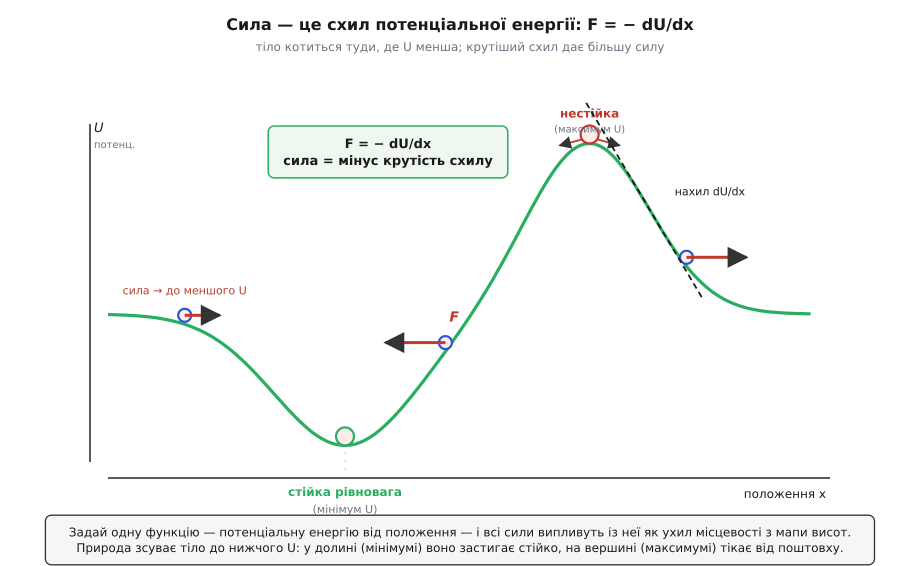
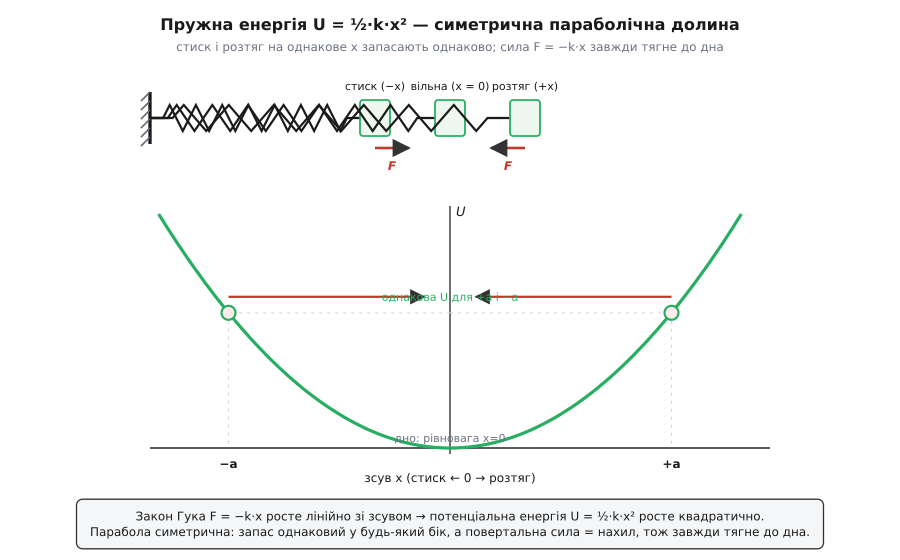

# Потенціальна енергія

<preknowlist>
- [Механічна робота](book:physics/work) — робота сили дорівнює силі, помноженій на переміщення; саме через роботу означується запас енергії.
- [Сила](book:physics/force) — причина зміни руху; потенціальна енергія й сила зв'язані між собою як висота й крутість схилу.
- [Кінетична енергія](book:physics/kinetic-energy) — енергія руху ½·m·v²; напарниця, у яку потенціальна перетікає й назад.
- [Закон всесвітнього тяжіння](book:physics/newton-gravitation) — тяжіння як сила між масами; головний приклад поля, що запасає потенціальну енергію.
</preknowlist>

Підніми камінь на полицю й прибери руку. Поки він лежить, він нічого не робить — просто камінь на висоті. Але штовхни його за край, і він падає, набирає швидкості, гупає, лишає вм'ятину, розколює горіх під собою. Звідки взялася ця здатність трощити, якщо мить тому камінь тихо лежав без жодного руху? Ти вклав її туди сам — тоді, коли підіймав. Робота твоєї руки не зникла: вона осіла в камені як **запас**, схований у самому його положенні, і терпляче чекала. Забери підпору — і запас проливається назад, обертаючись на рух і руйнування.

Цей прихований запас, що залежить не від руху тіла, а від його **положення** — а ширше, від того, як розставлені одна щодо одної частини системи, — фізика зве **потенціальною енергією** (лат. potentia — сила, спроможність, potentialis — можливий, здатний; і гр. enérgeia — чинність, від érgon — робота). Назва влучна до кінця: ця енергія зараз не діє, а лише **може діяти** — вона в спромозі, у готовності, як натягнута тятива чи заведена пружина. Саме слово в цьому значенні пустив у вжиток шотландський інженер Вільям Ренкін 1853 року, назвавши її «енергією конфігурації» на противагу «енергії руху»; [як народилося поняття](book:physics/potential-energy/hist-potential-energy.md) — від латинської «можливості» Аристотеля до забутого мірошника, що першим дав ім'я потенціалу, — окрема й людяна пригода.

Придивись — і побачиш цей запас усюди. Натягнутий лук держить постріл. Стиснута пружина в мишоловці держить удар. Вода за греблею держить турбіну. Заведений годинник, піднятий молот копра, розтягнута рогачка — усе це робота, укладена наперед і замкнена в положенні, доки її не відпустять. Лишається головне: **скільки** саме її запасено, від чого це залежить і за яким правилом запас обертається на дію.

## Скільки її: підняти — значить укласти mgh

Почнімо з найпростішого запасу — піднятого тіла в полі земного тяжіння. Щоб підняти вантаж масою m на висоту h, доводиться долати його вагу — силу тяжіння m·g, спрямовану вниз (де g ≈ 9.8 м/с² біля поверхні Землі). Підіймай поволі, без розгону, — тоді твоя сила щомиті точно врівноважує вагу, а виконана робота є ця сила, помножена на пройдену висоту:

```
U = робота на підйом = (m·g) · h = m·g·h
```

Ось і весь запас — **U = m·g·h**. Він росте з масою (важче тіло держить більше), з висотою (вище — більше) і з силою тяжіння (на важчій планеті той самий підйом коштував би дорожче). Причина прозора наскрізь: підняти — це виконати роботу проти тяжіння, а тяжіння тягне весь час із тією самою силою m·g, тож і робота набігає рівно пропорційно висоті. Нічого не витрачено намарно: скільки роботи ти вклав у підйом, стільки потенціальної енергії тепер сидить у вантажі, готове вилитися назад при падінні.

**Приклад: молот копра.** Пальовий копер підіймає сталевий молот масою m = 200 кг на висоту h = 3.0 м, а тоді відпускає, щоб той забив палю. Скільки роботи запасено вгорі?

```
U = m·g·h = 200 · 9.8 · 3.0 = 5880 Дж ≈ 5.9 кДж
```

Ці майже шість кілоджоулів не взялися з нічого — їх поволі накачав у молот двигун лебідки, підіймаючи його. При падінні весь цей запас обернеться на кінетичну енергію удару й піде в паля та ґрунт. Копер — це буквально машина, що запасає потенціальну енергію підйомом, а тоді вивільняє її одним ударом.


*Запас тяжіння росте прямо з висотою — удвічі вище означає вдвічі більше (не так, як у русі, де все йде з квадратом швидкості). А звідки лічити висоту — байдуже: абсолютне U залежить від обраного нуля, але фізично проявляється лише різниця ΔU, і для однакового спуску вона однакова за будь-якого відліку.*

## Найглибша ідея: сила — це схил потенціальної енергії

Тут ховається річ, важливіша за будь-яку окрему формулу запасу. Намалюй, як потенціальна енергія залежить від положення, — дістанеш криву, справжній **краєвид** енергії з долинами, схилами й вершинами. І виявляється, що сила, яка діє на тіло, — це просто **крутість** цього краєвиду, узята з протилежним знаком:

```
F = − dU/dx
```

Читається це на диво просто: сила штовхає тіло **туди, де потенціальної енергії менше** — униз по схилу краєвиду, — і то дужче, що схил крутіший. Знак «мінус» і є оте «вниз»: природа не любить високої потенціальної енергії й завжди підпихає тіло до нижчого. Кулька на пагорбі скочується в долину не тому, що «хоче», а тому, що там, де схил крутіший, dU/dx більша, а отже, більша й повертальна сила. Де краєвид рівний (dU/dx = 0), сили нема зовсім — тіло в рівновазі.

Це переосмислення варте більше, ніж здається. Замість того щоб виписувати силу окремо в кожній точці, досить задати **одну** функцію — потенціальну енергію від положення, — і всі сили випливуть із неї самі, як ухил місцевості випливає з мапи висот. Тяжіння, пружна сила, електричне притягання — усі вони насправді лише схили своїх потенціальних краєвидів. Перевір на знайомому: для підйому U = m·g·h, тож нахил по висоті dU/dh = m·g, а сила F = −m·g — тяжіння, спрямоване вниз, точно як і має бути. [Чому саме мінус похідна](book:math/derivative) і як із цього правила відновити силу з будь-якого краєвиду — [у математичній вставці](book:physics/potential-energy/math-force-from-potential.md), де це виведено строго й для трьох вимірів.


*Потенціальна енергія як краєвид, а сила — його ухил зі знаком мінус. Тіло котиться до нижчого U; що крутіший схил, то більша сила. Дно долини — стійка рівновага, вершина — нестійка, і в обох сила нульова, бо схил рівний.*

> 🔧 **Навіщо це.** Правило F = −dU/dx — це те, чим інженер і фізик реально користуються, щоб не морочитися з силами. Задав потенціальний краєвид системи — і одразу бачиш, куди її потягне, де вона застигне і чи буде та точка стійкою. Уся молекулярна динаміка, розрахунок конформацій білків, траєкторії супутників, поведінка транзистора — це пошук мінімумів потенціальної енергії та руху по її схилах. Одна функція положення заступає цілий ліс векторів сил.

## Долини — це стійкість, вершини — хиткість

Раз сила скрізь тягне тіло до меншої потенціальної енергії, то **мінімуми** краєвиду набувають особливого сенсу. Улігшись на дно долини, тіло опиняється там, звідки будь-який зсув убік веде вгору по схилу — а схил відразу штовхає його назад, униз, до дна. Це **стійка рівновага**: виведи систему трохи зі стану — і вона сама повернеться. Кулька в мисці, маятник унизу, м'яч у ямі — усі вони сидять у мінімумі потенціальної енергії, і сила стереже їх там.

Вершина — цілковита протилежність. Кулька на маківці пагорба теж у рівновазі, поки стоїть точно на вершечку: схил там рівний, сили нема. Але хай найменший подих зсуне її на волосину — і схил, що падає на всі боки, підхопить зсув і поженеться геть від вершини. Це **нестійка рівновага**: система тікає від найменшого поштовху. Олівець на вістрі, куля на горбі, перевернутий маятник — усі балансують у максимумі потенціальної енергії, звідки їх зганяє щонайменша хитавиця.

Ось чому природа так уперто зсуває речі до мінімумів потенціальної енергії: тільки там вони й можуть спокійно спочити. Вода стікає в найнижчу западину, мильна плівка стягується в найменшу поверхню, атоми в кристалі шикуються так, щоб їхня спільна потенціальна енергія була найменшою. «Знайти рівновагу» майже завжди означає «знайти дно потенціальної долини». А поблизу того дна ховається ще одна річ: майже будь-яка гладка долина зблизька схожа на параболу, і тіло, злегка виведене з дна, починає гойдатися туди-сюди — так із мінімуму потенціальної енергії народжується [гармонічний осцилятор](book:physics/harmonic-oscillator), від коливань атома до хитання моста. Побачити всі ці долини й вершини наживо — [пройтися кодом по краєвиду потенціалу, знайти рівноваги й перевірити їхню стійкість](book:physics/potential-energy/proj-potential-landscape.md) — найпростіший спосіб відчути правило на дотик.

## Пружина: запас у формі ½kx²

Досі краєвид нам малювало тяжіння. Але найчистіший приклад запасу в **конфігурації** — це пружина, бо в ній ідеться не про висоту над Землею, а про власну деформацію тіла. Стисни або розтягни пружину на x від її вільної довжини — і вона опирається силою, пропорційною зсуву й спрямованою назад, до спокою:

```
F = − k·x
```

Це [закон Гука](book:physics/hookes-law), а k — жорсткість пружини (Н/м): що більше k, то туговіша пружина. Знак «мінус» знову каже те саме — сила **повертальна**, вона тягне до положення рівноваги (x = 0). А раз сила є нахил потенціальної енергії зі знаком мінус, то саму потенціальну енергію легко відновити назад: якщо F = −k·x росте лінійно зі зсувом, то U росте квадратично:

```
U = ½ · k · x²
```

Ця парабола — архетип потенціальної долини. Вона симетрична: і стиск, і розтяг на однакове x коштують однаково, бо x входить у квадраті — а отже, обидва запасають енергію, обидва відпускають її пружним поштовхом. Дно параболи в x = 0 — та сама стійка рівновага: пружина сама тягне до вільної довжини з обох боків.

**Приклад: пружина запускає тіло.** Пружину жорсткістю k = 500 Н/м стиснули на x = 0.08 м і приклали до неї тіло масою m = 0.20 кг. З якою швидкістю тіло зірветься, коли пружина розпрямиться?

```
запас у пружині:   U = ½·k·x² = ½ · 500 · 0.08² = 250 · 0.0064 = 1.6 Дж
весь він переходить у рух:   U = ½·m·v²
звідси:            v = √(2·U / m) = √(2 · 1.6 / 0.20) = √16 = 4.0 м/с
```

Уся потенціальна енергія стиснутої пружини, до останнього джоуля, перелилася в кінетичну енергію польоту. Це той самий обмін, що й у падінні каменя, тільки запас тут схований не у висоті, а в деформації. Так працює все — від дитячої рогачки до клапанних пружин двигуна й механізму розкладного ножа: стиснув, замкнув запас у формі ½kx², відпустив — і він вистрілив рухом.


*Пружний запас ½·k·x² — парабола, симетрична долина. Що далі відхилив пружину (в будь-який бік), то більше запасено; повертальна сила дорівнює крутості схилу й завжди тягне назад до дна x = 0.*

## Точка відліку довільна — важить лише різниця

У формулі U = m·g·h ховається питання, яке варто поставити просто: висота h — **від чого**? Від підлоги? Від рівня моря? Від стелі поверхом нижче? Відповідь спершу бентежить: **байдуже**. Потенціальна енергія не має абсолютного нуля — ти сам вибираєш, звідки її лічити, і жодне з вимірювань не «правильніше» за інші.

І це не вада, а чесна природа поняття. Адже фізично проявляється завжди лише **різниця** потенціальної енергії між двома положеннями — саме вона визначає, скільки роботи вивільниться при переході й на яку швидкість розжене тіло. Молот копра, падаючи з трьох метрів, віддасть той самий удар, хоч би від чого ти відлічував висоту — від землі, від вершини палі чи від сусідньої гори; важить лише, що він **спустився** на три метри. Тому нульовий рівень обирають там, де зручно рахувати, і тримаються його до кінця задачі.

Для великих масштабів «висота над рівнем» узагалі перестає працювати, бо тяжіння слабшає з відстанню, і його вже не описати сталим m·g. Тоді потенціальну енергію двох мас беруть так, щоб нуль припадав на нескінченне віддалення (де взаємодії вже нема):

```
U = − G·M·m / r
```

Вона від'ємна — і це не парадокс, а знову лише вибір відліку: щоб розвести два тіла в нескінченність, треба виконати додатну роботу проти притягання, тож будь-яке скінченне зближення лежить **нижче** нульового рівня нескінченності. Саме ця від'ємна потенціальна яма тримає планети на орбітах і визначає, скільки енергії треба, щоб вирвати ракету геть від Землі. А знайомий m·g·h — це просто дрібний шматочок цієї великої ями поблизу поверхні, де вона майже пряма.

## Одна ідея, багато облич

Тепер видно, що потенціальна енергія — не про висоту чи пружини окремо, а **одна ідея в багатьох подобах**: енергія, схована в тому, як розставлені частини системи в полі якоїсь сили. Підняте тіло — конфігурація в полі тяжіння. Стиснута пружина — конфігурація деформованих зв'язків. Розведені заряди тримають [електричну потенціальну енергію](book:physics/electric-potential) в полі Кулона; атоми в молекулі — хімічну енергію в потенціалі зв'язків, ту саму, що вивільняє пальне й їжа. Скрізь однакова будова: положення плюс поле, що на нього тисне, дорівнює запас.

Але не всяка сила вміє запасати. Потенціальна енергія існує лише для **консервативної сили** (лат. conservare — зберігати) — такої, чия робота залежить тільки від початку й кінця шляху, а не від дороги між ними; обійди нею будь-який замкнений круг — і повна робота вийде нуль. Лише тоді має сенс приписати кожному положенню одне-єдине число U, бо інакше «запас у точці» був би різним залежно від того, якою стежкою ти туди дістався. Тяжіння й пружна сила такі — тому в них і є потенціальна енергія; докладніше про цю умову — у темі про [потенціальне поле й циркуляцію](book:physics/conservative-field). А от [тертя](book:physics/friction) — ні: воно завжди опирається рухові, на довшому шляху з'їдає більше, і ніякого «запасу тертя в точці» не буває. Робота тертя не ховається в положенні, а безповоротно тікає в тепло.

Саме тому потенціальна енергія так тісно сплетена з рухом. Поки діють лише консервативні сили, вона й кінетична енергія весь час міняються місцями, а їхня сума — повна механічна енергія — лишається сталою: це і є [закон збереження енергії](book:physics/energy-conservation) в його найчистішому вигляді. Камінь падає — потенціальна тане, кінетична росте; маятник злітає — навпаки; а їхня сума стоїть на місці, аж поки тертя не почне помалу зливати її в тепло. Ця пара — потенціальна проти [кінетичної](book:physics/kinetic-energy) — така глибока, що на ній збудовано всю аналітичну механіку: різниця T − U, узята вздовж руху, і диктує, якою стежкою піде природа за [принципом найменшої дії](book:physics/least-action-principle).

Отже, потенціальна енергія — це робота, укладена наперед і замкнена в положенні: підняв вантаж, стиснув пружину, розвів заряди — і запас чекає, поки його відпустять. Скільки його — каже формула поля (m·g·h під тяжінням, ½·k·x² у пружині, −G·M·m/r у великому масштабі), але глибша істина одна: потенціальна енергія — це краєвид, а сила — його ухил зі знаком мінус, що вічно зсуває речі до нижчих долин. Там, у мінімумах, вони знаходять спокій і стійкість; на вершинах — хиткість; а весь рух світу між долинами — це нескінченне переливання запасу положення в запас руху й назад.
