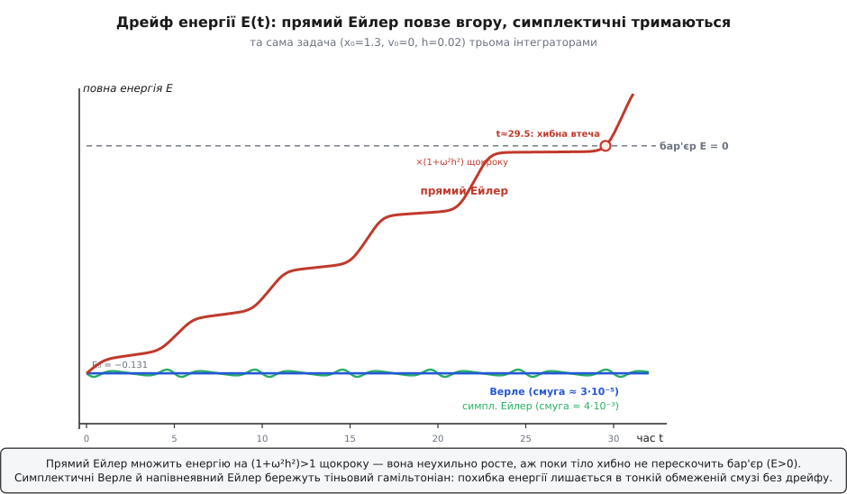
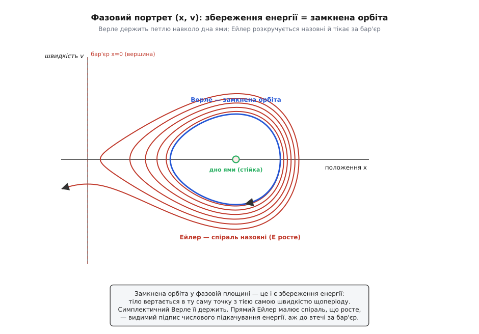

# ⚙️ Краєвид потенціалу під мікроскопом коду

Правило «сила — це схил потенціальної енергії, долини стійкі, вершини хиткі, а біля дна долини тіло гойдається» гарне на папері. Але по-справжньому воно твоє лише тоді, коли ти віддаєш комп'ютерові **одну функцію** U(x) і дивишся, як він сам: знаходить усі рівноваги, оголошує кожну стійкою чи нестійкою і, нарешті, пускає тіло котитися краєвидом, ведучи облік енергії. Уся фізика — сили, рівноваги, стійкість, рух — випливе з цієї єдиної функції. Зберемо весь механізм від початку до кінця — і на останньому кроці наштовхнемося на гостру науку, сховану в найпростішій дії: очевидний спосіб змусити тіло рухатися **потай краде або дописує енергію**, а трохи хитріше правило кроку лікує це задарма.

За піддослідний краєвид візьмемо **подвійну яму**:

```
U(x) = ¼·x⁴ − ½·x²
```

Чому саме її? Це найменший краєвид, у якому є одразу все: дві долини (стійкі рівноваги) і хребет між ними (нестійка), тож єдина картинка тримає і стійку точку, і нестійку, і коливання в ямі, і перескок через бар'єр. А похідні в неї чисті — зручно перевіряти код очима.

## Ідея: одна функція диктує геть усе

Щойно задано U(x), решта — механічні наслідки:

- **Сила** — мінус нахил краєвиду: F = −U′(x).
- **Рівноваги** — там, де схил рівний: корені рівняння U′(x) = 0.
- **Стійкість** — за кривиною в тій точці: знак U″(x). Додатна (дно долини) — стійка; від'ємна (маківка хребта) — нестійка; нуль — вироджений випадок, що потребує вищих похідних.
- **Рух** — Ньютонове ẍ = F/m = −U′(x)/m.
- **Контроль** — повна енергія E = ½·m·v² + U(x) мусить стояти на місці, якщо інтегратор чесний.

Отже, вся програма — це три дієслова: **продиференціювати, знайти корені, крокувати вперед**. Кривина й нахил — це [похідні](topic:math/derivative) першого й другого порядку; тут я знаю їх аналітично, але для будь-якого потворного U(x) їх бере одна центральна різниця:

```python
def U(x):    return 0.25*x**4 - 0.5*x**2     # подвійна яма
def dU(x):   return x**3 - x                  # нахил краєвиду   U′(x)
def d2U(x):  return 3*x**2 - 1                # кривина          U″(x)

# якщо похідну руками брати ліньки — центральна різниця дає її з будь-якого U:
def deriv(f, x, dx=1e-5):  return (f(x + dx) - f(x - dx)) / (2*dx)
```


*Подвійна яма — найменший краєвид, де є все одразу: дві стійкі долини, одна нестійка вершина, коливання в ямі (енергія нижча за бар'єр) і перескок через хребет (енергія вища). Саме на ній код і покажемо.*

## Крок 1: знайти всі рівноваги — корені U′

Рівновага — це плоске місце краєвиду, корінь U′(x) = 0. Надійний спосіб, що не потребує знати корінь наперед і працює навіть на бридкій функції: **пройтися дрібною сіткою** й стежити за знаком U′. Там, де знак перескакує між двома сусідніми вузлами, між ними неодмінно сидить корінь — а тоді защемити його **бісекцією** (методом поділу навпіл): раз за разом ділити відрізок надвоє, лишаючи ту половину, де знак усе ще міняється, аж поки відрізок не стане мізерним. Бісекція не може прогледіти защемлений корінь і не потребує похідної — залізний робочий кінь, надійніший за швидший, але норовливий метод Ньютона, що з поганого старту здатен полетіти геть.

```python
def bisect(f, a, b, tol=1e-13, itmax=200):
    fa = f(a)
    for _ in range(itmax):
        m = 0.5*(a + b)
        fm = f(m)
        if fm == 0.0 or 0.5*(b - a) < tol:
            return m
        if fa*fm < 0.0:      # зміна знака ліворуч від m
            b = m
        else:                # зміна знака праворуч
            a, fa = m, fm
    return 0.5*(a + b)

def equilibria(a, b, n=2000):
    xs = [a + (b - a)*i/n for i in range(n + 1)]
    roots = []
    for i in range(n):
        f0, f1 = dU(xs[i]), dU(xs[i+1])
        if   f0 == 0.0:      r = xs[i]
        elif f0*f1 < 0.0:    r = bisect(dU, xs[i], xs[i+1])   # знак перескочив
        else:                continue
        if not roots or abs(r - roots[-1]) > 1e-6:            # без дублів
            roots.append(r)
    return roots
```

## Крок 2: класифікувати стійкість — знак U″

Уся класифікація ховається у **другій похідній**. У рівновазі кривина каже, чи ти на дні долини (U″ > 0: будь-який зсув веде вгору, сила штовхає назад — **стійка**), чи на маківці хребта (U″ < 0: будь-який зсув котиться вниз, сила женеться геть — **нестійка**). Нуль (U″ = 0) вироджений — перегин або плоскодонна яма, і присуд треба виносити за вищими похідними.

```python
def classify(x):
    c = d2U(x)
    if c > 0:  return "стійка   (мінімум)"
    if c < 0:  return "нестійка (максимум)"
    return "вироджена (треба вищий порядок)"

for x in equilibria(-1.7, 1.7):
    print(f"x = {x:+.6f}   U'' = {d2U(x):+.3f}   {classify(x)}   U = {U(x):+.4f}")
```

Програма друкує рівно той краєвид, що ми й малювали:

```
x = -1.000000   U'' = +2.000   стійка   (мінімум)   U = -0.2500
x = +0.000000   U'' = -1.000   нестійка (максимум)  U = +0.0000
x = +1.000000   U'' = +2.000   стійка   (мінімум)   U = -0.2500
```

Дві долини в x = ±1, один хребет у x = 0 — знайдені й названі з самої лише функції U(x), без жодної підказки, де їх шукати.

## Крок 3: пустити тіло котитися

Тепер рух. Ньютон дає ẍ = −U′(x)/m. Це рівняння другого порядку розкладають на дві покрокові поправки для пари (x, v). Найочевидніша, «в лоб» дискретизація — **прямий (явний) Ейлер**: у поточному стані порахувати прискорення, а тоді ступнути й x, і v уперед на крок h:

```python
def energy(x, v, m=1.0):  return 0.5*m*v*v + U(x)

def euler(x, v, h, steps, m=1.0):
    out = [(0.0, x, v, energy(x, v, m))]
    for i in range(steps):
        a = -dU(x)/m           # прискорення зі СТАРОГО x
        x = x + h*v            # x — за старою швидкістю
        v = v + h*a            # v — за старим прискоренням
        out.append(((i+1)*h, x, v, energy(x, v, m)))
    return out
```

Пустимо тіло з x₀ = 1.3, v₀ = 0 (m = 1). Його енергія E₀ = U(1.3) = −0.131 лежить **нижче хребта** (бар'єр на E = 0), тож фізично тіло замкнене в правій ямі й мало б довіку гойдатися між x ≈ 0.557 і x ≈ 1.30 навколо мінімуму x = 1. Дивимося на E(t):

```
 t      Ейлер
 0    -0.13097
 5    -0.10997
10    -0.08794
15    -0.06581
20    -0.03803
25    -0.00364     ← майже дотяг до бар'єра
```

Енергія неухильно **повзе вгору**. Коло t ≈ 29.5 вона перетинає нуль — і тіло **хибно перескакує хребет**, вихоплюється в сусідню яму, а далі числа Ейлера летять у нескінченність. Жодна фізика такого не дозволяє: інтегратор **вигадав енергію з нічого**.

## Пастка: інтегратор, що краде й додає енергію

Чому Ейлер накачує енергію? Погляньмо на чистий осцилятор ẍ = −ω²·x — а на нього поблизу дна схожа будь-яка гладка яма, бо там [гармонічний осцилятор](topic:physics/harmonic-oscillator) і криється. Прямий Ейлер робить xₙ₊₁ = xₙ + h·vₙ і vₙ₊₁ = vₙ − h·ω²·xₙ. Підставмо це в енергію E = ½·(ω²·x² + v²) і розкриймо один крок:

```
Eₙ₊₁ = ½·[ (vₙ − h·ω²·xₙ)² + ω²·(xₙ + h·vₙ)² ]
     = ½·[ vₙ² + ω²·xₙ²  +  h²·ω²·(ω²·xₙ² + vₙ²) ]     (перехресні члени −2hω²xv і +2hω²xv гасяться)
     = ½·(vₙ² + ω²·xₙ²)·(1 + ω²·h²)
     = Eₙ·(1 + ω²·h²)
```

Кожен крок множить енергію на (1 + ω²·h²) > 1 — **невблаганний геометричний ріст**, хоч би яким крихітним був h. Здрібнити крок — уповільнити витік, але не спинити його: на довгому пробігу дрейф однаково візьме гору. Прямий Ейлер не зберігає енергію — він просто **не вміє** цього.

Ліки майже образливо прості. Поміняй місцями два рядки оновлення — спершу онови швидкість (за поточною силою), а тоді зсунь x уже за **новою** швидкістю:

```python
def symplectic_euler(x, v, h, steps, m=1.0):
    out = [(0.0, x, v, energy(x, v, m))]
    for i in range(steps):
        a = -dU(x)/m
        v = v + h*a            # спершу v
        x = x + h*v            # потім x — за НОВОЮ швидкістю
        out.append(((i+1)*h, x, v, energy(x, v, m)))
    return out
```

Той самий пробіг тепер тримається:

```
 t      Ейлер       симпл.Ейлер
 0    -0.13097     -0.13097
10    -0.08794     -0.13103
20    -0.03803     -0.13108
25    -0.00364     -0.13110
```

Енергія блукає у вузькій смузі завширшки ≈ 4·10⁻³ навколо −0.131 і **не дрейфує нікуди**. Той самий порядок точності, та сама ціна, один переставлений рядок — і хвороби нема. Диво не випадкове: переставлена схема **симплектична** — вона точно береже ту саму площу у фазовому просторі, що її береже й справжній рух (теорема Ліувілля), а глибша причина в тім, що вона точно зберігає не істинну енергію, а близький до неї **тіньовий гамільтоніан**, який різниться від справжнього на O(h). Держачись цієї тіні довіку, істинна енергія може лише коливатися в межах O(h) від неї — і ніколи не піти геть. (Це результат зворотного аналізу похибки: у симплектичного методу похибка енергії лишається обмеженою протягом експоненційно довгого часу.) Прямий Ейлер не симплектичний — якоря нема, і його зносить.

Робочий кінь справжніх симуляцій — симетричний родич цього прийому, **швидкісний Верле** (він же стрибковий, *leapfrog*): підбий швидкість на пів-кроку, протягни x на повний крок, перерахуй силу, добий швидкість другим пів-кроком:

```python
def verlet(x, v, h, steps, m=1.0):
    out = [(0.0, x, v, energy(x, v, m))]
    a = -dU(x)/m
    for i in range(steps):
        v_half = v + 0.5*h*a       # пів-удар по швидкості
        x = x + h*v_half           # протяг координати на повний крок
        a = -dU(x)/m               # нова сила в новій точці
        v = v_half + 0.5*h*a       # другий пів-удар
        out.append(((i+1)*h, x, v, energy(x, v, m)))
    return out
```

Він другого порядку точності, симплектичний і оборотний у часі, з одним обчисленням сили на крок. На нашому пробігу його енергія сидить у смузі завширшки **≈ 3·10⁻⁵** — у тисячу разів тугіше за напівнеявний Ейлер, і теж без дрейфу. Саме тому молекулярна динаміка, орбітальна механіка й будь-яке довге інтегрування ньютонового руху спираються на Верле/leapfrog, а не на пишнішу, але несимплектичну схему.

> 🔧 **Навіщо це.** Різниця між Ейлером і Верле — не академічна дрібниця, а межа між симуляцією, якій можна вірити, і красивою маячнею. Порахуй орбіту супутника прямим Ейлером — і вона за кілька тисяч витків сама собою розкрутиться назовні або впаде, бо інтегратор накачав чи виссав енергію. Той самий крок симплектичним leapfrog утримає орбіту стабільною мільйони витків. Коли фізичний висновок залежить від того, чи зберігається енергія, вибір інтегратора важить не менше за саму модель.

Історична примітка (стан: усталений факт). Стрибковий крок старий: Жан-Батіст Деламбр рахував ним орбіти ще 1791 року; норвезький геофізик Карл Стермер перевідкрив його близько 1907-го, простежуючи заряджені частинки в магнітному полі Землі (звідси «метод Стермера»); а французький фізик Лу Верле 1967 року зробив його хребтом молекулярної динаміки. Метод — не фольклор, а добре задокументована класика.


*Та сама задача трьома інтеграторами. Прямий Ейлер множить енергію на (1+ω²h²) щокроку й повзе вгору, аж поки тіло не перескочить бар'єр з нічого. Симплектичні Верле й напівнеявний Ейлер тримають E у вузькій смузі довіку — вони бережуть тіньовий гамільтоніан.*

Той самий провал видно на **фазовому портреті** — площині (x, v). Замкнена яма мала б давати замкнену петлю: тіло вертається в ту саму точку з тією самою швидкістю щоперіоду. Симплектичний Верле й малює замкнену петлю навколо дна (1, 0). А прямий Ейлер **розкручується спіраллю назовні** — щовиток трохи більший за попередній, бо енергія росте, — аж поки спіраль не вихопиться за хребет.


*Фазовий портрет каже те саме мовою геометрії: збереження енергії — це замкнена орбіта. Верле її й держить; Ейлер малює спіраль, що росте, — видима підпис числового підкачування енергії.*

**Пастка: розмір кроку.** Навіть симплектичний герой падає, якщо h завеликий. Біля найкрутішого мінімуму ω = √(U″/m) = √2, і швидкісний Верле стійкий лише поки h·ω < 2, тобто h < 1.41 тут; за цією межею тіньовий аргумент ламається, і схема вибухає, як і будь-яка інша. Практичне правило: бери h малою часткою (1/20…1/50) періоду найшвидшого коливання — тут T = 2π/√2 ≈ 4.44, тож h ≈ 0.05…0.02 — досить, щоб розв'язати хитавицю, і не так дрібно, щоб марнувати кроки. Гострі, вузькі мінімуми (велика U″) силують дрібний h — це числове обличчя **жорсткості** задачі.

**Пастка: хибна втеча.** Коли Ейлер дав тілу перескочити бар'єр на t ≈ 29.5, ця «втеча» була чистим числовим доливом енергії, а не фізикою. Звідси залізна звичка: **завжди малюй E(t) як контрольний прилад**. Дрейф E — це підпис поламаного інтегратора, а не нове відкриття.

**Пастка: сліпі плями пошуку коренів.** Сітковий прохід знаходить корінь, лише якщо U′ міняє знак у клітині: два корені всередині однієї клітини взаємно гасять знак, і обидва зникають (тримай сітку досить дрібною), а корінь, що лише торкається нуля, не перетинаючи його (вироджений мінімум, де U′ = U″ = 0), взагалі не дає перескоку знака й прослизає повз. І присуд класифікатора «U″ = 0» справді неоднозначний: щоб його розв'язати, потрібні U‴, U⁗ — плоске дно ¼·x⁴ стійке, хоч його U″ = 0. Надійний код перевіряє ці кути окремо.

## Складність і що це коштує

- **Сітковий пошук коренів:** O(N) обчислень похідної на сітці з N клітин плюс O(log(1/tol)) кроків бісекції на кожен защемлений корінь — дешево. Ризик тут не швидкість, а роздільність: загруба сітка губить близькі корені.
- **Класифікація:** O(1) на рівновагу — одна U″ на точку.
- **Інтегрування:** O(кроків), кожен крок — одне обчислення сили для Ейлера й Верле (прискорення кешується між кроками), чотири для RK4. Ціна росте як повний час, поділений на h.
- **Точність і збереження — різні осі.** Метод Рунге — Кутти 4-го порядку (RK4) страшенно точний **покроково** — його миттєва похибка дрібна, — але він **не симплектичний**, тож на дуже довгих ньютонових пробігах його енергія все одно поволі дрейфує. Для довготривалої динаміки скромний Верле 2-го порядку б'є пишний RK4: обмежена навіки енергія важливіша за меншу миттєву похибку, що тихо накопичується. Тому вибір інтегратора — це не «який точніший на одному кроці», а «що саме я не готовий втратити на мільйоні кроків»: тут це збереження енергії, і тоді [закон збереження енергії](topic:physics/energy-conservation) диктує брати симплектичну схему, а не найточнішу.

Ось і весь механізм. Одна функція U(x) — і комп'ютер сам малює краєвид, називає кожну рівновагу стійкою чи хиткою й котить по ньому тіло, безнастанно переливаючи [кінетичну енергію](topic:physics/kinetic-energy) ½·m·v² у потенціальну й назад. А єдине справжнє ремесло тут — обрати інтегратор, що поважає те, чого фізика не віддає (повну енергію), і крок, досить малий, щоб побачити рух, але не менший.
