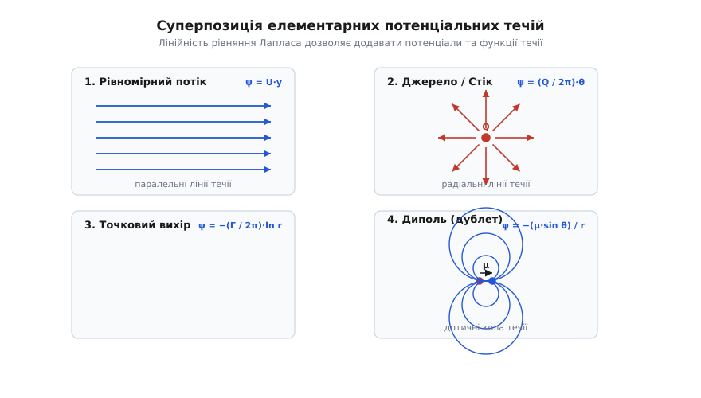
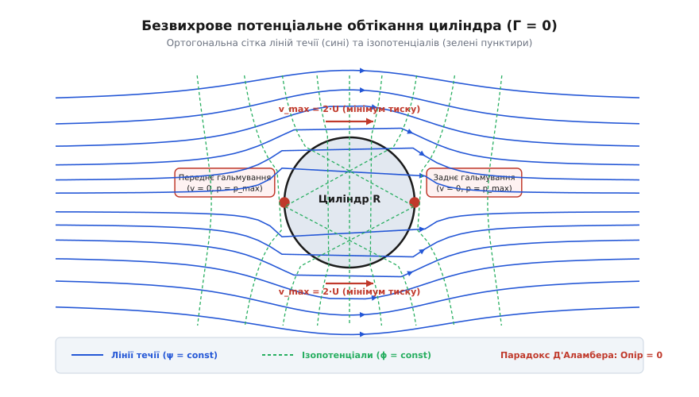
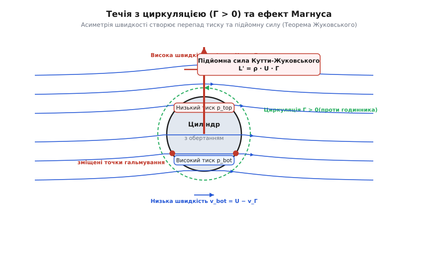
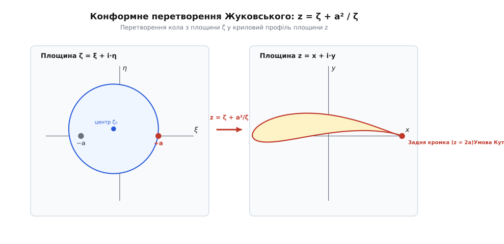

# Потенціальна течія

<preknowlist>
- [Рівняння Нав'є — Стокса](topic:physics/navier-stokes) — загальні рівняння руху в'язкої рідини.
- [Неперервність течії](topic:physics/flow-continuity) — закон збереження маси для суцільного середовища.
- [В'язкість](topic:physics/viscosity) — внутрішнє тертя та дотичні напруження в рідині.
- [Число Рейнольдса](topic:physics/reynolds-number) — співвідношення інерційних сил та сил в'язкості.
</preknowlist>

Пряме чисельне розв'язання повних тривимірних рівнянь Нав'є — Стокса для аеродинамічного профілю літака вимагає мільярдів вузлів розрахункової сітки всередині тонких примежових шарів, де сили в'язкого тертя розсіюють кінетичну енергію. Проте на більшій частині об'єму потоку поза цими вузькими зонами в'язке тертя практично не встигає спотворити рух рідких частинок. Якщо елемент рідини рухається без власного обертання навколо власної осі, складна нелінійна гідродинаміка раптово спрощується до лінійного векторного поля, яке описується єдиним скалярним потенціалом швидкості. Потенціальна течія дає змогу точно обчислити розподіл швидкостей і тиску навколо тіл довільної форми за допомогою елегантних аналітичних методів математичної фізики.

## Безвихрове поле та потенціал швидкості

У довільному плині суцільного середовища вектор швидкості рідкої частинки змінюється від точки до точки. Кинематичний аналіз руху малого рідкого об'єму показує, що локальна зміна швидкості в сусідніх точках описується тензором градієнта швидкості `∂u_i / ∂x_j`. Цей тензор розкладається на симетричну та антисиметричну частини:

```
∂u_i / ∂x_j = S_ij + Ω_ij
```

Симетрична частина `S_ij = (1/2) · (∂u_i / ∂x_j + ∂u_j / ∂x_i)` — це тензор швидкостей деформації, який описує лінійне розтягування та зсув елемента рідини. Антисиметрична частина `Ω_ij = (1/2) · (∂u_i / ∂x_j - ∂u_j / ∂x_i)` являє собою тензор обертання, який характеризує кутову швидкість обертання частинки як жорсткого цілого.

Ротація частинки виражається вектором вихру або ротором поля швидкостей:

```
ω = ∇ × u
```

Тут `u` — вектор швидкості плину, а `ω` — вектор вихровості (грец. *вortex* — вихор). У трьох декартових координатах компоненти вектора вихровості дорівнюють:

```
ω_x = ∂u_z / ∂y - ∂u_y / ∂z
ω_y = ∂u_x / ∂z - ∂u_z / ∂x
ω_z = ∂u_y / ∂x - ∂u_x / ∂y
```

Якщо вектор вихровості в усій розглянутій області дорівнює нулю (`ω = 0`), плин називається безвихровим (англ. *irrotational flow*). Відсутність вихровості означає, що кожна окрема частинка рідини під час руху не має власного кутового обертання навколо своїх внутрішніх осей, хоча сама траєкторія її макроскопічного руху може бути вигнутою чи коловою.

З теореми Гельмгольца векторного аналізу випливає, що будь-яке векторне поле з нульовим ротором у простозв'язній області є потенціальним. Це гарантує існування такої скалярної функції `ϕ(x, y, z, t)`, що вектор швидкості в кожній точці дорівнює її градієнту:

```
u = ∇ϕ
```

У декартовій системі координат три компоненти швидкості виражаються через частинні похідні першого порядку від потенціалу швидкості `ϕ`:

```
u_x = ∂ϕ / ∂x
u_y = ∂ϕ / ∂y
u_z = ∂ϕ / ∂z
```

Існування потенціалу швидкості має вирішальний математичний наслідок: криволінійний інтеграл від вектора швидкості вздовж довільного шляху між точками `A` та `B` більше не залежить від геометрії траєкторії інтегрування, а визначається лише різницею значень потенціалу у кінцевих точках:

```
∫[A->B] u · dr 
= ∫[A->B] (∇ϕ) · dr                              [вираження через градієнт u = ∇ϕ]
= ∫[A->B] ((∂ϕ/∂x)·dx + (∂ϕ/∂y)·dy + (∂ϕ/∂z)·dz)  [розкладення градієнта по координатах]
= ∫[A->B] dϕ                                      [повний диференціал dϕ]
= ϕ(B) - ϕ(A)                                     [теорема про інтегрування диференціала]
```

Замкнений інтеграл швидкості по довільному контуру `C`, який називається циркуляцією швидкості `Γ`, у простозв'язній безвихровій області тотожно дорівнює нулю:

```
Γ = ∮[C] u · dr = 0
```

Це означає, що робота проти сил інерції на замкненому траєкторному шляху потенціального поля не виконується, а сам плин є абсолютно консервативною динамічною системою. Якщо середовище є ідеальною нев'язкою рідиною, а зовнішні масові сили потенційні (наприклад, сила тяжіння), то за теоремою Кельвіна безвихровий стан течії зберігається в часі назавжди: рідина, що початково перебувала в стані спокою або однорідного руху, залишається потенціальною протягом усього подальшого плину.

## Рівняння Лапласа та функція течії

Для нестисливої рідини густина `ρ` є сталою величиною (`ρ = const`). З фундаментального закону збереження маси для суцільного середовища випливає рівняння неперервності течії у диференціальній формі:

```
∇ · u = 0
```

Підставивши вираз для вектора швидкості через потенціал `u = ∇ϕ` у рівняння неперервності, отримуємо фундаментальне рівняння потенціальної течії несжимаємої рідини — скалярне рівняння Лапласа:

```
∇ · (∇ϕ) = ∇²ϕ = 0
```

У декартових координатах рівняння Лапласа виражається сумою других частинних похідних по просторових координатах:

```
∂²ϕ/∂x² + ∂²ϕ/∂y² + ∂²ϕ/∂z² = 0
```

Будь-яка функція `ϕ`, яка задовольняє рівняння Лапласа та має неперервні похідні второго порядку, називається гармонічною функцією. Гармонічні функції володіють надзвичайними математичними властивостями. Зокрема, вони задовольняють теорему про середнє значення: значення `ϕ` у центрі будь-якої кулі дорівнює середньому арифметичному значень `ϕ` на її поверхні. Крім того, гармонічна функція не може мати строгих локальних екстремумів (максимумів чи мінімумів) усередині області течії — усі екстремуми швидкості та тиску розташовуються виключно на межах середовища (на поверхнях твердих тіл або на нескінченності).

У циліндричних координатах `(r, θ, z)` рівняння Лапласа набуває вигляду:

```
(1/r) · ∂/∂r (r · ∂ϕ/∂r) + (1/r²) · ∂²ϕ/∂θ² + ∂²ϕ/∂z² = 0
```

А у сферичних координатах `(r, θ, ψ)` виражається через полярні кути:

```
(1/r²) · ∂/∂r (r² · ∂ϕ/∂r) + (1/(r² · sin θ)) · ∂/∂θ (sin θ · ∂ϕ/∂θ) + (1/(r² · sin² θ)) · ∂²ϕ/∂ψ² = 0
```

Складне гідродинамічне завдання визначення поля швидкостей рідини зводиться до розв'язання класичної крайової задачі математичної фізики для рівняння Лапласа з відповідними граничними умовами: кінематичною умовою непроникання на твердих стінках `u · n = ∂ϕ/∂n = 0` (де `n` — нормаль до поверхні) та умовою згасання збурень на великій відстані від тіла `∇ϕ -> U_∞`.

Для двовимірних (плоских) течій існує другий зручний скалярний апарат — функція течії `ψ(x, y)` (англ. *stream function*). Вона вводиться так, щоб рівняння неперервності `∂u_x/∂x + ∂u_y/∂y = 0` виконувалося автоматично за визначенням:

```
u_x =  ∂ψ / ∂y
u_y = -∂ψ / ∂x
```

У полярних координатах `(r, θ)` компоненти швидкості виражаються через функцію течії `ψ` як:

```
u_r = (1 / r) · (∂ψ / ∂θ)
u_θ = -∂ψ / ∂r
```

Фізичний зміст функції течії полягає в тому, що лінії, уздовж яких функція течії зберігає стале значення (`ψ(x, y) = const`), є лініями течії плину. Вектор швидкості рідини в кожній точці спрямований строго по дотичній до лінії течії, а об'ємна витрата рідини між двома лініями течії `ψ₁` та `ψ₂` дорівнює просто їхній різниці: `Q = ψ₂ - ψ₁`.

Якщо вимогу безвихровості течії `ω_z = ∂u_y/∂x - ∂u_x/∂y = 0` виразити через функцію течії `ψ`, то вона також перетворюється на двовимірне рівняння Лапласа:

```
∂/∂x (-∂ψ/∂x) - ∂/∂y (∂ψ/∂y) = 0
⇒ ∂²ψ/∂x² + ∂²ψ/∂y² = 0
```

Зіставляючи формули для компонент швидкості через потенціал `ϕ` та функцію течії `ψ`, отримуємо класичні математичні співвідношення Коші — Рімана:

```
∂ϕ/∂x =  ∂ψ/∂y
∂ϕ/∂y = -∂ψ/∂x
```

З цих співвідношень миттєво обчислюється скалярний добуток градієнтів функцій `ϕ` та `ψ`:

```
∇ϕ · ∇ψ 
= (∂ϕ/∂x)·(∂ψ/∂x) + (∂ϕ/∂y)·(∂ψ/∂y)          [скалярний добуток у декартових координатах]
= (∂ψ/∂y)·(∂ψ/∂x) + (-∂ψ/∂x)·(∂ψ/∂y)         [заміна похідних ϕ на ψ за співвідношеннями Коші — Рімана]
= 0                                          [взаємне скорочення доданків із протилежними знаками]
```

Це доводить фундаментальну геометричну властивість плоского потенціального плину: лінії рівного потенціалу (`ϕ = const`) та лінії течії (`ψ = const`) утворюють у просторі взаємно ортогональну сітку кривих.

Докладніше про побудову цієї ортогональної сітки за допомогою аналітичних функцій комплексної змінної написано в окремій матеріальній вставці: [Математичний апарат комплексного потенціалу](topic:physics/potential-flow/math-complex-potential.md).

## Елементарні потенціальні течії та принцип суперпозиції

Рівняння Лапласа належить до класу лінійних диференціальних рівнянь у частинних похідних. Звідси випливає фундаментальний принцип суперпозиції: якщо `ϕ₁` та `ϕ₂` є окремими розв'язками рівняння Лапласа, то їхня довільна лінійна комбінація `ϕ = c₁·ϕ₁ + c₂·ϕ₂` також є точним розв'язком рівняння Лапласа.

Завдяки принципу суперпозиції складно геометричні плини навколо довільних тіл можна конструювати шляхом додавання декількох простих «будівельних блоків» — елементарних потенціальних течій.


*Суперпозиція чотирьох елементарних течій: рівномірного потоку, джерела, точкового вихру та диполя.*

До чотирьох основних елементарних потенціальних течій належать:

1. **Однорідний (рівномірний) потік:** плин зі сталою за модулем та напрямком швидкістю `U`, спрямованою під кутом `α` до осі `x`:

```
ϕ = U · (x · cos α + y · sin α)
ψ = U · (y · cos α - x · sin α)
```

2. **Точкове джерело (або сток):** плоский радіально-симетричний потік, який випромінюється з однієї точки з об'ємною витратою `Q` (для стоку `Q < 0`):

```
u_r = Q / (2π · r)
u_θ = 0
ϕ = (Q / (2π)) · ln r
ψ = (Q / (2π)) · θ
```

Тут `r = √(x² + y²)` — полярний радіус, а `θ = arctan(y / x)` — полярний кут. У точці `r = 0` знаходиться сингулярність (нескінченна швидкість).

3. **Точковий (потенціальний) вихор:** плин по концентричних колах із постійною циркуляцією `Γ`, у якому вихровість дорівнює нулю всюди, окрім самої точки сингулярності в центрі:

```
u_r = 0
u_θ = Γ / (2π · r)
ϕ =  (Γ / (2π)) · θ
ψ = -(Γ / (2π)) · ln r
```

Важливо відрізняти потенціальний вихор від обертання твердого тіла. У твердотільному обертанні окружна швидкість зростає пропорційно радіусу (`u_θ = ω·r`), а вихровість стала (`ω = 2Ω`). У потенціальному вихрі окружна швидкість спадає обернено пропорційно радіусу (`u_θ ∝ 1/r`), тому вихровість частинок рідини поза центром дорівнює нулю.

4. **Диполь (дуплет):** результат граничного зближення джерела `+Q` та стоку `-Q`, розташованих на відстані `Δx`, коли відстань прямує до нуля `Δx -> 0`, а добуток `μ = (Q · Δx) / π` залишається сталим моментом диполя:

```
ϕ =  (μ · cos θ) / r = (μ · x) / (x² + y²)
ψ = -(μ · sin θ) / r = -(μ · y) / (x² + y²)
```

Якщо накласти однорідний потік зі швидкістю `U` вздовж осі `x` на диполь з моментом `μ`, спрямований проти потоку, сумарна функція течії набуде вигляду:

```
ψ = U · y - (μ · y) / (r²) 
= U · y · (1 - μ / (U · r²))                  [винесення спільного множника U·y]
```

Введемо позначення `R = √(μ / U)`. Тоді на колі радіуса `r = R` функція течії приймає стале значення `ψ = 0`. Оскільки непроникна тверда стінка тіла за визначенням є лінією течії (`ψ = const`), коло `r = R` можна замінити твердим непроникним циліндром. Отже, суперпозиція рівномірного потоку та диполя дає точний аналітичний розв'язок задачі про безвихрове обтікання круглого циліндра.


*Безвихрове обтікання гладкого циліндра потенціальним потоком несжимаємої рідини з симетричними точками гальмування.*

На поверхні циліндра радіуса `R` радіальна швидкість дорівнює нулю (`u_r = 0`), а тангенціальна швидкість змінюється за гармонічним законом:

```
u_θ = -2 · U · sin θ
```

У передній (`θ = π`) та задній (`θ = 0`) точках екватора швидкість рідини дорівнює нулю. Ці точки називаються точками гальмування (англ. *stagnation points*). У верхній (`θ = π/2`) та нижній (`θ = 3π/2`) полюсних точках циліндра швидкість досягає свого абсолютного максимуму та удвічі перевищує швидкість набігаючого потоку: `|u_θ| = 2 · U`.

Для порівняння розсунемо просторову вимірність до тривимірного обтікання кулі радіуса `R`. Потенціал швидкості для кулі в однорідному потоці складається з потоку та тривимірного диполя:

```
ϕ = U · r · cos θ · (1 + R³ / (2 · r³))
```

Радіальна та тангенціальна компоненти швидкості на поверхні кулі `r = R` набувають вигляду:

```
u_r = 0
u_θ = -(3/2) · U · sin θ
```

Максимальна швидкість на екваторі кулі перевищує швидкість набігаючого потоку лише в 1.5 раза (`v_max = 1.5 U`), на відміну від двовимірного циліндра (`v_max = 2.0 U`). Це пояснюється тим, що у тривимірному просторі рідина має додатковий вимір для обтікання тіла з боків, що зменшує локальне стискання ліній течії.

Аналітичні формули та математичні характеристики елементів зведено у [Довідник елементарних потенціальних елементів](topic:physics/potential-flow/api-potential-flow-elements.md).

## Нестаціонарний інтеграл Бернуллі та приєднана маса

У нестаціонарній потенціальній течії, коли потенціал швидкості явно залежить від часу `ϕ(x, y, z, t)`, першим інтегралом рівнянь руху є нестаціонарне рівняння Бернуллі (інтеграл Коші — Лангранжа):

```
∂ϕ / ∂t + (1/2) · v² + p / ρ + g · z = C(t)
```

Тут частинна похідна `∂ϕ/∂t` враховує локальну часову зміну потенціалу швидкості, а `C(t)` — довільна функція часу.

Нестаціонарне рівняння Бернуллі є ключовим інструментом для обчислення приєднаної маси (англ. *added mass* або *virtual mass*). Коли тверде тіло прискорюється всередині рідини з прискоренням `a = dU/dt`, воно змушене надавати кінетичну енергію оточуючому потенціальному середовищу. Сумарна кінетична енергія всього об'єму рідини `E_k` виражається через об'ємний інтеграл від квадрата швидкості:

```
E_k = (1/2) · ρ · ∭ (∇ϕ)² dV
```

Завдяки формулі Гріна цей об'ємний інтеграл зводиться до поверхневого інтеграла по поверхні тіла `S`:

```
E_k = (1/2) · ρ · ∬[S] ϕ · (∂ϕ / ∂n) dS
```

Для круглого циліндра радіуса `R`, що рухається зі швидкістю `U(t)`, потенціал на поверхні дорівнює `ϕ = -U · R · cos θ`. Обчислення поверхневого інтеграла дає:

```
E_k = (1/2) · (ρ · π · R²) · U² = (1/2) · m_added · U²
```

Величина `m_added = ρ · π · R²` називається приєднаною масою циліндра на одиницю довжини. Вона дорівнює масі рідини у формі самого циліндра. Для прискорення тіла в рідині зовнішня сила повинна долати не лише власну інерцію тіла `m_body`, а й інерцію приєднаної маси рідини: `F = (m_body + m_added) · a`. Для тривимірної кулі приєднана маса дорівнює половині маси витісненої рідини: `m_added = (2/3) · π · ρ · R³`.

У технічних розрахунках підводної та авіаційної динаміки коефіцієнт приєднаної маси визначається відношенням `k_m = m_added / m_displaced`. Для кулі `k_m = 0.5`, для поперечного круглого циліндра `k_m = 1.0`, а для тонкої плоскої пластини шириною `2b`, що рухається перпендикулярно до площини, приєднана маса дорівнює масі циліндра рідини діаметром `2b`: `m_added = ρ · π · b²`.

## Теорема мінімуму кінетичної енергії Томсона (лорда Кельвіна)

Фундаментальною варіаційною властивістю безвихрових потенціальних течій є теорема Вільяма Томсона (лорда Кельвіна). Розглянемо нестисливу рідину у замкненій області `V` з заданим нормальним розподілом швидкостей `u_n = ∂ϕ/∂n` на межі `S`.

Серед усіх можливих соленоїдальних полів швидкостей `u'` (`∇ · u' = 0`), які задовольняють ті самі граничні умови на межі `S`, дійсний безвихровий потенціальний плин `u = ∇ϕ` володіє строго найменшою сумарною кінетичною енергією:

```
E_k(потенціальна) ≤ E_k(будь-яка інша з тими самими граничними умовами)
```

Математично різниця кінетичних енергій довільного поля `u' = u + w` та потенціального поля `u = ∇ϕ` (де `∇ · w = 0` та `w_n = 0` на межі `S`) виражається як:

```
E_k(u') - E_k(u) = (1/2) · ρ · ∭ w² dV ≥ 0
```

Ця теорема має глибокий фізичний зміст: якщо нестислива рідина раптово приводиться в рух з стану спокою шляхом імпульсивного зсуву меж, виникаючий плин миттєво стає потенціальним, оскільки природа реалізує конфігурацію з найменшим витраченим імпульсом та мінімальною кінетичною енергією.

## Потенціальна теорія поверхневих хвиль

Ще одним класичним застосуванням потенціальної течії є теорія поверхневих гравітаційних хвиль на вільній поверхні рідини. Нехай `z = η(x, t)` описує відхилення вільної поверхні від стану спокою `z = 0`.

Усередині об'єму рідини потенціал швидкості `ϕ(x, z, t)` задовольняє двовимірне рівняння Лапласа:

```
∂²ϕ/∂x² + ∂²ϕ/∂z² = 0
```

На вільній поверхні `z = η(x, t)` діють дві граничні умови:

1. **Кінематична гранична умова:** частинка рідини на поверхні залишається на поверхні:

```
∂η / ∂t = ∂ϕ / ∂z  при  z = 0
```

2. **Динамічна гранична умова:** тиск на вільній поверхні є сталим і дорівнює атмосферному `p = p_atm`. З нестаціонарного рівняння Бернуллі в лінійному наближенні малих амплітуд отримуємо:

```
∂ϕ / ∂t + g · η = 0  при  z = 0
```

Поєднуючи обидві граничні умови, отримуємо єдине лінійне рівняння для потенціалу вільної поверхні:

```
∂²ϕ / ∂t² + g · (∂ϕ / ∂z) = 0  при  z = 0
```

Розв'язок для гармонічної прогресивної хвилі з частотою `ω` та хвильовим числом `k = 2π / λ` у шарі рідини глибиною `h` має вигляд:

```
ϕ(x, z, t) = ((A · g) / ω) · (cosh(k · (z + h)) / cosh(k · h)) · sin(k · x - ω · t)
η(x, t) = A · cos(k · x - ω · t)
```

Підставивши цей розв'язок у граничну умову, отримуємо фундаментальне дисперсійне співвідношення для гравітаційних хвиль:

```
ω² = g · k · tanh(k · h)
```

Звідси обчислюється фазова швидкість поширення хвиль `c = ω / k`:

1. **Глибока вода (`h >> λ`, `tanh(kh) -> 1`):** фазова швидкість залежить від довжини хвилі `c = √(g / k) = √(g · λ / (2π))`. Довгі хвилі біжать швидше за короткі (дисперсія хвиль).
2. **Милина (`h << λ`, `tanh(kh) -> kh`):** фазова швидкість не залежить від довжини хвилі й визначається виключно глибиною водойми: `c = √(g · h)`. Саме за цією формулою поширюються хвилі цунамі у відкритому океані.

## Циркуляція, підйомна сила та парадокс Д'Аламбера

Розподіл статичного тиску в стаціонарному потенціальному потоці визначається інтегралом Бернуллі для ідеальної несжимаємої рідини:

```
p + (1/2) · ρ · v² = p_∞ + (1/2) · ρ · U² = const
```

Введемо безрозмірний коефіцієнт тиску `C_p`:

```
C_p = (p - p_∞) / ((1/2) · ρ · U²) = 1 - (v / U)²
```

Для потенціального обтікання циліндра без циркуляції тангенціальна швидкість на стінці дорівнює `v = 2·U·sin θ`, тому коефіцієнт тиску визначається формулою:

```
C_p(θ) = 1 - 4 · sin² θ
```

У передній та задній точках гальмування (`θ = 0, π`) коефіцієнт тиску досягає максимального значення `C_p = +1` (повне гальмування [динамічного тиску](topic:physics/dynamic-pressure)). У верхній та нижній точках (`θ = π/2, 3π/2`) тиск падає до глибокого розрядження `C_p = -3`.

Розподіл тиску по поверхні є симетричним відносно осей `x` та `y`. Проінтегруємо сили тиску вздовж контуру циліндра для обчислення лобового опору `F_drag` та поперечної сили `F_lift`:

```
F_drag = -∫[0->2π] p(θ) · cos θ · R · dθ 
= -((1/2)·ρ·U²) · R · ∫[0->2π] (1 - 4·sin² θ) · cos θ · dθ 
= 0                                          [інтегрування симетричної функції]

F_lift = -∫[0->2π] p(θ) · sin θ · R · dθ 
= -((1/2)·ρ·U²) · R · ∫[0->2π] (1 - 4·sin² θ) · sin θ · dθ 
= 0                                          [інтегрування симетричної функції]
```

Обидва інтеграли дорівнюють нулю. Жан ле Рон д'Аламбер у 1752 році узагальнив цей висновок на тіло довільної замкненої форми: у стаціонарному безвихровому потенціальному потоці ідеальної нев'язкої рідини будь-яке тіло зазнає строго нульового лобового опору (`F_drag = 0`). Цей фізичний результат суперечить повсякденному досвіду та увійшов у гідродинаміку як парадокс Д'Аламбера.

Про історію цього парадоксу та його понад столітній вплив на розвиток механіки читайте в історичній вставці: [Парадокс Д'Аламбера та створення гідродинаміки ідеальної рідини](topic:physics/potential-flow/hist-dalembert-euler.md).

Щоб пояснити виникнення [підйомної сили](topic:physics/circulation-lift-theorem), додамо до потоку навколо циліндра точковий вихор інтенсивністю `Γ`. Сумарна функція течії набуде вигляду:

```
ψ = U · y · (1 - R² / r²) - (Γ / (2π)) · ln(r / R)
```

Тангенціальна швидкість на поверхні циліндра стає асиметричною:

```
u_θ = -2 · U · sin θ - Γ / (2π · R)
```


*Асиметрія ліній течії та розподілу швидкості навколо циліндра з циркуляцією, що породжує підйомну силу Жуковського.*

Точки гальмування (`u_θ = 0`) зміщуються в нижню напівплощину:

```
sin θ_s = -Γ / (4π · U · R)
```

Залежно від величини циркуляції `Γ` можливі три геометричні режими:
1. При `|Γ| < 4πUR` обидві точки гальмування лежать на поверхні циліндра у нижній частині.
2. При `|Γ| = 4πUR` дві точки зливаються в одну критичну точку на самій підошві циліндра (`θ = -π/2`).
3. При `|Γ| > 4πUR` точка гальмування відривається від поверхні та виходить у вільний об'єм рідини під циліндром.

У верхній частині циліндра (`sin θ > 0`) напрямок набігаючого потоку збігається з напрямком вихрового обертання, тому абсолютна швидкість зростає: `v_top = 2U + Γ/(2πR)`. Згідно з рівнянням Бернуллі, високій швидкості відповідає низький тиск. У нижній частині швидкість віднімається, і тиск зростає. 

Проінтегрувавши асиметричний розподіл тиску по колу, отримуємо:

```
F_drag = 0
F_lift = ρ · U · Γ
```

Цей результат становить зміст фундаментальної теореми Кутти — Жуковського: підйомна сила одиниці довжини циліндра чи крила прямо пропорційна густині середовища `ρ`, швидкості потоку `U` та циркуляції швидкості `Γ`. Прикладом фізичної реалізації циркуляції є ефект Магнуса, коли циліндр, що обертається у потоці, відхиляє свій шлях завдяки в'язкому захопленню пристінних шарів рідини.

## Конформні відображення та картографування аеродинамічних профілів

Для обчислення потенціального потоку навколо аеродинамічних профілів складної форми у двовимірній гідродинаміці застосовується метод конформних відображень теорії функцій комплексної змінної.

Введемо комплексні координати `z = x + i·y` та комплексний потенціал `W(z)`:

```
W(z) = ϕ(x, y) + i · ψ(x, y)
```

Похідна від комплексного потенціалу по комплексній координаті `z` визначає так звану комплексну швидкість `V(z)`:

```
dW / dz = ∂ϕ/∂x + i · ∂ψ/∂x = u_x - i · u_y
```

Модуль комплексної швидкості дорівнює фізичній швидкості потоку: `|dW/dz| = √(u_x² + u_y²) = v`.

Нехай задано аналітичну функцію `z = f(ζ)`, яка здійснює конформне відображення комплексної площини `ζ = ξ + i·η` на площину `z = x + i·y`. Властивістю конформного відображення є збереження кутів між перетином будь-яких ліній та збереження гармонічності функцій `ϕ` та `ψ`.

Класичним прикладом є конформне перетворення Жуковського:

```
z = ζ + a² / ζ
```

Де `a` — додатний геометричний параметр масштабу.


*Геометричне перетворення кола у криловий профіль за допомогою конформного відображення Жуковського.*

Похідна перетворення Жуковського дорівнює:

```
dz / dζ = 1 - a² / ζ²
```

Точки `ζ = ±a` є особливими (критичними) точками конформного відображення, у яких `dz/dζ = 0`. Якщо у площині `ζ` взяти коло, яке проходить через точку `ζ = +a` та охоплює точку `ζ = -a`, то перетворення Жуковського відобразить це коло в площину `z` у гладкий аеродинамічний профіль з вигином, товщиною та гострою задньою кромкою у точці `z = 2a`.

Проте виникає питання: яка саме величина циркуляції `Γ` реалізується під час обтікання даного крила при заданому куті атаки `α`? Фізичну відповідь дає умова Кутти — Жуковського (англ. *Kutta condition*): реальний плин в'язкої рідини при сходженні з гострої кромки формує циркуляцію `Γ` такої величини, щоб задня точка гальмування потоку розташовувалася строго на самій гострій кромці профілю.

З математичного погляду умова Кутти вимагає скінченності комплексної швидкості `dW/dz` у точці задньої кромки `z = 2a`:

```
dW / dz = (dW / dζ) / (dz / dζ)
```

Оскільки у точці задньої кромки знаменник дорівнює нулю (`dz/dζ = 0` при `ζ = a`), то для запобігання нескінченно великої швидкості чисельник також мусить перетворюватися на нуль: `dW/dζ = 0` при `ζ = a`. З цієї вимоги виводиться формула для циркуляції крилового профілю Жуковського:

```
Γ = 4π · U · R · sin(α + β)
```

Де `α` — кут атаки потоку, `R` — радіус вихідного кола, а `β` — кут згину середньої лінії профілю.

Чисельний алгоритм розрахунку потенціального обтікання довільних профілів реалізовано у практичній вставці: [Чисельний розв'язувач методом панелей](topic:physics/potential-flow/proj-potential-flow-solver.md).

## Чисельні класичні методи потенціального розрахунку

Для обчислення потенціального потоку навколо профілів довільної геометрії, які не описуються простими аналітичними конформними відображеннями, використовують чисельні методи дискретизації.

1. **Метод граничних елементів (Panel Method):** поверхня обтікального тіла розбивається на `N` плоских або криволінійних панелей. На кожній панелі розміщується неперервний шар джерел інтенсивністю `q_j` або вихровий шар інтенсивністю `γ_j`. Гранична умова непроникання `u · n = 0` на кожній контрольній точці панелі призводить до системи `N` лінійних алгебраїчних рівнянь:

```
∑[j=1->N] A_ij · q_j = b_i
```

Тут `A_ij` — матриця коефіцієнтів геометричного впливу панелі `j` на контрольну точку `i`. Розв'язання системи дає розподіл інтенсивностей сингулярностей, з яких миттєво обчислюються швидкості `v_i` та коефіцієнти тиску `C_p,i` на поверхні.

2. **Метод дискретних вихрів та вихрової сітки (Vortex Lattice Method, VLM):** застосовується для тривимірних крил малої та великої стрілоподібності. Серединна поверхня крила моделюється сіткою П-подібних вихрових рам (англ. *horseshoe vortices*). Вільні вихрові нитки збігають із задньої кромки у слід за крилом. Застосування закону Біо — Савара — Лапласа дає змогу обчислити індукований опір та розподіл підйомної сили по розмаху крила.

## Технічні застосування потенціальної гідродинаміки

Потенціальна теорія течії знаходить величезне практичне застосування в різноманітних галузях інженерії:

1. **Аеродинаміка літальних апаратів:** розрахунок розподілу тиску по поверхні крил і фюзеляжу на підзвукових швидкостях. Швидкі панельні алгоритми дозволяють оптимізувати геометричні форми профілів у режимі реального часу під час автоматизованого синтезу крил.
2. **Морська аерогідродинаміка:** розрахунок хвильового опору суден, обтікання гребних гвинтів, підводних крил та кермових пристроїв. Врахування потенціальних хвиль дозволяє мінімізувати втрати енергії корабля на утворення хвильового сліду.
3. **Роторні вітрогенератори та судновий рушій Флеттнера:** використання ефекту Магнуса на циліндрах, що обертаються (ротори Флеттнера), забезпечує високий коефіцієнт підйомної сили `C_L > 10`, що в рази перевищує показники традиційних жорстких крил.
4. **Розрахунок гідротехнічних споруд та фільтрації:** плин ґрунтових вод крізь пористі породи описується законом Дарсі `u = -K · ∇h`, який є математичним аналогом потенціального потоку, де роль потенціалу виконує п'єзометричний напір `h`.

## Фізичні межі застосовності та зв'язок з реальним плином

Чому теорія потенціальної течії, яка передбачає відсутність лобового опору, залишається наріжним каменем сучасної аеродинаміки та гідродинаміки?

Відповідь полягає у фізиці течій при високих числах Рейнольдса (`Re >> 1`). В'язкість реального повітря або води є дуже малою величиною. Молекулярні сили в'язкого тертя `τ = μ · (du/dy)` виявляються суттєвими лише там, де присутні колосальні градієнти швидкості. Згідно з теорією [примежового шару](topic:physics/boundary-layer) Людвига Прандтля, при `Re >> 1` дія в'язкості локалізується у тонкій плівці товщиною `δ ~ L / √Re` біля поверхні тіла. 

Потенціальна теорія дає точний розв'язок для всього зовнішнього потоку поза примежовим шаром. Знайдений з потенціального розв'язку розподіл тиску `p(x)` на зовнішній межі примежового шару передається без змін крізь товщину шару безпосередньо на стінку тіла.

Однак потенціальна модель ламається у разі виникнення [відриву течії](topic:physics/flow-separation). Якщо несприятливий зростаючий градієнт тиску (`dp/dx > 0`) у задній частині тіла зупиняє загальмований тертям примежовий шар, відбувається відрив струмин із утворенням широкого вихрового сліду. У такому разі симетрія тиску руйнується, і виникає реальний тисковий лобовий опір.

Ще одним фундаментальним зв'язком між потенціальною теорією та реальністю є теорема Кельвіна про збереження циркуляції: у нев'язкій баратропній рідині під дією потенціальних масових сил циркуляція по будь-якому замкненому рідкому контуру зберігається в часі (`dΓ/dt = 0`). Під час початку руху крила з стану спокою з гострої задньої кромки під дією в'язкості зривається так званий початковий вихор (англ. *starting vortex*), який відноситься потоком назад. Щоб загальна циркуляція великого контуру, що охоплює крило й вихор, залишалася нульовою, навколо самого крила виникає рівна за модулем і протилежна за знаком прив'язана циркуляція `Γ`, яка й забезпечує крилу постійну підйомну силу.

У тривимірному просторі для скінченного крила прив'язана циркуляція `Γ(y)` не може просто обриватися на кінцях крила за теоремою Гельмгольца. Вона збігає з кінців крила у вигляді двох вільних кінцевих вихрових джгутів (англ. *wingtip vortices*). Ці кінцеві вихрі індукують скос потоку вниз (англ. *downwash*) по всьому розмаху, що відхиляє вектор підйомної сили назад і породжує індукований опір тривимірного крила:

```
C_Di = C_L² / (π · AR · e)
```

Де `AR = b² / S` — подовження крила, а `e` — коефіцієнт Освальда. Таким чином, потенціальна теорія тривимірного крила Прандтля — Ланчестера точно описує індукований опір навіть у нев'язкому потоці!

> 🔧 **Навіщо це.**
> Потенціальна течія є основою сучасних чисельних методів аеродинамічного проектування (Panel Methods, Boundary Element Methods, Vortex Lattice Method). У той час як повний розрахунок Нав'є — Стокса для планера літака потребує багатьох годин роботи суперкомп'ютера, панельний розрахунок потенціального потоку дає розподіл підйомної сили та перепади тиску за частки секунди. Метод застосовується на початкових етапах проективання крил, гвинтів, підводних крил та розрахунку корабельних хвильових систем.

