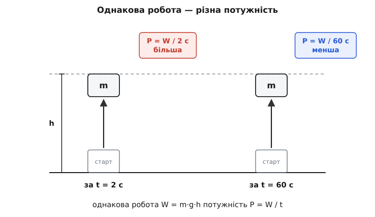
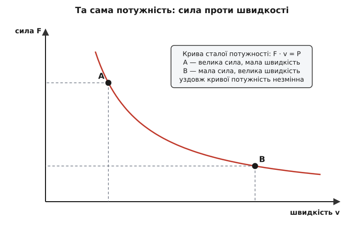

# Потужність

<preknowlist>
- [Механічна робота](topic:physics/work) — робота сили дорівнює силі, помноженій на переміщення вздовж напрямку руху; це передана тілу енергія в джоулях.
- [Швидкість](topic:physics/velocity) — миттєвий темп зміни положення, скільки метрів за секунду долає тіло.
- [Сила](topic:physics/force) — міра дії на тіло, причина зміни його руху.
</preknowlist>

Два баштові крани піднімають однакову бетонну плиту на той самий поверх. Перший робить це за дві секунди, другий — за годину. Робота, яку вони виконали, однакова до джоуля: та сама плита, та сама висота, та сама набута енергія. І все ж назвати ці крани рівними язик не повертається. Різниця не в тому, *скільки* енергії передано, а в тому, *як швидко* її передано. Саме цей темп передавання енергії й називають потужністю.

Отже, потужність — це робота за одиницю часу. Якщо за час t виконано роботу W, середня потужність — просто

```
P = W / t
```

Коли ж темп змінюється щомиті — двигун то тисне сильніше, то відпускає, — беруть не весь проміжок, а нескінченно малий: миттєва потужність є похідною роботи за часом, P = dW/dt. Одиниця виходить сама собою: джоуль за секунду. Їй дали власну назву — ват (на честь шотландського інженера Джеймса Ватта, 1736–1819), і позначають W. Один ват — це один джоуль енергії, переданий за одну секунду.



*Обидва крани виконують однакову роботу W = m·g·h, але за різний час; хто встигає за коротший t, той розвиває більшу потужність P = W/t.*

Ця формула стає по-справжньому корисною, щойно згадати, звідки береться сама робота. Сила F, що штовхає тіло вздовж його руху, на шляху d виконує роботу W = F·d. Поділимо це на час: P = W/t = F·(d/t). Але d/t — це і є швидкість. Тому

```
P = F · v
```

потужність дорівнює силі, помноженій на швидкість, з якою ця сила протягує тіло. Це найпрактичніше обличчя потужності: щоб рухати щось зі швидкістю v проти опору F, треба щосекунди підводити рівно F·v енергії.

Звідси випливає річ, яку щодня відчуває кожен велосипедист і водій. Потужність двигуна обмежена, а в добутку F·v при сталому P сила зі швидкістю мусять розмінюватися одна на одну: більша сила — то менша швидкість, і навпаки. Тому автомобіль долає крутий підйом на низькій передачі — велике зусилля на колесах, зате повільно; на рівній трасі та сама потужність обертається малою силою, але великою швидкістю. Коробка передач нічого не додає до потужності — вона лише ділить її між силою та швидкістю так, як потрібно цієї миті.



*Крива сталої потужності F·v = P: одна й та сама потужність — це або велика сила за малої швидкості (точка A, низька передача), або мала сила за великої швидкості (точка B).*

Там, де тіло не рухається прямо, а обертається, у формулі стають на місце обертові двійники величин: замість сили — [момент сили](topic:physics/torque), замість лінійної швидкості — [кутова швидкість](topic:physics/angular-velocity). Потужність на валу дорівнює P = τ·ω. Це та сама ідея — темп передавання енергії, лише для обертання; саме так рахують потужність двигунів, турбін і редукторів.

**Скільки потужності розвиває людина, збігаючи сходами**

```
маса m    = 70 кг
висота h  = 3 м          (один поверх)
час t     = 5 с
g         ≈ 9.8 м/с²

робота проти тяжіння (набута потенціальна енергія):
W = m · g · h = 70 · 9.8 · 3 = 2058 Дж

потужність:
P = W / t = 2058 / 5 ≈ 412 Вт
```

Понад чотириста ватів — це більш ніж пів кінської сили, видані одним ривком. Довго людина так не витягне: у сталому режимі тіло тримає близько сотні ватів, тож збігання сходами — короткий сплеск, а не робочий режим.

> 🔧 **Навіщо це.** Коли інженер добирає двигун, переріз дроту чи розмір радіатора, він дивиться не на енергію, а на потужність. Енергія каже, *скільки всього* роботи зробиться; потужність каже, *наскільки товстою має бути труба*, крізь яку ця енергія проходить щосекунди. Батарея може берегти велетенський запас енергії, але віддавати його лише тонким струмочком — і навпаки, тому «ємність» і «потужність» добирають окремо.

Ідея потужності виходить далеко за межі механіки. У колі електричний струм так само передає енергію з певним темпом, і [електрична потужність](topic:physics/electric-power) рахується тим самим множенням «зусилля на потік» — напруги на струм, P = U·I. А коли частина підведеної потужності марнується на тертя та нагрів, відношення корисної потужності до всієї підведеної називають [коефіцієнтом корисної дії](topic:physics/efficiency).

Саму кінську силу Джеймс Ватт свого часу ввів, щоб покупцеві парової машини було з чим її порівняти — з кіньми, яких вона заступала на шахтах і млинах; одна кінська сила — це приблизно 746 Вт, тобто три чверті кіловата. Як він виміряв «одного коня» і чому одиниць кінської сили насправді дві — [історія кінської сили та вата](topic:physics/power/hist-horsepower.md). А порахувати, скільки ватів велосипедист насправді віддає на затяжному підйомі, можна прямо за P = F·v — склавши тяжіння схилу, кочення й опір повітря та помноживши суму на швидкість; [робочий приклад із кодом](topic:physics/power/proj-cycling-power.md) показує, як це зробити й де тут ховаються втрати трансмісії.

Енергія — це запас, валюта; потужність — швидкість, з якою ця валюта переходить з рук у руки. Тому будь-яке питання «наскільки воно потужне» — це насправді питання «як швидко тут рухається енергія».
