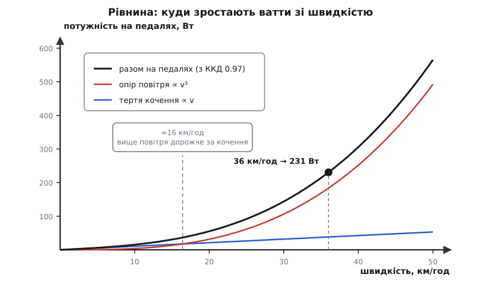
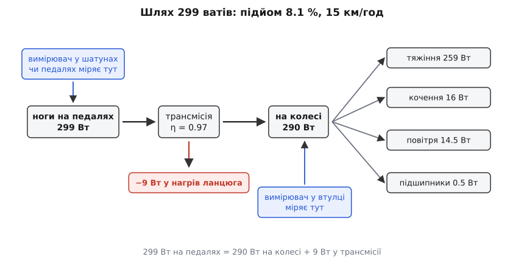

# ⚙️ Скільки ватів крутить велосипедист: модель підйому в коді

Велосипед — рідкісний випадок, коли всю механіку машини видно неозброєним оком: між ногами й дорогою стоїть один ланцюг, і жодна з сил, що тягнуть назад, не сховалась ані в паливі, ані в гідротрансформаторі. Тому ватти велосипедиста можна порахувати чесно, з першопричин, — і саме це ми зараз зробимо в коді: на вхід подамо масу, ухил, шини, посадку й вітер, а на виході отримаємо число, яке показує вимірювач у шатунах. І навпаки: за заданої потужності — швидкість, з якою людина поїде.

## Що саме треба порахувати

Гонщик їде рівномірно вгору. Рівномірно — тобто швидкість не змінюється, а отже, сума всіх сил дорівнює нулю: те, що штовхає, точно врівноважує те, що тягне назад. Значить, сила на ободі колеса дорівнює сумі опорів, і питання «скільки ватів» зводиться до питання «які опори і як швидко ми їх долаємо».

Опорів на рівному та похилому асфальті рівно три, і головна їхня властивість не в тому, скільки їх, а в тому, що вони **по-різному залежать від швидкості**:

```
F_тяжіння = m · g · sin θ            від швидкості не залежить узагалі
F_кочення = C_rr · m · g · cos θ     від швидкості майже не залежить
F_повітря = ½ · ρ · CdA · v_air²     росте як КВАДРАТ швидкості
```

Перша складова — та частина ваги, що лежить уздовж дороги: на схилі тяжіння перестає бути перпендикулярним до руху й починає гальмувати. Друга — [тертя кочення](book:physics/rolling-resistance): шина під навантаженням щомиті сплющується і розправляється, гума при цьому гріється, і ця енергія не вертається; величину задає безрозмірний коефіцієнт C_rr, помножений на ту складову ваги, якою колесо притиснуте до дороги. Третя — [опір повітря](book:physics/aerodynamic-drag), де ½·ρ·v² — це [динамічний тиск](book:physics/dynamic-pressure), напір загальмованого потоку, а CdA — добуток коефіцієнта опору на лобову площу, тобто вся аеродинаміка велосипедиста, зведена до одного числа в квадратних метрах.

Помножити суму на швидкість — і буде потужність. Але між «потужністю на колесі» й «потужністю на педалях» стоїть ланцюг, який частину відбирає, тож ділимо на ККД трансмісії η:

```
P_колесо  = (F_тяжіння + F_кочення + F_повітря) · v
P_педалі  = P_колесо / η
```

Оскільки сили залежать від v як v⁰, v⁰ і v², потужності залежать від неї як **v, v і v³**. З цієї різниці степенів і випливає вся дальша поведінка велосипеда.

## Дві пастки, які треба закрити до першого рядка

**Ухил у відсотках — це тангенс, а не синус.** Табличка «8 %» на дорозі означає вісім метрів підйому на сто метрів по горизонталі, тобто tan θ = 0.08. У формулу ж входять sin θ і cos θ. На пологому підйомі це майже те саме (на 8 % синус дорівнює 0.0797 — різниця 0.4 %), але на стіні у 20 % tan = 0.2, а sin = 0.196, і помилка вже 2 %. Тому кут беремо чесно: `θ = atan(ухил)`.

**Помножити треба на шляхову швидкість, а не на повітряну.** Ось де ламається більшість саморобних калькуляторів. Опір повітря залежить від швидкості **відносно повітря**: при зустрічному вітрі 5 м/с гонщик, що їде 10 м/с, обдувається потоком 15 м/с, і сила рахується від 15². Але робота сили — це сила на переміщення, а переміщується велосипед відносно **дороги**, не відносно повітря. Тому потужність, яку треба підвести, дорівнює F_повітря помножити на **шляхові** 10 м/с, а не на 15. Хто множить на повітряну, отримує при вітрі завищення на десятки ватів і ніколи не сходиться з вимірювачем.

> 🔧 **Навіщо це.** Та сама розбіжність між повітряною та шляховою швидкістю пояснює, чому кільце «туди й назад» у вітряний день завжди коштує дорожче, ніж по безвітрю. Проти вітру опір росте за квадратом, і саме там гонщик повзе повільно — тобто довго. За вітром опір падає, але виграш ти забираєш на високій швидкості, тобто коротко. Зустрічний вітер бере більше й довше, ніж попутний віддає, і жодна інтуїція цього не підказує — тільки числа.

Ще один дрібний доданок варто вписати одразу, бо він у моделі є: тертя в підшипниках коліс. Модель Мартіна та ін. (1998), яку перевіряли на реальних заїздах із вимірювачем потужності й дістали R² = 0.97 при стандартній похибці 2.7 Вт, дає для нього емпіричну поправку P = v·(91 + 8.7·v)·10⁻³ ват. На робочих швидкостях це від пів вата до двох — мало, але воно є, і викидати його немає причин.

## Робочий код

Модель — це кілька формул і одне числове розв'язання, тож пишемо двома мовами, якими такі речі й пишуть: Python, коли треба швидко полічити й подивитися на розклад, і C++, коли той самий розрахунок має жити всередині велокомп'ютера чи планувальника маршруту. Обидві версії — той самий алгоритм, кожна своїми засобами.

:::tabs
```py
from dataclasses import dataclass
from math import atan, sin, cos

G = 9.80665                    # м/с², стандартне прискорення вільного падіння

@dataclass
class Bike:
    mass: float                # кг — гонщик, велосипед, бідони, все, що їде
    cda:  float = 0.36         # м² — C_d·A, уся аеродинаміка посадки одним числом
    crr:  float = 0.005        # безрозмірний коефіцієнт кочення шини
    rho:  float = 1.225        # кг/м³ — густина повітря
    eta:  float = 0.97         # частка потужності, що доходить від педалей до колеса

def air_density(altitude_m=0.0, temp_C=None):
    """Густина повітря за стандартною атмосферою: спершу тиск, тоді ρ = p/(R·T)."""
    p = 101325.0 * (1.0 - 2.25577e-5 * altitude_m) ** 5.25588       # Па
    if temp_C is None:
        temp_C = 15.0 - 0.0065 * altitude_m                          # стандартний градієнт
    return p / (287.05 * (temp_C + 273.15))

def power_budget(b, v, grade=0.0, headwind=0.0):
    """Ватти на педалях, розкладені на статті витрат. grade — ЧАСТКА (0.081 = 8.1 %)."""
    theta = atan(grade)                     # ухил у відсотках — тангенс, не синус
    v_air = v + headwind                    # зустрічний вітер додатний, попутний від'ємний
    w = {
        "тяжіння":    b.mass * G * sin(theta) * v,
        "кочення":    b.crr * b.mass * G * cos(theta) * v,
        "повітря":    0.5 * b.rho * b.cda * v_air * abs(v_air) * v,  # ×v ШЛЯХОВОЮ!
        "підшипники": v * (91.0 + 8.7 * v) * 1e-3,                   # Martin та ін., 1998
    }
    w["трансмісія"] = sum(w.values()) * (1.0 / b.eta - 1.0)          # ділення, не доданок
    return w

def pedal_power(b, v, grade=0.0, headwind=0.0):
    """Скільки ватів мусять видати ноги, щоб рівно триматися швидкості v (м/с)."""
    return sum(power_budget(b, v, grade, headwind).values())

def speed_for_power(b, power, grade=0.0, headwind=0.0, tol=1e-9):
    """Обернена задача: за потужністю знайти швидкість. Ділення відрізка навпіл."""
    v_calm = max(0.0, -headwind)            # де повітряна швидкість обнуляється
    if pedal_power(b, v_calm, grade, headwind) >= power:
        lo, hi = 0.0, v_calm                # сильний попутний: розв'язок нижче швидкості вітру
    else:
        lo, hi = v_calm, v_calm + 1.0
        while pedal_power(b, hi, grade, headwind) < power:
            hi = v_calm + 2.0 * (hi - v_calm)                # межа тікає вгору як v³ — швидко
            if hi - v_calm > 1e3:
                raise ValueError("розв'язку немає — перевір знаки ухилу й вітру")
    while hi - lo > tol:
        mid = 0.5 * (lo + hi)
        if pedal_power(b, mid, grade, headwind) < power:
            lo = mid
        else:
            hi = mid
    return 0.5 * (lo + hi)

if __name__ == "__main__":
    climb = Bike(mass=78.0, cda=0.36, crr=0.005, rho=air_density(1200.0))
    for name, watts in power_budget(climb, 4.2, grade=0.081).items():
        print("%12s: %6.1f Вт" % (name, watts))
    print("%12s: %6.1f Вт" % ("РАЗОМ", pedal_power(climb, 4.2, grade=0.081)))

    flat = Bike(mass=78.0, cda=0.30, crr=0.005)              # рівнина, рівень моря
    print("250 Вт -> %.2f км/год" % (3.6 * speed_for_power(flat, 250.0)))
```
```cpp
#include <cmath>
#include <cstdio>
#include <optional>
#include <stdexcept>

constexpr double G = 9.80665;      // м/с², стандартне прискорення вільного падіння

struct Bike {
    double mass;                   // кг — гонщик, велосипед, бідони, все, що їде
    double cda = 0.36;             // м² — C_d·A, уся аеродинаміка посадки одним числом
    double crr = 0.005;            // безрозмірний коефіцієнт кочення шини
    double rho = 1.225;            // кг/м³ — густина повітря
    double eta = 0.97;             // частка потужності, що доходить від педалей до колеса
};

struct Budget {
    double gravity, rolling, air, bearings, drivetrain;
    double total() const { return gravity + rolling + air + bearings + drivetrain; }
};

double air_density(double altitude_m, std::optional<double> temp_C = std::nullopt) {
    const double t = temp_C.value_or(15.0 - 0.0065 * altitude_m);   // стандартний градієнт
    const double p = 101325.0 * std::pow(1.0 - 2.25577e-5 * altitude_m, 5.25588);
    return p / (287.05 * (t + 273.15));                              // ρ = p / (R·T)
}

Budget power_budget(const Bike& b, double v, double grade = 0.0, double headwind = 0.0) {
    const double theta = std::atan(grade);   // ухил у відсотках — тангенс, не синус
    const double v_air = v + headwind;       // зустрічний вітер додатний, попутний від'ємний
    Budget w{};
    w.gravity  = b.mass * G * std::sin(theta) * v;
    w.rolling  = b.crr * b.mass * G * std::cos(theta) * v;
    w.air      = 0.5 * b.rho * b.cda * v_air * std::fabs(v_air) * v;  // ×v ШЛЯХОВОЮ!
    w.bearings = v * (91.0 + 8.7 * v) * 1e-3;                         // Martin та ін., 1998
    const double wheel = w.gravity + w.rolling + w.air + w.bearings;
    w.drivetrain = wheel * (1.0 / b.eta - 1.0);                       // ділення, не доданок
    return w;
}

double pedal_power(const Bike& b, double v, double grade = 0.0, double headwind = 0.0) {
    return power_budget(b, v, grade, headwind).total();
}

double speed_for_power(const Bike& b, double power, double grade = 0.0,
                       double headwind = 0.0, double tol = 1e-9) {
    const double v_calm = std::fmax(0.0, -headwind);   // де повітряна швидкість обнуляється
    double lo, hi;
    if (pedal_power(b, v_calm, grade, headwind) >= power) {
        lo = 0.0;  hi = v_calm;      // сильний попутний: розв'язок нижче швидкості вітру
    } else {
        lo = v_calm;  hi = v_calm + 1.0;
        while (pedal_power(b, hi, grade, headwind) < power) {
            hi = v_calm + 2.0 * (hi - v_calm);          // межа тікає вгору як v³ — швидко
            if (hi - v_calm > 1e3)
                throw std::runtime_error("розв'язку немає — перевір знаки ухилу й вітру");
        }
    }
    while (hi - lo > tol) {
        const double mid = 0.5 * (lo + hi);
        (pedal_power(b, mid, grade, headwind) < power ? lo : hi) = mid;
    }
    return 0.5 * (lo + hi);
}

int main() {
    const Bike climb{78.0, 0.36, 0.005, air_density(1200.0), 0.97};
    const Budget w = power_budget(climb, 4.2, 0.081);
    std::printf("тяжіння %.1f | кочення %.1f | повітря %.1f | підшипники %.1f | трансмісія %.1f\n",
                w.gravity, w.rolling, w.air, w.bearings, w.drivetrain);
    std::printf("РАЗОМ %.1f Вт\n", w.total());

    const Bike flat{78.0, 0.30, 0.005, 1.225, 0.97};      // рівнина, рівень моря
    std::printf("250 Вт -> %.2f км/год\n", 3.6 * speed_for_power(flat, 250.0));
}
```
:::

Один рядок у `power_budget` вартий окремої уваги: втрата в трансмісії дописана **окремою статтею витрат** — сума решти, помножена на (1/η − 1), — хоча в самій моделі це просто ділення на η. Це не косметика: інакше дев'ять ватів, з'їдених ланцюгом, розмажуться порівну по всіх чотирьох числах і зникнуть з очей саме там, де їх найцікавіше бачити.

## Що воно друкує

Візьмімо конкретний заїзд: гонщик 68 кг, велосипед із водою й інструментом 10 кг, разом 78; підйом 8.1 % — середній ухил Альп-д'Юеза (13.75 км, від 744 до 1815 м, набір 1071 м); середня висота близько 1200 м, тож густина повітря вже не 1.225, а 1.090 кг/м³; посадка на підйомі пряма, CdA = 0.36; шини добрі клінчери, C_rr = 0.005; ККД трансмісії 0.97. Швидкість 4.2 м/с — це 15.1 км/год, тобто підйом за 54 з половиною хвилини.

```
     тяжіння:  259.4 Вт
     кочення:   16.0 Вт
     повітря:   14.5 Вт
  підшипники:    0.5 Вт
  трансмісія:    9.0 Вт
       РАЗОМ:  299.4 Вт
250 Вт -> 37.11 км/год
```

Майже триста ватів, з них 259 — чиста боротьба з тяжінням: 87 % бюджету йде на те, щоб щосекунди підіймати 78 кілограмів на 34 сантиметри. Опір повітря на такій швидкості з'їдає 14.5 Вт — менше за п'ять відсотків. Тому на затяжному підйомі не працюють ані глибокопрофільні колеса, ані розпластана аеродинамічна посадка: обидві борються з тим доданком, якого тут майже немає.

Той самий гонщик на рівнині — інша картина. CdA у нижньому хваті 0.30, рівень моря, 36 км/год: 183.8 Вт на повітря, 38.2 на кочення, 1.8 на підшипники, 6.9 на трансмісію — разом 230.7 Вт. Вісімдесят відсотків витрат перекинулися на повітря. Це той самий велосипед і ті самі ноги; змінилася лише швидкість — і кубічний доданок з'їв усе.



*Кочення росте як v, повітря — як v³. Вони зрівнюються десь коло 16 км/год, і вище цієї межі кожен наступний кілометр на годину коштує дедалі дорожче: на 36 км/год потрібно вже 231 Вт.*

Точку перетину легко знайти й без графіка: прирівняй C_rr·m·g·v до ½·ρ·CdA·v³ і скороти на v — швидкість, за якої два опори рівні, дорівнює √(C_rr·m·g / (½·ρ·CdA)). Для наших чисел це 4.56 м/с, тобто 16.4 км/год. Нижче — велосипед бореться переважно з гумою, вище — з повітрям.

## Обернена задача: скільки поїду на своїх 250 ватах

Питання «скільки ватів на такій швидкості» рахується підстановкою. Питання «яку швидкість дадуть мої ватти» — уже ні: v сидить у рівнянні і в першому степені, і в третьому. Розкривши дужки для рівнини, дістанемо звичайне кубічне рівняння

```
½·ρ·CdA·v³ + (C_rr·m·g + 0.091)·v + 0.0087·v² = η · P
```

У нього є формула Кардано, але тримати її в коді немає сенсу: варто додати вітер зі знаком або ухил — і структура рівняння змінюється, а числовий пошук працює далі без жодної правки. Тому в коді вище стоїть найтупіший і найнадійніший спосіб: ділення відрізка навпіл. Функція P(v) на робочому відрізку монотонно зростає, тож достатньо мати межу, де потужності замало, і межу, де забагато, і половинити відрізок між ними — кожен крок відкидає половину, і трьох десятків кроків досить, щоб від невизначеності лишилися мільярдні частки метра за секунду. [Метод Ньютона — Рафсона](book:math/newton-raphson) збігся б за три-чотири кроки замість тридцяти, але вимагає похідної й уміє розбігатися на поганому початковому наближенні; [ділення навпіл](book:math/bisection) не вміє нічого поганого взагалі, і на задачі, де одне обчислення коштує десяток множень, тридцять кроків — це ніщо.

Одну підступність відрізок усе-таки має, і в коді вона видима. За **сильного попутного** вітру функція P(v) перестає бути монотонною: поки гонщик їде повільніше за вітер, повітря його штовхає, потужність від'ємна, і лише коли швидкість перевищить вітрову — усе стає на місця. Тому нижню межу беремо не з нуля, а з тієї шляхової швидкості, на якій повітряна обнуляється: `v_calm = max(0, −headwind)`. Якщо ж і на цій швидкості модель вимагає більше ватів, ніж задано, — розв'язок лежить нижче, і шукати треба на відрізку [0, v_calm]. Обидві гілки в коді є; без них калькулятор при попутному вітрі мовчки повертає нісенітницю.

## Де ховаються втрати трансмісії

Дев'ять ватів у рядку «трансмісія» — це майже третина від того, що йде на кочення й повітря разом узятих, і саме ці ватти ніде не з'являються у вигляді сили. У балансі сил на велосипед їх немає взагалі: вони згорають **усередині** машини, між шатунами й ободом, ще до того, як гонщик почав із чимось боротися. Тому в моделі η стоїть дільником, а не доданком: ланцюг не додає окремого опору, він пропускає далі лише частку того, що в нього зайшло.



*Ті самі 299 ватів на підйомі: до колеса доходить 290, дев'ять лишається в ланцюзі теплом. Де саме стоїть вимірювач, вирішує, яке з двох чисел ти побачиш на екрані.*

Куди конкретно діваються ці ватти, вимірювали не раз. Найбільша стаття — сам ланцюг: кожна ланка на зірочці згинається під натягом і розгинається, і тертя в шарнірі гріє метал. За даними випробувань Friction Facts, чистий добре змащений ланцюг забирає близько 3 % потужності на робочих режимах; сухий — ще приблизно відсоток, зношений і витягнутий — ще один. Ролики перемикача додають від чверті відсотка (якщо вони на ковзних вкладишах) до півтора (на дешевих підшипниках кочення), каретка — 0.2–0.5 %, підшипники коліс — близько половини вата на колесо. Складаються якраз ті три-п'ять відсотків, які модель ховає в одному числі η.

Найважливіше ж — що **η не константа**. Вимірювання Спайсера та ін. (2001, *J. Mech. Des.*) показали розкид від 80.9 % до 98.6 % на одному й тому самому ланцюгу: нижнє число — за натягу 76 Н, верхнє — за 305 Н. Ланцюг тим ефективніший, чим сильніше натягнутий, бо частка енергії, змарнована на тертя в шарнірі, з натягом росте повільніше, ніж передана потужність. Тому крутити 300 Вт вигідніше, ніж 100, — і тому ж модель із фіксованим η системно бреше на малих потужностях. Так само важить розмір зірочки: у тих самих дослідах пара 52–11 на 175 Вт дала 95.5 %, а 52–21 — 98.2 %. Мала зірочка змушує ланцюг гнутися на більший кут на кожній ланці, і кожен градус треба сплатити.

Звідси й головне, що варто знати про власний вимірювач потужності: він показує різні числа залежно від того, куди його вкрутили. Датчик у шатунах або в педалях міряє **до** ланцюга; датчик у втулці заднього колеса — **після**. Різниця між ними — це і є трансмісія, звичні 2–3 %. Модель віддає число «на педалях», тож із шатунним вимірювачем її можна порівнювати прямо, а з втулковим — лише помноживши на η. Інакше збіжності не буде ніколи, і ти шукатимеш помилку в CdA там, де її немає.

## Де модель бреше і що з нею робити

Усе вище справджується для **рівномірного** руху. Щойно швидкість змінюється, з'являється ще один споживач — [кінетична енергія](book:physics/kinetic-energy): щоб розігнатися з v₁ до v₂ за час Δt, треба додатково ½·m·(v₂² − v₁²)/Δt ватів. На затяжному підйомі цей доданок майже непомітний, а от у місті чи на критеріумі він домінує — там уся потужність іде на розгін після кожного повороту. Причому маса тут не зовсім та сама: колеса ще й розкручуються, тож у формулу входить ефективна маса m + I/r², де I — [момент інерції](book:physics/moment-of-inertia) обертових частин. Для колеса, у якого маса зосереджена на ободі, I/r² дорівнює просто масі цього обода з покришкою — на пару коліс це кілограм із гаком зайвої інерції, якої на терезах не видно.

Далі — вхідні дані, кожне з яких куди хиткіше за саму формулу. CdA — не властивість гонщика, а властивість гонщика **в цю мить**: варто випрямитися чи повернути голову, і число стрибає на 10 %; при боковому вітрі, коли потік іде під кутом, воно змінюється ще й від кута. C_rr на грубому покритті чи ґрунтівці легко втричі більший, ніж на гладкому асфальті, і помітно залежить від тиску в шині та температури гуми. Густина повітря на 1200 метрах на 11 % менша, ніж на рівні моря, а спекотного дня на рівні моря — на 5 % менша, ніж прохолодного; функція `air_density` у коді закриває обидва випадки, але тільки якщо їй передати правду. І, звісно, уся модель написана для одного гонщика в чистому полі: тому, хто сидить на колесі в попереднього, опір повітря падає приблизно на чверть, а в щільному пелотоні — у рази, і жодна з формул вище цього не знає.

Тому чесний спосіб користуватися такою моделлю — не вірити довідковим C_rr і CdA, а **добути свої**. Проїдь ту саму ділянку з вимірювачем на кількох різних швидкостях, запиши потужність, і підбери пару (CdA, C_rr) так, щоб модель зійшлася з записом. Одне рівняння на кожній швидкості, два невідомі — двох заїздів досить, більше — надійніше. Далі модель описує вже саме тебе, і аж тоді її числами можна щось вирішувати.

А вирішувати вона дозволяє на диво багато, бо чутливість до різних параметрів відрізняється на порядок і на око не вгадується. Один зайвий кілограм на рівнині коштує 3 секунди на сорока кілометрах — тобто рівно нічого. Той самий кілограм на Альп-д'Юезі при незмінних 299 ватах відбирає 36 секунд. І навпаки: погіршити CdA на десять відсотків — просто випроставшись із нижнього хвату — на рівнині при 250 ватах означає втратити 1.1 км/год, з 37.1 до 36.0; той самий десятивідсотковий програш в аеродинаміці на підйомі не забрав би й секунди. Де саме зараз горять твої ватти, надійно не скаже жодне відчуття в ногах — а двадцять рядків коду скажуть.
