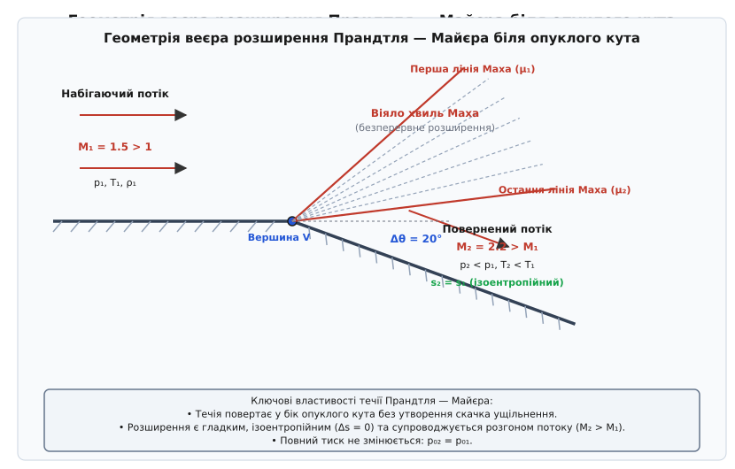
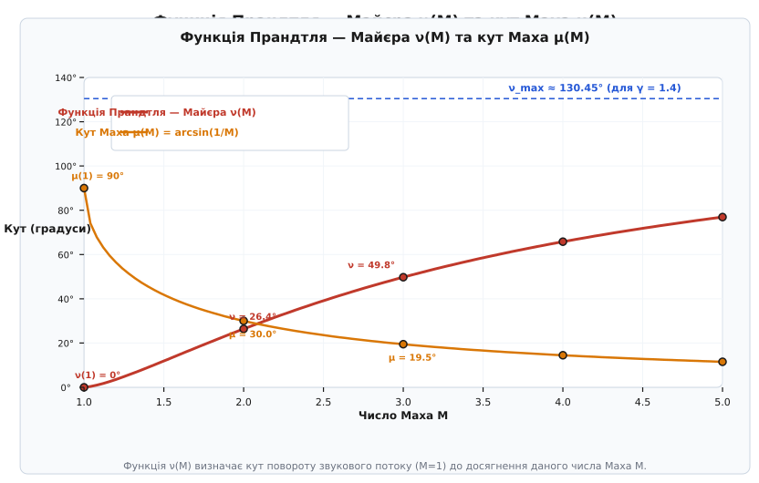
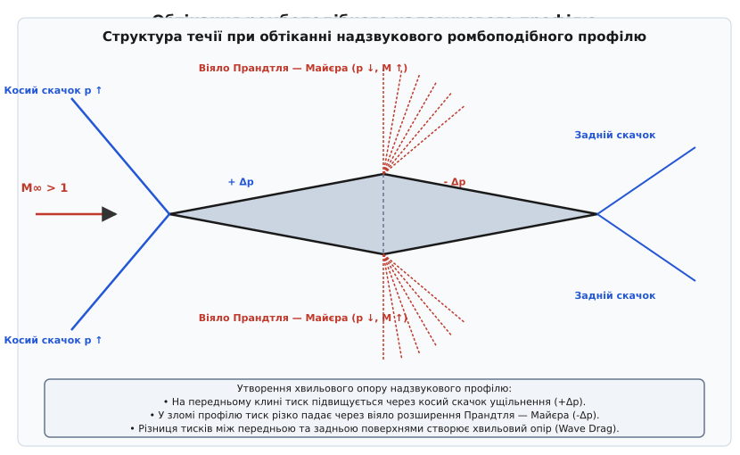

# Течія Прандтля — Майєра

<preknowlist>
- [Число Маха](book:physics/mechanics/mach-number) — відношення швидкості потоку до місцевої швидкості звуку.
- [Динамічний тиск](book:physics/mechanics/dynamic-pressure) — швидкісний напір потоку, пропорційний півдобутку густини на квадрат швидкості.
- [Безнеперервність потоку](book:physics/mechanics/flow-continuity) — закон збереження маси для суцільного середовища у формі рівняння неперервності.
</preknowlist>

Коли суцільне середовище у надзвуковому режимі натрапляє на розширювальну геометрію або повертає вздовж опуклої поверхні — наприклад, при виході з критичного перерізу ракетного сопла, біля злому хорди надзвукового крила чи на кромці рульової поверхні — газ розвертається у бік розширення без утворення ударних хвиль. При повороті середовища убік увігнутого кута молекули газу вимушено гальмуються і згущуються у вузькій зоні, утворюючи косий скачок ущільнення з незворотним зростанням ентропії та втратою повного тиску. Проте при розширенні біля опуклого кута відбувається фундаментально інший процес: потік плавно розганяється до ще вищого числа Маха, а його статичний тиск, температура та густина безперервно спадають. Такий процес центрованого розширення називається **течією Прандтля — Майєра** (на честь німецьких фізиків Людвіґа Прандтля та Теодора Майєра) і описується суворо ізоентропійними співвідношеннями.

У математичному відношенні дозвукові та надзвукові течії належать до фундаментально різних класів диференціальних рівнянь у частинних похідних. Дозвуковий рух описується рівняннями еліптичного типу: акустичний сигнал про наближення перешкоди вільно поширюється у всі боки, включаючи напрямок вгору проти течії, завдяки чому середовище плавно деформується задовго до безпосереднього контакту з тілом. Надзвуковий потік описується рівняннями гіперболічного типу: швидкість переносу речовини перевищує швидкість поширення малих збурень, тому область впливу джерела обмежується конусом Маха. Усередині цього конуса збурення поширюються уздовж математичних ліній характеристик. Течія Прандтля — Майєра являє собою класичний приклад простої хвилі Рімана в надзвуковому потоці, де одна родина характеристик складається із прямих ліній, що радіально виходять з однієї точки.

## 1. Геометрія опуклого кута та центроване віяло хвиль Маха

Головна відмінність між надзвуковим стисненням та надзвуковим розширенням полягає у поведінці фронтів акустичних хвиль збурення. Оскільки в надзвуковому потоці (`M > 1`) швидкість суцільного середовища перевищує місцеву швидкість поширення звукових хвиль, малі акустичні збурення не можуть поширюватися вгору проти течії. Вони локалізуються у вузьких геометричних зонах — конусах Маха, які нахилені до вектора швидкості під кутом Маха `μ`:

```
sin(μ) = 1 / M
```

З геометричного погляду кут Маха виражає прямокутний трикутник, у якому гіпотенузою є вектор швидкості потоку `v`, а катетом — швидкість поширення акустичного збурення `a`. Зі зростанням числа Маха конус Маха стає все більш гострим: при `M = 1` кут `μ = 90°` (плоский фронт перпендикулярний до течії), при `M = 2` кут `μ = 30°`, а при `M = 5` кут падає до `μ = 11.54°`.

У диференціальній геометрії надзвукових течій лінії характеристик розділяють на дві родини: `C_+` та `C_-`. Диференціальні рівняння нахилу характеристик у декартовій системі координат `(x, y)` мають вигляд:

```
(dy / dx)_{C_+} = tan(θ + μ)

(dy / dx)_{C_-} = tan(θ - μ)
```

де `θ` — кут нахилу вектора швидкості відносно осі `x`. Для течії Прандтля — Майєра біля опуклого кута одна з родин характеристик є прямими лініями, які перетинаються в одній точці — вершині кута `V`.

При повороті стінки убік увігнутого кута кожна наступна лінія збурення нахилена під меншим кутом до течії, ніж попередня, оскільки потік за хвилею гальмується (`M₂ < M₁`). Як наслідок, акустичні хвилі стиску перетинаються і фокусуються в єдиний різкий фронт — скачок ущільнення.

Натомість при повороті вздовж опуклого кута виникає протилежна картина. Оскільки потік при розширенні прискорюється (`M₂ > M₁`), кут Маха для кожної наступної хвилі стає все меншим (`μ₂ < μ₁`). Лінії збурень не перетинаються, а розходяться веєром (радіально випромінюються) з єдиної геометричної точки — вершини опуклого кута `V`. Формується **центроване віяло розширення Прандтля — Майєра** (або веєр характеристик Маха).


*Геометрія центрованого веєра розширення Прандтля — Майєра біля опуклого кута. Потік із початковим числом Маха M₁ розганяється до M₂ > M₁ при повороті на кут Δθ.*

Якщо поворот стінки відбувається не у вигляді зламу в одній точці, а через плавну криволінійну ділянку з радіусом кривини `R`, веєр розширення перестає бути центрованим. Лінії характеристик виходять з різних точок вигнутої стінки, утворюючи нецентровану область розширення. Проте на значній відстані від стінки характеристики все одно розходяться, а підсумкові параметри газу за зоною розширення залишаються тотожними розрахунку для центрованого кута з однаковим сумарним кутом повороту `Δθ`.

Структура веєра розширення обмежена двома граничними лініями Маха:

1. **Передній промінь (перша лінія Маха):** Починається у вершині кута `V` і нахилений під кутом `μ₁ = arcsin(1 / M₁)` до напрямку вхідного незбуреного потоку. Це лінія, яка сповіщає потік про початок геометрії повороту. До цієї лінії потік є повністю однорідним і не знає про існування повороту стінки.
2. **Задній промінь (остання лінія Маха):** Нахилений під кутом `μ₂ = arcsin(1 / M₂)` відносно напрямку поверненої стінки (або під кутом `μ₂ - Δθ` відносно початкового напрямку течії). За цією лінією розширення повністю завершується, і потік знову стає однорідним паралельним струменем із числом Маха `M₂`.

Усередині веєра між цими двома променями лежить нескінченна сукупність проміжних ліній Маха. Кожен промінь є лінією сталості газодинамічних параметрів (паралельні характеристики Рімана `C_+ = const` або `C_- = const` залежно від напрямку повороту): уздовж будь-якого фіксованого радіального променя, випущеного з вершини `V`, число Маха, тиск, температура та густина залишаються строго константами. Проходячи через кожен нескінченно малий промінь веєра, напрямок вектора швидкості газу повертає на нескінченно малий кут `dθ`, а модуль швидкості зростає на `dv`. Детальний аналіз першоджерел та умов відкриття цього феномену подано у вставці [Історія відкриття веєра розширення Прандтля — Майєра](book:physics/mechanics/prandtl-meyer-expansion/hist-prandtl-meyer.md).

Кутова ширина веєра розширення `Δα` розраховується з простої тригонометрії:

```
Δα = μ₁ - μ₂ + Δθ
```

Оскільки при зростанні числа Маха кут `μ` зменшується швидше, ніж зростає геометричний кут повороту `Δθ`, веєр завжди має скінченну додатну кутову ширину, забезпечуючи абсолютно плавний переход усіх газодинамічних величин.

З точки зору теорії характеристик, течія Прандтля — Майєра належить до класу самоподібних розв'язків. Якщо ввести полярні координати `(r, φ)` із центром у вершині кута `V`, то газодинамічний стан залежить виключно від полярного кута `φ` і не залежить від відстані `r`. Це означає, що при наближенні до вершини `V` градієнти тиску та швидкості зростають обернено пропорційно до відстані `1/r`, прямуючи до нескінченності в самій точці `V = 0`. Проте інтегральний перепад параметрів через веєр залишається суворо скінченним і визначається виключно повним кутом повороту стінки `Δθ`.

## 2. Фізичний та термодинамічний механізм ізоентропійного розгону

З погляду термодинаміки суцільних середовищ, розширення Прандтля — Майєра являє собою ідеальний адіабатичний зворотний процес. Оскільки у веєрі відсутні скачки ущільнення, ударні хвилі та пристінне в'язке тертя (у рамках теорії неідеального газу пограничний шар розглядається окремо), генерація ентропії дорівнює нулю:

```
Δs = s₂ - s₁ = 0
```

Це означає, що **повний тиск газу (тиск гальмування) `p₀` та повна температура `T₀` залишаються суворо сталими** вздовж усього веєра розширення:

```
p₀₁ = p₀₂ = const
T₀₁ = T₀₂ = const
```


*Зміна відносних термодинамічних параметрів газу (p/p₁, T/T₁, ρ/ρ₁) та числа Маха M залежно від кута повороту потоку θ у веєрі розширення.*

На мікроскопічному молекулярно-кінетичному рівні прискорення надзвукового потоку у веєрі розширення пояснюється перетворенням хаотичної теплової енергії молекул у спрямовану кінетичну енергію макроскопічного руху. Молекули газу, що рухаються у стисненому стані до кута, здійснюють інтенсивне хаотичне теплове бомбардування. Коли геометрія стінки розширюється, виникає додатковий вільний об'єм. Газ розширюється у цей об'єм, виконавши роботу розширення проти сил внутрішнього тиску.

Згідно з першим началом термодинаміки для адіабатичної системи без зовнішнього підведення тепла (`dq = 0`), зміна повної ентальпії дорівнює нулю:

```
dh₀ = dh + v · dv = c_p · dT + v · dv = 0
```

Для ідеального газу зводять поняття критичної швидкості звуку `a*` — швидкості потоку у перерізі, де число Маха `M = 1`. Критична швидкість звуку пов'язана з повною температурою `T₀` виразом:

```
a* = √( (2γ / (γ + 1)) · R · T₀ )
```

Зручним безрозмірним параметром швидкості у газодинаміці є відносна швидкість Лаваля `λ = v / a*`. Зв'язок між числом Маха `M` та параметром Лаваля `λ` задається співвідношенням:

```
λ² = [ ½(γ + 1) · M² ] / [ 1 + ½(γ - 1)·M² ]
```

При розширенні у веєрі Прандтля — Майєра параметр Лаваля `λ` зростає від початкового значення `λ₁ > 1` до вищого значення `λ₂`, прямуючи до своєї теоретичної межі `λ_max = √((γ + 1) / (γ - 1))` (для повітря `λ_max = √6 ≈ 2.449`).

Інтегрування рівняння енергії показує, що зростання кінетичної енергії спрямованого руху `v² / 2` відбувається строго за рахунок зменшення статичної ентальпії `c_p · T`. У результаті виконання цієї роботи розширення:
- Середня квадратна швидкість хаотичного теплового руху молекул падає, що виражається у стрімкому спаді статичної температури `T`.
- Концентрація молекул у одиниці об'єму зменшується через розходження ліній течії, що виражається у спаді статичної густини `ρ`.
- Макроскопічна швидкість спрямованого струменя `v` зростає за рахунок спаду внутрішньої теплової енергії.

Співвідношення між статичними параметрами до розширення (стан 1) та після розширення (стан 2) розраховуються за класичними адіабатичними функціями від відповідних чисел Маха `M₁` та `M₂`:

```
T₂ / T₁ = (1 + ½(γ - 1)·M₁²) / (1 + ½(γ - 1)·M₂²)

p₂ / p₁ = [ (1 + ½(γ - 1)·M₁²) / (1 + ½(γ - 1)·M₂²) ] ^ (γ / (γ - 1))

ρ₂ / ρ₁ = [ (1 + ½(γ - 1)·M₁²) / (1 + ½(γ - 1)·M₂²) ] ^ (1 / (γ - 1))
```

де `γ` — показник адіабати газу (для повітря та двоатомних газів `γ ≈ 1.40`).

З цих рівнянь видно: оскільки `M₂ > M₁`, знаменник виразів є більшим за чисельник, тому відношення `T₂ / T₁ < 1`, `p₂ / p₁ < 1` та `ρ₂ / ρ₁ < 1`. Таким чином, надзвуковий потік у течії Прандтля — Майєра охолоджується, розряджається та падає за тиском, одночасно прискорюючись.

Важливо підкреслити, що це охолодження відбувається без жодного контакту з зовнішнім хладагентом чи рефрижератором. Наприклад, якщо потік повітря з `M₁ = 1.5` та температурою `T₁ = 300 K` (`27 °C`) повертає на кут `Δθ = 20°`, його число Маха зростає до `M₂ = 2.20`, а статична температура падає до `T₂ = 217 K` (`-56 °C`). Статичний тиск при цьому падає більше ніж у 3 рази (`p₂ / p₁ ≈ 0.306`).

## 3. Функція Прандтля — Майєра та кут повороту потоку

Щоб встановити точний математичний зв'язок між кутом повороту стінки `Δθ` та вихідним числом Маха `M₂`, розглянемо нескінченно мале розширення на одній хвилі Маха.

З кінематичного розкладу вектора швидкості випливає диференціальна залежність між кутом повороту потоку `dθ` та відносним приростом сили швидкості `dv / v`:

```
dθ = √(M² - 1) · (dv / v)
```

Зі збереження повної ентальпії та визначення числа Маха `v = M · a` виразимо відносний приріст швидкості `dv / v` через приріст числа Маха `dM`:

```
dv / v = dM / [ M · (1 + ½(γ - 1)·M²) ]
```

Поєднуючи обидва вирази, отримуємо **диференціальне рівняння течії Прандтля — Майєра**:

```
dν = dθ = [ √(M² - 1) / ( M · (1 + ½(γ - 1)·M²) ) ] dM
```

Інтегруючи це диференціальне рівняння від звукового стану (`M = 1`, де за нормування прийнято `ν(1) = 0`) до довільного числа Маха `M`, отримуємо замкнену алгебраїчну функцію, що носить назву **функції Прандтля — Майєра** `ν(M)`:

```
ν(M) = √((γ + 1) / (γ - 1)) · arctan( √((γ - 1) / (γ + 1) · (M² - 1)) ) - arctan( √(M² - 1) )
```

Детальне крокове розгортання та алгебраїчні підстановки при обчисленні цього інтеграла наведено у вставці [Математичний вивід функції Прандтля — Майєра](book:physics/mechanics/prandtl-meyer-expansion/math-prandtl-meyer.md).


*Залежність функції Прандтля — Майєра ν(M) та кута Маха μ(M) від числа Маха M для повітря (γ = 1.40). Покажемо горизонтальну асимптоту ν_max ≈ 130.45°.*

Функція `ν(M)` виражає кут у радіанах (або градусах при множенні на `180 / π`), на який потрібно повернути звуковий потік (`M = 1`), щоб він ізоентропійно прискорився до даного числа Маха `M`.

Співвідношення для скінченного повороту на кут `Δθ` між станом 1 та станом 2 має надзвичайно простий адитивний вигляд:

```
ν(M₂) = ν(M₁) + Δθ
```

Для демонстрації обчислювального алгоритму розглянемо конкретний чисельний приклад. Нехай потік повітря (`γ = 1.40`) має початкове число Маха `M₁ = 2.0` і повертає біля опуклого кута з нахилом `Δθ = 15°`:

1. Знаходимо значення функції для `M₁ = 2.0`:
   ```
   ν(2.0) = √(2.4 / 0.4) · arctan( √((1/6) · 3.0) ) - arctan( √3.0 )
          = √6 · arctan( √0.5 ) - arctan( 1.73205 )
          = √6 · arctan( 0.7071 ) - arctan( 1.73205 )
          = 2.44949 · 0.6155 rad - 1.04720 rad
          = 1.5077 rad - 1.04720 rad = 0.4605 rad ≈ 26.38°
   ```
2. Знаходимо нове значення функції після повороту:
   ```
   ν(M₂) = 26.38° + 15.00° = 41.38°
   ```
3. Розв'язуючи нелінійне рівняння `ν(M₂) = 41.38°`, отримуємо вихідне число Маха `M₂ ≈ 2.60`.
4. За ізоентропійними формулами обчислюємо спад тиску: `p₂ / p₁ ≈ 0.323` (тиск впав на `67.7%`).

### Граничний кут розширення та вихід у вакуум

При прямуванні числа Маха до нескінченності (`M → ∞`) обидва арктангенси у формулі для `ν(M)` прямують до їх верхньої межі `π / 2`. Це визначає існування теоретичної асимптотичної межі — **максимального кута розширення Прандтля — Майєра** `ν_max`:

```
ν_max = (π / 2) · [ √((γ + 1) / (γ - 1)) - 1 ]
```

Для повітря (`γ = 1.40`):

```
ν_max = (π / 2) · [ √(2.4 / 0.4) - 1 ] = (π / 2) · (√6 - 1) ≈ 2.2769 rad ≈ 130.454°
```

**Фізичний зміст `ν_max`:** Якщо стінка повертає на кут `Δθ`, який перевищує запасу кута до межі (`Δθ ≥ ν_max - ν(M₁)`), потік не може розвернутися на такий великий кут, залишаючись притиснутим до стінки. Газ розширюється до абсолютного вакууму (`p₂ → 0`, `T₂ → 0 K`, `M₂ → ∞`), досягаючиграничного кута повороту `ν_max - ν(M₁)`, після чого повністю відривається від геометрії стінки, утворюючи за собою порожнину вакуумного сухого сліду.

## 4. Аеродинамічні застосування: надзвукові профілі та сопла

Течія Прандтля — Майєра є одним із двох фундаментальних цеглин надзвукової аеродинаміки (другою цеглиною є косий скачок ущільнення). Будь-яка складна надзвукова течія довкола літальних апаратів чи всередині двигунів будується із комбінацій цих двох явищ.

### 1. Ромбоподібний та двоопуклий надзвуковий профіль

Прикладом фундаментального застосування є розрахунок обтікання надзвукового ромбоподібного (або двоклинового) профілю крила у безв'язковому надзвуковому потоці (`M_∞ > 1`).


*Структура хвиль та епюра тиску при обтіканні ромбоподібного надзвукового профілю. Косі скачки на передній та задній кромках чергуються з веєрами Прандтля — Майєра у зломі хорди.*

Картина обтікання ромбоподібного профілю будується з трьох послідовних етапів:

1. **Передній клин (передня кромка):** Набігаючий потік `M_∞` натрапляє на гостру передню кромку з кутом клина. Утворюються симетричні косі скачки ущільнення. Тиск газу на передній грані різко зростає: `p_front > p_∞`.
2. **Злом хорди (максимальна товщина):** На вершині ромба поверхня крила зламується донизу на кут `2θ_wedge`. Потік проходить через центровані веєри розширення Прандтля — Майєра. Тиск на задній грані падає до значень, нижчих за атмосферний: `p_rear < p_∞`.
3. **Задня кромка:** Струмені з верхньої та нижньої поверхонь сходяться за задньою кромкою, де за рахунок задніх косих скачків тиск вирівнюється до атмосферного.

Оскільки тиск на передній поверхні `p_front` є високим (діє проти руху), а тиск на задній поверхні `p_rear` є низьким (всмоктує назад), виникає результуюча сила тиску, спрямована проти руху — **хвильовий опір** (англ. *Wave Drag*). 

За теорією Аккерета для лінеаризованого надзвукового потоку коефіцієнт хвильового опору ромбоподібного профілю з відносною товщиною `c = c_max / L` дорівнює:

```
C_{D,w} = (4 / √(M_∞² - 1)) · [ α² + c² ]
```

де `α` — кут атаки крила. З цієї формули видно, що хвильовий опір складається із двох частин: опору від підйомної сили (`α²`) та опору від товщини профілю (`c²`). Використання надтонких профілів із гострими кромками дозволяє мінімізувати хвильовий опір при надзвуковому польоті.

На відміну від дозвукової аеродинаміки, де правило Прандтля — Ґлауерта поправляє коефіцієнти тиску множником `1 / √(1 - M²)` (що зростає при наближенні до `M = 1`), у надзвуковій теорії Аккерета хвильовий опір спадає зі зростанням числа Маха пропорційно `1 / √(M² - 1)`.

Ще одним класичним прикладом надзвукової інтерференції є **двоплан Буземана** (англ. *Busemann Biplane*). Німецький аеродинамік Адольф Буземан запропонував конфігурацію із двох симетричних трикутних профілів, повернутих один до одного внутрішніми плоскими гранями. При розрахунковому числі Маха косі скачки ущільнення, випромінені передніми кромками, відбиваються від протилежних стінок і точно гасяться у зломах геометрії через веєри розширення Прандтля — Майєра. У результаті хвильовий опір двоплану Буземана теоретично дорівнює нулю!

### 2. Розширювальні сопла ракетних двигунів та вихлопні струмені

У соплах Лаваля ракетних та реактивних двигунів газ після проходження звукового критичного перерізу розганяється у розширювальній частині сопла. Якщо геометрія розширювального конуса має зломи або шарнірні відхилення (у соплах із керованим вектором тяги), розгортання потоку відбувається через веєри Прандтля — Майєра.

Крім того, при розрахунку вихідного струменя ракетного двигуна, що працює у режимі неповного розширення (коли тиск на зрізі сопла вищий за атмосферний, `p_exit > p_atm`), газ при виході в атмосферу раптово розширюється. На зрізі сопла виникає коловий веєр Прандтля — Майєра. Відбиваючись від вільної межі струменя як косий скачок ущільнення, а потім знову розширюючись, потік формує характерну періодичну структуру — **хвильові ромби або диск Маха** (англ. *shock diamonds*).

Особливо критичну роль розширення Прандтля — Майєра відіграє при польоті ракет-носіїв у розряджених шарах атмосфери та у відкритому космосі. На висотах понад 40 км тиск навколишнього середовища прямує до нуля (`p_atm → 0`). Вихлопний струмінь двигуна розширюється на кромці сопла під величезними кутами (до `90°–120°`), утворюючи так зване «зворотне віяло розширення» (англ. *plume backflow*). Газові струмені високої температури розвертаються назад і можуть обтікати хвостовий відсік ракети, викликаючи критичний тепловий вплив на бортове обладнання та сонячні батареї супутників.

У надзвукових повітрозабірниках літальних апаратів (наприклад, регульованих конусах чи клинах винищувачів) веєри розширення Прандтля — Майєра використовуються для регулювання витрати повітря та запобігання помпажу двигуна при зміні числа Маха польоту.

> 🔧 **Навіщо це.**
> Точний розрахунок течії Прандтля — Майєра є обов'язковим етапом проектування сопел ракетних двигунів, надзвукових літаків (типу SR-71, Concorde чи сучасних винищувачів) та балістичних ступенів. Нехтування розширенням призводить до помилок в обчисленні тяги сопла до 15–20% та неправильного визначення аеродинамічного фокуса крила, що загрожує втратою стійності та руйнуванням апарата при проходженні звукового бар'єра.

### 3. Аероспайк-сопла (клиноподібні сопла з саморегулюванням)

У перспективних ракетних двигунах із клиноподібним соплом (англ. *Aerospike Nozzle*) замість замкненої дзвоноподібної стінки використовується відкритий центральний клин. Газовий струмінь розширюється уздовж зовнішньої поверхні клина, а зовнішньою межею течії є вільний потік навколишнього повітря.

При зміні висоти польоту тиск атмосферного повітря падає, і веєр розширення Прандтля — Майєра на кромці аероспайка автоматично змінює свій кут відкриття. Це забезпечує так зване «атмосферне саморегулювання» сопла: коефіцієнт розширення автоматично підлаштовується під висоту, усуваючи втрати питомого імпульсу, характерні для традиційних дзвоноподібних сопел на проміжних висотах.

## 5. Чисельне розв'язання оберненої задачі та програмування

Для автоматизованого розрахунку газодинамічних систем виникає потреба знаходження вихідного числа Маха `M₂` за відомими вхідними даними (`M₁` та кут повороту `Δθ`). Це вимагає обчислення оберненої функції Прандтля — Майєра:

```
M₂ = ν⁻¹( ν(M₁) + Δθ )
```

Оскільки аналітичного виразу для `ν⁻¹` не існує, розв'язок шукають чисельно. Найкращі результати дає метод Ньютона — Рафсона з використанням точної аналітичної похідної `dν/dM`:

```
M^{(k+1)} = M^{(k)} - [ ν(M^{(k)}) - ν₂ ] / ( dν/dM |_{M^{(k)}} )
```

де похідна обчислюється як:

```
dν/dM = √(M² - 1) / [ M · (1 + ½(γ - 1)·M²) ]
```

Для створення швидких обчислювальних ядрах (наприклад, у реальному часі в політних контролерах) застосовують раціональну апроксимацію Голла (англ. *Hall's approximation*), яка дає початкове наближення з похибкою менше ніж `0.1%` без ітерацій:

```
M_approx = 1.0 + A · (ν₂)^(2/3) + B · (ν₂)^(4/3) + C · (ν₂)^2
```

де `A`, `B`, `C` — постійні коефіцієнти, що підбираються для конкретного `γ`.

У чисельних методах роззрахунку суцільних середовищ (CFD) при використанні схеми Годунова або розщеплення потоків Рое (англ. *Roe solver*) обчислення розширення Прандтля — Майєра потребує застосування так званої «ентропійної поправки» (англ. *Entropy Fix*). Без цієї поправки чисельна схема може згенерувати нефізичний скачок розрядження (нелінійну ударну хвилю з зменшенням ентропії) замість гладкого веєра розширення Прандтля — Майєра.

Повний алгоритм, вихідний код солвера мовами C та C++, а також верифікаційні тестові патерни наведено у вставці [Чисельний розрахунок течії Прандтля — Майєра мовами C та C++](book:physics/mechanics/prandtl-meyer-expansion/proj-prandtl-meyer.md).

Для інженерів та розробників CFD-систем повна технічна специфікація структур даних, сигнатур функцій, табличних газодинамічних коефіцієнтів та граничних умов зібрана у довіднику [Довідник інтерфейсу розрахунку розширення Прандтля — Майєра](book:physics/mechanics/prandtl-meyer-expansion/api-prandtl-meyer.md).

## 6. Крайові ефекти, неідеальні процеси та межі застосовності теорії

Класична теорія Прандтля — Майєра є точним аналітичним розв'язком рівнянь Ейлера для двовимірного невизначеного стисливого потоку ідеального газу. Проте при застосуванні теорії до реальних физичних об'єктів необхідно враховувати чотири основні фактори обмеження:

### 1. Вплив в'язкого пристінного пограничного шару

На поверхні реального тіла через в'язке тертя формується пограничний шар. При обтіканні гострого опуклого кута пограничний шар витісняє зовнішній потік. Завдяки цьому точкова вершина кута `V` «згладжується» товщиною витіснення пограничного шару `δ*`.

У результаті центроване веєрне віяло, що в теорії виходить із однієї точки, розмивається у просторову область розширення скінченної довжини. Проте загальний кут повороту потоку та підсумкові термодинамічні параметри поза пограничним шаром повністю збігаються з теорією Прандтля — Майєра.

### 2. Ефекти реального газу у гіперзвукових режимах (`M > 5`)

При високих числах Маха (`M > 5..10`) температура газу перед розширенням або у процесі гальмування може досягати тисяч Кельвінів. За таких умов молекули повітря `N₂` та `O₂` зазнають коливального збудження, термохімічної дисоціації та іонізації. Показник адіабати перестає бути константою (`γ ≠ 1.40`), а стає функцією від температури та тиску `γ(T, p)`. Для розрахунку гіперзвукового розширення використовують узагальнені нерівноважні формули Прандтля — Майєра з інтегруванням реального рівняння стану газу.

### 3. Взаємодія веєрів розширення зі скачками ущільнення та вільними межами

У складних 2D/3D течіях веєр Прандтля — Майєра часто перетинається з косими скачками ущільнення або вільними межами струменів. При перетині скачка і веєра виникають цікаві газодинамічні ефекти:
- **Перетин із косим скачком:** Веєр розширення ослаблює скачок ущільнення, вигинаючи його фронт і зменшуючи інтенсивність стрибка тиску.
- **Відбиття від твердої стінки:** Веєр розширення відбивається від плоскої стінки як веєр розширення того ж знака.
- **Відбиття від вільної межі:** Коли веєр розширення досягає вільної межі струменя зі сталою тиском (`p = p_atm`), він відбивається як косий скачок ущільнення протилежного знака (інверсія знака хвилі).

### 4. Порівняльний аналіз: Косий скачок ущільнення vs Віяло Прандтля — Майєра

Для швидкого орієнтування у газодинаміці надзвукових течій нижче наведено порівняльну таблицю двох базових механізмів повороту потоку:

| Характеристика | Косий скачок ущільнення | Віяло Прандтля — Майєра |
| :--- | :--- | :--- |
| **Геометрія повороту** | Увігнутий кут (поворот убік потоку) | Опуклий кут (поворот від потоку) |
| **Зміна числа Маха** | Спадає (`M₂ < M₁`) | Зростає (`M₂ > M₁`) |
| **Зміна статичного тиску** | Зростає (`p₂ > p₁`) | Спадає (`p₂ < p₁`) |
| **Зміна ентропії** | Зростає (`Δs > 0`, незворотний) | Залишається сталою (`Δs = 0`, зворотний) |
| **Повний тиск `p₀`** | Падає (`p₀₂ < p₀₁`, втрати напору) | Зберігається (`p₀₂ = p₀₁`) |
| **Характер фронту** | Вузька стрибкоподібна зона (~1 мкм) | Гладке центроване веєрне віяло |
| **Граничний кут повороту** | `θ_crit` (при перевищенні — відривний скачок) | `ν_max` (при перевищенні — вихід у вакуум) |

Теорія Прандтля — Майєра залишається одним із найелегантніших та найпрактичніших розділів механіки суцільних середовищ, що поєднує строгу математичну красу з фундаментальним практичним значенням для аерокосмічної інженерії.
