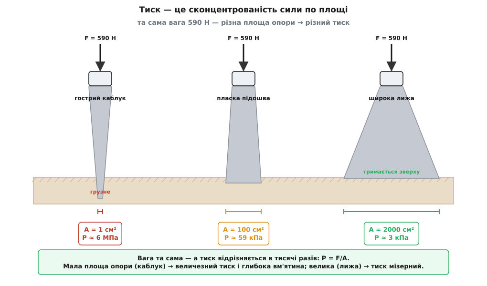
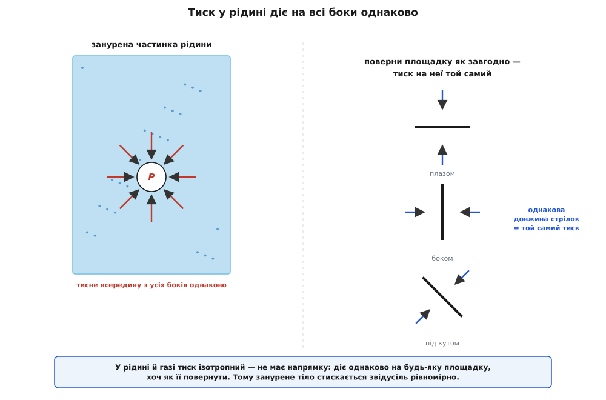
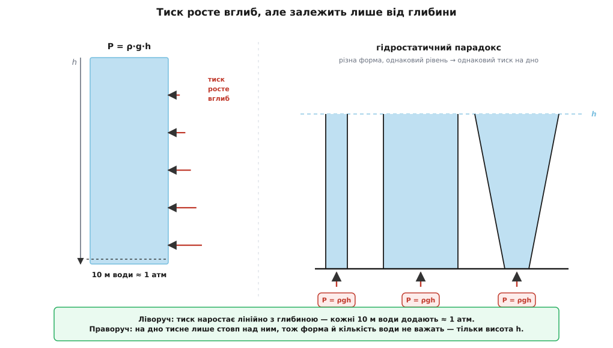
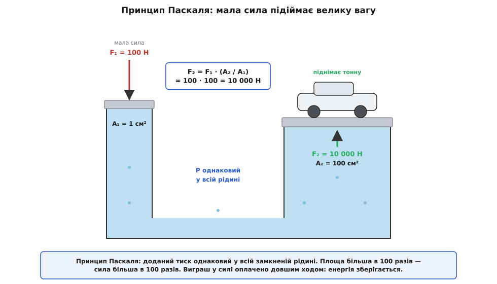

# Тиск

<preknowlist>
- [Сила](topic:physics/force) — що штовхає чи тягне тіло; тиск — це та сама сила, лише розподілена по площі, на яку вона спирається.
- [Густина](topic:physics/density) — маса одиниці об'єму речовини (ρ = m/V); від неї залежить, як швидко наростає тиск углиб рідини.
- [Вільне падіння](topic:physics/free-fall) — біля Землі кожне тіло має вагу m·g (g ≈ 9.8 м/с²); саме вага рідини й тисне на її дно.
</preknowlist>

Гострий ніж ріже, тупий — лише вминає, а тиснете ви на обидва однаково. Жінка на шпильках лишає в паркеті вм'ятини, яких не лишає слон, хоч слон незрівнянно важчий. Верблюд спокійно йде піском, де людина провалюється по кісточку, — бо ступня в нього широка й м'яка. У всіх цих історіях сила та сама або й менша, а наслідок протилежний, і різницю робить одне: **на яку площу ця сила спирається**. Оце «сила, поділена на площу», і є тиск. Розберімо, чому площа так важить, чому в рідині тиск діє на всі боки однаково, чому він росте вглиб і як одна крапля цієї ідеї підіймає автомобіль домкратом.

## Сила, поділена на площу

Означення просте до краю:

```
P = F / A          [Па = Н/м²]
```

Тиск — це сила F, що діє перпендикулярно до поверхні, поділена на площу A цієї поверхні. Одиницю названо на честь Блеза Паскаля: один паскаль (Па) — це один ньютон, розмазаний по квадратному метру. Величина крихітна: аркуш паперу, що лежить на столі, тисне на нього десь так само, близько кількох паскалів. Тому в житті зручніше рахувати кілопаскалями (кПа), а тиск у шинах чи балоні — сотнями кілопаскалів.

Чому важлива саме площа, а не сама лише сила? Бо та сама сила дає геть різний тиск залежно від того, на скільки поверхні вона розтікається. Стисніть площу вдесятеро — і тиск вдесятеро зросте, хоч сила не змінилась ані на ньютон. Саме тому ніж гострять: не щоб тиснути сильніше, а щоб зібрати всю силу на мізерній ширині леза, де тиск стає таким величезним, що розсуває волокна. Той самий закон, лиш навпаки, рятує верблюда, лижника й того, хто лягає на дошку з цвяхами: розкидай ту саму вагу по великій площі — і тиск на кожен клаптик стане безпечно малим.

**Прикинемо: жінка на шпильці проти слона.** Хай жінка важить 60 кг (вага ≈ 590 Н) і в якусь мить спирається на один каблук-шпильку з кінчиком близько 1 см² = 0.0001 м². Слон масою 5 т (вага ≈ 49 000 Н) стоїть на чотирьох ступнях, площа кожної ≈ 0.1 м².

```
шпилька:  P = 590 / 0.0001            = 5 900 000 Па ≈ 6 МПа
слон:     P = (49 000 / 4) / 0.1
            = 12 250 / 0.1             = 122 500 Па ≈ 0.12 МПа
```

**Висновок.** Під кінчиком шпильки тиск виходить у кілька десятків разів більший, ніж під ногою слона, — тому шпилька й продавлює паркет, а слон лише злегка втоплює ступню. Не вага руйнує підлогу, а сконцентрованість ваги по крихітній площі.



*Тиск — це сконцентрованість сили по площі: чим менша площа опори, тим глибша вм'ятина від тієї самої ваги. Розсунь силу по великій площі — і тиск стає безпечно малим.*

> 🔧 **Навіщо це.** Половина інженерних рішень про «щоб не продавило» — це арифметика P = F/A. Фундамент будинку роблять широким не заради краси, а щоб вагу стін розкласти на площу, яку витримає ґрунт. Гусениці трактора, снігоступи, широкі шини всюдихода — усе це спосіб збити тиск на слабку опору. І навпаки: різець, голка, зубило, цвях працюють тим, що заганяють усю силу на вістря, де тиск зростає до руйнівного.

## Чому в рідині тиск діє на всі боки однаково

Досі йшлося про тверду опору, де сила давить в один бік. У рідині й газі відбувається щось на позір дивне: тиск у кожній точці діє **на всі боки однаково**. Занурену на глибині пластинку тисне з однаковою силою, хоч як її поверни — плазом, боком, під кутом. Це не самоочевидно: адже вага тягне тільки вниз, звідки ж тиск угору й убік?

Відповідь — у самій природі рідини. Рідина й газ, на відміну від твердого тіла, **не тримають зсуву**: шар вільно ковзає повз шар, тож речовина не може «впертися» вбік і мусить у спокої тиснути на будь-яку стінку строго перпендикулярно. А для газу є ще й наочна молекулярна причина: тиск створюють незліченні удари молекул, що [в газі](topic:physics/ideal-gas-law) літають навсібіч із величезними швидкостями. Будь-яка площадка — хоч як її постав — ловить однаковий град ударів за секунду, тому й тиск на неї той самий незалежно від орієнтації. Цю однаковість у всіх напрямках звуть ізотропністю (гр. *ísos* — рівний, *trópos* — напрям). Чому тиск у точці однаковий на всі боки, можна довести й строго — з рівноваги крихітного клина рідини; [ось цей доказ разом із виведенням формули тиску вглиб](topic:physics/pressure/math-pressure-scalar.md).

Саме ізотропність пояснює давнє запитання, чому нас не роздавлює атмосфера з її десятьма тоннами на квадратний метр: тиск усередині тіла — у крові, в легенях, у кожній клітині — теж дорівнює зовнішньому, тож вони врівноважуються, і сумарна сила виходить нульова. Небезпечний не сам тиск, а його **різниця**: коли з одного боку поверхні тиск є, а з іншого його прибрали. Тоді й зминається бляшанка з викачаним повітрям, і болить у вусі на зльоті літака.



*У рідині й газі тиск ізотропний — однаковий на всі напрямки. Тому занурене тіло стискається звідусіль рівномірно, а не тільки згори.*

## Глибше — отже, більший тиск

Якщо тиск на дні рідини — це вага всього, що над ним, то, занурюючись, ми додаємо собі на голову дедалі вищий стовп рідини, і тиск має рости. Так і є. Візьмімо стовп рідини заввишки h над якоюсь площадкою. Його вага, поділена на площу, дає той тиск, що він створює:

```
P = ρ · g · h
```

де ρ — [густина рідини](topic:physics/density), g — прискорення вільного падіння. Тиск наростає **лінійно** з глибиною: удвічі глибше — удвічі більший тиск (для нестисливої рідини, як вода, де густина майже не міняється). Це чистий наслідок ваги: кожен доданий метр глибини докладає вагу ще одного метрового шару.

**Приклад: тиск на глибині 10 метрів.** Вода, ρ = 1000 кг/м³, g = 9.81 м/с².

```
P = 1000 · 9.81 · 10
  = 98 100 Па
  ≈ 98 кПа  ≈  1 атм
```

**Висновок.** Кожні 10 метрів води додають приблизно одну атмосферу. Пірнувши на 10 м, ви несете на собі вже подвійний тиск: одну атмосферу повітря згори плюс одну від води. На 20 м — потрійний. Саме тому у водолазів болить у вухах уже на кількох метрах, а глибоководні апарати роблять із товстелезної сталі: на кілометровій глибині тиск сягає сотні атмосфер. Той самий закон — і в газі, тільки там густина падає з висотою, тож [тиск повітря спадає не лінійно, а експонентою](topic:physics/atmospheric-pressure): атмосфера — це просто вага повітряного стовпа над головою.

Тут ховається славетний **гідростатичний парадокс** (гр. *hýdōr* — вода, *statikós* — нерухомий): тиск на дні залежить **лише від глибини**, а не від форми посудини чи кількості рідини. Вузька висока пробірка й широчезна діжка з однаковим рівнем води тиснуть на дно однаково. Уперше це показав 1586 року фламандець Симон Стевін, за шістдесят років до Паскаля. Звучить неможливо — адже в діжці води в тисячу разів більше, — та розгадка проста: у широкій посудині зайву вагу тримають похилі стінки, а не дно. На саме дно завжди давить лиш той стовп, що стоїть просто над ним. [Історію цього парадокса й народження самого поняття тиску в рідині](topic:physics/pressure/hist-pressure.md) — від Стевіна до Паскаля — винесено окремо.



*Тиск на дні задає лише висота стовпа над площадкою. Тому вузька пробірка й широка діжка з однаковим рівнем води тиснуть на дно однаково — це гідростатичний парадокс.*

## Принцип Паскаля: як крапля тиску підіймає авто

З ізотропності випливає ще один далекосяжний факт. Стисніть замкнену рідину в одному місці — і доданий тиск **передається без утрат в усі точки одразу**. Рідина ж нестислива й тримається купи: піддавіть поршнем зверху — весь об'єм миттю відчує ту саму надбавку тиску. Це і є **принцип Паскаля**.

Наслідок здається чарівним, а насправді це проста арифметика. З'єднаймо два циліндри спільною рідиною: під вузьким поршнем площею A₁ і під широким площею A₂. Натиснімо на вузький силою F₁ — під ним виникне тиск P = F₁/A₁. Той самий тиск P установиться й під широким поршнем, а отже, знизу той поршень підіпре сила:

```
P  = F₁ / A₁ = F₂ / A₂
⟹  F₂ = F₁ · (A₂ / A₁)
```

Сила множиться рівно у стільки разів, у скільки більша площа. Це важіль, тільки гідравлічний: замість довгого плеча — широкий поршень.

**Приклад: гідравлічний домкрат.** Вузький поршень A₁ = 1 см² = 0.0001 м², широкий A₂ = 100 см² = 0.01 м² (у 100 разів більший). Тиснемо на вузький силою руки F₁ = 100 Н.

```
тиск у рідині:  P  = 100 / 0.0001 = 1 000 000 Па = 1 МПа
сила на виході: F₂ = 100 · (0.01 / 0.0001)
                   = 100 · 100 = 10 000 Н
```

**Висновок.** Зусиллям руки в 100 Н домкрат видає 10 000 Н — підіймає тонну. Дармового виграшу тут немає: щоб широкий поршень піднявся на сантиметр, вузький доводиться прогнати на цілий метр (стільки ж рідини мусить перетекти). Виграємо в силі — програємо в шляху, як і на будь-якому важелі; енергія зберігається до джоуля. На цьому стоять автомобільні гальма, преси, підйомники, ковші екскаваторів — усюди, де маленьким зусиллям треба керувати великою силою.

Одиницю тиску назвали саме на честь Паскаля, який сформулював цей принцип 1653 року (опубліковано вже посмертно, 1663-го). А сам паскаль як одиницю СІ офіційно ухвалили значно пізніше — 1971 року.



*Принцип Паскаля: доданий тиск однаковий у всій замкненій рідині, тож широкий поршень підпирає велика сила. Виграш у силі дорівнює відношенню площ — а розплата за нього довший хід.*

## Від чого відлічувати: абсолютний тиск, надлишковий і вакуум

Лишається домовитись, від якого нуля міряти. Тут є дві шкали, і плутати їх — типова помилка.

**Абсолютний тиск** відлічують від справжнього нуля — від цілковитої порожнечі, вакууму (лат. *vacuus* — порожній), де тиску немає взагалі. **Надлишковий** (манометричний) тиск відлічують від атмосферного: це те, на скільки тиск перевищує навколишнє повітря. Більшість побутових приладів показують саме надлишковий — бо їм і всередині, і зовні «підкладено» одну атмосферу, і цікавить лише різниця. Манометр (гр. *manós* — розріджений, *métron* — міра) на насосі, тонометр на руці, датчик тиску в шині — усі вони показують надлишок над атмосферою.

```
P_абс = P_атм + P_надл          (P_атм ≈ 101 кПа ≈ 1 бар)
```

Тому в накачаній до «2 бар» шині абсолютний тиск насправді ≈ 3 бар: два надлишкові плюс одна атмосфера, що вже була в порожній шині. А коли надлишковий тиск від'ємний — тобто всередині менше, ніж зовні, — це і є розрідження, «вакуум» у побутовому сенсі: пилосос, вакуумний пакет, присоска на склі тримаються саме тим, що атмосфера ззовні тисне дужче, ніж розріджене повітря всередині.

За величиною той самий тиск ходить під купою імен, і кожне варто впізнавати:

```
1 бар  = 100 000 Па = 100 кПа        (близько до атмосфери — зручно)
1 атм  = 101 325 Па ≈ 1.013 бар      (стандартна атмосфера)
1 psi  ≈ 6 895 Па                    (фунт-сила на дюйм², англомовна техніка)
1 мм рт. ст. = 1 торр ≈ 133.3 Па     (з барометра — тиск міряють висотою стовпа ртуті)
```

Звідки взялися «міліметри ртутного стовпа» й чому саме ртуть — це історія [барометра й атмосферного тиску](topic:physics/atmospheric-pressure), де тиск повітря буквально зважують стовпчиком рідини за тією самою формулою P = ρ·g·h.

> 🔧 **Навіщо це.** Переплутати абсолютний тиск із надлишковим — класична причина зіпсованих розрахунків і аварій. Датчик у смартфоні чи дроні (барометр-висотомір) дає **абсолютний** тиск, бо йому треба справжнє значення для висоти; автомобільний манометр — **надлишковий**. Той самий фізичний стан ці два прилади покажуть числами, що відрізняються рівно на атмосферу. Тому в паспортах і формулах завжди уточнюють, від якого нуля відлік.

## Де тиск виходить за межі спокійної рідини

Усе дотепер — про тиск нерухомої рідини чи газу, ізотропний і породжений вагою або стисненням. Дві важливі речі лежать поряд, і варто позначити межу.

По-перше, у **твердому тілі** сила на одиницю площі поводиться складніше. Тверде тіло, на відміну від рідини, тримає зсув, тож «тиск» у ньому вже не одне число на всі боки, а ціле сімейство напружень: стискання, розтяг і зсув можуть бути різними в різних напрямках. Тиск — це, по суті, лише той окремий, ізотропний випадок, коли з усіх боків тисне однаково. Як тверде тіло відповідає на таке навантаження деформацією, розказує [закон Гука](topic:physics/elastic-deformation).

По-друге, щойно рідина чи газ **рухається**, до звичного (статичного) тиску додається напір потоку — [динамічний тиск ½·ρ·v²](topic:physics/dynamic-pressure). Саме він робить так, що у швидшій частині потоку статичний тиск нижчий, і на цьому тримаються крило літака, трубка Пито й пульверизатор. Усе, про що йшлося тут, — це статична основа, той рівень, на тлі якого граються всі потоки.

А в основі лишається одна коротка думка, з якої випливає решта: тиск — це сила, поділена на площу. Зменши площу — і навіть слабка сила стане різцем; збільш її — і величезна вага стане безпечною. У спокійній рідині ця сила діє на всі боки однаково й наростає вглиб вагою стовпа над головою; замкни ту рідину — і доданий тиск підхопить кожну її точку одразу, підіймаючи домкратом тонну зусиллям руки. Ніж, шпилька, підошва лижі, водолазне вухо, гідравлічний прес і накачана шина — усі вони живуть за тим самим дробом P = F/A.
