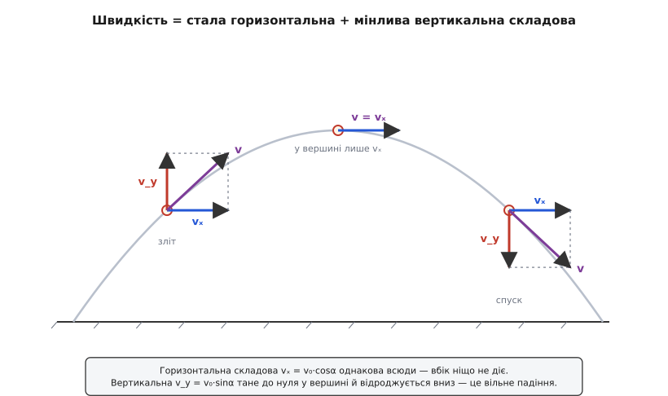
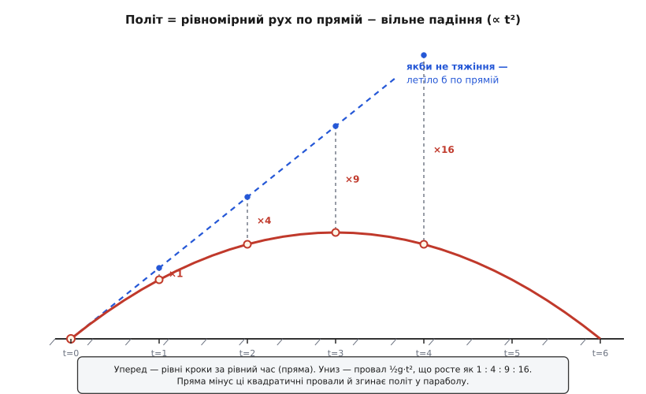
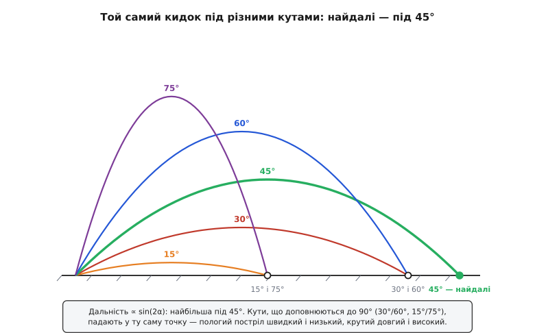

# Рух тіла, кинутого під кутом (балістична траєкторія)

<preknowlist>
- [Швидкість](book:physics/velocity) — вектор: куди й як швидко рухається тіло; горизонтальна й вертикальна частини швидкості живуть окремо.
- [Прискорення](book:physics/acceleration) — швидкість зміни швидкості; у польоті воно стале — це g, спрямоване вниз.
- [Вільне падіння](book:physics/free-fall) — рух під самим тяжінням; уся вертикальна частина польоту — це буквально вільне падіння (v = g·t, h = ½g·t²).
- [Складові вектора](book:math/vector-components) — як розкласти вектор швидкості на горизонтальну (v·cosα) і вертикальну (v·sinα) частини.
- [Другий закон Ньютона](book:physics/newtons-second-law) — сила = маса · прискорення; звідси видно, що в польоті діє лише тяжіння вниз, а вбік — жодної сили.
</preknowlist>

Кинь камінець уперед і трохи вгору — і він не полетить прямо, як стріла, а окреслить у повітрі плавну дугу: спершу підіймається, тоді загинається й падає. Цю дугу бачив кожен, хто жбурляв м'яча чи спостерігав струмінь фонтана, і понад дві тисячі років вона була справжньою загадкою. Арістотель учив, що кинуте тіло летить прямо, поки в ньому «сидить» надана сила, а вичерпавши її — падає прямовисно вниз; дуга в цій картині просто не мала звідки взятися. Гарматярі бачили на власні очі, що ядро летить по кривій, але **чому** саме по такій — не знав ніхто, а від цього залежало, влучиш ти чи промахнешся.

Розгадка виявилася напрочуд простою, і вся вона в одному реченні: **тіло робить одразу два незалежні рухи** — рівномірно котиться вбік і водночас вільно падає вниз. Дуга — не окремий загадковий рух, а всього лиш сума цих двох. Варто це побачити — і вся балістика (гр. *ballein* — кидати) розкладається на дві прості й давно знайомі задачі.

### Дві історії, що діються одночасно

Придивимося, які сили діють на камінь, поки він летить (повітря наразі відкладемо — про нього наприкінці). Щойно він покинув руку, ніщо його вже не штовхає вперед: рука позаду, торкання немає. Отже, **вбік не діє жодна сила**. А коли на тіло не діє сила в якомусь напрямку, воно за інерцією зберігає в цьому напрямку свою швидкість незмінною — камінь котиться вперед рівномірно, покриваючи за рівні проміжки часу рівні відрізки, і так до самого падіння.

Тепер погляньмо вгору-вниз. Тут діє тяжіння — тягне вниз із незмінним прискоренням g ≈ 9.81 м/с². Але це ж дослівно означення [вільного падіння](book:physics/free-fall): рух під самим лише тяжінням. Тобто по вертикалі камінь поводиться **точно як звичайне падіння** — байдуже, що він при цьому ще й мчить кудись убік.

І ось головне, що годі відразу вкласти в голову: ці дві історії не заважають одна одній. Горизонтальний рух нічого не знає про тяжіння, а вертикальне падіння нічого не знає про те, що тіло кудись летить. Найяскравіше це видно в досліді, який любив наводити Ґалілео Ґалілей. Візьми дві однакові кульки. Одну просто відпусти, щоб падала прямовисно. Другу тієї ж миті вистріль горизонтально — хай мчить уперед. Яка впаде на землю перша? **Обидві торкнуться землі одночасно.** Куля, що летить уперед на всю швидкість, знижується рівно так само, як та, що просто падає з місця, — бо вертикально вони роблять те саме вільне падіння, а горизонтальний рух до висоти не має ані найменшого стосунку.

> 🔧 **Навіщо це.** На незалежності рухів стоїть уся стрільба. Гвинтівкову кулю, що летить сотні метрів за секунду, тяжіння знижує рівно з тим самим g, що й монетку, впущену з руки: за першу десяту частку секунди — на кілька міліметрів, за півсекунди — вже помітно. Саме тому приціл доводиться підіймати над лінією до цілі: поки куля долітає, вона встигає «вільно впасти» на цілком передбачувану величину, і цю поправку закладено в кожну прицільну сітку.

### Розклад швидкості: одна стрілка — дві частини

Щоб перетворити цю картину на числа, треба розкласти початкову швидкість на дві частини — вздовж землі й угору. Нехай тіло кинули зі швидкістю v₀ під кутом α до горизонту. Ця швидкість-стрілка є гіпотенузою прямокутного трикутника, а два його катети — то і є [складові](book:math/vector-components): горизонтальна vₓ і вертикальна v_y.

```
vₓ = v₀ · cos α     (уперед — залишається сталою)
v_y = v₀ · sin α     (угору — тане, потім міняє знак)
```

Далі кожна складова живе своїм життям, і ми вже знаємо, яким. Горизонтальна vₓ **не змінюється взагалі** — вбік сил немає, тож скільки було на старті, стільки й лишиться до кінця польоту. Вертикальна v_y поводиться як швидкість підкинутого вгору тіла: тяжіння щосекунди віднімає від неї g, вона меншає, у найвищій точці стає нулем (тіло на мить перестає підійматися), а тоді росте вже вниз. У кожну мить справжня швидкість — це та сама стрілка, складена з незмінного vₓ і мінливого v_y; тому на зльоті вона дивиться круто вгору, у вершині лягає горизонтально (лишається саме vₓ), а на спуску знову круто нахиляється — вже вниз.


*Швидкість у трьох точках польоту. Горизонтальна частина (синя) всюди однакова — вбік ніщо не діє. Вертикальна (червона) велика на зльоті, дорівнює нулю у вершині й відроджується вниз на спуску. Повна швидкість — сума цих двох; тому стрілка круто дивиться вгору на старті, лягає плазом у вершині й круто падає в кінці.*

### Чому саме дуга — і чому це парабола

Тепер видно, звідки береться сама дуга. Запишімо, де опиниться тіло через час t після кидка. По горизонталі воно від рівномірного руху відійшло на `x = vₓ · t` — це проста пряма пропорційність: удвічі більше часу — удвічі далі. По вертикалі маємо підйом за інерцією мінус вільне падіння: `y = v_y · t − ½·g·t²`.

Порівняймо ці два рядки. Горизонтальний відхід росте **рівно з часом**, вертикальний провал падіння — **із квадратом часу**. Саме ця несиметрія й загинає політ. Уяви, що тяжіння вимкнули: тіло полетіло б прямою вздовж своєї початкової швидкості, дедалі вище. Тяжіння ж на кожен момент відтягує його вниз від цієї прямої на `½·g·t²`. За перший крок часу провал крихітний, за другий — учетверо більший, за третій — увдев'ятеро (1 : 4 : 9 : 16, квадрати). Ці дедалі глибші провали й скручують пряму лінію в дугу: спершу відхилення майже непомітне, тому дуга йде полого, а далі падіння бере гору й тягне тіло донизу все крутіше.


*Політ як пряма мінус падіння. Пунктирна пряма — куди полетіло б тіло без тяжіння, рівномірно вздовж початкової швидкості. На кожен рівний крок часу тяжіння відтягує його вниз на ½g·t²: провали ростуть як 1 : 4 : 9 : 16. Пряма мінус ці провали й дає справжню дугу — параболу.*

Якщо з цих двох рівнянь вилучити час (виразити t = x / vₓ з першого й підставити в друге), лишиться чистий зв'язок висоти з віддаллю:

```
y = x · tan α − (g / (2·v₀²·cos²α)) · x²
```

Це рівняння вигляду `y = a·x − b·x²` — а крива, у якої y залежить від квадрата x із мінусом, у математиці зветься **параболою** (гр. *parabolḗ* — прикладання, зіставлення), вигнутою донизу. Отже, тіло, кинуте під кутом, летить по параболі. Це й довів Ґалілей у своїх «Бесідах» 1638 року, і це був переломний висновок: криву польоту, яку доти описували на око чи ламали на прямі й дуги кола, уперше вивели з двох простих рухів. Хто перший здогадався застосувати до гарматного пострілу математику й помітив, що найдальше ядро летить під 45°, і як від Тартальї через Ґалілея до Ньютонового ядра дозрівало це розуміння — [простежено окремо](book:physics/projectile-motion/hist-ballistics.md).

### Три числа, які всі хочуть знати

На практиці від параболи потрібні три величини: скільки тіло протримається в повітрі (час польоту), як високо злетить (висота підйому) і як далеко впаде (дальність). Усі три випливають із двох складових руху. Час польоту над рівним місцем — це просто час, за який вертикальна швидкість устигає піти вгору й повернутися: тіло злітає, поки g гасить v_y, і рівно стільки ж падає назад.

```
Час польоту:     T = 2·v₀·sin α / g
Висота підйому:  H = (v₀·sin α)² / (2·g)
Дальність:       R = vₓ · T = v₀²·sin(2α) / g
```

Виведення цих формул із двох рухів (звідки береться подвоєний кут у дальності й чому висота йде з квадрата sin α) розписане в [окремій математичній вставці](book:physics/projectile-motion/math-projectile-range.md). Тут погляньмо, як вони працюють.

**Приклад (удар по м'ячу).** М'яч б'ють зі швидкістю v₀ = 20 м/с під кутом α = 30° до землі. Скільки він летітиме, як високо злетить і де впаде (повітрям нехтуємо, g = 9.81 м/с²)?

```
vₓ = 20 · cos 30° = 20 · 0.866 = 17.3 м/с
v_y = 20 · sin 30° = 20 · 0.5  = 10.0 м/с

T = 2 · 10.0 / 9.81       = 2.04 с
H = 10.0² / (2 · 9.81)    = 100 / 19.62  = 5.10 м
R = 17.3 · 2.04           = 35.3 м
```

Отже, за дві з невеликим секунди м'яч підіймається на п'ять метрів і лягає за тридцять п'ять. Зверни увагу: маса м'яча в розрахунку **ніде не з'явилася** — важкий і легкий, кинуті однаково, летять однаковою параболою, бо вертикально це вільне падіння, у якому маса скорочується.

### Найдалі — під 45°, а 30° і 60° падають в одну точку

У формулі дальності `R = v₀²·sin(2α)/g` усе, крім кута, при заданому кидку закріплене. Тож дальність тягне за собою один-єдиний множник — sin(2α). Синус найбільший, коли його аргумент дорівнює 90°, тобто коли **2α = 90°, звідки α = 45°**. Ось і вся відповідь на давнє гарматне питання: у порожнечі найдальший постріл — рівно під сорок п'ять градусів. Кинеш поло́гіше — забракне часу в повітрі; крутіше — тіло піде більше вгору, ніж уперед. Сорок п'ять — золота середина між «довго летіти» і «швидко посуватися вбік».

Із тієї ж формули випливає ще одна гарна річ. Синус не розрізняє кутів, що доповнюють один одного до 90°: sin(2·30°) = sin 60°, і sin(2·60°) = sin 120° — а це те саме число. Тому **кидок під 30° і під 60° дає однакову дальність** (як і 15° та 75°, і будь-яка інша пара, що сумується в 90°). Летять вони при цьому зовсім по-різному: під 30° м'яч мчить полого, недовго й швидко (у нашому прикладі — 2.0 с, висота 5 м), а під 60° — злітає високо й довго висить (3.5 с, висота 15 м), — але обидва торкаються землі в тій самій точці за 35 метрів. Гармата з тим самим зарядом б'є на однакову відстань «навісним» і «настильним» пострілом; вибір між ними — це вибір між тим, летіти довго й згори чи швидко й полого.


*Той самий кидок під різними кутами. Найдальша парабола — під 45°. Кути, що доповнюються до 90° (30° і 60°, 15° і 75°), падають у ту саму точку: пологий постріл — низько й швидко, крутий — високо й довго, а дальність однакова.*

> 🔧 **Навіщо це.** Правило 45° і симетрія кутів — щоденний інструмент не лише гарматярів. Струмінь садового фонтана, налаштований під 45°, б'є найдалі; баскетболіст свідомо кидає по крутій, «навісній» дузі (ближче до 60°), бо м'яч тоді входить у кільце майже прямовисно, і йому прощається більша похибка, ніж пологому кидку. У фізиці ігор та сама парабола — це готовий закон польоту гранати, стрибка персонажа чи бризок: рушій щокадру просто додає до вертикальної швидкості порцію g, а горизонтальну лишає незмінною.

### Коли втручається повітря

Усе сказане — про **чисту** параболу, без повітря. Насправді, поки тіло летить, повітря на нього тисне назустріч рухові — це [сила опору](book:physics/aerodynamic-drag), і вона тим більша, чим швидше тіло мчить. Ця сила псує красиву симетрію одразу з двох боків. Горизонтальна швидкість уже **не стала** — опір потроху її гальмує, тож уперед тіло посувається дедалі повільніше. І злітати воно встигає вище, ніж падати круто: висхідна половина, де опір допомагає тяжінню гасити рух, коротша за низхідну. Парабола втрачає дзеркальність — вершина зсувається ближче до кінця, спуск стає крутішим за підйом, а дальність помітно коротшає.

Через це й найвигідніший кут уже не рівно 45°: для реальних м'ячів та снарядів він падає десь до 30–40°, бо тримати тіло довго в повітрі стає надто дорого — опір за цей час з'їдає забагато швидкості. Саме тому далекобійні гармати ніколи не рахували дальність за шкільною формулою, а зводили багатосторінкові стрілецькі таблиці з дослідів. Порахувати таку траєкторію однією формулою не вийде — її доводиться крок за кроком інтегрувати числом; невеликий робочий [код-приклад](book:physics/projectile-motion/proj-trajectory-drag.md), що рахує політ із опором і показує, як парабола кривиться й коротшає, винесено окремо.

### Що лишається

Дуга кинутого тіла — це не окремий загадковий рух, а всього-на-всього дві прості історії, накладені одна на одну: рівномірний біг убік, якому ніщо не заважає, і вільне падіння вниз під сталим g. Вони не помічають одна одної, тому вертикальна частина польоту — це дослівно падіння, а горизонтальна — рівномірний рух, і жодна не залежить від маси. Складіть їх — і рівний рух мінус провал, що росте як квадрат часу, дають параболу. З неї виходять усі потрібні числа: час у повітрі, висота й дальність; найдальше в порожнечі летить кинуте під 45°, а кути, що доповнюються до прямого, б'ють в одну точку. Повітря розмиває цю ідеальну картину — коротшає дальність, кривиться дуга, зсувається найкращий кут, — але серцевина лишається незрушною: летіти по дузі означає падати, не перестаючи рухатися вбік.
