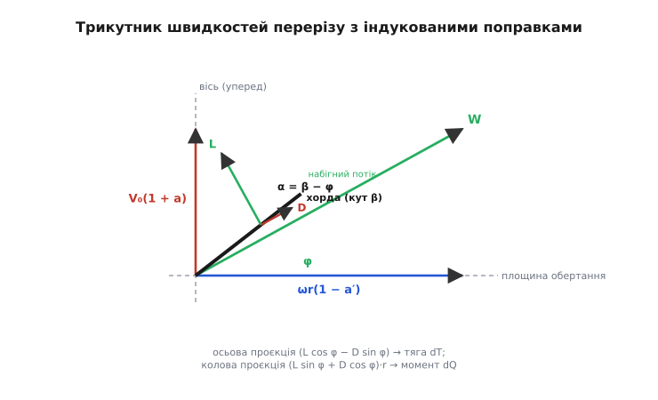
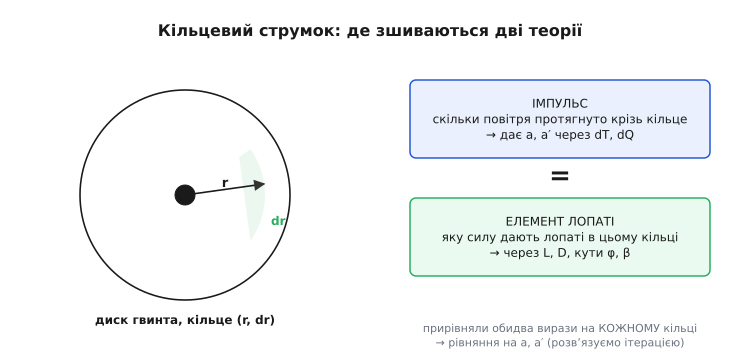

# 🧮 Метод елемента лопаті: як зшити дві теорії гвинта в одні рівняння

> 🧮 Математична вставка. Тягу гвинта можна порахувати двома різними мовами — жбурлянням повітря диском (теорія імпульсу) і роботою кожної смужки лопаті як маленького крила (теорія елемента лопаті). Кожна сама по собі неповна. Тут ми зведемо їх в одні рівняння: візьмемо тонку смужку лопаті, порахуємо силу на ній через піднімальну силу й опір, потім змусимо цю силу узгодитися з тим, скільки повітря продавлює крізь відповідне кільце теорія імпульсу, — і отримаємо метод (BEMT, *blade element momentum theory*), яким гвинти й вітряки рахують донині.

## Означення: сила на одній смужці лопаті

Розріжемо лопать на тонкі кільцеві смужки. Візьмемо одну — на радіусі r від осі, завтовшки dr. Її площа (для однієї лопаті) — це хорда c (ширина профілю на цьому радіусі) на товщину смужки: dS = c·dr. Уся ідея методу в тому, що ця смужка обтікається повітрям **точнісінько як маленьке крило**, і, як будь-яке крило, дає дві сили: піднімальну L поперек набігного потоку й опір D уздовж нього.

Щоб їх записати, потрібні дві речі: з якою швидкістю й під яким кутом повітря набігає на смужку. Швидкість набігання складається з двох рухів смужки. Вона обертається — і мете повітря коловою швидкістю ωr (кутова швидкість ω на радіус). І вона летить уперед разом з апаратом зі швидкістю V₀ вздовж осі. Повітря набігає на смужку по діагоналі цих двох: результівна швидкість W (від *velocity*, у літературі часто позначають саме W або V_rel) — гіпотенуза прямокутного трикутника з катетами V₀ (вздовж осі) і ωr (у площині обертання). Поки що без поправок:

```
W² = V₀² + (ωr)²          (результівна швидкість набігання)
```

Кут, під яким ця результівна набігає до площини обертання, назвемо φ (кут потоку, *inflow angle*):

```
tan φ = V₀ / (ωr)
```

А сама лопать поставлена під кутом установки β до тієї ж площини (це той кут, що задає крок; біля вала великий, на кінці малий — тому лопать і скручена). Крило «відчуває» не свій кут установки й не кут потоку окремо, а **різницю** між ними — це і є кут атаки α, кут між хордою й набігним потоком:

```
α = β − φ
```

Ось де все сходиться. Кут атаки — єдине, що визначає, як сильно смужка «чіпляє» повітря. Через нього крило дає піднімальну силу й опір, і аеродинаміка крила подає їх у безрозмірному вигляді — через коефіцієнти C_L (коефіцієнт піднімальної сили) і C_D (коефіцієнт опору), обидва — відомі функції кута атаки для даного профілю (беруться з продувки або розрахунку профілю). Сила на смужці — це динамічний напір ½ρW², помножений на площу й на відповідний коефіцієнт:

```
dL = ½ · ρ · W² · c · C_L(α) · dr        (піднімальна сила смужки, ⟂ до W)
dD = ½ · ρ · W² · c · C_D(α) · dr        (опір смужки, ∥ до W)
```

> 🔧 **Навіщо це.** Саме тут у розрахунок входить **конкретний профіль лопаті**, а не лише її крок і скрут. Два гвинти з однаковим кроком, але різними профілями перерізів (тонкий швидкісний проти товстого несучого) дадуть різні C_L і C_D за того самого кута атаки — і різну тягу з різним ККД. Тому, підбираючи гвинт під апарат, дивляться не тільки на маркування «діаметр×крок», а й на форму лопаті: гоночні пропелери роблять тонкими й пласкими (малий C_D на високій швидкості), вантажні — ширшими й опуклими (більший C_L, більша статична тяга).

Тепер розкладімо ці дві сили на осі, які нас цікавлять. Тяга — це складова **вздовж осі гвинта** (вперед), гальмівний момент — складова **у площині обертання**, помножена на плече r. Піднімальна сила L перпендикулярна до W, опір D — уздовж W, а сам W нахилений до площини обертання під кутом φ. Проєктування (звичайна тригонометрія цього нахилу) дає внесок смужки в тягу й у момент від **однієї** лопаті:

```
dT = (dL·cos φ − dD·sin φ)              (внесок у тягу, вздовж осі)
dQ = (dL·sin φ + dD·cos φ) · r          (внесок у момент, плече r)
```

Придивімося до знаків — вони кажуть фізику. У тягу піднімальна сила входить з плюсом (dL·cos φ — головний рушій), а опір — з мінусом (dD·sin φ): опір трохи «з'їдає» тягу, бо тягне назад по потоку. У момент навпаки: **обидві** сили входять з плюсом. І піднімальна, і опір гальмують обертання — тому мотор мусить долати їх обидві. Ось звідки береться потрібний на валу момент і чому навіть ідеальний профіль з нульовим C_D усе одно вимагає моменту: складова самої піднімальної сили у площині обертання (dL·sin φ) нікуди не зникає. Крило не буває безкоштовним — за піднімальну силу вперед завжди платиш моментом убік.


*Осьова складова (угору) і колова (управо) складають результівний набігний потік W. Хорда стоїть під кутом установки β, потік набігає під кутом φ, різниця — кут атаки α. Піднімальна сила L перпендикулярна W, опір D — уздовж W. Проєкція (L cos φ − D sin φ) дає тягу dT, проєкція (L sin φ + D cos φ)·r — момент dQ. Осьова й колова складові показані вже з індукованими поправками (1 + a) і (1 − a′) — про них далі.*

Якщо лопатей B, помножимо на B. Здавалося б, лишилося тільки проінтегрувати по радіусу — і маємо тягу й момент усього гвинта. Але тут ховається діра, і вона фундаментальна.

## Інтуїція: чому сама по собі ця теорія не замкнена

Формули для dT і dQ виглядають готовими, та в них закралася прихована неправда. Ми написали W² = V₀² + (ωr)², тобто взяли швидкість набігання так, ніби повітря перед гвинтом стоїть нерухомо й лопать врізається в спокійне середовище з голою швидкістю польоту V₀. Але це не так, і ми це вже знаємо з теорії імпульсу: **гвинт підсмоктує повітря до себе ще до того, як воно дійде до диска**. Тяга народжується з того, що повітря розганяється назад; а за третім законом — якщо позаду диска повітря летить швидше, то й крізь сам диск воно вже йде швидше за незбурений потік. Отже, справжня осьова швидкість крізь смужку — **більша** за V₀.

Це не дрібна поправка, а серце справи. Уся тяга гвинта — це і є прискорення повітря; ігнорувати його при обчисленні швидкості набігання означало б рахувати силу крила в потоці, який сам не помічає, що його розганяє це саме крило. Змія кусає себе за хвіст: щоб знати силу на смужці, треба знати швидкість набігання; а швидкість набігання залежить від того, скільки повітря вже підтягнулося, — тобто від сили, яку смужка ще тільки має створити.

Є й другий, тонший бік. Лопать не лише проштовхує повітря назад — вона ж його **закручує**. Крило, штовхаючи повітря вперед-назад, за третім законом отримує реакцію; а гвинт, обертаючись і діючи на повітря коловою силою (тим самим гальмівним моментом), закручує струмінь у бік свого обертання. Тож у площині обертання повітря вже трохи рухається **вслід** за лопаттю, коли та до нього доходить, — і відносна колова швидкість набігання стає **меншою** за голу ωr.

Обидві поправки вводять двома безрозмірними числами — **коефіцієнтами індукції**:

- **осьовий** a: справжня осьова швидкість крізь диск = V₀·(1 + a). Гвинт підсмоктав повітря — воно йде швидше, тому (1 + a) з плюсом.
- **тангенційний** (закрутки) a′: відносна колова швидкість = ωr·(1 − a′). Струмінь уже підкручений услід лопаті — назустріч їй повітря йде повільніше, тому (1 − a′) з мінусом.

Ці два числа — невідомі задачі. Знайдемо їх — знатимемо справжній трикутник швидкостей, а з нього все інше. Тепер результівна швидкість і кут потоку записуються **з поправками**:

```
осьова складова:     V_ax = V₀·(1 + a)
колова складова:     V_tan = ωr·(1 − a′)
W² = V₀²·(1 + a)² + (ωr)²·(1 − a′)²
tan φ = [V₀·(1 + a)] / [ωr·(1 − a′)]
```

Звідки їх узяти? Сама теорія елемента лопаті їх дати не може — вона знає лише, що робить крило за **заданого** потоку. Другу, незалежну умову на a і a′ дає теорія імпульсу: вона рахує ту саму силу з іншого боку — через кількість руху повітря, яке продавлюється крізь кільце. Прирівнявши обидва погляди на **ту саму силу**, дістанемо рівно два рівняння на два невідомі a і a′. Це і є зшивання.

## Формальний апарат: зшивання через кільцевий струмок

Ключ до з'єднання — розбити диск на тонкі **кільця** (кільцеві струмки, *annulus*) і застосувати теорію імпульсу **окремо до кожного кільця**, а не до диска цілком. Це припущення (кільця не обмінюються повітрям між собою) називають незалежністю кільцевих струмків; воно наближене, але напрочуд точне майже по всій лопаті. Тепер на одному й тому ж кільці радіуса r, товщини dr, у нас два вирази для тієї самої елементарної сили: один — від лопатей (елемент лопаті), другий — від повітря (імпульс). Прирівняємо їх.


*Ліворуч — диск гвинта з виділеним кільцем (r, dr). Праворуч — та сама сила на цьому кільці, порахована двічі: згори через імпульс (скільки повітря протягнуто крізь кільце), знизу через елемент лопаті (яку силу дають лопаті). Прирівнявши обидва вирази на кожному кільці, дістаємо рівняння на a і a′ — розв'язуємо ітерацією.*

**Бік імпульсу — осьова тяга.** Крізь кільце площею dA = 2πr·dr за секунду проходить маса повітря ṁ = ρ·V_ax·dA = ρ·V₀(1 + a)·2πr·dr. Класичний результат теорії імпульсу (той самий, що дає індуковану швидкість на диску вдвічі меншою за швидкість у сліді далеко позаду): приріст осьової швидкості **на диску** — це V₀·a, а **у далекому сліді** — вдвічі більший, 2·V₀·a. Тяга кільця дорівнює масовій витраті на цей повний приріст швидкості:

```
dT = ṁ · Δv_ax = [ρ·V₀(1 + a)·2πr·dr] · (2·V₀·a)
dT = 4π · ρ · V₀² · a · (1 + a) · r · dr
```

**Бік імпульсу — момент через закрутку.** Так само для обертання: гвинт надає повітрю колової швидкості, і момент кільця дорівнює темпу зміни моменту кількості руху. Приріст колової швидкості у сліді — 2·ωr·a′ (аналогічно осьовому), плече — r:

```
dQ = ṁ · Δv_tan · r = [ρ·V₀(1 + a)·2πr·dr] · (2·ωr·a′) · r
dQ = 4π · ρ · V₀ · ω · a′ · (1 + a) · r³ · dr
```

Тепер маємо **дві пари** виразів для dT і dQ: одну від елемента лопаті (через C_L, C_D, φ), другу від імпульсу (через a, a′). Прирівнюємо однойменні. Зручно робити це через безрозмірні коефіцієнти сил, спроєктовані на осі. Уведімо нормальний і тангенційний коефіцієнти навантаження перерізу:

```
C_n = C_L·cos φ − C_D·sin φ        (проєкція на вісь — «тягова»)
C_t = C_L·sin φ + C_D·cos φ        (проєкція на площину — «моментна»)
```

та **місцеву щільність лопаті** (solidity) — яку частку кола на радіусі r займають лопаті:

```
σ = B·c / (2π·r)
```

де B — число лопатей, c — хорда на цьому радіусі. Прирівнявши елемент лопаті до імпульсу на кільці й скоротивши спільні множники (2πr·dr·½ρW² з одного боку проти виразів з іншого), після акуратної алгебри дістаємо два робочі рівняння на коефіцієнти індукції:

```
a  / (1 + a)  = [σ·C_n] / [4·sin²φ]
a′ / (1 − a′) = [σ·C_t] / [4·sin φ·cos φ]
```

Ось воно — зшивання у чистому вигляді. Ліворуч — невідомі індукції (геометрія потоку), праворуч — місцева щільність лопаті σ і коефіцієнти C_n, C_t, які самі залежать від кута атаки α = β − φ, тобто знову від індукцій через φ. Рівняння **неявні**: a і a′ стоять по обидва боки (праворуч сховані всередині φ і коефіцієнтів). Прямо їх не розв'язати — і саме тому метод ітераційний.

> 🔧 **Навіщо це.** Множник σ у правих частинах пояснює, чому **ширина лопаті** (хорда) так само важлива, як її кут. Ширша лопать (більша c → більша σ) сильніше збурює потік у своєму кільці: більше a і a′, повітря більше пригальмоване й закручене. Тому не можна нескінченно нарощувати тягу, просто розширюючи лопаті, — за великої щільності кільця «захлинаються», індукція росте, місцевий кут атаки падає, віддача кожного квадратного сантиметра лопаті меншає. Це кількісна межа того, скільки тяги реально зняти з диска заданого діаметра.

## Ітераційна процедура: як розв'язати замкнене коло

Рівняння неявні, тож розв'язуємо їх **методом простої ітерації** (нерухомої точки): вгадуємо індукції, рахуємо все, що з них випливає, отримуємо нові індукції — і повторюємо, доки вони не перестануть мінятися. Логіка одного кроку — це просто обхід кола залежностей рівно один раз:

1. Взяти поточні a, a′ (спершу — нулі: наче повітря незбурене).
2. З них — кут потоку φ: tan φ = V₀(1 + a) / [ωr(1 − a′)].
3. Кут атаки α = β − φ, а з нього — C_L(α), C_D(α) з таблиці профілю.
4. Проєкції C_n, C_t.
5. Нові a, a′ з двох рівнянь зшивання.
6. Не збіглося з попередніми — на крок 2 з новими a, a′.

Зазвичай вистачає кількох десятків проходів, щоб a, a′ устоялися до потрібної точності. Ось це коло у робочому C — рахунок для **однієї** смужки:

:::tabs
```c
#include <math.h>

// Одна смужка лопаті на радіусі r: ітеративно узгодити елемент лопаті
// з теорією імпульсу й повернути внески в тягу (dT) і момент (dQ).
// V0 — швидкість польоту (м/с); omega — кутова швидкість (рад/с);
// r, dr, c — радіус, товщина смужки, хорда (м); beta — кут установки (рад);
// B — число лопатей; rho — густина повітря.
typedef struct { float dT, dQ; } Element;

// Коефіцієнти профілю як функції кута атаки (спрощена лінійна модель до зриву).
static float cl_of_alpha(float a_rad) {
    float cl = 2.0f * 3.14159265f * a_rad;   // тонке крило: C_L ≈ 2π·α
    if (cl >  1.4f) cl =  1.4f;               // груба межа зриву
    if (cl < -1.4f) cl = -1.4f;
    return cl;
}
static float cd_of_alpha(float a_rad) {
    return 0.02f + 0.05f * a_rad * a_rad;     // паразитний + індукований опір
}

Element blade_element(float V0, float omega, float r, float dr, float c,
                      float beta, int B, float rho) {
    float a = 0.0f, ap = 0.0f;                // початкові індукції
    float phi = 0.0f, W = 0.0f, Cn = 0.0f, Ct = 0.0f;
    float sigma = B * c / (2.0f * 3.14159265f * r);   // місцева щільність лопаті

    for (int it = 0; it < 100; ++it) {
        // 2) кут потоку з поточних індукцій
        float V_ax  = V0 * (1.0f + a);
        float V_tan = omega * r * (1.0f - ap);
        phi = atan2f(V_ax, V_tan);
        W   = sqrtf(V_ax * V_ax + V_tan * V_tan);

        // 3) кут атаки й коефіцієнти профілю
        float alpha = beta - phi;
        float Cl = cl_of_alpha(alpha);
        float Cd = cd_of_alpha(alpha);

        // 4) проєкції на вісь (нормальна) і на площину (тангенційна)
        Cn = Cl * cosf(phi) - Cd * sinf(phi);
        Ct = Cl * sinf(phi) + Cd * cosf(phi);

        // 5) нові індукції з рівнянь зшивання; f = a/(1+a) → a = f/(1−f)
        float s = sinf(phi);
        float f_ax  = sigma * Cn / (4.0f * s * s);
        float f_tan = sigma * Ct / (4.0f * s * cosf(phi));
        float a_new  = f_ax  / (1.0f - f_ax);
        float ap_new = f_tan / (1.0f + f_tan);

        // 6) перевірка збіжності
        if (fabsf(a_new - a) < 1e-5f && fabsf(ap_new - ap) < 1e-5f) {
            a = a_new; ap = ap_new; break;
        }
        a = a_new; ap = ap_new;
    }

    // сили смужки з усталеного трикутника швидкостей
    float q = 0.5f * rho * W * W;             // динамічний напір ½ρW²
    float dL = q * c * cl_of_alpha(beta - phi) * dr;
    float dD = q * c * cd_of_alpha(beta - phi) * dr;

    Element e;
    e.dT = B * (dL * cosf(phi) - dD * sinf(phi));        // тяга смужки (усі лопаті)
    e.dQ = B * (dL * sinf(phi) + dD * cosf(phi)) * r;    // момент смужки
    return e;
}
```
```python
import math

# Коефіцієнти профілю як функції кута атаки (спрощена лінійна модель до зриву).
def cl_of_alpha(a_rad):
    cl = 2.0 * math.pi * a_rad          # тонке крило: C_L ≈ 2π·α
    return max(-1.4, min(1.4, cl))      # груба межа зриву

def cd_of_alpha(a_rad):
    return 0.02 + 0.05 * a_rad * a_rad  # паразитний + індукований опір

# Одна смужка лопаті на радіусі r: ітеративно узгодити елемент лопаті
# з теорією імпульсу й повернути внески в тягу (dT) і момент (dQ).
# V0 — швидкість польоту (м/с); omega — кутова швидкість (рад/с);
# r, dr, c — радіус, товщина смужки, хорда (м); beta — кут установки (рад);
# B — число лопатей; rho — густина повітря.
def blade_element(V0, omega, r, dr, c, beta, B, rho):
    a, ap = 0.0, 0.0                    # початкові індукції
    phi = W = 0.0
    sigma = B * c / (2.0 * math.pi * r) # місцева щільність лопаті

    for _ in range(100):
        # 2) кут потоку з поточних індукцій
        V_ax = V0 * (1.0 + a)
        V_tan = omega * r * (1.0 - ap)
        phi = math.atan2(V_ax, V_tan)
        W = math.hypot(V_ax, V_tan)

        # 3) кут атаки й коефіцієнти профілю
        alpha = beta - phi
        Cl = cl_of_alpha(alpha)
        Cd = cd_of_alpha(alpha)

        # 4) проєкції на вісь (нормальна) і на площину (тангенційна)
        Cn = Cl * math.cos(phi) - Cd * math.sin(phi)
        Ct = Cl * math.sin(phi) + Cd * math.cos(phi)

        # 5) нові індукції з рівнянь зшивання; f = a/(1+a) → a = f/(1−f)
        s = math.sin(phi)
        f_ax = sigma * Cn / (4.0 * s * s)
        f_tan = sigma * Ct / (4.0 * s * math.cos(phi))
        a_new = f_ax / (1.0 - f_ax)
        ap_new = f_tan / (1.0 + f_tan)

        # 6) перевірка збіжності
        if abs(a_new - a) < 1e-5 and abs(ap_new - ap) < 1e-5:
            a, ap = a_new, ap_new
            break
        a, ap = a_new, ap_new

    # сили смужки з усталеного трикутника швидкостей
    q = 0.5 * rho * W * W               # динамічний напір ½ρW²
    dL = q * c * cl_of_alpha(beta - phi) * dr
    dD = q * c * cd_of_alpha(beta - phi) * dr

    dT = B * (dL * math.cos(phi) - dD * math.sin(phi))     # тяга смужки (усі лопаті)
    dQ = B * (dL * math.sin(phi) + dD * math.cos(phi)) * r # момент смужки
    return dT, dQ
```
:::

Кілька практичних застережень, без яких код на реальних гвинтах спотикається. По-перше, біля самого кінця лопаті ітерація може розгойдуватися замість збігатися — тоді нові a, a′ не беруть цілком, а **підмішують** до старих із вагою (релаксація): a ← a + k·(a_new − a), k ≈ 0.3. По-друге, ця проста форма рівнянь «пливе» на кінцях лопаті, де потік стікає з торця (кінцевий вихор): реальні розрахунки множать праву частину на **поправку Прандтля на скінченну кількість лопатей** (tip loss), яка занулює тягу точно на кінці. По-третє, за великих кутів атаки крило **зривається** (C_L перестає рости й падає) — тоді проста теорія імпульсу непридатна й переходять на емпіричні гілки. Але кістяк — оцей цикл узгодження двох теорій на кожному кільці.

## Інтегрування по радіусу й ККД гвинта

Коли для кожної смужки знайдено dT і dQ, тяга й момент усього гвинта — це сума (інтеграл) по радіусу від маточини r_h до кінця R:

```
T = ∫[r_h..R] dT           (повна тяга, Н)
Q = ∫[r_h..R] dQ           (повний момент на валу, Н·м)
```

Чисельно це просто підсумовування внесків смужок — тим точніше, чим дрібніше поділ (30–50 смужок звичайно досить). Момент одразу дає потужність на валу: P = Q·ω (момент на кутову швидкість). А з тяги, потужності й швидкості польоту складається головна величина — **корисна віддача гвинта**, його коефіцієнт корисної дії:

```
η = (корисна потужність) / (витрачена потужність) = (T · V₀) / (Q · ω)
```

Чисельник T·V₀ — корисна потужність (сила тяги на швидкість руху апарата), знаменник Q·ω — механічна потужність, яку мотор віддає на вал. Їхнє відношення й каже, яку частку роботи мотора гвинт перетворив на корисний рух уперед, а не змарнував на розганяння струменя вбік, назад і на опір лопатей.

> 🔧 **Навіщо це.** Формула η = T·V₀/(Q·ω) відразу пояснює, чому **гвинт на місці (висіння) має ККД, рівний нулю**: V₀ = 0, тож корисна потужність T·V₀ = 0, хоча мотор крутить на повну. Це не поломка — це означення: «корисна» тут — робота з переміщення апарата, а той, хто висить, нікуди не рухається. Тому ефективність гвинта на висінні (мультикоптер, вертоліт) міряють **іншою** величиною — коефіцієнтом якості (figure of merit), відношенням ідеальної потужності висіння до реальної. А ККД η має сенс лише в поступальному польоті — і саме його максимізують, підбираючи крок і скрут лопаті під крейсерську швидкість.

Інженери зазвичай працюють з безрозмірними коефіцієнтами, щоб порівнювати гвинти різного розміру й обертів на одному графіку. Тягу й потужність нормують на густину, оберти n (за секунду) і діаметр D:

```
C_T = T / (ρ·n²·D⁴)            (коефіцієнт тяги)
C_P = P / (ρ·n³·D⁵)            (коефіцієнт потужності)
J   = V₀ / (n·D)               (коефіцієнт ходу — «наскільки прудко» гвинт летить за оберт)
```

Через них той самий ККД записується напрочуд компактно, і саме в такому вигляді його подають на паспортних кривих гвинта:

```
η = J · C_T / C_P
```

Уся робота BEMT в підсумку — це побудувати для гвинта криві C_T(J), C_P(J), η(J): пройтися методом по всіх смужках для набору коефіцієнтів ходу J й отримати характеристику, з якої видно і крейсерську точку максимального ККД, і статичну тягу (J = 0), і швидкість, на якій гвинт «розвантажується» до нуля тяги.

**Приклад (одна смужка на 70 % радіуса).** Гвинт діаметром D = 0.25 м (R = 0.125 м), B = 2 лопаті, обертається на 6000 об/хв (ω = 628 рад/с), апарат летить V₀ = 8 м/с. Смужка на r = 0.7·R = 0.0875 м має хорду c = 0.018 м і кут установки β = 22°. Оцінімо перший крок ітерації (з a = a′ = 0), щоб побачити порядок величин.

```c
// Перша ітерація «на пальцях» для смужки r = 0.0875 м (a = a' = 0):
//   V_tan = ω·r          = 628 · 0.0875      ≈ 55.0 м/с
//   V_ax  = V0           = 8 м/с
//   φ = atan2(8, 55.0)                        ≈ 8.3°
//   α = β − φ = 22° − 8.3°                     ≈ 13.7°  (= 0.239 рад)
//   C_L ≈ 2π·α = 6.283 · 0.239                ≈ 1.50 → обрізаємо до 1.4 (зрив)
//   C_D ≈ 0.02 + 0.05·0.239²                  ≈ 0.023
//   σ = B·c/(2π·r) = 2·0.018/(2π·0.0875)      ≈ 0.0655
//   C_n = C_L·cos φ − C_D·sin φ ≈ 1.4·0.990 − 0.023·0.144 ≈ 1.38
//   a/(1+a) = σ·C_n/(4·sin²φ) = 0.0655·1.38/(4·0.0209) ≈ 1.08  →  завелике!
```

Останній рядок показує саму суть: перша ж прикидка дала a/(1 + a) > 1, тобто формально a < 0 — знак, що на цьому радіусі за цих обертів лопать сильно **перевантажена** (кут атаки 13.7° близький до зриву). Ітерація з релаксацією підтягне a, φ підросте, α впаде до розумних кількох градусів — і індукції встояться на фізичних значеннях. Саме через такі «перельоти» на першій ітерації метод і роблять поступовим, з підмішуванням, а не одним махом: рівняння нелінійні, і «в лоб» вони легко вилітають за фізичні межі.

## Де це працює в геометрії гвинта

Метод елемента лопаті — це той місток, що перетворює якісні образи гвинта на числа. Скрут лопаті (падіння кута β від вала до кінця) тут перестає бути «щоб кут атаки лишався добрим» і стає точним завданням: підібрати β(r) так, щоб на крейсерському режимі кут атаки α = β − φ на **кожному** радіусі лягав у вузьке вікно найбільшої аеродинамічної якості (найбільшого відношення C_L/C_D). Ковзання гвинта — недосяжена частина геометричного кроку — тут проступає кількісно як осьова індукція a: саме вона каже, наскільки повітря податилося назад, і саме з неї народжується тяга. А компроміс «крок проти площі», який на пальцях лише називають, метод дозволяє порахувати наскрізь: побудувати криву ККД і знайти ту саму точку, де гвинт віддає максимум.

Крило перерізу дає піднімальну силу й опір за тими самими законами, що й крило літака — [піднімальна сила крила через кут атаки й коефіцієнти C_L, C_D](book:physics/fixed-wing-lift); різниця лише в тому, що тут «підйом» спрямований уперед, уздовж осі. Сили ці, як і всюди в аеродинаміці, ростуть з динамічним напором — [динамічний тиск ½ρv² як міра «натиску» набігного потоку](book:physics/dynamic-pressure) стоїть множником у кожному dL і dD. А момент, що його намолочують усі смужки й що мусить долати мотор, — це та сама реакція обертання, яку [реактивний момент](book:physics/reaction-torque) розкриває з боку апарата: гвинт закручує повітря в один бік, повітря закручує гвинт (і корпус) у протилежний.

Підсумок. Теорія елемента лопаті рахує силу на кожній смужці як на крилі — через кут атаки, хорду й коефіцієнти C_L, C_D — і проєктує піднімальну силу й опір на вісь (тяга dT) і на площину обертання (момент dQ). Сама вона незамкнена: їй потрібна швидкість набігання, а та залежить від того, наскільки повітря вже підтягнулося й закрутилося. Цю швидкість дає теорія імпульсу — через осьовий a і тангенційний a′ коефіцієнти індукції, застосовані до кожного кільцевого струмка окремо. Прирівнявши обидва погляди на силу в кільці, дістаємо два неявні рівняння на a, a′; розв'язуємо їх простою ітерацією; підсумовуємо dT і dQ по радіусу — і маємо тягу, момент, потужність та ККД гвинта. Це і є метод, яким брати Райт уперше порахували свої пропелери, а сучасні програми рахують гвинти дронів і лопаті вітряків.
