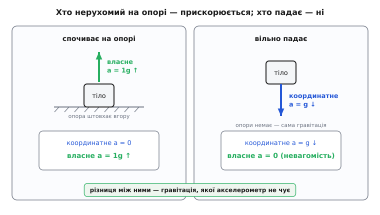
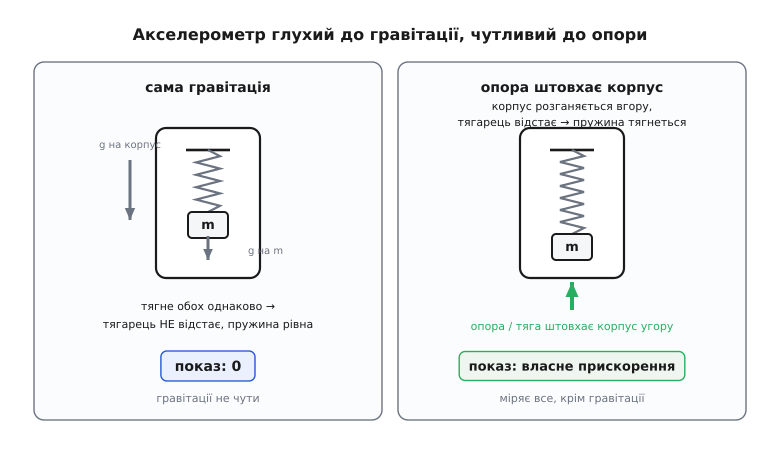
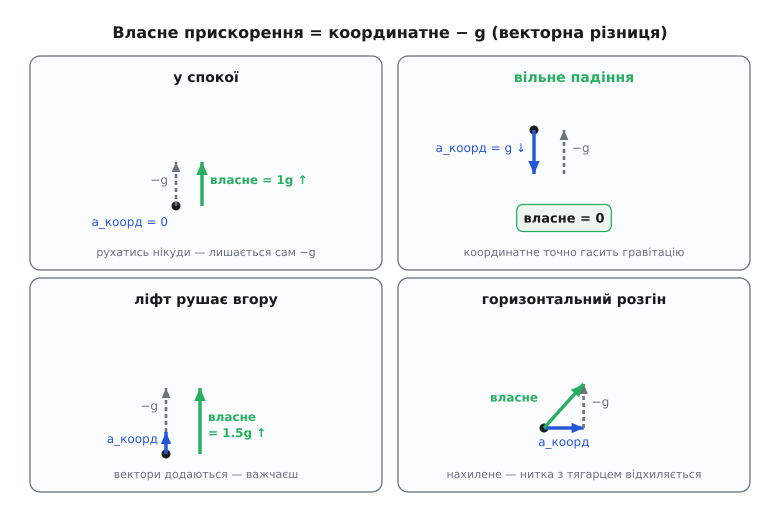

# Власне прискорення: те, що відчуваєш насправді

<preknowlist>
- [Похідна](book:math/derivative) — прискорення це швидкість зміни швидкості (похідна швидкості за часом).
- [Другий закон Ньютона](book:physics/newtons-second-law) — сила, поділена на масу, дає прискорення: a = F/m.
- [Інерціальна система відліку](book:physics/inertial-frame) — система, що сама не прискорюється; координатне прискорення залежить від того, з якої системи дивитись.
- [Вільне падіння](book:physics/free-fall) — рух тіла під дією самої лише гравітації, без опори.
- [Додавання векторів](book:math/vector-addition) — прискорення це вектор; власне прискорення виходить як векторна різниця двох прискорень.
</preknowlist>

Покладіть телефон на стіл. Він лежить нерухомо — швидкість нуль, і вона не міняється. А тепер спитайте акселерометр усередині, яке прискорення він відчуває. Прилад відповість: **9.8 метра за секунду на секунду, напрямлене вгору**. Не нуль. Ціле земне прискорення, ще й угору — хоча телефон нікуди не рухається.

Тепер скиньте той самий телефон зі столу. Поки він летить до підлоги, він явно розганяється — швидкість росте на очах. Спитайте акселерометр ще раз. Тепер він показує **нуль**. Саме тоді, коли телефон прискорюється найочевидніше, прилад каже: прискорення немає.

Щось тут не сходиться — і не сходиться воно тому, що слово «прискорення» насправді означає дві **різні** речі, які ми звикли плутати. Одна з них — та, яку відчуває тіло й міряє прилад — і зветься **власним прискоренням** (англ. *proper acceleration*, від лат. *proprius* — «власний, свій»). Розплутати ці дві речі — і є вся суть.

### Дві різні речі, які звуть прискоренням

Перше прискорення — те, про яке думає більшість. Це швидкість зміни швидкості: наскільки швидко міняється ваша швидкість, поміряна в якійсь вибраній системі відліку. Тіло стоїть на місці — його швидкість нуль і не міняється — отже, це прискорення нуль. Тіло падає, набираючи 9.8 м/с щосекунди, — його прискорення 9.8 м/с² донизу. Назвімо це **координатним прискоренням**: воно каже, як міняються ваші координати з часом. Ключове слово — «в якійсь системі відліку»: та сама подія має різне координатне прискорення залежно від того, звідки дивитись. Для спостерігача на землі падаючий телефон прискорюється; для іншого телефона, що падає поруч, він нерухомий. Координатне прискорення — величина **відносна**.

Друге прискорення — те, яке тіло **відчуває** зсередини, не дивлячись назовні й не питаючи жодної системи відліку. Коли літак розганяється по смузі, вас вдавлює в спинку крісла — це відчуття не залежить від того, хто й звідки на вас дивиться. Коли ліфт рушає вгору, ноги на мить важчають. Коли машина гальмує, вас кидає вперед на пас безпеки. Оце відчуття штовхання — фізична, невідносна річ. Саме його міряє акселерометр, який ви несете з собою. Це і є **власне прискорення**: прискорення, поміряне приладом у власній системі тіла, там, де сам прилад спочиває.

І ось перша несподіванка: ці дві величини **не збігаються**, а часом узагалі показують протилежне. Телефон на столі має нульове координатне прискорення (нікуди не рухається), але ненульове власне (акселерометр каже «1g угору»). Телефон у падінні має велике координатне прискорення (мчить до підлоги), але нульове власне (у польоті він нічого не відчуває — невагомість). Той, хто «не прискорюється» у звичному сенсі, насправді прискорюється по-власному; той, хто прискорюється очевидно, по-власному спокійний. Щоб зрозуміти цю виверненість, треба заглянути всередину акселерометра.


*Ліворуч тіло спочиває на опорі: координатне прискорення нуль (нікуди не рухається), але власне — 1g угору, бо опора його штовхає, і акселерометр це показує. Праворуч тіло вільно падає: координатне прискорення велике (мчить донизу з g), зате власне — нуль, повна невагомість. Хто нерухомий — прискорюється по-власному; хто падає — по-власному спокійний.*

### Чому акселерометр не бачить гравітації

Будь-який акселерометр, по суті, влаштований однаково: усередині є маленька **пробна маса** (тягарець) на пружинці, підвішена в корпусі приладу. Коли корпус прискорюється, тягарець за інерцією відстає, пружинка розтягується чи стискається, і за її деформацією прилад судить, з яким прискоренням його штовхають. Простіше кажучи, акселерометр міряє силу, яку треба прикласти до тягарця, щоб він **не відставав** від корпусу, і ділить її на масу тягарця. Це і є справжнє означення власного прискорення: сила на одиницю маси, потрібна, щоб тримати пробне тіло в русі разом із приладом.

> 🔧 **Навіщо це.** Кожен смартфон, дрон, автомобіль і літак носить у собі саме такий давач [(акселерометр)](book:electronics/accelerometer). Знати, що він міряє не «рух», а «штовхання», — не академічна тонкість: без цього неможливо ані визначити нахил телефона, ані втримати дрон у повітрі. Прилад повідомляє не куди ви рухаєтесь, а що вас штовхає.

Тепер — головне питання: що станеться, коли на прилад діє гравітація? Здавалося б, вона теж має розтягти пружинку. Але ні. Гравітація тягне **і корпус, і тягарець** — обидва, з рівним прискоренням. І тут спрацьовує глибокий факт природи: усі тіла падають під дією гравітації **однаково**, незалежно від маси й речовини. Тягарець і корпус, важкий і легкий, свинець і пір'їна у вакуумі — усі набирають те саме прискорення. А коли гравітація однаково тягне корпус і тягарець, тягарець **не відстає** від корпусу — пружинка лишається недоторканою. Прилад не чує гравітації взагалі: вона нічого в ньому не деформує.

Ця байдужість акселерометра до гравітації — не випадкова технічна вада, а прояв рівності гравітаційної й інертної маси тіла, [принципу еквівалентності](book:physics/equivalence-principle). Гравітація діє на все пропорційно масі, рівно так само, як інерція чинить опір прискоренню пропорційно масі, — тому вони точно скорочуються, і гравітаційне поле стає для приладу «невидимим», нічим не відмінним від вільного плавання в порожнечі.


*Ліворуч: сама гравітація тягне корпус і пробну масу з однаковим прискоренням, тягарець не зміщується відносно корпусу, пружина не деформована — акселерометр показує нуль. Праворуч: опора (стіл, тяга двигуна) штовхає лише корпус, тягарець за інерцією відстає, пружина розтягується — і саме цю силу на одиницю маси прилад показує як власне прискорення. Акселерометр глухий до гравітації й чутливий до всього іншого.*

Звідси випливає точна відповідь: акселерометр міряє **всі сили, крім гравітації**, поділені на масу. Опору столу, тягу двигуна, тиск крісла, натяг троса — усе, що не є гравітацією. А раз так, стає зрозумілою й уся виверненість із телефоном.

### Проста формула

Зведімо це в одне рівняння. Позначмо **a_коорд** — координатне прискорення тіла (як воно рухається з погляду землі), а **g** — вектор гравітаційного прискорення (донизу, величина ≈ 9.8 м/с²). Тоді власне прискорення — це просто їхня різниця:

```
a_власне = a_коорд − g
```

Прискорення тут — вектори, тож віднімання векторне: власне прискорення — це те, що лишиться від руху тіла, коли прибрати внесок самої гравітації. Перевірмо на наших випадках.

**Телефон на столі.** Він нерухомий, тож a_коорд = 0. Гравітація g напрямлена вниз. Різниця:

```
a_власне = 0 − (вниз 9.8) = вгору 9.8 м/с²
```

Вектор власного прискорення дивиться **вгору** — і акселерометр показує 1g угору. Фізично це стіл, що штовхає телефон угору, не даючи йому падати. Цей поштовх опори — єдина негравітаційна сила на телефон, і саме її прилад чує.

**Телефон у вільному падінні.** Тепер він розганяється донизу з тим самим 9.8, тож a_коорд = вниз 9.8. А g теж вниз 9.8. Різниця:

```
a_власне = (вниз 9.8) − (вниз 9.8) = 0
```

Нуль. Опори немає, лишилася тільки гравітація — а її акселерометр не бачить. Тіло у вільному падінні не відчуває нічого: це і є невагомість. Космонавт на орбіті не «втік від гравітації» — навпаки, гравітація тримає його на орбіті; він невагомий тому, що **падає вільно**, а вільне падіння по-власному спокійне.

Уся виверненість тепер прозора. Нерухоме тіло має нульове координатне прискорення, але ненульове власне — бо опора його штовхає. Падаюче тіло має велике координатне, але нульове власне — бо на нього діє сама гравітація, а її не відчути. Дві величини не просто різні — вони часто протилежні, і винна в цьому єдина річ у природі, яку акселерометр не здатний почути: гравітація.


*Власне прискорення (зелене) — це завжди координатне прискорення (синє) мінус гравітація, тобто плюс вектор −g угору (сірий). У спокої лишається сам −g (1g угору); у вільному падінні координатне прискорення точно гасить гравітацію й лишається нуль; у ліфті, що рушає вгору, вектори додаються; при горизонтальному розгоні власне прискорення нахиляється — тому тягарець на нитці в машині, що прискорюється, відхиляється назад.*

### Порахуймо: ліфт

Числа роблять це відчутним. Ви стоїте в ліфті, що рушає **вгору** з координатним прискоренням 2.0 м/с². Що покаже акселерометр у вашій кишені — і наскільки важчою здасться вам власна вага?

**Задача.** a_коорд = 2.0 м/с² угору; g = 9.8 м/с² униз; маса людини m = 70 кг. Знайти власне прискорення й уявну вагу.

```
Візьмімо «вгору» за додатний напрям. Тоді:
   a_коорд = +2.0        (ліфт розганяється вгору)
   g       = −9.8        (гравітація вниз)

a_власне = a_коорд − g
         = (+2.0) − (−9.8)
         = +11.8 м/с²     (угору)

у частках g:  11.8 / 9.8 ≈ 1.20 g

уявна вага = m · a_власне
           = 70 · 11.8
           ≈ 826 Н        (проти 686 Н у спокої)
```

Акселерометр покаже 1.2g, а ваги під ногами — на 20 % більшу вагу. Опора (підлога ліфта) мусить штовхати вас не лише проти гравітації, а ще й угору, щоб надати прискорення, — і цей додатковий поштовх ви відчуваєте як тяжкість. Якби ліфт розганявся вниз із тими самими 2.0 м/с², вийшло б a_власне = −2.0 − (−9.8) = 7.8 м/с² ≈ 0.80g — ви стали б легшими. А якби трос обірвався й ліфт полетів у вільному падінні (a_коорд = −9.8), власне прискорення впало б до нуля: усередині настала б повна невагомість, доки кабіна не вдариться об дно. Те саме число, поміряне ззовні як «падіння», зсередини відчувається як «нічого».

### Звідки назва «власне»

Слово «власне» тут не випадкове й запозичене не з побуту, а з теорії відносності. Там ціла родина величин має прикметник «власний»: **власний час** (англ. *proper time*) — час, який показує годинник, що рухається разом із тілом; **власна довжина** — довжина предмета, поміряна в системі, де він спочиває. Спільна ідея: «власне» означає **поміряне у власній системі тіла**, тій, що в цю саму мить рухається разом із ним і де воно спочиває. Власне прискорення — це прискорення тіла відносно інерціальної системи, яка в дану мить летить поряд із ним із тією самою швидкістю (її звуть миттєво супутньою). Саме таку систему й утілює акселерометр, який тіло несе з собою.

Через це власне прискорення — величина **абсолютна**, не залежна від вибору стороннього спостерігача: усі погоджуються, що показав ваш прилад. Координатне прискорення можна змінити, просто перестрибнувши в іншу систему відліку; власне — ні. Двоє спостерігачів можуть сперечатися, чи ви рухаєтесь і як швидко, але не про те, чи вдавлює вас у крісло.

### Де це працює

Найпряміше застосування чекає в кожному пристрої з давачем руху. Акселерометр, лежачи нерухомо, показує вектор 1g, напрямлений до центра Землі, — тобто **вниз**. Звідси пристрій дізнається, де низ: телефон обертає екран, дрон розуміє, як він нахилений, робот-пилосос знає, чи не перекинувся. Усе це — читання того самого власного прискорення спокою, вектора, що вказує протилежно до гравітації.

Але тут-таки й пастка для інженера. Якщо потрібно не «де низ», а **справжній рух** — координатне прискорення, щоб проінтегрувати його у швидкість і шлях (як у інерціальній навігації дронів і ракет), — доводиться з показу акселерометра **відняти гравітацію**. А щоб відняти правильно, треба спершу знати, як пристрій нахилений, бо вектор 1g в осях приладу залежить від його орієнтації. Це щоденна задача обробки даних інерціального давача; практичний рецепт — як повернути гравітацію в осі корпусу, відняти її й дістати чистий рух, а заразом упіймати вільне падіння за ознакою |a| ≈ 0 — розібрано в [окремому коді](book:physics/proper-acceleration/proj-imu-gravity.md). У навігації цю саму виміряну величину — власне прискорення в осях приладу — традиційно звуть [питомою силою](book:physics/specific-force).

> 🔧 **Навіщо це.** Наївна спроба «проінтегрувати акселерометр, щоб дізнатися, куди летить дрон» без віднімання гравітації дасть уявне прискорення 9.8 м/с² у якийсь бік і за секунди «понесе» апарат на кілометри в розрахунках. Уся інерціальна навігація тримається на тому, що акселерометр міряє власне прискорення, а не рух, — і гравітацію треба прибрати вручну.

Друге застосування — там, де власне прискорення відчувають не прилади, а люди. **Перевантаження** (англ. *g-force*), про яке говорять льотчики й космонавти, — це і є власне прискорення, виражене в частках g. Пілот у крутому віражі з перевантаженням 9g відчуває власне прискорення 9 × 9.8 ≈ 88 м/с²: крісло вдавлює його з дев'ятикратною вагою, і кров відливає від голови. Це саме власне, а не координатне прискорення — важить те, з якою силою його штовхає літак, а не як міняються його координати над землею. І навпаки, невагомість у параболічному польоті літака-лабораторії чи на орбіті — це рукотворне **нульове** власне прискорення: машина веде себе так, щоб усередині лишилася сама гравітація, якої тіло не чує.

### Коли швидкість велика

При звичних швидкостях власне прискорення — це просто «координатне мінус гравітація», і на цьому історія завершується. Але сам термін прийшов із теорії відносності недарма: на швидкостях, близьких до світлової, власне й координатне прискорення розходяться вже й без будь-якої гравітації.

Уявіть зорельот, що вмикає двигун і тримає **сталий відчутний 1g** — команда почувається як удома на Землі, акселерометр незмінно показує 9.8 м/с². Здавалося б, розганяйся так досить довго — і перескочиш швидкість світла. Але ззовні, з погляду землі, координатне прискорення корабля **згасає** в міру наближення до світлової швидкості: власне прискорення лишається сталим, а координатне падає до нуля, тож корабель усе ближче підповзає до світлової межі, ніколи її не сягаючи. Такий рух зі сталим власним прискоренням вимальовує в просторі-часі особливу криву — **гіперболу**, і числа виходять разючі: тримаючи 1g, до найближчої зорі Проксіми Центавра можна дістатися приблизно за 7 років **власного** часу екіпажу. Як власне й координатне прискорення пов'язані на релятивістських швидкостях і звідки береться гіперболічний рух — розгортає [окрема математична сторінка](book:physics/proper-acceleration/math-four-acceleration.md).

### Де інтуїція зраджує

Найгустіша пастка захована в невинному відчутті «я сиджу нерухомо, отже, я не прискорююсь». У координатному сенсі — так. А у власному ви прискорюєтесь **просто зараз**: крісло штовхає вас угору з 1g, безперервно збиваючи з траєкторії, якою ви полетіли б вільно. Тіло, яке справді нічого не прискорює по-власному, — це не те, що спочиває на опорі, а те, що **вільно падає**. Наша щоденна інтуїція вивернута: «нерухомий» стан на поверхні Землі — це стан постійного власного прискорення, а «падіння» — стан спокою.

Гравітація в цій картині — виняток з-поміж усіх сил. Будь-яку іншу силу — тягу, тертя, поштовх, натяг — акселерометр чує, бо вона діє на тіло вибірково й зрушує тягарець відносно корпусу. Гравітацію ж він не чує ніколи, бо вона діє на все однаково. Ви не можете відчути власне падіння — можете відчути лише те, що вам падати заважає: підлогу, крісло, землю під ногами. Ця єдина думка — що вільне падіння невідчутне, а вагу дає не гравітація, а опора, яка стримує падіння, — і була, за словами Айнштайна, найщасливішою в його житті: саме з неї виросла загальна теорія відносності, де гравітація перестає бути силою й стає геометрією [(принцип еквівалентності)](book:physics/equivalence-principle). Власне прискорення — те скромне число з акселерометра — виявляється дверима в найглибшу фізику простору й часу.
