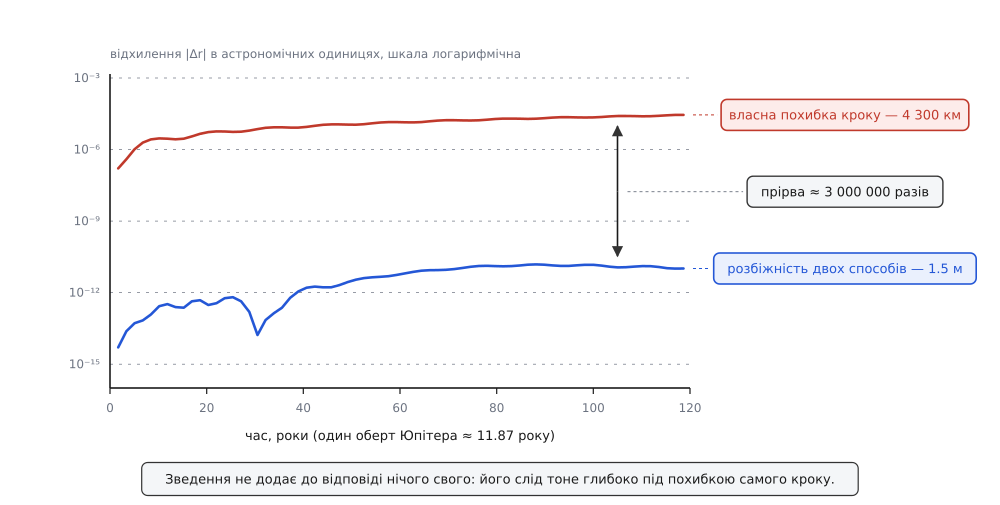

# ⚙️ Дослід: чи справді одна частинка маси μ рухається за двох

Тут два незалежні прогони — чесна пара тіл і одна уявна частинка маси μ = m₁·m₂/(m₁ + m₂) — крокують тим самим методом з тим самим кроком, щоб число сказало: зведення пари до однієї частинки точне чи це вдале наближення, яке колись підведе.

Питання не риторичне. Заміни змінних у фізиці бувають двох ґатунків. Одні точні: перепис тих самих рівнянь іншими літерами, після якого не втрачено нічого. Інші — наближені: щось малим оголошено й викинуто, і воно тихо повертається, коли задача виходить за межі, у яких заміну придумали. На саму формулу μ дивитися тут марно: обидва ґатунки мають однаковий вигляд — компактний запис замість громіздкого. Розрізняє їх тільки дослід.

Дослід улаштовано так, щоб відповідь могла бути «ні». Якщо зведення наближене, розбіжність між двома прогонами росла б із витягнутістю орбіти, залежала б від відношення мас і взагалі поводилась як фізична похибка. Якщо точне — розбіжність не має права перевищувати те, що накопичує сама арифметика подвійної точності, і не повинна залежати ні від мас, ні від форми орбіти.

## Що з чим порівнюємо

Чесний прогін тримає повний стан пари: два положення й дві швидкості, вісім чисел на площині. Він нічого не знає ні про μ, ні про центр мас — тільки дві сили, рівні й протилежні за третім законом Ньютона.

Зведений прогін тримає чотири числа: одне положення r і одну швидкість. Він не знає про друге тіло взагалі. Для нього є частинка маси μ, яку тягне сила F(r), і більше нічого.

Щоб порівняння було чесним, обидва прогони мають стартувати з однієї фізичної ситуації. Задаємо початкові r і v (як тіла розташовані одне щодо одного й як швидко зближуються), окремо задаємо, де й куди пливе [центр мас](book:physics/center-of-mass) — та зважена точка, якої внутрішні сили не зрушують, — і розкладаємо це на два тіла:

```
M  = m₁ + m₂
r₁ = R + (m₂/M)·r        v₁ = V + (m₂/M)·v
r₂ = R − (m₁/M)·r        v₂ = V − (m₁/M)·v
```

Далі щокроку дивимося на три числа. Перше: наскільки різняться r₁ − r₂ чесного прогону і r зведеного. Друге: чи вдається відновити справжнє тіло з уявної частинки — беремо r зі зведеного прогону, додаємо рух центра мас (він відомий наперед формулою, інтегрувати його нема потреби) і порівнюємо зі справжнім r₁. Третє: наскільки поїхала повна енергія — це міра похибки самого інтегратора, і вона потрібна, щоб було з чим порівнювати перші два.

## Чому крок Верле нічого не псує

Обидва прогони веде швидкісний Верле — той самий метод, той самий крок h. Це не дрібниця, а серце задуму: якби прогони йшли різними методами чи різними кроками, ми міряли б різницю між методами, а не між фізичними описами. Про сімейство таких кроків — [числові методи розв'язку ОДУ](book:algorithms/numerical-ode): диференціальне рівняння не розв'язують формулою, а дрібно рухають стан уперед, і кожен крок додає свою похибку.

Верле обрано не з примхи. Він [симплектичний](book:algorithms/symplectic-integrators) — крок зберігає об'єм у просторі станів, і через це похибка в енергії не наростає без упину, а гойдається біля нуля зі сталим розмахом. Завдяки цьому розмах по енергії можна брати за чесний вимірювач похибки методу навіть на сотнях тисяч кроків.

Крок Верле такий: півштовхи швидкості, зсув положення, перерахунок сил, ще півштовх. Випишімо його для пари й віднімімо одне рівняння від одного:

```
півштовх:   v₁ += (h/2)·(+F/m₁)        v₂ += (h/2)·(−F/m₂)
різниця:    (v₁−v₂) += (h/2)·F·(1/m₁ + 1/m₂) = (h/2)·F/μ

зсув:       r₁ += h·v₁                 r₂ += h·v₂
різниця:    (r₁−r₂) += h·(v₁−v₂)
```

Праворуч у різницях — точнісінько крок Верле для однієї частинки маси μ. Нові r₁ − r₂ і v₁ − v₂ пари дорівнюють новим r і v зведеної задачі, тож наступний крок побачить ту саму силу — і так до кінця прогону. Крок і зведення переставні.

Причина глибша за конкретний метод. Перехід «два тіла → відстань між ними» — лінійне відображення стану, а поле швидкостей зведеної задачі є точним образом повного поля під цим відображенням. Будь-який метод, що будує новий стан лінійними комбінаціями обчислених прискорень, — Ейлер, Верле, Рунге — Кутта, — переставний із таким переходом. Тому передбачення досліду не розпливчасте «мало», а різке: розбіжність має дорівнювати рівню округлень і нічому більше.

## Код

Один і той самий дослід двома мовами. Python — щоб задум читався з першого погляду; C++ — щоб ті самі мільйони кроків відпрацювали за секунди.

:::tabs
```py
# -*- coding: utf-8 -*-
# Чи справді одна уявна частинка маси μ рухається за двох?
# Два прогони тим самим методом з тим самим кроком — і порівняння.
import math

# 2D-вектор тут — комплексне число: різниця, множення на скаляр і abs() уже є.

class Pair:
    """Чесна пара: два тіла, дві сили, третій закон Ньютона.
       g — стороннє однорідне поле, однакове для обох тіл."""
    def __init__(self, m1, m2, r1, r2, v1, v2, force, g=0j):
        self.m1, self.m2, self.force, self.g = m1, m2, force, g
        self.r1, self.r2, self.v1, self.v2 = r1, r2, v1, v2
        self._accel()

    def _accel(self):
        F = self.force(self.r1 - self.r2)      # сила на тіло 1 з боку тіла 2
        self.a1 = F / self.m1 + self.g
        self.a2 = -F / self.m2 + self.g        # третій закон: рівно й назустріч

    def step(self, h):                         # швидкісний Верле
        self.v1 += 0.5 * h * self.a1
        self.v2 += 0.5 * h * self.a2
        self.r1 += h * self.v1
        self.r2 += h * self.v2
        self._accel()
        self.v1 += 0.5 * h * self.a1
        self.v2 += 0.5 * h * self.a2

    @property
    def r(self):
        return self.r1 - self.r2


class Reduced:
    """Зведена задача: одна уявна частинка маси mu у точці r.
       Про друге тіло, про центр мас і про стороннє поле не знає нічого."""
    def __init__(self, mu, r, v, force):
        self.mu, self.force, self.r, self.v = mu, force, r, v
        self.a = force(r) / mu

    def step(self, h):
        self.v += 0.5 * h * self.a
        self.r += h * self.v
        self.a = self.force(self.r) / self.mu
        self.v += 0.5 * h * self.a


def compare(name, m1, m2, r0, v0, force, energy, h, steps,
            unit="", R0=0j, V0=0j, g=0j, exact=None):
    M = m1 + m2
    mu = m1 * m2 / M
    pair = Pair(m1, m2,
                R0 + (m2 / M) * r0, R0 - (m1 / M) * r0,     # r₁ = R + (m₂/M)·r
                V0 + (m2 / M) * v0, V0 - (m1 / M) * v0,     # r₂ = R − (m₁/M)·r
                force, g)
    red = Reduced(mu, r0, v0, force)

    E0 = 0.5 * mu * abs(v0) ** 2 + energy(abs(r0))
    mark = max(1, steps // 4)
    scale = abs(r0)
    d_rel = d_body = d_E = d_exact = 0.0
    growth = []
    for n in range(1, steps + 1):
        pair.step(h)
        red.step(h)
        t = n * h
        d_rel = max(d_rel, abs(pair.r - red.r))
        # відновлення справжнього тіла 1: зведений розв'язок + рух центра мас
        Rt = R0 + V0 * t + 0.5 * g * t * t
        d_body = max(d_body, abs((Rt + (m2 / M) * red.r) - pair.r1))
        E = 0.5 * mu * abs(red.v) ** 2 + energy(abs(red.r))
        d_E = max(d_E, abs(E - E0))
        scale = max(scale, abs(red.r))
        if exact:
            d_exact = max(d_exact, abs(red.r - exact(t)))
        if n % mark == 0:
            growth.append("%.3g→%.1e" % (t, d_rel))

    print("[%s]  h=%g, кроків=%d, μ=%.6g" % (name, h, steps, mu))
    print("  розбіжність двох способів  max|Δr| = %.3e %s  (%.1e від масштабу)"
          % (d_rel, unit, d_rel / scale))
    print("  відновлене тіло 1 проти чесного    = %.3e %s" % (d_body, unit))
    print("  власна похибка Верле (розмах по енергії) = %.2e відносних" % abs(d_E / E0))
    if exact:
        print("  зведений прогін проти точного ω = √(k/μ) = %.3e %s" % (d_exact, unit))
    print("  як росте |Δr|:  " + "   ".join(growth))
    print()


# ── 1. Сонце + Юпітер: AU, рік, маса Сонця; G = 4π² ─────────────────────────
G = 4 * math.pi ** 2
mS, mJ = 1.0, 9.5479e-4                 # M☉/M♃ = 1047.35
a, e = 5.2038, 0.0489                   # велика піввісь і ексцентриситет Юпітера
kepler = lambda r: -G * mS * mJ * r / abs(r) ** 3
kepler_U = lambda d: -G * mS * mJ / d
T = 2 * math.pi * math.sqrt(a ** 3 / (G * (mS + mJ)))
r0 = complex(a * (1 + e), 0)            # старт в афелії
v0 = complex(0, math.sqrt(G * (mS + mJ) / a * (1 - e) / (1 + e)))
print("період з формули = %.4f року (таблиця: 11.862)\n" % T)

compare("Кеплер: Сонце + Юпітер, 10 обертів", mJ, mS, r0, v0, kepler, kepler_U,
        1e-3, int(10 * T / 1e-3), unit="AU",
        R0=complex(0.3, -0.7), V0=complex(0.11, 0.05))

compare("Те саме + стороннє однорідне поле (лише в чесному прогоні)",
        mJ, mS, r0, v0, kepler, kepler_U, 1e-3, int(10 * T / 1e-3), unit="AU",
        R0=complex(0.3, -0.7), V0=complex(0.11, 0.05), g=complex(0.02, -0.01))

# ── 2. Два вантажі на пружині: СІ ───────────────────────────────────────────
m1, m2, k, L, A = 0.4, 1.1, 30.0, 0.25, 0.05
w = math.sqrt(k / (m1 * m2 / (m1 + m2)))
spring = lambda r: -k * (abs(r) - L) * r / abs(r)
spring_U = lambda d: 0.5 * k * (d - L) ** 2
compare("Пружина: проти точного ω = √(k/μ), 20 періодів", m1, m2,
        complex(L + A, 0), 0j, spring, spring_U, 1e-5, int(20 * 2 * math.pi / w / 1e-5),
        unit="м", R0=complex(0, 0.1), V0=complex(1.5, 0),
        exact=lambda t: complex(L + A * math.cos(w * t), 0))

# ── 3. Витягнута орбіта: той самий крок уже нікуди не годиться ──────────────
for h in (1e-3, 1e-5):
    e2 = 0.95
    compare("Кеплер e=0.95, 3 оберти, h=%g" % h, mJ, mS,
            complex(a * (1 + e2), 0),
            complex(0, math.sqrt(G * (mS + mJ) / a * (1 - e2) / (1 + e2))),
            kepler, kepler_U, h, int(3 * T / h), unit="AU")
```
```cpp
// two_body_vs_reduced.cpp
// g++ -O2 -std=c++17 two_body_vs_reduced.cpp -o twobody
#include <algorithm>
#include <cmath>
#include <complex>
#include <cstdio>

using Vec    = std::complex<double>;   // 2D-вектор: різниця й множення на скаляр уже є
using Force  = Vec (*)(Vec);
using Energy = double (*)(double);
using Exact  = Vec (*)(double);

struct Pair {                          // чесна пара: два тіла, дві сили
    double m1, m2;
    Vec r1, r2, v1, v2, a1, a2, g;
    Force force;

    Pair(double m1_, double m2_, Vec r1_, Vec r2_, Vec v1_, Vec v2_, Force f, Vec g_ = {})
        : m1(m1_), m2(m2_), r1(r1_), r2(r2_), v1(v1_), v2(v2_), g(g_), force(f) { accel(); }

    void accel() {
        const Vec F = force(r1 - r2);          // сила на тіло 1 з боку тіла 2
        a1 =  F / m1 + g;
        a2 = -F / m2 + g;                      // третій закон: рівно й назустріч
    }
    void step(double h) {                      // швидкісний Верле
        v1 += 0.5 * h * a1;   v2 += 0.5 * h * a2;
        r1 += h * v1;         r2 += h * v2;
        accel();
        v1 += 0.5 * h * a1;   v2 += 0.5 * h * a2;
    }
    Vec r() const { return r1 - r2; }
};

struct Reduced {                       // одна уявна частинка маси mu у точці r
    double mu;
    Vec r, v, a;
    Force force;

    Reduced(double mu_, Vec r_, Vec v_, Force f)
        : mu(mu_), r(r_), v(v_), force(f) { a = force(r) / mu; }

    void step(double h) {
        v += 0.5 * h * a;
        r += h * v;
        a = force(r) / mu;
        v += 0.5 * h * a;
    }
};

void compare(const char* name, double m1, double m2, Vec r0, Vec v0,
             Force force, Energy energy, double h, long steps, const char* unit,
             Vec R0 = {}, Vec V0 = {}, Vec g = {}, Exact exact = nullptr)
{
    const double M = m1 + m2, mu = m1 * m2 / M;
    Pair pair(m1, m2,
              R0 + (m2 / M) * r0, R0 - (m1 / M) * r0,      // r₁ = R + (m₂/M)·r
              V0 + (m2 / M) * v0, V0 - (m1 / M) * v0,      // r₂ = R − (m₁/M)·r
              force, g);
    Reduced red(mu, r0, v0, force);

    const double E0 = 0.5 * mu * std::norm(v0) + energy(std::abs(r0));
    const long mark = std::max(1L, steps / 4);
    double scale = std::abs(r0), dRel = 0, dBody = 0, dE = 0, dExact = 0;
    double gt[4] = {}, gd[4] = {};
    int gn = 0;

    for (long n = 1; n <= steps; ++n) {
        pair.step(h);
        red.step(h);
        const double t = n * h;
        dRel = std::max(dRel, std::abs(pair.r() - red.r));
        // відновлення справжнього тіла 1: зведений розв'язок + рух центра мас
        const Vec Rt = R0 + V0 * t + 0.5 * g * (t * t);
        dBody = std::max(dBody, std::abs(Rt + (m2 / M) * red.r - pair.r1));
        const double E = 0.5 * mu * std::norm(red.v) + energy(std::abs(red.r));
        dE = std::max(dE, std::fabs(E - E0));
        scale = std::max(scale, std::abs(red.r));
        if (exact) dExact = std::max(dExact, std::abs(red.r - exact(t)));
        if (n % mark == 0 && gn < 4) { gt[gn] = t; gd[gn] = dRel; ++gn; }
    }

    std::printf("[%s]  h=%g, кроків=%ld, μ=%.6g\n", name, h, steps, mu);
    std::printf("  розбіжність двох способів  max|Δr| = %.3e %s  (%.1e від масштабу)\n",
                dRel, unit, dRel / scale);
    std::printf("  відновлене тіло 1 проти чесного    = %.3e %s\n", dBody, unit);
    std::printf("  власна похибка Верле (розмах по енергії) = %.2e відносних\n", std::fabs(dE / E0));
    if (exact)
        std::printf("  зведений прогін проти точного ω = √(k/μ) = %.3e %s\n", dExact, unit);
    std::printf("  як росте |Δr|: ");
    for (int i = 0; i < gn; ++i) std::printf("  %.3g→%.1e", gt[i], gd[i]);
    std::printf("\n\n");
}

constexpr double PI = 3.14159265358979323846;

// ── 1. Сонце + Юпітер: AU, рік, маса Сонця; G = 4π² ─────────────────────────
constexpr double G  = 4.0 * PI * PI;
constexpr double mS = 1.0, mJ = 9.5479e-4;      // M☉/M♃ = 1047.35
constexpr double aJ = 5.2038, eJ = 0.0489;      // велика піввісь і ексцентриситет

Vec kepler(Vec r) {
    const double d = std::abs(r);
    return (-G * mS * mJ / (d * d * d)) * r;
}
double kepler_U(double d) { return -G * mS * mJ / d; }

// ── 2. Два вантажі на пружині: СІ ───────────────────────────────────────────
constexpr double m1s = 0.4, m2s = 1.1, kSpr = 30.0, L0 = 0.25, A0 = 0.05;
const double wSpr = std::sqrt(kSpr * (m1s + m2s) / (m1s * m2s));   // ω = √(k/μ)

Vec spring(Vec r) {
    const double d = std::abs(r);
    return (-kSpr * (d - L0) / d) * r;
}
double spring_U(double d) { return 0.5 * kSpr * (d - L0) * (d - L0); }
Vec spring_exact(double t) { return Vec(L0 + A0 * std::cos(wSpr * t), 0.0); }

int main() {
    const double T = 2 * PI * std::sqrt(aJ * aJ * aJ / (G * (mS + mJ)));
    std::printf("період з формули = %.4f року (таблиця: 11.862)\n\n", T);

    const Vec  r0(aJ * (1 + eJ), 0.0);          // старт в афелії
    const Vec  v0(0.0, std::sqrt(G * (mS + mJ) / aJ * (1 - eJ) / (1 + eJ)));
    const double h = 1e-3;
    const long   N = static_cast<long>(10 * T / h);

    compare("Кеплер: Сонце + Юпітер, 10 обертів", mJ, mS, r0, v0, kepler, kepler_U,
            h, N, "AU", Vec(0.3, -0.7), Vec(0.11, 0.05));
    compare("Те саме + стороннє однорідне поле (лише в чесному прогоні)", mJ, mS, r0, v0,
            kepler, kepler_U, h, N, "AU", Vec(0.3, -0.7), Vec(0.11, 0.05), Vec(0.02, -0.01));

    compare("Пружина: проти точного ω = √(k/μ), 20 періодів", m1s, m2s,
            Vec(L0 + A0, 0.0), Vec(), spring, spring_U,
            1e-5, static_cast<long>(20 * 2 * PI / wSpr / 1e-5), "м",
            Vec(0.0, 0.1), Vec(1.5, 0.0), Vec(), spring_exact);

    // ── 3. Витягнута орбіта: той самий крок уже нікуди не годиться ──────────
    for (double hh : {1e-3, 1e-5}) {
        const double e2 = 0.95;
        char name[96];
        std::snprintf(name, sizeof name, "Кеплер e=0.95, 3 оберти, h=%g", hh);
        compare(name, mJ, mS, Vec(aJ * (1 + e2), 0.0),
                Vec(0.0, std::sqrt(G * (mS + mJ) / aJ * (1 - e2) / (1 + e2))),
                kepler, kepler_U, hh, static_cast<long>(3 * T / hh), "AU");
    }
    return 0;
}
```
:::

Кілька дрібниць у коді варті слова. Двовимірний вектор тут — комплексне число: різниця, множення на скаляр і довжина є в обох мовах готові, а головне — усі дії над ним лінійні, тобто рівно ті, у яких і живе доказ переставності. Сила подана окремою функцією від r, тож ані `Pair`, ані `Reduced` не знають, тяжіння це чи пружина. Одиниці в першій сцені астрономічні: відстань в астрономічних одиницях (а. о.), час у роках, маса в масах Сонця — тоді стала тяжіння дорівнює 4π², а числа тримаються близько до одиниці й не з'їдають розрядів даремно. Жорсткість пружини k у другій сцені — звичайний коефіцієнт [закону Гука](book:physics/hookes-law): сила, з якою пружина тягне назад, пропорційна видовженню.

## Що надрукувалось

```
період з формули = 11.8652 року (таблиця: 11.862)

[Кеплер: Сонце + Юпітер, 10 обертів]  h=0.001, кроків=118651, μ=0.000953879
  розбіжність двох способів  max|Δr| = 1.531e-11 AU  (2.8e-12 від масштабу)
  відновлене тіло 1 проти чесного    = 1.550e-11 AU
  власна похибка Верле (розмах по енергії) = 1.39e-08 відносних
  як росте |Δr|:  29.7→6.5e-13   59.3→5.5e-12   89→1.5e-11   119→1.5e-11

[Те саме + стороннє однорідне поле (лише в чесному прогоні)]  h=0.001, кроків=118651
  розбіжність двох способів  max|Δr| = 2.017e-11 AU  (3.7e-12 від масштабу)
  відновлене тіло 1 проти чесного    = 2.033e-11 AU
  власна похибка Верле (розмах по енергії) = 1.39e-08 відносних
  як росте |Δr|:  29.7→5.6e-12   59.3→1.2e-11   89→2.0e-11   119→2.0e-11

[Пружина: проти точного ω = √(k/μ), 20 періодів]  h=1e-05, кроків=1242595, μ=0.293333
  розбіжність двох способів  max|Δr| = 5.986e-13 м  (2.0e-12 від масштабу)
  відновлене тіло 1 проти чесного    = 6.821e-13 м
  власна похибка Верле (розмах по енергії) = 2.56e-09 відносних
  зведений прогін проти точного ω = √(k/μ) = 2.644e-09 м
  як росте |Δr|:  3.11→5.6e-14   6.21→1.8e-13   9.32→4.2e-13   12.4→6.0e-13

[Кеплер e=0.95, 3 оберти, h=0.001]  h=0.001, кроків=35595, μ=0.000953879
  розбіжність двох способів  max|Δr| = 1.575e-12 AU  (1.6e-13 від масштабу)
  відновлене тіло 1 проти чесного    = 1.574e-12 AU
  власна похибка Верле (розмах по енергії) = 1.08e-02 відносних
  як росте |Δr|:  8.9→2.9e-13   17.8→2.9e-13   26.7→2.9e-13   35.6→1.6e-12

[Кеплер e=0.95, 3 оберти, h=1e-05]  h=1e-05, кроків=3559548, μ=0.000953879
  розбіжність двох способів  max|Δr| = 2.105e-10 AU  (2.1e-11 від масштабу)
  відновлене тіло 1 проти чесного    = 2.103e-10 AU
  власна похибка Верле (розмах по енергії) = 1.08e-06 відносних
  як росте |Δr|:  8.9→4.0e-12   17.8→6.1e-11   26.7→6.1e-11   35.6→2.1e-10
```

## Читаємо числа

Перший рядок першої сцени варто перевести в людські одиниці. За десять обертів Юпітера — сто вісімнадцять років модельного часу — два описи розійшлися на 1.53·10⁻¹¹ астрономічної одиниці. Це 2.3 метра. Найбільша відстань між тілами за цей час — 5.46 а. о., тобто 816 мільйонів кілометрів. Два метри на вісімсот мільйонів кілометрів.

Чи справді це округлення, а не якась крихітна фізика? Відповідь дає порівняння з тим, скільки арифметика взагалі здатна накопичити. Число з рухомою комою подвійної точності тримає близько шістнадцяти значущих цифр, і кожна дія округлює результат до найближчого доступного — детальніше про це в [числах з рухомою комою](book:programming/floating-point):

```
ε = 2.22·10⁻¹⁶       машинний епсилон подвійної точності
N = 118651           кроків за десять обертів

√N · ε = 7.6·10⁻¹⁴   якби похибки складалися випадково, наче блукання
N  · ε = 2.6·10⁻¹¹   якби всі до одної складалися в один бік
виміряно: 2.8·10⁻¹²  рівно між цими двома межами
```

Виміряна розбіжність лежить усередині вилки, у якій може бути лише накопичене округлення. Нічого іншого там немає й немає де взятися.

Тепер про запас чутливості — бо дослід, який не вміє провалитися, нічого й не доводить. Уявімо, що хтось замість μ підставив у зведений прогін масу самого Юпітера. Різниця між ними — 0.095 %; звучить як дрібниця. Але вона ввійшла б у період обертання, а зсув періоду накопичується оберт за обертом:

```
підміна μ → m♃ міняє множник у прискоренні зведеної частинки:
G·m☉·m♃/μ = G·(m☉ + m♃)  →  G·m☉        зсув на m♃/(m☉+m♃) = 9.54·10⁻⁴
ΔT/T = ½ · 9.54·10⁻⁴ = 4.77·10⁻⁴          період зсувається вдвічі слабше
за 10 обертів зсув уздовж орбіти ≈ 10 · 4.77·10⁻⁴ · 2π · 5.2 а. о.
                                 ≈ 0.156 а. о. ≈ 23 000 000 км
```

Двадцять три мільйони кілометрів проти шумової підлоги у два метри — дослід має десять порядків запасу, щоб спіймати підміну μ. Він мовчить не тому, що сліпий.

Другий рядок кожної сцени — про відновлення. Зведена частинка дає лише відстань між тілами; справжнє положення Юпітера з неї витягують, додавши рух центра мас, який навіть інтегрувати не треба, бо він рівномірний (а в другій сцені, під стороннім полем, — параболічний). Відновлене тіло збігається зі справжнім із тією самою точністю в 1.55·10⁻¹¹ а. о. Отже, зведення не просто дає правильну відстань — з нього повністю складається назад уся картина руху пари.

Третя сцена закриває дірку, яку два перші рядки лишають відкритою. Два прогони могли б помилятися однаково — тоді вони збігалися б, будучи обидва хибними. Пружина рятує тим, що має точний розв'язок у формулі: два вантажі, з'єднані пружиною, коливаються з частотою ω = √(k/μ), тож відстань між ними має мінятися як L + A·cos(ωt). Зведений прогін тримається цієї формули з точністю 2.6·10⁻⁹ метра за двадцять періодів. Це вже не самозгода двох програм, а звірка з відповіддю, порахованою на папері.

Наскільки такий тест прискіпливий, видно з того, що дала б інша маса:

```
μ = 0.4·1.1/1.5 = 0.29333 кг   →  ω = √(30/0.29333) = 10.113 рад/с
якби взяли m₁ = 0.4 кг         →  ω = √(30/0.4)     =  8.660 рад/с

за 20 періодів (t = 12.426 с) різниця фаз:
(10.113 − 8.660) · 12.426 = 18.05 рад ≈ 2.87 оберту
```

Помилкова маса відстала б майже на три повні коливання — тут не сховатися.

Друга сцена перевіряє окрему обіцянку. До обох тіл чесного прогону додано стороннє однорідне поле, і сила ця чимала. Зведений прогін про неї не знає взагалі — у його рівнянні немає жодного члена з g. І все одно відстань між тілами він відтворює з точністю 2·10⁻¹¹ а. о. Причина проста: однорідне поле дає обом тілам однакове прискорення, тож у різниці a₁ − a₂ воно гаситься начисто. Усе стороннє поле дістається центру мас — той із рівномірного пливу переходить у параболу, а внутрішнє життя пари його не помічає.

## Скільки коштує похибка самого методу

Найцікавіше в цих числах — не вони самі, а те, з чим їх порівняти. Візьмімо той самий кеплерів прогін і подивімося, наскільки він взагалі влучає: порівняймо його з таким самим прогоном удесятеро дрібнішим кроком.


*Верхня крива — наскільки хибний сам крок інтегрування; нижня — наскільки різняться між собою два описи. Між ними більш як шість порядків.*

Наприкінці досліду власна похибка кроку сягає 2.8·10⁻⁵ а. о. — понад чотири тисячі кілометрів. Розбіжність двох способів у ту саму мить — півтора метра. Метод бреше в три мільйони разів гучніше, ніж різняться між собою два фізичні описи пари. Перехід до зведеної маси не додає до відповіді нічого свого: його слід тоне глибоко під похибкою будь-якого методу, яким цю відповідь взагалі можна порахувати.

## Пастки

**Різні кроки — різні відповіді.** Спокуса пустити чесний прогін дрібним кроком, а зведений — грубим (він же дешевший) псує дослід повністю: розбіжність тоді буде на рівні 10⁻⁵ а. о., і винен буде крок, а не зведення. Однакові метод і крок — умова, без якої міряти нема чого.

**Збіг двох програм не означає правильності.** Сцена з витягнутою орбітою показує це прямо: при e = 0.95 і кроці 10⁻³ два прогони збігаються до 1.6·10⁻¹², а енергія тим часом поїхала на цілий відсоток. Обидва прогони помилялися однаково — бо помилка сидить у кроці, спільному для них. Біля перицентра, де тіла проносяться найшвидше, такий крок вкладає в поворот на один радіан заледве півтора десятка кроків — Верле там просто не встигає за рухом. Ловить це не взаємне порівняння, а звірка з точним розв'язком або зі згасанням похибки при подрібненні кроку.

**Дрібніший крок — більша розбіжність.** Порівняйте два останні прогони. Крок зменшено в сто разів: розмах похибки в енергії впав у десять тисяч разів — рівно як h², чого й чекають від методу другого порядку. А розбіжність двох способів при цьому виросла з 1.6·10⁻¹² до 2.1·10⁻¹⁰, бо кроків стало в сто разів більше й округлень накопичилося відповідно. Дві похибки їдуть у протилежні боки, тож існує крок, дрібніше за який рахувати вже не варто.

**Що справді ламає зведення.** Однорідне стороннє поле безпечне — це щойно перевірено. Небезпечне поле, яке різне в різних точках: тоді a₁ − a₂ дістає доданок g(r₁) − g(r₂), який не гаситься, і рівняння для відстані перестає бути замкненим. Це і є припливна сила. Так само ламає справу третє тіло й тертя об нерухоме середовище: сила тертя залежить від швидкості кожного тіла окремо, тож у різниці лишаються v₁ і v₂ нарізно, а не тільки їхня різниця. А от в'язкий демпфер між самими тілами зведенню не заважає — він підкоряється третьому закону й залежить лише від відносної швидкості, тобто рівно від тих величин, у яких зведена задача записана.

**Крок Верле треба брати цілим.** Півштовх, зсув, півштовх — це не три окремі дії, які можна тасувати. Якщо в чесному прогоні перерахувати сили не між зсувом і другим півштовхом, а деінде, метод перестане бути тим самим методом — і різниця з'явиться там, де її фізично немає.

## Скільки це коштує

Обидва прогони йдуть за час, пропорційний кількості кроків, і не тримають у пам'яті нічого, крім поточного стану: жодна траєкторія не накопичується, порівняння робиться на льоту. За крок кожен прогін рахує силу рівно один раз, тож у витратах вони в однакових умовах.

Різниця в арифметиці помірна. Пара оновлює чотири вектори (два положення, дві швидкості) і робить два ділення на маси; зведена частинка оновлює два вектори й ділить один раз. Виходить приблизно вдвічі менше дій на крок, але обчислення самої сили — з квадратним коренем і діленням на куб відстані — зазвичай коштує більше за все інше разом, тож справжній виграш у швидкості скромний.

Виграє зведення не в тактах. Задача про одне тіло в центральному полі має збережений момент імпульсу, зводиться до одного рівняння на відстань і має розв'язок у формулі — конічний переріз. Дві сплетені задачі не мають нічого з цього. Число, яке ми щойно дістали, каже, що по цей бік переходу нічого не загублено: за перехід платять рівно нуль.
