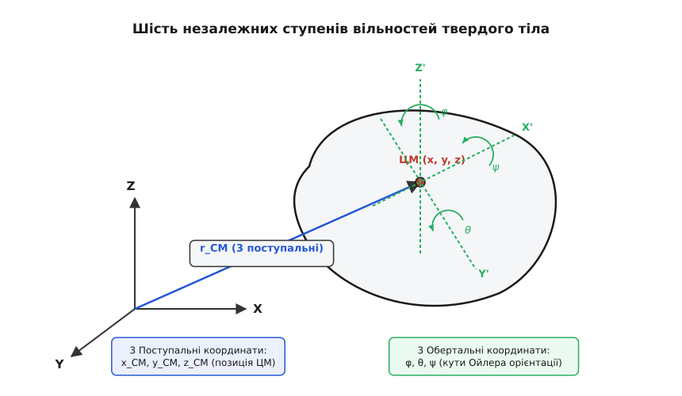
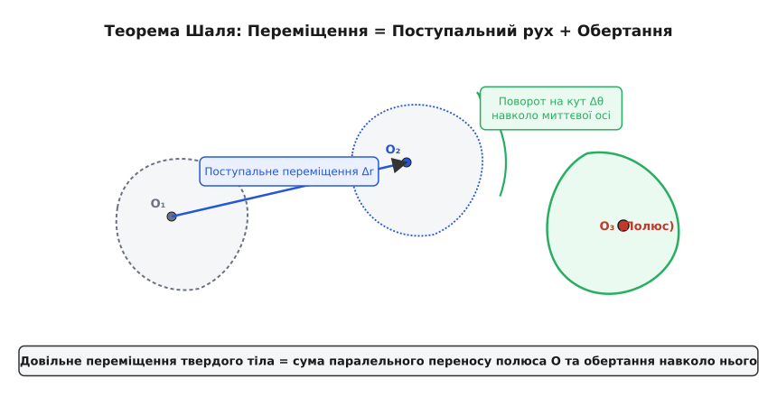
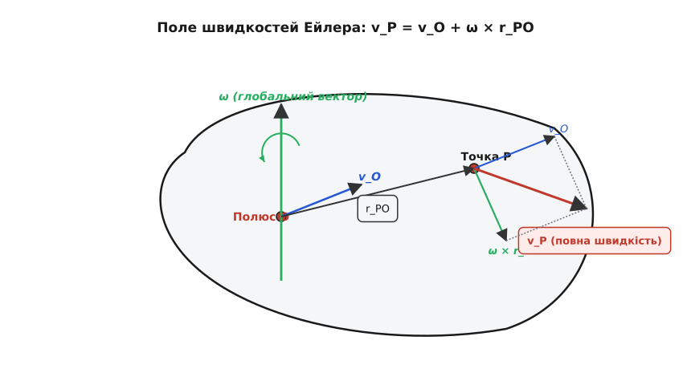
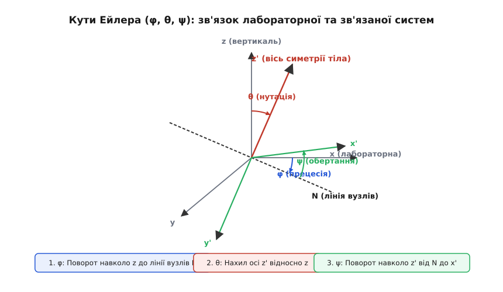
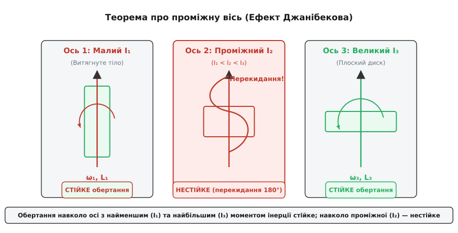

# Абсолютно тверде тіло: від шести ступенів вільностей до динаміки Ейлера

<preknowlist>
- [Центр мас](book:physics/center-of-mass) — точка, яка рухається так, ніби в ній зосереджена вся маса тіла під дією суми зовнішніх сил.
- [Момент сили](book:physics/torque) — обертальний аналог сили, що змінює вектор кутового моменту тіла.
- [Момент інерції](book:physics/moment-of-inertia) — міра інертності тіла при обертанні навколо осі, що залежить від розподілу маси у просторі.
- [Ступені вільності](book:physics/degrees-of-freedom) — кількість незалежних координат, необхідних для однозначного опису стану системи.
- [Кутова швидкість і прискорення](book:physics/angular-velocity) — вектори, що характеризують швидкість та прискорення зміни орієнтації тіла.
</preknowlist>

31 січня 1958 року Сполучені Штати Америки успішно запустили у космос свій перший штучний супутник Землі *Explorer 1*. Космічний апарат мав витягнуту циліндричну форму, схожу на олівець, і перед відокремленням від останнього ступеня ракети-носія його розкрутили з високою швидкістю навколо поздовжньої осі симетрії. За розрахунками інженерів, опертими на стандартну модель точкових мас та закони збереження, супутник мав стабільно тримати свою орієнтацію в просторі протягом багатьох місяців. Проте вже через кілька годин орбітального руху телеметричні дані викликали шок у Центрі керування польотами: супутник самочинно втратив стійкість, почав розгойдуватися, перекинувся «через голову» і перейшов у хаотичне, неухильне перекидання навколо зовсім іншої осі — поперечної. Жодна зовнішня сила чи момент у відкритому космосі на нього не діли. Модель матеріальної точки, яка чудово працювала для розрахунку самісінької орбіти супутника навколо Землі, виявилася абсолютно безпорадною перед питанням, чому і як обертається саме тіло.

Причина цієї катастрофічної нестійкості полягала в тому, що реальний фізичний об'єкт — це не геометрична точка з масою, а протяжна структура з розподіленою в просторі речовиною. Рух такого об'єкта підпорядковується законам динаміки абсолютно твердого тіла — фундаментальної фізичної моделі, яка зводить нескінченну складність міжмолекулярних взаємодій до шести геометричних координат та одного тензора інерції.

### 1. Чому модель матеріальної точки ламається на реальних об'єктах

У класичній механіці матеріальна точка розглядається як об'єкт, розмірами та формою якого можна повністю знехтувати у даній задачі. Ця модель ідеально працює доти, доки нам цікавий лише поступальний рух центру мас, а відстані між об'єктами значно перевищують їхні власні геометричні габарити. Проте як тільки ми намагаємося зрозуміти, чому кинутий гайковий ключ перевертається в повітрі, як працює дитяча дзиґа чи чому велосипед не падає під час руху, модель матеріальної точки принципово ламається.

Будь-яке реальне тіло складається з величезної кількості частинок — атомів чи молекул, пов'язаних між собою електромагнітними силами міжатомної взаємодії. При прикладанні зовнішніх механічних сил усередині матеріалу виникають механічні напруги та деформації. Проте для величезного класу практичних задач (конструкції елементів машин, корпуси літаків і ракет, гіроскопи, тверді планети) деформації є настільки дрібними порівняно з загальними розмірами самого тіла, що ними можна повністю знехтувати.

Тоді у фізику вводиться концептуальна ідеалізація — **абсолютно тверде тіло** (лат. *absolutus* — безумовний, довершений; лат. *rigidus* — непохитний, задерев'янілий). Це така система матеріальних точок, у якій відстань між будь-якою парою точок `Pᵢ` та `Pⱼ` залишається строго постійною за будь-яких механічних впливів:

```
|rᵢ(t) - rⱼ(t)| = const     [умова абсолютної жорсткості]
```

У мові сучасної механіки суцільних середовищ це означає, що тензор деформацій усередині тіла тотожно дорівнює нулю `εᵢⱼ = 0`, а швидкість поширення пружних хвиль у такому середовищі вважається нескінченно великою. Хоча в реальному світі абсолютно недеформованих речовин не існує (навіть найтвердіший кристалічний алмаз стискається під тиском), ця модель є надзвичайно точною й дозволяє відокремити закони руху тіла як цілісної геометричної структури від процесів його внутрішнього деформування.

Головний фізичний наслідок умови жорсткості полягає у тому, що внутрішні сили між молекулами тіла підпорядковуються третьому закону Ньютона (акція дорівнює протидії) і при додаванні по всьому об'єму повністю взаємно компенсуються. Внутрішні сили не можуть змінити ні суммарний імпульс тіла, ні його повний момент імпульсу. Це дозволяє розділити складний рух об'єкта на дві відокремлені частини: поступальний рух центру мас під дією суми зовнішніх сил та обертальний рух відносно центру мас під дією суми зовнішніх моментів сил.

[Історія механіки твердого тіла](book:physics/mechanics/rigid-body/hist-rigid-body-mechanics.md)

### 2. Математичне означення та шість ступенів вільностей

Скільки незалежних чисел (координат) потрібно знати, щоб повністю й однозначно вказати положення абсолютно твердого тіла у тривимірному просторі?

Розглянемо систему з `N` вільних матеріальних точок. Щоб повністю задати їх у просторі, потрібно `3N` координат. Проте в абсолютно твердому тілі на рух точок накладено суворі геометричні зв'язки:
1. Для першої точки тіла `P₁` ми маємо повну свободу вибору 3 декартових координат `(x₁, y₁, z₁)`.
2. Для другої точки `P₂` фіксовано відстань `d₁₂` до першої точки. Рівняння зв'язку `(x₂-x₁)² + (y₂-y₁)² + (z₂-z₁)² = d₁₂²` описує поверхню сфери, що знімає один ступінь вільності. Отже, друга точка додає лише 2 незалежні координати (наприклад, два кути на сфері).
3. Для третьої точки `P₃`, яка не лежить на одній прямій з першими двома, фіксовано дві відстані: `d₁₃` та `d₂₃`. Перетин двох сфер задає коло, що залишає для третьої точки лише 1 незалежну координату (кут повороту навколо осі `P₁P₂`).
4. Для будь-якої четвертої та наступних точок `Pₖ` (де `k ≥ 4`) відстані до перших трьох баз `P₁, P₂, P₃` повністю визначені. Їхні координати однозначно знаходяться з системи трьох рівнянь сфер, додаючи 0 нових ступенів вільностей!

Сумуючи вільні координати перших трьох точок, отримуємо фундаментальний математичний закон:

```
N_DOF = 3 (для P₁) + 2 (для P₂) + 1 (для P₃) = 6     [кількість ступенів вільностей]
```

Будь-яке вільне тривимірне абсолютно тверде тіло має **рівно шість ступенів вільностей** (англ. *degrees of freedom*).


*Положення абсолютно твердого тіла в просторі визначається шістьма незалежними координатами: трьома декартовими координатами центру мас (x_CM, y_CM, z_CM), що описують поступальний рух, та трьома кутами Ейлера (φ, θ, ψ), які задають його обертальну орієнтацію.*

Шість координат природно розділяються на дві групи:
- **3 поступальні координати:** радіус-вектор центру мас `r_CM = (x_CM, y_CM, z_CM)`, який описує лінійне зміщення тіла як єдиного цілого у лабораторній (нерухомій) системі відліку.
- **3 обертальні координати:** трійка кутів (наприклад, кути Ейлера `φ, θ, ψ` або аеронавігаційні кути крену, тангажу та порскання), які задають кутову орієнтацію власної зв'язаної системи координат тіла `x'y'z'` відносно лабораторної системи `xyz`.

Якщо на тіло накладено додаткові механічні зв'язки (наприклад, шарнір, циліндрична вісь або плоский контакт), кількість ступенів вільностей зменшується. Так, тіло із закріпленою точкою має 3 обертальні ступені вільностей, а тіло, що обертається навколо нерухомої осі, має лише 1 ступінь вільності.

### 3. Теорема Шаля: розклад довільного руху та гвинтова вісь

Як саме абсолютно тверде тіло переміщується у просторі під час довільного руху? Відповідь дає фундаментальна **теорема Шаля** (сформульована французьким геометром Мішелем Шалем у 1830 році):

> Довільне скінченне або нескінченно мале переміщення абсолютно твердого тіла у просторі можна однозначно подати як суму поступального переміщення вибраної полюсної точки (полюса) та чистого обертання навколо миттєвої осі, що проходить через цей полюс.


*Будь-яке скінченне або нескінченно мале переміщення абсолютно твердого тіла у просторі є сумою паралельного перенесення вибраної полюсної точки (полюса O) та чистого обертання навколо миттєвої осі, що проходить через цей полюс.*

Математично це означає, що перетворення координат будь-якої точки тіла `P` за час `dt` можна записати у вигляді:

```
r_P(t + dt) = r_O(t + dt) + R(dt) · (r_P(t) - r_O(t))     [перетворення Шаля]
```

де `r_O` — радіус-вектор полюса, а `R(dt)` — ортогональна матриця повороту.

Вибір полюсної точки є довільним. Якщо ми змінимо полюс із точки `O` на точку `O'`, поступальне переміщення зміниться на величину зсуву між полюсами. Проте вектор кута повороту `Δθ` та вектор кутової швидкості `ω` залишаються суворо незмінними при будь-якому виборі полюса! Обертальна частина руху є інваріантною внутрішньою характеристикою самого тіла.

Найбільш зручним і фізично природним полюсом у динаміці є **центр мас** (грец. *κέντρον* — центр, середина) тіла. При виборі центру мас як полюса поступальне рівняння руху під дією сумарної сили повністю відокремлюється від обертального рівняння під дією моментів сил.

#### Гвинтова вісь Моцці-Шаля

У геометрії кінематики існує єдина унікальна лінія, поступальне переміщення вздовж якої паралельне вектору кутової швидкості. Згідно з теоремою Моцці-Шаля (Джуліо Моцці, 1763; Мішель Шаль, 1830), довільне нескінченно мале переміщення твердого тіла еквівалентне **гвинтовому руху** (англ. *screw displacement*) навколо унікальної просторової лінії — **миттєвої гвинтової осі**.

Параметри гвинтового руху характеризуються кроком гвинта `h` (параметром гвинта):

```
h = (v_O · ω) / ||ω||²     [крок гвинтового руху Моцці-Шаля]
```

При `h = 0` гвинтовий рух вироджується у чисте обертання навколо миттєвої осі; при `||ω|| -> 0` — у чистий поступальний рух. Концепція гвинтової осі та гвинтового числення (теорія ґвинтів Роберта Болла, 1900) є основою сучасної кінематики роботизованих маніпуляторів та просторових механізмів.

### 4. Кінематика: поле швидкостей і розподіл Ейлера

Застосуємо теорему Шаля до розрахунку швидкостей усіх точок тіла у даний момент часу. Нехай полюсом вибрано точку `O` зі швидкістю `v_O`. Швидкість довільної точки `P` виражається через швидкість полюса та вектор **кутової швидкості** `ω` (грец. *ω* — омега):

```
v_P = v_O + ω × r_PO     [формула розподілу швидкостей Ейлера]
```

де `r_PO` — радіус-вектор, проведений від полюса `O` до точки `P`, а `×` позначує векторний добуток.


*Швидкість довільної точки P тіла складається зі швидкості полюса O та колової швидкості відносно нього (v_P = v_O + ω × r_PO). Вектор кутової швидкості ω є однаковим для всіх точок тіла в даний момент часу.*

Ця формула має вирішальні наслідки для кінематики:

1. **Глобальність вектора кутової швидкості:** Вектор `ω` є єдиним для абсолютно всіх точок тіла у даний момент часу. У твердому тілі не існує окремої кутової швидкості для лівого чи правого краю — тіло обертається як цілісна кінематична система.
2. **Ортопланарність колової швидкості:** Додаткова швидкість `v_rot = ω × r_PO` завжди перпендикулярна як до вектора кутової швидкості `ω`, так і до радіус-вектора `r_PO`.
3. **Поле прискорень:** Продиференціювавши формулу Ейлера за часом `t`, отримуємо розподіл прискорень у тілі:

```
a_P = a_O + α × r_PO + ω × (ω × r_PO)     [розподіл прискорень у тілі]
```

де `α = dω/dt` — вектор кутового прискорення (грец. *α* — альфа). Доданок `α × r_PO` являє собою тангенціальне прискорення, викликане розгоном обертання, а доданок `ω × (ω × r_PO)` — центрострімке прискорення, спрямоване строго перпендикулярно до миттєвої осі обертання у бік осі.

Для опису орієнтації тіла у просторі Ейлер увів три послідовні кути повороту `φ, θ, ψ` відносно лінії вузлів `N`.


*Взаємна орієнтація лабораторної системи відліку (xyz) та власної системи координат тіла (x'y'z') описується послідовністю трьох поворотів на кути прецесії φ (навколо осі z), нутації θ (навколо лінії вузлів N) та власного обертання ψ (навколо осі симетрії тіла z').*

[Математична кінематика та обертання](book:physics/mechanics/rigid-body/math-rigid-body-kinematics.md)

### 5. Динаміка обертання: тензор інерції

Для однієї матеріальної точки її інертність описується єдиним скаляром маси `m`. Поступальний рух центру мас твердого тіла підпорядковується точно такому ж закону:

```
P_total = M · v_CM     [польний поступальний імпульс тіла]
```

де `M = ∫ dm` — повна маса тіла, а `v_CM` — швидкість його центру мас. Поступальна кінетична енергія дорівнює `T_trans = ½ M v_CM²`.

Проте обертальний рух влаштований набагато складніше. Обчислимо власний момент імпульсу тіла `L` відносно центру мас, підставивши формулу швидкостей Ейлера `v_i = ω × r_i`:

```
L = ∫ (r × v) dm = ∫ (r × (ω × r)) dm     [момент імпульсу відносно ЦМ]
```

Застосуємо векторне тотожність подвійного добутку: `r × (ω × r) = ω·(r·r) - r·(r·ω)`. Розписавши це рівняння у декартових координатах, ми виявляємо, що зв'язок між вектором кутової швидкості `ω` та вектором моменту імпульсу `L` є не скалярним, а матричним:

```
L = I · ω     [тензорне співвідношення моменту імпульсу]
```

де `I` — **тензор інерції** (лат. *tensus* — натягнутий), симетрична матриця розміром 3×3:

```
    [ I_xx  I_xy  I_xz ]
I = [ I_yx  I_yy  I_yz ]     [тензор інерції 3x3]
    [ I_zx  I_zy  I_zz ]
```

Компоненти тензора інерції обчислюються як інтеграли по об'єму тіла з густиною `ρ(r)`:
- **Осьові моменти інерції (діагональні елементи):**

```
I_xx = ∫ (y² + z²) dm,   I_yy = ∫ (x² + z²) dm,   I_zz = ∫ (x² + y²) dm
```

- **Відцентрові моменти інерції (позадіагональні елементи):**

```
I_xy = - ∫ x·y dm,   I_xz = - ∫ x·z dm,   I_yz = - ∫ y·z dm
```

Для простих геометрій моменти інерції давно пораховані у довідниках: для суцільної кулі `I = (2/5) M R²`, для суцільного циліндра відносно власної осі `I = ½ M R²`, для тонкого обруча `I = M R²`, а для тонкого стрижня відносно центру `I = (1/12) M L²`. Якщо вісь обертання паралельно зміщена на відстань `d` від центру мас, застосовують **теорему Гюйгенса-Штейнера**: `I_axis = I_CM + M d²`.

#### Головні осі інерції та неколінеарність L і ω

Оскільки тензор інерції `I` є симетричною додатно визначеною матрицею, у лінійній алгебрі доведено, що для будь-якого тіла довільної складної форми існують щонайменше три взаємно перпендикулярні напрямки — **головні осі інерції**.

Якщо орієнтувати системи координат уздовж цих осей, усі позадіагональні відцентрові моменти перетворюються на нуль (`I_xy = I_xz = I_yz = 0`), а тензор набуває чисто діагональної форми:

```
        [ I₁   0    0  ]
I_body = [ 0   I₂   0  ]     [тензор інерції у головних осях]
        [ 0    0   I₃  ]
```

Числа `I₁, I₂, I₃` називаються **головними моментами інерції** тіла.

> ⚠️ **Найважливіша фізична пастка:** У загальному випадку вектори моменту імпульсу `L` та кутової швидкості `ω` **НЕ колінеарні** (не паралельні один одному)!

Якщо тіло обертається навколо осі, яка не збігається з жодною з головних осей інерції, вектор `L = I·ω` відхиляється від осі обертання `ω`. При обертанні тіла вектор `L` починає обертатися у просторі по конусу, що згідно з рівнянням `M = dL/dt` вимагає постійної дії зовнішніх моментів сил. 

В інженерній практиці це явище називається **динамічним дисбалансом**: навіть якщо деталь (наприклад, колінчастий вал чи автомобільне колесо) ідеально збалансована за масою (центр мас сидить точно на осі обертання), найменший перекіс головної осі інерції створює руйнівні відцентрові сили на підшипниках, які зростають пропорційно квадрату швидкості обертання `ω²`.

### 6. Динамічні рівняння руху Ейлера у власних осях

Загальний закон динаміки обертання стверджує: швидкість зміни моменту імпульсу дорівнює сумі зовнішніх моментів сил `d L / dt = M_ext`.

Проте обчислювати похідну вектора `L` у нерухомій (лабораторній) системі координат дуже важко, оскільки компоненти тензора інерції `I` постійно змінюються при повороті тіла. Леонард Ейлер запропонував перейти у власну рухому систему координат тіла, яка обертається разом із ним з кутовою швидкістю `ω`.

Зв'язок між похідною будь-якого вектора `A` у лабораторній системі та у рухомій системі тіла має вигляд:

```
(d A / dt)_lab = (d A / dt)_body + ω × A     [похідна у обертовій системі]
```

Підставивши вектор моменту імпульсу `L = (I₁·ω₁, I₂·ω₂, I₃·ω₃)` у цей закон, ми отримуємо знамениті **динамічні рівняння Ейлера**:

```
I₁ · (dω₁/dt) - (I₂ - I₃) · ω₂ · ω₃ = M₁     [компонента уздовж 1-ї головної осі]
I₂ · (dω₂/dt) - (I₃ - I₁) · ω₃ · ω₁ = M₂     [компонента уздовж 2-ї головної осі]
I₃ · (dω₃/dt) - (I₁ - I₂) · ω₁ · ω₂ = M₃     [компонента уздовж 3-ї головної осі]
```

де `ω₁, ω₂, ω₃` — компоненти кутової швидкості вздовж головних осей інерції, а `M₁, M₂, M₃` — компоненти результуючого зовнішнього моменту сил відносно цих же осей.

Рівняння Ейлера утворюють систему нелінійних зв'язаних диференціальних рівнянь першого порядку. Саме нелінійні члени вида `(I₂ - I₃)·ω₂·ω₃` відповідають за обмін кінетичною енергією між різними осями обертання та створюють складні гіроскопічні ефекти.

При вільному обертанні за відсутності зовнішніх моментів (`M = 0`) у системі зберігаються два фундаментальні інтеграли руху:
1. **Збереження кінетичної енергії обертання:** `E_rot = ½ (I₁ ω₁² + I₂ ω₂² + I₃ ω₃²) = const`.
2. **Збереження квадрата моменту імпульсу:** `L² = I₁² ω₁² + I₂² ω₂² + I₃² ω₃² = const`.

У геометричній інтерпретації Луї Пуансо (1834) перетин двох поверхонь — еліпсоїда енергії та еліпсоїда моменту імпульсу — задає траєкторію руху вектора кутової швидкості (полодію на тілі та герполодію у просторі).

### 7. Теорема про проміжну вісь (Ефект Джанібекова)

Розглянемо вільне обертання тіла з трьома різними головними моментами інерції `I₁ < I₂ < I₃`. Що станеться, якщо розкрутити тіло навколо кожної з трьох головних осей?

Дослідимо стійкість обертання навколо першої осі з найменшим моментом інерції `I₁`. Припустимо, що тіло обертається з великою швидкістю `ω₁ = Ω`, але має нескінченно малі збурення вздовж двох інших осей: `ω₂ = ε₂`, `ω₃ = ε₃`.

Підставимо ці значення у рівняння Ейлера, нехтуючи добутками малих величин `ε₂·ε₃ ≈ 0`:
1. З першого рівняння: `I₁ · (dΩ/dt) ≈ 0  =>  Ω = const`.
2. З другого та третього рівнянь:

```
dε₂/dt = [(I₃ - I₁) / I₂] · Ω · ε₃
dε₃/dt = [(I₁ - I₂) / I₃] · Ω · ε₂
```

Продиференціюємо друге рівняння за часом `t` і підставимо в нього перше:

```
d²ε₂/dt² = - [ ((I₃ - I₁)(I₂ - I₁)) / (I₂ · I₃) ] · Ω² · ε₂     [рівняння осцилятора]
```

Оскільки `I₁ < I₂ < I₃`, різниці `(I₃ - I₁)` та `(I₂ - I₁)` є **обоє додатними**! Коефіцієнт у квадратних дужках є додатним числом `K² > 0`. Рівняння набуває класичної форми диференціального рівняння гармонічного осцилятора: `d²ε₂/dt² = - K² · ε₂`. Його розв'язком є гармонічні коливання `sin(Kt)` та `cos(Kt)`. Це означає, що малі збурення `ε₂` та `ε₃` не зростають з часом, а лише здійснюють дрібні коливання біля нуля — **обертання навколо найменшої осі I₁ є строго стійким**.

Аналогічний розрахунок для третьої осі з найбільшим моментом інерції `I₃` також дає додатний коефіцієнт `K² > 0`, що доводить **стійкість обертання навколо найбільшої осі I₃**.

Проте якщо дослідити обертання навколо **другої (проміжної) осі `I₂`**, де `I₁ < I₂ < I₃`, різниці `(I₁ - I₂)` та `(I₃ - I₂)` матимуть **протилежні знаки**! Їхній добуток стане від'ємним, а мінус перед дужкою перетвориться на плюс:

```
d²ε₁/dt² = + λ² · ε₁     [експоненціальна нестійкість]
```

Розв'язком цього рівняння є зростаючі експоненти `e^(λt)` та `e^(-λt)`. Будь-яке нескінченно мале збурення розганяється з часом експоненціально, примушуючи тіло різко й регулярно перевертатися на 180 градусів.


*Демонстрація теореми про проміжну вісь (ефект Джанібекова): обертання навколо найменшої осі I₁ (витягнуте тіло) та найбільшої осі I₃ (диск) є динамічно стійким. Обертання навколо проміжної осі I₂ є нестійким і призводить до регулярних кулькоподібних перекидань на 180 градусів.*

Цей фізичний феномен називається **теоремою про проміжну вісь** (або «теоремою про тенісну ракетку», а в космічній фізиці — **ефектом Джанібекова**).

Саме ця теорема стала причиною перевертання американського супутника *Explorer 1*: оскільки він був витягнутий, його вісь обертання відповідала найменшому моменту інерції `I₁`. Проте через наявність гнучких антен усередині тіла відбувалася повільна дисипація (розсіювання) кінетичної енергії у тепло. При фіксованому моменті імпульсу `L = const` мінімуму кінетичної енергії відповідає обертання навколо осі з **найбільшим моментом інерції `I₃`**. Супутник мимовільно перейшов у стан із найменшою енергією, перекинувшись на поперечну вісь.

### 8. Гіроскопічні явища: прецесія, нутація та гірокомпас

Коли на розкручене симетричне тіло (гіроскоп чи дзиґу) діє зовнішній момент сил `M`, його поведінка суперечить побутовій інтуїції: замість того, щоб падати під дією сили тяжіння, вісь обертання починає поволі повертатися у перпендикуляному напрямку.

Згідно з другим законом Ньютона для обертання `d L / dt = M`, приріст моменту імпульсу `dL` завжди спрямований паралельно до вектора зовнішнього моменту `M`.

Якщо дзиґа масою `m` із власним моментом імпульсу `L = I_z · ω` нахилена під кутом `θ` до вертикалі, сила тяжіння створює момент `M = r_CM × (m·g)`, спрямований горизонтально та перпендикулярно до осі дзиґи. Вектор `L`, намагаючись наздогнати вектор `M`, описує у просторі конус з кутовою швидкістю **прецесії** (лат. *praecessio* — рух уперед):

```
Ω_prec = M / (L · sin(θ)) = (m · g · d) / (I_z · ω)     [швидкість прецесії]
```

Що швидше розкручено ротор гіроскопа (більше `ω`), то повільніше він прецесіює і то стійкішою є його вісь відносно зовнішніх збурень. Якщо ж дзиґу відпустити без початкової швидкості прецесії, до плавної прецесії додаються швидкі дрібні кивальні коливання осі — **нутація** (лат. *nutatio* — кивання).

#### Навігаційний гірокомпас

Завдяки поєднанню прецесії із добовим обертанням Землі був створений **навігаційний гірокомпас** (Герман Аншюц-Кемпфе, 1907; Елмер Сперрі, 1911). На відміну від магнітного компаса, який реагує на магнітні аномалії та металеві корпуси кораблів, ось двоступеневого гірокомпаса під дією сили тяжіння та добового обертання Землі самочинно прецесіює та встає у площині географічного меридіана, вказуючи строго на Істинний Північний Полюс Землі.

### 9. Застосування в комп'ютерному моделюванні, робототехніці та аерокосмічній галузі

Динаміка абсолютно твердого тіла є практичним фундаментом сучасних високих технологій.

[Чисельне інтегрування рівнянь руху абсолютно твердого тіла](book:physics/mechanics/rigid-body/proj-rigid-body-sim.md)

[Специфікація стану та інтерфейсу абсолютно твердого тіла](book:physics/mechanics/rigid-body/api-rigid-body-state.md)

> 🔧 **Навіщо це.**
>
> 1. **Аеронавігація та бортові контролери БПЛА:** Блок інерціальних датчиків (IMU) на борту квадрокоптера вимірює кутові швидкості `ω` та лінійні прискорення `a`. Польотний контролер розраховує кватерніон орієнтації та за допомогою рівнянь Ейлера визначає необхідні моменти сил `M_x, M_y, M_z`, які миттєво відпрацьовуються зміною обертів чотирьох безколекторних електродвигунів.
> 2. **Орієнтація космічних телескопів та супутників:** Космічні телескопи *Hubble* та *James Webb* орієнтуються у відкритому космосі без витрат палива за допомогою гіродінів (Control Moment Gyros) та маховиків. Змінюючи кутову швидкість внутрішніх важких дисків `ω_wheel`, апарат на основі закону збереження моменту імпульсу `L_total = const` розвертає свій корпус у протилежний бік із нанорадіанною точністю.
> 3. **Фізичні рушії комп'ютерних ігор та симуляцій:** Ігрові фізичні двигуни (NVIDIA PhysX, Bullet Physics, Havok) обробляють тисячі твердих тіл у реальному часі. Використання кватерніонних інтеграторів RK4 та матриць інерції дозволяє достовірно моделювати аварії автомобілів, руйнування будівель та поведінку твердих фрагментів.
> 4. **Антропоморфна робототехніка:** Алгоритми динаміки твердого тіла (зокрема алгоритм просторових векторів Роя Фезерстоуна) обчислюють необхідні сили в сервоприводах суглобів роботів для забезпечення динамічно стійкого бігу, стрибків та утримання рівноваги на нерівних поверхнях.

Механіка абсолютно твердого тіла доводить: навіть якщо об'єкт не змінює своєї форми, геометричний розподіл його маси та витончена симетрія тензора інерції повністю визначають його фізичну поведінку у просторі.
