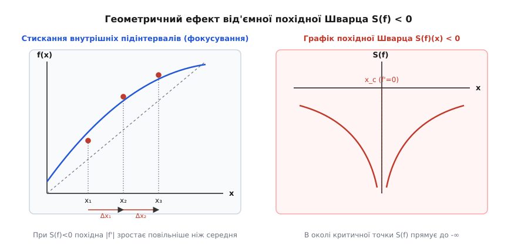
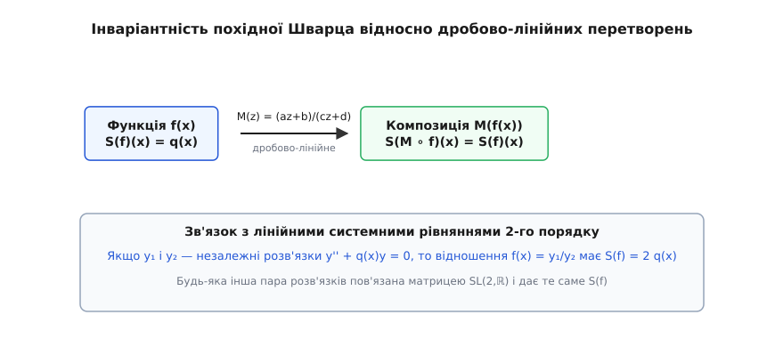
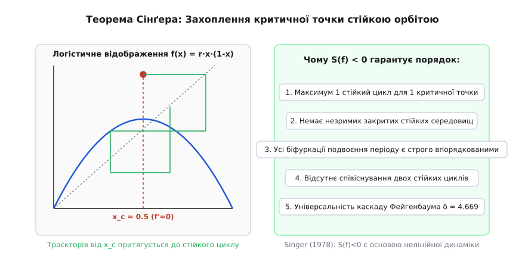
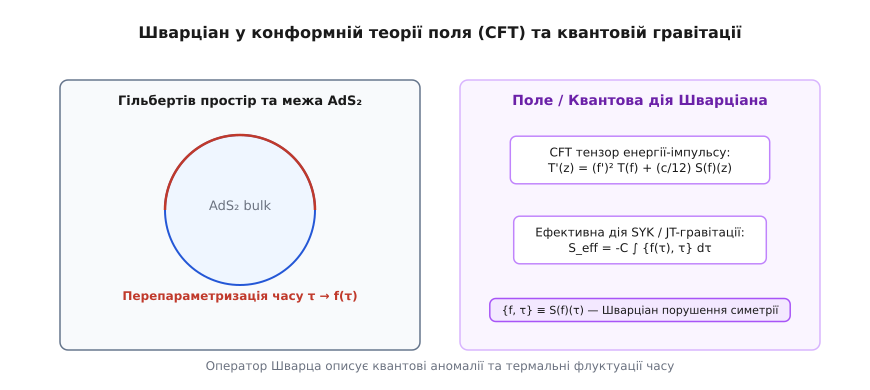

# Похідна Шварца

<preknowlist>
- [Похідна](book:math/derivative) — миттєва швидкість зміни величини та лінійна апроксимація.
- [Детермінований хаос](book:physics/mechanics/deterministic-chaos) — чутливість до початкових умов у нелінійних динамічних системах.
- [Каскад подвоєння періоду й стала Фейгенбаума](book:physics/mechanics/period-doubling-cascade) — універсальний сценарій переходу до хаосу через втрату стійкості періодичних орбіт.
</preknowlist>

Коли фізична система — від механічного осцилятора із нелінійним демпфуванням до капілярних хвиль на поверхні рідини, оптичного резонатора чи турбулентного змішування у гідродинаміці — підпорядковується дискретному закону еволюції `x[n+1] = f(x[n])`, швидкість локального розходження сусідніх фазових траєкторій вимірюється першою похідною `|f'(x)|`. Якщо локальне значення `|f'(x)| < 1`, фазовий об'єм у районі точки `x` стискається, і система стишується, прямуючи до стійкого стану рівноваги чи періодичного циклу. Натомість при `|f'(x)| > 1` близькі траєкторії експоненційно розбігаються, формуючи чутливість до початкових умов та детермінований хаос.

У багатьох класичних механічних системах із безперервним часом — таких як вимушений осцилятор Дуффінга, маятник із періодично коливальним підвісом або осцилятор Ван дер Поля — тривимірний фазовий простір завдяки сильній дисипації (в'язкому тертю) стрімко стискається до тонкого двовимірного атрактора. Якщо побудувати перетин Пуанкаре для такої системи, послідовність точок перетину фазової траєкторії з січною площиною часто лягає на вузьку криву, яку з високою точністю можна описати одновимірним відображенням `x[n+1] = f(x[n])`.

Проте самі лише перша `f'(x)` та друга `f''(x)` похідні не дають відповіді на фундаментальне питання динаміки: скільки саме стійких періодичних рухів може одночасно існувати у фізичної системи і чому прості системи з одним максимумом уникають катастрофічного накопичення незліченних співіснуючих атракторов? Дві функції з однаковими значеннями першої та другої похідних у даній точці можуть демонструвати абсолютно різну нелінійну поведінку: одна створює складну мережу співіснуючих стійких режимів, а інша строго обмежує систему єдиним впорядкованим атрактором.

Причина цієї відмінності полягає у вищій диференціальній кривизні фазового простору, яка описується нелінійним оператором третього порядку. Цей оператор називається похідною Шварца (або Шварціаном). Він вимірює відхилення функції від найпростішого конформного перетворення і задає суворі геодезичні обмеження на еволюцію фазового об'єму.

## 1. Геометричний зміст та нелінійне стискання фазових інтервалів

Уявімо малий фазовий інтервал `I = [x, x + Δx]`, який під дією нелінійного відображення `f` переходить у новий інтервал `f(I)`. Перша похідна `f'(x)` визначає лінійний коефіцієнт розтягування або стискання цього інтервалу. Якщо розглядати середню похідну на двох сусідніх підінтервалах однакової довжини `Δx₁ = [x - h, x]` та `Δx₂ = [x, x + h]`, друга похідна `f''(x)` описує асиметрію їх розтягування: один із підінтервалів подовжується сильніше за інший.

Однак при багаторазовому ітеруванні відображення `f(f(x))`, `f(f(f(x)))` вкрай важливо розуміти, як змінюється сама асиметрія відносно локального масштабу розтягування. Похідна Шварца об'єднує першу, другу та третю похідні функції `f(x)` у співвідношення:

```
S(f)(x) = f'''(x) / f'(x) - (3/2) · (f''(x) / f'(x))²
```

Щоб зрозуміти, чому оператор має саме таку нелінійну структуру з коефіцієнтом `-3/2`, розглянемо логарифм першої похідної `v(x) = ln|f'(x)|`. Величина `v(x)` являє собою локальну швидкість розтягування фазових координаційних інтервалів (так звану локальну показниковую величину типу Ляпунова). Знайдемо її першу та другу похідні за змінною `x`:

```
v'(x) = f''(x) / f'(x)
v''(x) = (f'''(x)·f'(x) - (f''(x))²) / (f'(x))² = f'''(x)/f'(x) - (f''(x)/f'(x))²
```

Підставляючи вирази для `v'(x)` та `v''(x)` у формулу оператора Шварца, отримуємо тотожне вираження через логарифмічні похідні:

```
S(f)(x)
= v''(x) - (1/2) · (v'(x))²    [зведення логарифмічних похідних]
```

З цієї логарифмічної форми чітко видно двоякий геометричний вплив оператора Шварца на фазовий простір:
1. Доданок `v''(x)` описує прискорення зміни масштабу. Якщо `v''(x) < 0`, швидкість розтягування досягає локального максимуму й починає спадати.
2. Доданок `-(1/2) · (v'(x))²` є **завжди від'ємним** незалежно від знака другої похідної `f''(x)`. Цей квадратичний член створює систематичний внесок у стискання фазових інтервалів: що сильніша первинна нелінійність `f''(x)`, то негативнішим стає внесок у похідну Шварца.


*Геометричний вплив від'ємного Шварціана S(f) < 0 на стискання фазового інтервалу та поведінку в околі критичної точки.*

Коли похідна Шварца є від'ємною `S(f)(x) < 0` на всьому інтервалі, функція `f(x)` володіє властивістю «фокусування»: вона стискає внутрішні підінтервали сильніше, ніж зовнішні. У результаті будь-яке повторне застосування відображення `fⁿ(x)` не створює нових локальних мінімумів швидкості розтягування, що запобігає неконтрольованому виникненню ізольованих стійких областей усередині фазового інтервалу.

Розглянемо допоміжну функцію `u(x) = (f'(x))⁻¹/²` на інтервалі, де `f'(x) > 0`. Продиференціюємо її двічі за змінною `x`:

```
u'(x) = (-1/2) · (f'(x))⁻³/² · f''(x)
u''(x) = (3/4) · (f'(x))⁻⁵/² · (f''(x))² - (1/2) · (f'(x))⁻³/² · f'''(x)
```

Звівши ці вирази до спільного знаменника та винісши співмножник `(-1/2) · (f'(x))⁻¹/²`, отримуємо фундаментальне зв'язуюче рівняння:

```
u''(x) = (-1/2) · u(x) · S(f)(x)
```

Оскільки `u(x) = (f'(x))⁻¹/² > 0`, умова `S(f)(x) < 0` повністю еквівалентна тому, що друга похідна `u''(x) > 0` є додатною на всьому інтервалі. У математичному аналізі функція із додатною другою похідною називається **суворо опуклою (convex)**.

Сувора опуклість `u(x)` означає, що її графік лежить нижче будь-якої хорди, яка з'єднує дві точки на кривій. Отже, функція `u(x)` не може мати локальних максимумів усередині інтервалу. Відповідно, величина `|f'(x)| = 1 / u²(x)` не може мати локальних мінімумів зі значеннями більшими за 1 усередині фазового інтервалу без проходження через критичні точки (де `f'(x) = 0`) або межі.

Аналітичне доведення властивостей опуклості та ланцюгових правил наведено у вставці [Математичні властивості оператора Шварца](book:physics/mechanics/schwarzian-derivative/math-schwarzian-properties.md).

## 2. Проєктивна інваріантність, групи Мьобіуса та геометрія Лобачевського

Головна алгебраїчна та фізична особливість похідної Шварца полягає у її фундаментальній симетрії відносно дробово-лінійних перетворень Мьобіуса:

```
M(x) = (a·x + b) / (c·x + d),    де a·d - b·c ≠ 0
```

Перетворення Мьобіуса складають групу проєктивних автоморфізмів комплексної сфери Рімана `SL(2,ℂ)` або дійсного проєктивного простору `SL(2,ℝ)`. Вони описують найзагальніший клас конформних деформацій, які переводять кола й прямі у кола й прямі, зберігаючи подвійні відношення чотирьох точок (cross-ratio):

```
(z₁, z₂; z₃, z₄) = ((z₁ - z₃)·(z₂ - z₄)) / ((z₂ - z₃)·(z₁ - z₄))
```

Обчислимо похідні перетворення Мьобіуса `M(x)` за допомогою послідовного диференціювання:

```
M'(x) = (a·d - b·c) / (c·x + d)²
M''(x) = -2·c·(a·d - b·c) / (c·x + d)³
M'''(x) = 6·c²·(a·d - b·c) / (c·x + d)⁴
```

Формуємо співвідношення похідних для оператора Шварца:

```
M'''(x) / M'(x) = 6·c² / (c·x + d)²
M''(x) / M'(x) = -2·c / (c·x + d)
```

Підставляємо знаходження у формулу Шварціана:

```
S(M)(x)
= 6·c² / (c·x + d)² - (3/2) · (-2·c / (c·x + d))²    [підстановка виразів]
= 6·c² / (c·x + d)² - 6·c² / (c·x + d)²              [обчислення 3/2 · 4 = 6]
= 0                                                   [тотожне обнулення]
```

Таким чином, похідна Шварца **тотожно дорівнює нулю** для будь-якого перетворення Мьобіуса. Подібно до того, як звичайна перша похідна `f'(x) = 0` означає константу, а друга похідна `f''(x) = 0` означає лінійну функцію `a·x + b`, тотожне обнулення похідної Шварца `S(f)(x) = 0` є необхідною й достатньою умовою того, що функція `f(x)` є дробово-лінійним перетворенням Мьобіуса.


*Збереження похідної Шварца при дробово-лінійних перетвореннях M(z) та зв'язок із рівнянням Шредінгера y'' + q(x)y = 0.*

Суперпозиція двох функцій `(f ∘ g)(x) = f(g(x))` підпорядковується нелінійному ланцюговому правилу (Chain Rule):

```
S(f ∘ g)(x) = S(f)(g(x)) · (g'(x))² + S(g)(x)
```

Якщо за функцію `f` ми візьмемо будь-яке перетворення Мьобіуса `M`, то оскільки `S(M) = 0`, отримуємо унікальну симетрію:

```
S(M ∘ g)(x) = S(g)(x)
```

Похідна Шварца є ліво-інваріантною відносно всієї групи `SL(2,ℝ)`. Фізично це означає, що Шварціан не чутливий до проєктування координат, зміни перспективи або стискання цільового фазового середовища через проєкційні лінзи. Він бачить виключно «внутрішню нелінійність» системи, очищену від проєктивних викривлень вимірювальних приладів.

Геометрично у неевклідовій геометрії Лобачевського на верхній півплощині Пуанкаре `H²` (із метрикою `ds² = (dx² + dy²) / y²`) перетворення Мьобіуса є точно ізометріями (рухами). Тому похідна Шварца прямо вимірює відхилення відображення від геодезичного руху в гіперболічному просторі.

Крім того, ланцюгове правило демонструє, що вираз `S(f)(z)·dz²` поводиться як квадратичний диференціал при конформній заміні змінних. Це робить оператор Шварца ключовим геодезичним об'єктом у теорії ріманових поверхонь, просторах Тейхмюллера та теорії струн.

### Простір Тейхмюллера та уніформізація Рімана

У математичній фізиці та теорії струн простір Тейхмюллера описує множину всіх можливих конформних структур на даній рімановій поверхні. Згідно з теоремою уніформізації Рімана, будь-яка однозв'язна ріманова поверхня конформно еквівалентна сфері Рімана, комплексій площині або верхній півплощині Пуанкаре `H²`.

Вторинне голоморфне вкладення простору Тейхмюллера у простір банахових квадратичних диференціалів (вкладення Берса) реалізується саме за допомогою оператора Шварца. Шварціан голоморфного відображення `S(f)` виступає як точна міра відхилення конформної поверхні від стандарту гіперболічної кривизни.

## 3. Зв'язок із рівнянням Шредінгера та потенціальним бар'єром

Існує глибокий математичний зв'язок між нелінійним оператором Шварца третього порядку та лінійними диференціальними рівняннями другого порядку. Розглянемо одновимірне стаціонарне рівняння Шредінгера (або канонічне рівняння Штурма-Ліувілля без першої похідної):

```
y''(x) + q(x)·y(x) = 0
```

Нехай `y₁(x)` та `y₂(x)` є двома лінійно незалежними розв'язками цього рівняння. Їхній вронськіан `W = y₁'·y₂ - y₁·y₂'` згідно з теоремою Ліувілля є сталою величиною (`W ≠ 0`). Складемо відношення цих двох розв'язків:

```
f(x) = y₁(x) / y₂(x)
```

Обчислимо першу, другу та третю похідні функції `f(x)`:

```
f'(x) = W / y₂²(x)
f''(x) = -2·W·y₂'(x) / y₂³(x)
f'''(x) = 2·W·q(x) / y₂²(x) + 6·W·(y₂'(x))² / y₂⁴(x)
```

Підставляючи ці похідні в оператор Шварца, отримуємо тотожне співвідношення:

```
S(f)(x)
= f'''(x) / f'(x) - (3/2) · (f''(x) / f'(x))²
= (2·q(x) + 6·(y₂'/y₂)²) - (3/2) · (-2·(y₂'/y₂))²    [зведення дробі]
= 2·q(x)                                              [тотожне скорочення]
```

Похідна Шварца від відношення двох незалежних розв'язків диференціального рівняння `y'' + q(x)y = 0` тотожно дорівнює **подвоєному потенціалу** `2·q(x)`.

Це фундаментальне співвідношення означає, що нелінійний неевклідовий оператор Шварца дозволяє лінеаризувати складновикривлені динамічні системи. Будь-яка проблема аналізу нелінійного відображення `f(x)` з відомим Шварціаном `S(f)(x) = 2·q(x)` еквівалентна вирішенню лінійного хвильового рівняння з потенційним бар'єром `q(x)`.

За допомогою цього зв'язку можна знаходити точні розв'язки для цілого класу нелінійних відображень, використовуючи квантовомеханічні потенціали Пошля-Теллера, гармонічного осцилятора чи Дорфмана. Наприклад, якщо `q(x) = -k²` є сталою величиною, розв'язки рівняння Шредінгера мають вигляд `y₁(x) = exp(k·x)` та `y₂(x) = exp(-k·x)`. Тоді відношення `f(x) = exp(2·k·x)` дає дробово-експоненціальну карту з точним значенням Шварціана `S(f)(x) = -2·k²`.

Крім того, похідна Шварца відіграє ключову роль у теорії нелінійних хвильових рівнянь, які можна інтегрувати методом оберненої задачі розсіювання. Зокрема, рівняння Кортевеґа–де Фріза Шварца (Schwarzian KdV equation):

```
∂f/∂t = S(f) · ∂f/∂x
```

є точним інваріантним узагальненням класичного рівняння KdV, що описує солітони на мілководді та нелінійні акустичні хвилі в плазмі. Через перетворення Міури рівняння Шварца-KdV зводиться до модифікованого рівняння mKdV `∂u/∂t + 6·u²·∂u/∂x + ∂³u/∂x³ = 0`.

Детальний аналіз історичного шляху розвитку концепції Шварціана — від праць Гаусса, Якобі та Шварца до робіт Пуанкаре — викладено у вставці [Історія похідної Шварца](book:physics/mechanics/schwarzian-derivative/hist-schwarzian.md).

## 4. Теорема Сінґера та обмеження на кількість атракторів

Найважливішим результатом застосування похідної Шварца у фізиці нелінійних процесів є теорема, доведена Девідом Сінґемом у 1978 році. Вона відповідає на одне з найглибших питань теорії динамічних систем: чому прості механічні системи з одним максимумом (наприклад, маятник із періодичним збудженням чи логістична карта) демонстративно уникають хаотичного співіснування нескінченної кількості стійких режимів?

Нехай `f: I → I` — тричі диференційоване відображення замкненого інтервалу `I` у себе. Точка `x_c` називається **критичною точкою**, якщо `f'(x_c) = 0`.

> **Теорема Сінґера (1978):** Якщо відображення `f` має від'ємну похідну Шварца `S(f)(x) < 0` для всіх `x ∈ I`, то басейн притягання будь-якої стійкої періодичної орбіти (включаючи нерухомі точки та періодичні цикли) обов'язково містить принаймні одну критичну точку `x_c` відображення `f` або межу інтервалу `I`.


*Захоплення орбіти критичної точки x_c = 0.5 стійким періодичним циклом за теоремою Сінґера.*

### Математичні та фізичні наслідки теореми Сінґера

1. **Кінцевість кількості стійких режимів:** Кількість стійких періодичних циклів одновимірного відображення не може перевищувати кількості його критичних точок плюс дві межі інтервалу.
2. **Єдиність атрактора для одномідальних карт:** Якщо система описується одномідальною функцією (наприклад, параболою `f(x) = r·x·(1-x)` з однією критичною точкою `x_c = 1/2`), то при будь-яких значеннях параметра `r` у системи існує **не більше одного** стійкого періодичного руху!
3. **Строга послідовність біфуркацій:** Неможливе раптове виникнення додаткового стійкого циклу «у порожнечі» фазового простору. Усі біфуркації подвоєння періоду відбуваються впорядковано, оскільки єдина критична точка `x_c` послідовно захоплюється новим нарощуваним орбітальним циклом.

### Аналітична перевірка умови Сінґера для фізичних відображень

Розглянемо класичне логістичне відображення `f(x) = r·x·(1-x)` на інтервалі `I = [0, 1]`:

```
f'(x) = r·(1 - 2·x)
f''(x) = -2·r
f'''(x) = 0
```

Підставляємо значення у формулу оператора Шварца:

```
S(f)(x)
= 0 / (r·(1 - 2·x)) - (3/2) · (-2·r / (r·(1 - 2·x)))²
= 0 - (3/2) · (4 / (1 - 2·x)²)                       [піднесення до квадрата]
= -6 / (1 - 2·x)² < 0                                [сувора від'ємність]
```

Значення `S(f)(x) = -6 / (1 - 2·x)²` є **суворо від'ємним** для всіх `x ≠ 1/2` незалежно від коефіцієнта `r`! Саме ця математична властивість гарантує суворий порядок у каскаді подвоєння періоду Фейгенбаума й виключає співіснування двох стійких режимів при одинакових зовнішніх силах.

Розглянемо інший важливий фізичний приклад — синусоїдальне відображення `f(x) = r·sin(π·x)`, яке описує кутові відхилення маятника та фазове захоплення в куперівських переходах Джозефсона:

```
f'(x) = r·π·cos(π·x)
f''(x) = -r·π²·sin(π·x)
f'''(x) = -r·π³·cos(π·x)
```

Обчислимо похідну Шварца для синусоїдального відображення:

```
f'''(x) / f'(x) = (-r·π³·cos(π·x)) / (r·π·cos(π·x)) = -π²            [скорочення спільних множників r·π·cos(π·x)]
f''(x) / f'(x) = (-r·π²·sin(π·x)) / (r·π·cos(π·x)) = -π·tg(π·x)       [визначення тальногенса sin/cos = tg]

S(f)(x)
= -π² - (3/2) · (-π·tg(π·x))²
= -π² - (3/2)·π²·tg²(π·x) < 0                                       [сувора від'ємність через tg² ≥ 0]
```

Оскільки `tg²(π·x) ≥ 0`, вираз `S(f)(x) = -π²·(1 + 1.5·tg²(π·x))` є **суворо від'ємним** на всьому відкритому інтервалі `(0, 1)`. Отже, синусоїдальне відображення також підпорядковується теоремі Сінґера, що пояснює універсальність поведінки Джозефсонівських контактів та нелінійних резонаторів.

Натомість, якщо ми розглянемо кубічне відображення `f(x) = r·x·(1 - x²)`, воно має дві критичні точки `x_c = ±1/√3`. Його похідна Шварца набуває вигляду:

```
f'(x) = r·(1 - 3·x²)
f''(x) = -6·r·x
f'''(x) = -6·r

S(f)(x) = -6 / (1 - 3·x²) - 1.5 · (-6·x / (1 - 3·x²))² = -6·(1 + 3·x²) / (1 - 3·x²)² < 0
```

Шварціан кубічного відображення також є від'ємним всюди, окрім критичних точок. Але оскільки критичних точок дві, це відображення може мати до двох різних стійких періодичних атракторів одночасно (мультистійкість), що спостерігається у нелінійних осциляторів з двома ямами потенціалу (осцилятор Дуффінга).

Дослідити практичну числову реалізацію аналізу Шварціана та перевірку теореми Сінґера можна у вставці [Чисельний аналізатор похідної Шварца та атракторів](book:physics/mechanics/schwarzian-derivative/proj-schwarzian-analyzer.md).

## 5. Шварціан у теорії поля, конформній гідродинаміці та квантовій гравітації

Значення похідної Шварца розповсюджується далеко за межі одновимірної класичної механіки. У сучасній теоретичній фізиці оператор Шварца виникає щоразу, коли неперервна симетрія перепараметризації координат спонтанно або аномально порушується.

### 2D Конформна теорія поля (CFT) та алгебра Вірасоро

У двовимірній конформній теорії поля тензор енергії-імпульсу `T(z)` описує локальний потік енергії та напружень. При конформній заміні координат `z → f(z)` квантові флуктуації вакууму викликають конформну аномалію. Закон перетворення тензора енергії-імпульсу набуває вигляду:

```
T'(z) = (f'(z))² · T(f(z)) + (c / 12) · S(f)(z)
```

де `c` — центральний заряд теорії (параметр, що вимірює кількість квантових ступенів вільності), а `S(f)(z)` — похідна Шварца. Аддітивний нелінійний член `(c/12)·S(f)(z)` є центральним розширенням алгебри Вірасоро. Без похідної Шварца було б неможливо розрахувати квантовий ефект Казимира або спектр випромінювання у двовимірній системі.


*Квантова дія Шварціана у теорії поля CFT, моделі SYK та двовимірній квантовій гравітації AdS₂.*

### Квантовий хаос, модель Зачдева-Є-Кітаєва (SYK) та квантова гравітація

У 2015 році в фізиці конденсованого стану та теорії чорних дір відбувся прорив, пов'язаний із моделлю Зачдева-Є-Кітаєва (SYK model) — системою квантових ферміонів із випадковим чотириточковим взаємодією. При низьких температурах ця модель демонструє конформну симетрію перепараметризації часу `τ → f(τ)`.

Проте ця конформна симетрія є спонтанно та явно порушеною. Ефективна квантова дія, яка описує м'які моди флуктуацій часу в моделі SYK та в двовимірній квантовій гравітації Джаківа-Тетельбойма (JT gravity на просторі Anti-de Sitter `AdS₂`), є безпосередньо **дією Шварціана**:

```
S_eff = -C ∫ {f(τ), τ} dτ    де {f, τ} ≡ S(f)(τ)
```

Інтеграл від похідної Шварца описує квантовий хаос із максимальним показником Ляпунова `λ_L = 2·π·k_B·T / ℏ`, який збігається з межею квантового хаосу чорних дір Малдасени-Шенкера-Стенфорда (MSS bound).

### Гідродинаміка двовимірних потенціальних течій

У гідромеханіці нестисливої рідини при обчисленні конформних відображень Шварца-Крістоффеля для течій у каналах із зламаними межами, похідна Шварца вимірює локальну концентрацію гідродинамічних напружень на гострих краях. Оскільки `S(f)` є нечутливою до масштабу, вона прямо визначає точки відриву примежового шару при обтіканні перешкод.

Для ознайомлення з програмним інтерфейсом бібліотеки аналізу нелінійних відображень та перевірки умов стійкості зверніться до вставки [Інтерфейс бібліотеки аналізу нелінійних відображень](book:physics/mechanics/schwarzian-derivative/api-schwarzian-solver.md).

## 6. Практичний вимірювально-обчислювальний блок

> 🔧 **Навіщо це.**
> Похідна Шварца є не просто теоретичною конструкцією, а потужним практичним діагностичним інструментом для інженерів-дослідників нелінійних механічних та електронних систем:
> 
> 1. **Діагностика стійкості нелінійних осциляторів:** При проектуванні прецизійних МЕМС-гіроскопів, віброгасників чи нелінійних підвісок автомобільних коліс аналіз похідної Шварца Пуанкаре-відображення дозволяє наперед визначити, чи здатна система генерувати небажане паразитне співіснування субгармонійних режимів. Якщо `S(f) < 0`, інженер має математичну гарантію відсутності «прихованих атракторів», які могли б спричинити раптовий аварійний резонанс.
> 
> 2. **Контроль переходу до хаосу в турбулентних струменях:** Під час моделювання змішування палива в реактивних двигунах або вихрового розпаду в гідротурбінах вимірювання Шварціана експериментального часового ряду дозволяє ідентифікувати, чи відбувається турбулізація через універсальний каскад Фейгенбаума, чи за рахунок квазіперіодичного сценарію Рюеля-Такенса.
> 
> 3. **Проектування цифрових генераторів псевдовипадкових чисел:** У фізичній криптографії нелінійні карти з `S(f) < 0` використовуються для створення детермінованих хаотичних генераторів шуму з рівномірною формою атрактора, які не мають «дірок» у фазовому просторі.

### Алгоритм чисельного розрахунку Шварціана за експериментальними даними

При обробці виміряних сигналів (наприклад, кутового зсуву резонатора чи тиску у турбулентній камері) похідна Шварца оцінюється за наступною методикою:

1. **Реконструкція відображення повернення (Return Map):** З експериментального часового ряду `x(t)` виділяються послідовні локальні максимуми `x[n]`. Побудова графіка `x[n+1] = f(x[n])` дає експериментальну функцію відображення.
2. **Сплайн-згладжування:** Оскільки третя похідна надзвичайно чутлива до високочастотного вимірювального шуму, дані апроксимуються згладжуючими кубічними сплайнами або B-сплайнами із регуляризацією Тихонова.
3. **Обчислення 5-точкових скінченно-різницевих похідних:** За розрахованим сплайном у вузлах сітки беруться значення першої `f'`, другої `f''` та третьої `f'''` похідних для формування підсумкового значення `S(f)`.

## 7. Порівняльний синтез та єдність концепцій

Підсумовуючи ролі похідної Шварца у різних галузях науки, побудуємо порівняльну структуру її фізичних та математичних проявів:

| Галузь | Роль та вираження оператора Шварца | Фізичний або геометричний наслідок |
| :--- | :--- | :--- |
| **Одновимірна динаміка** | `S(f) = f'''/f' - 1.5·(f''/f')² < 0` | Гарантія єдиності стійкого атрактора для одномідальних карт (Теорема Сінґера) |
| **Проєктивна геометрія** | `S(M) = 0` для `M(z) = (az+b)/(cz+d)` | Повна інваріантність відносно дробово-лінійних деформацій Мьобіуса `SL(2,ℝ)` |
| **Спектральна теорія** | `S(f) = 2·q(x)` для `f = y₁/y₂` у `y''+qy=0` | Зв'язок між конформними відображеннями та потенціалом у рівнянні Шредінгера |
| **Конформна теорія поля** | `T'(z) = (f')² T(f) + (c/12) S(f)(z)` | Квантова конформна аномалія та центральне розширення алгебри Вірасоро |
| **Квантова гравітація / SYK** | `S_eff = -C ∫ {f(τ), τ} dτ` | Опис м'яких мод порушення репараметризаційної симетрії часу та квантовий хаос |
| **Гідродинаміка течій** | `S(f)` у відображеннях Шварца-Крістоффеля | Визначення точок геометричного напруження та відриву примежового шару |

Таким чином, похідна Шварца є універсальним інваріантом нелінійності. Вона пов'язує гладку локальну геометрію із глобальною топологією фазового простору, забезпечуючи суворий математичний порядок у світі детермінованого хаосу.
