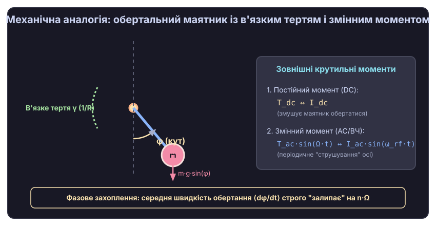
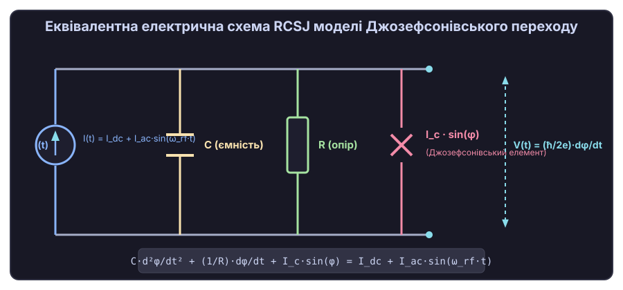
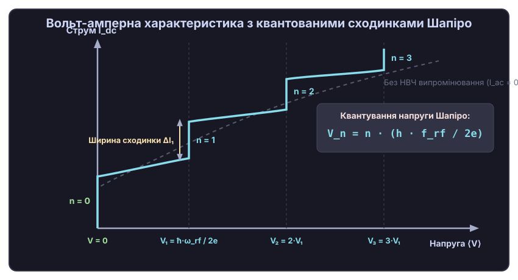
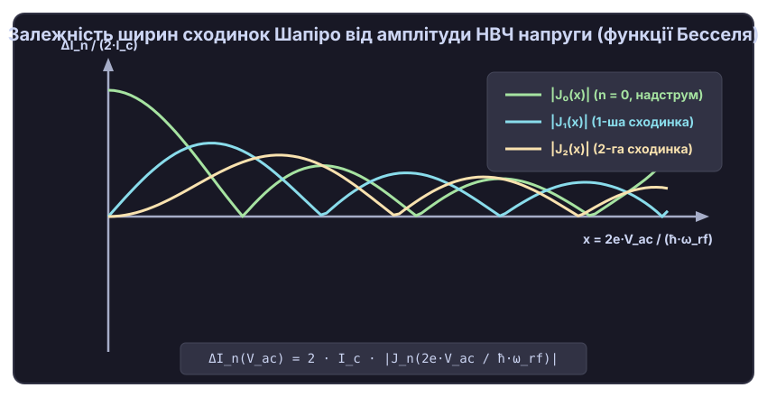
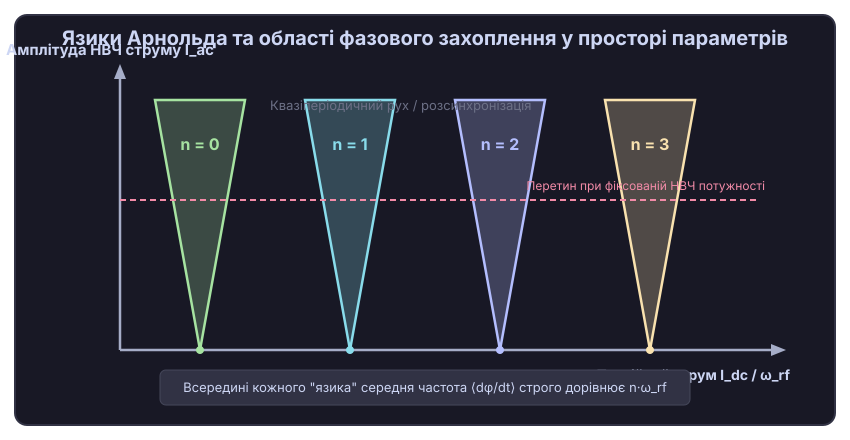

# Сходинки Шапіро та фазове захоплення

<preknowlist>
- [Джозефсонівський перехід](topic:physics/josephson-effect) — надпровідний тунельний контакт із залежністю надструму від фази I = I_c · sin(φ) та зв'язком напруги з фазою V = (ħ/2e)·dφ/dt.
- [Фазовий простір та лінеаризація систем](topic:physics/phase-portrait) — зображення стану системи через координату й швидкість, граничні цикли та стійкість руху.
- [Механічний резонанс та вимушені коливання](topic:physics/mechanical-resonance) — вимушений рух осцилятора під дією періодичної зовнішньої сили та зсув фази.
- [Язики Арнольда](topic:physics/arnold-tongues) — області фазового захоплення у просторі амплітуди та частоти зовнішнього збудження для нелінійних систем.
- [Функції Бесселя](topic:math/bessel-functions) — спеціальні функціональні розклади тригонометричних виразів зі змінним аргументом.
</preknowlist>

Якщо на надпровідний тунельний контакт — джозефсонівський перехід — подати постійний струм зсуву і одночасно обпромінити його електромагнітним полем надвисокої частоти (НВЧ), вольт-амперна характеристика приладу кардинально змінюється. Замість гладкої неперервної кривої на ній виникає серія абсолютно пласких горизонтальних плато — сходинок квантованої напруги. На кожній такій сходинці напруга на переході залишається суворо фіксованою, незалежно від того, як змінюється струм зсуву у певному інтервалі. Це явище, відкрите американським фізиком Сідні Шапіро у 1963 році, є макроскопічним проявом фазового захоплення (англ. *phase locking*) — квантово-механічної синхронізації внутрішнього руху куперівських пар із частотою зовнішньої електромагнітної хвилі.

Сходинки Шапіро (англ. *Shapiro steps*) поєднують у собі класичну теорію нелінійних коливань, механіку нелінійного маятника та фундаментальну квантову електродинаміку. Вони перетворили абстрактне теоретичне передбачення Браяна Джозефсона на абсолютний квантовий еталон напруги, що лежить в основі сучасної метрології.

### 1. Фізична природа ефекту Шапіро та макроскопічна квантова фаза

Щоб зрозуміти, чому неперервна зміна струму викликає дискретне квантування напруги, звернімося до фізичної картини надпровідного стану. У надпровіднику електропровідність забезпечується не поодинокими електронами, а зв'язаними куперівськими парами із зарядом `2e` та масою `2m_e`. Усі куперівські пари утворюють єдиний макроскопічний квантовий конденсат, який описується єдиною хвильовою функцією:

```
Ψ(r, t) = √(n_s(r, t)) · exp( i · φ(r, t) )
```

де `n_s` — густина надпровідних електронів, а `φ` — макроскопічна квантова фаза. Завдяки квантовій когерентності фаза `φ` є єдиною для всього надпровідного блоку. З квантово-механічної точки зору фаза `φ` та кількість куперівських пар `N` є канонічно спряженими змінними, що задовольняють співвідношенню невизначеностей `ΔN · Δφ ≥ 1/2`. У надпровідному стані флуктуації фази малі, а її середня величина визначає макроскопічний струм. Калібрувальна інваріантність градієнта фази `ħ ∇φ = 2m_e v_s + 2e A` безпосередньо пов'язує канонічний імпульс куперівських пар із магнітним векторним потенціалом `A`.

У 1962 році двадцятичотирирічний аспірант Кембриджа Браян Джозефсон теоретично довів, що якщо два надпровідники розділити тонким ізолюючим бар'єром завтовшки в кілька нанометрів (структура надпровідник-ізолятор-надпровідник, SIS), хвильові функції двох надпровідників перекриваються внаслідок квантово-механічного тунельного ефекту. При цьому виникають два фундаментальні ефекти Джозефсона.

Перше співвідношення показує, що бездисипативний надпровідний струм `I_J` визначається різницею фаз `φ = φ₁ - φ₂` по обидва боки бар'єра:

```
I_J(t) = I_c · sin(φ(t))
```

де `I_c` — критичний струм переходу, тобто максимальний надструм, який бар'єр може пропускати без падіння напруги. Величина `I_c` визначається джозефсонівською енергією зв'язку `E_J = (ħ · I_c / 2e)`, яка показує енергетичну вигідність фазового впорядкування.

Друге співвідношення Джозефсона пов'язує швидкість зміни цієї фази `dφ/dt` з електричною напругою `V(t)` на бар'єрі:

```
V(t) = (ħ / 2e) · dφ/dt = (Φ_0 / 2π) · dφ/dt
```

де `ħ = h / 2π` — зведена стала Планка, `e` — заряд електрона, а `Φ_0 = h / (2e) ≈ 2.0678 e-15 Вб` — квант магнітного потоку. Якщо до переходу прикладено постійну напругу `V_0`, фаза `φ(t)` починає лінійно зростати з часом зі швидкістю `dφ/dt = (2e/ħ) · V_0`. Підставляючи це у вираз для струму, дістаємо, що крізь перехід тече змінний надструм високої частоти:

```
I_J(t) = I_c · sin( (2e / ħ) · V_0 · t + φ_0 ) = I_c · sin( ω_J · t + φ_0 )
```

Ця внутрішня частота осциляцій `ω_J = (2e/ħ) · V_0` називається джозефсонівською частотою. Для напруги всього в 1 мікровольт (`1 μV`) частота змінного надструму становить близько 483.6 мегагерц. Джозефсонівський контакт є ідеальним квантовим конвертором напруги у частоту.

Коли на контакт одночасно діє зовнішнє НВЧ випромінювання частотою `ω_rf`, виникає взаємодія двох осцилюючих процесів: внутрішніх джозефсонівських коливань фази та зовнішнього електромагнітного поля. Нелінійність системи (яка ховається у функції `sin(φ)`) призводить до виникнення комбінаційних частот і биттів. Коли внутрішня частота `ω_J` наближається до цілочисельної гармоніки зовнішнього поля `n · ω_rf`, виникає явище нелінійного резонансу. Фаза `φ(t)` підлаштовується під зовнішнє поле і «захоплюється» ним: середня швидкість зміни фази за часом `⟨dφ/dt⟩` стає суворо рівною `n · ω_rf`.

Оскільки середня напруга `⟨V⟩` прямо пропорційна середній швидкості зміни фази, напруга на переході «залипає» на значеннях:

```
V_n = n · (ħ · ω_rf / 2e) = n · (h · f_rf / 2e)
```

де `n = 0, 1, 2, 3...` — цілий номер сходинки, а `f_rf = ω_rf / 2π` — частота НВЧ поля у герцах. Зміна постійного струму зсуву в певному діапазоні лише зміщує середній зсув фаз, але не може змінити частоту фазового захоплення. Це створює на кривій вольт-амперної характеристики абсолютно вертикальні (або горизонтальні, залежно від орієнтації осей) сходинки стабільної напруги. [Історію відкриття ефекту Сідні Шапіро та створення первинного еталона напруги](topic:physics/shapiro-steps/hist-shapiro-discovery.md) детально описано у відповідній історичній вставці.

### 2. Механічна аналогія: маятник у в'язкому середовищі та потенціал пральної дошки

Для побудови наочної фізичної інтуїції щодо фазового захоплення звернімося до класичної механічної аналогії. Рівняння динаміки фази Джозефсона математично тотожне рівнянню руху фізичного маятника, здатного здійснювати повні оберти навколо своєї осі.

Уявімо маятник маси `m` і довжини `L`, закріплений на підшипнику із в'язким тертям (коефіцієнт згасання `γ`), занурений у густу рідину. На вісь маятника діють два зовнішніх крутильних моменти:
1. Постійний момент `T_dc`, який норовить розкрутити маятник в один бік (аналог постійного струму зсуву `I_dc`).
2. Періодично змінний момент `T_ac · sin(Ω · t)`, який швидко струшує вісь маятника врівно-вправо (аналог НВЧ струму `I_ac · sin(ω_rf · t)`).

Кут відхилення маятника від нижнього положення `θ(t)` грає роль фази Джозефсона `φ(t)`, а кутова швидкість обертання `dθ/dt` відповідає електричній напрузі `V(t)`.


*Механічна модель Джозефсонівського переходу: обертальний маятник із в'язким тертям γ під дією постійного обертального моменту T_dc та змінного моменту T_ac·sin(Ω·t). Кут маятника φ(t) відповідає фазі переходу, а середня кутова швидкість ⟨dφ/dt⟩ — напрузі.*

Наочною геометричною людино-орієнтованою моделлю цього руху є так званий потенціал «пральної дошки» (англ. *tilted washboard potential*):

```
U(φ) = -E_J · cos(φ) - (ħ · I_dc / 2e) · φ
```

Потенціальний профіль являє собою похилу періодичну гребінку із синусоїдальними ямками й бар'єрами. Кут нахилу дошки визначається величиною постійного струму `I_dc`:
- При `I_dc < I_c` нахил малий, потенціал має локальні мінімуми. Кулька (стан системи) лежить у потенціальній ямці і лише коливається біля дна. Вона не може скотитися донизу. Це відповідає надпровідному стану без падіння напруги (`V = 0`, сходинка `n = 0`).
- При `I_dc > I_c` потенційні ямки зникають, потенціал стає монотонно спадним. Кулька починає безперервно котитися похилою дошкою вниз, перестрибуючи через періодичні горби. Швидкість її скочування відповідає вимірюваній напрузі `V`.

Коли на похилу дошку діє додаткове НВЧ збудження, профіль потенціалу починає періодично вертикально дихати й струшуватися. Кулька, що скочується, під дією цього струшування «вловлюється» в динамічну резонансну пастку: вона витрачає на подолання кожного горба рівно один (або `n`) періодів НВЧ струшування.

Розглянемо поведінку цієї механічної системи при поступовому збільшенні постійного моменту `T_dc`:
- **Режим спокою або малих коливань (`n = 0`).** Якщо постійний момент малий (`T_dc < m·g·L`), маятник не може здійснити повний оберт. Він лише коливається біля нижньої точки рівноваги. Середня кутова швидкість обертання дорівнює нулю `⟨dθ/dt⟩ = 0`. В електричному переході цьому відповідає надпровідний стан без падіння напруги (`V = 0`).
- **Вимушене фазове захоплення (`n = 1, 2...`).** Коли момент `T_dc` зростає, маятник починає безперервно обертатися в одному напрямку. У вільному стані швидкість обертання зростала б неперервно з ростом `T_dc`. Але під дією періодичного струшування `T_ac · sin(Ω · t)` виникає синхронізація! При невеликій зміні моменту `T_dc` маятник підлаштовує свій рух так, що за один повний період струшування `2π/Ω` він здійснює рівно один повний оберт (`2π` радіан), або два оберти (`4π`), або `n` обертів.
- **Діапазон стійкості (ширина сходинки).** Якщо ми трохи збільшимо або зменшимо постійний момент `T_dc`, середня швидкість обертання `⟨dθ/dt⟩` не зміниться — вона залишиться суворо рівною `n · Ω`. Зміна `T_dc` призведе лише до зміни фазового зсуву між моментами проходження маятником нижньої точки та максимальним поштовхом зовнішньої сили. Момент `T_dc` можна змінювати у певній інтервальній зоні `ΔT_n`, і маятник продовжуватиме обертатися з тією самою середньою кутовою швидкістю!

Цей механічний ефект пояснює, чому сходинки Шапіро мають скінченну ширину за струмом: зовнішній струм `I_dc` змінює кут зсуву фази, але не може вирвати систему з резонансної «пастки» фазового захоплення. Фізично таке фазове захоплення є аналогом синхронізації годинників Християна Гюйгенса, захоплення частоти в генераторах зі зворотним зв'язком та роботи електронних систем фазового автопідстроювання частоти (ФАПЧ / PLL, англ. *Phase-Locked Loop*).

У фазовому просторі `(φ, dφ/dt)` фазове захоплення зображується притягуючим граничним циклом (англ. *limit cycle*). Коли постійний струм зсуву `I_dc` знаходиться всередині інтервалу сходинки, фазова траєкторія замикається сама на себе за `n` періодів НВЧ поля, утворюючи стійку періодичну орбіту першого або вищого порядку.

### 3. Модель RCSJ: еквівалентна схема та рівняння динаміки

Для кількісного аналізу фізичних процесів у джозефсонівському переході використовують еквівалентну схему з паралельно з'єднаними опором та ємністю — модель RCSJ (англ. *Resistively and Capacitively Shunted Junction*), запропоновану у 1968 році Уолтером Маккамбером та Дональдом Стьюартом.

Реальний надпровідний контакт складається з двох надпровідних обкладок, розділених тонким шаром діелектрика (наприклад, оксиду алюмінію `Al₂O₃`). Ця геометрія природно утворює мікроскопічний планарний конденсатор із ємністю `C`. Крім того, при температурах вище абсолютного нуля або при напругах, вищих за енергетичну щілину надпровідника `Δ`, крізь контакт тунелюють не лише куперівські пари, а й звичайні одноелектронні квазічастинки, утворюючи нормальний опір `R`.


*Еквівалентна схема RCSJ моделі: ідеальний джозефсонівський елемент I_c·sin(φ), паралельний опір R та ємність C, підключені до джерела зовнішнього струму I(t) = I_dc + I_ac·sin(ω_rf·t).*

За першим законом Кірхгофа, повний струм `I(t)` від зовнішнього джерела дорівнює сумі трьох паралельних струмів:

```
I(t) = I_C(t) + I_R(t) + I_J(t)
```

Застосувавши співвідношення для кожного елемента:

```
I_C(t) = C · dV/dt = C · d/dt [ (ħ / 2e) · dφ/dt ] = (ħ · C / 2e) · d²φ/dt²
I_R(t) = V(t) / R = (ħ / 2e · R) · dφ/dt
I_J(t) = I_c · sin(φ)
```

Отримуємо підсумкове нелінійне диференціальне рівняння второго порядку для фази Джозефсона `φ(t)`:

```
(ħ · C / 2e) · d²φ/dt² + (ħ / 2e · R) · dφ/dt + I_c · sin(φ) = I_dc + I_ac · sin(ω_rf · t)
```

Для аналізу цього рівняння перейдемо до безрозмірних змінних. Введемо плазмову частоту переходу `ω_p` та безрозмірний час `τ`:

```
ω_p = √( 2e · I_c / (ħ · C) )
τ = ω_p · t
```

Поділивши все рівняння на критичний струм `I_c`, дістаємо безрозмірну форму диференціального рівняння RCSJ:

```
d²φ/dτ² + (1 / √β_c) · dφ/dτ + sin(φ) = i_dc + i_ac · sin(Ω · τ)
```

де введено безрозмірні параметри:
- `i_dc = I_dc / I_c` — безрозмірний постійний струм зсуву.
- `i_ac = I_ac / I_c` — безрозмірна амплітуда НВЧ струму.
- `Ω = ω_rf / ω_p` — безрозмірна частота зовнішньої НВЧ хвилі.
- `β_c` — безрозмірний параметр Маккамбера–Стьюарта:

```
β_c = (2e · I_c · R² · C / ħ) = (ω_p · R · C)²
```

Параметр `β_c` відіграє вирішальну роль у динаміці системи, визначаючи відносну роль інерції (ємності `C`) та згасання (дисипації через опір `R`):
1. **Передемпфований контакт (`β_c << 1`).** Ємність контакту мізерно мала. Інерційним членом `d²φ/dτ²` можна знехтувати, і рівняння зводиться до диференціального рівняння першого порядку. Вольт-амперна характеристика без НВЧ поля є однозначною та безгістерезисною. Сходинки Шапіро в цьому режимі є монотонними та максимально стабільними.
2. **Слабкодемпфований контакт (`β_c >> 1`).** Ємність велика, система має значну «інерцію». На ВАХ виникає сильний динамічний гістерезис між кривою переходу у нормальний стан та кривою повернення у надпровідний стан. При обпроміненні НВЧ полем у таких переходах можуть виникати субгармонійні сходинки, хаотичні коливання та складна багатостабільна динаміка.

### 4. Механізм фазового захоплення та виведення напруг Шапіро

Розглянемо фізичний механізм виникнення сходинок Шапіро в умовах режиму фіксованої напруги (англ. *voltage-bias regime*), коли амплітуда НВЧ поля є достатньо високою, щоб визначати напругу на контактах.

Нехай напруга на переході містить постійну складову `V_0` та змінну НВЧ складову з амплітудою `V_ac`:

```
V(t) = V_0 + V_ac · cos(ω_rf · t)
```

Інтегруючи друге співвідношення Джозефсона `dφ/dt = (2e/ħ) · V(t)` за часом, отримуємо часову залежність фази:

```
φ(t) = φ_0 + (2e · V_0 / ħ) · t + (2e · V_ac / (ħ · ω_rf)) · sin(ω_rf · t)
```

Позначимо середню джозефсонівську частоту `ω_J = 2e · V_0 / ħ` та безрозмірний параметр НВЧ амплітуди `x = 2e · V_ac / (ħ · ω_rf)`. Підставимо цю фазу у вираз для надпровідного струму `I_J(t) = I_c · sin(φ(t))`:

```
I_J(t) = I_c · sin( φ_0 + ω_J · t + x · sin(ω_rf · t) )
```

Для розкриття синуса від синусоїдального аргументу використаємо математичний розклад Якобі–Ангера через функції Бесселя першого роду `J_n(x)`:

```
sin( α + x · sin(β) ) = Σ [n = -∞..+∞] J_n(x) · sin( α + n · β )
```

Застосувавши цей розклад до нашого виразу струму, дістаємо суму нескінченної кількості гармонік:

```
I_J(t) = I_c · Σ [n = -∞..+∞] (-1)^n · J_n(x) · sin( φ_0 + (ω_J - n · ω_rf) · t )
```

Аналізуючи цей результат, бачимо, що струм складається з безлічі осцилюючих членів із комбінаційними частотами `ω_J - n · ω_rf`.

З квантово-механічної точки зору, параметр `x = 2e · V_ac / (ħ · ω_rf)` виражає відношення енергії зв'язку НВЧ фотонів до фотонної квантової енергії `ħ · ω_rf`. Кожна функція Бесселя `J_n(x)` описує амплітуду ймовірності того, що куперівська пара із зарядом `2e` випромінить або поглине `n` НВЧ фотонів під час тунелювання крізь потенціальний бар'єр. Закон збереження енергії для такого фотонно-асистованого тунелювання вимагає:

```
2e · V_n = n · ħ · ω_rf
```

Обчислимо середнє значення надпровідного струму за часом `⟨I_J(t)⟩`. Для більшості довільних значень напруги `V_0` частота `ω_J - n · ω_rf` не дорівнює нулю, і відповідний гармонічний член при усередненні за часом дає нуль:

```
⟨ sin( (ω_J - n · ω_rf) · t ) ⟩ = 0     при  ω_J ≠ n · ω_rf
```

Проте, якщо постійна напруга `V_0` набуває точно резонансного значення `V_n`, при якому джозефсонівська частота стає кратною частоті НВЧ випромінювання:

```
ω_J = n · ω_rf  ==>  (2e / ħ) · V_n = n · ω_rf
```

то для відповідного додатка з номером `n` часова залежність під синусом повністю зникає (`(ω_J - n · ω_rf) · t = 0`)! Осцилюючий член перетворюється на стаціонарний постійний струм:

```
I_dc(n) = I_c · (-1)^n · J_n(x) · sin(φ_0)
```

Початкова фаза `φ_0` в умовах експерименту регулюється під дією зовнішнього струму зсуву. Вона може вільно змінюватися в межах від `-π/2` до `+π/2`, за рахунок чого вираз `sin(φ_0)` набуває будь-яких значень у діапазоні від `-1` до `+1`.

Це означає, що при напрузі `V_n` надпровідний контакт може пропускати додатковий постійний струм без зміни цієї напруги! Виникає вертикальна сходинка струму. Повна ширина струмового плато `n`-ї сходинки Шапіро `ΔI_n` дорівнює подвоєній амплітуді цього внеску:

```
ΔI_n = 2 · I_c · | J_n( 2e · V_ac / (ħ · ω_rf) ) |
```

Строгий алгебраїчний розклад цього виразу та [детальний математичний вивід ширин сходинок Шапіро через функції Бесселя](topic:physics/shapiro-steps/math-rcsj-phaselocking.md) наведено у розрахунковій математичній вставці.

### 5. Анатомія вольт-амперної характеристики та залежність від НВЧ потужності

На вольт-амперній характеристиці (ВАХ) джозефсонівського переходу під дією НВЧ випромінювання виникає ціле сімейство квантованих сходинок.


*Вольт-амперна характеристика (ВАХ) джозефсонівського контакту. Пунктирна сіра лінія — ВАХ без випромінювання (I_ac = 0). Суцільна блакитна лінія — ВАХ під дією НВЧ поля: виникають горизонтальні плато квантованої напруги V_n = n·(h·f_rf / 2e) із шириною сходинки ΔI_n.*

Розглянемо анатомічні деталі побудови ВАХ:
- **Нульова сходинка (`n = 0`).** Напруга `V = 0`. Це звичайний бездисипативний надструм Джозефсона. Під дією НВЧ поля ширина нульової сходинки подавляється відповідно до функції Бесселя нульового порядку: `ΔI_0 = 2 · I_c · |J_0(x)|`. При першому корінь функції Бесселя (`x ≈ 2.405`) критичний надструм повністю зникає, після чого знову з'являється при вищих потужностях.
- **Перша сходинка (`n = 1`).** Напруга дорівнює фундаментальному кванту `V_1 = h · f_rf / 2e`. Для стандартної частоти НВЧ генератора `f_rf = 70 ГГц` напруга першої сходинки становить приблизно `144.6 мікровольта` (`144.6 μV`). Ширина першої сходинки описується функцією `|J_1(x)|`.
- **Вищі цілочисельні сходинки (`n = 2, 3, 4...`).** Напруги розташовані на строго рівновіддалених інтервалах `V_n = n · V_1`.
- **Залежність від амплітуди НВЧ поля.** Оскільки ширина кожної сходинки `ΔI_n` пропорційна відповідній функції Бесселя `|J_n(x)|`, зі зміною потужності НВЧ випромінювання (яка пропорційна `V_ac²`, а отже `x²`) ширини сходинок осцилюють.


*Осцилююча залежність нормованої ширини сходинок Шапіро ΔI_n / (2·I_c) від безрозмірної амплітуди НВЧ напруги x = 2e·V_ac / (ħ·ω_rf). Криві відповідають абсолютним значенням функцій Бесселя |J_0(x)|, |J_1(x)| та |J_2(x)|.*

Ці осциляції ширин сходинок є чудовим експериментальним підтвердженням квантово-механічної теорії переходу: змінюючи рівень НВЧ потужності генератора, експериментатор може згасити першу сходинку до нуля або, навпаки, максимізувати ширину другої чи третьої сходинки.

### 6. Язики Арнольда та нелінійна динаміка фазового захоплення

З точки зору загальної теорії нелінійних динамічних систем, сходинки Шапіро являють собою класичний приклад зрізу язиків Арнольда (англ. *Arnold tongues*) у просторі параметрів збудженого осцилятора.

Якщо побудувати двовимірну карту стійкості, де по осі абсцис відкладено постійний струм зсуву `i_dc` (або відношення джозефсонівської частоти до НВЧ частоти `ω_J / ω_rf`), а по осі ординат — амплітуду НВЧ струму `i_ac`, області фазового захоплення утворюють характерні V-подібні клини, що розширюються вгору.


*Діаграма простору параметрів (струм зсуву i_dc проти НВЧ амплітуди i_ac). V-подібні клиноподібні області ("язики Арнольда") відповідають зонам фазового захоплення з фіксованим цілим числом обертання ⟨dφ/dt⟩ / ω_rf = n. Поза язиками динаміка є квазіперіодичною або хаотичною.*

Кожен язик Арнольда відповідає точній резонансній синхронізації з цілочисельним числом обертання (англ. *winding number* або *rotation number*):

```
W = lim [τ -> ∞] ( φ(τ) / (Ω · τ) ) = n
```

Всередині `n`-го язика Арнольда число обертання `W` залишається строго постійним і дорівнює `n`, що й дає пласку сходинку Шапіро `V_n`. Між сусідніми язиками Арнольда середня частота змінюється неперервно, а рух фази стає квазіперіодичним (несумірним).

#### Дробові (субгармонійні) сходинки Шапіро
У переходах із несинусоїдальною залежністю надструму від фази (наприклад, у контакта з високою прозорістю бар'єра чи у надпровідних мікромістках, де струмо-фазова залежність згідно з теорією Кулика–Омельянчука містить вищі гармоніки `sin(2φ)`, `sin(3φ)`), крім цілочисельних сходинок виникають дробові сходинки Шапіро при раціональних значеннях чисел обертання:

```
V_{n/m} = (n / m) · (h · f_rf / 2e)
```

де `n` та `m` — взаємно прості цілі числа (наприклад, `1/2`, `3/2`, `2/3`). Виникнення повного фрактального набору таких дробових сходинок приводить до утворення математичного об'єкта, відомого як «драбина диявола» (англ. *devil's staircase*) — неперервної монотонної функції, яка майже скрізь складається з горизонтальних плато раціональних значень.

#### Хаос та біфуркації у слабкодемпфованих переходах
У слабкодемпфованих джозефсонівських переходах (`β_c > 1`) наявність второго порядку за часом у рівнянні RCSJ створює тривимірний фазовий простір `(φ, dφ/dτ, τ)`. Під дією потужного НВЧ поля в такій системі виникають каскади біфуркацій подвоєння періоду, субгармонійні резонанси та детермінований хаос. У хаотичному режимі фазове захоплення руйнується, на ВАХ з'являються шумові сплески, а сходинки Шапіро розмиваються і перекриваються, демонструючи гістерезисні стрибки. Математично цей перехід описується через відображення Стандартного Чирикова (англ. *Chirikov standard map*), де параметр хаотичності перевищує критичне значення `K_c ≈ 0.971635`.

Явище фазового захоплення у джозефсонівських переходах знайшло широкий ужиток у радіоастрономії та надвисокочастотній техніці: на ньому базуються джозефсонівські змішувачі частот для субміліметрових телескопів (наприклад, обсерваторії ALMA), високочутливі SQUID-магнітометри та надпровідні параметричні підсилювачі.

### 7. Чисельне моделювання ефекту Шапіро

Оскільки аналітичні вирази через функції Бесселя отримано в наближенні фіксованої напруги, для точного розрахунку ВАХ реального переходу у режимі заданого струму (англ. *current-bias regime*) необхідне чисельне інтегрування рівняння RCSJ.

Рівняння другого порядку зводиться до системи двох рівнянь першого порядку для фази `φ` та безрозмірної напруги `v = dφ/dτ`:

```
dφ/dτ = v
dv/dτ = i_dc + i_ac · sin(Ω · τ) - sin(φ) - (1 / √β_c) · v
```

Інтегрування здійснюється алгоритмом Рунге–Кутти 4-го порядку (RK4). Для одержання точної ВАХ проводиться сканування за параметром `i_dc`. На кожному кроці струму чисельний соловер виконує два етапи:
1. **Релаксація перехідного процесу (`N_transient`).** Система інтегрується протягом кількох сотень періодів НВЧ поля `2π/Ω`, щоб траєкторія зійшла з початкових умов і осіла на атрактор (граничний цикл).
2. **Накопичення та усереднення (`N_eval`).** Проводиться підсумовування значень миттєвої напруги `v` протягом тривалого інтервалу часу для обчислення точного середнього значення `⟨v⟩ = ⟨dφ/dτ⟩`.

Крім того, за скінченних температур реальні експерименти вимагають урахування флуктуацій. У рівняння додають випадкове термічне поле Ланжевена `i_th(τ)`, яке моделює шум Джонсона–Найквіста в опорі `R`. Амплитуда термічного шуму визначається безрозмірним параметром `Γ = 2e · k_B · T / (ħ · I_c)`. Термічний шум приводить до розмиття гострих країв сходинок Шапіро та виникнення скінченного нахилу плато.

[Практичний алгоритм чисельного розв'язувача RCSJ рівняння з кодом на Python, C та C++](topic:physics/shapiro-steps/proj-shapiro-simulation.md) розібрано у відповідному розрахунковому проєкті.

### 8. Революція у метрології: квантовий еталон Вольта

Відкриття сходинок Шапіро призвело до фундаментального перевороту в міжнародній метрології. До 1970-х років еталон Вольта базувався на хімічних нормальних елементах Вестона — вологих гальванічних батареях, напруга яких дрейфувала з часом через старіння хімічних реактивів і залежала від температури.

Сходинки Шапіро надали можливість зв'язати електричну напругу з фундаментальними константами природи `h` та `e` і частотою атомного годинника:

```
V = n · f_rf / K_J
```

де `K_J = 2e / h` — константа Джозефсона. У 2019 році після редефініції системи одиниць SI, коли значення `h` та `e` зафіксували точними числами, сходинки Шапіро стали не просто опосередкованим еталоном, а строгою первинною реалізацією Вольта у Всесвіті.

#### Сучасні джозефсонівські стандарти напруги (JVS, PJVS та ACJVS)
Один джозефсонівський перехід при НВЧ обпроміненні на частоті 70 ГГц дає сходинки напруги близько `144.6 μV`. Для створення еталонів практичного рівня `1 В` або `10 В` мікроелектронними методами виготовляють великі інтегральні чипи, що містять масиви з десятків і сотень тисяч послідовно з'єднаних джозефсонівських переходів.

1. **Класичний стандарт (Conventional JVS).** Використовує SIS-переходи з нульовим струмовим зсувом (англ. *zero-bias steps*). Масив із 20 000 переходів під дією НВЧ поля генерує точну напругу 10 В. Недоліком є чутливість до електромагнітних завад: випадковий шум може перекинути масив на інший номер сходинки `n`.
2. **Програмований стандарт (PJVS).** Використовує негістерезисні SNS-переходи з нормальним металевим бар'єром. Переходи об'єднують у бінарно-зважені сегменти (наприклад, 1, 2, 4, 8, 16... переходів). Подаючи індивідуальні струми зсуву на окремі сегменти, метрологи можуть за мікросекунди запрямувати кожен сегмент на сходинку `n = +1`, `n = 0` або `n = -1`. Це дозволяє програмувати будь-яке точне значення напруги від `-10 В` до `+10 В` з відносною похибкою менше `10⁻¹¹`.
3. **Імпульсний динамічний еталон (ACJVS).** Для синтезу чистих синусоїдальних напруг змінного струму застосовують масиви, які керуються послідовністю високоефективних НВЧ імпульсів від оптичних фотодетекторів. Це дозволяє створювати первинний квантовий еталон для вимірювання змінної напруги та потужності.

Для виключення термо-ЕРС провідників вимірювальні лабораторії застосовують методику перемикання полярності: напруга обчислюється як піврізниця позитивного та негативного станів `(V(+) - V(-)) / 2`.

[Специфікацію метрологічних чипів JVS/PJVS та програмований C/C++ інтерфейс керування еталоном напруги](topic:physics/shapiro-steps/api-josephson-standard.md) детально подано у довідникові API.

### 9. Підсумок: зв'язок квантової фази та макроскопічної механіки

Сходинки Шапіро є яскравим прикладом того, як фундаментальні квантові закони мікросвіту макроскопічно виявляються через поняття нелінійної механіки.

Динаміка куперівських пар у надпровідному контакті підпорядковується тим самим законам фазового захоплення та синхронізації, що й класичний обертальний маятник у в'язкому середовищі під дією зовнішнього періодичного моменту, системі фазового автопідстроювання частоти в радіотехніці чи синхронізації лазерних модових генераторів. Завдяки строгості квантового зв'язку між напругою та швидкістю зміни фази, ефект Шапіро перетворює вимірювання напруги на вимірювання частоти, надаючи сучасній цивілізації найточніший метрологічний інструмент вимірювання електричних величин. Від механіки нелінійного маятника до субатомного тунелювання куперівських пар, сходинки Шапіро демонструють глибоку єдність фізичних законів Природи.
